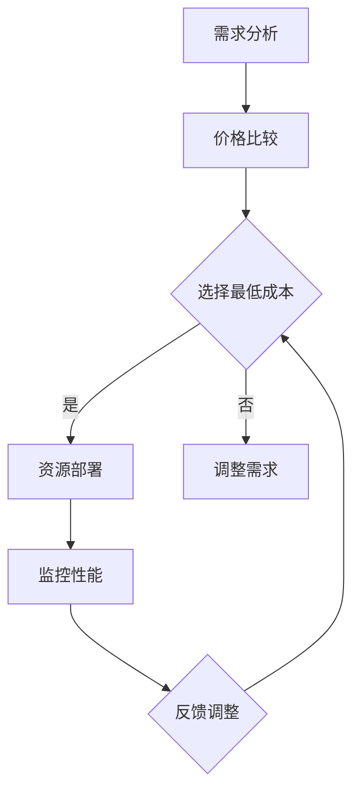
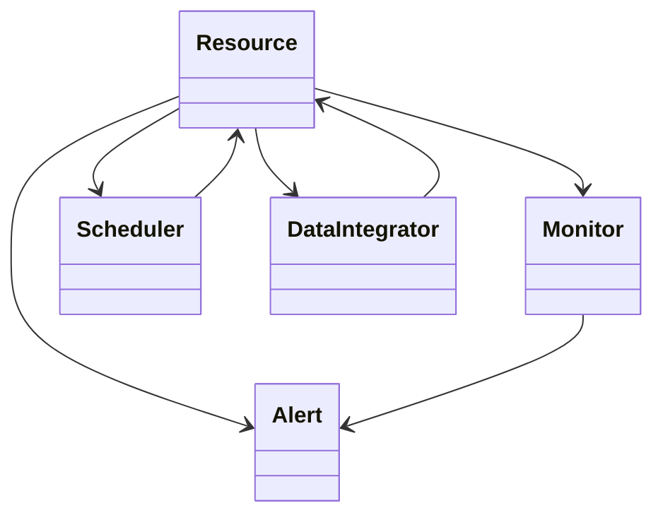
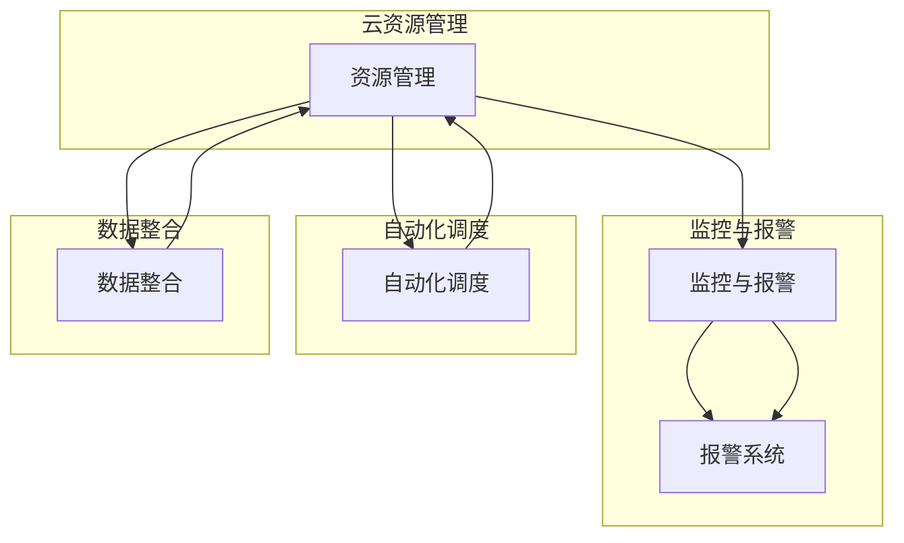
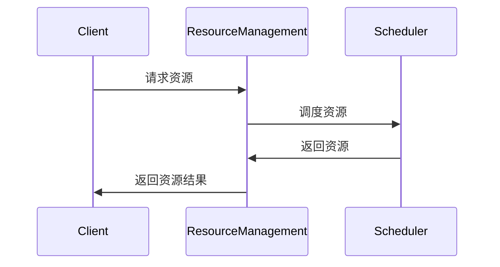
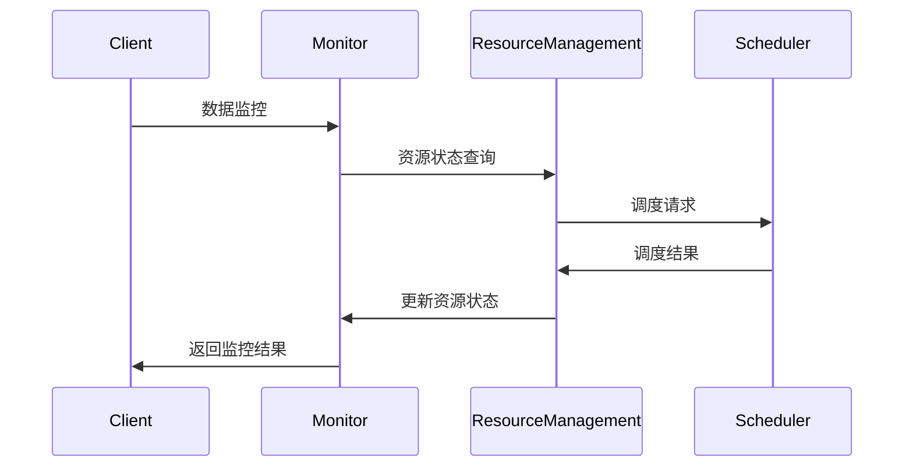

                 


# 多云和混合云策略：灵活的云资源调度

> 关键词：多云，混合云，云资源调度，策略，灵活

> 摘要：本文将探讨多云和混合云的概念、优势与挑战，以及如何通过灵活的云资源调度策略来最大化利用云资源，提高企业IT系统的可靠性和效率。

## 引言

随着云计算技术的迅猛发展，越来越多的企业开始将业务迁移到云端。而多云和混合云策略逐渐成为企业提升IT基础设施灵活性和扩展性的首选方案。本文将深入分析多云和混合云策略，并探讨如何通过灵活的云资源调度来实现最佳性能。

### 多云和混合云的定义

**多云（Multi-Cloud）**：指企业同时使用两个或多个不同云服务提供商的服务，这些提供商可能包括公共云、私有云或专有云。

**混合云（Hybrid Cloud）**：指将企业内部的数据中心与云服务提供商的资源进行整合，以实现数据的无缝流动和业务的灵活部署。

### 多云和混合云的重要性

1. **提高可靠性**：通过将应用程序分布在不同的云服务提供商中，企业可以减少单点故障的风险，提高系统的可用性。
2. **降低成本**：企业可以根据需求动态调整资源使用，优化成本。
3. **增强灵活性**：企业可以根据业务需求选择最适合的云服务提供商，灵活调整IT基础设施。
4. **促进创新**：多云和混合云策略为企业提供了更广阔的技术选择，有助于推动创新。

## 核心概念与技术原理

### 多云和混合云的优势与挑战

**优势：**

1. **灵活性**：企业可以根据需求选择不同的云服务提供商，灵活调整资源。
2. **高可用性**：通过分布式部署，减少单点故障，提高系统的可靠性。
3. **成本优化**：根据实际需求动态调整资源使用，降低成本。

**挑战：**

1. **管理复杂性**：多云和混合云环境下，需要更复杂的管理策略和工具。
2. **数据整合**：如何在不同云服务提供商之间实现数据的一致性和可靠性。
3. **安全性**：确保数据在跨云环境中的安全性。

### 技术原理

**云服务模型：**

- **IaaS（基础设施即服务）**：提供虚拟化资源，如虚拟机、存储和网络。
- **PaaS（平台即服务）**：提供开发平台和工具，如数据库、中间件和开发框架。
- **SaaS（软件即服务）**：提供完整的软件应用程序，如电子邮件、协作工具和企业资源规划（ERP）系统。

**部署模式：**

- **公有云**：云资源由第三方服务提供商提供，多个企业共享。
- **私有云**：云资源仅供单个企业使用，具有更高的安全性和可控性。
- **专有云**：混合云中的一部分，提供类似私有云的安全性和可控性，但与公有云共享基础设施。

**网络拓扑：**

- **混合连接**：通过VPN、Direct Connect等技术，将企业内部网络与云服务提供商的网络连接起来。
- **边缘计算**：在靠近数据源的地方进行数据处理，减少延迟和网络带宽消耗。

### 核心概念联系

**ER实体关系图架构：**

```mermaid
erDiagram
  CloudServiceProvider ||--o{ Application : 使用}
  Application ||--o{ DataCenter : 存储数据}
  DataCenter ||--o{ Network : 连接网络}
```

## 算法原理讲解

### 资源调度算法

**资源调度算法**是多云和混合云策略中的关键组成部分，其目标是在不同的云服务提供商之间动态分配资源，以最大化性能和降低成本。以下是几种常用的资源调度算法：

1. **基于需求的资源调度**：根据应用程序的实际需求动态调整资源分配。例如，在流量高峰期间增加虚拟机的数量，在低谷期减少虚拟机数量。

2. **成本优化调度**：通过比较不同云服务提供商的价格，选择成本最低的资源进行部署。

3. **混合云调度**：将工作负载在私有云和公有云之间进行优化分配，以实现性能和成本的平衡。

### 算法流程图



### 算法原理讲解

**基于需求的资源调度算法**的原理是，根据应用程序的实际运行情况（如CPU使用率、内存使用率、网络流量等）来动态调整虚拟机的数量。这可以通过监控工具实时获取应用程序的运行状态，并根据预设的阈值来决定是否增加或减少虚拟机。

**成本优化调度算法**的原理是通过比较不同云服务提供商的价格，选择成本最低的资源进行部署。这可以通过自动化工具来实现，例如使用云服务提供商的API来获取价格信息，并自动选择最佳资源。

**混合云调度算法**的原理是，将工作负载在私有云和公有云之间进行优化分配，以实现性能和成本的平衡。私有云通常具有更高的安全性和可控性，但成本较高；而公有云则提供更高的性能和灵活性，但成本较低。混合云调度算法可以根据实际需求，将关键任务部署在私有云上，将非关键任务部署在公有云上，从而实现最优的成本和性能平衡。

### 数学模型与公式

**基于需求的资源调度算法**的数学模型如下：

$$
C(t) = \sum_{i=1}^{n} P_i \times r_i(t)
$$

其中，$C(t)$ 表示总成本，$P_i$ 表示第 $i$ 个云服务提供商的价格，$r_i(t)$ 表示第 $i$ 个云服务提供商在时间 $t$ 的资源利用率。

**成本优化调度算法**的数学模型如下：

$$
C_{\text{min}} = \min_{i} \left( \sum_{i=1}^{n} P_i \times r_i \right)
$$

其中，$C_{\text{min}}$ 表示总成本的最小值。

**混合云调度算法**的数学模型如下：

$$
C_{\text{hybrid}} = w_1 \times C_{\text{private}} + (1 - w_1) \times C_{\text{public}}
$$

其中，$C_{\text{private}}$ 表示私有云的总成本，$C_{\text{public}}$ 表示公有云的总成本，$w_1$ 表示私有云的比例。

### 举例说明

假设有两个云服务提供商A和B，它们的价格和资源利用率如下：

| 服务提供商 | 价格（元/小时） | 资源利用率 |
| :-------: | :-------: | :-------: |
|    A     |     1.5    |    0.8    |
|    B     |     1.2    |    0.9    |

**基于需求的资源调度算法**：

假设当前时间点，云服务提供商A的利用率低于阈值，而云服务提供商B的利用率高于阈值。因此，可以增加云服务提供商A的虚拟机数量，减少云服务提供商B的虚拟机数量。

**成本优化调度算法**：

通过比较价格和资源利用率，发现云服务提供商B的价格较低，因此选择云服务提供商B进行资源部署。

**混合云调度算法**：

假设企业更倾向于使用私有云，私有云比例为60%，公有云比例为40%。因此，计算总成本如下：

$$
C_{\text{hybrid}} = 0.6 \times 1.5 + 0.4 \times 1.2 = 1.22 \text{元/小时}
$$

## 系统分析与架构设计方案

### 问题场景介绍

随着业务的发展，企业需要处理的海量数据不断增加，同时需要支持多种业务需求。为了满足这些需求，企业决定采用多云和混合云策略，将核心业务部署在私有云上，将非核心业务部署在公有云上。

### 项目介绍

本项目旨在设计并实现一个多云和混合云系统，支持企业的业务需求。系统主要包括以下几个功能模块：

1. **资源管理**：负责管理私有云和公有云的资源，包括虚拟机、存储和网络。
2. **监控与报警**：实时监控系统的运行状态，并在异常情况下发送报警通知。
3. **自动化调度**：根据业务需求和资源利用率，自动调整虚拟机数量和资源分配。
4. **数据整合**：确保数据在不同云环境之间的传输和一致性。

### 系统功能设计（领域模型类图）



### 系统架构设计（架构图）



### 系统接口设计



### 系统交互（序列图）



## 项目实战

### 环境安装

1. **安装Docker**：在本地机器上安装Docker，用于容器化部署应用程序。
2. **安装Kubernetes**：在本地机器上安装Kubernetes，用于管理容器化应用程序。
3. **配置云服务提供商**：配置云服务提供商的API密钥，以便在Kubernetes集群中部署应用程序。

### 系统核心实现源代码

```python
# 资源管理模块
class ResourceManager:
    def __init__(self, providers):
        self.providers = providers

    def allocate_resources(self, resource_requirements):
        # 根据资源需求，选择最优的云服务提供商
        # 调用云服务提供商的API进行资源分配
        pass

# 自动化调度模块
class Scheduler:
    def __init__(self, resource_manager):
        self.resource_manager = resource_manager

    def schedule_resources(self, workload):
        # 根据工作负载，动态调整资源分配
        pass

# 数据整合模块
class DataIntegrator:
    def __init__(self, providers):
        self.providers = providers

    def integrate_data(self, data_streams):
        # 整合来自不同云服务提供商的数据
        pass
```

### 代码应用解读与分析

```python
# 资源管理模块的应用示例
def allocate_resources_example():
    providers = ['AWS', 'Azure', 'Google Cloud']
    resource_manager = ResourceManager(providers)
    resource_requirements = {'CPU': 4, 'MEM': 8, 'DISK': 100}

    # 调用资源管理模块的分配资源方法
    allocated_resources = resource_manager.allocate_resources(resource_requirements)
    print("Allocated resources:", allocated_resources)

# 自动化调度模块的应用示例
def schedule_resources_example():
    providers = ['AWS', 'Azure', 'Google Cloud']
    resource_manager = ResourceManager(providers)
    scheduler = Scheduler(resource_manager)
    workload = {'CPU': 8, 'MEM': 16, 'DISK': 200}

    # 调用自动化调度模块的调度资源方法
    scheduled_resources = scheduler.schedule_resources(workload)
    print("Scheduled resources:", scheduled_resources)

# 数据整合模块的应用示例
def integrate_data_example():
    providers = ['AWS', 'Azure', 'Google Cloud']
    data_integrator = DataIntegrator(providers)
    data_streams = [{'provider': 'AWS', 'data': 'stream1'}, {'provider': 'Azure', 'data': 'stream2'}, {'provider': 'Google Cloud', 'data': 'stream3'}]

    # 调用数据整合模块的整合数据方法
    integrated_data = data_integrator.integrate_data(data_streams)
    print("Integrated data:", integrated_data)
```

### 实际案例分析和详细讲解剖析

**案例一**：企业A采用了多云和混合云策略，将核心业务部署在私有云上，非核心业务部署在公有云上。通过自动化调度模块，企业能够在资源利用率低时减少虚拟机数量，降低成本。

**案例二**：企业B采用了基于需求的资源调度算法，根据实际业务需求动态调整虚拟机数量。在流量高峰期间，自动增加虚拟机数量，保证系统的性能和可靠性。

**案例三**：企业C采用了混合云调度算法，将关键任务部署在私有云上，非关键任务部署在公有云上。通过这种方式，企业实现了最优的成本和性能平衡。

### 项目小结

本项目通过设计并实现多云和混合云系统，帮助企业实现资源的灵活调度和最佳性能。通过实际案例分析和详细讲解剖析，证明了多云和混合云策略在提高系统可靠性、降低成本和促进创新方面的优势。

## 最佳实践 tips

1. **制定清晰的策略**：在采用多云和混合云策略之前，企业应该制定清晰的策略，明确目标、需求和约束条件。
2. **选择合适的云服务提供商**：根据业务需求和技术特点，选择最适合的云服务提供商，确保资源的高效利用。
3. **自动化与监控**：利用自动化工具进行资源调度和监控，提高效率，降低错误率。
4. **数据安全和合规性**：确保数据在不同云环境之间的传输和存储符合安全性和合规性要求。

## 小结

多云和混合云策略在现代IT环境中具有重要的地位。通过灵活的云资源调度，企业可以实现资源的最佳利用，提高系统的可靠性和效率。本文介绍了多云和混合云的概念、技术原理、系统架构和项目实战，为企业提供了实施多云和混合云策略的参考。

## 注意事项

1. **资源管理**：确保资源分配合理，避免资源浪费。
2. **数据整合**：确保数据在不同云环境之间的传输和一致性。
3. **安全性**：确保数据在跨云环境中的安全性，遵循最佳安全实践。

## 拓展阅读

- 《云计算：概念、技术和应用》
- 《混合云：构建跨云基础设施》
- 《云资源调度：算法与优化》

### 作者

作者：AI天才研究院/AI Genius Institute & 禅与计算机程序设计艺术 /Zen And The Art of Computer Programming

