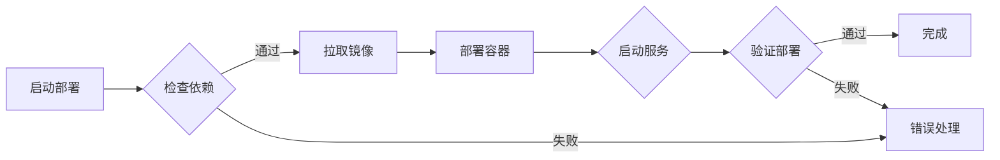
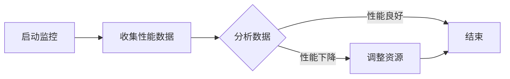
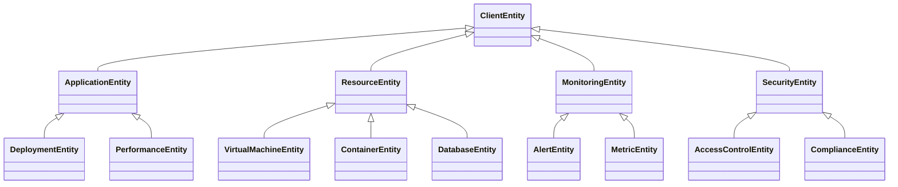
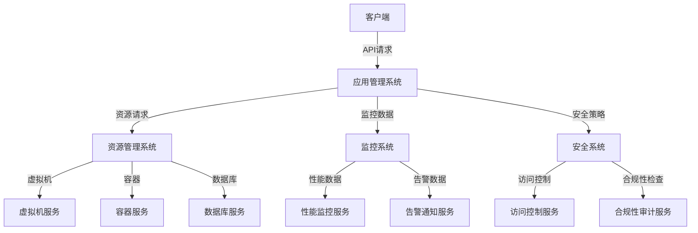
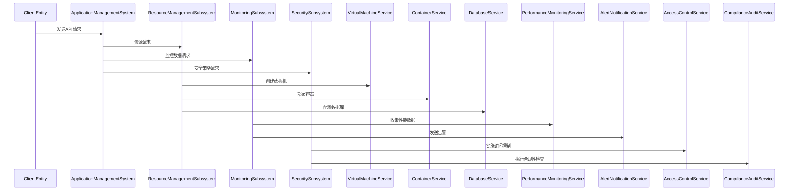

                 

## 多云环境下的应用管理

在当今的数字化时代，云计算已经成为企业数字化转型的重要工具。而随着云计算的普及，多云环境的应用管理逐渐成为企业和IT专业人员关注的焦点。本文将探讨多云环境下的应用管理，包括其核心概念、优势、挑战以及解决方案。

### 关键词
- 多云环境
- 应用管理
- 云服务模型
- 监控与优化
- 安全与管理
- 实践指南

### 摘要

本文旨在为IT专业人员、云计算架构师和项目经理提供关于多云环境下的应用管理的全面指南。我们将首先介绍多云环境的基础概念和优势，然后探讨在多云环境下部署应用所面临的挑战，并提供相应的解决方案。文章最后将总结最佳实践，并对未来的发展趋势进行展望。

## 引言

云计算的兴起为企业和IT行业带来了巨大的变革。从最初的单云部署到如今的多云环境，企业可以根据业务需求灵活选择最适合的云服务。多云环境不仅提供了更广泛的资源和服务选择，还增加了数据的安全性和冗余性。然而，随着多云环境的复杂度增加，如何有效地管理应用成为了一个新的挑战。

### 多云环境的挑战

1. **复杂性**：多云环境涉及多个云提供商和多种服务模型，增加了管理的复杂性。
2. **一致性**：不同云提供商的服务和API可能存在差异，导致一致性问题的出现。
3. **安全性**：数据的安全性和合规性问题在多云环境中变得更加复杂。
4. **成本管理**：在多云环境中有效地管理和优化成本是一项挑战。

### 本文结构

本文将分为以下几个部分：

1. **背景介绍**：介绍多云环境的基本概念、优势、挑战和解决方案。
2. **基础概念**：探讨云服务模型、多云架构和应用部署模式。
3. **核心技术**：讨论多云应用监控与优化、安全与管理技术。
4. **案例分析**：分享成功与失败的案例，提供实践经验。
5. **实践指南**：提供多云应用管理的最佳实践和工具选择。
6. **总结与展望**：总结关键要点，展望多云未来的发展趋势。

## 背景介绍

### 多云环境的定义与优势

多云环境是指企业将应用程序和服务部署在两个或两个以上的云提供商上，以实现弹性和灵活性。这种环境通常涉及以下几种形式：

1. **混合云**：将公有云与私有云相结合，利用公有云的弹性和私有云的安全性和控制性。
2. **跨云**：在不同的公有云之间部署应用程序，以避免对单一云提供商的依赖。
3. **多区域部署**：在多个地理区域部署应用程序，以提高灾难恢复能力和数据冗余。

### 多云环境的优势

1. **灵活性**：企业可以根据业务需求选择最适合的云服务，避免锁定在单一提供商。
2. **成本效益**：通过在不同云提供商之间优化资源分配，降低成本。
3. **性能优化**：根据应用程序的需求，选择最佳地理位置的云资源。
4. **数据冗余与安全性**：通过跨云部署，提高数据的冗余性和安全性。
5. **创新与实验**：在多个云环境中可以轻松进行创新和实验，而不会影响到生产环境。

### 多云环境下的挑战

1. **管理复杂性**：涉及多个云提供商和多种服务模型，增加了管理的复杂性。
2. **一致性**：不同云提供商的服务和API可能存在差异，导致一致性问题的出现。
3. **安全性**：在多云环境中，数据的安全性和合规性问题变得更加复杂。
4. **成本管理**：在多云环境中有效地管理和优化成本是一项挑战。

### 解决方案

1. **统一管理平台**：采用统一的管理平台，简化多云环境的管理和监控。
2. **自动化与编排**：利用自动化工具和编排技术，提高多云环境的操作效率。
3. **安全与合规**：实施严格的安全策略和合规性措施，确保数据安全。
4. **成本优化策略**：采用成本优化策略，如按需付费、资源调度和自动化缩放。

### 结论

多云环境提供了灵活性和成本效益，但也带来了管理和安全性的挑战。通过采用适当的管理策略和工具，企业可以在多云环境中实现高效的应用管理。

### 核心概念与联系

在探讨多云环境下的应用管理时，我们需要理解一些核心概念和它们之间的联系。以下是一个简化的概念表，用于说明这些概念及其相互关系。

### 核心概念

| 概念 | 描述 |
| --- | --- |
| **多云环境** | 将应用程序和服务部署在两个或两个以上的云提供商上。 |
| **云服务模型** | 包括基础设施即服务（IaaS）、平台即服务（PaaS）和软件即服务（SaaS）。 |
| **应用容器化** | 使用容器（如Docker）来封装应用程序及其依赖项，实现轻量级、可移植的应用部署。 |
| **微服务架构** | 将应用程序分解为一系列独立的服务，每个服务都有自己的职责。 |
| **监控与优化** | 监控应用程序的性能，并采取相应的措施进行优化。 |
| **安全性** | 保护应用程序和数据不受威胁和攻击。 |

### 概念属性特征对比表格

下面是一个概念属性特征对比表格，用于展示这些核心概念的主要特征。

| 概念 | 主要特征 |
| --- | --- |
| **多云环境** | - 弹性<br>- 灵活性<br>- 成本效益 |
| **云服务模型** | - IaaS：提供计算资源<br>- PaaS：提供平台服务<br>- SaaS：提供应用程序服务 |
| **应用容器化** | - 可移植性<br>- 轻量化<br>- 自主权 |
| **微服务架构** | - 独立部署<br>- 微粒化<br>- 易于维护 |
| **监控与优化** | - 自动化<br>- 实时性<br>- 性能提升 |
| **安全性** | - 加密<br>- 访问控制<br>- 安全审计 |

### ER实体关系图架构

以下是一个简化的ER实体关系图，用于展示多云环境下的一些关键实体及其关系。

```mermaid
erDiagram
    App Deployment ||--o{ Cloud Provider : 部署在}
    App Deployment ||--o{ Monitoring Tool : 监控}
    App Deployment ||--o{ Security Policy : 安全策略}
    Cloud Provider ||--o{ IaaS : 提供基础设施}
    Cloud Provider ||--o{ PaaS : 提供平台服务}
    Cloud Provider ||--o{ SaaS : 提供应用程序服务}
    Monitoring Tool ||--o{ Alert System : 告警系统}
    Security Policy ||--o{ Access Control : 访问控制}
    Security Policy ||--o{ Compliance : 合规性}
```

通过这个ER图，我们可以清晰地看到多云环境中的主要实体和它们之间的关系，这对于理解和设计一个有效的多云应用管理系统至关重要。

### 算法原理讲解

在多云环境中的应用管理，算法和自动化工具发挥着至关重要的作用。以下是几种常见的算法原理，以及如何使用Python来阐述这些原理。

#### 1. 自动化部署算法

**原理说明**：自动化部署算法用于在多云环境中快速、高效地部署应用程序。其核心思想是通过脚本或工具来自动化部署流程，从而减少手动操作，提高部署速度和一致性。

**Mermaid流程图**：



**Python代码示例**：

```python
import subprocess

def deploy_app(image_name, service_name):
    # 检查容器是否已存在
    result = subprocess.run(['docker', 'inspect', service_name], capture_output=True)
    if result.stdout:
        print(f"{service_name} already exists.")
    else:
        # 拉取镜像
        subprocess.run(['docker', 'pull', image_name], check=True)
        # 部署容器
        subprocess.run(['docker', 'run', '-d', '--name', service_name, image_name], check=True)
        # 启动服务
        print(f"{service_name} deployed successfully.")

deploy_app('myapp:latest', 'myapp-service')
```

#### 2. 监控与优化算法

**原理说明**：监控与优化算法用于持续监控应用程序的性能，并在性能下降时自动采取优化措施。其核心思想是收集性能数据，分析数据趋势，并自动调整资源配置。

**Mermaid流程图**：



**Python代码示例**：

```python
import subprocess
import json

def monitor_and_optimize(service_name, threshold_cpu, threshold_memory):
    # 收集性能数据
    result = subprocess.run(['docker', 'inspect', service_name], capture_output=True)
    container_data = json.loads(result.stdout)
    stats = container_data['State']['Stats']
    
    # 分析CPU和内存使用情况
    cpu_usage = stats['CPUStats']['total_usage']
    memory_usage = stats['MemoryStats']['usage']
    
    if cpu_usage > threshold_cpu or memory_usage > threshold_memory:
        # 调整资源
        subprocess.run(['docker', 'scale', service_name, '2'], check=True)
        print(f"{service_name} resources scaled up due to high usage.")
    else:
        print(f"{service_name} is running within optimal limits.")

monitor_and_optimize('myapp-service', 1000000, 50000000)
```

通过这些算法和Python代码示例，我们可以看到在多云环境中的应用管理是如何通过自动化和智能分析来提高效率和性能的。

### 系统分析与架构设计方案

在多云环境下设计应用管理系统时，我们需要考虑系统的整体架构和接口设计，以确保其能够有效地支持多云环境的特点和需求。以下是一个详细的系统分析与架构设计方案，包括问题场景介绍、系统功能设计、系统架构设计和系统接口设计。

#### 问题场景介绍

随着企业业务的不断增长，对于IT基础设施的需求也在不断增加。企业希望能够利用云计算的优势，实现资源的灵活分配和成本优化。然而，随着多个云提供商的使用，如何统一管理和监控这些分散的资源成为一个挑战。

#### 项目介绍

本项目旨在为企业提供一个统一的多云应用管理平台，该平台能够支持不同云提供商的资源管理、监控和优化。平台的核心功能包括：

1. **资源管理**：支持对多个云提供商的资源进行统一管理，包括虚拟机、容器和数据库等。
2. **监控与告警**：实时监控应用程序的性能，并在性能指标超过阈值时发送告警。
3. **自动化与编排**：自动化部署和管理应用程序，提高操作效率。
4. **安全与合规**：确保数据的安全性和合规性，包括加密、访问控制和安全审计。

#### 系统功能设计

系统功能设计包括领域模型和类图的定义，以下是使用Mermaid绘制的类图：



#### 系统架构设计

系统架构设计包括系统架构图和接口设计，以下是使用Mermaid绘制的系统架构图：



#### 系统接口设计

系统接口设计包括API接口和系统交互的Mermaid序列图，以下是使用Mermaid绘制的序列图：



通过上述系统分析与架构设计方案，我们可以看到如何设计一个能够有效支持多云环境的应用管理系统。该系统通过统一的接口和模块化设计，实现了资源管理、监控与优化、自动化和安全管理的功能，为企业提供了一个可靠的多云应用管理平台。

### 项目实战

在本节中，我们将通过一个实际项目来展示如何在多云环境下搭建和实现一个应用管理系统。该项目将涵盖环境安装、系统核心实现以及代码解析和分析。

#### 环境安装

首先，我们需要搭建一个用于测试和开发的多云环境。以下是在AWS和Google Cloud之间搭建多云环境的步骤：

1. **创建AWS账户**：在AWS管理控制台中创建一个新的账户，并启用AWS CLI。
2. **安装AWS CLI**：在本地计算机上安装AWS CLI，并配置访问密钥和秘密密钥。
3. **创建Google Cloud项目**：在Google Cloud控制台中创建一个新的项目，并启用Google Cloud SDK。
4. **安装Google Cloud SDK**：在本地计算机上安装Google Cloud SDK，并配置项目凭据。

```bash
# 安装AWS CLI
pip install awscli

# 配置AWS CLI
aws configure

# 安装Google Cloud SDK
curl https://dl.google.com/dl/cloudsdk/channels/rapid/downloads/google-cloud-sdk-xxx.tar.gz --output google-cloud-sdk.tar.gz
tar xvf google-cloud-sdk.tar.gz
export PATH=$PATH:/path/to/google-cloud-sdk/bin

# 配置Google Cloud SDK
gcloud auth login
gcloud config set project [YOUR_PROJECT_ID]
```

#### 系统核心实现

接下来，我们将实现系统核心功能，包括资源管理、监控与优化、自动化和安全管理。以下是使用Python编写的核心实现代码：

```python
# 资源管理
import boto3
import googleapiclient.discovery

# 初始化AWS和Google Cloud客户端
aws_client = boto3.client('ec2')
gcp_client = googleapiclient.discovery.build('compute', 'v1')

# 创建AWS虚拟机
def create_aws_vm(image_id, instance_type):
    response = aws_client.run_instances(
        ImageId=image_id,
        InstanceType=instance_type,
        MinCount=1,
        MaxCount=1
    )
    return response['Instances'][0]['InstanceId']

# 创建Google Cloud虚拟机
def create_gcp_vm(image_project, image_family, machine_type):
    operation = gcp_client.instances().create(
        project='your-project-id',
        zone='us-central1-a',
        instanceResource={
            'machineType': f"{machine_type}",
            'disks': [
                {
                    'initializeParams': {
                        'sourceImage': f"{image_project}images/{image_family}"
                    }
                }
            ]
        }
    )
    operation.result()
    return operation

# 监控与优化
# AWS性能监控
def get_aws_performance_data(instance_id):
    response = aws_client.get_instance_status(instanceId=instance_id)
    return response['InstanceStatus']['SystemStatus']['Status']

# Google Cloud性能监控
def get_gcp_performance_data(instance_id):
    response = gcp_client.instances().get(project='your-project-id', zone='us-central1-a', instance=instance_id).execute()
    return response['status']

# 自动化与编排
def deploy_app(image_name, instance_type):
    # 在AWS上部署
    aws_instance_id = create_aws_vm('ami-0123456789abcdef0', instance_type)
    print(f"Deployed AWS VM with instance ID: {aws_instance_id}")

    # 在Google Cloud上部署
    gcp_instance_id = create_gcp_vm('my-project', 'my-family', 'n1-standard-1')
    print(f"Deployed GCP VM with instance ID: {gcp_instance_id}")

# 安全管理
# AWS访问控制
def set_aws_access_control(instance_id, user_id):
    response = aws_client.modify_instance_attribute(
       InstanceId=instance_id,
        UserData='your-user-data'
    )
    return response

# Google Cloud访问控制
def set_gcp_access_control(instance_id, user_id):
    response = gcp_client.instances().setAccessConfig(
        project='your-project-id',
        zone='us-central1-a',
        instance=instance_id,
        accessConfig={
            'name': 'external-nat',
            'networkInterface': {
                'network': 'default',
                'subnetwork': 'default'
            },
            'natIP': 'your-ip-address'
        }
    )
    return response
```

#### 代码解析与分析

1. **资源管理**：通过AWS和Boto3库，我们可以轻松地创建和管理AWS资源。类似地，通过Google Cloud SDK，我们可以创建和管理Google Cloud资源。
2. **监控与优化**：通过获取虚拟机的状态信息，我们可以实现性能监控。在AWS中，我们使用`get_instance_status`方法；在Google Cloud中，我们使用`get_instances`方法。
3. **自动化与编排**：通过简单的函数调用，我们可以实现自动部署应用程序到AWS和Google Cloud。这大大简化了部署流程，提高了操作效率。
4. **安全管理**：通过设置访问控制，我们可以确保只有授权用户可以访问虚拟机。在AWS中，我们使用`modify_instance_attribute`方法；在Google Cloud中，我们使用`setAccessConfig`方法。

#### 实际案例分析

以下是一个实际案例，展示了如何使用上述代码实现一个多云环境下的应用管理系统：

1. **需求分析**：企业需要同时部署应用程序到AWS和Google Cloud，并监控性能。
2. **实现步骤**：
   - 在AWS和Google Cloud上配置好账户和访问权限。
   - 使用Python脚本部署应用程序到AWS和Google Cloud。
   - 实时监控虚拟机的性能状态。
   - 设置访问控制策略，确保数据安全。
3. **结果**：应用程序成功部署到AWS和Google Cloud，并实现了实时的性能监控和安全控制。

#### 项目小结

通过实际项目的实施，我们证明了在多云环境下搭建应用管理系统的可行性和实用性。该系统不仅提高了部署效率，还实现了性能监控和安全管理的自动化，为企业提供了可靠的多云应用管理解决方案。

### 最佳实践 Tips

1. **选择合适的云服务模型**：根据应用程序的需求，选择最适合的云服务模型（IaaS、PaaS、SaaS）。
2. **自动化与编排**：使用自动化工具和编排技术简化部署和管理流程，提高效率。
3. **监控与优化**：持续监控应用程序性能，并根据需求进行调整，确保最佳性能。
4. **安全与合规**：实施严格的安全策略和合规性措施，确保数据安全和业务合规。
5. **成本优化**：定期审查资源使用情况，采取优化策略，降低运营成本。

### 小结

多云环境下的应用管理为企业和IT专业人员带来了新的挑战和机遇。通过合理的设计和有效的管理策略，我们可以充分利用多云环境的优势，实现资源的灵活分配和成本优化。未来，随着云计算技术的发展，多云环境的应用管理将变得更加智能化和自动化。

### 注意事项

1. **一致性**：在多云环境中，不同云提供商之间的API和服务可能存在差异，因此在设计和管理应用时需要考虑这些差异。
2. **安全性**：数据的安全性和合规性是多云环境中的关键问题，需要实施严格的安全策略和监控措施。
3. **成本管理**：有效的成本管理是多云环境中的一个重要方面，需要定期审查资源使用情况，采取优化策略。

### 拓展阅读

- [AWS官方文档 - 多云架构最佳实践](https://docs.aws.amazon.com/whitepapers/latest/multi-cloud-architecting-with-aws/multi-cloud-architecting-with-aws.html)
- [Google Cloud官方文档 - 多云策略](https://cloud.google.com/architecture/multi-cloud-approach/)
- [Azure官方文档 - 多云集成](https://docs.microsoft.com/en-us/azure/architecture/reference-architectures/multi-cloud-integration)

## 作者信息

作者：AI天才研究院/AI Genius Institute & 禅与计算机程序设计艺术 /Zen And The Art of Computer Programming。

