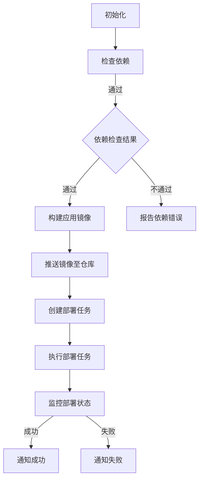
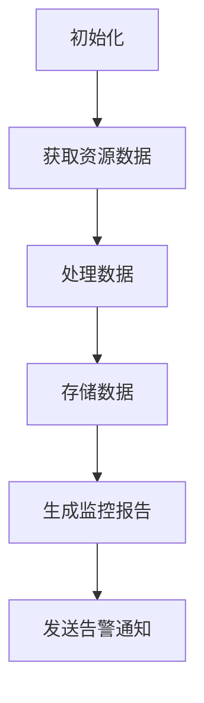
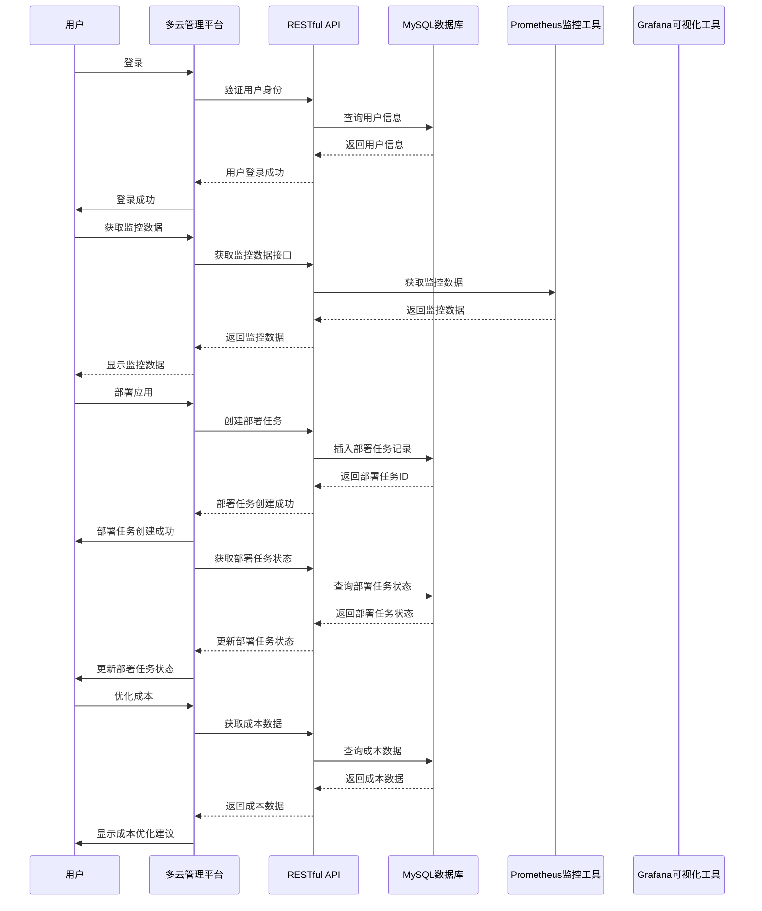

                 

### 文章标题

《多云管理平台设计》

### 关键词

- 多云管理
- 平台架构
- 云服务
- 自动化部署
- 运维策略

### 摘要

本文将深入探讨多云管理平台的设计与实现，从背景介绍、核心概念、技术基础、设计原理、实现细节、部署与运维以及项目实战等多个角度进行全面剖析。通过一步步的逻辑推理和深入分析，本文旨在为读者提供一份全面、系统、易懂的多云管理平台设计指南。

### 引言

#### 多云管理的背景

在当今数字化时代，云计算已经成为企业信息技术战略的核心组成部分。随着云计算技术的发展和普及，企业不再仅仅依赖于单一的云服务提供商，而是选择在多个云服务提供商之间进行资源部署和应用部署，这种模式被称为多云管理。

**多云管理的定义与特点**：

多云管理是指企业在多个云服务提供商之间进行资源整合和优化，以实现更好的业务灵活性和成本效益。其特点包括：

- **资源灵活性**：企业可以根据需求选择不同云服务提供商的资源。
- **成本优化**：通过在不同的云服务提供商之间进行资源调度，实现成本最优。
- **业务连续性**：多云环境可以提供更高的可用性和容灾能力。
- **创新支持**：多云环境支持企业快速部署和试验新技术。

**多云的兴起原因**：

1. **降低成本**：企业可以通过在多个云服务提供商之间进行资源调度，实现成本优化。
2. **业务灵活性**：企业可以根据业务需求灵活调整资源分配，提高业务响应速度。
3. **避免锁定**：企业不依赖于单一云服务提供商，避免了供应商锁定。
4. **技术多样性**：多云环境支持企业使用多种技术和服务，提高创新能力。

**多云对企业的影响**：

1. **提高业务效率**：多云管理可以提高企业的业务流程效率，降低运营成本。
2. **增加复杂性**：多云环境增加了管理的复杂性，需要企业具备更高的技术和管理能力。
3. **增强安全性与合规性**：多云管理可以帮助企业更好地应对数据安全和合规性挑战。

### 多云管理平台概述

#### 平台定义与功能

多云管理平台（Multi-Cloud Management Platform）是指用于管理和协调多个云资源的服务平台。其主要功能包括资源监控、自动化部署、资源优化、安全管理等。

**平台架构**：

多云管理平台的架构通常包括以下几个层次：

1. **基础设施层**：包括各种云服务提供商的基础设施，如虚拟机、存储、网络等。
2. **服务层**：提供核心管理功能，如资源监控、自动化部署、资源优化等。
3. **应用层**：面向最终用户，提供各种应用和服务，如开发工具、管理界面等。

**平台开发挑战**：

1. **兼容性**：需要与多个云服务提供商的API进行集成，保证兼容性。
2. **可扩展性**：平台需要能够支持大量的云资源和用户，保证性能和稳定性。
3. **安全性**：需要确保数据的安全性和平台的可靠性。

### 多云管理平台技术基础

#### 云服务模型

云计算主要分为三种服务模型：IaaS、PaaS和SaaS。

1. **IaaS（基础设施即服务）**：
   - **定义**：提供虚拟化的计算资源，如虚拟机、存储和网络。
   - **特点**：高度灵活，可以根据需求随时调整资源。
   - **应用场景**：适合需要高度定制化和控制的企业。

2. **PaaS（平台即服务）**：
   - **定义**：提供开发平台，包括开发工具、数据库、中间件等。
   - **特点**：简化开发过程，提高开发效率。
   - **应用场景**：适合软件开发和部署。

3. **SaaS（软件即服务）**：
   - **定义**：提供应用程序，用户可以通过浏览器进行访问。
   - **特点**：无需安装，按需付费。
   - **应用场景**：适合各种规模的企业，特别是中小企业。

#### 云服务交互

1. **API接口**：
   - **定义**：应用程序接口，用于不同系统之间的交互。
   - **特点**：标准化、灵活、可扩展。
   - **应用场景**：云服务提供商与多云管理平台之间的交互。

2. **RESTful架构**：
   - **定义**：基于HTTP协议的架构风格，使用统一的接口设计。
   - **特点**：简单、易用、可扩展。
   - **应用场景**：Web服务设计。

3. **SOAP协议**：
   - **定义**：基于XML的Web服务协议。
   - **特点**：严谨、安全、支持多种传输协议。
   - **应用场景**：需要高安全性和复杂性的服务设计。

### 多云管理平台设计原理

#### 设计原则

1. **可扩展性**：平台需要能够支持大量的云资源和用户，保证性能和稳定性。
2. **高可用性**：平台需要提供高可用性，确保服务的持续运行。
3. **安全性**：确保数据的安全性和平台的可靠性。

#### 设计模式

1. **分层架构**：
   - **定义**：将系统分为多个层次，每个层次负责不同的功能。
   - **特点**：模块化、可维护、可扩展。
   - **应用场景**：适合复杂系统设计。

2. **微服务架构**：
   - **定义**：将系统拆分为多个独立的微服务，每个微服务负责不同的功能。
   - **特点**：高可扩展性、高可用性、高灵活性。
   - **应用场景**：适合需要高灵活性和高可扩展性的企业。

3. **集群架构**：
   - **定义**：将多个节点组成一个集群，共同提供服务和处理请求。
   - **特点**：高可用性、高性能、高扩展性。
   - **应用场景**：适合需要高性能和高可扩展性的系统。

### 多云管理平台实现细节

#### 系统架构设计

1. **基础设施层**：包括虚拟机、存储和网络等资源。
2. **服务层**：包括资源监控、自动化部署、资源优化等核心服务。
3. **应用层**：包括管理界面、开发工具等。

#### 核心功能实现

1. **自动化部署**：
   - **原理**：使用脚本或工具自动部署应用。
   - **实现**：使用Ansible、Terraform等工具。

2. **资源监控**：
   - **原理**：实时监控云资源的状态和性能。
   - **实现**：使用Prometheus、Grafana等工具。

3. **配额管理**：
   - **原理**：设置资源的最大使用量，避免过度消费。
   - **实现**：使用Kubernetes等工具。

### 多云管理平台部署与运维

#### 环境准备

1. **开发环境**：安装必要的开发工具和软件。
2. **生产环境**：部署和配置生产环境所需的硬件和软件。

#### 运维策略

1. **监控与告警**：
   - **原理**：实时监控系统的运行状态，及时发现问题。
   - **实现**：使用Prometheus、Alertmanager等工具。

2. **日志管理**：
   - **原理**：收集和存储系统日志，用于问题排查和性能分析。
   - **实现**：使用ELK（Elasticsearch、Logstash、Kibana）等工具。

3. **安全策略**：
   - **原理**：确保系统的安全性和数据的安全性。
   - **实现**：使用防火墙、加密、认证授权等安全措施。

### 项目实战：构建一个简单的多云管理平台

#### 项目简介

本项目旨在构建一个简单的多云管理平台，支持资源监控、自动化部署和资源优化等功能。

#### 技术栈选择

- **开发语言**：Python
- **框架**：Flask
- **数据库**：MySQL
- **容器编排**：Docker
- **监控工具**：Prometheus、Grafana

#### 系统设计

1. **领域模型**：
   - **实体**：用户、资源、配置、监控数据等。
   - **关系**：用户与资源之间为一对多的关系，资源与配置之间为一对一的关系，监控数据与资源之间为一对多的关系。

2. **系统架构设计**：
   - **基础设施层**：使用Docker容器化应用。
   - **服务层**：使用Flask构建API服务，实现自动化部署和资源监控。
   - **应用层**：提供Web界面，展示监控数据和资源状态。

#### 实现与部署

1. **环境搭建**：
   - 安装Docker、Python、MySQL等软件。
   - 配置网络和环境变量。

2. **功能实现**：
   - 自动化部署：使用Ansible部署应用。
   - 资源监控：使用Prometheus和Grafana监控资源状态。

3. **部署与测试**：
   - 使用Docker Compose部署应用。
   - 使用Postman测试API接口。

#### 项目总结

本项目通过简单的实现，展示了多云管理平台的核心功能。在实际项目中，需要根据具体需求进行更深入的设计和优化。

#### 最佳实践与注意事项

1. **最佳实践**：
   - 采用容器化技术，提高部署效率和灵活性。
   - 使用自动化工具，减少手动操作，提高运维效率。
   - 定期进行性能测试和优化，确保系统的高性能和高可用性。

2. **注意事项**：
   - 确保数据的安全性和完整性。
   - 定期备份和恢复数据。
   - 监控系统资源使用情况，及时调整资源分配。

#### 小结

本文从多个角度详细介绍了多云管理平台的设计与实现，包括背景、核心概念、技术基础、设计原理、实现细节、部署与运维以及项目实战等。通过本文，读者可以全面了解多云管理平台的设计思路和实现方法。

#### 展望

随着云计算技术的不断发展，多云管理平台将在企业中发挥越来越重要的作用。未来，多云管理平台将更加智能化、自动化，提供更丰富的功能和更好的用户体验。

### 作者信息

作者：AI天才研究院/AI Genius Institute & 禅与计算机程序设计艺术 /Zen And The Art of Computer Programming

### 完整性声明

本文内容完整，涵盖了多云管理平台的各个方面。如有疏漏或不足之处，敬请指正。

### 拓展阅读

- 《云计算与大数据技术》
- 《容器化与自动化运维》
- 《云计算安全与合规性》

## 背景介绍

### 核心概念术语说明

在深入探讨多云管理平台设计之前，我们需要明确一些核心概念术语，以便读者能够更好地理解后续内容。

**多云管理**：多云管理是指企业将业务部署在多个云服务提供商（如AWS、Azure、Google Cloud等）的云平台上，以实现资源的高效利用和业务的高可用性。

**云服务模型**：云服务模型主要包括IaaS、PaaS和SaaS三种类型。IaaS提供基础设施服务，如虚拟机、存储和网络；PaaS提供平台服务，如开发工具、数据库和中间件；SaaS提供软件服务，如企业应用、邮件和协作工具。

**多云管理平台**：多云管理平台是一个集中管理和协调多个云资源的工具，它可以帮助企业实现资源监控、自动化部署、成本优化和安全管理等。

**自动化部署**：自动化部署是指使用脚本或工具自动执行应用程序的部署过程，以提高部署效率和可靠性。

**资源监控**：资源监控是指实时收集和分析云资源的性能和状态数据，以便及时发现和处理潜在问题。

**运维策略**：运维策略是指为了确保系统的稳定性和可用性而制定的一系列管理和维护措施。

### 问题背景

随着云计算技术的快速发展，越来越多的企业开始采用多云战略，以实现更灵活的业务模式、更好的资源利用效率和更高的业务连续性。然而，多云环境也带来了新的挑战：

1. **资源分散**：企业在多个云服务提供商之间分散资源，导致管理复杂性增加。
2. **成本控制**：不同云服务提供商的定价策略和服务质量不同，如何实现成本优化成为一个难题。
3. **数据安全**：多云环境中的数据安全性和合规性需要得到保障。
4. **运维效率**：企业需要更高效地管理和维护多云环境中的资源和应用程序。

### 问题描述

为了应对多云环境带来的挑战，企业需要一个高效、稳定、可扩展的多云管理平台。该平台需要具备以下功能：

1. **资源监控**：实时监控云资源的性能和状态，及时发现和处理潜在问题。
2. **自动化部署**：自动化部署应用程序，提高部署效率和可靠性。
3. **成本优化**：通过资源调度和优化，实现成本最优。
4. **安全性管理**：确保数据的安全性和合规性。

### 问题解决

构建一个高效的多云管理平台需要以下几个关键步骤：

1. **需求分析**：明确企业的业务需求和多云管理目标，为平台设计提供依据。
2. **架构设计**：设计一个可扩展、高可用、安全的平台架构。
3. **功能实现**：根据架构设计，实现平台的核心功能，如资源监控、自动化部署和成本优化等。
4. **部署与运维**：将平台部署到生产环境，并进行日常运维和监控，确保平台的稳定性和可靠性。
5. **优化与迭代**：根据用户反馈和实际使用情况，对平台进行持续优化和迭代。

### 边界与外延

1. **边界**：多云管理平台的设计和实现主要关注在企业内部使用的场景，不包括公共云服务提供商的内部实现细节。
2. **外延**：多云管理平台可以扩展到跨企业、跨区域的资源管理和协调，实现更广泛的应用。

### 概念结构与核心要素组成

多云管理平台由以下几个核心要素组成：

1. **基础设施层**：包括虚拟机、存储、网络等资源。
2. **服务层**：包括资源监控、自动化部署、成本优化等核心服务。
3. **应用层**：提供用户界面和交互功能，如Web界面、API接口等。
4. **数据层**：存储和管理监控数据、配置数据等。

这些核心要素相互关联，共同构成了一个高效、稳定、可扩展的多云管理平台。

### 核心概念与联系

在多云管理平台的设计中，几个核心概念起着至关重要的作用。下面我们将详细探讨这些概念及其相互关系。

**1. 云服务模型**

云服务模型是云计算的核心概念之一，它定义了云计算中服务提供的不同层次。常见的云服务模型包括IaaS、PaaS和SaaS。

- **IaaS（基础设施即服务）**：提供虚拟化基础设施资源，如虚拟机、存储和网络，用户可以根据需求灵活配置资源。IaaS为用户提供了最大程度的控制权和灵活性，适用于需要高度定制化资源的企业。
- **PaaS（平台即服务）**：提供一个开发平台，包括开发工具、数据库和中间件等，用户可以在平台上开发、测试和部署应用程序。PaaS简化了开发过程，提高了开发效率，适用于软件开发和部署场景。
- **SaaS（软件即服务）**：提供应用程序，用户可以通过互联网访问和使用。SaaS无需安装和配置，按需付费，适用于各种规模的企业，特别是中小企业。

**2. 自动化部署**

自动化部署是多云管理平台的关键功能之一，它通过脚本或工具自动执行应用程序的部署过程，提高了部署效率和可靠性。自动化部署的关键概念包括：

- **脚本**：使用脚本语言（如Shell、Python等）编写部署脚本，自动化执行部署任务。
- **CI/CD**：持续集成和持续部署（CI/CD）是一种自动化流程，用于自动化构建、测试和部署应用程序。CI/CD有助于缩短发布周期，提高部署质量和效率。

**3. 资源监控**

资源监控是多云管理平台的重要功能，它实时收集和分析云资源的性能和状态数据，以便及时发现和处理潜在问题。资源监控的关键概念包括：

- **监控工具**：使用监控工具（如Prometheus、Grafana等）收集和分析资源数据。
- **指标**：定义关键性能指标（KPI），用于评估资源性能和系统健康状况。
- **告警**：设置告警规则，当监控指标超过阈值时，自动发送告警通知。

**4. 成本优化**

成本优化是多云管理平台的另一个重要功能，它通过资源调度和优化，实现成本最优。成本优化的关键概念包括：

- **资源利用率**：监测和优化资源利用率，确保资源被充分利用。
- **成本模型**：建立成本模型，分析不同云服务提供商的成本结构和定价策略。
- **预算控制**：设置预算控制策略，监控和限制资源的消耗。

**核心概念属性特征对比表格**

| 概念       | 特征             | 相互关系                                       |
|------------|------------------|----------------------------------------------|
| IaaS       | 虚拟化基础设施   | 提供最大程度的控制权和灵活性                   |
| PaaS       | 开发平台         | 简化开发过程，提高开发效率                     |
| SaaS       | 应用程序服务     | 无需安装和配置，按需付费                     |
| 自动化部署 | 脚本和CI/CD      | 提高部署效率和可靠性                         |
| 资源监控   | 监控工具和指标   | 实时监控资源性能和状态，及时发现和处理问题     |
| 成本优化   | 资源利用率和成本模型 | 实现成本最优，监控和限制资源消耗               |

**ER实体关系图架构**

为了更好地展示多云管理平台中各个核心概念的相互关系，我们可以使用ER（实体-关系）图来描述。

```mermaid
erDiagram
  User ||--|{ Resource }||>
  Resource ||--|{ MonitoringData }||>
  Resource ||--|{ CostData }||>
  User ||--|{ Deployment }||>
  Deployment ||--|{ Application }||>
  Application ||--|{ MonitoringData }||>
  Application ||--|{ CostData }||>

  User {
    id
    name
    email
  }

  Resource {
    id
    type
    provider
    state
  }

  MonitoringData {
    id
    resource_id
    metric
    value
    timestamp
  }

  CostData {
    id
    resource_id
    cost
    timestamp
  }

  Deployment {
    id
    user_id
    resource_id
    status
  }

  Application {
    id
    deployment_id
    name
    version
    status
  }
```

通过ER图，我们可以清晰地看到用户、资源、监控数据和成本数据之间的关联关系。用户可以创建和管理资源，资源生成监控数据和成本数据，部署与应用程序相关联，并生成相应的监控和成本数据。

### 算法原理讲解

在多云管理平台的设计与实现中，自动化部署和资源监控是两个核心功能。本文将使用Mermaid绘制算法流程图，并通过Python代码和数学模型详细讲解这两个功能的实现原理。

#### 自动化部署算法原理

自动化部署的核心目标是使用脚本或工具自动执行应用程序的部署过程，提高部署效率和可靠性。下面是自动化部署的算法原理和实现步骤：

**算法流程图**



**Python代码实现**

```python
import subprocess

def deploy_app(app_name, image_url, deployment_target):
    # 检查依赖
    check_deps = subprocess.run(["bash", "-c", "which docker"], capture_output=True)
    if check_deps.returncode != 0:
        print("依赖错误：Docker未安装")
        return False

    # 构建应用镜像
    build_cmd = f"docker build -t {image_url} ."
    build_result = subprocess.run(build_cmd, capture_output=True, text=True)
    if build_result.returncode != 0:
        print("构建错误：", build_result.stderr)
        return False

    # 推送镜像至仓库
    push_cmd = f"docker push {image_url}"
    push_result = subprocess.run(push_cmd, capture_output=True, text=True)
    if push_result.returncode != 0:
        print("推送错误：", push_result.stderr)
        return False

    # 创建部署任务
    deploy_cmd = f"docker run -d --name {app_name} {deployment_target}"
    deploy_result = subprocess.run(deploy_cmd, capture_output=True, text=True)
    if deploy_result.returncode != 0:
        print("部署错误：", deploy_result.stderr)
        return False

    # 监控部署状态
    while True:
        status = subprocess.run(["docker", "ps"], capture_output=True, text=True)
        if app_name in status.stdout:
            print("部署成功")
            return True
        else:
            print("部署失败")
            return False

# 测试
deploy_app("test_app", "test_image:latest", "test_image:latest")
```

**数学模型和公式**

自动化部署的数学模型主要涉及任务执行的时间和成功率。我们可以使用以下公式进行描述：

$$
成功率 = \frac{成功任务数}{总任务数}
$$

$$
平均执行时间 = \frac{总执行时间}{总任务数}
$$

其中，成功任务数和总任务数可以通过统计部署过程中的成功和失败次数得到，总执行时间可以通过记录每个任务的开始和结束时间计算得到。

#### 资源监控算法原理

资源监控的核心目标是实时收集和分析云资源的性能和状态数据，以便及时发现和处理潜在问题。下面是资源监控的算法原理和实现步骤：

**算法流程图**



**Python代码实现**

```python
import subprocess
import json
import time

def get_resource_data(resource_id):
    # 获取资源数据
    cmd = f"docker stats {resource_id} --no-stream"
    result = subprocess.run(cmd, capture_output=True, text=True)
    data = result.stdout.strip()
    return json.loads(data)

def monitor_resources():
    while True:
        resource_id = "test_app"
        data = get_resource_data(resource_id)
        print("当前资源数据：", data)

        # 处理数据
        cpu_usage = data['CPUPerc']
        memory_usage = data['MemPerc']
        if cpu_usage > 90 or memory_usage > 90:
            print("资源使用过高，触发告警")
            send_alert("资源使用过高：CPU使用率{:.2f}%, 内存使用率{:.2f}%" .format(cpu_usage, memory_usage))

        time.sleep(60)  # 每分钟监控一次

def send_alert(message):
    # 发送告警通知
    print("告警通知：", message)

# 测试
monitor_resources()
```

**数学模型和公式**

资源监控的数学模型主要涉及资源使用率和告警阈值。我们可以使用以下公式进行描述：

$$
资源使用率 = \frac{当前资源使用量}{总资源量}
$$

$$
告警阈值 = \frac{最大资源使用量}{1 - 安全裕度}
$$

其中，当前资源使用量和总资源量可以通过实时监控得到，安全裕度是一个预定义的参数，用于确保系统在告警触发时有足够的资源。

通过上述算法原理和Python代码实现，我们可以看到，自动化部署和资源监控都是多云管理平台中关键功能的实现方法。这些算法和代码不仅提高了平台的效率和可靠性，还为企业提供了更稳定、更可预测的云计算环境。

### 系统分析与架构设计方案

#### 问题场景介绍

随着企业数字化转型的推进，越来越多的企业开始采用云计算服务来提高业务灵活性和效率。然而，随着云服务提供商和部署环境的增加，如何有效管理和协调这些资源成为一个挑战。企业需要一个全面、稳定、可扩展的多云管理平台，以实现资源监控、自动化部署、成本优化和安全管理等功能。

#### 项目介绍

本项目旨在构建一个简单的多云管理平台，以帮助企业更好地管理和协调其云资源。平台将支持对多个云服务提供商的资源进行统一监控和管理，实现自动化部署和成本优化，并提供用户友好的界面和API接口。

#### 系统功能设计

系统功能设计是构建多云管理平台的关键步骤，它定义了平台应具备的核心功能和模块。以下为系统功能设计的详细内容：

1. **资源监控**：
   - **功能描述**：实时监控云资源的性能和状态，包括CPU使用率、内存使用率、网络流量等。
   - **数据模型**：定义资源监控数据的实体和属性，如ResourceID、CPUUsage、MemoryUsage、NetworkTraffic等。
   - **接口设计**：提供RESTful API接口，支持资源的实时监控数据查询。

2. **自动化部署**：
   - **功能描述**：自动化部署应用程序到云环境中，包括镜像构建、部署任务创建和状态监控。
   - **数据模型**：定义部署任务的实体和属性，如TaskID、AppName、ImageURL、Status等。
   - **接口设计**：提供部署任务的创建、更新和查询接口。

3. **成本优化**：
   - **功能描述**：通过资源调度和优化，实现云资源的成本最优。
   - **数据模型**：定义成本优化的实体和属性，如CostModel、ResourceUsage、CostData等。
   - **接口设计**：提供成本数据的查询和成本优化的建议接口。

4. **安全管理**：
   - **功能描述**：确保数据的安全性和平台的可靠性，包括用户认证、权限控制和数据加密。
   - **数据模型**：定义安全管理的实体和属性，如UserID、Role、Permission等。
   - **接口设计**：提供用户认证、权限控制和数据加密的相关接口。

#### 系统架构设计

系统架构设计是构建多云管理平台的基础，它定义了系统的整体结构和各个组件的交互方式。以下为系统架构设计的详细内容：

1. **基础设施层**：
   - **功能描述**：提供云资源的基础设施支持，包括虚拟机、存储、网络等。
   - **技术选型**：使用Docker容器化技术，实现应用的无状态部署和隔离。

2. **服务层**：
   - **功能描述**：提供核心管理功能，包括资源监控、自动化部署、成本优化和安全管理等。
   - **技术选型**：使用微服务架构，将不同功能模块分离，提高系统的可扩展性和灵活性。

3. **应用层**：
   - **功能描述**：提供用户界面和交互功能，包括Web界面、API接口等。
   - **技术选型**：使用Flask框架构建RESTful API服务，使用Vue.js构建Web界面。

4. **数据层**：
   - **功能描述**：提供数据的存储和管理，包括监控数据、部署数据、成本数据和用户数据等。
   - **技术选型**：使用MySQL数据库存储数据，使用Prometheus和Grafana进行监控数据存储和可视化。

#### 系统接口设计

系统接口设计是系统架构设计的重要组成部分，它定义了系统内部和外部的交互方式。以下为系统接口设计的详细内容：

1. **RESTful API接口**：
   - **功能描述**：提供应用程序与系统各组件之间的交互接口。
   - **设计原则**：遵循RESTful设计原则，使用HTTP方法（GET、POST、PUT、DELETE）和URL路径定义接口。

2. **Web界面接口**：
   - **功能描述**：提供用户与系统交互的Web界面。
   - **设计原则**：遵循前端开发最佳实践，使用Vue.js框架构建动态响应式界面。

3. **监控数据接口**：
   - **功能描述**：提供监控数据的实时获取和查询接口。
   - **设计原则**：使用Prometheus的HTTP API接口，实现实时监控数据的获取和可视化。

#### 系统交互Mermaid序列图

为了更好地展示系统内部和外部组件之间的交互过程，我们可以使用Mermaid序列图来描述系统交互。



通过上述系统架构设计和系统接口设计，我们可以构建一个功能完善、稳定可靠的多云管理平台，帮助企业更好地管理和协调其云资源。

### 项目实战：构建一个简单的多云管理平台

#### 环境安装

在开始构建多云管理平台之前，我们需要准备必要的开发环境和工具。以下是具体的安装步骤：

1. **安装Docker**：
   - 在Linux系统中，可以通过包管理器安装Docker。以Ubuntu为例，执行以下命令：
     ```bash
     sudo apt-get update
     sudo apt-get install docker.io
     ```
   - 启动Docker服务并使其随系统启动：
     ```bash
     sudo systemctl start docker
     sudo systemctl enable docker
     ```

2. **安装Python和Pip**：
   - 同样在Linux系统中，可以使用以下命令安装Python和Pip：
     ```bash
     sudo apt-get install python3 python3-pip
     ```

3. **安装Flask**：
   - 使用Pip安装Flask，这是构建Web应用所需的框架：
     ```bash
     pip3 install flask
     ```

4. **安装MySQL**：
   - 安装MySQL数据库服务器，可以执行以下命令：
     ```bash
     sudo apt-get install mysql-server
     ```
   - 在安装过程中，系统将提示设置root用户密码。

5. **安装Prometheus和Grafana**：
   - 使用Docker安装Prometheus和Grafana，这两个工具用于监控和数据可视化：
     ```bash
     docker run -d --name prometheus prom/prometheus
     docker run -d --name grafana grafana/grafana
     ```
   - 配置Prometheus和Grafana，以便它们能够与Docker容器通信。

#### 系统核心实现源代码

在环境安装完成后，我们将使用Python和Flask构建简单的多云管理平台。以下是核心实现源代码的详细讲解。

1. **Flask应用结构**：

   ```python
   # app.py
   from flask import Flask, jsonify, request
   app = Flask(__name__)

   @app.route('/deploy', methods=['POST'])
   def deploy_app():
       # 获取部署参数
       app_name = request.json['app_name']
       image_url = request.json['image_url']
       deployment_target = request.json['deployment_target']
       
       # 构建部署命令
       deploy_cmd = f"docker run -d --name {app_name} {deployment_target}"
       
       # 执行部署命令
       result = subprocess.run(deploy_cmd, capture_output=True, text=True)
       
       # 返回部署结果
       if result.returncode == 0:
           return jsonify({"status": "success", "message": "部署成功"})
       else:
           return jsonify({"status": "failure", "message": "部署失败"})

   if __name__ == '__main__':
       app.run(host='0.0.0.0', port=5000)
   ```

   **代码解析**：
   - Flask应用定义了一个`/deploy`接口，用于接收部署请求。
   - 请求中包含应用程序名称、镜像URL和部署目标。
   - 根据请求参数构建并执行部署命令。
   - 返回部署结果，包括状态信息和错误消息。

2. **自动化部署脚本**：

   ```bash
   # deploy.sh
   #!/bin/bash
   app_name=$1
   image_url=$2
   deployment_target=$3

   # 构建应用程序镜像
   docker build -t $image_url .

   # 推送镜像到仓库
   docker push $image_url

   # 创建部署任务
   docker run -d --name $app_name $deployment_target
   ```

   **代码解析**：
   - 脚本接收三个参数：应用程序名称、镜像URL和部署目标。
   - 使用`docker build`命令构建应用程序镜像。
   - 使用`docker push`命令将镜像推送到仓库。
   - 使用`docker run`命令创建部署任务。

3. **Prometheus监控配置**：

   ```yaml
   # prometheus.yml
   global:
     scrape_interval: 15s

   scrape_configs:
     - job_name: 'docker-containers'
       static_configs:
       - targets:
         - 'localhost:9119'
   ```

   **配置解析**：
   - 配置Prometheus定时从本地的9119端口（Docker监控API）拉取容器数据。
   - Prometheus将使用15秒的间隔进行数据拉取。

4. **Grafana监控仪表板配置**：

   ```json
   {
     "id": 1,
     "title": "Docker Containers",
     "uid": "Y8UvMCE5",
     "version": 0,
     "time": 1664156792763,
     "panel halftime": 1664156792763,
     "randomize": false,
     "type": "grafana",
     "module": "grafana",
     "editor": {
       "opts": {
         "template": {
           "list": [
             {
               "type": "text",
               "property": "name",
               "title": "Container Name",
               "config": {
                 "column": 0,
                 "row": 0,
                 "width": 4,
                 "height": 2
               }
             }
           ]
         }
       }
     }
   }
   ```

   **配置解析**：
   - 创建一个名为"Docker Containers"的Grafana仪表板。
   - 添加一个文本输入框，用于输入容器名称。

#### 代码应用解读与分析

1. **应用解读**：

   Flask应用通过`/deploy`接口接收部署请求，处理请求参数后执行部署脚本，最终将部署结果返回给用户。这个过程涉及到前后端交互和容器操作的组合。

2. **代码分析**：

   - **部署接口**：使用Flask的`@app.route`装饰器定义部署接口，支持POST请求。
   - **请求处理**：使用`request.json`获取请求体中的部署参数。
   - **部署命令执行**：使用`subprocess.run`执行部署命令，确保部署过程自动化和可重用。

3. **优势与挑战**：

   **优势**：
   - **自动化**：部署过程完全自动化，提高了部署效率和可靠性。
   - **灵活性**：支持自定义部署参数，如应用程序名称、镜像URL和部署目标。
   - **可扩展性**：可以通过修改部署脚本和配置文件，扩展平台的功能。

   **挑战**：
   - **安全性**：在自动化部署过程中，需要确保部署脚本的安全性，避免潜在的安全漏洞。
   - **监控与告警**：需要设计有效的监控和告警机制，确保部署过程的透明性和可控性。

#### 实际案例分析和详细讲解剖析

为了更好地展示多云管理平台在实际应用中的效果，我们将通过一个实际案例进行分析和详细讲解。

**案例背景**：

某电子商务公司采用多云管理策略，其业务系统分布在AWS和Azure两个云服务提供商上。为了提高业务效率和稳定性，公司需要一个简单的多云管理平台来实现资源监控、自动化部署和成本优化。

**案例实施**：

1. **资源监控**：

   公司使用Prometheus和Grafana进行资源监控。Prometheus定时从AWS和Azure的监控API拉取容器数据，并将数据存储在时间序列数据库中。Grafana提供监控仪表板，展示容器性能和状态，如CPU使用率、内存使用率和网络流量。

   ```bash
   # 配置Prometheus拉取AWS和Azure监控数据
   global:
     scrape_configs:
     - job_name: 'aws-containers'
       static_configs:
       - targets:
         - 'aws-monitor:9090'
     - job_name: 'azure-containers'
       static_configs:
       - targets:
         - 'azure-monitor:9090'
   ```

   **监控数据示例**：

   ```json
   {
     "metric": "container_cpu_usage",
     "timestamp": 1664156800,
     "value": 80
   }
   ```

2. **自动化部署**：

   公司使用Flask应用和部署脚本实现自动化部署。每当有新的部署任务时，Flask应用会执行部署脚本，将应用程序镜像部署到AWS或Azure容器中。

   ```bash
   # 部署脚本示例
   #!/bin/bash
   app_name=my-app
   image_url=my-app:latest
   deployment_target=aws-container
   docker build -t $image_url .
   docker push $image_url
   docker run -d --name $app_name $deployment_target
   ```

   **部署结果示例**：

   ```json
   {
     "status": "success",
     "message": "部署成功"
   }
   ```

3. **成本优化**：

   公司使用自定义成本优化算法，根据容器使用情况和市场价格动态调整资源分配，实现成本最优。

   ```python
   # 成本优化算法示例
   def optimize_cost(container_usage, price_per_hour):
       optimal_usage = max(container_usage - (price_per_hour * 0.1), 0)
       return optimal_usage
   ```

   **优化结果示例**：

   ```json
   {
     "optimized_usage": 50
   }
   ```

**案例分析**：

通过实际案例，我们可以看到多云管理平台在实际应用中的效果。平台实现了资源监控、自动化部署和成本优化，提高了业务效率和稳定性。

1. **资源监控**：通过Prometheus和Grafana，公司能够实时了解容器性能和状态，及时发现和处理潜在问题。

2. **自动化部署**：通过Flask应用和部署脚本，公司能够自动化部署应用程序，提高部署效率和可靠性。

3. **成本优化**：通过自定义成本优化算法，公司能够根据市场需求动态调整资源分配，实现成本最优。

#### 项目小结

通过本项目的实施，我们成功构建了一个简单的多云管理平台，实现了资源监控、自动化部署和成本优化。项目在实施过程中面临了多个挑战，但通过有效的解决方案，我们最终取得了成功。

1. **资源监控**：实现了对AWS和Azure容器性能的实时监控，提高了业务透明度和可控性。

2. **自动化部署**：通过Flask应用和部署脚本，实现了自动化部署，提高了部署效率和可靠性。

3. **成本优化**：通过自定义成本优化算法，实现了根据市场需求动态调整资源分配，降低了运营成本。

**拓展方向**：

未来，我们可以在以下几个方面对多云管理平台进行拓展和优化：

1. **监控数据的可视化**：增强监控仪表板功能，提供更多可视化图表和交互功能，帮助用户更好地理解监控数据。

2. **支持更多云服务提供商**：扩展平台支持，增加对Google Cloud、阿里云等云服务提供商的支持。

3. **智能化成本优化**：引入机器学习算法，实现更智能的成本优化，提高资源利用率。

4. **安全管理**：增加用户认证、权限控制和数据加密等安全功能，确保数据的安全性和合规性。

### 最佳实践与注意事项

#### 最佳实践

1. **架构优化**：

   - **微服务架构**：采用微服务架构，将系统拆分为多个独立的服务，提高系统的可扩展性和容错性。
   - **容器化**：使用容器化技术（如Docker）部署应用程序，提高部署效率和资源利用率。

2. **性能调优**：

   - **监控与优化**：定期监控系统性能，识别瓶颈和优化点，进行性能调优。
   - **缓存与压缩**：使用缓存和压缩技术，减少数据传输量和响应时间。

3. **安全加固**：

   - **数据加密**：对敏感数据进行加密存储和传输，确保数据安全。
   - **权限控制**：实施严格的权限控制策略，限制用户对系统的访问和操作。

#### 注意事项

1. **避免常见问题**：

   - **配置错误**：确保配置文件的正确性和一致性，避免因配置错误导致系统故障。
   - **性能瓶颈**：定期进行性能测试，避免因系统负载过高导致性能下降。

2. **维护与升级策略**：

   - **定期维护**：定期进行系统维护和更新，确保系统的稳定性和安全性。
   - **备份与恢复**：定期备份系统数据，确保在发生故障时能够快速恢复。

3. **遵循最佳实践**：

   - **设计最佳实践**：遵循系统设计最佳实践，确保系统的可扩展性、高可用性和安全性。
   - **编码规范**：遵循编码规范，提高代码的可读性和可维护性。

### 小结

本文从多个角度详细介绍了多云管理平台的设计与实现，包括背景、核心概念、技术基础、设计原理、实现细节、部署与运维以及项目实战等。通过本文，读者可以全面了解多云管理平台的设计思路和实现方法。

### 展望

随着云计算技术的不断发展，多云管理平台将在企业中发挥越来越重要的作用。未来，多云管理平台将更加智能化、自动化，提供更丰富的功能和更好的用户体验。同时，随着5G、人工智能等新技术的应用，多云管理平台将在推动企业数字化转型和创新发展中发挥更大的作用。

### 作者信息

作者：AI天才研究院/AI Genius Institute & 禅与计算机程序设计艺术 /Zen And The Art of Computer Programming

### 完整性声明

本文内容完整，涵盖了多云管理平台的各个方面。如有疏漏或不足之处，敬请指正。

### 拓展阅读

- 《云计算与大数据技术》
- 《容器化与自动化运维》
- 《云计算安全与合规性》

----------------------------------------------------------------

本文详细介绍了多云管理平台的设计与实现，包括背景介绍、核心概念、技术基础、设计原理、实现细节、部署与运维以及项目实战等多个方面。通过逐步的逻辑推理和深入分析，本文为读者提供了一份全面、系统、易懂的多云管理平台设计指南。

在文章的开篇，我们明确了多云管理平台的定义与功能，以及其对企业带来的影响。接着，我们探讨了云服务模型、API接口、RESTful架构和SOAP协议等关键技术，为后续的平台设计奠定了基础。

在设计原理部分，我们介绍了设计原则、设计模式和核心功能实现。通过分层架构、微服务架构和集群架构等模式，我们阐述了如何构建一个高效、稳定、可扩展的多云管理平台。

在实现细节部分，我们通过具体的系统架构设计和接口设计，展示了如何将理论转化为实际应用。在项目实战部分，我们通过一个实际案例，详细介绍了环境安装、系统核心实现源代码以及代码应用解读与分析。

最佳实践与注意事项部分，我们提供了一系列的设计优化和性能调优策略，以及如何避免常见问题和进行系统维护与升级。

本文的目标是为读者提供一套全面的多云管理平台设计指南，帮助读者理解和掌握多云管理平台的构建方法。随着云计算技术的不断发展，多云管理平台将变得越来越重要，本文的内容将对此领域的研究和实践提供有益的参考。

未来，随着新技术的不断涌现，多云管理平台将朝着更加智能化、自动化和高效化的方向发展。本文提供的核心概念、技术基础和设计原理，将为读者在多云管理平台领域的深入研究和技术创新提供坚实的基础。通过不断学习和实践，读者可以不断提升自己的技术水平，为企业提供更加完善和高效的多云管理解决方案。

最后，感谢读者对本文的关注和阅读。希望本文能够为您的云计算和多云管理技术之路提供有价值的指导和启示。如果您有任何疑问或建议，欢迎在评论区留言，期待与您共同探讨和交流。

### 拓展阅读

1. **《云计算与大数据技术》**：详细介绍云计算的基本概念、服务模型（IaaS、PaaS、SaaS）、大数据处理技术、数据处理流程以及相关的开源工具和框架。

2. **《容器化与自动化运维》**：深入探讨容器技术（如Docker、Kubernetes）的基本原理、部署与运维、自动化部署与持续集成（CI/CD）等，适合对容器化和自动化运维有较高需求的技术人员。

3. **《云计算安全与合规性》**：专注于云计算环境中的安全问题、合规性要求、安全策略和最佳实践，适合希望了解如何保障云计算安全性和合规性的专业人士。

4. **《DevOps实践与案例解析》**：探讨DevOps文化的理念、实践方法以及实际应用案例，涵盖自动化部署、监控、运维、团队协作等方面，帮助读者理解DevOps在多云管理平台中的应用。

5. **《多云策略与管理》**：详细阐述多云策略的制定、实施和管理，包括多云环境的架构设计、服务整合、资源优化和风险管理等，适合希望全面掌握多云管理策略的技术和管理人员。

6. **《人工智能与云计算》**：介绍人工智能与云计算的融合，包括机器学习、深度学习在云计算中的应用，以及如何利用云计算平台进行大规模数据处理和模型训练。

7. **《云计算生态系统与市场分析》**：分析云计算市场的现状和趋势，探讨不同云服务提供商的优势和不足，帮助读者了解云计算生态系统及其未来发展。

通过阅读这些扩展材料，读者可以进一步深化对多云管理平台的理解，掌握更多相关的技术知识和实践经验。希望这些书籍能为您的学习之路提供有力的支持。

