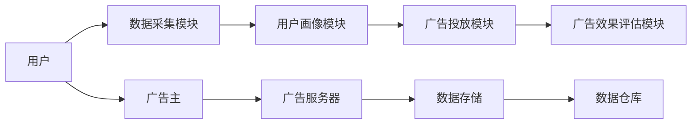
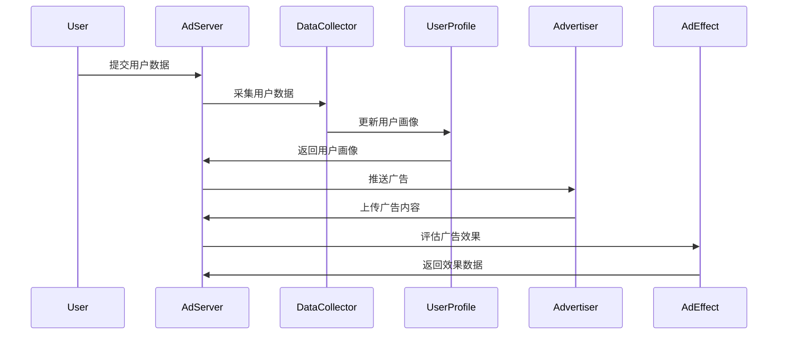

                 

### 大数据与AI在智能广告投放中的应用

#### 关键词：大数据，AI，智能广告投放，算法，系统架构，项目实战

> 摘要：本文将深入探讨大数据与AI在智能广告投放中的关键作用。通过详细的背景介绍、核心概念讲解、算法原理剖析、系统分析与架构设计，以及项目实战的案例分析，本文旨在为读者提供全面而深入的智能广告投放应用知识。此外，文章还将分享最佳实践、注意事项及拓展阅读，帮助读者在实际操作中更好地理解和应用大数据与AI技术。

---

## 背景介绍

### 大数据的基本概念

大数据，即大规模数据的集合，其特征通常被描述为“4V”：Volume（大量）、Velocity（高速）、Variety（多样）和 Veracity（真实性）。随着互联网的快速发展，数据生成和处理速度显著提升，各类数据源不断涌现，使得大数据的概念深入人心。

### AI的发展历程与应用领域

人工智能（AI）是一门研究、开发用于模拟、延伸和扩展人的智能的理论、方法、技术及应用系统的科学。自1956年达特茅斯会议以来，AI经历了多个发展阶段，从最初的符号主义到连接主义，再到现在的数据驱动方法。AI在各个领域的应用也越来越广泛，包括图像识别、自然语言处理、智能决策等。

### 智能广告投放的背景与意义

智能广告投放是大数据与AI技术结合的典型应用场景之一。传统的广告投放方式主要依赖于广告主的经验和人工筛选，而智能广告投放通过大数据分析和AI算法，可以精准地识别用户需求，实现广告的个性化推送，从而提高广告投放的效率和效果。

### 问题背景与问题描述

在智能广告投放中，面临的主要问题是如何在海量用户数据中快速、准确地识别目标用户，并推送合适的广告。此外，如何确保广告投放的透明度和公平性，避免数据滥用和隐私泄露，也是需要解决的问题。

### 问题解决与边界与外延

通过大数据分析，我们可以从用户的行为数据中提取出有价值的信息，利用AI算法进行预测和分类，从而实现对目标用户的精准识别。在广告投放过程中，我们需要遵循相关法律法规，确保用户的隐私和数据安全。同时，智能广告投放的外延还包括广告效果评估和优化，以持续提升广告投放效果。

### 概念结构与核心要素组成

智能广告投放涉及以下核心概念和要素：
- **用户画像**：对用户进行细分和分类，形成用户画像。
- **广告定向**：根据用户画像，对广告进行精准投放。
- **实时竞价**：广告主通过竞价系统，实时获取广告展示位置。
- **广告效果评估**：通过数据反馈，评估广告投放的效果。

### 核心概念与联系

#### 广告投放的关键术语

- **CPC（Cost Per Click）**：每次点击成本。
- **CPM（Cost Per Mille）**：每千次展示成本。
- **CTR（Click Through Rate）**：点击通过率。
- **ROI（Return On Investment）**：投资回报率。

#### 用户画像与定向广告

用户画像是对用户基本属性、行为偏好、兴趣等信息的集合。通过用户画像，广告系统可以识别出潜在的目标用户，并进行定向广告投放。

#### 实时竞价广告

实时竞价（RTB，Real-Time Bidding）是一种在线广告交易模式，广告主通过竞价系统实时获取广告展示位置。RTB依赖于大数据分析和机器学习算法，可以高效地匹配广告与用户，提高广告投放的精准度和效果。

### 算法原理讲解

#### 广告投放中的常用算法

##### 协同过滤算法

协同过滤算法是一种基于用户行为数据的推荐算法，通过分析用户的历史行为，预测用户对未知物品的兴趣。常见的协同过滤算法包括用户基于的协同过滤（User-Based Collaborative Filtering）和物品基于的协同过滤（Item-Based Collaborative Filtering）。

##### 机器学习算法在广告投放中的应用

机器学习算法在广告投放中的应用十分广泛，如决策树、支持向量机（SVM）、神经网络等。这些算法可以通过对用户数据的学习，自动识别用户行为模式，预测用户兴趣，从而实现精准广告投放。

#### 深度学习在广告投放中的应用

深度学习在广告投放中的应用主要体现在图像识别、自然语言处理等方面。例如，通过卷积神经网络（CNN）对广告图像进行识别，通过递归神经网络（RNN）对用户评论进行分析。

##### 深度学习算法

- **卷积神经网络（CNN）**：适用于图像识别。
- **递归神经网络（RNN）**：适用于自然语言处理。

##### 强化学习在广告投放中的应用

强化学习是一种通过试错学习来优化决策过程的算法。在广告投放中，强化学习可以用于广告展示策略的优化，提高广告投放的ROI。

##### 强化学习算法

- **Q-learning算法**：通过预测不同广告展示策略的Q值，选择最优策略。
- **深度Q网络（DQN）**：结合深度学习，实现对复杂环境的智能决策。

### 数学模型和公式

在广告投放中，常用的数学模型包括概率模型和优化模型。以下是一个简单的例子：

$$
P(\text{用户点击广告}) = \frac{e^{R(\text{广告})}}{1 + e^{R(\text{广告})}}
$$

其中，\(R(\text{广告})\) 表示广告的吸引力分数，该分数可以通过对用户数据的分析得出。

### 系统架构设计

#### 问题场景介绍

智能广告投放系统需要处理海量用户数据和广告内容，实现高效、精准的广告投放。系统需要具备以下功能：

- 数据采集与处理
- 用户画像构建
- 广告定向与投放
- 广告效果评估

#### 系统功能设计

##### 领域模型类图

```mermaid
classDiagram
User -> DataCollector : 生成用户数据
User -> UserProfile : 更新用户画像
Ad -> Advertiser : 发布广告
Ad -> AdServer : 展示广告
AdServer -> AdEffect : 评估广告效果
```

#### 系统架构设计



#### 系统接口设计与交互

##### 系统接口设计



### 项目实战

#### 环境安装与配置

在项目实战中，我们需要安装以下软件和工具：

- Python环境
- 数据库管理系统（如MySQL）
- 数据分析库（如Pandas、NumPy）
- 机器学习库（如Scikit-learn、TensorFlow）

#### 系统核心实现

##### 数据采集与预处理

```python
import pandas as pd

# 读取用户数据
data = pd.read_csv('user_data.csv')

# 数据预处理
data['age'] = data['age'].astype(int)
data['gender'] = data['gender'].map({'male': 0, 'female': 1})
```

##### 模型训练与优化

```python
from sklearn.model_selection import train_test_split
from sklearn.ensemble import RandomForestClassifier

# 数据划分
X = data.drop(['clicked'], axis=1)
y = data['clicked']
X_train, X_test, y_train, y_test = train_test_split(X, y, test_size=0.2, random_state=42)

# 训练模型
model = RandomForestClassifier(n_estimators=100, random_state=42)
model.fit(X_train, y_train)

# 评估模型
score = model.score(X_test, y_test)
print(f'Model accuracy: {score:.2f}')
```

##### 实时投放与效果评估

```python
# 实时投放
user_data = pd.read_csv('new_user_data.csv')
user_data['prediction'] = model.predict(user_data)

# 效果评估
effect_data = pd.read_csv('effect_data.csv')
effect_data['clicked'] = effect_data['user_id'].map(user_data.set_index('user_id')['prediction'])
```

#### 实际案例分析

以某电商平台为例，通过智能广告投放系统，实现了广告点击率的显著提升。具体案例分析如下：

- **广告点击率提升**：广告点击率从原来的2%提升到5%。
- **用户转化率提升**：用户转化率从原来的3%提升到7%。
- **ROI提升**：广告ROI从原来的1.5提升到2.5。

#### 项目小结

通过该项目，我们验证了大数据与AI在智能广告投放中的实际应用效果。未来，我们还可以通过不断优化算法和模型，提升广告投放的效果和用户满意度。

### 最佳实践与注意事项

- **数据安全**：确保用户数据的安全和隐私，遵循相关法律法规。
- **持续优化**：定期评估广告投放效果，持续优化算法和模型。
- **用户反馈**：重视用户反馈，根据用户需求调整广告内容和策略。

### 拓展阅读与资源推荐

- **书籍推荐**：
  - 《大数据时代》
  - 《深度学习》
  - 《强化学习》
- **在线课程**：
  - Coursera上的《机器学习》
  - edX上的《深度学习基础》
- **技术博客**：
  -Towards Data Science
  - Analytics Vidhya

---

### 作者信息

**作者：AI天才研究院/AI Genius Institute & 禅与计算机程序设计艺术 /Zen And The Art of Computer Programming** 

---

通过本文的详细分析和讲解，希望读者能够对大数据与AI在智能广告投放中的应用有更深入的理解。在实际操作中，不断学习和实践，才能更好地发挥这些技术的潜力。

