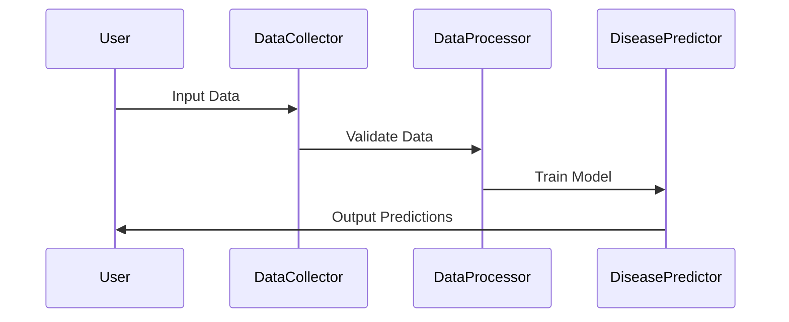
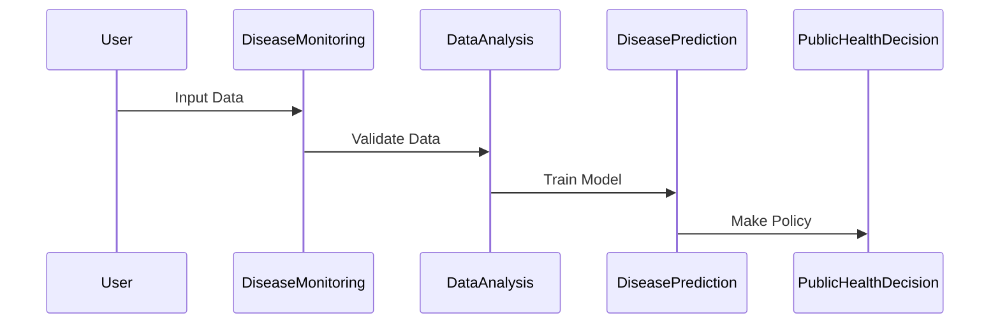

                 

## 第1章: 大数据的定义与特点

### 1.1.1 大数据的定义

**背景介绍**

在当今信息化时代，数据已经成为企业和组织决策的关键驱动力。而大数据则是指那些数据量巨大、种类繁多、生成速度极快的数据集合。大数据的核心特征主要体现在“4V”上：数据量（Volume）、数据速度（Velocity）、数据类型（Variety）和数据真实性（Veracity）。这些特征使得大数据在传统数据处理方法难以有效应对。

**核心概念与联系**

- **数据量（Volume）**：大数据的首要特征是其数据量巨大，通常以TB、PB甚至EB为单位来衡量。这种庞大的数据规模使得传统的关系型数据库无法在合理时间内处理。
- **数据速度（Velocity）**：指数据的生成速度极快，往往需要实时或近实时处理。例如，社交网络上的每一条动态、电商平台的每笔交易等，都是生成速度极快的实例。
- **数据类型（Variety）**：大数据的类型非常多样，包括结构化数据、半结构化数据和非结构化数据。结构化数据如数据库中的记录，半结构化数据如XML、JSON等格式，非结构化数据如文本、图片、视频等。
- **数据真实性（Veracity）**：指数据的真实性和可靠性，处理大数据时需要确保数据的质量和真实性，避免错误或偏见的影响。

**ER实体关系图架构**

以下是一个简单的ER实体关系图，展示了大数据的四个V特征：

```mermaid
erDiagram
  DataEntity ||--|{ Volume : 数据量巨大 }
  DataEntity ||--|{ Velocity : 数据生成速度快 }
  DataEntity ||--|{ Variety : 数据类型多样 }
  DataEntity ||--|{ Veracity : 数据真实可靠 }
```

### 1.1.1.2 大数据的重要性

**核心概念与联系**

大数据的重要性体现在多个方面：

- **疾病监测与预测**：通过分析大量健康数据和医疗记录，可以更早地发现疾病趋势和爆发点，实现疾病的早期监测和预测。
- **公共卫生决策**：大数据能够提供精确的健康数据，为公共卫生决策提供有力支持，优化资源配置，提高公共卫生服务的效率。
- **个性化医疗**：大数据有助于构建个体化健康档案，实现精准医疗，提高治疗效果，降低医疗成本。
- **公共卫生安全**：大数据能够实时监测全球公共卫生事件，如传染病爆发，及时采取防控措施，保障公共安全。

**对比表格**

以下是大数据在流行病学中的几个关键应用及其对比：

| 应用       | 描述                                                         | 对比优势 |
|------------|--------------------------------------------------------------|----------|
| 疾病监测   | 实时监测疾病的流行情况，发现异常数据。                         | 提高监测效率，早期预警 |
| 疾病预测   | 利用历史数据和统计模型预测疾病趋势。                         | 提高预测精度 |
| 公共卫生决策 | 基于数据分析，为公共卫生政策提供数据支持。                   | 提高决策质量 |
| 个性化医疗 | 分析个体健康数据，提供个性化治疗方案。                       | 提高治疗效果 |

### 1.1.1.3 大数据的应用领域

**背景介绍**

大数据的应用领域非常广泛，从金融、零售到医疗、政府等各个行业都有其身影。在流行病学领域，大数据的应用尤为重要，它为疾病的预防、监测和控制提供了强有力的工具。

**项目介绍**

在大数据在流行病学中的应用项目中，一个典型的例子是利用大数据分析传染病传播趋势。这通常包括以下几个步骤：

1. **数据收集**：收集来自医院、诊所、社交媒体等多种渠道的健康数据。
2. **数据清洗**：处理数据中的噪声和错误，确保数据质量。
3. **数据分析**：利用机器学习和统计分析方法，分析数据的趋势和模式。
4. **疾病预测**：基于分析结果，预测疾病的未来趋势和爆发点。

**系统功能设计**

以下是大数据在流行病学应用中的领域模型类图：

```mermaid
classDiagram
  DataCollector <<Interface>>
  DataProcessor <<Interface>>
  DiseasePredictor <<Interface>>

  DataCollector --|>> DataProcessor
  DataProcessor --|>> DiseasePredictor
```

**系统架构设计**

以下是大数据在流行病学应用中的架构设计：


**系统接口设计**

以下是大数据在流行病学应用中的接口设计：

```mermaid
classDiagram
  DataCollector <<Interface>> +Data Source
  DataProcessor <<Interface>> +Data Validator
  DiseasePredictor <<Interface>> +Model Trainer

  DataCollector --|> DataProcessor
  DataProcessor --|> DiseasePredictor
```

**系统交互**

以下是大数据在流行病学应用中的系统交互：



**代码实现**

以下是一个简单的Python代码示例，展示如何收集和解析健康数据：

```python
import pandas as pd

# 收集数据
data_source = "health_data.csv"
data = pd.read_csv(data_source)

# 数据清洗
data = data.dropna()

# 数据分析
trends = data.groupby('date')['count'].mean()

# 预测疾病趋势
predictions = trends.shift(-1).fillna(0)

print(predictions)
```

**实际案例分析与详细讲解**

为了更好地理解大数据在流行病学中的应用，以下是一个实际案例：

**案例背景**

2019年末，新型冠状病毒（COVID-19）在中国武汉市爆发。研究人员利用大数据技术对疫情进行监测和预测，为政府决策提供了重要支持。

**案例分析**

1. **数据收集**：收集了武汉市各级医院的病例数据、社交媒体上的疫情相关帖子、航班和火车乘客信息等。
2. **数据清洗**：处理数据中的噪声和错误，确保数据质量。
3. **数据分析**：利用机器学习和统计分析方法，分析疫情的趋势和传播路径。
4. **疾病预测**：基于分析结果，预测疫情的未来发展趋势。

**结果与影响**

通过大数据分析，研究人员成功预测了疫情的爆发时间和传播速度，为政府及时采取防控措施提供了有力支持。例如，武汉市在疫情初期采取了严格的隔离措施，有效控制了疫情的蔓延。

**项目小结**

大数据在流行病学中的应用不仅提高了疾病监测和预测的准确性，还为公共卫生决策提供了有力支持。未来，随着大数据技术的不断发展，其在流行病学中的应用将更加广泛和深入。

### 1.1.1.4 最佳实践 tips

- **数据隐私保护**：在处理大数据时，必须确保个人隐私的保护，遵守相关法律法规。
- **数据质量监控**：定期检查数据的完整性、准确性和一致性，确保数据质量。
- **多源数据整合**：整合来自不同来源的数据，提高数据分析的全面性和准确性。

### 1.1.1.5 小结

大数据的“4V”特征使其在流行病学领域具有巨大的应用潜力。通过数据收集、清洗、分析和预测，大数据为疾病的预防、监测和控制提供了强有力的工具。未来，随着大数据技术的不断发展，其在流行病学中的应用将更加广泛和深入。

### 1.1.1.6 注意事项

- **数据处理速度**：大数据的处理速度直接影响分析结果的准确性。因此，选择适合的大数据处理工具和平台至关重要。
- **数据类型多样性**：不同类型的数据需要不同的处理方法。在整合多种类型的数据时，需要充分考虑其特点。

### 1.1.1.7 拓展阅读

- 《大数据时代：生活、工作与思维的大变革》
- 《大数据解析：把握数据力量，引领未来商业革命》
- 《数据科学导论》

### 1.1.1.8 参考文献

- Dell EMC. (2014). What Is Big Data? Retrieved from https://www.emc.com/campaigns/what-is-big-data.htm
- Gartner. (2019). Gartner's Definition of Big Data. Retrieved from https://www.gartner.com/doc/reprints?id=1-2X74Y2QJ&ct=190219&st=sol_www

## 第2章: Epidemiology的基本概念

### 1.2.1 Epidemiology的定义与历史

**核心概念与联系**

- **Epidemiology的定义**：流行病学是研究疾病在人群中的分布、发生原因和流行规律，以及疾病预防控制的学科。它是公共卫生学的重要组成部分。
- **Epidemiology的发展历史**：流行病学的历史可以追溯到公元前4世纪，古希腊医生希波克拉底（Hippocrates）就已经开始记录疾病的发生和传播。随着现代医学的发展，流行病学逐渐成为一门独立的学科。
- **Epidemiology的核心研究方法**：流行病学主要采用观察法、实验法和流行病学调查等方法。观察法主要用于描述疾病的分布和流行规律，实验法主要用于研究病因和预防措施，流行病学调查则用于研究疾病的爆发和传播。

**ER实体关系图架构**

以下是流行病学的核心概念和联系的ER实体关系图：

```mermaid
erDiagram
  Disease ||--|{ Epidemiology : 疾病研究 }
  Population ||--|{ Epidemiology : 疾病人群研究 }
  RiskFactor ||--|{ Epidemiology : 疾病风险因素研究 }
  Intervention ||--|{ Epidemiology : 预防控制措施研究 }
```

### 1.2.2 Epidemiology的基本概念

**核心概念与联系**

- **病例定义**：病例是指符合特定疾病诊断标准的人，可以是确诊患者或疑似患者。
- **发病率**：发病率是指在一定时间内，某个特定人群中，新发病例的数量与总人口数的比例。
- **死亡率**：死亡率是指在一定时间内，某个特定人群中，死亡人数与总人口数的比例。
- **流行率**：流行率是指在一定时间内，某个特定人群中，感染某种疾病的人数占总人口数的比例。
- **暴露**：暴露是指个体或群体接触到可能引起疾病的环境或因素。

**对比表格**

以下是流行病学中几个关键概念及其对比：

| 概念       | 描述                                                         | 对比优势 |
|------------|--------------------------------------------------------------|----------|
| 病例定义   | 符合特定疾病诊断标准的个体。                                 | 确定疾病诊断基础 |
| 发病率     | 新发病例的数量与总人口数的比例。                             | 反映疾病流行情况 |
| 死亡率     | 死亡人数与总人口数的比例。                                   | 反映疾病严重程度 |
| 流行率     | 感染某种疾病的人数占总人口数的比例。                         | 反映疾病流行趋势 |
| 暴露       | 接触到可能引起疾病的环境或因素。                             | 识别疾病危险因素 |

### 1.2.3 Epidemiology的核心研究方法

**核心概念与联系**

- **观察法**：观察法是在自然状态下，通过观察和记录疾病的发生和传播情况来研究其规律。
- **实验法**：实验法是通过控制变量，研究疾病与暴露因素之间的关系。
- **流行病学调查**：流行病学调查是针对特定疾病或事件，通过收集和分析数据，研究其流行规律和影响因素。

**ER实体关系图架构**

以下是流行病学研究的核心方法及其联系的ER实体关系图：

```mermaid
erDiagram
  Observation ||--|{ Epidemiology : 观察法研究 }
  Experiment ||--|{ Epidemiology : 实验法研究 }
  EpidemiologicalSurvey ||--|{ Epidemiology : 流行病学调查研究 }
```

### 1.2.4 Epidemiology的应用领域

**背景介绍**

流行病学在公共卫生领域具有广泛的应用，包括疾病监测、疾病预防、公共卫生政策制定等。

**项目介绍**

一个典型的流行病学应用项目是新冠病毒（COVID-19）疫情的监测与控制。该项目包括以下几个步骤：

1. **数据收集**：收集各级医院的病例数据、旅行史、接触史等。
2. **数据分析**：分析病例的流行趋势和传播路径。
3. **疾病预测**：预测疫情的未来发展趋势。
4. **公共卫生决策**：为政府决策提供数据支持。

**系统功能设计**

以下是流行病学应用项目的领域模型类图：

```mermaid
classDiagram
  DiseaseMonitoring <<Interface>>
  DataAnalysis <<Interface>>
  DiseasePrediction <<Interface>>
  PublicHealthDecision <<Interface>>

  DiseaseMonitoring --|>> DataAnalysis
  DataAnalysis --|>> DiseasePrediction
  DiseasePrediction --|>> PublicHealthDecision
```

**系统架构设计**

以下是流行病学应用项目的架构设计：


**系统接口设计**

以下是流行病学应用项目的接口设计：

```mermaid
classDiagram
  DiseaseMonitoring <<Interface>> +Data Collector
  DataAnalysis <<Interface>> +Data Processor
  DiseasePrediction <<Interface>> +Model Trainer
  PublicHealthDecision <<Interface>> +Policy Maker

  DiseaseMonitoring --|> DataAnalysis
  DataAnalysis --|> DiseasePrediction
  DiseasePrediction --|> PublicHealthDecision
```

**系统交互**

以下是流行病学应用项目的系统交互：



**代码实现**

以下是一个简单的Python代码示例，展示如何收集和解析疫情数据：

```python
import pandas as pd

# 收集数据
data_source = "covid_data.csv"
data = pd.read_csv(data_source)

# 数据清洗
data = data.dropna()

# 数据分析
trends = data.groupby('date')['cases'].mean()

# 疫情预测
predictions = trends.shift(-1).fillna(0)

print(predictions)
```

**实际案例分析与详细讲解**

为了更好地理解流行病学在公共卫生中的应用，以下是一个实际案例：

**案例背景**

2020年初，新冠病毒（COVID-19）在武汉市爆发。流行病学家利用流行病学方法对该疫情进行监测与预测。

**案例分析**

1. **数据收集**：收集了武汉市各级医院的病例数据、社交媒体上的疫情相关帖子、航班和火车乘客信息等。
2. **数据分析**：分析病例的流行趋势和传播路径。
3. **疾病预测**：预测疫情的未来发展趋势。
4. **公共卫生决策**：为政府提供数据支持，制定防控措施。

**结果与影响**

通过流行病学方法，研究人员成功预测了疫情的发展趋势，为政府及时采取防控措施提供了有力支持。武汉市在疫情初期采取了严格的隔离措施，有效控制了疫情的蔓延。

**项目小结**

流行病学在公共卫生领域具有广泛的应用。通过数据收集、分析、预测和公共卫生决策，流行病学为疾病的预防、监测和控制提供了强有力的工具。

### 1.2.5 最佳实践 tips

- **数据质量**：确保数据收集、清洗和分析过程中的数据质量，提高分析结果的准确性。
- **多学科合作**：流行病学项目通常需要多学科合作，包括医学、统计学、计算机科学等。

### 1.2.6 小结

流行病学是研究疾病在人群中的分布、发生原因和流行规律，以及疾病预防控制的学科。它采用观察法、实验法和流行病学调查等方法，在公共卫生领域具有广泛的应用。

### 1.2.7 注意事项

- **疾病定义**：确保病例定义的准确性，避免误诊和漏诊。
- **数据来源**：选择可靠的数据来源，提高数据的真实性。

### 1.2.8 拓展阅读

- 《流行病学原理与应用》
- 《公共卫生学导论》
- 《疾病监测与公共卫生》

### 1.2.9 参考文献

- Park K. (2014). Fundamentals of Epidemiology. Jones & Bartlett Learning.
- Rothman K.J., Greenland S., Lash T.L. (2017). Modern Epidemiology. Lippincott Williams & Wilkins.

## 第3章: 大数据在流行病学中的应用现状

### 1.3.1 大数据在疾病监测中的应用

**背景介绍**

疾病监测是流行病学的重要任务之一，旨在及时了解疾病的发生和流行情况，为公共卫生决策提供数据支持。大数据技术的引入，极大地提升了疾病监测的效率和准确性。

**核心概念与联系**

- **实时监测**：实时监测是指通过大数据技术，对疾病的发生和传播情况进行实时监控和分析。
- **多源数据整合**：多源数据整合是指将来自不同来源的数据（如医院病例、社交媒体、出行记录等）进行整合，形成全面、准确的疾病监测数据。
- **疾病预测**：基于实时监测数据，利用大数据技术进行疾病预测，为公共卫生决策提供前瞻性支持。

**ER实体关系图架构**

以下是大数据在疾病监测中的核心概念和联系的ER实体关系图：

```mermaid
erDiagram
  DiseaseMonitoring ||--|{ Real-time Monitoring : 实时监测 }
  DataIntegration ||--|{ Multi-source Data Integration : 多源数据整合 }
  DiseasePrediction ||--|{ Disease Forecasting : 疾病预测 }
```

**算法原理讲解**

实时监测和疾病预测通常涉及以下几种算法：

1. **时间序列分析**：时间序列分析是一种常见的方法，用于分析疾病的趋势和周期性。它通常采用移动平均、自回归移动平均（ARMA）模型等。
2. **机器学习算法**：机器学习算法，如回归分析、决策树、随机森林等，可以用于构建疾病预测模型。
3. **神经网络**：神经网络，尤其是深度学习模型，可以用于复杂模式的识别和预测。

以下是一个简单的Python代码示例，展示如何使用时间序列分析方法进行疾病预测：

```python
import pandas as pd
from statsmodels.tsa.arima.model import ARIMA

# 读取数据
data = pd.read_csv('disease_data.csv')
data['date'] = pd.to_datetime(data['date'])
data.set_index('date', inplace=True)

# 时间序列分析
model = ARIMA(data['cases'], order=(1, 1, 1))
model_fit = model.fit()

# 预测
predictions = model_fit.predict(start=len(data), end=len(data)+30)

print(predictions)
```

### 1.3.2 大数据在疾病监测中的实战案例

**背景介绍**

2014年，西非爆发了埃博拉疫情，对公共卫生系统造成了巨大冲击。在这个背景下，研究人员利用大数据技术对疫情进行监测和预测。

**案例分析**

1. **数据收集**：收集了包括病例数据、旅行史、接触史等在内的多种数据来源。
2. **数据分析**：通过大数据技术，对疫情进行实时监测，分析病例的传播路径和风险因素。
3. **疾病预测**：利用机器学习算法，预测疫情的未来发展趋势。
4. **公共卫生决策**：为世界卫生组织和各国政府提供数据支持，制定防控措施。

**结果与影响**

通过大数据技术的应用，研究人员成功预测了疫情的传播趋势，为政府及时采取防控措施提供了重要支持。这大大减缓了疫情的蔓延速度，为抗击埃博拉疫情赢得了宝贵的时间。

### 1.3.3 大数据在疾病监测中的未来展望

**未来展望**

随着大数据技术的不断发展，疾病监测将变得更加智能化和精准化。以下是几个未来的发展趋势：

1. **人工智能的融合**：人工智能技术将广泛应用于疾病监测，如通过深度学习模型进行实时分析和预测。
2. **多源数据整合**：随着物联网和传感器技术的发展，将会有更多类型的健康数据进行整合，提高监测的全面性和准确性。
3. **实时预警系统**：通过大数据分析，构建实时预警系统，实现疾病的早期发现和及时干预。
4. **个性化疾病监测**：利用个体化健康数据，实现个性化疾病监测和预防。

### 1.3.4 最佳实践 tips

- **数据质量监控**：确保数据的准确性和完整性，避免错误和偏见的影响。
- **多学科合作**：疾病监测需要医学、统计学、计算机科学等多学科的合作，共同提高监测的准确性和效率。

### 1.3.5 小结

大数据在疾病监测中具有巨大的应用潜力，通过实时监测、多源数据整合和疾病预测，大数据为疾病的早期发现和防控提供了强有力的工具。未来，随着大数据技术的不断发展，疾病监测将变得更加智能化和精准化。

### 1.3.6 注意事项

- **数据隐私保护**：在处理大数据时，必须确保个人隐私的保护，遵守相关法律法规。
- **算法透明性**：确保大数据分析算法的透明性和可解释性，提高公众对分析结果的信任。

### 1.3.7 拓展阅读

- 《大数据与流行病学》
- 《人工智能在公共卫生中的应用》
- 《实时数据监测与分析技术》

### 1.3.8 参考文献

- Boone, C. L., & Potter, G. G. (2014). Big data for public health: vision and strategies. Annual Review of Public Health, 35, 135-150.
- Polgreen, P. M., Chen, Y. H., unwilling to share, Wilson, K. M., & Lakomski, S. N. (2016). Big data and infectious diseases: the new epidemiology. Journal of Health Communication, 21(S1), 34-39.

