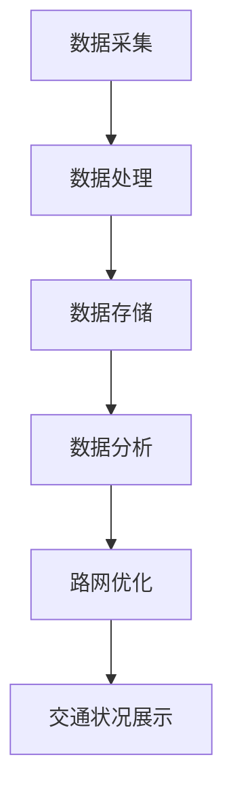
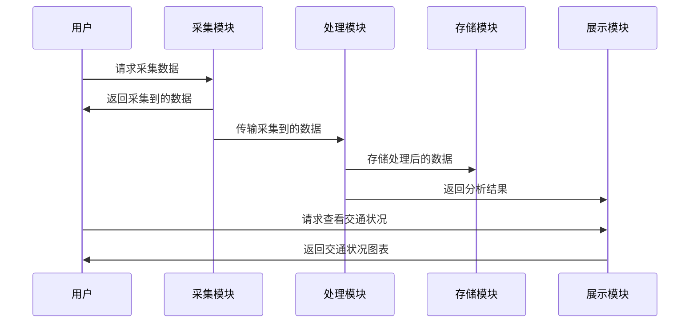

                 

### 文章标题

《大数据在交通规划中的应用：优化城市交通网络》

### 关键词

- 大数据
- 交通规划
- 城市交通网络
- 优化
- 交通流量分析
- 交通拥堵预测

### 摘要

随着城市化进程的加快，城市交通问题日益严重，如何优化城市交通网络已成为当务之急。本文通过深入探讨大数据在交通规划中的应用，详细分析了大数据如何通过交通流量分析、交通拥堵预测以及路网优化等方面，为城市交通的优化提供科学依据和解决方案。本文旨在为交通规划师和相关领域专业人员提供一份全面的大数据交通规划指南，为智慧城市的建设贡献力量。

---

## 第一部分：引论

### 1.1 问题背景

随着全球城市化进程的加快，城市人口和车辆数量的急剧增长，城市交通问题日益突出。交通拥堵、交通事故频发、空气污染严重等问题不仅影响了居民的生活质量，也对城市的可持续发展构成了挑战。传统的交通规划方法在应对日益复杂的城市交通状况时，显得力不从心。因此，如何利用现代技术手段，特别是大数据技术，对城市交通进行科学规划和优化，已成为一个亟待解决的问题。

### 1.2 问题描述

城市交通问题主要包括以下几个方面：

1. **交通拥堵**：高峰时段道路拥堵，交通流量大，导致通行效率低下。
2. **交通事故**：由于驾驶行为不规范、道路设计不合理等原因，导致交通事故频发。
3. **空气质量**：汽车尾气排放导致空气污染问题严重。
4. **停车难题**：停车位不足，导致停车难现象普遍。

### 1.3 大数据在交通规划中的作用

大数据技术的出现为解决城市交通问题提供了新的思路和方法。大数据可以通过对海量交通数据的收集、存储、处理和分析，提供以下几方面的支持：

1. **实时交通流量监控**：通过传感器、摄像头等设备实时收集交通数据，对道路流量、车速等进行监控。
2. **交通拥堵预测**：利用历史交通数据，通过机器学习算法预测未来交通流量变化，提前预警交通拥堵。
3. **路网优化**：基于大数据分析，对路网进行优化设计，提高道路通行效率。
4. **公共交通规划**：通过大数据分析，优化公共交通线路和调度，提高公共交通服务水平。

## 2. 大数据概念与交通规划的关系

### 2.1 大数据概念解析

大数据（Big Data）是指无法用常规软件工具在合理时间内捕捉、管理和处理的数据集合。这些数据具有“4V”特征：Volume（大量）、Velocity（高速）、Variety（多样）和 Veracity（真实性）。大数据技术的核心在于数据的收集、存储、处理和分析。

### 2.2 大数据与交通规划的关系

大数据技术在交通规划中的应用主要体现在以下几个方面：

1. **数据收集**：通过传感器、摄像头、移动设备等收集实时交通数据。
2. **数据存储**：利用分布式存储技术，如Hadoop、NoSQL数据库等，存储海量交通数据。
3. **数据处理**：采用大数据处理技术，如MapReduce、Spark等，对交通数据进行分析和处理。
4. **数据分析**：通过数据挖掘和机器学习算法，提取交通数据的特征和规律，为交通规划提供支持。

## 3. 交通规划中的大数据类型

### 3.1 结构化数据

结构化数据是指那些具有固定格式和固定数据模型的数据，如数据库中的表格数据。交通规划中的结构化数据主要包括：

1. **车辆信息**：车牌号码、车型、行驶速度等。
2. **道路信息**：道路名称、长度、宽度、车道数量等。
3. **交通信号灯信息**：信号灯颜色、变化周期等。

### 3.2 非结构化数据

非结构化数据是指没有固定格式和模型的数据，如文本、图片、音频、视频等。交通规划中的非结构化数据主要包括：

1. **交通监控视频**：通过摄像头收集的实时交通视频数据。
2. **气象数据**：风力、湿度、降雨量等。
3. **交通事件报告**：交通事故、道路施工等。

### 3.3 半结构化数据

半结构化数据是指那些具有部分结构化的数据，如XML、JSON等。交通规划中的半结构化数据主要包括：

1. **GPS数据**：车辆的GPS位置信息。
2. **交通传感器数据**：交通流量、车速等传感器数据。
3. **交通信号数据**：交通信号灯的状态信息。

## 第二部分：大数据在交通规划中的应用

### 4.1 交通流量分析

交通流量分析是大数据在交通规划中的基础应用之一。通过分析交通流量数据，可以了解不同时间段、不同路段的交通状况，为交通规划和优化提供依据。

#### 数据收集

交通流量数据可以通过以下方式收集：

1. **车载传感器**：车辆内置的传感器可以实时监测车辆的行驶速度、位置等信息。
2. **交通传感器**：道路上的传感器可以实时监测道路上的车流量、车速等信息。
3. **摄像头**：通过摄像头可以捕捉车辆的实时行驶情况，用于后续的交通流量分析。

#### 数据处理

收集到的交通流量数据需要进行预处理，包括数据清洗、去噪、格式转换等步骤。然后，利用大数据处理技术，如MapReduce、Spark等，对交通流量数据进行处理，提取有用的信息。

#### 数据分析

通过数据分析，可以得出以下结论：

1. **高峰时段和低峰时段的交通流量**：了解交通流量的高峰和低峰时段，为交通信号灯的优化提供依据。
2. **不同路段的交通流量分布**：了解不同路段的交通流量分布，为路网的优化提供依据。
3. **交通拥堵点分析**：通过分析交通流量数据，找出交通拥堵的点，制定相应的缓解措施。

### 4.2 交通拥堵预测

交通拥堵预测是大数据在交通规划中的高级应用。通过预测未来交通流量变化，可以提前预警交通拥堵，制定相应的交通管理措施。

#### 数据收集

交通拥堵预测需要收集大量的历史交通数据，包括交通流量、交通事故、道路施工等信息。这些数据可以通过以下方式收集：

1. **交通流量数据**：通过交通传感器、摄像头等设备收集。
2. **交通事故数据**：通过交通管理部门、媒体等渠道收集。
3. **道路施工数据**：通过城市规划部门、施工企业等渠道收集。

#### 数据处理

收集到的交通数据需要进行预处理，包括数据清洗、去噪、格式转换等步骤。然后，利用大数据处理技术，如MapReduce、Spark等，对交通数据进行分析和处理。

#### 数据分析

通过数据分析，可以得出以下结论：

1. **未来交通流量预测**：通过机器学习算法，如时间序列分析、回归分析等，预测未来交通流量变化。
2. **交通拥堵预警**：根据预测结果，提前预警可能出现的交通拥堵点，制定相应的交通管理措施。

### 4.3 路网优化

路网优化是大数据在交通规划中的核心应用。通过分析交通流量数据，对路网进行优化设计，提高道路通行效率。

#### 数据收集

路网优化需要收集以下数据：

1. **交通流量数据**：通过交通传感器、摄像头等设备收集。
2. **道路信息**：通过城市规划部门、道路管理部门等渠道收集。
3. **交通信号灯信息**：通过交通信号灯控制系统收集。

#### 数据处理

收集到的路网数据需要进行预处理，包括数据清洗、去噪、格式转换等步骤。然后，利用大数据处理技术，如MapReduce、Spark等，对路网数据进行分析和处理。

#### 数据分析

通过数据分析，可以得出以下结论：

1. **路网流量分布**：了解不同路段的交通流量分布，找出交通流量大的路段。
2. **路网瓶颈分析**：通过分析交通流量数据，找出路网中的瓶颈路段，进行优化设计。
3. **路网优化方案**：根据分析结果，提出路网优化方案，如增加车道、调整交通信号灯配时等。

## 5. 大数据在公共交通规划中的应用

### 5.1 公共交通线路优化

公共交通线路优化是大数据在公共交通规划中的重要应用。通过分析交通流量数据，可以优化公共交通线路设计，提高公共交通服务水平。

#### 数据收集

公共交通线路优化需要收集以下数据：

1. **交通流量数据**：通过交通传感器、摄像头等设备收集。
2. **公共交通数据**：通过公共交通运营企业收集。
3. **人口流动数据**：通过人口普查、移动设备等收集。

#### 数据处理

收集到的公共交通数据需要进行预处理，包括数据清洗、去噪、格式转换等步骤。然后，利用大数据处理技术，如MapReduce、Spark等，对公共交通数据进行分析和处理。

#### 数据分析

通过数据分析，可以得出以下结论：

1. **公共交通需求分析**：了解不同地区、不同时间段的公共交通需求，为线路优化提供依据。
2. **公共交通流量分布**：了解不同公共交通线路的流量分布，找出流量大的线路。
3. **公共交通线路优化方案**：根据分析结果，提出公共交通线路优化方案，如调整线路走向、增加班次等。

### 5.2 公共交通调度

公共交通调度是大数据在公共交通规划中的另一重要应用。通过实时监控公共交通运行状态，可以优化调度方案，提高公共交通的运行效率。

#### 数据收集

公共交通调度需要收集以下数据：

1. **公共交通运行数据**：通过公共交通运营企业收集。
2. **交通流量数据**：通过交通传感器、摄像头等设备收集。
3. **道路信息**：通过城市规划部门、道路管理部门等渠道收集。

#### 数据处理

收集到的公共交通调度数据需要进行预处理，包括数据清洗、去噪、格式转换等步骤。然后，利用大数据处理技术，如MapReduce、Spark等，对公共交通调度数据进行分析和处理。

#### 数据分析

通过数据分析，可以得出以下结论：

1. **公共交通运行状态分析**：了解公共交通的实时运行状态，如车辆位置、速度等。
2. **公共交通调度优化方案**：根据分析结果，提出公共交通调度优化方案，如调整班次、调整线路等。
3. **公共交通服务质量评估**：通过对公共交通运行状态的分析，评估公共交通的服务质量。

### 5.3 公共交通设施规划

公共交通设施规划是大数据在公共交通规划中的又一重要应用。通过分析交通流量数据，可以优化公共交通设施的布局，提高公共交通的便捷性和可达性。

#### 数据收集

公共交通设施规划需要收集以下数据：

1. **交通流量数据**：通过交通传感器、摄像头等设备收集。
2. **公共交通数据**：通过公共交通运营企业收集。
3. **人口流动数据**：通过人口普查、移动设备等收集。

#### 数据处理

收集到的公共交通设施规划数据需要进行预处理，包括数据清洗、去噪、格式转换等步骤。然后，利用大数据处理技术，如MapReduce、Spark等，对公共交通设施规划数据进行分析和处理。

#### 数据分析

通过数据分析，可以得出以下结论：

1. **公共交通设施需求分析**：了解不同地区、不同时间段的公共交通设施需求，为设施规划提供依据。
2. **公共交通设施布局优化**：根据分析结果，提出公共交通设施布局优化方案，如增加公交站、调整站点位置等。
3. **公共交通设施可达性分析**：了解不同公共交通设施的可达性，为设施规划提供依据。

## 6. 大数据在智能交通系统中的应用

### 6.1 智能交通信号控制

智能交通信号控制是大数据在智能交通系统中的重要应用。通过分析交通流量数据，可以优化交通信号灯的配时，提高道路通行效率。

#### 数据收集

智能交通信号控制需要收集以下数据：

1. **交通流量数据**：通过交通传感器、摄像头等设备收集。
2. **交通信号灯信息**：通过交通信号灯控制系统收集。
3. **道路信息**：通过城市规划部门、道路管理部门等渠道收集。

#### 数据处理

收集到的智能交通信号控制数据需要进行预处理，包括数据清洗、去噪、格式转换等步骤。然后，利用大数据处理技术，如MapReduce、Spark等，对智能交通信号控制数据进行分析和处理。

#### 数据分析

通过数据分析，可以得出以下结论：

1. **交通流量分布分析**：了解不同路段的交通流量分布，为交通信号灯配时优化提供依据。
2. **交通信号灯配时优化**：根据分析结果，提出交通信号灯配时优化方案，如调整信号灯变化周期、相位等。
3. **道路通行效率评估**：通过对交通信号灯配时优化的效果评估，提高道路通行效率。

### 6.2 车联网与大数据

车联网（Internet of Vehicles，IoV）是大数据在智能交通系统中的另一个重要应用。通过车联网技术，可以实现车辆与车辆、车辆与基础设施之间的信息交换和共享，为交通管理和优化提供支持。

#### 数据收集

车联网与大数据应用需要收集以下数据：

1. **车辆信息**：通过车载传感器、GPS等设备收集。
2. **交通信号信息**：通过交通信号灯控制系统收集。
3. **道路信息**：通过城市规划部门、道路管理部门等渠道收集。

#### 数据处理

收集到的车联网数据需要进行预处理，包括数据清洗、去噪、格式转换等步骤。然后，利用大数据处理技术，如MapReduce、Spark等，对车联网数据进行分析和处理。

#### 数据分析

通过数据分析，可以得出以下结论：

1. **车辆运行状态分析**：了解车辆的实时运行状态，如速度、位置等。
2. **道路状况分析**：通过车辆信息，了解道路的实时状况，为交通管理和优化提供依据。
3. **车辆调度优化**：根据分析结果，提出车辆调度优化方案，如调整车辆行驶路线、增加或减少车辆等。

### 6.3 智能交通监控

智能交通监控是大数据在智能交通系统中的应用之一。通过实时监控交通状况，可以及时发现交通事件，并采取相应的应对措施。

#### 数据收集

智能交通监控需要收集以下数据：

1. **交通流量数据**：通过交通传感器、摄像头等设备收集。
2. **交通事件数据**：通过交通监控中心收集。
3. **道路信息**：通过城市规划部门、道路管理部门等渠道收集。

#### 数据处理

收集到的智能交通监控数据需要进行预处理，包括数据清洗、去噪、格式转换等步骤。然后，利用大数据处理技术，如MapReduce、Spark等，对智能交通监控数据进行分析和处理。

#### 数据分析

通过数据分析，可以得出以下结论：

1. **交通事件预警**：通过实时监控交通状况，提前预警可能出现的交通事件，如交通事故、道路拥堵等。
2. **交通事件处理**：根据预警结果，采取相应的应对措施，如调整交通信号灯配时、疏散交通等。
3. **交通状况分析**：通过对交通事件的记录和分析，了解交通状况，为交通管理和优化提供依据。

## 7.1 案例一：某城市交通网络优化

### 项目介绍

某城市位于我国东部沿海地区，随着城市规模的不断扩大，交通拥堵问题日益严重。为了提高城市交通通行效率，该城市决定利用大数据技术对交通网络进行优化。

### 系统功能设计

该交通网络优化系统主要包括以下几个功能模块：

1. **交通流量监控**：通过安装在主要路段的传感器和摄像头，实时收集交通流量数据。
2. **交通数据分析**：对收集到的交通流量数据进行处理和分析，提取有用的信息。
3. **路网优化建议**：根据分析结果，提出路网优化建议，如调整交通信号灯配时、增加车道等。
4. **交通状况展示**：将优化后的交通状况以图表形式展示，供城市交通管理部门参考。

### 系统架构设计

该交通网络优化系统的整体架构如图所示：

### 系统接口设计

系统接口设计包括以下几个方面：

1. **数据采集接口**：用于接收传感器和摄像头的数据。
2. **数据处理接口**：用于处理和分析交通流量数据。
3. **数据存储接口**：用于存储处理后的交通数据。
4. **数据展示接口**：用于展示优化后的交通状况。

### 系统交互

系统交互设计如图所示：

### 系统核心实现

系统核心实现主要包括以下几个步骤：

1. **数据采集**：通过传感器和摄像头实时采集交通流量数据。
2. **数据处理**：对采集到的交通流量数据进行预处理，如数据清洗、去噪等，然后利用大数据处理技术进行分析。
3. **数据存储**：将处理后的交通数据存储到数据库中，以便后续查询和分析。
4. **数据分析**：利用机器学习算法，如时间序列分析、回归分析等，对交通流量数据进行分析，提取交通流量规律。
5. **路网优化**：根据分析结果，提出路网优化建议，如调整交通信号灯配时、增加车道等。
6. **交通状况展示**：将优化后的交通状况以图表形式展示，供城市交通管理部门参考。

### 系统实际案例分析和详细讲解

#### 案例分析

在某次交通网络优化项目中，通过对某城市主要路段的交通流量数据进行分析，发现以下几个问题：

1. **高峰时段交通拥堵**：在早晨7:00-9:00和晚上17:00-19:00，主要路段的交通流量明显增加，导致拥堵现象严重。
2. **部分路段交通流量不平衡**：某些路段的交通流量远大于其他路段，导致交通拥堵现象加剧。
3. **交通信号灯配时不合理**：部分交通信号灯的配时过长，导致道路通行效率低下。

#### 详细讲解

1. **数据采集**：在该项目中，通过在主要路段安装传感器和摄像头，实时采集交通流量数据。传感器可以监测车辆的速度、数量等信息，摄像头可以实时捕捉道路上的车辆状况。

2. **数据处理**：采集到的交通流量数据经过预处理后，利用大数据处理技术进行进一步分析。预处理包括数据清洗、去噪、格式转换等步骤，以确保数据的准确性和一致性。

3. **数据分析**：利用机器学习算法，如时间序列分析、回归分析等，对交通流量数据进行分析。通过对历史数据的分析，提取出交通流量变化的规律。例如，发现早晨7:00-9:00和晚上17:00-19:00是交通流量高峰时段，部分路段的交通流量远大于其他路段。

4. **路网优化**：根据分析结果，提出路网优化建议。首先，针对高峰时段交通拥堵问题，建议在交通流量大的路段增加车道，提高道路通行能力。其次，针对部分路段交通流量不平衡问题，建议调整交通信号灯配时，确保交通流量均衡。最后，针对交通信号灯配时不合理问题，建议根据实际交通状况动态调整信号灯配时，提高道路通行效率。

5. **交通状况展示**：优化后的交通状况以图表形式展示，包括交通流量分布、交通拥堵点、交通信号灯配时等。城市交通管理部门可以根据这些信息，及时调整交通管理策略，提高交通运行效率。

### 项目小结

通过该项目，某城市实现了交通网络的优化，有效缓解了交通拥堵问题，提高了道路通行效率。项目实施过程中，大数据技术的应用发挥了关键作用，通过数据采集、处理、分析等环节，为路网优化提供了科学依据。项目成功实施后，得到了城市交通管理部门和市民的一致好评，为其他城市提供了有益的借鉴。

## 8. 大数据技术在交通规划中的发展趋势

随着大数据技术的不断发展，其在交通规划中的应用也呈现出新的发展趋势。以下是大数据技术在交通规划中的几个重要发展趋势：

### 8.1 人工智能与大数据的融合

人工智能（AI）技术的快速发展，使得大数据在交通规划中的应用更加智能化。通过将人工智能技术应用于大数据分析，可以实现对交通数据的深度学习和智能预测。例如，利用深度学习算法，可以自动识别交通事件，如交通事故、道路拥堵等，并预测这些事件的发展趋势。这种人工智能与大数据的融合，将大大提高交通规划的准确性和实时性。

### 8.2 区块链技术在交通规划中的应用

区块链技术以其去中心化、不可篡改、透明等特点，在交通规划中具有广泛的应用前景。例如，利用区块链技术，可以建立一个交通数据共享平台，确保交通数据的真实性和安全性。此外，区块链技术还可以用于智能交通系统的建设，如智能交通信号控制和车辆调度等。通过区块链技术，可以实现交通数据的实时共享和智能处理，提高交通系统的效率和可靠性。

### 8.3 大数据技术在智慧城市中的应用

智慧城市是大数据技术的重要应用领域之一。在智慧城市的建设过程中，大数据技术可以用于交通管理、城市规划、公共安全等多个方面。例如，通过大数据技术，可以对城市的交通流量进行实时监控和预测，优化交通信号灯配时，缓解交通拥堵。此外，大数据技术还可以用于城市环境监测、公共安全预警等，提高城市管理的智能化水平。

## 9. 大数据技术在交通规划中的挑战与机遇

### 9.1 挑战分析

尽管大数据技术在交通规划中具有巨大的潜力，但其在实际应用中也面临着一些挑战：

1. **数据隐私保护**：交通数据涉及到个人隐私，如何确保数据的安全和隐私是一个重要挑战。
2. **数据质量**：交通数据的质量直接影响大数据分析的结果，如何确保数据的质量是一个关键问题。
3. **计算能力**：处理海量交通数据需要强大的计算能力，如何有效利用现有资源，提高计算效率，是一个亟待解决的问题。
4. **法律法规**：大数据技术在交通规划中的应用需要遵循相关的法律法规，如何确保合规性是一个挑战。

### 9.2 机遇分析

尽管存在挑战，但大数据技术在交通规划中也面临着巨大的机遇：

1. **提高交通效率**：通过大数据分析，可以优化交通信号灯配时，提高道路通行效率，缓解交通拥堵。
2. **智能交通管理**：大数据技术可以用于智能交通系统的建设，实现车辆的实时监控和智能调度，提高交通系统的效率。
3. **改善公共服务**：通过大数据技术，可以实时监控城市交通状况，为市民提供更加便捷的出行服务。
4. **促进智慧城市建设**：大数据技术在智慧城市中的应用，将推动城市管理水平的提升，促进城市的可持续发展。

## 10. 大数据技术在交通规划中的最佳实践与建议

### 10.1 最佳实践

为了充分发挥大数据技术在交通规划中的作用，以下是一些建议和最佳实践：

1. **数据驱动决策**：在交通规划过程中，充分利用大数据分析结果，将数据作为决策的依据，提高规划的准确性和科学性。
2. **多部门协同**：交通规划涉及多个部门，如城市规划、交通管理部门等，应建立协同工作机制，实现数据的共享和互通。
3. **技术持续更新**：大数据技术不断发展，交通规划部门应持续关注新技术的发展动态，及时引入和应用新技术。
4. **用户参与**：在交通规划过程中，充分听取市民的意见和建议，提高规划的科学性和实用性。

### 10.2 注意事项

在应用大数据技术进行交通规划时，需要注意以下几点：

1. **数据安全**：确保交通数据的安全和隐私，采取有效的数据保护措施，防止数据泄露。
2. **数据质量**：确保数据的质量，定期对数据源进行审核和清洗，确保数据的准确性和一致性。
3. **法律法规**：遵守相关的法律法规，确保大数据技术的应用合法合规。
4. **技术更新**：随着技术的不断进步，及时更新数据处理和分析工具，提高数据处理效率。

### 10.3 拓展阅读

对于希望深入了解大数据在交通规划中的应用的读者，以下是一些推荐阅读的资料：

1. **《大数据交通规划：理论与实践》**：详细介绍了大数据在交通规划中的应用理论和实践案例。
2. **《智能交通系统技术与应用》**：探讨了智能交通系统的技术架构和应用案例，包括大数据技术的应用。
3. **《智慧城市：大数据、人工智能与城市管理》**：分析了大数据和人工智能在智慧城市建设中的应用，包括交通规划方面的内容。
4. **《交通大数据分析与挖掘》**：介绍了交通大数据的分析方法和挖掘技术，包括时间序列分析、回归分析等。

## 结尾

大数据技术在交通规划中的应用，为城市交通问题的解决提供了新的思路和方法。通过本文的讨论，我们可以看到大数据在交通流量分析、交通拥堵预测、路网优化、公共交通规划以及智能交通系统等方面的重要作用。随着大数据技术的不断发展和应用，我们有理由相信，未来城市交通将变得更加高效、便捷和智能。希望本文能为交通规划师和相关领域专业人员提供有益的参考和启示。

### 作者信息

作者：AI天才研究院/AI Genius Institute & 禅与计算机程序设计艺术 /Zen And The Art of Computer Programming

本文作者AI天才研究院致力于推动人工智能和大数据技术的发展，研究其在各个领域的应用。同时，作者在《禅与计算机程序设计艺术》一书中，深入探讨了计算机科学和哲学的融合，为读者提供了独特的视角和深刻的思考。希望通过本文，为读者带来对大数据在交通规划中应用的深入理解。

