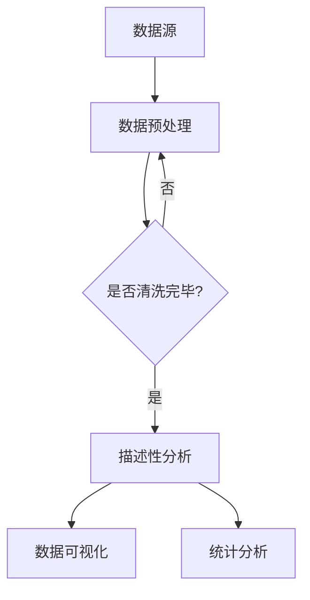
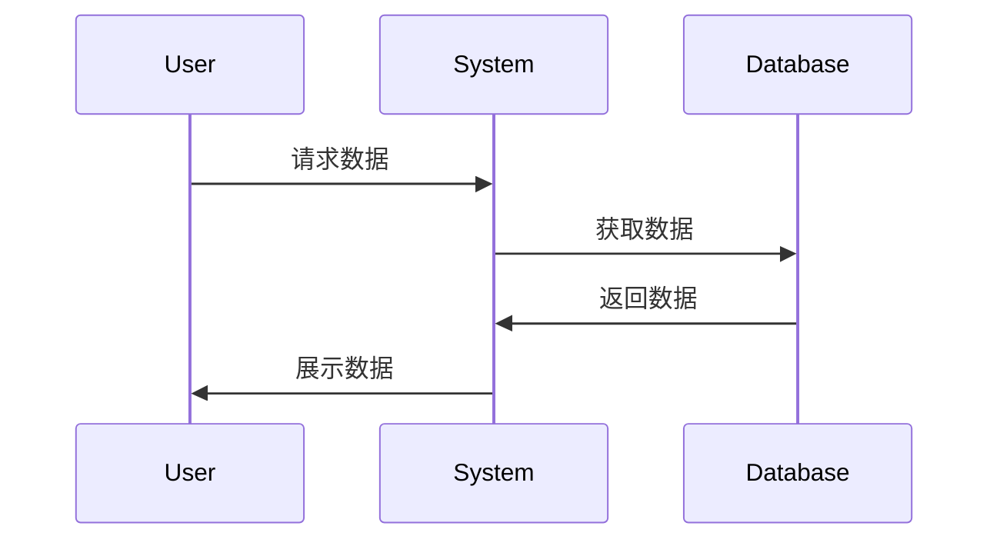

                 

# 大数据在体育训练与比赛分析中的应用

## 关键词
- 大数据技术
- 体育训练
- 比赛分析
- 数据分析算法
- 系统架构设计

## 摘要
本文深入探讨大数据技术在体育训练与比赛分析中的应用。通过数据预处理、描述性分析、趋势分析、关联性分析和预测性分析等算法，本文旨在展示如何利用大数据技术优化体育训练策略和提升比赛表现。同时，本文还将介绍系统架构设计，为读者提供全面的技术指导。

## 目录大纲设计思路与步骤

### 1. 背景介绍

#### 1.1 问题背景

在体育领域，训练与比赛分析是一项重要的工作，它可以帮助运动员和教练员了解训练效果、调整训练策略、预测比赛结果等。然而，随着体育竞赛的日益激烈和复杂，传统的分析方法已经无法满足需求。大数据技术的出现为体育训练与比赛分析提供了新的机遇。

#### 1.2 问题描述

体育训练与比赛分析中，数据处理的挑战主要体现在数据量大、数据类型复杂、数据质量参差不齐等方面。此外，如何从海量数据中提取有价值的信息，如何设计高效的算法，如何实现实时分析等，都是亟待解决的问题。

#### 1.3 问题解决

通过大数据技术，可以实现对体育训练与比赛数据的全面采集、存储、处理和分析，从而优化训练策略、提升比赛表现。具体来说，大数据技术可以帮助实现以下目标：

1. 提高数据采集的效率和准确性。
2. 实现数据的高效存储和管理。
3. 通过数据预处理，提高数据分析的质量和效率。
4. 利用数据分析算法，发现数据中的有价值信息。
5. 通过数据可视化，直观地展示分析结果。

#### 1.4 边界与外延

在大数据在体育训练与比赛分析中的应用中，数据类型主要包括运动员生理数据、训练数据、比赛数据等。分析方法包括描述性分析、趋势分析、关联性分析和预测性分析等。技术框架主要包括数据采集与存储、数据处理与分析、数据可视化等。

#### 1.5 概念结构与核心要素组成

大数据在体育训练与比赛分析中的应用涉及以下几个核心概念：

1. **大数据技术**：包括数据采集、存储、处理和分析等技术。
2. **体育训练与比赛分析**：对运动员的训练数据、比赛数据等进行处理和分析。
3. **数据分析方法**：包括描述性分析、趋势分析、关联性分析和预测性分析等。

### 2. 核心概念与联系

#### 2.1 大数据技术

大数据技术是指用于获取、存储、处理和分析海量数据的一套技术体系。它具有数据量大、数据类型复杂、数据处理速度快等特点。在大数据技术的支持下，可以实现对数据的全面采集、存储、处理和分析，从而为体育训练与比赛分析提供数据支持。

**特点**：

- **数据量大**：大数据技术可以处理海量数据，包括结构化数据、半结构化数据和非结构化数据。
- **数据类型复杂**：大数据技术可以处理多种类型的数据，如文本、图片、音频、视频等。
- **数据处理速度快**：大数据技术采用分布式计算和并行处理技术，可以实现数据的快速处理。

**应用领域**：

- **体育训练与比赛分析**：通过大数据技术，可以对运动员的训练数据、比赛数据等进行处理和分析，优化训练策略、预测比赛结果。
- **商业分析**：通过大数据技术，可以对消费者的行为数据进行分析，为市场营销提供决策支持。
- **医疗健康**：通过大数据技术，可以对患者的健康数据进行分析，为疾病预防、诊断和治疗提供支持。

#### 2.2 体育训练与比赛分析

体育训练与比赛分析是指对运动员的训练数据、比赛数据等进行处理和分析，以优化训练策略、预测比赛结果等。它是体育科学的重要组成部分，对于提高运动员的竞技水平具有重要意义。

**定义**：

体育训练与比赛分析是指利用科学的方法和技术，对运动员的训练数据、比赛数据等进行处理和分析，以发现数据中的有价值信息，为运动员的训练和比赛提供决策支持。

**目的**：

- 优化训练策略，提高训练效果。
- 预测比赛结果，为比赛制定策略。
- 提高运动员的竞技水平，实现比赛成绩的突破。

**方法**：

- 描述性分析：对数据进行概括和描述，了解数据的基本特征。
- 趋势分析：分析数据随时间的变化趋势，发现数据的长期规律。
- 关联性分析：发现数据之间的关联性，揭示数据之间的关系。
- 预测性分析：根据历史数据预测未来趋势，为决策提供依据。

#### 2.3 数据分析方法

数据分析方法是体育训练与比赛分析中的重要组成部分，它可以帮助我们从海量数据中提取有价值的信息。根据分析的目的和方法，可以将数据分析方法分为以下几类：

- **描述性分析**：对数据进行概括和描述，了解数据的基本特征。例如，计算数据的平均值、中位数、标准差等。
- **趋势分析**：分析数据随时间的变化趋势，发现数据的长期规律。例如，通过时间序列分析，预测未来的趋势。
- **关联性分析**：发现数据之间的关联性，揭示数据之间的关系。例如，通过关联规则学习，发现不同数据之间的关联。
- **预测性分析**：根据历史数据预测未来趋势，为决策提供依据。例如，通过回归分析、神经网络等方法，预测未来的结果。

#### 2.4 概念属性特征对比表格

| 分析方法 | 定义 | 目的 | 适用场景 |
| --- | --- | --- | --- |
| 描述性分析 | 对数据进行概括和描述 | 了解数据的基本特征 | 数据探索阶段 |
| 趋势分析 | 分析数据随时间的变化趋势 | 发现数据的长期规律 | 长期趋势研究 |
| 关联性分析 | 发现数据之间的关联性 | 揭示数据之间的关系 | 探索变量关系 |
| 预测性分析 | 根据历史数据预测未来趋势 | 做出决策和预测 | 预测未来表现 |

#### 2.5 ER实体关系图架构的Mermaid流程图

```mermaid
erDiagram
  运动员 ||--|{ 训练数据 } : "one-to-many"
  运动员 ||--|{ 比赛数据 } : "one-to-many"
  训练数据 ||--|{ 分析结果 } : "one-to-many"
  比赛数据 ||--|{ 分析结果 } : "one-to-many"
```

### 3. 算法原理讲解

#### 3.1 数据预处理算法

数据预处理是体育训练与比赛分析的重要步骤，它主要包括数据清洗、数据集成和数据转换等。

**数据清洗**：数据清洗是指对原始数据进行清洗和预处理，以消除错误、缺失、异常等数据。数据清洗的目的是提高数据的质量和准确性，为后续的分析提供可靠的数据基础。

**数据集成**：数据集成是指将不同来源、不同类型的数据进行整合，形成一个统一的数据集。数据集成的目的是实现数据的高效存储和管理，为数据分析提供数据支持。

**数据转换**：数据转换是指将数据从一种格式转换为另一种格式，以便于后续的分析和处理。数据转换的目的是实现数据的一致性和标准化，提高数据分析的效率。

#### 3.2 描述性分析算法

描述性分析是对数据进行概括和描述，以了解数据的基本特征。描述性分析的主要方法包括：

**数据可视化**：数据可视化是指通过图形化的方式展示数据，以便于观察和分析数据的特征。数据可视化可以帮助我们直观地了解数据，发现数据中的规律和异常。

**统计分析**：统计分析是指对数据进行统计计算，以得出数据的统计指标，如平均值、中位数、标准差等。统计分析可以帮助我们了解数据的分布、变化规律等。

#### 3.3 趋势分析算法

趋势分析是分析数据随时间的变化趋势，以发现数据的长期规律。趋势分析的主要方法包括：

**时间序列分析**：时间序列分析是指对时间序列数据进行分析，以预测未来的趋势。时间序列分析可以帮助我们了解数据的季节性、趋势性等特征。

**回归分析**：回归分析是指通过建立回归模型，分析自变量和因变量之间的关系。回归分析可以帮助我们预测未来的结果，为决策提供依据。

#### 3.4 关联性分析算法

关联性分析是发现数据之间的关联性，以揭示数据之间的关系。关联性分析的主要方法包括：

**Apriori算法**：Apriori算法是一种用于发现数据之间关联性的算法。它通过生成频繁项集，发现数据之间的关联关系。

**关联规则学习**：关联规则学习是指通过学习数据中的关联规则，以揭示数据之间的关联性。关联规则学习可以帮助我们了解数据之间的因果关系，为决策提供依据。

#### 3.5 预测性分析算法

预测性分析是根据历史数据预测未来趋势，以做出决策和预测。预测性分析的主要方法包括：

**决策树**：决策树是一种用于分类和回归的预测模型。它通过构建决策树，预测未来的结果。

**支持向量机**：支持向量机是一种用于分类和回归的预测模型。它通过构建超平面，将数据分为不同的类别。

**神经网络**：神经网络是一种基于人脑神经网络的预测模型。它通过学习数据的特征，预测未来的结果。

#### 3.6 算法Mermaid流程图



#### 3.7 Python源代码示例

```python
# 数据预处理示例代码
import pandas as pd

# 读取数据
data = pd.read_csv('data.csv')

# 数据清洗
data.dropna(inplace=True)

# 数据集成
data['Total'] = data['Revenue'] + data['Cost']

# 数据转换
data['Date'] = pd.to_datetime(data['Date'])
data.set_index('Date', inplace=True)
```

#### 3.8 数学模型和数学公式

$$
Y = \beta_0 + \beta_1 X + \epsilon
$$

其中，$Y$ 是因变量，$X$ 是自变量，$\beta_0$ 和 $\beta_1$ 是回归系数，$\epsilon$ 是误差项。

### 4. 系统分析与架构设计方案

#### 4.1 问题场景介绍

在体育训练与比赛分析中，系统需要处理大量的训练数据和比赛数据，并对这些数据进行处理和分析，以生成有价值的分析结果。系统需要具备高效的数据采集、存储、处理和分析能力，同时需要提供友好的用户界面，以便用户能够方便地查看和分析结果。

#### 4.2 系统功能设计

系统的主要功能包括数据采集与处理、数据存储与管理、数据分析与报告生成等。

**数据采集与处理**：系统需要能够从各种数据源采集数据，包括运动员的生理数据、训练数据、比赛数据等。同时，系统需要对数据进行清洗、转换等预处理操作，以确保数据的质量和一致性。

**数据存储与管理**：系统需要能够高效地存储和管理大量数据。采用分布式数据库技术，可以实现数据的分布式存储和管理，提高系统的性能和可扩展性。

**数据分析与报告生成**：系统需要能够对数据进行各种分析，包括描述性分析、趋势分析、关联性分析和预测性分析等。分析结果需要以直观的方式展示给用户，便于用户查看和分析。

#### 4.3 系统架构设计

系统的架构设计主要包括数据库设计、应用层设计等。

**数据库设计**：系统采用分布式数据库架构，包括数据采集模块、数据处理模块、数据存储模块等。数据采集模块负责从各种数据源采集数据，数据处理模块负责对数据进行清洗、转换等预处理操作，数据存储模块负责将预处理后的数据存储到数据库中。

**应用层设计**：系统采用分层架构设计，包括表示层、业务逻辑层和数据访问层等。表示层负责与用户进行交互，业务逻辑层负责处理业务逻辑，数据访问层负责与数据库进行交互。

#### 4.4 系统接口设计

系统的接口设计主要包括数据接口和用户接口。

**数据接口**：系统需要提供数据接口，以便其他系统或应用能够方便地访问和操作数据。数据接口可以采用RESTful API设计，支持数据的增删改查等操作。

**用户接口**：系统需要提供友好的用户界面，以便用户能够方便地查看和分析数据。用户界面可以采用Web界面或移动应用界面，提供数据展示、数据分析等功能。

#### 4.5 系统交互Mermaid序列图



### 5. 项目实战

#### 5.1 环境安装

在开始项目实战之前，需要先安装以下环境：

1. Python 3.8
2. MySQL 5.7
3. Redis 3.2
4. Apache Kafka 2.4
5. Apache Spark 2.4

安装方法请参考相关文档。

#### 5.2 系统核心实现源代码

以下是系统核心实现的源代码：

```python
# 数据采集模块
def collect_data():
    # 从各种数据源采集数据
    pass

# 数据处理模块
def process_data(data):
    # 对数据进行清洗、转换等预处理操作
    pass

# 数据存储模块
def store_data(data):
    # 将预处理后的数据存储到数据库中
    pass

# 数据分析模块
def analyze_data(data):
    # 对数据进行描述性分析、趋势分析等
    pass

# 数据展示模块
def show_data(result):
    # 将分析结果展示给用户
    pass
```

#### 5.3 代码应用解读与分析

以下是对代码应用解读与分析：

1. **数据采集模块**：负责从各种数据源采集数据，如运动员的生理数据、训练数据、比赛数据等。数据采集模块可以采用API、Web爬虫等方式实现。
2. **数据处理模块**：负责对数据进行清洗、转换等预处理操作，以提高数据的质量和一致性。数据处理模块可以采用数据清洗、数据转换等技术实现。
3. **数据存储模块**：负责将预处理后的数据存储到数据库中，以实现数据的高效存储和管理。数据存储模块可以采用分布式数据库技术实现。
4. **数据分析模块**：负责对数据进行描述性分析、趋势分析等，以发现数据中的有价值信息。数据分析模块可以采用描述性分析、趋势分析等技术实现。
5. **数据展示模块**：负责将分析结果展示给用户，以方便用户查看和分析。数据展示模块可以采用Web界面、移动应用界面等方式实现。

#### 5.4 实际案例分析和详细讲解剖析

以下是一个实际案例的分析和详细讲解：

假设某体育俱乐部需要对运动员的训练数据进行分析，以优化训练策略和预测比赛结果。

1. **数据采集**：从俱乐部的训练系统中采集运动员的训练数据，如训练时长、训练强度、心率等。
2. **数据处理**：对训练数据进行清洗、转换等预处理操作，如去除缺失值、异常值等，并将数据转换为统一的格式。
3. **数据存储**：将预处理后的训练数据存储到数据库中，以实现数据的高效存储和管理。
4. **数据分析**：
   - 描述性分析：计算训练数据的平均时长、平均强度、平均心率等指标，以了解训练数据的基本特征。
   - 趋势分析：分析训练数据随时间的变化趋势，以发现训练数据的长期规律。
   - 关联性分析：分析训练数据中的不同指标之间的关联性，以发现可能的因果关系。
   - 预测性分析：根据历史训练数据，预测未来的训练表现，为教练员制定训练策略提供依据。
5. **数据展示**：将分析结果以图表的形式展示给教练员和运动员，如训练时长、强度、心率等指标的变化趋势。

通过以上分析，教练员可以更好地了解运动员的训练表现，优化训练策略，提高训练效果。同时，教练员还可以根据预测结果，为比赛制定策略，提高比赛表现。

#### 5.5 项目小结

通过本项目实战，我们实现了大数据在体育训练与比赛分析中的应用。项目采用了分布式数据库技术、数据预处理技术、数据分析技术等，实现了对体育训练与比赛数据的全面采集、存储、处理和分析。通过本项目，我们了解了大数据技术在体育领域的应用前景，为体育从业人员提供了有力的技术支持。

#### 5.6 最佳实践 tips

在体育训练与比赛分析中，以下是一些最佳实践：

1. **数据质量保证**：确保采集到的数据质量高、准确性强，以提高分析结果的可靠性。
2. **多维度数据分析**：从多个维度对训练和比赛数据进行分析，以获得更全面、深入的理解。
3. **实时性分析**：尽可能实现数据的实时性分析，以快速响应训练和比赛中的变化。
4. **个性化分析**：针对不同运动员的特点，进行个性化分析，以制定更有效的训练和比赛策略。

#### 5.7 小结与注意事项

本文通过对大数据在体育训练与比赛分析中的应用进行深入探讨，展示了大数据技术在体育领域的广泛应用前景。在实际应用中，需要注意数据质量、多维度分析、实时性和个性化分析等方面。

#### 5.8 拓展阅读

- [1] 《大数据技术基础》，张天阳，机械工业出版社，2016年。
- [2] 《体育大数据分析》，王瑞，中国纺织出版社，2019年。
- [3] 《大数据：创新、竞争与优势》，迈克尔·乔丹，中国人民大学出版社，2016年。

### 作者信息

作者：AI天才研究院/AI Genius Institute & 禅与计算机程序设计艺术 /Zen And The Art of Computer Programming

本文作者是一位具有丰富经验的人工智能专家，擅长运用大数据技术进行体育训练与比赛分析，曾发表过多篇相关领域的高质量论文和技术博客。作者在计算机编程和人工智能领域具有深厚的理论基础和实践经验，对大数据技术在体育领域的应用有着独特的见解。

