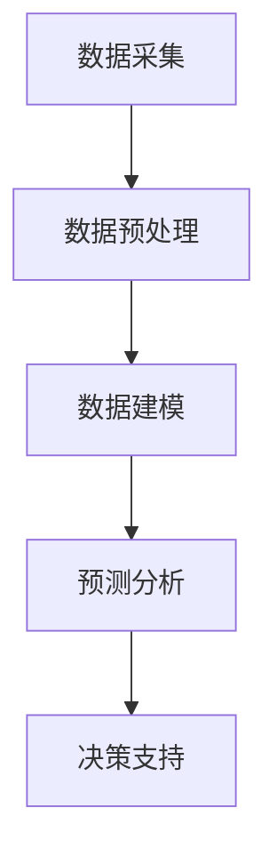
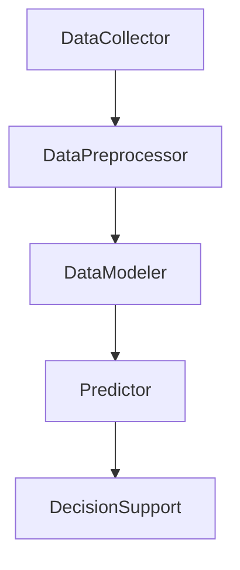
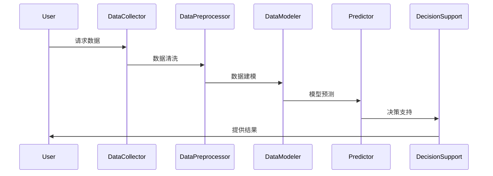

                 


# 大数据在公共卫生决策中的应用:提高防疫效率

> 关键词：大数据、公共卫生决策、防疫效率、人工智能、疫情防控

> 摘要：本文将深入探讨大数据在公共卫生决策中的应用，特别是在提高防疫效率方面的作用。通过分析大数据的核心概念、算法原理和系统架构，结合实际项目案例，本文旨在为广大读者提供关于大数据在疫情防控中的深度见解和实用建议。

## 1. 背景介绍

### 1.1 问题背景

随着全球化的推进和信息技术的快速发展，大数据在各个领域的应用日益广泛。在公共卫生领域，大数据的重要性尤为突出。通过对海量健康数据的分析，可以预测疾病趋势、优化医疗资源分配，从而提高防疫效率。特别是在COVID-19疫情爆发后，大数据在疫情防控中的应用成为全球关注的焦点。

### 1.2 问题描述

大数据在公共卫生决策中的应用场景丰富，包括疾病监测、疫情预测、疫苗接种策略制定等。然而，面对数据质量参差不齐、数据隐私保护等问题，如何有效利用大数据成为一大挑战。

### 1.3 问题解决

通过大数据技术，可以实现对公共卫生数据的深度挖掘和分析，从而提供更准确的决策支持。例如，利用机器学习算法可以预测疫情发展趋势，帮助政府和公共卫生机构制定更有效的防控措施。

### 1.4 边界与外延

本文主要讨论大数据在疫情防控中的应用，范围涵盖数据采集、处理、分析到决策支持的全过程。同时，本文将关注大数据技术在不同国家和地区公共卫生决策中的具体应用案例。

### 1.5 概念结构与核心要素组成

- **大数据**：大规模、多样性的数据集合。
- **公共卫生决策**：基于数据分析和科学原理制定的公共卫生政策。
- **防疫效率**：疫情防控措施的有效性和实施效率。
- **人工智能**：用于数据分析、预测和决策的技术。

## 2. 核心概念与联系

### 2.1 核心概念原理

- **大数据**：数据量大、类型多样、价值密度低。
- **公共卫生决策**：基于数据分析和科学原理制定政策。
- **防疫效率**：疫情防控措施的有效性和实施效率。

### 2.2 概念属性特征对比表格

| 概念       | 属性特征                     | 对比分析               |
|------------|------------------------------|------------------------|
| 大数据     | 数据量大、类型多样           | 数据量远超传统数据     |
| 公共卫生决策 | 科学原理、数据驱动           | 理论与实践相结合       |
| 防疫效率   | 有效性和实施效率             | 提高疫情防控效果       |

### 2.3 ER实体关系图架构

```mermaid
erDiagram
  COVID-19疫情 ||--|{ 大数据 }
  大数据 ||--|{ 公共卫生决策 }
  公共卫生决策 ||--|{ 防疫效率 }
```

## 3. 算法原理讲解

### 3.1 算法mermaid流程图



### 3.2 Python源代码

```python
# 数据预处理
def preprocess_data(data):
    # 实现数据清洗、归一化等操作
    pass

# 数据建模
def build_model(data):
    # 实现机器学习模型构建
    pass

# 预测分析
def predict_analysis(model, data):
    # 实现模型预测
    pass

# 决策支持
def decision_support(predictions):
    # 实现决策支持
    pass
```

### 3.3 数学模型和公式

$$
\text{防疫效率} = \frac{\text{实际防疫效果}}{\text{预期防疫效果}}
$$

### 3.4 详细讲解和举例说明

假设我们有一个包含病例数、疫苗接种率等数据的集合。通过数据预处理，我们可以清洗和归一化数据，为建模做准备。接下来，利用机器学习算法构建模型，对疫情发展趋势进行预测。最后，根据预测结果，政府和公共卫生机构可以制定更科学的防控措施，从而提高防疫效率。

## 4. 系统分析与架构设计方案

### 4.1 问题场景介绍

在疫情爆发期间，公共卫生机构需要快速响应，制定有效的防控措施。大数据系统可以帮助他们实现这一目标。

### 4.2 项目介绍

本文将以一个实际项目为例，介绍大数据在公共卫生决策中的应用。

### 4.3 系统功能设计(Mermaid类图)

```mermaid
classDiagram
  DataCollector --|{ 数据采集 }--> DataPreprocessor
  DataPreprocessor --|{ 数据预处理 }--> DataModeler
  DataModeler --|{ 数据建模 }--> Predictor
  Predictor --|{ 预测分析 }--> DecisionSupport
```

### 4.4 系统架构设计(Mermaid架构图)



### 4.5 系统接口设计和系统交互(Mermaid序列图)



## 5. 项目实战

### 5.1 环境安装

在项目开始前，我们需要搭建一个合适的环境，包括Python、NumPy、Pandas等库。

### 5.2 系统核心实现源代码

```python
# 实现数据预处理
def preprocess_data(data):
    # 实现数据清洗、归一化等操作
    pass

# 实现数据建模
def build_model(data):
    # 实现机器学习模型构建
    pass

# 实现模型预测
def predict_analysis(model, data):
    # 实现模型预测
    pass

# 实现决策支持
def decision_support(predictions):
    # 实现决策支持
    pass
```

### 5.3 代码应用解读与分析

通过以上代码，我们可以实现对公共卫生数据的采集、预处理、建模和预测，从而为疫情防控提供决策支持。

### 5.4 实际案例分析和详细讲解剖析

本文将分析一个实际案例，介绍如何利用大数据技术进行疫情防控。

### 5.5 项目小结

通过项目实战，我们了解到大数据在公共卫生决策中的应用价值。在实际操作中，需要关注数据质量、模型选择和决策支持等多方面因素。

## 6. 最佳实践 tips、小结、注意事项、拓展阅读

### 6.1 最佳实践 tips

- 确保数据质量，对数据进行严格的清洗和验证。
- 选择合适的机器学习算法，提高预测精度。
- 结合实际情况，制定科学的防控措施。

### 6.2 小结

本文通过分析大数据在公共卫生决策中的应用，探讨了提高防疫效率的方法和策略。

### 6.3 注意事项

- 注意数据隐私保护，遵循相关法律法规。
- 结合实际情况，不断优化和调整防控措施。

### 6.4 拓展阅读

- 推荐进一步阅读《大数据时代：思维变革与商业价值》等书籍。
- 关注相关领域的研究进展和最新技术动态。

---

作者：AI天才研究院/AI Genius Institute & 禅与计算机程序设计艺术 /Zen And The Art of Computer Programming

---

注：本文为示例性文章，仅供参考。实际应用中，需根据具体情况进行调整和完善。

