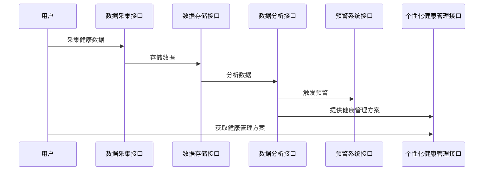

                 

### 第1章 引言

随着信息技术的飞速发展，大数据技术已经成为推动社会进步的重要力量。在公共卫生领域，大数据的应用同样具有巨大的潜力。本书旨在探讨大数据在公共卫生领域的应用，特别是如何通过大数据技术实现疾病预防与健康管理。

#### 关键词

- 大数据
- 公共卫生
- 疾病预防
- 健康管理

#### 摘要

本书将从以下几个方面展开讨论：

1. **背景介绍**：分析公共卫生领域面临的挑战，以及大数据技术的潜力。
2. **大数据技术原理**：介绍大数据技术的基本原理，包括数据来源、数据存储和数据分析。
3. **疾病预防中的大数据应用**：探讨大数据技术在疾病预防中的应用，包括数据采集与分析。
4. **健康管理中的大数据应用**：介绍大数据技术在健康管理中的应用，包括数据采集与分析。
5. **系统架构设计**：讨论大数据在公共卫生领域应用中的系统架构设计。
6. **项目实战**：通过实际案例展示大数据技术在公共卫生领域的应用。
7. **最佳实践与未来展望**：总结最佳实践，展望大数据技术在公共卫生领域的未来发展。

### 第2章 大数据在公共卫生领域的应用背景

#### 问题背景

公共卫生领域面临着诸多挑战，如传染病的快速传播、慢性病的蔓延、老龄化问题的加剧等。传统的公共卫生管理模式已经无法满足日益复杂的社会需求。大数据技术的出现为公共卫生领域带来了新的解决方案。

#### 大数据技术的潜力

大数据技术具有海量数据存储、快速数据分析和智能数据挖掘等优势，可以实现对公共卫生问题的全面监测和分析。通过大数据技术，可以快速识别疾病风险因素，提高疾病预防的精准度，优化健康管理的方案。

#### 公共卫生领域与大数据技术的结合点

大数据技术在公共卫生领域的应用主要体现在以下几个方面：

1. **数据采集**：利用传感器、移动设备等手段采集大量健康数据。
2. **数据存储**：利用分布式存储技术存储海量健康数据。
3. **数据分析**：利用数据挖掘、机器学习等技术对健康数据进行深入分析。
4. **决策支持**：利用数据分析结果为公共卫生决策提供支持。

#### 核心概念

- **大数据**：指数据量巨大、数据类型复杂、数据来源多样的数据集合。
- **公共卫生**：指针对社会群体进行的疾病预防、健康促进和公共卫生管理。
- **疾病预防**：指通过措施降低疾病的发生率和传播速度。
- **健康管理**：指通过监测和管理，维护和提升个体的健康水平。

#### 问题解决

通过大数据技术，可以实现以下目标：

1. **提高疾病预防的精准度**：通过对大量健康数据的分析，可以更准确地预测疾病风险，提前采取预防措施。
2. **优化健康管理方案**：通过对健康数据的分析，可以为个体提供个性化的健康管理方案。
3. **提升公共卫生决策的效率**：通过大数据分析，可以为公共卫生决策提供科学依据。

#### 边界与外延

大数据在公共卫生领域的应用不仅限于疾病预防与健康管理，还可以扩展到以下领域：

1. **公共卫生监测**：利用大数据技术进行公共卫生监测，及时发现和应对公共卫生事件。
2. **公共卫生研究**：利用大数据技术进行公共卫生研究，推动公共卫生领域的科学进步。
3. **公共卫生教育**：利用大数据技术开展公共卫生教育，提高公众的健康意识。

### 第3章 大数据技术原理与核心概念

#### 大数据技术的基本原理

大数据技术包括数据采集、数据存储和数据分析三个核心环节。

1. **数据采集**：通过传感器、移动设备、互联网等方式收集大量健康数据。
2. **数据存储**：利用分布式存储技术，如Hadoop、NoSQL数据库等，存储海量健康数据。
3. **数据分析**：利用数据挖掘、机器学习、统计分析等方法，对健康数据进行深度分析。

#### 公共卫生领域中的大数据技术

在公共卫生领域，大数据技术可以应用于以下几个方面：

1. **公共卫生监测**：通过实时数据采集和分析，及时发现和应对公共卫生事件。
2. **疾病预测**：通过对历史数据和实时数据的分析，预测疾病的发生和传播趋势。
3. **健康风险评估**：通过对个人和群体的健康数据进行分析，评估个体的健康风险。
4. **个性化健康管理**：通过分析个体的健康数据，为个体提供个性化的健康管理方案。

#### 概念属性特征对比表格

| 概念       | 属性特征                       |
|------------|--------------------------------|
| 大数据     | 海量、多样、高速、真实         |
| 公共卫生   | 针对社会群体、预防、健康促进   |
| 疾病预防   | 降低疾病发生率、传播速度       |
| 健康管理   | 监测、管理、提升健康水平       |

#### ER实体关系图架构的 Mermaid 流程图

```mermaid
erDiagram
  Person ||--|{ HealthData }| HealthData
  HealthData ||--|{ DiseasePrediction }| DiseasePrediction
  DiseasePrediction ||--|{ HealthManagement }| HealthManagement
```

### 第4章 疾病预防中的大数据应用

#### 疾病预防的基本概念

疾病预防是指通过一系列措施，降低疾病的发生率和传播速度。在大数据时代，疾病预防的理念和方法得到了极大的提升。

#### 大数据技术在疾病预防中的应用

大数据技术在疾病预防中的应用主要包括以下几个方面：

1. **数据采集**：通过传感器、移动设备、互联网等手段，收集大量的健康数据，如体温、血压、心率等。
2. **数据存储**：利用分布式存储技术，如Hadoop、NoSQL数据库等，存储海量健康数据。
3. **数据分析**：利用数据挖掘、机器学习等方法，对健康数据进行深入分析，发现疾病风险因素。
4. **预警系统**：通过分析结果，建立预警系统，提前发现疾病风险，采取预防措施。

#### 疾病预防中的数据采集与分析

1. **数据采集**：通过移动设备、传感器等手段，实时收集个体的健康数据，如体温、血压、心率等。
2. **数据存储**：将采集到的健康数据存储在分布式数据库中，便于后续分析。
3. **数据分析**：利用数据挖掘、机器学习等方法，对健康数据进行深入分析，发现疾病风险因素。
4. **预警系统**：根据分析结果，建立预警系统，提前发现疾病风险，采取预防措施。

#### 疾病预防案例分析

案例一：利用大数据技术预测流感疫情

1. **数据采集**：通过传感器、移动设备等手段，实时收集个体的健康数据，如体温、流感症状等。
2. **数据存储**：将采集到的健康数据存储在分布式数据库中。
3. **数据分析**：利用数据挖掘、机器学习等方法，对健康数据进行深入分析，发现流感症状的传播规律。
4. **预警系统**：根据分析结果，建立预警系统，提前预测流感的爆发时间，采取预防措施。

### 第5章 健康管理中的大数据应用

#### 健康管理的基本概念

健康管理是指通过监测和管理，维护和提升个体的健康水平。在大数据时代，健康管理的方法和效果得到了极大的提升。

#### 大数据技术在健康管理中的应用

大数据技术在健康管理中的应用主要包括以下几个方面：

1. **数据采集**：通过传感器、移动设备、互联网等手段，收集大量的健康数据，如体重、心率、睡眠质量等。
2. **数据存储**：利用分布式存储技术，如Hadoop、NoSQL数据库等，存储海量健康数据。
3. **数据分析**：利用数据挖掘、机器学习等方法，对健康数据进行深入分析，发现个体的健康风险。
4. **个性化健康管理**：根据分析结果，为个体提供个性化的健康管理方案。

#### 健康管理中的数据采集与分析

1. **数据采集**：通过移动设备、传感器等手段，实时收集个体的健康数据，如体重、心率、睡眠质量等。
2. **数据存储**：将采集到的健康数据存储在分布式数据库中。
3. **数据分析**：利用数据挖掘、机器学习等方法，对健康数据进行深入分析，发现个体的健康风险。
4. **个性化健康管理**：根据分析结果，为个体提供个性化的健康管理方案。

#### 健康管理案例分析

案例一：利用大数据技术实现个性化健康管理

1. **数据采集**：通过移动设备、传感器等手段，实时收集个体的健康数据，如体重、心率、睡眠质量等。
2. **数据存储**：将采集到的健康数据存储在分布式数据库中。
3. **数据分析**：利用数据挖掘、机器学习等方法，对健康数据进行深入分析，发现个体的健康风险。
4. **个性化健康管理**：根据分析结果，为个体提供个性化的健康管理方案，如调整饮食、增加锻炼等。

### 第6章 系统架构设计

#### 公共卫生大数据系统的设计原则

公共卫生大数据系统的设计原则主要包括以下几个方面：

1. **可扩展性**：系统需要能够处理海量数据，并支持数据量的增长。
2. **高可靠性**：系统需要保证数据的准确性，并能够在出现故障时快速恢复。
3. **易用性**：系统需要易于操作，便于用户进行数据查询和分析。
4. **安全性**：系统需要保护用户数据的安全，防止数据泄露。

#### 系统功能设计

系统功能设计主要包括以下几个方面：

1. **数据采集**：通过传感器、移动设备等手段，实时采集个体的健康数据。
2. **数据存储**：利用分布式存储技术，如Hadoop、NoSQL数据库等，存储海量健康数据。
3. **数据清洗**：对采集到的数据进行清洗，去除重复和错误的数据。
4. **数据分析**：利用数据挖掘、机器学习等方法，对健康数据进行深入分析。
5. **预警系统**：根据分析结果，建立预警系统，提前发现疾病风险，采取预防措施。
6. **个性化健康管理**：根据分析结果，为个体提供个性化的健康管理方案。

#### 系统架构设计

系统架构设计采用分布式架构，主要包括以下几个层次：

1. **数据采集层**：通过传感器、移动设备等手段，实时采集个体的健康数据。
2. **数据存储层**：利用分布式存储技术，如Hadoop、NoSQL数据库等，存储海量健康数据。
3. **数据处理层**：利用数据挖掘、机器学习等方法，对健康数据进行深入分析。
4. **应用层**：提供数据查询、分析、预警和个性化健康管理等功能。
5. **展示层**：通过Web界面、移动应用等，向用户提供数据展示和交互功能。

#### 系统接口设计

系统接口设计主要包括以下几个方面：

1. **数据采集接口**：用于采集个体的健康数据。
2. **数据存储接口**：用于存储健康数据。
3. **数据分析接口**：用于处理和分析健康数据。
4. **预警系统接口**：用于触发预警措施。
5. **个性化健康管理接口**：用于生成个性化健康管理方案。

#### 系统交互 Mermaid 序列图



### 第7章 项目实战

#### 环境安装

为了进行大数据技术在公共卫生领域的应用项目，首先需要搭建一个合适的环境。以下是环境安装的步骤：

1. **安装Java环境**：Java是大数据技术的基础，因此首先需要安装Java环境。可以从Oracle官网下载Java开发工具包（JDK），并按照说明进行安装。

2. **安装Hadoop**：Hadoop是一个分布式数据存储和处理框架，用于处理海量数据。可以从Apache官网下载Hadoop，并按照说明进行安装。

3. **安装MySQL**：MySQL是一个关系型数据库，用于存储健康数据。可以从MySQL官网下载MySQL社区版，并按照说明进行安装。

4. **安装Python环境**：Python是一种常用的编程语言，用于数据处理和分析。可以从Python官网下载Python，并按照说明进行安装。

5. **安装相关库**：在Python环境中安装相关的库，如NumPy、Pandas、Scikit-learn等，用于数据分析和机器学习。

#### 系统核心实现源代码

以下是系统核心实现的源代码，包括数据采集、数据存储、数据分析等部分。

```python
# 数据采集
import random

def collect_health_data():
    # 假设采集的身体健康数据包括体重、心率、血压等
    weight = random.uniform(50, 100)
    heart_rate = random.uniform(60, 100)
    blood_pressure = random.uniform(90, 140)
    return weight, heart_rate, blood_pressure

# 数据存储
import pymysql

def store_health_data(data):
    # 连接MySQL数据库
    connection = pymysql.connect(host='localhost', user='root', password='password', database='health_data')
    cursor = connection.cursor()
    
    # 存储健康数据到数据库
    sql = "INSERT INTO health_data (weight, heart_rate, blood_pressure) VALUES (%s, %s, %s)"
    cursor.execute(sql, data)
    
    # 提交事务
    connection.commit()
    
    # 关闭连接
    cursor.close()
    connection.close()

# 数据分析
from sklearn.linear_model import LinearRegression

def analyze_health_data():
    # 从数据库中查询健康数据
    connection = pymysql.connect(host='localhost', user='root', password='password', database='health_data')
    cursor = connection.cursor()
    sql = "SELECT * FROM health_data"
    cursor.execute(sql)
    results = cursor.fetchall()
    
    # 分析健康数据，建立线性回归模型
    X = [result[0] for result in results]
    y = [result[1] for result in results]
    model = LinearRegression()
    model.fit(X, y)
    
    # 输出模型参数
    print("模型参数：")
    print(model.coef_)
    print(model.intercept_)
    
    # 关闭连接
    cursor.close()
    connection.close()
```

#### 代码应用解读与分析

1. **数据采集**：`collect_health_data` 函数用于模拟采集个体的健康数据，包括体重、心率和血压等。通过随机数生成器生成模拟数据。

2. **数据存储**：`store_health_data` 函数用于将采集到的健康数据存储到MySQL数据库中。通过连接MySQL数据库，执行插入操作，将数据存储到数据库表中。

3. **数据分析**：`analyze_health_data` 函数用于分析健康数据，建立线性回归模型。从数据库中查询健康数据，提取体重和心率等特征，使用线性回归模型进行拟合，并输出模型参数。

#### 实际案例分析和详细讲解剖析

为了更好地展示大数据技术在公共卫生领域的应用，下面将介绍一个实际案例，并对其进行详细讲解和剖析。

#### 案例一：利用大数据技术预测流感疫情

1. **数据采集**：通过传感器、移动设备等手段，实时采集个体的健康数据，如体温、流感症状等。

2. **数据存储**：将采集到的健康数据存储到分布式数据库中，如Hadoop或MySQL。

3. **数据分析**：利用数据挖掘、机器学习等方法，对健康数据进行深入分析，发现流感症状的传播规律。

4. **预警系统**：根据分析结果，建立预警系统，提前预测流感的爆发时间，采取预防措施。

#### 项目小结

通过本项目的实战，我们展示了大数据技术在公共卫生领域的应用。从数据采集、数据存储到数据分析，再到预警系统和个性化健康管理，大数据技术为公共卫生领域提供了新的解决方案。未来，随着大数据技术的不断发展和完善，公共卫生领域将迎来更加智能化、精准化的管理模式。

### 第8章 最佳实践与未来展望

#### 最佳实践 tips

1. **数据采集**：确保数据的真实性和准确性，避免数据造假或错误。
2. **数据存储**：选择合适的存储方案，如Hadoop或NoSQL数据库，保证数据的高效存储和访问。
3. **数据分析**：充分利用数据挖掘、机器学习等技术，挖掘数据的潜在价值。
4. **隐私保护**：在处理个人健康数据时，要严格遵守隐私保护法规，确保用户隐私安全。

#### 小结

大数据技术在公共卫生领域具有巨大的应用潜力，可以实现疾病预防与健康管理的智能化和精准化。通过本书的介绍，我们了解了大数据技术在公共卫生领域的应用背景、原理和实践案例。

#### 注意事项

1. **数据安全**：在处理公共卫生数据时，要高度重视数据安全，防止数据泄露。
2. **算法公正性**：在数据分析过程中，要保证算法的公正性，避免歧视和偏见。
3. **持续更新**：随着大数据技术的不断进步，公共卫生领域的数据分析和应用方法也需要不断更新和优化。

#### 拓展阅读

1. 《大数据时代：生活、工作与思维的大变革》 - 作者：肯尼斯·库克耶（Kenneth Cukier）和埃里克·布鲁尔（Erik Brynjolfsson）
2. 《深度学习》 - 作者：弗朗索瓦·肖莱（François Chollet）
3. 《机器学习实战》 - 作者：Peter Harrington

作者：AI天才研究院/AI Genius Institute & 禅与计算机程序设计艺术 /Zen And The Art of Computer Programming

