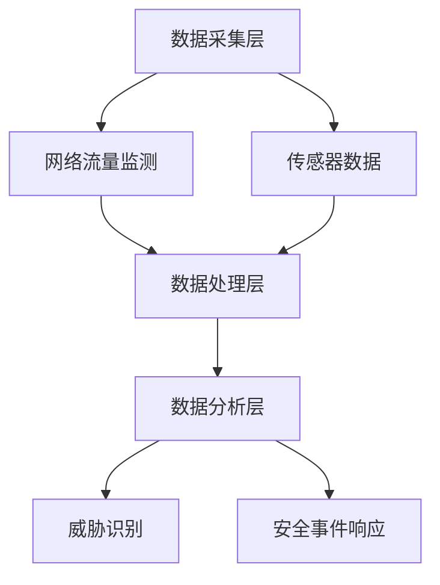
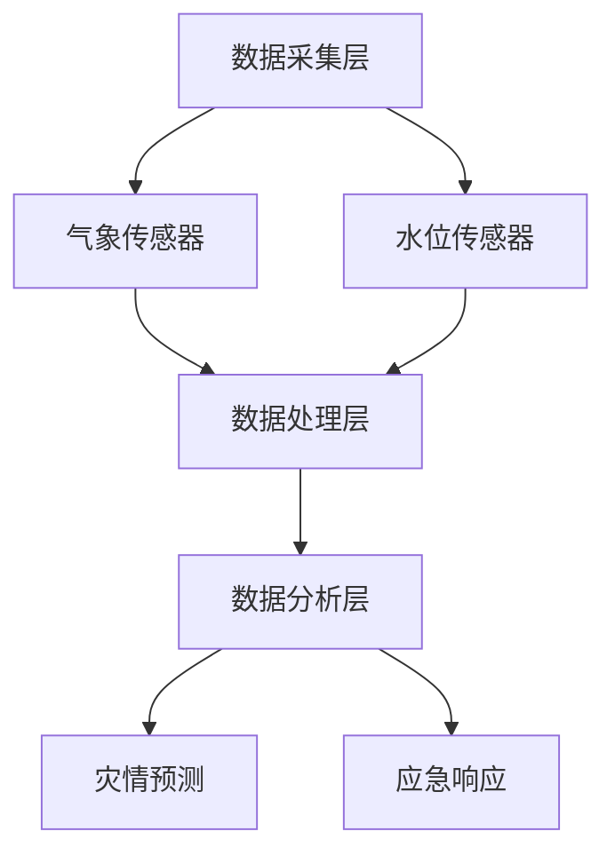
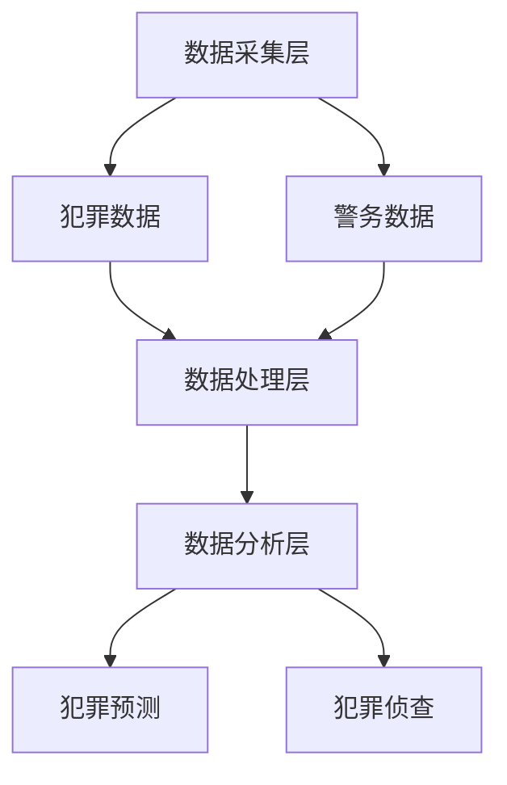

                 

# 大数据在公共安全中的应用：预防犯罪与应急响应

## 关键词
- 大数据
- 公共安全
- 犯罪预测
- 应急响应
- 人工智能

## 摘要
本文深入探讨了大数据技术在公共安全领域的应用，重点研究了其在预防犯罪和应急响应中的作用。通过分析大数据技术的原理及其与公共安全的联系，本文提出了具体的案例分析，展示了大数据技术如何通过数据采集、存储、处理和分析等环节，实现犯罪预测、网络安全监测和警务活动优化。同时，本文也探讨了大数据技术在应急管理中的应用，并指出了该领域面临的挑战和未来发展方向。

## 第1章 大数据与公共安全的概述

### 1.1 问题背景

随着互联网和物联网技术的飞速发展，社会信息化程度越来越高，海量数据不断产生。大数据技术的出现，使得人们能够更好地处理、分析和利用这些数据。在公共安全领域，大数据的应用成为提升社会治理能力、预防犯罪和应急响应的重要手段。

### 1.2 问题描述

公共安全面临的问题包括但不限于：犯罪活动日益复杂，安全事件频发，公共安全威胁多样化等。大数据技术为这些问题提供了新的解决方案，但同时也带来了一系列挑战，如数据隐私保护、算法公平性等。

### 1.3 问题解决

通过大数据技术，可以对海量数据进行分析，挖掘潜在的安全威胁和犯罪线索。结合人工智能、机器学习等技术，可以实现对犯罪活动的预测、防范和快速响应。

### 1.4 边界与外延

大数据在公共安全中的应用范围包括但不限于：网络安全、城市安全管理、警务活动、应急管理等方面。

### 1.5 概念结构与核心要素组成

- **大数据技术**：包括数据采集、存储、处理、分析和可视化等。
- **公共安全**：涉及社会稳定、人民生命财产安全等方面。
- **算法**：用于分析数据、识别模式和预测犯罪等。

### 1.6 小结
本章概述了大数据技术在公共安全领域的应用背景、问题与解决方法，并明确了其边界与外延。接下来，我们将详细探讨大数据技术的核心概念与原理，为深入理解其应用提供理论基础。

## 第2章 核心概念与联系

### 2.1 大数据技术原理

大数据技术的核心在于其处理海量数据的效率和灵活性。以下是大数据技术的基本原理：

#### 数据采集

数据采集是大数据技术的第一步，通过各种手段获取数据。这些手段包括但不限于：互联网爬虫、物联网设备、企业内部数据系统等。

#### 数据存储

随着数据量的增加，传统的集中式存储系统已无法满足需求。分布式存储技术如Hadoop的HDFS、NoSQL数据库如MongoDB，提供了一种可靠、高效的数据存储解决方案。

#### 数据处理

数据处理是大数据技术的核心环节，包括数据清洗、转换、聚合等操作。分布式计算模型如MapReduce和Spark，使得大规模数据处理成为可能。

#### 数据分析

数据分析是大数据技术的最终目的，通过统计学、机器学习等方法，从数据中提取有价值的信息和知识。

#### 数据可视化

数据可视化是将数据分析结果以图形化的方式展示，帮助用户更直观地理解和分析数据。

### 2.2 公共安全领域相关概念

#### 犯罪学

犯罪学是研究犯罪现象、犯罪原因、犯罪预防等的一门学科。它为公共安全提供了理论基础，帮助理解和预测犯罪行为。

#### 警务学

警务学是研究警务活动、警务策略等的学科。它涉及警务资源分配、犯罪侦查、社区警务等方面，直接影响到公共安全。

#### 应急管理

应急管理是应对突发事件、减轻灾害损失的一门学科。它包括灾情监测、资源调度、应急响应等环节，是保障公共安全的重要组成部分。

### 2.3 大数据技术在公共安全中的应用

#### 网络安全监测

通过大数据技术，可以对网络流量、日志等进行实时监测，识别潜在的网络攻击和威胁。

#### 犯罪预测

通过分析历史犯罪数据，大数据技术可以预测犯罪趋势和热点区域，为警务活动提供科学依据。

#### 警务活动优化

大数据技术可以优化警务资源配置和策略，提高警务活动的效率和效果。

### 2.4 概念联系

大数据技术与公共安全领域的概念密切相关。通过数据采集、存储、处理和分析，大数据技术为犯罪学、警务学和应急管理提供了强大的工具和支持。

### 2.5 小结
本章详细介绍了大数据技术的原理及其在公共安全领域中的应用。接下来，我们将进一步探讨大数据技术的具体实现，为深入理解其应用提供技术支持。

## 第3章 大数据技术原理讲解

### 3.1 数据采集

数据采集是大数据技术的第一步，也是关键一步。以下是一些常见的数据采集方法：

#### 网络爬虫

网络爬虫是一种自动获取互联网上公开数据的工具。通过模拟用户行为，网络爬虫可以爬取网页、论坛、社交媒体等平台上的数据。

#### 物联网设备

物联网设备如传感器、智能摄像头等，可以实时收集环境数据。这些数据包括空气质量、交通流量、人流密度等，对于公共安全监测具有重要意义。

#### 企业内部数据系统

企业内部数据系统如CRM、ERP等，可以提供客户行为、销售数据等信息。这些数据对于市场营销和客户关系管理具有重要意义。

### 3.2 数据存储

数据存储是大数据技术的关键环节，以下是一些常见的数据存储技术：

#### 分布式存储

分布式存储技术如Hadoop的HDFS，可以将数据分散存储在多个节点上，提高数据存储的可靠性和效率。

#### NoSQL数据库

NoSQL数据库如MongoDB，适合存储非结构化数据。它具有水平扩展性，可以轻松应对海量数据存储需求。

### 3.3 数据处理

数据处理是大数据技术的核心环节，以下是一些常见的处理方法：

#### MapReduce

MapReduce是一种分布式数据处理模型，适用于大规模数据处理。它将数据处理分为两个阶段：Map阶段和Reduce阶段。

#### Spark

Spark是一种快速的数据处理引擎，提供内存计算能力。相比MapReduce，Spark具有更高的效率和更丰富的功能。

### 3.4 数据分析

数据分析是大数据技术的最终目的，以下是一些常见的方法：

#### 机器学习

机器学习是一种通过训练模型来自动发现数据中模式和规律的方法。它可以用于犯罪预测、网络安全监测等场景。

#### 统计分析

统计分析是一种使用统计方法对数据进行定量分析的方法。它可以用于数据可视化、趋势预测等场景。

### 3.5 数据可视化

数据可视化是将数据分析结果以图形化的方式展示，以下是一些常见的数据可视化工具：

#### Tableau

Tableau是一种常见的数据可视化工具，可以创建各种图表和仪表板，帮助用户更直观地理解和分析数据。

#### Matplotlib

Matplotlib是一种Python库，可以创建各种2D和3D图表，适合数据分析和学术研究。

### 3.6 小结
本章详细介绍了大数据技术的原理，包括数据采集、存储、处理和分析等环节。这些原理为大数据技术在公共安全领域的应用提供了基础。接下来，我们将通过具体案例分析，展示大数据技术在公共安全中的应用效果。

## 第4章 公共安全领域的案例分析

### 4.1 网络安全监测

#### 4.1.1 案例介绍

网络安全监测是大数据技术在公共安全领域的一个重要应用。以下是一个典型的网络安全监测案例：某城市利用大数据技术，建立了网络安全监测系统，对城市网络进行实时监测，识别潜在的网络攻击和威胁。

#### 4.1.2 系统架构

网络安全监测系统的架构包括数据采集层、数据处理层和数据分析层。具体架构如下：



#### 4.1.3 算法原理

网络安全监测系统主要采用以下算法：

1. **异常检测算法**：通过分析网络流量数据，识别异常流量，如DDoS攻击。
2. **恶意代码检测算法**：通过分析网络流量和文件，识别恶意代码和病毒。
3. **关联分析算法**：通过分析不同数据源之间的关联，识别潜在的网络攻击。

#### 4.1.4 Python源代码示例

以下是一个简单的异常检测算法示例：

```python
import numpy as np

def anomaly_detection(data, threshold):
    mean = np.mean(data)
    std = np.std(data)
    anomalies = []
    for value in data:
        if abs(value - mean) > threshold * std:
            anomalies.append(value)
    return anomalies

# 示例数据
data = [10, 11, 12, 200, 13, 14, 15]
threshold = 2

# 运行异常检测算法
anomalies = anomaly_detection(data, threshold)
print("异常值:", anomalies)
```

#### 4.1.5 小结
本章通过一个网络安全监测案例，展示了大数据技术在公共安全领域的应用。接下来，我们将探讨大数据技术在犯罪预测方面的应用。

## 第5章 大数据技术在应急管理中的应用

### 5.1 应急管理概述

应急管理是一个复杂的过程，包括灾情监测、资源调度、应急响应等多个环节。大数据技术在应急管理中发挥着重要作用，可以提高应急管理的效率和效果。

#### 5.1.1 灾情监测

灾情监测是应急管理的第一步，通过实时监测灾情，可以及时了解灾害的发展态势。大数据技术可以通过传感器、卫星遥感等技术，收集灾情数据，并进行实时分析。

#### 5.1.2 资源调度

资源调度是应急管理的核心环节，需要根据灾情情况，合理调配救援资源。大数据技术可以通过数据分析，预测灾情发展，优化资源调度策略，确保救援资源的高效利用。

#### 5.1.3 应急响应

应急响应是应急管理的最终目的，通过快速、准确的应急响应，可以最大限度地减轻灾害损失。大数据技术可以通过实时数据分析和预测，为应急响应提供科学依据。

### 5.2 大数据技术在应急管理中的作用

大数据技术在应急管理中的作用主要体现在以下几个方面：

1. **提高预警能力**：通过实时数据分析和预测，可以提前预警可能发生的灾害，为应急响应提供时间窗口。
2. **优化资源调度**：通过数据分析，可以优化救援资源的调度策略，提高救援效率。
3. **提高应急响应速度**：通过实时数据分析和预测，可以快速响应灾害事件，减少灾害损失。
4. **提升决策支持能力**：大数据技术可以为应急管理提供丰富的数据支持和分析结果，帮助决策者做出科学决策。

### 5.3 大数据技术在应急管理中的应用案例

以下是一个大数据技术在应急管理中的应用案例：某城市在暴雨和洪灾期间，利用大数据技术进行灾情监测和应急响应。

#### 5.3.1 案例介绍

在某城市的暴雨和洪灾期间，该城市利用大数据技术建立了灾情监测和应急响应系统，通过实时监测降雨量和水位，预测洪灾发展态势，并根据预测结果，及时启动应急响应措施。

#### 5.3.2 系统架构

灾情监测和应急响应系统的架构包括数据采集层、数据处理层和数据分析层。具体架构如下：



#### 5.3.3 数据分析方法

1. **降雨量预测算法**：通过分析历史降雨数据，使用机器学习算法进行降雨量预测。
2. **水位预测算法**：通过分析历史水位数据，使用机器学习算法进行水位预测。
3. **洪灾预测算法**：结合降雨量预测和水位预测结果，使用模型进行洪灾预测。

#### 5.3.4 Python源代码示例

以下是一个简单的降雨量预测算法示例：

```python
import numpy as np
from sklearn.linear_model import LinearRegression

def rain_prediction(data):
    X = data[:-1].reshape(-1, 1)
    y = data[1:]
    model = LinearRegression()
    model.fit(X, y)
    return model.predict([[data[-1]]])

# 示例数据
data = [10, 12, 15, 18, 20, 22, 25]

# 运行降雨量预测算法
predicted_rain = rain_prediction(data)
print("预测降雨量:", predicted_rain)
```

#### 5.3.5 小结
本章通过一个应急管理案例，展示了大数据技术在灾情监测、资源调度和应急响应中的应用。大数据技术为应急管理提供了强大的支持，有助于提高应急管理的效率和效果。接下来，我们将探讨大数据技术在警务活动中的应用。

## 第6章 大数据技术在警务活动中的应用

### 6.1 警务活动概述

警务活动是公共安全的重要组成部分，包括犯罪侦查、社区警务、警务资源优化等多个方面。大数据技术的应用，为警务活动提供了新的手段和方法，提高了警务活动的效率和效果。

#### 6.1.1 犯罪侦查

犯罪侦查是警务活动的核心任务之一，通过大数据技术，可以实现对犯罪活动的快速侦破。大数据技术可以帮助警务人员分析犯罪线索、识别犯罪嫌疑人、预测犯罪趋势等。

#### 6.1.2 社区警务

社区警务是警务活动的基础，通过大数据技术，可以更好地了解社区居民的需求，提高社区治安水平。大数据技术可以帮助警务人员分析社区数据，发现潜在的安全隐患，制定有针对性的治安策略。

#### 6.1.3 警务资源优化

警务资源优化是提高警务活动效率的关键，通过大数据技术，可以实现对警务资源的合理调配和高效利用。大数据技术可以帮助警务人员分析警务活动数据，优化警务资源配置，提高警务活动的效率和效果。

### 6.2 大数据技术在警务活动中的作用

大数据技术在警务活动中的作用主要体现在以下几个方面：

1. **提高犯罪侦破效率**：通过大数据技术，可以快速分析犯罪线索，提高犯罪侦破效率。
2. **优化社区警务**：通过大数据技术，可以更好地了解社区居民需求，提高社区治安水平。
3. **优化警务资源配置**：通过大数据技术，可以实现对警务资源的合理调配和高效利用，提高警务活动的效率和效果。

### 6.3 大数据技术在警务活动中的应用案例

以下是一个大数据技术在警务活动中的应用案例：某城市利用大数据技术进行犯罪预测和犯罪侦查。

#### 6.3.1 案例介绍

在某城市的犯罪高发期，该城市利用大数据技术建立了犯罪预测和犯罪侦查系统，通过分析历史犯罪数据，预测犯罪趋势和热点区域，并快速侦破多起犯罪案件。

#### 6.3.2 系统架构

犯罪预测和犯罪侦查系统的架构包括数据采集层、数据处理层和数据分析层。具体架构如下：



#### 6.3.3 算法原理

1. **犯罪预测算法**：通过分析历史犯罪数据，使用机器学习算法预测犯罪趋势和热点区域。
2. **犯罪侦查算法**：通过分析犯罪数据，使用数据挖掘技术识别犯罪线索和犯罪嫌疑人。

#### 6.3.4 Python源代码示例

以下是一个简单的犯罪预测算法示例：

```python
import numpy as np
from sklearn.cluster import KMeans

def crime_prediction(data, K):
    model = KMeans(n_clusters=K)
    model.fit(data)
    clusters = model.predict(data)
    return clusters

# 示例数据
data = np.array([[1, 2], [1, 4], [1, 0], [10, 2], [10, 4], [10, 0]])

# 运行犯罪预测算法
K = 2
clusters = crime_prediction(data, K)
print("预测聚类结果:", clusters)
```

#### 6.3.5 小结
本章通过一个警务活动案例，展示了大数据技术在犯罪预测和犯罪侦查中的应用。大数据技术为警务活动提供了强大的支持，有助于提高犯罪侦破效率和优化社区警务。接下来，我们将探讨大数据技术在公共安全领域的挑战和未来发展方向。

## 第7章 大数据技术在公共安全领域的挑战

### 7.1 数据隐私保护

大数据技术在公共安全领域带来了巨大的价值，但同时也引发了一系列隐私保护问题。数据隐私保护是大数据技术在公共安全领域面临的主要挑战之一。以下是一些解决数据隐私保护问题的方法：

1. **数据加密**：通过对数据进行加密处理，确保数据在传输和存储过程中的安全性。
2. **匿名化处理**：通过对数据中的敏感信息进行匿名化处理，降低数据隐私泄露的风险。
3. **隐私保护算法**：开发和应用隐私保护算法，如差分隐私、同态加密等，保护数据的隐私性。

### 7.2 算法公平性

随着大数据技术的应用，算法公平性成为一个备受关注的问题。算法公平性指的是算法在处理数据时，能够公平地对待不同群体，避免歧视和偏见。以下是一些解决算法公平性问题的方法：

1. **数据平衡**：通过数据平衡技术，确保训练数据中不同群体的比例合理，避免数据偏差。
2. **偏差校正**：通过偏差校正技术，消除算法中的固有偏见，提高算法的公平性。
3. **透明度和可解释性**：提高算法的透明度和可解释性，使算法决策过程更加透明，便于监督和纠正。

### 7.3 技术人才短缺

大数据技术在公共安全领域的应用，需要大量具备专业知识和技能的技术人才。然而，目前全球范围内大数据技术人才短缺问题日益严重。以下是一些解决技术人才短缺问题的方法：

1. **教育培训**：加强大数据技术相关课程的教育培训，提高人才培养质量。
2. **校企合作**：加强高校与企业合作，培养符合企业需求的技术人才。
3. **人才引进**：通过人才引进政策，吸引国内外优秀大数据技术人才。

### 7.4 法律法规

大数据技术在公共安全领域的应用，需要完善的法律法规体系作为保障。目前，全球范围内大数据法律法规体系尚不完善，存在一定的法律盲区。以下是一些完善大数据法律法规体系的建议：

1. **数据保护法**：制定和完善数据保护法律法规，保护个人数据和公共数据的安全。
2. **算法伦理法**：制定算法伦理法规，规范算法开发和应用行为，确保算法公平、透明、可靠。
3. **数据共享法**：制定数据共享法律法规，促进公共数据资源的高效利用。

### 7.5 小结
大数据技术在公共安全领域带来了巨大的机遇，但同时也面临一系列挑战。通过解决数据隐私保护、算法公平性、技术人才短缺和法律法规等问题，可以更好地发挥大数据技术在公共安全领域的作用，为构建和谐安全的社会贡献力量。

## 总结

大数据技术在公共安全领域具有巨大的潜力，通过数据采集、存储、处理和分析等环节，可以实现对犯罪活动的预测、防范和应急响应。本文从多个角度探讨了大数据技术在公共安全领域的应用，包括网络安全监测、犯罪预测、警务活动优化和应急管理等方面，并指出了该领域面临的挑战和未来发展方向。

展望未来，随着大数据技术、人工智能和物联网等技术的发展，大数据在公共安全领域的应用将更加深入和广泛。我们期待相关领域的专家和从业者，能够共同推动大数据技术在公共安全领域的创新和应用，为构建和谐安全的社会贡献力量。

## 注意事项与拓展阅读

### 注意事项

1. **数据隐私保护**：在应用大数据技术时，要严格遵循数据隐私保护法律法规，确保个人数据和公共数据的安全。
2. **算法公平性**：在开发和应用大数据算法时，要关注算法的公平性和透明性，避免歧视和偏见。
3. **技术人才**：要加强大数据技术相关课程的教育培训，培养更多专业人才。
4. **法律法规**：要完善大数据法律法规体系，为大数据技术的应用提供法律保障。

### 拓展阅读

1. **《大数据时代：生活、工作与思维的大变革》**：作者：维克托·迈尔-舍恩伯格，探讨大数据对社会各个方面的影响。
2. **《人工智能：一种现代的方法》**：作者：斯坦福大学人工智能实验室，介绍人工智能的基本原理和应用。
3. **《公共安全大数据应用手册》**：作者：国家应急广播中心，详细阐述大数据技术在公共安全领域的应用案例。

## 作者

作者：AI天才研究院/AI Genius Institute & 禅与计算机程序设计艺术 /Zen And The Art of Computer Programming

