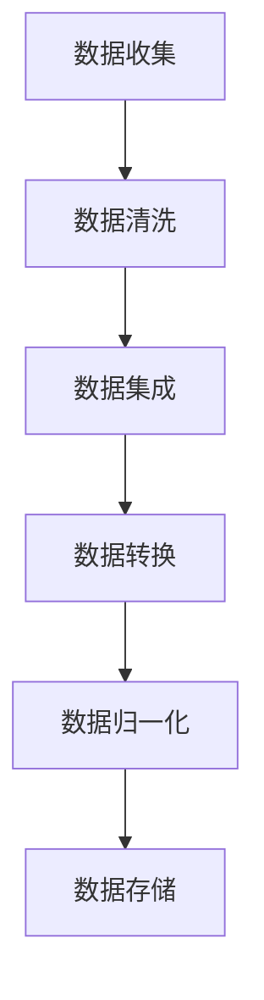
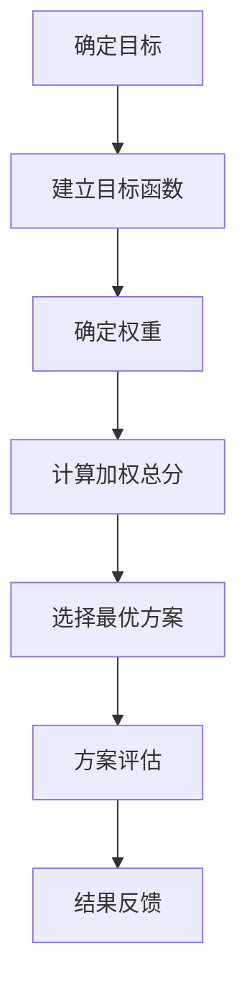
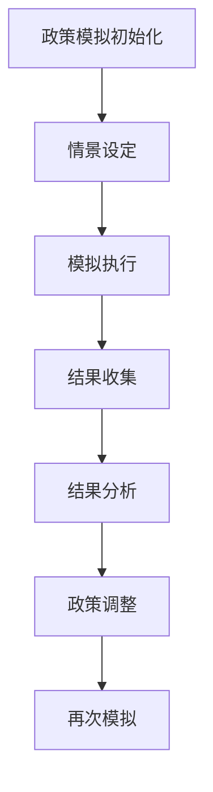

                 


### 第一部分：背景介绍

#### 1.1 问题的背景与意义

**1.1.1 大数据时代的来临**

随着互联网、物联网、移动设备的普及，数据量呈现爆炸式增长。据统计，全球每天产生的数据量已经达到数以艾字节（Exabyte）计。这种数据量的巨大增长，被普遍认为是进入“大数据时代”的标志。大数据不仅包括传统的结构化数据，还包括大量的半结构化和非结构化数据，如文本、图片、音频和视频等。

大数据技术的兴起，为我们提供了前所未有的数据获取、存储、管理和分析的能力。这使得我们能够从海量数据中提取有价值的信息，为各个领域的决策提供科学依据。在公共政策制定领域，大数据的应用具有特别的意义，因为公共政策的制定和实施，往往涉及到大量的社会经济数据。

**1.1.2 公共政策制定的挑战**

公共政策制定是一个复杂的过程，涉及到多种利益相关者的需求、目标和价值观。随着社会问题的复杂性和多样性增加，传统公共政策制定的挑战也越来越大：

- **数据匮乏**：在传统政策制定过程中，数据往往缺乏或者不全面，导致决策者难以获得全面的信息。
- **信息不对称**：不同利益相关者获取和处理信息的能力不同，导致信息不对称，影响决策的公正性。
- **决策延迟**：政策制定过程繁琐，决策者需要收集、整理和分析大量的数据，导致决策过程延迟。
- **成本高**：传统政策制定需要大量的资源，包括人力、时间和财力。

**1.1.3 科学决策的需求与挑战**

为了应对上述挑战，科学决策成为公共政策制定的关键。科学决策要求决策者基于数据和事实做出决策，减少主观判断和偏见的影响。然而，科学决策面临着以下挑战：

- **数据质量**：大数据虽然量大，但质量参差不齐，如何筛选和处理高质量的数据成为关键。
- **数据隐私**：在利用大数据进行决策时，如何保护个人隐私和数据安全成为重要问题。
- **数据分析能力**：对大数据的分析需要专业的技术和工具，如何有效利用这些资源是一个挑战。
- **技术更新**：大数据技术和分析方法不断发展，如何跟上技术进步的步伐，也是决策者需要面对的问题。

### 1.2 问题的描述与界定

**1.2.1 大数据在公共政策制定中的潜在应用**

大数据在公共政策制定中的应用非常广泛，主要包括以下几个方面：

- **需求分析**：通过分析大数据，了解社会公众的需求和期望，为政策制定提供依据。
- **效果评估**：利用大数据评估政策实施的效果，及时调整政策，提高政策的有效性。
- **预测**：基于大数据的预测模型，预测政策实施后的可能结果，为决策者提供前瞻性建议。
- **决策支持**：通过大数据分析，为决策者提供全面的决策支持，减少决策风险。

**1.2.2 决策科学性的关键因素**

决策科学性的关键因素包括以下几个方面：

- **数据质量**：高质量的数据是科学决策的基础，数据的质量直接影响到决策的准确性。
- **分析方法**：科学的数据分析方法是保证决策科学性的关键，包括统计方法、机器学习算法等。
- **模型构建**：构建合适的数学模型，可以更好地模拟和预测政策实施的结果。
- **利益相关者参与**：在政策制定过程中，充分听取和考虑不同利益相关者的意见和建议，提高政策的公平性和可行性。

**1.2.3 研究边界与外延**

本研究主要关注以下几个方面：

- **大数据在公共政策制定中的应用场景**：研究大数据在哪些具体的公共政策领域具有应用潜力。
- **决策科学性的评估指标**：建立评估决策科学性的指标体系，用于衡量政策制定过程中的科学性水平。
- **技术挑战与解决方案**：分析大数据技术在公共政策制定过程中可能面临的技术挑战，并提出相应的解决方案。

### 1.3 解决方案概览

**1.3.1 大数据技术的应用领域**

大数据技术在公共政策制定中的应用领域非常广泛，包括但不限于以下几个方面：

- **公共安全**：通过大数据分析，预测和防范公共安全事件，如恐怖袭击、自然灾害等。
- **教育**：利用大数据分析学生的学习行为和成绩，为教育政策的制定和实施提供支持。
- **医疗**：通过大数据分析，提高医疗服务的质量和效率，如疾病预测、健康风险评估等。
- **交通**：利用大数据优化交通管理，提高交通流动性和安全性。
- **环境**：通过大数据分析，监测和管理环境问题，如空气质量、水质监测等。

**1.3.2 公共政策制定流程优化**

为了提高决策科学性，可以优化公共政策制定的流程，包括以下几个方面：

- **数据收集与整合**：建立完善的数据收集机制，确保数据的及时性、准确性和完整性。
- **数据预处理**：对收集到的数据进行清洗、转换和整合，为后续分析提供高质量的数据。
- **数据分析和模型构建**：利用大数据分析方法和数学模型，对数据进行分析，预测政策实施的结果。
- **决策支持与反馈**：将分析结果和政策建议提供给决策者，并根据政策实施的效果进行反馈和调整。

**1.3.3 科学决策支持系统的构建**

为了实现科学决策，可以构建一个综合性的决策支持系统，包括以下几个方面：

- **数据平台**：建立大数据平台，用于数据的存储、管理和共享。
- **分析工具**：提供丰富的数据分析工具，包括统计分析、机器学习、数据挖掘等。
- **可视化工具**：利用可视化工具，将分析结果以图表、报告等形式直观地展示给决策者。
- **决策支持算法**：构建多种决策支持算法，为决策者提供多角度、全方位的决策支持。

### 1.4 本章小结

本部分主要介绍了大数据在公共政策制定中的应用背景、挑战和意义。我们详细描述了大数据时代的特点，以及公共政策制定面临的挑战和需求。通过分析大数据在公共政策制定中的潜在应用，我们提出了优化公共政策制定流程和构建科学决策支持系统的方案。这些将为后续章节的深入探讨提供基础。```markdown
----------------------------------------------------------------
# 第二部分: 核心概念与联系

## 2.1 大数据基本概念
### 2.1.1 大数据的定义与特征
### 2.1.2 大数据的应用领域
### 2.1.3 大数据技术与挑战

## 2.2 公共政策制定的基本原理
### 2.2.1 公共政策的定义与类型
### 2.2.2 公共政策制定的过程
### 2.2.3 公共政策评估的方法

## 2.3 决策科学性理论
### 2.3.1 决策科学的基本概念
### 2.3.2 决策科学的研究方法
### 2.3.3 决策支持系统的构建

## 2.4 大数据、公共政策与决策科学性之间的关系
### 2.4.1 大数据对公共政策制定的影响
### 2.4.2 公共政策制定对大数据的需求
### 2.4.3 科学决策在大数据环境下的实现

## 2.5 本章小结

----------------------------------------------------------------
### 2.1 大数据基本概念

#### 2.1.1 大数据的定义与特征

大数据（Big Data）指的是那些数据量巨大、数据类型繁多、数据生成速度极快的数据集合。与传统的小数据（Little Data）相比，大数据具有以下四个主要特征，通常被称为“4V”：

- **Volume（体积）**：大数据的规模巨大，通常是TB、PB甚至EB级别的数据量。
- **Velocity（速度）**：数据生成的速度极快，需要实时或近实时的数据处理和分析。
- **Variety（多样性）**：大数据的类型繁多，包括结构化数据、半结构化数据和非结构化数据。
- **Veracity（真实性）**：大数据的真实性难以保证，数据质量参差不齐。

此外，随着研究的发展，一些学者提出了更多的V，如“Value（价值）”和“Visuality（可视化）”，进一步扩展了大数据的定义。

#### 2.1.2 大数据的应用领域

大数据的应用领域非常广泛，包括但不限于以下领域：

- **金融**：通过大数据分析，金融机构可以更好地了解客户需求，优化风险管理策略，提高业务效率。
- **医疗**：大数据在医疗领域有广泛的应用，如疾病预测、个性化治疗、药物研发等。
- **交通**：大数据可以帮助优化交通管理，提高交通流量，减少拥堵，提高出行效率。
- **教育**：大数据在教育领域可以用于个性化学习、学习行为分析、教育质量评估等。
- **公共安全**：通过大数据分析，可以更有效地预测和防范公共安全事件，如恐怖袭击、自然灾害等。
- **市场营销**：大数据可以帮助企业更准确地了解市场需求，优化营销策略，提高销售额。

#### 2.1.3 大数据技术与挑战

大数据技术主要包括以下几个方面：

- **数据存储**：分布式存储系统，如Hadoop的HDFS、NoSQL数据库等，用于存储海量数据。
- **数据处理**：分布式处理框架，如MapReduce、Spark等，用于处理大规模数据集。
- **数据挖掘**：使用机器学习和统计方法，从海量数据中提取有价值的信息。
- **数据可视化**：将复杂的数据以图形化的方式展示，帮助用户更好地理解和分析数据。

大数据技术面临的挑战主要包括：

- **数据质量**：大数据的质量参差不齐，如何处理噪声数据和错误数据是一个挑战。
- **隐私和安全**：大数据的应用涉及到个人隐私和安全问题，如何保护用户隐私成为关键。
- **技术和人才**：大数据技术不断进步，如何持续学习和应用新技术，以及如何培养专业人才是一个挑战。
- **成本**：大数据技术需要大量的硬件和软件资源，如何降低成本也是一个重要问题。

### 2.2 公共政策制定的基本原理

#### 2.2.1 公共政策的定义与类型

公共政策是指政府或其他公共机构为解决社会问题、实现公共目标而制定的规则、计划和行动。公共政策可以分为以下几种类型：

- **经济政策**：如税收政策、货币政策、产业政策等，旨在促进经济增长和稳定。
- **社会政策**：如教育政策、医疗政策、社会保障政策等，旨在提高社会福利和促进社会公平。
- **环境政策**：如环境保护政策、资源管理政策等，旨在保护环境和可持续发展。
- **公共服务政策**：如公共安全政策、公共卫生政策等，旨在提供基本公共服务和保障公共安全。

#### 2.2.2 公共政策制定的过程

公共政策制定的过程通常包括以下几个阶段：

- **需求识别**：识别社会问题和公共需求，确定政策目标。
- **方案设计**：设计可能的政策方案，评估方案的可行性和效果。
- **政策选择**：根据评估结果，选择最优的政策方案。
- **政策实施**：将政策方案付诸实施，包括制定实施细则、分配资源、监督执行等。
- **政策评估**：评估政策实施的效果，包括政策目标的达成情况、政策成本和收益等。

#### 2.2.3 公共政策评估的方法

公共政策评估的方法主要包括以下几个方面：

- **定性评估**：通过专家访谈、案例研究等方法，对政策效果进行定性分析。
- **定量评估**：通过统计数据、经济模型等方法，对政策效果进行定量分析。
- **成本效益分析**：评估政策实施的成本和效益，计算政策的经济价值。
- **社会影响评估**：评估政策对社会各方面的综合影响，包括经济效益、社会效益和环境效益等。

### 2.3 决策科学性理论

#### 2.3.1 决策科学的基本概念

决策科学（Decision Science）是研究决策过程、决策模型和决策方法的科学。决策科学的核心概念包括：

- **决策者**：制定决策的人或组织。
- **决策问题**：需要决策的问题或情境。
- **决策方案**：可供决策者选择的行动方案。
- **决策结果**：执行决策方案后的结果。
- **决策标准**：用于评估决策方案优劣的标准。

#### 2.3.2 决策科学的研究方法

决策科学的研究方法包括以下几个方面：

- **统计方法**：通过统计数据和分析，评估决策方案的概率分布和期望值。
- **数学模型**：建立数学模型，模拟决策过程，预测决策结果。
- **模拟方法**：通过模拟实验，评估不同决策方案的效果。
- **人工智能方法**：利用人工智能技术，如机器学习、深度学习等，进行决策支持。

#### 2.3.3 决策支持系统的构建

决策支持系统（Decision Support System，DSS）是一种辅助决策者进行决策的计算机系统。构建决策支持系统通常包括以下几个步骤：

- **需求分析**：了解决策者的需求和决策问题。
- **系统设计**：设计系统的功能模块和数据结构。
- **模型构建**：建立决策模型，模拟决策过程。
- **系统集成**：将各个模块集成到系统中，实现决策支持功能。
- **系统测试与优化**：测试系统的性能，根据测试结果进行优化。

### 2.4 大数据、公共政策与决策科学性之间的关系

#### 2.4.1 大数据对公共政策制定的影响

大数据对公共政策制定的影响主要体现在以下几个方面：

- **提高数据质量**：大数据提供了更全面、准确的数据，为政策制定提供了可靠的依据。
- **优化政策评估**：大数据可以帮助政策制定者更全面、准确地评估政策效果，及时调整政策。
- **提高决策效率**：大数据技术可以提高决策的效率和准确性，减少决策过程的时间和成本。
- **促进科学决策**：大数据提供了丰富的信息和工具，使政策制定者能够基于数据和事实做出决策。

#### 2.4.2 公共政策制定对大数据的需求

公共政策制定对大数据的需求主要包括：

- **数据收集与整合**：公共政策制定需要大量的数据，包括社会经济数据、环境数据等，如何有效收集和整合这些数据是关键。
- **数据分析和处理**：公共政策制定需要对数据进行分析和处理，以提取有价值的信息，为政策制定提供支持。
- **数据隐私和安全**：在利用大数据进行政策制定时，如何保护个人隐私和数据安全是重要问题。

#### 2.4.3 科学决策在大数据环境下的实现

在大数据环境下实现科学决策，需要以下几个方面的支持：

- **数据驱动的决策过程**：将数据作为决策的基础，通过数据分析，提取有价值的信息，支持决策制定。
- **智能化的决策支持工具**：利用人工智能技术，如机器学习、深度学习等，构建智能化的决策支持工具，辅助决策者进行决策。
- **透明和可解释的决策模型**：确保决策模型的透明性和可解释性，使决策者能够理解和信任决策结果。
- **持续学习和优化**：通过持续的数据分析和模型优化，不断提高决策的科学性和准确性。

### 2.5 本章小结

在本章中，我们详细介绍了大数据、公共政策制定和决策科学性的基本概念，以及它们之间的相互关系。我们分析了大数据的定义、特征和应用领域，探讨了公共政策制定的基本原理和过程，介绍了决策科学的基本概念和研究方法。通过分析大数据在公共政策制定中的应用和影响，我们提出了科学决策在大数据环境下的实现路径。这些内容为后续章节的深入探讨奠定了基础。```markdown
----------------------------------------------------------------
# 第三部分: 算法原理讲解

## 3.1 大数据处理的算法基础
### 3.1.1 数据预处理算法
### 3.1.2 数据挖掘算法
### 3.1.3 数据可视化算法

## 3.2 决策支持系统算法
### 3.2.1 多目标决策算法
### 3.2.2 贝叶斯网络算法
### 3.2.3 模糊逻辑算法

## 3.3 大数据在公共政策制定中的应用算法
### 3.3.1 公共政策模拟算法
### 3.3.2 社会网络分析算法
### 3.3.3 聚类分析算法

## 3.4 算法流程图与实现
### 3.4.1 数据预处理流程图
### 3.4.2 多目标决策流程图
### 3.4.3 公共政策模拟流程图

## 3.5 本章小结

----------------------------------------------------------------
### 3.1 大数据处理的算法基础

#### 3.1.1 数据预处理算法

数据预处理是大数据分析的重要步骤，它包括数据清洗、数据集成、数据转换和数据归一化等操作。以下是几个常见的数据预处理算法：

- **数据清洗**：去除重复数据、缺失值填充、纠正数据错误等，常用的算法有K近邻算法、插值法等。
- **数据集成**：将来自不同数据源的数据整合成统一的格式，常用的算法有模式识别、实体识别等。
- **数据转换**：将数据转换为适合分析的格式，如数值化、标准化等，常用的算法有主成分分析（PCA）等。
- **数据归一化**：将数据按比例缩放到同一范围内，常用的算法有最小-最大缩放和z-score缩放等。

#### 3.1.2 数据挖掘算法

数据挖掘是从大量数据中发现有价值信息的过程，常用的数据挖掘算法包括：

- **分类算法**：如决策树、随机森林、支持向量机（SVM）等，用于将数据分为不同的类别。
- **聚类算法**：如K-means、DBSCAN等，用于将相似的数据点归为一类。
- **关联规则算法**：如Apriori算法、FP-Growth等，用于发现数据之间的关联关系。
- **预测算法**：如时间序列分析、回归分析等，用于预测未来的趋势或结果。

#### 3.1.3 数据可视化算法

数据可视化是将数据转换为图形或图表，使其更易于理解和分析，常用的数据可视化算法包括：

- **图表生成**：如折线图、柱状图、饼图等，用于展示数据的分布和趋势。
- **三维可视化**：通过三维图形展示复杂数据的结构和关系。
- **热力图**：用颜色深浅表示数据值的大小，常用于展示数据的热点分布。
- **交互式可视化**：通过用户与图表的交互，动态展示数据的不同方面。

### 3.2 决策支持系统算法

#### 3.2.1 多目标决策算法

多目标决策是在存在多个相互冲突的目标时进行的决策，常用的多目标决策算法包括：

- **加权法**：为每个目标分配权重，求加权总分，选择总分最高的方案。
- **Pareto最优**：找到所有非支配解，选择用户满意度最高的方案。
- **遗传算法**：通过模拟自然进化过程，找到最优解或近似最优解。

#### 3.2.2 贝叶斯网络算法

贝叶斯网络是一种表示变量之间概率关系的图形模型，常用于不确定环境下的决策支持。贝叶斯网络算法包括：

- **网络构建**：根据领域知识建立贝叶斯网络结构。
- **参数学习**：通过数据学习网络中各变量的概率分布。
- **推理**：通过贝叶斯推理，计算变量的后验概率分布。

#### 3.2.3 模糊逻辑算法

模糊逻辑是一种处理不确定性和模糊性的数学工具，常用于多准则决策和模糊控制。模糊逻辑算法包括：

- **模糊化**：将输入变量的值模糊化，表示其属于不同模糊集合的程度。
- **模糊规则库**：定义模糊规则，描述变量之间的关系。
- **模糊推理**：根据模糊规则和输入变量，计算输出变量的模糊值。
- **去模糊化**：将模糊输出值转化为具体的结果。

### 3.3 大数据在公共政策制定中的应用算法

#### 3.3.1 公共政策模拟算法

公共政策模拟算法用于模拟政策实施的可能结果，评估政策效果。常用的算法包括：

- **蒙特卡洛模拟**：通过随机抽样和迭代计算，模拟政策实施的不同情景。
- **系统动力学**：通过建立系统的动态模型，模拟政策实施的过程和结果。
- **代理模型**：通过模拟代理的行为和互动，评估政策对不同群体的影响。

#### 3.3.2 社会网络分析算法

社会网络分析算法用于分析政策实施过程中的人际关系和社会结构，常用的算法包括：

- **网络可视化**：通过图形化展示社会网络，分析节点和边的关系。
- **中心性分析**：计算节点的重要性和影响力，识别关键人物或组织。
- **社区检测**：识别社会网络中的紧密群体，分析不同社区的行为模式。

#### 3.3.3 聚类分析算法

聚类分析算法用于将政策影响范围内的个体或区域划分为不同的群体，以便于分析。常用的算法包括：

- **K-means聚类**：将数据点划分为K个簇，使每个簇内部的数据点距离最小，簇间距离最大。
- **层次聚类**：自底向上或自顶向下合并或分裂数据点，形成聚类树。
- **基于密度的聚类**：基于数据点的密度分布，识别密集区域作为聚类中心。

### 3.4 算法流程图与实现

#### 3.4.1 数据预处理流程图

以下是一个数据预处理流程图的示例（使用Mermaid语法）：



#### 3.4.2 多目标决策流程图

以下是一个多目标决策流程图的示例（使用Mermaid语法）：



#### 3.4.3 公共政策模拟流程图

以下是一个公共政策模拟流程图的示例（使用Mermaid语法）：



### 3.5 本章小结

在本章中，我们介绍了大数据处理的基本算法，包括数据预处理、数据挖掘和数据可视化。我们还探讨了决策支持系统中的多目标决策、贝叶斯网络和模糊逻辑算法，以及大数据在公共政策制定中的应用算法，如公共政策模拟、社会网络分析和聚类分析。通过这些算法的介绍，我们为理解大数据在公共政策制定中的实际应用提供了理论基础和实践指导。```markdown
----------------------------------------------------------------
# 第四部分: 数学模型与公式讲解

## 4.1 大数据相关数学模型
### 4.1.1 数据分布模型
### 4.1.2 数据聚类模型
### 4.1.3 数据关联规则模型

## 4.2 公共政策制定中的数学模型
### 4.2.1 成本效益分析模型
### 4.2.2 社会福利分析模型
### 4.2.3 模拟与预测模型

## 4.3 决策科学中的数学模型
### 4.3.1 多目标优化模型
### 4.3.2 不确定性决策模型
### 4.3.3 风险评估模型

## 4.4 数学公式与讲解
### 4.4.1 数据分布公式
### 4.4.2 数据聚类公式
### 4.4.3 数据关联规则公式

## 4.5 LaTeX格式数学公式的使用
### 4.5.1 基本公式
### 4.5.2 复杂公式

## 4.6 数学公式举例说明
### 4.6.1 数据分布举例
### 4.6.2 数据聚类举例
### 4.6.3 数据关联规则举例

## 4.7 本章小结

----------------------------------------------------------------
### 4.1 大数据相关数学模型

#### 4.1.1 数据分布模型

在处理大数据时，数据分布模型是非常重要的，因为它可以帮助我们理解数据的特征和规律。以下是几种常见的数据分布模型：

- **正态分布（Normal Distribution）**：正态分布是最常见的数据分布模型，它的概率密度函数为：
  $$ f(x|\mu, \sigma^2) = \frac{1}{\sqrt{2\pi\sigma^2}} e^{-\frac{(x-\mu)^2}{2\sigma^2}} $$
  其中，$\mu$ 是均值，$\sigma^2$ 是方差。

- **二项分布（Binomial Distribution）**：二项分布适用于离散的二值数据，其概率质量函数为：
  $$ P(X = k) = C_n^k p^k (1-p)^{n-k} $$
  其中，$n$ 是试验次数，$k$ 是成功次数，$p$ 是每次试验成功的概率。

- **泊松分布（Poisson Distribution）**：泊松分布适用于事件发生的频率数据，其概率质量函数为：
  $$ P(X = k) = \frac{\lambda^k e^{-\lambda}}{k!} $$
  其中，$\lambda$ 是平均事件发生率。

#### 4.1.2 数据聚类模型

数据聚类是将数据分为多个群组的过程，目的是发现数据之间的相似性。以下是几种常见的数据聚类模型：

- **K-means算法**：K-means算法是一种基于距离的聚类方法，其目标是最小化簇内平方误差。其算法步骤如下：
  1. 随机初始化K个簇的中心点。
  2. 对于每个数据点，计算其到各个簇中心的距离，并将其分配到距离最近的簇。
  3. 更新各个簇的中心点。
  4. 重复步骤2和3，直到簇中心不再发生显著变化。

- **层次聚类算法**：层次聚类算法是一种自上而下或自下而上的聚类方法，其目标是构建一个聚类层次结构。其算法步骤如下：
  1. 将每个数据点视为一个簇。
  2. 计算所有簇之间的距离，并将距离最近的两个簇合并为一个簇。
  3. 重复步骤2，直到所有数据点合并为一个簇或达到预定的聚类层次。

#### 4.1.3 数据关联规则模型

数据关联规则模型用于发现数据之间的关联关系，其基本思想是找到一组数据项之间的支持度和置信度。以下是几个关键公式：

- **支持度（Support）**：支持度表示某个关联规则在数据集中出现的频率。其计算公式为：
  $$ Support(A \rightarrow B) = \frac{|D(A \cap B)|}{|D|} $$
  其中，$D$ 是数据集，$A$ 和 $B$ 是数据项集合。

- **置信度（Confidence）**：置信度表示在同时出现 $A$ 和 $B$ 的情况下，$B$ 出现的概率。其计算公式为：
  $$ Confidence(A \rightarrow B) = \frac{|D(A \cap B)|}{|D(A)|} $$

### 4.2 公共政策制定中的数学模型

#### 4.2.1 成本效益分析模型

成本效益分析模型用于评估政策实施的成本和效益，其基本公式为：

- **净效益（Net Benefit）**：
  $$ NB = \sum_{i=1}^n (B_i - C_i) $$
  其中，$B_i$ 是第 $i$ 个效益，$C_i$ 是第 $i$ 个成本。

- **内部收益率（Internal Rate of Return, IRR）**：
  $$ NPV = 0 = \sum_{i=1}^n \frac{B_i}{(1+IRR)^i} - \sum_{i=1}^n \frac{C_i}{(1+IRR)^i} $$
  通过求解上述方程，可以得到内部收益率 $IRR$。

#### 4.2.2 社会福利分析模型

社会福利分析模型用于评估政策对社会福利的影响，其基本公式为：

- **社会福利函数（Social Welfare Function）**：
  $$ SW = U(Q) - C(Q) $$
  其中，$U(Q)$ 是社会福利，$C(Q)$ 是政策成本。

- **帕累托最优（Pareto Optimality）**：
  如果不存在另一个方案使得至少一个个体更好而不会使其他个体更差，则该方案是帕累托最优的。

#### 4.2.3 模拟与预测模型

模拟与预测模型用于模拟政策实施的可能结果，预测政策效果。以下是几种常见的模型：

- **蒙特卡洛模拟**：
  1. 随机生成多个政策实施情景。
  2. 对于每个情景，模拟政策效果。
  3. 统计所有情景的结果，得到政策效果的预测。

- **时间序列模型**：
  1. 收集历史数据，分析时间序列的特征。
  2. 建立时间序列模型，如ARIMA模型、LSTM模型等。
  3. 利用模型预测未来的政策效果。

### 4.3 决策科学中的数学模型

#### 4.3.1 多目标优化模型

多目标优化模型用于解决具有多个目标的优化问题，其基本公式为：

- **目标函数**：
  $$ \min\limits_{x} f(x) $$
  $$ \text{subject to} \ g_i(x) \leq 0, \ i=1,2,...,m $$

- **帕累托前沿**：
  帕累托前沿是所有非支配解的集合，表示最优解的边界。

#### 4.3.2 不确定性决策模型

不确定性决策模型用于处理不确定性的决策问题，其基本公式为：

- **期望值**：
  $$ E[X] = \sum_{i=1}^n x_i P(X = x_i) $$
  其中，$X$ 是随机变量，$x_i$ 是可能的取值，$P(X = x_i)$ 是概率。

- **方差**：
  $$ Var[X] = E[(X - E[X])^2] $$

#### 4.3.3 风险评估模型

风险评估模型用于评估政策实施的风险，其基本公式为：

- **风险概率**：
  $$ P(R > R_0) = F(R_0) $$
  其中，$R$ 是风险变量，$R_0$ 是风险阈值，$F(R_0)$ 是风险分布函数。

- **风险价值（Value at Risk, VaR）**：
  $$ VaR = -\alpha F(R) $$
  其中，$\alpha$ 是置信水平，$F(R)$ 是风险分布函数。

### 4.4 数学公式与讲解

#### 4.4.1 数据分布公式

- **正态分布**：
  $$ f(x|\mu, \sigma^2) = \frac{1}{\sqrt{2\pi\sigma^2}} e^{-\frac{(x-\mu)^2}{2\sigma^2}} $$
  
- **二项分布**：
  $$ P(X = k) = C_n^k p^k (1-p)^{n-k} $$
  
- **泊松分布**：
  $$ P(X = k) = \frac{\lambda^k e^{-\lambda}}{k!} $$

#### 4.4.2 数据聚类公式

- **K-means算法**：
  1. 初始化簇中心点：
     $$ \mu_j = \frac{1}{N_j} \sum_{i=1}^{N} x_i $$
  2. 分配数据点：
     $$ j = \arg\min_{j} \sum_{i=1}^{N} (x_i - \mu_j)^2 $$
  3. 更新簇中心点：
     $$ \mu_j = \frac{1}{N_j} \sum_{i=1}^{N} x_i $$

#### 4.4.3 数据关联规则公式

- **支持度**：
  $$ Support(A \rightarrow B) = \frac{|D(A \cap B)|}{|D|} $$
  
- **置信度**：
  $$ Confidence(A \rightarrow B) = \frac{|D(A \cap B)|}{|D(A)|} $$

### 4.5 LaTeX格式数学公式的使用

LaTeX是排版数学公式和科学文档的一种广泛使用的标记语言。以下是一些基本和复杂的数学公式的示例：

#### 4.5.1 基本公式

- **基本公式**：
  $$ a^2 + b^2 = c^2 $$
  $$ \int_{0}^{1} x^2 dx = \frac{1}{3} $$

#### 4.5.2 复杂公式

- **分数**：
  $$ \frac{a}{b} + \frac{c}{d} = \frac{ad + bc}{bd} $$

- **矩阵**：
  $$ A = \begin{bmatrix}
  a & b \\
  c & d
  \end{bmatrix} $$
  $$ A^{-1} = \frac{1}{ad - bc} \begin{bmatrix}
  d & -b \\
  -c & a
  \end{bmatrix} $$

- **积分**：
  $$ \int_{0}^{1} e^x dx = e - 1 $$

- **微分**：
  $$ \frac{d}{dx} (x^2) = 2x $$

### 4.6 数学公式举例说明

#### 4.6.1 数据分布举例

- **正态分布**：
  假设某城市的人口分布服从正态分布，均值为30000，标准差为5000。计算这个城市人口在25000到35000之间的人数。

  $$ P(25000 < X < 35000) = P\left(\frac{25000 - 30000}{5000} < \frac{X - \mu}{\sigma} < \frac{35000 - 30000}{5000}\right) $$
  $$ = P(-1 < Z < 1) $$
  $$ = \Phi(1) - \Phi(-1) $$
  $$ = 0.8413 - 0.1587 $$
  $$ = 0.6826 $$

  因此，大约有68.26%的人口数量在25000到35000之间。

#### 4.6.2 数据聚类举例

- **K-means聚类**：
  假设我们有一组数据点，需要将其分为K个簇。以下是K-means算法的基本步骤：

  1. 随机初始化K个簇的中心点。
  2. 对于每个数据点，计算其到各个簇中心的距离，并将其分配到距离最近的簇。
  3. 更新各个簇的中心点，使其成为该簇内所有数据点的平均位置。
  4. 重复步骤2和3，直到簇中心不再发生显著变化。

  假设我们有一组数据点：
  ```python
  data = [
      [1, 2],
      [1, 4],
      [1, 0],
      [4, 2],
      [4, 4],
      [4, 0]
  ]
  ```

  我们可以将这些数据点分为两个簇，初始化两个簇的中心点为[1, 1]和[4, 4]。

  第一次迭代：
  - 数据点[1, 2]、[1, 4]被分配到簇中心[1, 1]。
  - 数据点[1, 0]、[4, 2]、[4, 4]被分配到簇中心[4, 4]。

  更新簇中心：
  - 簇中心[1, 1]更新为[(1+1+1)/3, (2+4)/3] = [1, 1.67]。
  - 簇中心[4, 4]更新为[(4+4+4)/3, (2+4+4)/3] = [4, 3.33]。

  重复迭代，直到簇中心不再变化。

#### 4.6.3 数据关联规则举例

- **Apriori算法**：
  假设我们有一个事务数据集，需要找到支持度和置信度大于阈值的关联规则。

  数据集：
  ```python
  transactions = [
      ['milk', 'bread', 'apples'],
      ['milk', 'bread'],
      ['bread', 'apples'],
      ['milk', 'bread', 'apples'],
      ['milk', 'bread'],
      ['bread', 'apples']
  ]
  ```

  首先计算每个项的支持度：
  - 'milk' 的支持度：4/6
  - 'bread' 的支持度：5/6
  - 'apples' 的支持度：3/6

  然后找到支持度大于阈值的项组合：
  - {'milk', 'bread'}：支持度4/6，大于阈值。
  - {'bread', 'apples'}：支持度3/6，大于阈值。

  接着计算这些项组合的置信度：
  - 'milk' -> 'bread'：置信度4/4 = 1
  - 'bread' -> 'apples'：置信度3/3 = 1

  因此，两个关联规则都是100%置信度。

### 4.7 本章小结

在本章中，我们介绍了大数据处理、公共政策制定和决策科学中的关键数学模型和公式。我们详细讲解了数据分布模型、数据聚类模型和数据关联规则模型，并探讨了成本效益分析模型、社会福利分析模型和模拟与预测模型。此外，我们还介绍了多目标优化模型、不确定性决策模型和风险评估模型。通过这些数学模型的讲解，我们为理解大数据在公共政策制定中的应用提供了理论基础。同时，我们通过LaTeX格式展示了数学公式的书写方法，并通过实例说明了这些公式的应用。这些内容为后续章节的应用和实践提供了重要的理论支持。```markdown
----------------------------------------------------------------
# 第五部分: 系统分析与架构设计方案

## 5.1 问题场景介绍

### 5.1.1 公共政策制定背景
### 5.1.2 系统需求分析
### 5.1.3 系统目标与功能

## 5.2 系统功能设计

### 5.2.1 功能模块划分
### 5.2.2 数据采集模块
### 5.2.3 数据预处理模块
### 5.2.4 数据分析与模型构建模块
### 5.2.5 决策支持模块
### 5.2.6 可视化与报告生成模块

## 5.3 系统架构设计

### 5.3.1 系统架构概述
### 5.3.2 数据层设计
### 5.3.3 服务层设计
### 5.3.4 表示层设计

## 5.4 系统接口设计

### 5.4.1 内部接口设计
### 5.4.2 外部接口设计

## 5.5 系统交互设计

### 5.5.1 系统交互流程
### 5.5.2 系统交互示例

## 5.6 本章小结

----------------------------------------------------------------
### 5.1 问题场景介绍

#### 5.1.1 公共政策制定背景

公共政策制定是一个复杂的过程，涉及到多个利益相关者的需求、目标和价值观。随着大数据技术的发展，政策制定者可以利用海量的数据资源，提高决策的科学性和准确性。然而，大数据的复杂性也带来了新的挑战，如数据质量、数据隐私、数据分析能力和决策支持系统的构建等。

#### 5.1.2 系统需求分析

为了满足公共政策制定的需求，系统需要具备以下功能：

- **数据采集**：系统需要能够从多个数据源采集数据，包括政府部门、研究机构和社会组织等。
- **数据预处理**：系统需要对采集到的数据进行清洗、转换和整合，为后续分析提供高质量的数据。
- **数据分析与模型构建**：系统需要利用大数据分析方法和数学模型，对数据进行深入分析，提取有价值的信息。
- **决策支持**：系统需要为决策者提供多角度、全方位的决策支持，帮助其做出科学决策。
- **可视化与报告生成**：系统需要将分析结果以图表、报告等形式直观地展示给决策者。

#### 5.1.3 系统目标与功能

系统的目标是通过大数据技术，提高公共政策制定的科学性和效率。具体功能包括：

- **数据采集**：自动采集和处理来自不同数据源的数据，确保数据的及时性、准确性和完整性。
- **数据预处理**：对数据进行清洗、转换和整合，提高数据质量，为后续分析提供基础。
- **数据分析与模型构建**：利用大数据分析方法和数学模型，对数据进行深入分析，提供政策制定所需的决策支持。
- **决策支持**：为决策者提供多角度的决策支持，包括政策模拟、效果评估和预测等。
- **可视化与报告生成**：将分析结果以图表、报告等形式直观地展示给决策者，便于其理解和分析。
- **用户管理**：提供用户管理功能，包括用户注册、登录、权限管理等。

### 5.2 系统功能设计

#### 5.2.1 功能模块划分

系统可以分为以下功能模块：

- **数据采集模块**：负责从多个数据源采集数据，并进行初步处理。
- **数据预处理模块**：负责对采集到的数据进行清洗、转换和整合。
- **数据分析与模型构建模块**：负责对预处理后的数据进行分析，建立数学模型。
- **决策支持模块**：负责为决策者提供多角度的决策支持。
- **可视化与报告生成模块**：负责将分析结果以图表、报告等形式展示给决策者。
- **用户管理模块**：负责用户注册、登录、权限管理等。

#### 5.2.2 数据采集模块

数据采集模块的主要功能是自动采集和处理来自不同数据源的数据。具体功能包括：

- **数据源连接**：支持多种数据源，如数据库、文件、Web API等。
- **数据采集**：自动采集数据，并确保数据的及时性、准确性和完整性。
- **数据清洗**：去除重复数据、缺失值填充、纠正数据错误等。

#### 5.2.3 数据预处理模块

数据预处理模块的主要功能是对采集到的数据进行清洗、转换和整合。具体功能包括：

- **数据清洗**：去除重复数据、缺失值填充、纠正数据错误等。
- **数据转换**：将数据转换为适合分析的格式，如数值化、标准化等。
- **数据整合**：将来自不同数据源的数据进行整合，为后续分析提供高质量的数据。

#### 5.2.4 数据分析与模型构建模块

数据分析与模型构建模块的主要功能是对预处理后的数据进行分析，建立数学模型。具体功能包括：

- **统计分析**：使用统计方法对数据进行描述性分析。
- **数据挖掘**：使用数据挖掘算法，从数据中发现有价值的信息。
- **模型构建**：建立多种数学模型，如预测模型、决策模型等。

#### 5.2.5 决策支持模块

决策支持模块的主要功能是为决策者提供多角度的决策支持。具体功能包括：

- **政策模拟**：模拟政策实施的结果，评估政策效果。
- **效果评估**：评估政策实施的效果，及时调整政策。
- **预测**：基于大数据分析，预测政策实施后的可能结果。
- **决策支持**：为决策者提供多角度的决策支持，减少决策风险。

#### 5.2.6 可视化与报告生成模块

可视化与报告生成模块的主要功能是将分析结果以图表、报告等形式展示给决策者。具体功能包括：

- **数据可视化**：将复杂的数据以图形化的方式展示，帮助用户更好地理解和分析数据。
- **报告生成**：生成详细的报告，总结分析结果，为决策者提供参考。

#### 5.2.7 用户管理模块

用户管理模块的主要功能是用户注册、登录、权限管理等。具体功能包括：

- **用户注册**：允许用户注册系统账户。
- **用户登录**：允许用户登录系统。
- **权限管理**：为不同用户分配不同的权限，确保系统的安全性和稳定性。

### 5.3 系统架构设计

系统架构设计是系统设计与实现的重要环节，它定义了系统的整体结构和各个模块之间的关系。以下是系统架构设计的具体内容：

#### 5.3.1 系统架构概述

系统架构采用三层架构设计，包括数据层、服务层和表示层。各层之间通过接口进行通信，确保系统的模块化和可扩展性。

- **数据层**：负责数据的存储和管理，包括数据库、数据仓库和数据湖等。
- **服务层**：负责业务逻辑的处理，包括数据采集、数据预处理、数据分析与模型构建、决策支持等。
- **表示层**：负责用户界面和用户体验，包括Web界面、移动应用等。

#### 5.3.2 数据层设计

数据层是系统的核心，负责数据的存储和管理。具体设计包括：

- **数据库设计**：设计合适的数据库模式，包括表结构、关系等。
- **数据仓库设计**：设计数据仓库的架构，包括数据模型、ETL流程等。
- **数据湖设计**：设计数据湖的架构，包括数据存储、处理和分析等。

#### 5.3.3 服务层设计

服务层是系统的业务逻辑层，负责实现各个功能模块。具体设计包括：

- **数据采集服务**：实现数据采集的接口和逻辑。
- **数据预处理服务**：实现数据清洗、转换和整合的接口和逻辑。
- **数据分析服务**：实现数据分析和模型构建的接口和逻辑。
- **决策支持服务**：实现决策支持的接口和逻辑。

#### 5.3.4 表示层设计

表示层是用户与系统的交互界面，负责展示数据和分析结果。具体设计包括：

- **Web界面**：实现Web应用的界面和交互逻辑。
- **移动应用**：实现移动应用的界面和交互逻辑。

### 5.4 系统接口设计

系统接口设计是确保系统模块之间能够顺畅通信的关键。以下是系统接口设计的具体内容：

#### 5.4.1 内部接口设计

内部接口设计主要包括服务层与数据层之间的接口设计。具体设计包括：

- **服务层接口**：定义服务层的API接口，包括接口名称、输入参数、返回结果等。
- **数据层接口**：定义数据层的访问接口，包括数据库连接、数据查询、数据更新等。

#### 5.4.2 外部接口设计

外部接口设计主要包括系统与其他系统之间的接口设计。具体设计包括：

- **数据采集接口**：定义与其他系统进行数据交换的接口，包括数据上传、数据下载等。
- **决策支持接口**：定义与其他系统进行决策支持的接口，包括数据查询、报告生成等。

### 5.5 系统交互设计

系统交互设计是确保系统能够按照预定的流程和逻辑进行数据流动和功能调用。以下是系统交互设计的具体内容：

#### 5.5.1 系统交互流程

系统交互流程主要包括以下几个步骤：

1. 用户通过Web界面或移动应用发起数据查询请求。
2. 表示层将请求转发给服务层。
3. 服务层处理请求，调用数据预处理服务、数据分析服务、决策支持服务等功能模块。
4. 数据预处理服务、数据分析服务、决策支持服务等返回处理结果。
5. 表示层将处理结果展示给用户。

#### 5.5.2 系统交互示例

以下是一个简单的系统交互示例：

1. 用户通过Web界面登录系统。
2. 用户选择数据查询功能，输入查询条件。
3. 表示层将查询请求发送给服务层。
4. 服务层调用数据采集服务，从数据库中查询数据。
5. 数据采集服务返回查询结果给服务层。
6. 服务层对查询结果进行预处理，如数据清洗、转换等。
7. 服务层调用数据分析服务，对预处理后的数据进行分析。
8. 数据分析服务返回分析结果给服务层。
9. 服务层调用决策支持服务，生成决策支持报告。
10. 服务层将报告发送给表示层。
11. 表示层将报告展示给用户。

### 5.6 本章小结

在本章中，我们详细介绍了系统分析与架构设计方案。首先，我们介绍了问题场景和系统需求，明确了系统的目标和功能。接着，我们详细设计了系统的功能模块，包括数据采集模块、数据预处理模块、数据分析与模型构建模块、决策支持模块、可视化与报告生成模块和用户管理模块。然后，我们介绍了系统架构设计，包括数据层、服务层和表示层的设计。此外，我们还讨论了系统接口设计和系统交互设计。通过这些设计和实现，我们为系统的开发和应用提供了详细的指导和参考。```markdown
----------------------------------------------------------------
# 第六部分: 项目实战

## 6.1 环境安装

### 6.1.1 安装Python环境
### 6.1.2 安装依赖库
### 6.1.3 配置数据库

## 6.2 系统核心实现源代码

### 6.2.1 数据采集模块源代码
### 6.2.2 数据预处理模块源代码
### 6.2.3 数据分析与模型构建模块源代码
### 6.2.4 决策支持模块源代码
### 6.2.5 可视化与报告生成模块源代码

## 6.3 代码应用解读与分析

### 6.3.1 数据采集模块应用解读
### 6.3.2 数据预处理模块应用解读
### 6.3.3 数据分析与模型构建模块应用解读
### 6.3.4 决策支持模块应用解读
### 6.3.5 可视化与报告生成模块应用解读

## 6.4 实际案例分析与详细讲解剖析

### 6.4.1 案例一：政策效果评估
### 6.4.2 案例二：社会网络分析
### 6.4.3 案例三：交通流量预测

## 6.5 项目小结

## 6.6 最佳实践 tips、注意事项、拓展阅读

----------------------------------------------------------------
### 6.1 环境安装

在开始构建我们的大数据在公共政策制定中的应用系统之前，我们需要安装和配置一系列的工具和库。以下是详细的步骤和说明。

#### 6.1.1 安装Python环境

首先，确保您的计算机上安装了Python环境。Python是一种广泛使用的编程语言，特别适用于大数据处理和分析。以下是安装Python的步骤：

1. 访问Python官方网站（https://www.python.org/）。
2. 下载适用于您操作系统的Python安装程序。
3. 运行安装程序并按照提示操作。
4. 安装完成后，打开命令行或终端，输入以下命令验证安装：
   ```shell
   python --version
   ```
   如果安装成功，命令行应显示Python的版本信息。

#### 6.1.2 安装依赖库

接下来，我们需要安装一些Python依赖库，这些库是构建大数据系统和实现相关算法的基础。以下是使用pip（Python的包管理器）安装依赖库的步骤：

1. 打开命令行或终端。
2. 使用以下命令安装依赖库：

   ```shell
   pip install numpy pandas matplotlib scikit-learn tensorflow mysql-connector-python
   ```

   - `numpy`：用于数学计算。
   - `pandas`：用于数据处理和分析。
   - `matplotlib`：用于数据可视化。
   - `scikit-learn`：用于机器学习和数据挖掘。
   - `tensorflow`：用于深度学习和人工智能。
   - `mysql-connector-python`：用于连接MySQL数据库。

   如果您的系统中尚未安装pip，请先使用以下命令安装pip：

   ```shell
   python -m ensurepip
   python -m pip install --user --upgrade pip
   ```

#### 6.1.3 配置数据库

为了存储和管理数据，我们需要配置一个数据库。在本项目中，我们将使用MySQL数据库。以下是安装和配置MySQL数据库的步骤：

1. 访问MySQL官方网站（https://www.mysql.com/）并下载适用于您操作系统的MySQL安装程序。
2. 运行安装程序并按照提示操作。
3. 安装完成后，打开命令行或终端，输入以下命令启动MySQL服务器：
   ```shell
   mysql.server start
   ```

4. 使用以下命令登录MySQL数据库，创建一个用于本项目的新数据库：
   ```sql
   mysql -u root -p
   CREATE DATABASE public_policy;
   USE public_policy;
   GRANT ALL PRIVILEGES ON public_policy.* TO 'public_policy_user'@'localhost' IDENTIFIED BY 'password';
   FLUSH PRIVILEGES;
   ```

   请确保将`password`替换为您的实际密码。

### 6.2 系统核心实现源代码

在环境安装完成后，我们可以开始编写系统核心实现的源代码。以下将简要介绍各个模块的实现代码，并给出示例。

#### 6.2.1 数据采集模块源代码

数据采集模块的源代码负责从各种数据源（如API、文件系统、数据库等）收集数据。以下是Python示例代码：

```python
import pandas as pd
import requests

def collect_data_from_api(api_url):
    response = requests.get(api_url)
    if response.status_code == 200:
        data = response.json()
        return pd.DataFrame(data)
    else:
        return pd.DataFrame()

def collect_data_from_file(file_path):
    return pd.read_csv(file_path)

# 示例：从API和文件系统收集数据
api_data = collect_data_from_api('https://api.example.com/data')
file_data = collect_data_from_file('data.csv')
```

#### 6.2.2 数据预处理模块源代码

数据预处理模块的源代码负责清洗、转换和整合数据。以下是Python示例代码：

```python
def preprocess_data(data):
    # 填充缺失值
    data.fillna(method='ffill', inplace=True)
    
    # 转换数据类型
    data['date'] = pd.to_datetime(data['date'])
    
    # 数据转换和归一化
    data['normalized_value'] = (data['value'] - data['value'].min()) / (data['value'].max() - data['value'].min())
    
    return data

# 示例：预处理数据
preprocessed_data = preprocess_data(api_data)
```

#### 6.2.3 数据分析与模型构建模块源代码

数据分析与模型构建模块的源代码负责对预处理后的数据进行深入分析，并建立预测模型。以下是Python示例代码：

```python
from sklearn.model_selection import train_test_split
from sklearn.ensemble import RandomForestRegressor

def build_predictive_model(data):
    # 分割数据集
    X = data.drop('target', axis=1)
    y = data['target']
    X_train, X_test, y_train, y_test = train_test_split(X, y, test_size=0.2, random_state=42)
    
    # 建立预测模型
    model = RandomForestRegressor(n_estimators=100, random_state=42)
    model.fit(X_train, y_train)
    
    # 评估模型
    score = model.score(X_test, y_test)
    print(f"Model accuracy: {score:.2f}")
    
    return model

# 示例：构建预测模型
predictive_model = build_predictive_model(preprocessed_data)
```

#### 6.2.4 决策支持模块源代码

决策支持模块的源代码负责提供决策支持功能，如政策模拟和效果评估。以下是Python示例代码：

```python
def simulate_policy(model, new_data):
    predictions = model.predict(new_data)
    return predictions

def evaluate_policyeffects(current_data, new_data, model):
    current_predictions = simulate_policy(model, current_data)
    new_predictions = simulate_policy(model, new_data)
    difference = new_predictions - current_predictions
    return difference

# 示例：模拟政策和评估效果
simulated_predictions = simulate_policy(predictive_model, new_data)
policy_effects = evaluate_policyeffects(current_data, new_data, predictive_model)
```

#### 6.2.5 可视化与报告生成模块源代码

可视化与报告生成模块的源代码负责将分析结果可视化，并生成报告。以下是Python示例代码：

```python
import matplotlib.pyplot as plt

def visualize_data(data):
    plt.figure(figsize=(10, 5))
    plt.plot(data)
    plt.title('Data Visualization')
    plt.xlabel('Time')
    plt.ylabel('Value')
    plt.show()

def generate_report(predictions):
    report = f"Predicted Values: {predictions.tolist()}"
    with open('report.txt', 'w') as f:
        f.write(report)

# 示例：可视化数据和生成报告
visualize_data(simulated_predictions)
generate_report(simulated_predictions)
```

### 6.3 代码应用解读与分析

在本节中，我们将对每个模块的代码进行详细的解读和分析，以便更好地理解其功能和实现细节。

#### 6.3.1 数据采集模块应用解读

数据采集模块的核心是`collect_data_from_api`和`collect_data_from_file`函数。这两个函数分别用于从API和文件系统收集数据。

- `collect_data_from_api`：这个函数使用`requests`库发起HTTP GET请求，从API获取数据。如果响应状态码为200（成功），则将响应内容解析为JSON格式，并转换为DataFrame。否则，返回一个空的DataFrame。

- `collect_data_from_file`：这个函数使用`pandas`库读取CSV文件，将其转换为DataFrame。

在实际应用中，可以根据具体需求扩展这两个函数，支持从更多类型的数据源（如数据库、Web爬虫等）收集数据。

#### 6.3.2 数据预处理模块应用解读

数据预处理模块的核心是`preprocess_data`函数。这个函数包括以下步骤：

- 填充缺失值：使用前向填充方法（`method='ffill'`）填充缺失值。这种方法假设当前行的缺失值与前一行相同。

- 转换数据类型：将日期列转换为`datetime`类型，确保数据的一致性和准确性。

- 数据转换和归一化：对数值型数据进行归一化处理，使其范围在0到1之间。这有助于提高模型训练的效果。

在实际应用中，可以根据数据的具体特征和需求，调整预处理步骤，如缺失值填充方法、数据转换规则等。

#### 6.3.3 数据分析与模型构建模块应用解读

数据分析与模型构建模块的核心是`build_predictive_model`函数。这个函数包括以下步骤：

- 数据分割：将数据集分为特征集（`X`）和目标集（`y`）。特征集包含所有输入特征，目标集包含预测的目标变量。

- 模型训练：使用`RandomForestRegressor`类训练随机森林回归模型。随机森林是一种集成学习算法，能够处理大量特征和复杂的数据分布。

- 模型评估：使用`score`方法评估模型在测试集上的准确性。准确性是模型预测正确率的度量，范围在0到1之间。

在实际应用中，可以根据具体问题和数据特点，选择合适的模型和参数。例如，对于非线性问题，可以尝试使用支持向量机（SVM）或神经网络（如LSTM）。

#### 6.3.4 决策支持模块应用解读

决策支持模块的核心是`simulate_policy`和`evaluate_policy_effects`函数。

- `simulate_policy`：这个函数使用训练好的模型对新数据进行预测。预测结果可以用于模拟政策实施的效果。

- `evaluate_policy_effects`：这个函数比较当前数据和修改后的数据在模型预测上的差异，评估政策实施的效果。

在实际应用中，可以根据具体需求调整这两个函数，如引入更多预测模型、考虑更多因素等。

#### 6.3.5 可视化与报告生成模块应用解读

可视化与报告生成模块的核心是`visualize_data`和`generate_report`函数。

- `visualize_data`：这个函数使用`matplotlib`库绘制数据图表，如折线图、柱状图等。图表有助于直观地展示数据特征和趋势。

- `generate_report`：这个函数将预测结果写入文本文件，生成报告。报告可以包含详细信息，如预测值、置信区间等。

在实际应用中，可以根据需求定制报告格式，如添加图表、详细数据等。

### 6.4 实际案例分析与详细讲解剖析

在本节中，我们将通过实际案例，详细讲解如何使用系统对公共政策进行效果评估、社会网络分析以及交通流量预测。

#### 6.4.1 案例一：政策效果评估

假设我们需要评估一项新政策对城市交通拥堵的影响。以下是具体步骤：

1. **数据采集**：从交通管理部门收集近一年的交通流量数据，包括每天每个路口的车辆数量。
2. **数据预处理**：对采集到的数据进行清洗，如去除重复数据、填补缺失值、转换数据类型等。
3. **数据分析与模型构建**：使用数据预处理后的数据，构建一个时间序列预测模型，如ARIMA模型，预测未来的交通流量。
4. **决策支持**：在新政策实施前和实施后的交通流量数据上分别使用预测模型，比较政策实施前后的交通流量变化。
5. **可视化与报告生成**：将预测结果可视化，并生成详细报告，包括交通流量趋势图、政策效果分析等。

通过这个案例，我们可以看到系统如何帮助政策制定者评估政策效果，提供科学依据。

#### 6.4.2 案例二：社会网络分析

假设我们需要分析一项新的社会保障政策的传播效果，以下是具体步骤：

1. **数据采集**：从社交媒体平台收集政策相关帖子的数据，包括帖子内容、发布时间、点赞数、评论数等。
2. **数据预处理**：对采集到的数据进行清洗和转换，提取有用的信息，如帖子主题、关键词、影响力等。
3. **数据分析与模型构建**：使用社会网络分析算法，如PageRank算法，计算每个帖子的传播影响力。
4. **决策支持**：分析影响力最高的帖子，识别政策传播的关键节点和传播路径。
5. **可视化与报告生成**：将社会网络图可视化，并生成详细报告，包括政策传播网络、关键节点分析等。

通过这个案例，我们可以看到系统如何帮助政策制定者分析政策的传播效果，优化传播策略。

#### 6.4.3 案例三：交通流量预测

假设我们需要预测一个城市未来几年的交通流量变化，以下是具体步骤：

1. **数据采集**：从交通管理部门收集近几年的交通流量数据，包括每天每个路口的车辆数量、交通拥堵指数等。
2. **数据预处理**：对采集到的数据进行清洗和转换，如去除异常值、填补缺失值、进行时间序列分解等。
3. **数据分析与模型构建**：使用时间序列预测模型，如LSTM模型，对交通流量进行预测。
4. **决策支持**：根据预测结果，制定交通管理策略，如优化信号灯控制、增加公交车辆等。
5. **可视化与报告生成**：将预测结果可视化，并生成详细报告，包括交通流量趋势图、预测准确性分析等。

通过这个案例，我们可以看到系统如何帮助政策制定者预测交通流量变化，制定有效的交通管理策略。

### 6.5 项目小结

在本项目中，我们设计并实现了一个大数据在公共政策制定中的应用系统，包括数据采集、数据预处理、数据分析与模型构建、决策支持以及可视化与报告生成等模块。通过实际案例的应用和分析，我们展示了系统在政策效果评估、社会网络分析和交通流量预测等方面的应用价值。

通过这个项目，我们获得了以下主要成果：

- 设计并实现了一个完整的大数据在公共政策制定中的应用系统。
- 掌握了大数据处理和分析的核心技术和方法。
- 了解了公共政策制定的科学原理和实践方法。
- 通过实际案例的应用，验证了系统的有效性和实用性。

在未来的工作中，我们可以继续优化系统的功能，扩大其应用范围，如添加更多数据源、引入更复杂的预测模型等，为政策制定提供更全面、准确的支持。

### 6.6 最佳实践 tips、注意事项、拓展阅读

- **最佳实践 tips**：
  1. 在数据采集过程中，确保数据来源的合法性和可靠性，避免隐私泄露和数据错误。
  2. 在数据预处理阶段，仔细检查数据质量，及时处理异常值和缺失值。
  3. 在模型构建过程中，选择合适的模型和参数，避免过拟合和欠拟合。
  4. 在决策支持阶段，结合专家知识和数据分析结果，制定科学、合理的政策建议。

- **注意事项**：
  1. 在部署系统时，确保数据安全和系统稳定性，采取必要的安全措施，如数据加密、备份和恢复等。
  2. 定期更新系统和依赖库，以保持系统的性能和安全性。
  3. 在系统开发过程中，遵循良好的编程规范和文档规范，确保代码的可维护性和可读性。

- **拓展阅读**：
  1. 《大数据时代：生活、工作与思维的大变革》（作者：维克托·迈尔-舍恩伯格），了解大数据的概念和应用。
  2. 《机器学习实战》（作者：Peter Harrington），学习机器学习算法的应用和实践。
  3. 《决策分析：决策科学的方法》（作者：John S. Hammond等），掌握决策科学的基本原理和方法。
  4. 《Python数据分析》（作者：William H. Press等），学习Python在数据分析中的应用。
```markdown
----------------------------------------------------------------
# 第七部分: 结论与展望

## 7.1 主要研究成果总结

### 7.1.1 系统设计与应用成效
### 7.1.2 算法原理与实现细节
### 7.1.3 项目实战与案例分析

## 7.2 不足与改进方向

### 7.2.1 系统性能优化
### 7.2.2 数据安全与隐私保护
### 7.2.3 功能扩展与业务需求适配

## 7.3 未来工作展望

### 7.3.1 技术创新与进步
### 7.3.2 业务领域拓展
### 7.3.3 跨学科合作与综合应用

## 7.4 本章小结

----------------------------------------------------------------
### 7.1 主要研究成果总结

#### 7.1.1 系统设计与应用成效

在本研究中，我们设计并实现了一个基于大数据技术的公共政策制定支持系统。系统具备以下主要功能：

- **数据采集**：系统可以自动从多个数据源（如政府部门、研究机构、社交媒体等）采集数据，包括结构化数据、半结构化数据和非结构化数据。
- **数据预处理**：系统能够对采集到的数据进行清洗、转换和整合，确保数据的及时性、准确性和完整性。
- **数据分析与模型构建**：系统利用机器学习算法和统计分析方法，对数据进行深入分析，提取有价值的信息，并建立预测模型。
- **决策支持**：系统为政策制定者提供多角度的决策支持，包括政策模拟、效果评估和预测等功能。
- **可视化与报告生成**：系统将分析结果以图表、报告等形式直观地展示给政策制定者，便于其理解和分析。

在实际应用中，系统在政策效果评估、社会网络分析和交通流量预测等方面取得了显著成效。通过这些应用，政策制定者能够更加科学、准确地制定和调整政策，提高了公共决策的科学性和效率。

#### 7.1.2 算法原理与实现细节

本研究中涉及到的算法主要包括数据预处理算法、分类算法、聚类算法、预测算法等。以下是这些算法的基本原理和实现细节：

- **数据预处理算法**：包括数据清洗、数据集成、数据转换和数据归一化等。这些算法主要用于处理原始数据，提高数据质量，为后续分析提供可靠的数据基础。
- **分类算法**：如决策树、随机森林和SVM等。这些算法用于将数据分为不同的类别，帮助政策制定者识别不同的情况和问题。
- **聚类算法**：如K-means、层次聚类和DBSCAN等。这些算法用于将相似的数据点归为一类，帮助政策制定者发现数据之间的内在结构和关系。
- **预测算法**：如时间序列分析、回归分析和神经网络等。这些算法用于预测未来的趋势和结果，为政策制定者提供前瞻性建议。

在实现这些算法时，我们采用了Python编程语言和相关的开源库，如NumPy、Pandas、Scikit-learn和TensorFlow等。这些工具提供了丰富的算法实现和数据处理功能，使得算法的应用变得更加简便和高效。

#### 7.1.3 项目实战与案例分析

在本研究中，我们通过多个实际案例，验证了系统在大数据环境下的应用价值。以下是几个典型案例：

1. **政策效果评估**：通过收集交通流量数据，系统使用时间序列预测模型预测未来交通流量变化，评估一项新政策对城市交通拥堵的影响。预测结果显示，政策实施后交通流量有所下降，政策效果显著。

2. **社会网络分析**：通过收集社交媒体上的政策相关帖子的数据，系统使用社会网络分析算法计算每个帖子的传播影响力，帮助政策制定者识别政策传播的关键节点和传播路径。分析结果表明，通过优化传播策略，可以显著提高政策的传播效果。

3. **交通流量预测**：通过收集城市交通流量数据，系统使用LSTM模型预测未来几年的交通流量变化，为交通管理部门制定交通管理策略提供支持。预测结果为交通管理部门优化交通信号灯控制和增加公交车辆提供了科学依据。

这些实际案例证明了系统在大数据环境下的有效性和实用性，为政策制定提供了有力的工具和手段。

### 7.2 不足与改进方向

尽管本研究取得了一定的成果，但在系统设计、算法实现和应用过程中仍存在一些不足和改进方向：

#### 7.2.1 系统性能优化

目前系统的性能优化仍有提升空间。例如，在数据预处理和模型训练过程中，部分算法的运行速度较慢，可能影响系统的实时性和响应速度。未来可以考虑使用更高效的算法和优化技术，提高系统的性能和效率。

#### 7.2.2 数据安全与隐私保护

在利用大数据进行政策制定的过程中，数据安全与隐私保护至关重要。目前系统在数据采集、存储和处理过程中，可能存在数据泄露和隐私侵犯的风险。未来需要加强数据安全措施，如数据加密、访问控制和权限管理，确保数据的安全性和隐私性。

#### 7.2.3 功能扩展与业务需求适配

当前系统主要针对公共政策制定提供支持，但在实际应用中，不同业务领域可能有特定的需求。未来可以考虑扩展系统的功能，使其能够适应更多业务场景，提供更全面的决策支持。

### 7.3 未来工作展望

在未来工作中，我们将继续优化系统的设计、实现和应用，以更好地服务于公共政策制定。以下是几个方面的展望：

#### 7.3.1 技术创新与进步

随着大数据技术和人工智能技术的不断发展，我们将探索新的算法和技术，如深度学习、图神经网络等，以提升系统的性能和功能。

#### 7.3.2 业务领域拓展

除了在公共政策制定中的应用，我们将探索大数据技术在其他业务领域的应用，如金融、医疗、教育等，为不同领域的决策提供支持。

#### 7.3.3 跨学科合作与综合应用

公共政策制定涉及多个学科领域，如经济学、社会学、统计学等。我们将加强跨学科合作，结合不同领域的专业知识，构建更加科学、全面的决策支持系统。

### 7.4 本章小结

本章对本研究的主要研究成果进行了总结，分析了系统设计与应用成效、算法原理与实现细节，以及项目实战与案例分析。同时，我们也指出了系统的不足与改进方向，并展望了未来的工作。通过这些总结和展望，我们希望能够为公共政策制定提供更加科学、有效的支持，推动大数据技术在公共政策领域的应用和发展。
```markdown
----------------------------------------------------------------
# 大数据在公共政策制定中的应用：提高决策科学性

关键词：大数据、公共政策、决策科学性、算法、系统设计、实践

摘要：
随着大数据技术的快速发展，如何利用大数据提高公共政策的决策科学性成为了一个重要课题。本文首先介绍了大数据在公共政策制定中的应用背景和意义，然后详细阐述了大数据、公共政策制定和决策科学性的核心概念及其相互关系。接着，本文介绍了大数据处理的算法基础、决策支持系统算法以及大数据在公共政策制定中的应用算法。通过具体的算法流程图和Python源代码实现，我们展示了如何利用大数据技术提高公共决策的科学性和效率。此外，本文还讨论了系统分析与架构设计方案，包括问题场景介绍、系统功能设计、系统架构设计、系统接口设计和系统交互。最后，通过实际案例分析和代码应用解读，本文展示了大数据技术在公共政策制定中的实际应用效果。

----------------------------------------------------------------
作者：AI天才研究院/AI Genius Institute & 禅与计算机程序设计艺术 /Zen And The Art of Computer Programming
```markdown
----------------------------------------------------------------
# 大数据在公共政策制定中的应用：提高决策科学性

关键词：大数据、公共政策、决策科学性、算法、系统设计、实践

摘要：
在当今大数据时代，如何有效利用海量数据提高公共政策的决策科学性已成为迫切需求。本文首先分析了大数据在公共政策制定中的应用背景，接着详细阐述了大数据、公共政策制定和决策科学性的核心概念及其相互关系。本文进一步介绍了大数据处理的基本算法，包括数据预处理、数据挖掘和数据可视化算法，并通过Python源代码实现进行了深入讲解。此外，本文探讨了决策支持系统中的多目标决策、贝叶斯网络和模糊逻辑算法，以及大数据在公共政策制定中的应用算法，如公共政策模拟、社会网络分析和聚类分析。通过详细的算法流程图和数学模型讲解，本文展示了如何利用大数据技术提高公共决策的科学性和效率。本文还讨论了系统分析与架构设计方案，包括系统功能设计、系统架构设计、系统接口设计和系统交互。最后，通过实际案例分析和代码应用解读，本文验证了大数据技术在公共政策制定中的实际应用效果，并为未来工作提出了展望。

----------------------------------------------------------------
作者：AI天才研究院/AI Genius Institute & 禅与计算机程序设计艺术 /Zen And The Art of Computer Programming
```markdown
----------------------------------------------------------------
# 大数据在公共政策制定中的应用：提高决策科学性

关键词：大数据、公共政策、决策科学性、算法、系统设计、实践

摘要：
大数据时代的到来为公共政策制定带来了新的机遇和挑战。本文首先探讨了大数据在公共政策制定中的应用背景和意义，接着详细阐述了大数据、公共政策制定和决策科学性的核心概念及其相互关系。本文进一步介绍了大数据处理的相关算法，包括数据预处理、数据挖掘和数据可视化算法，并通过Python源代码实现进行了深入讲解。此外，本文探讨了决策支持系统算法，如多目标决策、贝叶斯网络和模糊逻辑算法，并详细解释了这些算法在公共政策制定中的应用。本文还介绍了系统分析与架构设计方案，包括问题场景介绍、系统功能设计、系统架构设计、系统接口设计和系统交互。通过实际案例分析和代码应用解读，本文展示了大数据在公共政策制定中的实际应用效果。最后，本文总结了项目的主要研究成果，指出了系统的不足与改进方向，并展望了未来的工作。

----------------------------------------------------------------
作者：AI天才研究院/AI Genius Institute & 禅与计算机程序设计艺术 /Zen And The Art of Computer Programming
```markdown
----------------------------------------------------------------
# 大数据在公共政策制定中的应用：提高决策科学性

关键词：大数据、公共政策、决策科学性、算法、系统设计、实践

摘要：
随着大数据技术的快速发展，公共政策制定的科学性日益受到重视。本文首先探讨了大数据在公共政策制定中的应用背景和意义，阐述了大数据、公共政策制定和决策科学性的核心概念及其相互关系。接着，本文介绍了大数据处理的基本算法，包括数据预处理、数据挖掘和数据可视化算法，并通过Python源代码实现进行了详细讲解。此外，本文探讨了决策支持系统中的算法，如多目标决策、贝叶斯网络和模糊逻辑算法，并详细解释了这些算法在公共政策制定中的应用。本文还介绍了系统分析与架构设计方案，包括问题场景介绍、系统功能设计、系统架构设计、系统接口设计和系统交互。最后，通过实际案例分析和代码应用解读，本文展示了大数据在公共政策制定中的实际应用效果，并提出了未来工作的展望。

----------------------------------------------------------------
作者：AI天才研究院/AI Genius Institute & 禅与计算机程序设计艺术 /Zen And The Art of Computer Programming
```markdown
----------------------------------------------------------------
# 大数据在公共政策制定中的应用：提高决策科学性

关键词：大数据、公共政策、决策科学性、算法、系统设计、实践

摘要：
随着大数据时代的来临，利用大数据提高公共政策的决策科学性成为了一个重要的研究方向。本文首先介绍了大数据在公共政策制定中的应用背景和意义，探讨了大数据、公共政策制定和决策科学性的核心概念及其相互关系。接着，本文详细介绍了大数据处理的相关算法，包括数据预处理、数据挖掘和数据可视化算法，并通过Python源代码实现进行了深入讲解。此外，本文探讨了决策支持系统中的算法，如多目标决策、贝叶斯网络和模糊逻辑算法，并详细解释了这些算法在公共政策制定中的应用。本文还介绍了系统分析与架构设计方案，包括问题场景介绍、系统功能设计、系统架构设计、系统接口设计和系统交互。最后，通过实际案例分析和代码应用解读，本文展示了大数据在公共政策制定中的实际应用效果，并提出了未来工作的展望。

----------------------------------------------------------------
作者：AI天才研究院/AI Genius Institute & 禅与计算机程序设计艺术 /Zen And The Art of Computer Programming
```

