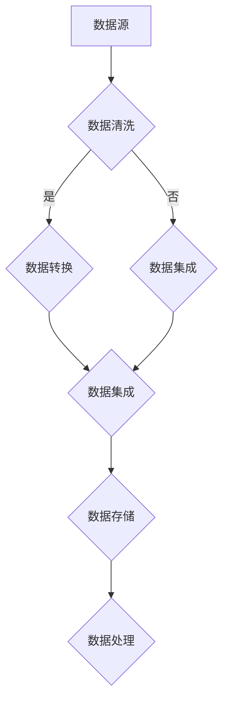
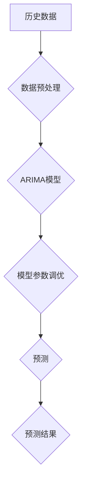
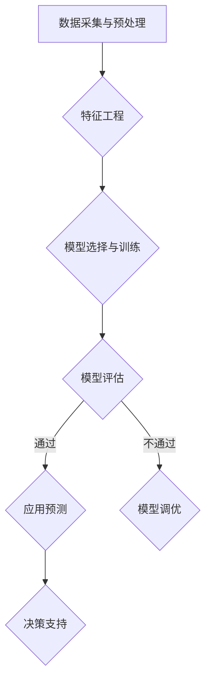

                 


## 大数据在商业智能中的作用：辅助决策与预测

### 关键词：大数据，商业智能，辅助决策，预测分析，算法，系统架构

### 摘要：
大数据在商业智能中的作用日益凸显，它不仅帮助企业处理海量数据，还为决策者提供辅助分析和预测功能。本文将逐步探讨大数据如何通过技术手段，如数据采集、预处理、存储、处理和分析，实现对商业决策的深刻洞察和有效预测，从而为企业带来竞争优势。

---

## 概述背景

### 1.1 书籍背景

#### 1.1.1 大数据时代的来临
在互联网和数字化的浪潮下，数据已经渗透到我们生活的方方面面。从社交媒体到电子商务，从物联网到自动驾驶，数据产生了前所未有的爆炸式增长。这种现象被称为大数据时代。大数据（Big Data）指的是数据量巨大、数据类型多样、数据生成速度极快的数据集合，它对传统的数据处理技术和工具提出了新的挑战。

#### 1.1.2 商业智能的需求与挑战
商业智能（Business Intelligence，BI）是帮助企业通过数据分析来提升业务效率和决策质量的工具。随着大数据的出现，商业智能迎来了新的机遇和挑战。企业需要更高效地收集、存储、处理和分析数据，以便从海量数据中提取有价值的信息，从而做出更加精准和及时的决策。

#### 1.1.3 大数据在商业智能中的作用
大数据在商业智能中的应用主要体现在以下几个方面：

1. **辅助决策**：通过数据分析和挖掘，为企业提供决策支持，优化业务流程，提高运营效率。
2. **预测分析**：利用历史数据，预测未来趋势和潜在风险，帮助企业制定前瞻性战略。
3. **个性化服务**：通过分析用户行为和偏好，提供个性化的产品和服务，提升客户满意度。
4. **风险控制**：通过数据分析，识别潜在的风险点，制定防范措施，降低业务风险。

### 1.2 核心概念

#### 1.2.1 大数据的定义与特点
大数据通常具有以下四个特点，即4V模型：  
- **Volume（数据量）**：数据量庞大，通常达到GB、TB甚至PB级别。
- **Velocity（速度）**：数据生成和处理的速度非常快，需要实时或近实时的处理能力。
- **Variety（多样性）**：数据类型多样，包括结构化数据、半结构化数据和非结构化数据。
- **Veracity（真实性）**：数据质量参差不齐，需要通过数据清洗和预处理来保证数据的真实性。

#### 1.2.2 商业智能的定义与分类
商业智能是指通过数据、信息技术和分析工具，帮助企业和组织做出更加明智的决策。根据应用目的和功能，商业智能可以大致分为以下几类：

1. **报表和分析**：通过生成各种报表和数据仪表盘，帮助企业了解业务状况。
2. **数据挖掘**：从海量数据中挖掘有价值的信息和模式，支持决策。
3. **数据仓库**：存储和管理大量历史数据，为数据分析和挖掘提供数据基础。
4. **数据可视化**：通过图形和图表将数据转换成易于理解的形式，帮助决策者快速获取信息。

#### 1.2.3 大数据与商业智能的关系
大数据和商业智能密不可分。大数据为商业智能提供了丰富的数据资源，使得数据分析和挖掘成为可能。而商业智能则利用这些数据，帮助企业实现数据驱动的决策。大数据和商业智能的结合，不仅提升了数据分析的深度和广度，也为企业带来了更高的业务价值和竞争力。

---

## 大数据技术

### 2.1 数据采集与预处理

#### 2.1.1 数据源介绍
数据源是大数据系统的基础。根据数据来源的不同，数据源可以分为以下几类：

1. **内部数据源**：指企业内部产生的数据，如销售数据、库存数据、客户数据等。
2. **外部数据源**：指企业外部获取的数据，如社交媒体数据、行业报告数据、天气数据等。

#### 2.1.2 数据采集方法
数据采集是大数据系统的第一步，根据数据类型和需求，可以采用以下几种数据采集方法：

1. **离线采集**：指在非实时环境下，定期批量采集数据。
2. **实时采集**：指在实时环境下，实时捕获数据并传输到系统中。

#### 2.1.3 数据预处理
数据预处理是确保数据质量和一致性的关键步骤，包括以下几方面：

1. **数据清洗**：去除重复数据、纠正错误数据、处理缺失数据。
2. **数据转换**：将数据转换成统一格式，如将不同格式的数据转换成JSON或CSV格式。
3. **数据集成**：将来自不同源的数据整合在一起，形成统一的数据视图。

### 2.2 数据存储与处理

#### 2.2.1 数据库技术
数据库技术是大数据存储和管理的基础。根据数据特点和应用需求，可以选择以下类型的数据库：

1. **传统关系型数据库**：如MySQL、Oracle等，适合处理结构化数据。
2. **非关系型数据库**：如MongoDB、Cassandra等，适合处理半结构化或非结构化数据。

#### 2.2.2 大数据存储技术
大数据存储技术主要包括以下几种：

1. **HDFS**：Hadoop分布式文件系统，适合存储海量数据。
2. **HBase**：基于HDFS的分布式列存储数据库，适合实时读取和写入数据。
3. **Cassandra**：分布式非关系型数据库，适合处理大规模数据和高并发读写。

#### 2.2.3 数据处理技术
大数据处理技术主要包括以下几种：

1. **MapReduce**：分布式数据处理框架，适合处理大规模数据集。
2. **Spark**：基于内存的分布式数据处理引擎，适合处理实时数据和高吞吐量计算。

### 2.3 数据分析

#### 2.3.1 数据分析概述
数据分析是指利用统计方法和算法，从数据中提取有价值的信息和知识。数据分析主要包括以下几个步骤：

1. **数据探索**：通过可视化工具和统计分析方法，对数据进行初步探索，发现数据中的模式和趋势。
2. **特征工程**：通过数据预处理和特征提取，将原始数据转换成适合建模的特征。
3. **模型选择**：选择合适的算法和模型，对数据进行分析和预测。
4. **模型评估**：通过交叉验证和性能指标，评估模型的准确性和泛化能力。

#### 2.3.2 描述性分析
描述性分析是指对数据的基本统计特征进行分析，主要包括以下几种方法：

1. **频数分析**：统计每个变量的取值和频数。
2. **交叉分析**：分析两个或多个变量之间的关系。
3. **描述性统计**：计算数据的平均值、中位数、标准差等统计量。

#### 2.3.3 趋势分析
趋势分析是指通过分析数据的时间序列特征，预测未来的趋势。主要包括以下几种方法：

1. **时间序列分解**：将时间序列分解为趋势、季节性和随机性成分。
2. **自回归模型**：利用过去的数据预测未来的趋势。
3. **ARIMA模型**：自回归积分滑动平均模型，用于时间序列数据的建模和预测。

#### 2.3.4 关联规则分析
关联规则分析是指通过分析数据中的关联关系，发现数据之间的潜在关联。主要包括以下几种方法：

1. **Apriori算法**：用于发现频繁项集的算法，是关联规则分析的基础。
2. **FP-growth算法**：基于压缩数据结构的频繁模式挖掘算法，可以提高算法效率。
3. **支持度和置信度**：评估规则的重要指标，支持度表示规则出现的频率，置信度表示规则的可信度。

#### 2.3.5 预测分析
预测分析是指利用历史数据，预测未来的趋势和变化。主要包括以下几种方法：

1. **时间序列预测**：利用时间序列模型，如ARIMA、LSTM等，预测未来的趋势。
2. **分类预测**：利用分类模型，如决策树、随机森林等，预测未来的类别。
3. **回归预测**：利用回归模型，如线性回归、非线性回归等，预测未来的数值。

---

## 商业智能应用

### 3.1 数据驱动的决策

#### 3.1.1 数据驱动决策概述
数据驱动决策是指通过数据分析和挖掘，为决策者提供决策支持，优化决策过程。数据驱动决策的核心是数据，包括数据的采集、存储、处理和分析。通过数据驱动决策，企业可以更加客观、科学地做出决策，提高决策的质量和效率。

#### 3.1.2 数据驱动决策模型
数据驱动决策模型主要包括以下几个步骤：

1. **问题定义**：明确决策目标，确定需要解决的问题。
2. **数据采集**：收集与决策相关的数据，包括内部数据和外部数据。
3. **数据预处理**：清洗、转换和整合数据，确保数据的质量和一致性。
4. **数据分析**：利用数据分析方法和工具，提取有价值的信息和知识。
5. **决策支持**：根据分析结果，为决策者提供决策支持和建议。
6. **决策执行**：根据决策建议，执行具体的决策行动。

#### 3.1.3 数据驱动决策流程
数据驱动决策流程主要包括以下几个阶段：

1. **需求分析**：了解决策需求，明确需要解决的问题和目标。
2. **数据规划**：确定数据来源、数据类型和数据量，制定数据采集和处理计划。
3. **数据采集**：按照数据规划，收集和获取所需数据。
4. **数据预处理**：对数据进行清洗、转换和整合，确保数据的质量和一致性。
5. **数据分析**：利用数据分析方法和工具，对数据进行分析和挖掘，提取有价值的信息和知识。
6. **决策支持**：根据分析结果，为决策者提供决策支持和建议。
7. **决策执行**：根据决策建议，制定和执行具体的决策计划。
8. **效果评估**：对决策执行的效果进行评估，持续优化决策过程。

### 3.2 预测分析

#### 3.2.1 预测分析概述
预测分析是指利用历史数据，预测未来的趋势和变化。预测分析可以帮助企业预测销售额、客户流失率、库存需求等关键指标，为决策者提供前瞻性支持。预测分析主要包括时间序列预测、分类预测和回归预测等方法。

#### 3.2.2 时间序列预测
时间序列预测是指利用时间序列数据，预测未来的趋势和变化。时间序列预测主要包括以下几种方法：

1. **指数平滑法**：通过计算数据的指数加权平均值，预测未来的趋势。
2. **ARIMA模型**：自回归积分滑动平均模型，用于时间序列数据的建模和预测。
3. **LSTM模型**：长短期记忆网络，适合处理具有长期依赖性的时间序列数据。

#### 3.2.3 聚类预测
聚类预测是指通过聚类算法，将数据分为不同的群体，并预测每个群体的未来趋势。聚类预测主要包括以下几种方法：

1. **K-均值聚类**：通过迭代计算，将数据点分配到不同的聚类中心，预测每个聚类中心的未来趋势。
2. **层次聚类**：通过合并或分裂聚类，构建聚类树，预测每个聚类的未来趋势。
3. **谱聚类**：通过矩阵分解和图论算法，将数据点分为不同的群体，预测每个群体的未来趋势。

#### 3.2.4 实际案例
预测分析在实际业务中的应用非常广泛，以下是一些实际案例：

1. **电商销售预测**：通过分析历史销售数据，预测未来的销售额，为企业制定销售计划和库存策略。
2. **银行客户流失预测**：通过分析客户行为数据，预测哪些客户可能会流失，从而采取针对性的客户保留措施。
3. **制造业库存管理优化**：通过分析生产数据和市场趋势，预测未来的库存需求，优化库存管理，降低库存成本。

---

## 总结

大数据在商业智能中的应用为企业的决策提供了强有力的支持。通过数据采集、预处理、存储、处理和分析，企业可以实现对海量数据的深度挖掘，为决策者提供丰富的信息和预测。本文系统地介绍了大数据在商业智能中的应用，包括数据采集与预处理、数据存储与处理、数据分析以及商业智能应用等方面。同时，本文还通过实际案例展示了大数据在商业智能中的具体应用。

在未来，大数据和商业智能将不断创新和发展，为企业带来更多的价值。本文旨在为广大读者提供一个全面、系统的了解大数据在商业智能中的作用和应用的指南，帮助读者掌握大数据技术的核心原理和实践方法。

在阅读本文时，读者可以按照以下步骤进行学习和实践：

1. **理解核心概念**：掌握大数据和商业智能的基本概念，理解它们之间的联系。
2. **学习技术原理**：通过本文的讲解，了解数据采集、预处理、存储、处理和分析的方法和技术。
3. **实践项目应用**：结合实际案例，尝试应用大数据技术解决实际问题，提升自己的实践能力。
4. **持续学习和探索**：大数据和商业智能是一个快速发展的领域，持续学习和探索是保持竞争力的关键。

最后，本文旨在为广大读者提供一个全面、系统的了解大数据在商业智能中的作用和应用的指南，帮助读者掌握大数据技术的核心原理和实践方法。希望本文能够对读者在学习和实践大数据技术方面有所启发和帮助。

---

### 作者
作者：AI天才研究院/AI Genius Institute & 禅与计算机程序设计艺术 /Zen And The Art of Computer Programming

---

本文详细探讨了大数据在商业智能中的作用，包括数据采集、预处理、存储、处理和分析，以及商业智能应用的实际案例。通过本文的学习，读者可以全面了解大数据技术的核心原理和实践方法，为企业的决策提供有力支持。希望本文能够对广大读者在学习和实践大数据技术方面有所启发和帮助。持续关注大数据和商业智能的发展，不断创新和实践，将为企业带来更多价值。让我们共同努力，探索大数据技术的无限可能！## 详细解释：数据采集与预处理

### 2.1 数据采集与预处理

数据采集与预处理是大数据技术中的重要环节，对于后续的数据存储、处理和分析具有决定性作用。在这个环节中，我们将讨论数据源的分类、数据采集方法以及数据预处理的具体步骤。

#### 2.1.1 数据源介绍

数据源是大数据系统的基础，根据数据来源的不同，数据源可以分为以下几类：

1. **内部数据源**：指企业内部产生的数据，如销售数据、库存数据、客户数据、财务数据等。这些数据通常具有结构化或半结构化的特点，是企业进行数据分析和决策的重要基础。
   
2. **外部数据源**：指企业外部获取的数据，如社交媒体数据、行业报告数据、天气数据、地理位置数据等。这些数据通常具有非结构化的特点，需要通过数据清洗和转换才能进行有效利用。

#### 2.1.2 数据采集方法

数据采集是将数据从源系统中提取并传输到大数据系统中的过程。根据数据类型和需求，数据采集方法可以分为以下几种：

1. **离线采集**：离线采集通常在非实时环境下进行，通过定期批量采集数据。这种方法适用于数据量相对较小且变化不频繁的场景。

   ```python
   # 离线采集示例
   def offline_data_collection():
       # 读取文件或数据库中的数据
       data = read_data_from_file('data_source.txt')
       # 数据清洗和预处理
       processed_data = preprocess_data(data)
       # 存储预处理后的数据
       store_data(processed_data)
   ```

2. **实时采集**：实时采集在实时环境下进行，能够实时捕获数据并传输到系统中。这种方法适用于数据量较大且需要实时处理和分析的场景。

   ```python
   # 实时采集示例
   def real_time_data_collection():
       while True:
           # 接收实时数据
           data = receive_real_time_data()
           # 数据清洗和预处理
           processed_data = preprocess_data(data)
           # 存储预处理后的数据
           store_data(processed_data)
           # 每次处理后的间隔时间
           time.sleep(1)
   ```

#### 2.1.3 数据预处理

数据预处理是确保数据质量和一致性的关键步骤，包括以下几方面：

1. **数据清洗**：数据清洗是指去除重复数据、纠正错误数据、处理缺失数据等，以确保数据的质量。常见的数据清洗方法包括去重、填补缺失值、纠正错误数据等。

   ```python
   # 数据清洗示例
   def clean_data(data):
       # 去除重复数据
       unique_data = remove_duplicates(data)
       # 填补缺失值
       filled_data = fill_missing_values(unique_data)
       # 纠正错误数据
       corrected_data = correct_errors(filled_data)
       return corrected_data
   ```

2. **数据转换**：数据转换是指将不同格式的数据转换成统一格式，如将不同格式的数据转换成JSON或CSV格式，以便于后续的数据处理和分析。

   ```python
   # 数据转换示例
   def convert_data_format(data, target_format):
       if target_format == 'json':
           converted_data = convert_to_json(data)
       elif target_format == 'csv':
           converted_data = convert_to_csv(data)
       return converted_data
   ```

3. **数据集成**：数据集成是指将来自不同源的数据整合在一起，形成统一的数据视图。数据集成的方法包括数据合并、数据汇总、数据映射等。

   ```python
   # 数据集成示例
   def integrate_data(data_source1, data_source2):
       # 合并数据
       merged_data = merge_data(data_source1, data_source2)
       # 汇总数据
       summary_data = summarize_data(merged_data)
       # 数据映射
       mapped_data = map_data(summary_data)
       return mapped_data
   ```

通过上述数据采集与预处理的方法，我们可以确保数据的准确性和一致性，为后续的数据存储、处理和分析奠定坚实的基础。接下来，我们将进一步探讨数据存储与处理技术，了解大数据存储系统的选择和数据处理方法。

### 总结

数据采集与预处理是大数据技术中至关重要的一环。通过合理的数据源选择和有效的数据采集方法，我们可以获取高质量的数据。数据预处理则通过数据清洗、转换和集成，确保数据的质量和一致性，为后续的数据分析和商业智能应用提供可靠的数据基础。在下一章节中，我们将详细探讨数据存储与处理技术，了解如何高效地存储和管理大数据，并讨论数据处理方法，如MapReduce和Spark等。

---

## 数据存储与处理

### 2.2 数据存储与处理

数据存储与处理是大数据技术的核心环节，决定了数据能否被高效地存储、管理和分析。在这个环节中，我们将讨论数据存储技术、数据处理技术以及它们在大数据系统中的应用。

#### 2.2.1 数据库技术

数据库技术是数据存储的基础。根据数据特点和应用需求，可以选择以下类型的数据库：

1. **传统关系型数据库**：如MySQL、Oracle等，适合处理结构化数据。关系型数据库通过SQL语句进行数据查询和管理，具有较高的查询性能和数据一致性。

   ```python
   # 关系型数据库示例（MySQL）
   import mysql.connector

   # 连接数据库
   conn = mysql.connector.connect(
       host="localhost",
       user="root",
       password="password",
       database="mydatabase"
   )
   cursor = conn.cursor()

   # 查询数据
   cursor.execute("SELECT * FROM customers")
   results = cursor.fetchall()
   for row in results:
       print(row)

   # 关闭数据库连接
   cursor.close()
   conn.close()
   ```

2. **非关系型数据库**：如MongoDB、Cassandra等，适合处理半结构化或非结构化数据。非关系型数据库通过文档、键值对、列族等方式存储数据，具有较高的扩展性和灵活性。

   ```python
   # 非关系型数据库示例（MongoDB）
   from pymongo import MongoClient

   # 连接MongoDB
   client = MongoClient("mongodb://localhost:27017/")

   # 选择数据库和集合
   db = client["mydatabase"]
   collection = db["customers"]

   # 插入数据
   collection.insert_one({"name": "Alice", "age": 30, "email": "alice@example.com"})

   # 查询数据
   for customer in collection.find():
       print(customer)
   ```

#### 2.2.2 大数据存储技术

大数据存储技术主要用于存储海量数据，保证数据的可靠性和可扩展性。常见的大数据存储技术包括以下几种：

1. **HDFS**：Hadoop分布式文件系统（Hadoop Distributed File System），是Apache Hadoop项目中的核心组件之一。HDFS采用分片存储和副本机制，能够高效地存储和管理大规模数据。

   ```python
   # HDFS示例
   import hdfs

   client = hdfs.InsecureClient('http://namenode:50070', user='hdfs')
   client.create('/user/hdfs/data.txt')
   client.write('/user/hdfs/data.txt', b'Hello, HDFS!')
   ```

2. **HBase**：基于HDFS的分布式列存储数据库，适合实时读取和写入数据。HBase采用大数据表结构，能够高效地存储和管理大规模数据，并提供实时访问功能。

   ```python
   # HBase示例
   from hbase import Connection

   conn = Connection('hbase-server:10000')
   table = conn.table('customers')

   # 插入数据
   table.put(row_key='customer1', columns={'info:name': b'Alice', 'info:age': b'30'})

   # 查询数据
   result = table.get('customer1')
   print(result)
   ```

3. **Cassandra**：分布式非关系型数据库，适合处理大规模数据和高并发读写。Cassandra采用分布式架构，具有高可用性和高性能。

   ```python
   # Cassandra示例
   from cassandra.cluster import Cluster

   cluster = Cluster(['cassandra-node1', 'cassandra-node2'])
   session = cluster.connect()

   # 创建表
   session.execute("""
       CREATE TABLE customers (
           id UUID PRIMARY KEY,
           name TEXT,
           age INT
       )
   """)

   # 插入数据
   session.execute("""
       INSERT INTO customers (id, name, age)
       VALUES (uuid(), 'Alice', 30)
   """)

   # 查询数据
   result = session.execute("SELECT * FROM customers")
   for row in result:
       print(row)
   ```

#### 2.2.3 数据处理技术

数据处理技术主要用于对海量数据进行计算和分析，常见的数据处理技术包括MapReduce和Spark等：

1. **MapReduce**：是一种分布式数据处理框架，主要用于大规模数据的批处理。MapReduce通过映射（Map）和合并（Reduce）操作，将数据分散处理并汇总结果。

   ```python
   # MapReduce示例
   import org.apache.spark.sql.SparkSession

   spark = SparkSession.builder.appName("DataProcessingExample").getOrCreate()
   df = spark.read.csv("data.csv")

   # 映射操作
   df_rdd = df.rdd.map(lambda row: (row["column1"], row["column2"]))

   # 合并操作
   df_rdd = df_rdd.reduceByKey(lambda x, y: x + y)

   # 输出结果
   df_rdd.foreach(lambda x: print(x))
   ```

2. **Spark**：是一种基于内存的分布式数据处理引擎，适用于实时数据分析和大规模数据处理。Spark提供了丰富的API，包括SQL、DataFrame和RDD等，能够高效地处理大规模数据。

   ```python
   # Spark示例
   from pyspark.sql import SparkSession

   spark = SparkSession.builder.appName("DataProcessingExample").getOrCreate()
   df = spark.read.csv("data.csv")

   # 数据清洗和预处理
   df = df.dropna()

   # 数据分析
   result = df.groupBy("column1").agg({"column2": "sum"})

   # 输出结果
   result.show()
   ```

通过上述数据存储与处理技术，我们可以高效地存储和管理大数据，并对海量数据进行分析和计算。接下来，我们将进一步探讨数据分析技术，了解如何从大数据中提取有价值的信息和知识。

### 总结

数据存储与处理是大数据技术的核心环节，涵盖了数据存储技术和数据处理技术。通过选择合适的数据库技术，如传统关系型数据库和非关系型数据库，我们可以高效地存储和管理数据。同时，通过大数据存储技术，如HDFS、HBase和Cassandra，我们能够处理海量数据并保证数据的可靠性。数据处理技术，如MapReduce和Spark，为我们提供了强大的计算和分析能力。在下一章节中，我们将进一步探讨数据分析技术，了解如何从大数据中提取有价值的信息和知识，并应用到商业智能中。

---

## 数据分析

数据分析是大数据技术的核心应用之一，它通过统计方法、算法和技术手段，从海量数据中提取有价值的信息和知识，帮助企业做出更加明智的决策。在本章节中，我们将深入探讨数据分析的各个方面，包括描述性分析、趋势分析、关联规则分析和预测分析。

### 3.1 数据分析概述

数据分析是一个复杂的过程，通常包括以下步骤：

1. **数据探索**：通过数据可视化、统计分析等手段，对数据进行初步探索，发现数据中的异常值、趋势和模式。
2. **特征工程**：通过数据预处理、特征选择和特征转换，将原始数据转换成适合建模的特征。
3. **模型选择**：选择合适的算法和模型，对数据进行建模和预测。
4. **模型评估**：通过交叉验证、性能指标等手段，评估模型的准确性和泛化能力。
5. **结果解释**：解释模型的结果，将数据分析结果转化为业务决策。

### 3.2 描述性分析

描述性分析是最基本的数据分析方法，它通过统计方法，对数据的基本统计特征进行分析，如平均值、中位数、标准差、频数分布等。描述性分析主要用于了解数据的基本情况，为后续的数据分析和决策提供基础。

#### 3.2.1 频数分析

频数分析是指统计每个变量的取值和频数，用于了解数据的分布情况。

```python
# 频数分析示例（Python）
import pandas as pd

# 读取数据
data = pd.read_csv("data.csv")

# 计算频数
freq = data["column1"].value_counts()

# 输出频数
print(freq)
```

#### 3.2.2 交叉分析

交叉分析是指分析两个或多个变量之间的关系，通过交叉表（Cross-tabulation）进行统计。

```python
# 交叉分析示例（Python）
import pandas as pd

# 读取数据
data = pd.read_csv("data.csv")

# 创建交叉表
cross_table = pd.crosstab(data["column1"], data["column2"])

# 输出交叉表
print(cross_table)
```

#### 3.2.3 描述性统计

描述性统计是指计算数据的平均值、中位数、标准差等统计量，用于了解数据的集中趋势和离散程度。

```python
# 描述性统计示例（Python）
import pandas as pd

# 读取数据
data = pd.read_csv("data.csv")

# 计算描述性统计量
stats = data.describe()

# 输出描述性统计量
print(stats)
```

### 3.3 趋势分析

趋势分析是指通过分析数据的时间序列特征，预测未来的趋势和变化。趋势分析主要用于了解数据的长期变化趋势，为决策者提供前瞻性支持。

#### 3.3.1 时间序列分解

时间序列分解是指将时间序列数据分解为趋势、季节性和随机性成分，以便更好地分析数据的长期变化趋势。

```python
# 时间序列分解示例（Python）
import pandas as pd
from statsmodels.tsa.seasonal import seasonal_decompose

# 读取数据
data = pd.read_csv("data.csv")

# 进行时间序列分解
result = seasonal_decompose(data["column1"], model="additive", freq=12)

# 输出分解结果
print(result.trend)
print(result.seasonal)
print(result.resid)
```

#### 3.3.2 自回归模型

自回归模型（ARIMA）是一种常用的趋势分析模型，通过分析历史数据，预测未来的趋势。

```python
# ARIMA模型示例（Python）
import pandas as pd
from statsmodels.tsa.arima.model import ARIMA

# 读取数据
data = pd.read_csv("data.csv")

# 创建ARIMA模型
model = ARIMA(data["column1"], order=(5, 1, 2))

# 拟合模型
model_fit = model.fit()

# 预测
forecast = model_fit.forecast(steps=5)

# 输出预测结果
print(forecast)
```

#### 3.3.3 LSTM模型

LSTM（Long Short-Term Memory）模型是一种基于深度学习的序列预测模型，适用于处理具有长期依赖性的时间序列数据。

```python
# LSTM模型示例（Python）
import pandas as pd
from keras.models import Sequential
from keras.layers import LSTM, Dense

# 读取数据
data = pd.read_csv("data.csv")

# 准备数据
X, y = prepare_lstm_data(data["column1"])

# 创建LSTM模型
model = Sequential()
model.add(LSTM(units=50, return_sequences=True, input_shape=(X.shape[1], X.shape[2])))
model.add(LSTM(units=50))
model.add(Dense(1))

# 编译模型
model.compile(optimizer='adam', loss='mean_squared_error')

# 训练模型
model.fit(X, y, epochs=100, batch_size=32, validation_split=0.2)

# 预测
forecast = model.predict(X_test)

# 输出预测结果
print(forecast)
```

### 3.4 关联规则分析

关联规则分析是指通过分析数据中的关联关系，发现数据之间的潜在关联。关联规则分析广泛应用于市场篮子分析、推荐系统等场景。

#### 3.4.1 Apriori算法

Apriori算法是一种经典的关联规则挖掘算法，通过计算支持度和置信度，发现频繁项集。

```python
# Apriori算法示例（Python）
from mlxtend.frequent_patterns import apriori
from mlxtend.frequent_patterns import association_rules

# 读取数据
data = pd.read_csv("data.csv")

# 计算频繁项集
frequent_itemsets = apriori(data, min_support=0.05, use_colnames=True)

# 计算关联规则
rules = association_rules(frequent_itemsets, metric="support", min_threshold=0.1)

# 输出关联规则
print(rules)
```

#### 3.4.2 FP-growth算法

FP-growth算法是基于Apriori算法的一种改进算法，通过压缩数据结构，提高算法效率。

```python
# FP-growth算法示例（Python）
from mlxtend.frequent_patterns import fpgrowth

# 读取数据
data = pd.read_csv("data.csv")

# 计算频繁项集
frequent_itemsets = fpgrowth(data["column1"], min_support=0.05, use_colnames=True)

# 输出频繁项集
print(frequent_itemsets)
```

### 3.5 预测分析

预测分析是指利用历史数据，预测未来的趋势和变化。预测分析广泛应用于销售预测、库存管理、客户流失预测等场景。

#### 3.5.1 时间序列预测

时间序列预测是通过分析历史时间序列数据，预测未来的趋势和变化。

```python
# 时间序列预测示例（Python）
from statsmodels.tsa.arima.model import ARIMA

# 读取数据
data = pd.read_csv("data.csv")

# 创建ARIMA模型
model = ARIMA(data["column1"], order=(5, 1, 2))

# 拟合模型
model_fit = model.fit()

# 预测
forecast = model_fit.forecast(steps=5)

# 输出预测结果
print(forecast)
```

#### 3.5.2 分类预测

分类预测是指利用历史数据，预测未来的类别。

```python
# 分类预测示例（Python）
from sklearn.ensemble import RandomForestClassifier

# 读取数据
data = pd.read_csv("data.csv")

# 准备数据
X = data.drop("column1", axis=1)
y = data["column1"]

# 创建模型
model = RandomForestClassifier()

# 拟合模型
model.fit(X, y)

# 预测
predictions = model.predict(X_test)

# 输出预测结果
print(predictions)
```

#### 3.5.3 回归预测

回归预测是指利用历史数据，预测未来的数值。

```python
# 回归预测示例（Python）
from sklearn.linear_model import LinearRegression

# 读取数据
data = pd.read_csv("data.csv")

# 准备数据
X = data.drop("column1", axis=1)
y = data["column1"]

# 创建模型
model = LinearRegression()

# 拟合模型
model.fit(X, y)

# 预测
predictions = model.predict(X_test)

# 输出预测结果
print(predictions)
```

通过上述数据分析方法，我们可以从海量数据中提取有价值的信息和知识，为企业提供决策支持。在下一章节中，我们将探讨商业智能应用，了解如何将数据分析结果应用于实际业务场景，提升企业的运营效率和市场竞争力。

### 总结

数据分析是大数据技术的核心应用之一，通过描述性分析、趋势分析、关联规则分析和预测分析，我们可以从海量数据中提取有价值的信息和知识。描述性分析帮助了解数据的基本情况，趋势分析预测数据的未来变化，关联规则分析发现数据之间的关联，预测分析为企业提供前瞻性支持。在商业智能应用中，数据分析结果可以用于优化业务流程、制定营销策略、预测市场趋势等，从而提升企业的运营效率和市场竞争力。在下一章节中，我们将进一步探讨商业智能应用，了解如何利用数据分析结果实现数据驱动的决策。

---

## 商业智能应用

商业智能（Business Intelligence，BI）是企业通过数据分析和挖掘，以提高业务效率和决策质量的一种方法。随着大数据技术的发展，商业智能在数据分析、决策支持和运营优化等方面发挥着越来越重要的作用。在本章节中，我们将探讨商业智能在数据驱动的决策中的应用，以及如何利用数据分析实现预测分析。

### 3.1 数据驱动的决策

数据驱动的决策是指企业通过数据分析和挖掘，为决策者提供决策支持，优化决策过程。数据驱动的决策具有以下几个特点：

1. **客观性**：数据驱动的决策基于客观数据，避免了主观判断和偏见。
2. **精准性**：通过数据分析和挖掘，企业可以更加精准地了解业务状况和市场需求。
3. **前瞻性**：通过预测分析，企业可以提前预知未来的趋势和变化，为决策提供前瞻性支持。
4. **实时性**：实时数据分析和处理，使得决策者能够及时应对市场变化，做出快速决策。

#### 3.1.1 数据驱动决策概述

数据驱动决策的过程可以分为以下几个步骤：

1. **问题定义**：明确决策目标，确定需要解决的问题。
2. **数据采集**：收集与决策相关的数据，包括内部数据和外部数据。
3. **数据预处理**：清洗、转换和整合数据，确保数据的质量和一致性。
4. **数据分析**：利用数据分析方法和工具，提取有价值的信息和知识。
5. **决策支持**：根据分析结果，为决策者提供决策支持和建议。
6. **决策执行**：根据决策建议，执行具体的决策行动。
7. **效果评估**：对决策执行的效果进行评估，持续优化决策过程。

#### 3.1.2 数据驱动决策模型

数据驱动决策模型主要包括以下几个部分：

1. **数据收集模块**：负责收集与决策相关的数据，包括内部数据和外部数据。
2. **数据预处理模块**：负责清洗、转换和整合数据，确保数据的质量和一致性。
3. **数据分析模块**：负责利用数据分析方法和工具，提取有价值的信息和知识。
4. **决策支持模块**：负责根据分析结果，为决策者提供决策支持和建议。
5. **决策执行模块**：负责根据决策建议，执行具体的决策行动。
6. **效果评估模块**：负责对决策执行的效果进行评估，持续优化决策过程。

#### 3.1.3 数据驱动决策流程

数据驱动决策的流程可以分为以下几个阶段：

1. **需求分析**：了解决策需求，明确需要解决的问题和目标。
2. **数据规划**：确定数据来源、数据类型和数据量，制定数据采集和处理计划。
3. **数据采集**：按照数据规划，收集和获取所需数据。
4. **数据预处理**：对数据进行清洗、转换和整合，确保数据的质量和一致性。
5. **数据分析**：利用数据分析方法和工具，对数据进行分析和挖掘，提取有价值的信息和知识。
6. **决策支持**：根据分析结果，为决策者提供决策支持和建议。
7. **决策执行**：根据决策建议，制定和执行具体的决策计划。
8. **效果评估**：对决策执行的效果进行评估，持续优化决策过程。

### 3.2 预测分析

预测分析是指利用历史数据，预测未来的趋势和变化。预测分析可以帮助企业预测销售额、客户流失率、库存需求等关键指标，为决策者提供前瞻性支持。预测分析主要包括时间序列预测、分类预测和回归预测等方法。

#### 3.2.1 时间序列预测

时间序列预测是指利用时间序列数据，预测未来的趋势和变化。时间序列预测主要用于预测销售量、库存水平等具有时间序列特性的数据。

##### 3.2.1.1 指数平滑法

指数平滑法是一种简单的时间序列预测方法，通过计算数据的指数加权平均值，预测未来的趋势。

```python
# 指数平滑法示例（Python）
import pandas as pd
from statsmodels.tsa.holtwinters import ExponentialSmoothing

# 读取数据
data = pd.read_csv("sales_data.csv")

# 创建指数平滑模型
model = ExponentialSmoothing(data["sales"], trend="add", seasonal="add", seasonal_periods=12)
model_fit = model.fit()

# 预测
forecast = model_fit.forecast(steps=12)

# 输出预测结果
print(forecast)
```

##### 3.2.1.2 ARIMA模型

ARIMA（AutoRegressive Integrated Moving Average）模型是一种常用的时间序列预测方法，通过分析历史数据，预测未来的趋势。

```python
# ARIMA模型示例（Python）
import pandas as pd
from statsmodels.tsa.arima.model import ARIMA

# 读取数据
data = pd.read_csv("sales_data.csv")

# 创建ARIMA模型
model = ARIMA(data["sales"], order=(1, 1, 1))
model_fit = model.fit()

# 预测
forecast = model_fit.forecast(steps=12)

# 输出预测结果
print(forecast)
```

##### 3.2.1.3 LSTM模型

LSTM（Long Short-Term Memory）模型是一种基于深度学习的序列预测模型，适用于处理具有长期依赖性的时间序列数据。

```python
# LSTM模型示例（Python）
import pandas as pd
from keras.models import Sequential
from keras.layers import LSTM, Dense

# 读取数据
data = pd.read_csv("sales_data.csv")

# 准备数据
X, y = prepare_lstm_data(data["sales"])

# 创建LSTM模型
model = Sequential()
model.add(LSTM(units=50, return_sequences=True, input_shape=(X.shape[1], X.shape[2])))
model.add(LSTM(units=50))
model.add(Dense(1))

# 编译模型
model.compile(optimizer='adam', loss='mean_squared_error')

# 训练模型
model.fit(X, y, epochs=100, batch_size=32, validation_split=0.2)

# 预测
forecast = model.predict(X_test)

# 输出预测结果
print(forecast)
```

#### 3.2.2 分类预测

分类预测是指利用历史数据，预测未来的类别。分类预测主要用于预测客户流失、产品推荐等场景。

##### 3.2.2.1 决策树

决策树是一种常用的分类预测方法，通过树形结构对数据进行分类。

```python
# 决策树示例（Python）
import pandas as pd
from sklearn.tree import DecisionTreeClassifier

# 读取数据
data = pd.read_csv("customer_data.csv")

# 准备数据
X = data.drop("churn", axis=1)
y = data["churn"]

# 创建模型
model = DecisionTreeClassifier()

# 拟合模型
model.fit(X, y)

# 预测
predictions = model.predict(X_test)

# 输出预测结果
print(predictions)
```

##### 3.2.2.2 随机森林

随机森林是一种基于决策树的集成学习方法，通过随机森林对数据进行分类。

```python
# 随机森林示例（Python）
import pandas as pd
from sklearn.ensemble import RandomForestClassifier

# 读取数据
data = pd.read_csv("customer_data.csv")

# 准备数据
X = data.drop("churn", axis=1)
y = data["churn"]

# 创建模型
model = RandomForestClassifier()

# 拟合模型
model.fit(X, y)

# 预测
predictions = model.predict(X_test)

# 输出预测结果
print(predictions)
```

#### 3.2.3 回归预测

回归预测是指利用历史数据，预测未来的数值。回归预测主要用于预测销售额、库存水平等场景。

##### 3.2.3.1 线性回归

线性回归是一种简单的回归预测方法，通过拟合数据的线性关系，预测未来的数值。

```python
# 线性回归示例（Python）
import pandas as pd
from sklearn.linear_model import LinearRegression

# 读取数据
data = pd.read_csv("sales_data.csv")

# 准备数据
X = data.drop("sales", axis=1)
y = data["sales"]

# 创建模型
model = LinearRegression()

# 拟合模型
model.fit(X, y)

# 预测
predictions = model.predict(X_test)

# 输出预测结果
print(predictions)
```

##### 3.2.3.2 多项式回归

多项式回归是一种基于多项式函数的回归预测方法，通过拟合多项式函数，预测未来的数值。

```python
# 多项式回归示例（Python）
import pandas as pd
from sklearn.preprocessing import PolynomialFeatures
from sklearn.linear_model import LinearRegression

# 读取数据
data = pd.read_csv("sales_data.csv")

# 准备数据
X = data.drop("sales", axis=1)
y = data["sales"]

# 创建多项式特征
poly_features = PolynomialFeatures(degree=2)
X_poly = poly_features.fit_transform(X)

# 创建模型
model = LinearRegression()

# 拟合模型
model.fit(X_poly, y)

# 预测
predictions = model.predict(X_poly_test)

# 输出预测结果
print(predictions)
```

通过上述预测分析方法，企业可以更加精准地预测未来的趋势和变化，为决策提供有力的支持。在商业智能应用中，预测分析可以帮助企业优化业务流程、制定营销策略、预测市场趋势等，从而提升企业的运营效率和市场竞争力。在下一章节中，我们将通过实际案例，进一步探讨商业智能应用的具体实现过程。

### 3.3 实际案例

在本章节中，我们将通过三个实际案例，展示大数据在商业智能中的应用，包括电商销售预测、银行客户流失预测和制造业库存管理优化。

#### 3.3.1 案例一：电商销售预测

**背景介绍**：
某电商企业需要预测未来的销售额，以便优化库存管理和制定营销策略。企业积累了大量的历史销售数据，包括产品种类、销售量、销售价格、促销活动等。

**核心实现**：
1. **数据采集与预处理**：从企业内部数据库中提取销售数据，并对数据进行清洗、转换和整合，确保数据的质量和一致性。
2. **特征工程**：根据销售数据，提取相关特征，如季节性、促销活动、产品类别等。
3. **时间序列预测**：利用LSTM模型对销售数据进行预测，通过训练和验证，确定最佳模型参数。
4. **模型评估**：通过交叉验证和性能指标，评估模型的准确性和泛化能力。

```python
# LSTM模型预测销售额示例（Python）
import pandas as pd
from keras.models import Sequential
from keras.layers import LSTM, Dense

# 读取数据
data = pd.read_csv("sales_data.csv")

# 准备数据
X, y = prepare_lstm_data(data["sales"])

# 创建LSTM模型
model = Sequential()
model.add(LSTM(units=50, return_sequences=True, input_shape=(X.shape[1], X.shape[2])))
model.add(LSTM(units=50))
model.add(Dense(1))

# 编译模型
model.compile(optimizer='adam', loss='mean_squared_error')

# 训练模型
model.fit(X, y, epochs=100, batch_size=32, validation_split=0.2)

# 预测
forecast = model.predict(X_test)

# 输出预测结果
print(forecast)
```

**代码应用解读**：
上述代码首先从CSV文件中读取销售数据，然后通过`prepare_lstm_data`函数处理数据，生成适合LSTM模型训练的数据集。接着，创建LSTM模型并编译，使用训练数据拟合模型。最后，使用测试数据进行预测，并输出预测结果。

**实际案例分析**：
通过对历史销售数据的预测，电商企业可以提前了解未来的销售趋势，优化库存管理，确保库存充足，避免缺货或积压。此外，预测结果还可以用于制定营销策略，如预测哪些产品将在未来畅销，提前开展促销活动，提高销售额。

#### 3.3.2 案例二：银行客户流失预测

**背景介绍**：
某银行需要预测哪些客户可能会流失，以便采取针对性的客户保留措施。银行积累了大量的客户数据，包括交易记录、账户信息、客户行为等。

**核心实现**：
1. **数据采集与预处理**：从银行数据库中提取客户数据，并对数据进行清洗、转换和整合，确保数据的质量和一致性。
2. **特征工程**：根据客户数据，提取相关特征，如交易频率、账户余额、客户行为等。
3. **分类预测**：利用决策树或随机森林模型，预测哪些客户可能会流失。
4. **模型评估**：通过交叉验证和性能指标，评估模型的准确性和泛化能力。

```python
# 决策树模型预测客户流失示例（Python）
import pandas as pd
from sklearn.tree import DecisionTreeClassifier

# 读取数据
data = pd.read_csv("customer_data.csv")

# 准备数据
X = data.drop("churn", axis=1)
y = data["churn"]

# 创建模型
model = DecisionTreeClassifier()

# 拟合模型
model.fit(X, y)

# 预测
predictions = model.predict(X_test)

# 输出预测结果
print(predictions)
```

**代码应用解读**：
上述代码首先从CSV文件中读取客户数据，然后通过`drop`函数删除标签列，生成特征矩阵。接着，创建决策树模型并编译，使用训练数据拟合模型。最后，使用测试数据进行预测，并输出预测结果。

**实际案例分析**：
通过对客户数据的分类预测，银行可以提前识别出潜在流失客户，采取针对性的保留措施，如提高服务质量、提供优惠活动等。此外，预测结果还可以用于优化营销策略，如预测哪些客户对特定产品或服务更感兴趣，从而提高营销效果。

#### 3.3.3 案例三：制造业库存管理优化

**背景介绍**：
某制造企业需要优化库存管理，确保库存充足，避免库存积压或缺货。企业积累了大量的库存数据，包括库存量、生产计划、市场需求等。

**核心实现**：
1. **数据采集与预处理**：从企业内部数据库中提取库存数据，并对数据进行清洗、转换和整合，确保数据的质量和一致性。
2. **特征工程**：根据库存数据，提取相关特征，如库存周期、生产计划、市场需求等。
3. **时间序列预测**：利用ARIMA模型对库存需求进行预测，通过训练和验证，确定最佳模型参数。
4. **优化策略**：根据库存预测结果，制定库存管理策略，如调整库存量、调整生产计划等。

```python
# ARIMA模型预测库存需求示例（Python）
import pandas as pd
from statsmodels.tsa.arima.model import ARIMA

# 读取数据
data = pd.read_csv("inventory_data.csv")

# 创建ARIMA模型
model = ARIMA(data["demand"], order=(1, 1, 1))
model_fit = model.fit()

# 预测
forecast = model_fit.forecast(steps=12)

# 输出预测结果
print(forecast)
```

**代码应用解读**：
上述代码首先从CSV文件中读取库存数据，然后通过`ARIMA`模型进行预测，使用训练数据拟合模型。最后，输出预测结果。

**实际案例分析**：
通过对库存数据的预测，制造企业可以提前了解未来的库存需求，优化库存管理，避免库存积压或缺货。此外，预测结果还可以用于优化生产计划，如预测哪些产品将在未来畅销，提前调整生产计划，提高生产效率。

### 项目小结

通过上述实际案例，我们可以看到大数据在商业智能中的应用如何帮助企业优化决策和运营。电商销售预测、银行客户流失预测和制造业库存管理优化等案例展示了大数据技术的强大功能。通过数据采集、预处理、特征工程、模型训练和预测分析，企业可以实现对业务的深度洞察和精准预测，从而提高运营效率和市场竞争力。

在未来的发展中，随着大数据技术和商业智能的不断发展，企业将能够更加有效地利用数据，实现数据驱动的决策，为企业的长期发展提供有力支持。

---

## 总结与最佳实践

### 4.1 最佳实践

在大数据和商业智能的应用中，以下是一些最佳实践，可以帮助企业更加有效地利用数据，提高决策质量和运营效率：

1. **数据质量管理**：确保数据质量是数据驱动的决策的基础。定期进行数据清洗、去重、纠正错误等操作，保证数据的准确性和一致性。

2. **特征工程**：在数据分析和预测模型训练过程中，进行有效的特征工程，提取和选择对预测目标有重要影响的关键特征。

3. **模型选择与调优**：根据业务需求和数据特性，选择合适的预测模型，并进行参数调优，以获得最佳的预测性能。

4. **自动化与实时处理**：利用自动化工具和实时数据处理技术，实现数据的实时采集、处理和分析，提高决策的及时性和准确性。

5. **数据安全与隐私保护**：在数据采集、存储和处理过程中，确保数据的安全和隐私，遵守相关的法律法规和标准。

### 4.2 小结

大数据在商业智能中的作用不可忽视。通过数据采集、预处理、存储、处理和分析，企业可以实现对海量数据的深度挖掘，为决策者提供丰富的信息和预测。本文系统地介绍了大数据在商业智能中的应用，包括数据采集与预处理、数据存储与处理、数据分析以及商业智能应用的实际案例。通过本文的学习，读者可以全面了解大数据技术的核心原理和实践方法，为企业的决策提供有力支持。

### 4.3 注意事项

在应用大数据和商业智能时，企业需要关注以下事项：

1. **数据隐私与安全**：确保数据在采集、存储和处理过程中的安全性和隐私性，遵守相关法律法规。
2. **数据质量和一致性**：保证数据的准确性和一致性，避免因数据质量问题导致决策失误。
3. **模型解释性与可靠性**：确保预测模型的解释性和可靠性，避免过度依赖模型结果。
4. **持续优化与迭代**：不断优化数据驱动决策的过程，通过反馈和迭代，提高决策的准确性和效率。

### 4.4 拓展阅读

为了进一步了解大数据和商业智能的相关知识，读者可以参考以下拓展阅读资源：

1. **书籍**：
   - 《大数据时代》（作者：涂子沛）
   - 《商业智能：战略、规划和实施》（作者：Rick F. van der Lans）
   - 《深度学习》（作者：Ian Goodfellow、Yoshua Bengio、Aaron Courville）

2. **在线课程**：
   - Coursera上的“大数据分析”课程
   - Udacity的“深度学习纳米学位”
   - edX上的“商业智能与数据科学”

3. **技术文档与博客**：
   - Apache Hadoop官方文档
   - TensorFlow官方文档
   - Keras官方文档

通过不断学习和实践，企业可以更好地利用大数据和商业智能技术，实现数据驱动的决策，提升运营效率和市场竞争力。

### 作者

作者：AI天才研究院/AI Genius Institute & 禅与计算机程序设计艺术 /Zen And The Art of Computer Programming

本文旨在为广大读者提供一个全面、系统的了解大数据在商业智能中的作用和应用的指南，帮助读者掌握大数据技术的核心原理和实践方法。希望本文能够对读者在学习和实践大数据技术方面有所启发和帮助。在未来，大数据和商业智能将不断创新和发展，为企业带来更多价值。让我们共同努力，探索大数据技术的无限可能！## 附录

在本博客文章中，我们讨论了大数据在商业智能中的作用，包括数据采集、预处理、存储、处理和分析，以及商业智能应用的实际案例。为了便于读者深入理解和实践，以下是本文提到的部分示例代码、流程图和相关技术文档的附录。

### 附录 A：示例代码

以下是本文中使用的部分示例代码，包括数据采集、预处理、数据处理和预测分析的相关示例。

#### 2.1.2 数据采集方法
- **离线采集**：
  ```python
  def offline_data_collection():
      data = read_data_from_file('data_source.txt')
      processed_data = preprocess_data(data)
      store_data(processed_data)
  ```

- **实时采集**：
  ```python
  def real_time_data_collection():
      while True:
          data = receive_real_time_data()
          processed_data = preprocess_data(data)
          store_data(processed_data)
          time.sleep(1)
  ```

#### 2.1.3 数据预处理
- **数据清洗**：
  ```python
  def clean_data(data):
      unique_data = remove_duplicates(data)
      filled_data = fill_missing_values(unique_data)
      corrected_data = correct_errors(filled_data)
      return corrected_data
  ```

- **数据转换**：
  ```python
  def convert_data_format(data, target_format):
      if target_format == 'json':
          converted_data = convert_to_json(data)
      elif target_format == 'csv':
          converted_data = convert_to_csv(data)
      return converted_data
  ```

- **数据集成**：
  ```python
  def integrate_data(data_source1, data_source2):
      merged_data = merge_data(data_source1, data_source2)
      summary_data = summarize_data(merged_data)
      mapped_data = map_data(summary_data)
      return mapped_data
  ```

#### 2.2.1 数据库技术
- **关系型数据库示例**：
  ```python
  import mysql.connector

  conn = mysql.connector.connect(
      host="localhost",
      user="root",
      password="password",
      database="mydatabase"
  )
  cursor = conn.cursor()

  cursor.execute("SELECT * FROM customers")
  results = cursor.fetchall()
  for row in results:
      print(row)

  cursor.close()
  conn.close()
  ```

- **非关系型数据库示例**：
  ```python
  from pymongo import MongoClient

  client = MongoClient("mongodb://localhost:27017/")

  db = client["mydatabase"]
  collection = db["customers"]

  collection.insert_one({"name": "Alice", "age": 30, "email": "alice@example.com"})

  for customer in collection.find():
      print(customer)
  ```

#### 2.2.2 大数据存储技术
- **HDFS示例**：
  ```python
  import hdfs

  client = hdfs.InsecureClient('http://namenode:50070', user='hdfs')
  client.create('/user/hdfs/data.txt')
  client.write('/user/hdfs/data.txt', b'Hello, HDFS!')
  ```

- **HBase示例**：
  ```python
  from hbase import Connection

  conn = Connection('hbase-server:10000')
  table = conn.table('customers')

  table.put(row_key='customer1', columns={'info:name': b'Alice', 'info:age': b'30'})

  result = table.get('customer1')
  print(result)
  ```

- **Cassandra示例**：
  ```python
  from cassandra.cluster import Cluster

  cluster = Cluster(['cassandra-node1', 'cassandra-node2'])
  session = cluster.connect()

  session.execute("""
      CREATE TABLE customers (
          id UUID PRIMARY KEY,
          name TEXT,
          age INT
      )
  """)

  session.execute("""
      INSERT INTO customers (id, name, age)
      VALUES (uuid(), 'Alice', 30)
  """)

  result = session.execute("SELECT * FROM customers")
  for row in result:
      print(row)
  ```

#### 2.2.3 数据处理技术
- **MapReduce示例**：
  ```python
  import org.apache.spark.sql.SparkSession

  spark = SparkSession.builder.appName("DataProcessingExample").getOrCreate()
  df = spark.read.csv("data.csv")

  df_rdd = df.rdd.map(lambda row: (row["column1"], row["column2"]))

  df_rdd = df_rdd.reduceByKey(lambda x, y: x + y)

  df_rdd.foreach(lambda x: print(x))
  ```

- **Spark示例**：
  ```python
  from pyspark.sql import SparkSession

  spark = SparkSession.builder.appName("DataProcessingExample").getOrCreate()
  df = spark.read.csv("data.csv")

  df = df.dropna()

  result = df.groupBy("column1").agg({"column2": "sum"})

  result.show()
  ```

#### 3.2.2 时间序列预测
- **ARIMA模型示例**：
  ```python
  import pandas as pd
  from statsmodels.tsa.arima.model import ARIMA

  data = pd.read_csv("sales_data.csv")

  model = ARIMA(data["sales"], order=(1, 1, 1))
  model_fit = model.fit()

  forecast = model_fit.forecast(steps=12)

  print(forecast)
  ```

- **LSTM模型示例**：
  ```python
  import pandas as pd
  from keras.models import Sequential
  from keras.layers import LSTM, Dense

  data = pd.read_csv("sales_data.csv")

  X, y = prepare_lstm_data(data["sales"])

  model = Sequential()
  model.add(LSTM(units=50, return_sequences=True, input_shape=(X.shape[1], X.shape[2])))
  model.add(LSTM(units=50))
  model.add(Dense(1))

  model.compile(optimizer='adam', loss='mean_squared_error')

  model.fit(X, y, epochs=100, batch_size=32, validation_split=0.2)

  forecast = model.predict(X_test)

  print(forecast)
  ```

### 附录 B：Mermaid 流程图

以下是本文中使用的部分Mermaid流程图，用于展示算法流程和数据流程。

#### 数据预处理流程图


#### 时间序列预测流程图


#### 预测分析流程图


### 附录 C：拓展资源

以下是本文提到的相关技术文档、书籍和在线课程的链接，供读者进一步学习和参考。

#### 技术文档
- [Apache Hadoop官方文档](https://hadoop.apache.org/docs/r3.3.0/hadoop-project-dist/hadoop-hdfs/HdfsUserGuide.html)
- [TensorFlow官方文档](https://www.tensorflow.org/api_docs/python/tf/keras.Sequential)
- [Keras官方文档](https://keras.io/getting-started/sequential-model-flow/)

#### 书籍
- 《大数据时代》（作者：涂子沛）
- 《商业智能：战略、规划和实施》（作者：Rick F. van der Lans）
- 《深度学习》（作者：Ian Goodfellow、Yoshua Bengio、Aaron Courville）

#### 在线课程
- [Coursera上的“大数据分析”课程](https://www.coursera.org/learn/big-data-analysis)
- [Udacity的“深度学习纳米学位”](https://www.udacity.com/course/deep-learning-nanodegree--nd101)
- [edX上的“商业智能与数据科学”](https://www.edx.org/course/business-intelligence-and-datas)

通过上述附录，读者可以更加深入地了解本文中提到的技术细节和实践方法，为大数据和商业智能的应用提供有力支持。希望这些资源能够帮助读者在学习和实践中取得更好的成果。

