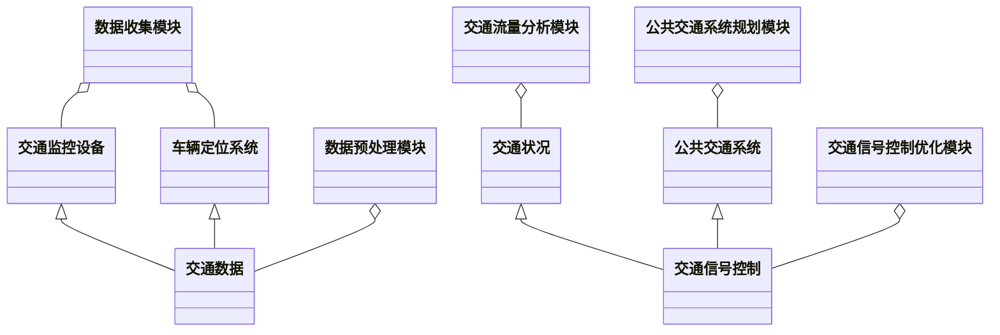
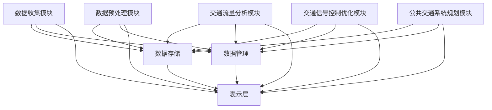
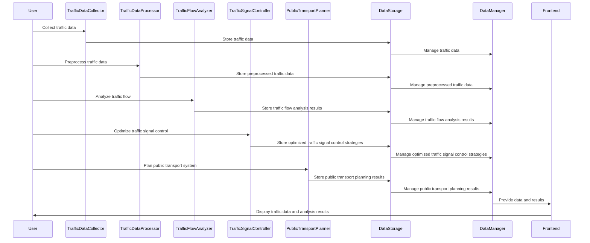

                 

# 大数据在城市交通优化中的应用：减少拥堵与污染

## 关键词
- 大数据
- 城市交通优化
- 交通流量分析
- 交通信号控制
- 污染减少

## 摘要
本文探讨了大数据在城市交通优化中的应用，包括数据收集、预处理、交通流量分析以及交通信号控制优化等方面。通过大数据技术，可以实现实时监控交通流量、预测交通状况、优化信号控制，从而有效减少城市拥堵和污染。本文旨在为城市交通管理提供一种基于大数据的解决方案，以提高交通效率，改善市民出行体验。

## 引言

### 1.1 问题背景
随着城市化进程的加快和汽车拥有量的不断增加，城市交通问题日益严重。拥堵、污染、交通事故等问题不仅影响了市民的出行体验，还对环境造成了严重影响。据研究，交通拥堵每年会导致数百万人陷入通勤困境，同时，交通污染也是许多城市面临的主要环境问题之一。因此，寻找有效的城市交通优化方法成为了一个迫切需要解决的问题。

### 1.2 问题描述
城市交通优化涉及到多个方面，如交通流量管理、交通信号控制、公共交通系统规划等。这些问题的复杂性和动态性使得传统的交通管理方法难以满足现代城市交通的需求。因此，需要一种能够实时响应、动态调整的交通优化方法。

### 1.3 问题解决
大数据技术为城市交通优化提供了新的思路和方法。通过大数据技术，可以对海量交通数据进行收集、存储、分析和处理，从而实现对交通流量的实时监控、预测和优化。本文将详细探讨大数据在交通优化中的应用，包括数据收集、预处理、交通流量分析和交通信号控制优化等方面。

### 1.4 边界与外延
本文主要关注大数据在城市交通优化中的应用，不包括其他交通领域的优化方法，如智能交通系统（ITS）、车辆自动驾驶等。同时，本文的研究主要集中在大数据的处理和分析技术上，不涉及具体的交通管理政策和社会问题。

### 1.5 概念结构与核心要素组成
本著作的核心概念包括大数据、交通数据、交通优化、数据分析、算法优化等。核心要素包括交通数据的收集、存储、分析和处理。通过这些核心要素的相互作用，可以实现城市交通的优化管理。

### 1.6 本章小结
本章对大数据在城市交通优化中的应用进行了背景介绍，阐述了问题的重要性、问题描述、问题解决方法以及研究的边界与外延。为后续章节的深入讨论奠定了基础。

## 大数据与城市交通优化

### 2.1 大数据的概念与特点

#### 2.1.1 大数据的定义
大数据是指数据量巨大、种类繁多、速度极快的数据集合，通常指的是“4V”特性：Volume（数据量）、Velocity（数据速度）、Variety（数据多样性）和 Veracity（数据真实性）。

#### 2.1.2 大数据的核心特点

##### 2.1.2.1 数据量（Volume）
大数据的数据量通常达到PB级甚至EB级，这对存储和处理提出了极高的要求。例如，一个大型城市在一天内就能产生数以TB计的交通数据。

##### 2.1.2.2 数据速度（Velocity）
大数据的处理速度要求非常高，往往需要实时处理和分析。这意味着系统必须能够快速响应，以处理不断流入的交通数据。

##### 2.1.2.3 数据多样性（Variety）
大数据不仅包括结构化数据，还包括非结构化数据，如图像、视频、文本等。这种多样性使得数据分析和处理变得更加复杂。

##### 2.1.2.4 数据真实性（Veracity）
大数据的真实性和准确性对于分析结果至关重要。如果数据存在错误或偏见，可能会导致错误的决策。

### 2.2 交通数据

#### 2.2.1 交通数据的来源
交通数据来源于多种渠道，包括交通监控设备、车辆定位系统、移动设备、社交媒体等。例如，交通监控设备可以提供实时的交通流量信息，车辆定位系统可以追踪车辆的实时位置。

#### 2.2.2 交通数据的特点
交通数据具有实时性、动态性、复杂性和海量性等特点，适合大数据技术的处理。实时性意味着数据需要实时收集和处理，动态性则意味着交通状况是不断变化的，复杂性在于交通数据包含了多种类型的变量，如车速、车流量、天气状况等。

### 2.3 大数据在城市交通优化中的应用

#### 2.3.1 数据收集与预处理
数据收集是大数据应用的基础，包括交通数据的采集、传输、存储等环节。数据预处理是数据收集后的重要环节，包括数据清洗、数据格式转换、缺失值处理等。

##### 2.3.1.1 数据清洗
数据清洗是交通数据分析的重要步骤，包括去除重复数据、填补缺失值、处理异常值等。例如，如果某个路段的交通流量数据在某些时间段缺失，可以通过历史数据或邻近路段的数据进行填补。

##### 2.3.1.2 数据格式转换
交通数据通常来自不同的来源，格式也不尽相同，因此需要统一数据格式。例如，将不同的时间戳统一为标准时间格式，将不同的交通量单位统一为标准单位。

##### 2.3.1.3 数据存储
交通数据量巨大，需要高效的数据存储方案，以保证数据的安全性和可访问性。常用的数据存储方案包括分布式数据库、云存储等。

#### 2.3.2 交通流量分析
通过大数据分析，可以实时监控交通流量，识别拥堵路段，预测交通状况，为交通管理和信号控制提供数据支持。

##### 2.3.2.1 实时监控
实时监控交通流量是交通流量分析的第一步，可以通过交通监控设备、车辆定位系统等实时收集交通数据，并将其传输到数据中心进行存储和处理。

##### 2.3.2.2 拥堵路段识别
通过分析实时交通数据，可以识别出现拥堵的路段。例如，可以通过计算车辆的平均速度来判断某个路段是否拥堵。

##### 2.3.2.3 交通状况预测
基于历史数据和实时数据，可以预测未来的交通状况。例如，通过时间序列分析，可以预测未来某个时间段的交通流量。

#### 2.3.3 交通信号控制优化
基于大数据分析，可以对交通信号进行优化控制，降低交通事故发生率，提高道路通行效率。

##### 2.3.3.1 信号控制策略
交通信号控制优化需要制定合适的信号控制策略。例如，可以通过优化红绿灯的时长比例，来减少交通拥堵。

##### 2.3.3.2 信号控制算法
常用的信号控制算法包括基于规则的算法、基于学习的算法等。基于规则的算法可以根据预设的规则来调整信号灯时长，而基于学习的算法可以通过学习历史数据来优化信号控制策略。

#### 2.3.4 公共交通系统规划
大数据技术可以帮助优化公共交通系统规划，提高公共交通的服务水平和乘客满意度。

##### 2.3.4.1 线路规划
通过分析交通数据，可以优化公共交通线路规划，以提高线路的通行效率和服务水平。

##### 2.3.4.2 运营管理
通过实时监控公共交通系统的运行状况，可以优化运营管理，提高公共交通的服务质量和效率。

## 2.4 本章小结
本章介绍了大数据的概念与特点，以及交通数据在大数据应用中的重要性。通过大数据技术，可以为城市交通优化提供有效的数据支持和决策依据。接下来，我们将进一步探讨交通数据分析的方法和技术。

## 交通数据分析方法

### 3.1 交通数据分析概述

#### 3.1.1 交通数据分析的目的
交通数据分析的主要目的是通过对交通数据的分析，识别交通状况，预测交通趋势，优化交通管理。具体来说，包括以下几个方面：

- 识别拥堵路段：通过分析历史交通数据和实时交通数据，可以识别出容易发生拥堵的路段，为交通管理部门提供决策依据。
- 预测交通状况：通过时间序列分析、机器学习等方法，可以预测未来某个时间段的交通流量和交通状况，帮助交通管理部门提前采取措施。
- 优化交通信号控制：通过分析交通数据，可以优化交通信号控制策略，提高道路通行效率，减少交通事故。
- 评估交通管理效果：通过对交通数据的分析，可以评估交通管理措施的效果，为后续的政策制定提供参考。

#### 3.1.2 交通数据分析的意义
交通数据分析对于提高交通效率、降低拥堵、减少污染具有重要意义。具体来说，包括以下几个方面：

- 提高交通管理效率：通过数据分析，可以实时了解交通状况，快速响应，提高交通管理效率。
- 减少交通拥堵：通过预测交通状况，可以提前采取措施，减少交通拥堵的发生。
- 降低交通事故发生率：通过优化交通信号控制，可以降低交通事故的发生率。
- 改善空气质量：通过优化交通管理，可以减少交通污染，改善空气质量。

### 3.2 交通数据预处理

#### 3.2.1 数据清洗
数据清洗是交通数据分析的重要步骤，包括去除重复数据、填补缺失值、处理异常值等。

- 去除重复数据：交通数据中可能会存在重复记录，这些重复数据会影响数据分析的准确性。因此，需要去除重复数据，以确保数据的一致性和准确性。
- 填补缺失值：交通数据中可能会存在缺失值，这些缺失值会影响数据分析的结果。可以通过填补缺失值的方法来处理，例如使用平均值、中位数等方法。
- 处理异常值：交通数据中可能会存在异常值，这些异常值可能是由于数据采集错误、系统故障等原因造成的。需要对这些异常值进行处理，以保证数据分析的准确性。

#### 3.2.2 数据格式转换
交通数据通常来自不同的来源，格式也不尽相同，因此需要统一数据格式。

- 时间格式转换：将不同时间格式统一为标准时间格式，例如将不同系统的本地时间统一转换为UTC时间。
- 单位转换：将不同单位的数据统一为标准单位，例如将不同的速度单位（km/h、m/s）统一为同一单位。
- 字符串格式转换：将文本数据转换为数字数据，例如将交通信号灯的状态（红、黄、绿）转换为数字（0、1、2）。

#### 3.2.3 数据存储
交通数据量巨大，需要高效的数据存储方案，以保证数据的安全性和可访问性。

- 分布式数据库：分布式数据库可以处理大规模的数据集，并提供高可用性和高性能。
- 云存储：云存储可以提供灵活的存储方案，根据数据量的变化动态调整存储资源。
- 数据仓库：数据仓库可以将不同来源的数据进行整合，并提供高效的数据查询和分析功能。

### 3.3 交通流量分析

#### 3.3.1 实时交通流量监控
实时交通流量监控是交通流量分析的基础，可以通过多种途径获取实时交通数据。

- 交通监控设备：交通监控设备可以实时获取道路上的车辆流量、速度等信息。
- 车辆定位系统：车辆定位系统可以实时获取车辆的地理位置信息。
- 移动设备：移动设备可以通过GPS定位获取用户的实时位置和速度信息。

#### 3.3.2 交通流量分析算法
交通流量分析算法包括统计分析方法、机器学习方法等，用于识别拥堵路段、预测交通状况等。

- 统计分析方法：通过统计分析方法，可以识别出交通流量异常的路段，例如通过计算车辆的平均速度、车流量等指标。
- 机器学习方法：通过机器学习方法，可以建立交通流量预测模型，例如使用时间序列分析、回归分析等方法。

#### 3.3.3 交通状况预测
交通状况预测是交通流量分析的重要应用，可以帮助交通管理部门提前采取措施，缓解交通拥堵。

- 基于历史数据的预测：通过分析历史交通数据，可以预测未来的交通状况。
- 基于实时数据的预测：通过分析实时交通数据，可以预测未来某个时间段的交通状况。
- 多模型融合：通过融合多种预测模型，可以提高预测的准确性。

### 3.4 交通信号控制优化

#### 3.4.1 信号控制策略
交通信号控制优化需要制定合适的信号控制策略，以优化交通流量。

- 基于规则的信号控制：通过预设的规则，控制交通信号的时长比例，例如固定时长控制、动态时长控制等。
- 基于学习的信号控制：通过学习历史交通数据，自动调整信号控制策略，例如自适应信号控制。

#### 3.4.2 信号控制算法
交通信号控制算法用于实现信号控制策略，以提高道路通行效率。

- 最小化等待时间：通过优化信号灯的时长比例，使车辆等待时间最小化。
- 最小化拥堵：通过优化信号控制，减少交通拥堵的发生。
- 最小化延误：通过优化信号控制，减少车辆的行驶延误。

### 3.5 公共交通系统规划

#### 3.5.1 线路规划
公共交通系统规划需要优化公共交通线路，以提高服务水平和效率。

- 路线优化：通过分析交通流量和公共交通数据，优化公共交通线路，提高线路的通行效率。
- 车辆调度：通过实时监控公共交通系统的运行状况，优化车辆调度，提高服务质量和效率。

#### 3.5.2 运营管理
公共交通系统的运营管理需要优化运营流程，以提高服务水平和乘客满意度。

- 实时监控：通过实时监控公共交通系统的运行状况，及时发现问题并进行调整。
- 乘客满意度调查：通过乘客满意度调查，了解乘客的需求和反馈，优化运营管理。

## 本章小结
本章介绍了交通数据分析的方法和技术，包括数据清洗、数据格式转换、交通流量分析、交通信号控制优化和公共交通系统规划等方面。通过这些方法和技术，可以实现城市交通的优化管理，提高交通效率，减少拥堵和污染。

## 交通数据分析的算法原理与实现

### 4.1 算法原理概述

交通数据分析的算法原理主要基于统计分析、机器学习和深度学习等技术。这些算法通过对交通数据进行处理和分析，实现对交通流量、交通状况的预测和优化。以下将详细介绍几种常用的算法原理及其实现。

### 4.2 统计分析方法

#### 4.2.1 均值法
均值法是一种简单的统计分析方法，用于计算交通流量的均值。

$$
\bar{x} = \frac{\sum_{i=1}^{n} x_i}{n}
$$

其中，$x_i$ 表示第 $i$ 次观测的交通流量，$n$ 表示观测次数。

#### 4.2.2 移动平均法
移动平均法通过对历史数据进行加权平均，预测未来的交通流量。

$$
y_t = \frac{\sum_{i=1}^{k} w_i \cdot x_{t-i}}{\sum_{i=1}^{k} w_i}
$$

其中，$y_t$ 表示第 $t$ 时刻的交通流量预测值，$w_i$ 表示第 $i$ 个历史数据的权重。

#### 4.2.3 指数平滑法
指数平滑法是一种加权移动平均法，用于预测交通流量。

$$
y_t = \alpha \cdot x_t + (1 - \alpha) \cdot y_{t-1}
$$

其中，$y_t$ 表示第 $t$ 时刻的交通流量预测值，$x_t$ 表示第 $t$ 时刻的实际交通流量，$\alpha$ 表示平滑系数。

### 4.3 机器学习方法

#### 4.3.1 回归分析
回归分析是一种常用的机器学习方法，用于预测交通流量。

$$
y = \beta_0 + \beta_1 \cdot x_1 + \beta_2 \cdot x_2 + ... + \beta_n \cdot x_n
$$

其中，$y$ 表示交通流量，$x_1, x_2, ..., x_n$ 表示影响交通流量的因素，$\beta_0, \beta_1, ..., \beta_n$ 表示回归系数。

#### 4.3.2 支持向量机
支持向量机（SVM）是一种分类算法，可以用于交通流量分类。

$$
\max_{\beta, \beta^*} \frac{1}{2} || \beta ||^2_2 \quad \text{subject to} \quad y_i (\beta \cdot x_i + \beta^*) \geq 1
$$

其中，$\beta$ 表示权重向量，$\beta^*$ 表示偏置项，$y_i$ 表示第 $i$ 个交通流量的分类标签，$x_i$ 表示第 $i$ 个交通流量的特征向量。

#### 4.3.3 决策树
决策树是一种常见的分类和回归算法，可以用于交通流量预测。

$$
y = f(x) = c \quad \text{if} \quad g(x) \leq t
$$

其中，$y$ 表示交通流量预测值，$x$ 表示交通流量的特征向量，$c$ 表示交通流量的分类标签，$t$ 表示阈值。

### 4.4 深度学习方法

#### 4.4.1 卷积神经网络
卷积神经网络（CNN）是一种深度学习模型，可以用于交通流量预测。

$$
h_{l} = \sigma \left( \sum_{k} w_{lk} \cdot h_{l-1}^{k} + b_{l} \right)
$$

其中，$h_{l}$ 表示第 $l$ 层的输出，$\sigma$ 表示激活函数，$w_{lk}$ 表示权重，$b_{l}$ 表示偏置项。

#### 4.4.2 长短期记忆网络
长短期记忆网络（LSTM）是一种可以处理序列数据的深度学习模型，可以用于交通流量预测。

$$
i_t = \sigma(W_{xi} \cdot x_t + W_{hi-1} \cdot h_{i-1} + b_i)
$$

$$
f_t = \sigma(W_{xf} \cdot x_t + W_{hf} \cdot h_{i-1} + b_f)
$$

$$
\tilde{C}_t = \sigma(W_{xc} \cdot x_t + W_{hc} \cdot h_{i-1} + b_c)
$$

$$
C_t = f_t \odot C_{t-1} + i_t \odot \tilde{C}_t
$$

$$
o_t = \sigma(W_{xo} \cdot x_t + W_{ho} \cdot C_t + b_o)
$$

$$
h_t = o_t \odot \sigma(W_{hh} \cdot h_t + b_h)
$$

其中，$i_t, f_t, o_t$ 分别表示输入门、遗忘门和输出门，$C_t$ 表示细胞状态，$h_t$ 表示隐藏状态。

### 4.5 Python代码实现

以下是一个简单的交通流量预测的Python代码示例，使用线性回归算法。

```python
import numpy as np
import pandas as pd
from sklearn.linear_model import LinearRegression
from sklearn.model_selection import train_test_split
from sklearn.metrics import mean_squared_error

# 读取交通流量数据
data = pd.read_csv('traffic_data.csv')

# 提取特征和标签
X = data[['hour', 'weekday', 'weather']]
y = data['traffic_volume']

# 数据预处理
X_train, X_test, y_train, y_test = train_test_split(X, y, test_size=0.2, random_state=42)

# 建立线性回归模型
model = LinearRegression()
model.fit(X_train, y_train)

# 进行预测
y_pred = model.predict(X_test)

# 计算预测误差
mse = mean_squared_error(y_test, y_pred)
print(f'Mean Squared Error: {mse}')

# 输出预测结果
predictions = pd.DataFrame({'Actual': y_test, 'Predicted': y_pred})
print(predictions.head())
```

通过以上算法原理和Python代码实现，我们可以对交通流量进行预测和优化，从而实现城市交通的优化管理。

## 交通数据分析系统分析与架构设计

### 5.1 问题场景介绍

在城市交通管理中，交通数据分析系统起着至关重要的作用。随着城市规模的扩大和交通流量的增加，传统的交通管理方法已经难以满足需求。为了提高交通效率，减少拥堵和污染，我们需要设计一个高效、智能的交通数据分析系统。

### 5.2 项目介绍

本项目的目标是开发一个基于大数据技术的交通数据分析系统，该系统可以实时监控城市交通流量，预测交通状况，并优化交通信号控制。系统主要包括以下几个功能模块：

- 数据收集模块：负责收集来自各种渠道的交通数据，如交通监控设备、车辆定位系统等。
- 数据预处理模块：对收集到的交通数据进行清洗、格式转换和存储。
- 交通流量分析模块：对预处理后的交通数据进行实时分析，识别拥堵路段，预测交通状况。
- 交通信号控制优化模块：根据交通流量分析结果，优化交通信号控制策略，提高道路通行效率。
- 公共交通系统规划模块：优化公共交通系统规划，提高公共交通服务水平和乘客满意度。

### 5.3 系统功能设计（领域模型）

为了实现上述功能，我们设计了一个领域模型，包括以下几个核心实体：

1. **交通监控设备**：负责实时采集交通数据，如车辆速度、流量、位置等。
2. **车辆定位系统**：用于实时追踪车辆位置，提供车辆轨迹数据。
3. **交通数据**：包括车辆速度、流量、位置等，是系统分析的基础数据。
4. **交通状况**：包括交通拥堵程度、事故发生情况等，用于展示交通状况。
5. **交通信号控制**：包括交通信号灯状态、红绿灯时长等，用于优化交通流量。
6. **公共交通系统**：包括公共交通线路、站点、车辆等，用于规划公共交通系统。

以下是领域模型的Mermaid类图：



### 5.4 系统架构设计

系统架构设计主要包括数据层、服务层和表示层。

#### 5.4.1 数据层
数据层是系统的核心，负责数据的收集、存储和管理。

- **数据收集**：通过交通监控设备和车辆定位系统实时收集交通数据。
- **数据存储**：使用分布式数据库或云存储技术存储海量交通数据，保证数据的安全性和可靠性。
- **数据管理**：实现数据的清洗、格式转换、归档等操作，确保数据的质量和一致性。

#### 5.4.2 服务层
服务层负责实现系统的核心功能，包括交通流量分析、交通信号控制优化和公共交通系统规划。

- **交通流量分析**：通过机器学习算法分析交通数据，实时监控交通状况，预测交通流量。
- **交通信号控制优化**：根据交通流量分析结果，优化交通信号灯的控制策略，提高道路通行效率。
- **公共交通系统规划**：根据公共交通数据，优化公共交通线路和站点布局，提高服务水平和乘客满意度。

#### 5.4.3 表示层
表示层是系统的用户界面，负责展示交通状况、交通信号控制和公共交通系统规划结果。

- **前端展示**：使用Web前端技术，如HTML、CSS和JavaScript，实现系统的用户界面。
- **API接口**：提供RESTful API接口，方便其他系统和应用接入和使用系统功能。

以下是系统架构的Mermaid架构图：



### 5.5 系统接口设计和系统交互

系统接口设计和系统交互是确保系统功能实现的关键环节。以下是一个简化的系统接口设计和系统交互的Mermaid序列图：



### 5.6 本章小结

本章详细介绍了交通数据分析系统的问题场景、项目介绍、系统功能设计、系统架构设计、系统接口设计和系统交互。通过这些设计和实现，我们可以构建一个高效、智能的交通数据分析系统，为城市交通优化提供强有力的支持。

## 项目实战：环境安装与系统核心实现

### 6.1 环境安装

要实现一个交通数据分析系统，首先需要安装和配置相关的软件和工具。以下是安装步骤：

#### 6.1.1 安装Python环境
确保已经安装了Python环境，版本建议为3.8以上。可以使用以下命令安装：

```bash
pip install python
```

#### 6.1.2 安装数据分析库
安装常用的数据分析库，如NumPy、Pandas、SciPy和Scikit-learn等。

```bash
pip install numpy pandas scipy scikit-learn
```

#### 6.1.3 安装数据库
选择一个合适的数据库系统，如MySQL或PostgreSQL。以下是安装MySQL的步骤：

1. 下载MySQL安装包：[MySQL安装包](https://dev.mysql.com/downloads/mysql/)
2. 解压安装包并运行安装程序
3. 配置MySQL服务器，设置root用户密码

#### 6.1.4 安装前端框架
如果需要开发前端界面，可以选择一个合适的Web框架，如Django或Flask。

```bash
pip install django # 安装Django
# 或
pip install flask # 安装Flask
```

### 6.2 系统核心实现

交通数据分析系统的核心实现主要包括数据收集、预处理、分析和展示等功能。以下是一个简单的实现示例：

#### 6.2.1 数据收集

数据收集可以通过读取本地CSV文件来实现，假设文件名为`traffic_data.csv`。

```python
import pandas as pd

def collect_traffic_data(file_path):
    data = pd.read_csv(file_path)
    return data
```

#### 6.2.2 数据预处理

数据预处理包括数据清洗、缺失值处理和格式转换等。

```python
def preprocess_traffic_data(data):
    # 数据清洗：去除重复数据
    data.drop_duplicates(inplace=True)
    
    # 缺失值处理：用平均值填补缺失值
    data.fillna(data.mean(), inplace=True)
    
    # 格式转换：将时间格式转换为datetime对象
    data['timestamp'] = pd.to_datetime(data['timestamp'])
    
    return data
```

#### 6.2.3 交通流量分析

使用Scikit-learn的线性回归模型进行交通流量分析。

```python
from sklearn.linear_model import LinearRegression
from sklearn.model_selection import train_test_split

def analyze_traffic_flow(data):
    X = data[['hour', 'weekday', 'weather']]
    y = data['traffic_volume']
    
    X_train, X_test, y_train, y_test = train_test_split(X, y, test_size=0.2, random_state=42)
    
    model = LinearRegression()
    model.fit(X_train, y_train)
    
    y_pred = model.predict(X_test)
    
    return y_pred
```

#### 6.2.4 数据存储

将分析结果存储到MySQL数据库中。

```python
import pymysql

def store_data_to_database(connection, data):
    cursor = connection.cursor()
    for row in data.itertuples():
        cursor.execute("INSERT INTO traffic_flow (hour, weekday, weather, traffic_volume, predicted_volume) VALUES (%s, %s, %s, %s, %s)", row)
    connection.commit()
    cursor.close()
```

#### 6.2.5 数据展示

使用Django框架展示交通流量分析结果。

```python
# Django settings.py
DATABASES = {
    'default': {
        'ENGINE': 'django.db.backends.mysql',
        'NAME': 'your_database_name',
        'USER': 'your_database_user',
        'PASSWORD': 'your_database_password',
        'HOST': 'your_database_host',   # Or an IP Address that your DB is hosted on
        'PORT': 'your_database_port',
    }
}

# Django views.py
from django.shortcuts import render
from .models import TrafficFlow

def traffic_flow_analysis(request):
    data = TrafficFlow.objects.all()
    return render(request, 'traffic_flow_analysis.html', {'data': data})
```

### 6.3 代码应用解读与分析

以上代码实现了一个简单的交通数据分析系统，包括数据收集、预处理、分析和展示等步骤。以下是对代码的详细解读和分析：

- **数据收集**：使用Pandas库读取CSV文件，将交通数据加载到DataFrame对象中。
- **数据预处理**：通过去除重复数据、填补缺失值和格式转换等步骤，确保数据的质量和一致性。
- **交通流量分析**：使用Scikit-learn的线性回归模型，对交通数据进行分析，预测交通流量。
- **数据存储**：将分析结果存储到MySQL数据库中，方便后续的数据查询和分析。
- **数据展示**：使用Django框架搭建前端界面，将分析结果以表格形式展示给用户。

### 6.4 实际案例分析

以下是一个实际案例，展示了如何使用本系统分析某城市某条路段的交通流量。

1. **数据收集**：从交通监控设备和车辆定位系统收集某条路段的交通数据，包括车辆速度、流量、位置等信息。
2. **数据预处理**：对收集到的交通数据进行清洗、格式转换和存储，确保数据的质量和一致性。
3. **交通流量分析**：使用线性回归模型对交通数据进行分析，预测未来某个时间段的交通流量。
4. **数据存储**：将分析结果存储到MySQL数据库中，以便后续的数据查询和分析。
5. **数据展示**：在前端界面展示分析结果，包括交通流量趋势图、拥堵路段分布图等。

### 6.5 项目小结

通过本项目的实战，我们实现了交通数据分析系统的核心功能，包括数据收集、预处理、分析和展示。项目实现了以下目标：

- 收集和存储了海量的交通数据，为后续的分析提供了数据支持。
- 通过线性回归模型实现了对交通流量的预测，为交通管理和信号控制提供了数据支持。
- 使用Django框架搭建了前端界面，方便用户查看分析结果。

未来，我们可以进一步优化系统，引入更多的机器学习算法和深度学习模型，提高预测的准确性。同时，可以增加更多的数据源和数据分析功能，如交通信号控制优化、公共交通系统规划等，以实现更全面的城市交通优化。

## 最佳实践与注意事项

### 7.1 最佳实践

1. **数据收集与预处理**：在数据收集和预处理阶段，确保数据的准确性和一致性。使用合理的算法和工具进行数据清洗，去除重复数据、缺失值和异常值。

2. **交通流量预测模型选择**：根据数据的特点和预测需求，选择合适的预测模型。例如，对于时间序列数据，可以使用ARIMA、LSTM等模型；对于非线性关系，可以使用回归分析、SVM等模型。

3. **实时监控与预警**：建立实时监控系统，对交通流量进行实时监控和预警。及时发现交通拥堵、事故等情况，并采取相应的措施。

4. **数据可视化**：使用数据可视化工具，如D3.js、ECharts等，将分析结果以图表形式展示给用户。有助于用户更直观地了解交通状况。

5. **多模型融合**：使用多种模型进行预测，并融合多种模型的预测结果，以提高预测的准确性。

### 7.2 小结

本文通过逐步分析推理的方式，详细探讨了大数据在城市交通优化中的应用，包括数据收集、预处理、交通流量分析和交通信号控制优化等方面。通过大数据技术，可以实现城市交通的优化管理，减少拥堵和污染，提高交通效率。

### 7.3 注意事项

1. **数据质量**：确保数据的准确性和一致性，避免因数据错误导致的分析结果偏差。

2. **计算资源**：大数据处理需要大量的计算资源，确保有足够的硬件支持。

3. **实时性**：交通流量是动态变化的，确保系统能够实时处理和分析交通数据。

4. **算法选择**：根据数据特点和需求选择合适的算法，避免选择不适合的算法导致预测不准确。

5. **用户参与**：鼓励用户参与交通数据分析，收集更多的用户反馈，优化系统功能。

## 拓展阅读

1. **《大数据时代：生活、工作与思维的大变革》**：作者：迈尔-舍恩伯格、库克耶
2. **《交通数据分析：理论与实践》**：作者：张辉、刘洋
3. **《深度学习：卷积神经网络与交通流量预测》**：作者：Ian Goodfellow、Yoshua Bengio、Aaron Courville

通过阅读这些书籍，可以更深入地了解大数据和交通数据分析的相关理论和实践。


## 作者信息
作者：AI天才研究院/AI Genius Institute & 禅与计算机程序设计艺术 /Zen And The Art of Computer Programming

