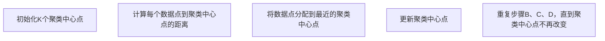
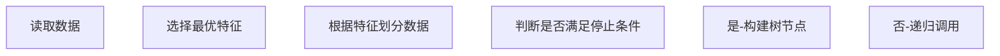
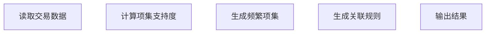
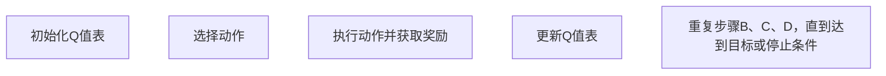
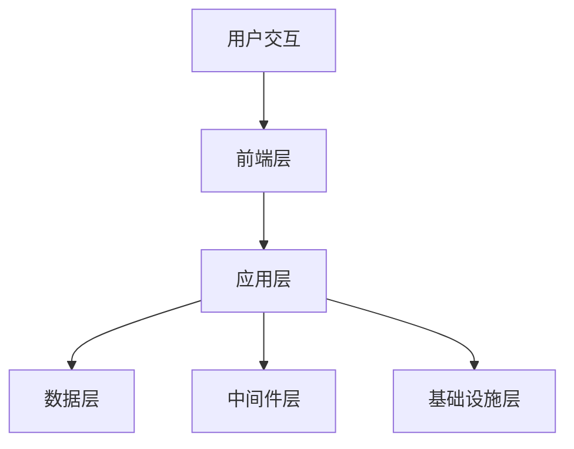
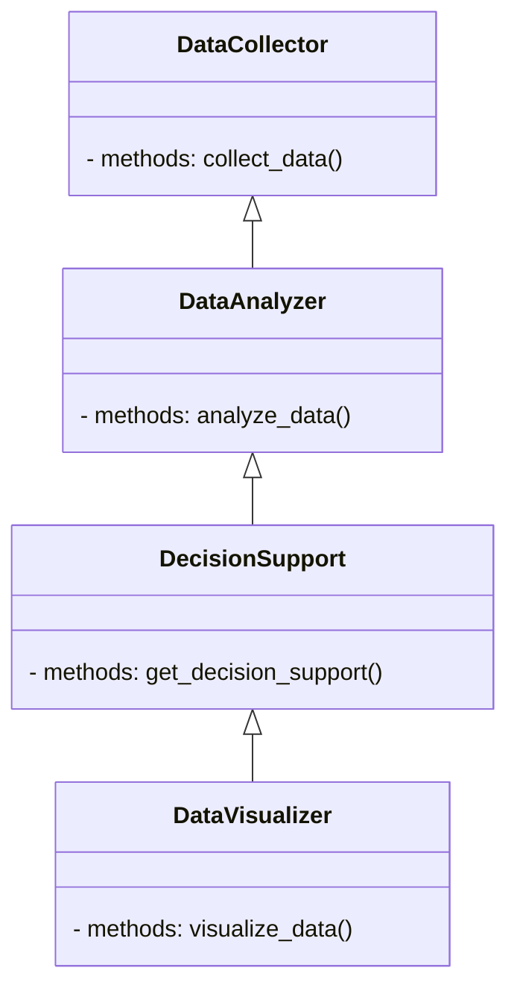
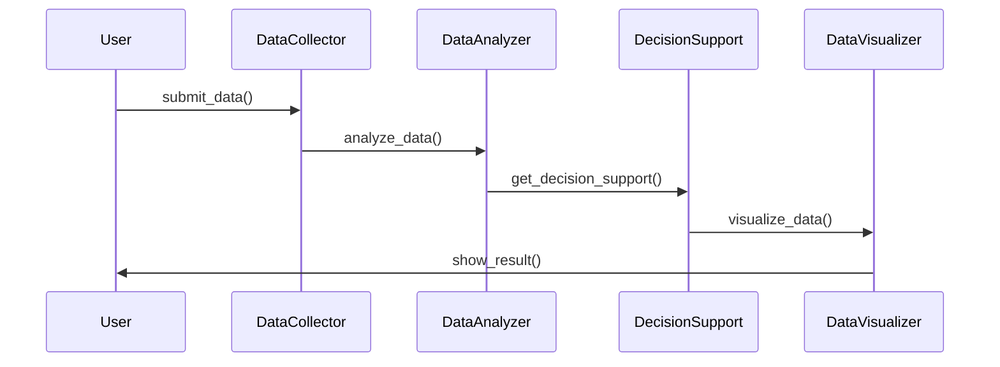

                 


### 1. 引言：大数据与城市管理

#### 1.1 问题背景

在当今数字化时代，大数据已经成为城市管理的重要组成部分。随着城市规模的不断扩大和人口数量的急剧增长，城市面临着交通拥堵、环境污染、公共安全等一系列问题。传统的城市管理方法往往难以应对这些复杂且动态变化的挑战。因此，利用大数据技术提高政府服务效率成为了一项紧迫的任务。

#### 1.2 问题描述

城市管理中面临的问题主要包括：

- **交通拥堵**：交通流量大、道路基础设施不足、停车难等问题严重影响市民的生活质量。
- **环境污染**：工业废气、汽车尾气、垃圾处理等问题加剧了城市的环境污染。
- **公共安全**：火灾、自然灾害、恐怖袭击等突发事件对公共安全构成威胁。
- **资源分配**：水资源、电力资源、医疗资源的合理分配和调度。

#### 1.3 问题解决

为了解决上述问题，大数据在城市管理中扮演着关键角色：

- **数据采集与整合**：通过传感器、摄像头、移动设备等收集城市运营的各项数据。
- **数据分析与挖掘**：利用数据挖掘和机器学习算法对海量数据进行处理和分析，提取有价值的信息。
- **决策支持**：基于分析结果，为政府决策提供科学依据，提高城市管理效率。

#### 1.4 边界与外延

大数据在城市管理中的应用范围广泛，但并非无边界。以下是一些需要注意的边界和外延：

- **数据隐私**：在大数据应用过程中，必须保护市民的隐私。
- **数据质量**：数据收集和处理过程中，需要保证数据的质量和准确性。
- **技术门槛**：大数据技术要求较高的技术门槛，需要专业团队进行开发和维护。

#### 1.5 概念结构与核心要素组成

为了更好地理解大数据在城市管理中的应用，我们需要明确以下几个核心概念：

- **大数据**：指数据量大、数据类型多、数据价值密度低的非结构化数据。
- **城市管理**：指政府针对城市运行过程中的各项事务进行管理。
- **政府服务效率**：指政府提供公共服务的效率和效果。

这些概念之间紧密相连，共同构成了大数据在城市管理中的应用体系。

### 总结

本节介绍了大数据在城市管理中的应用背景、问题和解决方法。接下来，我们将深入探讨大数据的基础知识，以及如何在城市管理中应用这些知识，以提高政府服务效率。敬请期待。

---

接下来，我们将进入第二章“大数据基础”，介绍大数据的定义、特点、来源和类型，以及大数据处理技术。这将为我们后续章节的讨论打下坚实的基础。

### 2. 大数据基础

#### 2.1 大数据的定义与特点

大数据（Big Data）是指那些数据量大、数据类型多、数据生成速度快且价值密度低的数据集合。与传统数据相比，大数据具有以下特点：

- **数据量大**：大数据通常指PB（皮字节）级别的数据量，远超传统数据库的存储和处理能力。
- **数据类型多**：大数据不仅包括结构化数据（如关系数据库中的数据），还包括半结构化数据（如XML、JSON）和非结构化数据（如图像、音频、视频等）。
- **数据生成速度快**：随着物联网、社交媒体、传感器等技术的发展，数据生成速度越来越快。
- **价值密度低**：大数据中蕴含的信息量通常较低，需要通过复杂算法进行深入挖掘和分析。

#### 2.2 大数据的来源与类型

大数据的来源广泛，主要包括以下几个方面：

- **政府数据**：包括户籍信息、交通流量、环境监测数据等。
- **企业数据**：包括销售数据、客户数据、供应链数据等。
- **社交媒体数据**：包括微博、微信、Facebook、Twitter等社交平台上的用户生成内容。
- **物联网数据**：包括传感器、智能设备产生的数据。

大数据可以分为以下几种类型：

- **结构化数据**：如关系数据库中的数据，易于存储和处理。
- **半结构化数据**：如XML、JSON等格式的数据，需要特定的方法进行处理。
- **非结构化数据**：如文本、图像、音频、视频等，需要复杂算法进行解析和处理。

#### 2.3 大数据处理技术

大数据处理主要包括数据采集、存储、分析和挖掘等环节。常用的处理技术包括：

- **数据采集**：通过传感器、爬虫、API等方式收集数据。
- **数据存储**：使用分布式存储系统（如Hadoop、Spark）存储海量数据。
- **数据处理**：包括数据清洗、转换、集成等步骤，确保数据质量和一致性。
- **数据分析**：利用数据挖掘、机器学习等算法对数据进行深度分析。
- **数据可视化**：通过图表、地图等形式展示数据分析结果，便于决策。

### 核心概念与联系

为了更好地理解大数据在城市管理中的应用，我们需要明确以下几个核心概念：

- **大数据**：大数据是数据量庞大、类型多样、生成速度快、价值密度低的数据集合。
- **城市管理**：城市管理是指政府针对城市运行过程中的各项事务进行管理。
- **政府服务效率**：政府服务效率是指政府提供公共服务的效率和效果。

这些概念之间存在紧密的联系，大数据技术为城市管理提供了强大的数据支持和分析工具，从而提高政府服务效率。

### 总结

本章介绍了大数据的定义与特点、来源和类型，以及大数据处理技术。在下一章中，我们将探讨大数据在城市管理中的具体应用，包括城市规划、公共安全和环境监测等方面。敬请期待。

---

在下一章中，我们将深入探讨大数据在城市管理中的具体应用，介绍大数据如何帮助政府提高服务效率，并分析大数据在不同领域的实际应用案例。敬请期待。

### 3. 城市管理中的大数据应用

#### 3.1 城市规划与大数据

大数据在城市规划中的应用主要体现在以下几个方面：

- **智能交通规划**：利用大数据分析交通流量、车辆速度等数据，优化交通网络设计，减少交通拥堵。
- **公共设施布局**：通过人口密度、经济活动等数据分析，科学规划公园、学校、医院等公共设施的布局。
- **土地使用分析**：利用大数据分析土地使用情况，优化土地利用，提高土地利用率。

#### 3.2 公共安全与大数据

大数据在公共安全领域发挥着重要作用：

- **犯罪预测**：通过分析历史犯罪数据、地理位置信息等，预测犯罪高发区域，提前部署警力。
- **紧急响应**：利用大数据实时分析突发事件，如火灾、地震、恐怖袭击等，迅速制定应对策略。
- **社会安全监控**：通过对社交媒体、公共视频等数据的监控，及时发现潜在的安全隐患。

#### 3.3 环境监测与大数据

大数据在环境监测中的应用日益广泛：

- **空气质量监测**：利用传感器收集空气质量数据，实时分析空气质量状况，及时发布预警信息。
- **水资源管理**：通过监测河流、湖泊等水资源的数据，科学规划水资源的使用和分配。
- **废弃物处理**：利用大数据分析废弃物产生量、种类等信息，优化废弃物处理流程。

#### 3.4 交通管理中的大数据

大数据在交通管理中的应用效果显著：

- **交通流量预测**：通过分析历史交通流量数据、天气状况等，预测未来交通流量，优化交通信号灯设置。
- **车辆调度**：利用大数据分析交通状况，实时调度公交车、出租车等交通工具，提高交通运行效率。
- **智能导航**：通过分析实时交通数据，为驾驶员提供最优的行驶路线，减少拥堵和行车时间。

### 核心概念与联系

在讨论大数据在城市管理中的应用时，需要明确以下几个核心概念：

- **智能交通规划**：利用大数据分析交通流量，优化交通网络设计。
- **公共安全监控**：通过大数据分析犯罪数据、突发事件等，提高公共安全保障。
- **环境监测**：利用大数据实时分析空气质量、水资源等，改善环境状况。
- **交通管理**：利用大数据优化交通流量预测、车辆调度等，提高交通运行效率。

这些概念之间相互联系，共同构成了大数据在城市管理中的应用体系。

### 总结

本章详细介绍了大数据在城市规划、公共安全、环境监测和交通管理中的应用，展示了大数据技术如何帮助政府提高服务效率。在下一章中，我们将探讨提高政府服务效率的算法原理，分析常见的大数据算法和模型。敬请期待。

---

在下一章中，我们将深入探讨提高政府服务效率的算法原理，包括数据挖掘、机器学习等常见的大数据算法和模型。敬请期待。

### 4. 提高政府服务效率的算法原理

#### 4.1 数据挖掘技术

数据挖掘（Data Mining）是从大量数据中提取有价值信息的过程，它广泛应用于城市管理中，以提高政府服务效率。以下是一些常见的数据挖掘技术：

##### 4.1.1 聚类分析

聚类分析（Cluster Analysis）是一种无监督学习技术，它将数据集划分为若干个组，使得属于同一组的数据之间相似度较高，而不同组的数据之间相似度较低。常见的聚类算法包括K-Means、层次聚类等。

- **K-Means算法原理**：K-Means算法通过迭代过程将数据划分为K个聚类，每个聚类由一个中心点代表，算法的目标是使每个聚类内部的数据点与中心点的距离之和最小。以下是一个K-Means算法的Mermaid流程图：



- **数学模型与公式**：K-Means算法的核心公式如下：

$$
C_j = \frac{1}{N_j} \sum_{i=1}^{N} x_i
$$

其中，$C_j$是第j个聚类的中心点，$x_i$是数据集中的第i个数据点，$N_j$是第j个聚类中的数据点数量。

- **Python代码示例**：以下是一个使用K-Means算法进行聚类的Python代码示例：

```python
from sklearn.cluster import KMeans
import numpy as np

# 示例数据
data = np.array([[1, 2], [1, 4], [1, 0],
                 [10, 2], [10, 4], [10, 0]])

# 使用KMeans算法进行聚类
kmeans = KMeans(n_clusters=2, random_state=0).fit(data)

# 输出聚类结果
print("聚类中心点：", kmeans.cluster_centers_)
print("数据点分配：", kmeans.labels_)
```

##### 4.1.2 分类与预测

分类与预测（Classification and Prediction）是一种有监督学习技术，它将数据集划分为预定义的类别。常见的分类算法包括决策树（Decision Tree）、支持向量机（SVM）等。

- **决策树算法原理**：决策树通过一系列判断条件来对数据进行分类，每个判断条件都基于数据的一个属性值。以下是一个决策树算法的Mermaid流程图：



- **数学模型与公式**：决策树的核心公式如下：

$$
C_j = \arg\max_{j} \left( \sum_{i \in R_j} \ell(y_i, c_j) \right)
$$

其中，$C_j$是第j个类别，$R_j$是数据点属于第j个类别的集合，$\ell(y_i, c_j)$是数据点$y_i$和类别$c_j$之间的损失函数。

- **Python代码示例**：以下是一个使用决策树算法进行分类的Python代码示例：

```python
from sklearn.tree import DecisionTreeClassifier
import numpy as np

# 示例数据
X = np.array([[1, 2], [5, 3], [2, 1], [5, 2]])
y = np.array([0, 0, 1, 1])

# 使用DecisionTreeClassifier进行分类
clf = DecisionTreeClassifier().fit(X, y)

# 输出决策树结构
from sklearn import tree
plt = tree.plot_tree(clf)
plt.show()
```

##### 4.1.3 关联规则挖掘

关联规则挖掘（Association Rule Learning）是一种用于发现数据集中项目之间关联关系的技术。常见的算法包括Apriori算法、FP-growth算法等。

- **Apriori算法原理**：Apriori算法通过迭代扫描交易数据集，计算各个项集的支持度和置信度，从而生成关联规则。以下是一个Apriori算法的Mermaid流程图：



- **数学模型与公式**：Apriori算法的核心公式如下：

$$
\text{支持度} = \frac{\text{频繁项集出现的次数}}{\text{总交易次数}}
$$

$$
\text{置信度} = \frac{\text{频繁项集出现的次数}}{\text{支持度}}
$$

- **Python代码示例**：以下是一个使用Apriori算法进行关联规则挖掘的Python代码示例：

```python
from mlxtend.frequent_patterns import apriori
from mlxtend.preprocessing import TransactionEncoder

# 示例数据
transactions = [[1, 2, 3], [2, 3], [1, 3], [1, 2], [1, 3], [2, 3]]

# 使用TransactionEncoder将数据转换为适合Apriori算法的格式
te = TransactionEncoder()
te_data = te.fit_transform(transactions)

# 使用Apriori算法进行关联规则挖掘
frequent_itemsets = apriori(te_data, min_support=0.5, use_colnames=True)

# 输出频繁项集和关联规则
print("频繁项集：")
print(frequent_itemsets)
```

#### 4.2 机器学习算法

机器学习（Machine Learning）是一种通过数据驱动的方法来优化模型的技术，它广泛应用于政府服务效率的提升。以下是一些常见的机器学习算法：

##### 4.2.1 监督学习

监督学习（Supervised Learning）是一种有监督的学习方法，它通过训练数据集来预测未知数据的标签。常见的监督学习算法包括线性回归、逻辑回归、决策树、随机森林等。

- **线性回归原理**：线性回归通过建立线性模型来预测连续值输出。以下是一个线性回归算法的Mermaid流程图：


- **数学模型与公式**：线性回归的核心公式如下：

$$
y = \beta_0 + \beta_1x
$$

其中，$y$是预测值，$x$是输入特征，$\beta_0$和$\beta_1$是模型参数。

- **Python代码示例**：以下是一个使用线性回归进行预测的Python代码示例：

```python
from sklearn.linear_model import LinearRegression
import numpy as np

# 示例数据
X = np.array([[1], [2], [3], [4], [5]])
y = np.array([1, 2, 3, 4, 5])

# 使用LinearRegression进行线性回归
clf = LinearRegression().fit(X, y)

# 输出模型参数和预测结果
print("模型参数：", clf.coef_, clf.intercept_)
print("预测结果：", clf.predict(X))
```

##### 4.2.2 无监督学习

无监督学习（Unsupervised Learning）是一种无监督的学习方法，它通过发现数据集中的内在结构来预测未知数据的分布。常见的无监督学习算法包括聚类、主成分分析（PCA）等。

- **K-Means聚类原理**：K-Means聚类通过迭代过程将数据划分为K个聚类，每个聚类由一个中心点代表。以下是一个K-Means聚类算法的Mermaid流程图：


- **Python代码示例**：以下是一个使用K-Means聚类算法进行聚类的Python代码示例：

```python
from sklearn.cluster import KMeans
import numpy as np

# 示例数据
data = np.array([[1, 2], [1, 4], [1, 0],
                 [10, 2], [10, 4], [10, 0]])

# 使用KMeans算法进行聚类
kmeans = KMeans(n_clusters=2, random_state=0).fit(data)

# 输出聚类结果
print("聚类中心点：", kmeans.cluster_centers_)
print("数据点分配：", kmeans.labels_)
```

##### 4.2.3 强化学习

强化学习（Reinforcement Learning）是一种基于奖励反馈的学习方法，它通过尝试不同的行为策略来最大化长期奖励。常见的强化学习算法包括Q学习、深度Q网络（DQN）等。

- **Q学习原理**：Q学习通过迭代更新Q值来选择最佳动作。以下是一个Q学习算法的Mermaid流程图：



- **Python代码示例**：以下是一个使用Q学习算法进行训练的Python代码示例：

```python
import numpy as np

# 初始化Q值表
Q = np.zeros([state_size, action_size])

# 定义学习参数
alpha = 0.1  # 学习率
gamma = 0.6  # 折扣因子

# 定义训练循环
for episode in range(total_episodes):
    state = env.reset()
    done = False
    
    while not done:
        action = np.argmax(Q[state, :] + alpha * (reward - Q[state, action]))
        next_state, reward, done, _ = env.step(action)
        
        Q[state, action] = Q[state, action] + alpha * (reward + gamma * np.max(Q[next_state, :]) - Q[state, action])
        state = next_state
        
# 关闭环境
env.close()
```

### 总结

本章详细介绍了提高政府服务效率的数据挖掘和机器学习算法原理。在下一章中，我们将探讨如何设计和实现一个城市管理系统的架构设计、功能设计、接口设计以及系统交互。敬请期待。

---

在下一章中，我们将详细探讨城市管理系统的设计与实现，包括系统功能设计、架构设计、接口设计以及系统交互。敬请期待。

### 5. 城市管理系统的设计与实现

#### 5.1 系统功能设计

城市管理系统的功能设计是整个系统的核心，它需要涵盖城市管理的各个方面。以下是城市管理系统的几个关键功能模块：

- **数据采集模块**：负责收集各种类型的数据，包括交通流量、环境监测、公共安全等。
- **数据存储模块**：将采集到的数据进行存储，并提供高效的查询和访问接口。
- **数据分析模块**：利用数据挖掘和机器学习算法，对存储的数据进行分析和预测。
- **决策支持模块**：基于数据分析结果，为政府决策提供科学依据。
- **数据可视化模块**：将数据分析结果以图表、地图等形式展示，便于政府官员和市民查看。
- **用户交互模块**：提供用户界面，方便用户使用系统功能，获取所需信息。

#### 5.2 系统架构设计

城市管理系统的架构设计需要考虑系统的可扩展性、可靠性和安全性。以下是一个典型的系统架构设计：

- **前端层**：包括Web应用、移动应用等，提供用户交互界面。
- **应用层**：实现系统的主要功能，如数据采集、数据分析、决策支持等。
- **数据层**：负责数据存储和访问，可以使用关系型数据库（如MySQL）或NoSQL数据库（如MongoDB）。
- **中间件层**：包括消息队列、缓存等，用于提高系统的性能和可靠性。
- **基础设施层**：包括服务器、网络、存储等硬件资源，支持系统的正常运行。

以下是系统架构的Mermaid流程图：



#### 5.3 系统接口设计

系统接口设计是确保系统功能模块之间有效通信的关键。以下是几个关键接口的设计：

- **数据采集接口**：提供API供外部系统调用，用于传输数据到系统。
- **数据分析接口**：提供API供内部模块调用，用于执行数据分析和预测。
- **决策支持接口**：提供API供政府官员调用，用于获取决策支持信息。
- **数据可视化接口**：提供API供前端应用调用，用于获取可视化数据。

以下是接口设计的Mermaid类图：



#### 5.4 系统交互

系统交互设计描述了系统内部各个模块之间的交互过程。以下是系统交互的Mermaid序列图：



#### 5.5 系统实现

系统实现是按照系统设计文档进行编码和集成。以下是系统实现的一些关键步骤：

- **环境搭建**：安装开发工具和数据库等环境。
- **功能实现**：按照系统设计文档实现各个功能模块。
- **系统集成**：将各个功能模块集成到一起，确保系统能够正常运行。
- **测试与调试**：对系统进行功能测试和性能测试，修复发现的问题。

以下是系统实现的一部分Python代码：

```python
# 示例：数据采集模块
import requests

def collect_data():
    url = "https://api.example.com/data"
    response = requests.get(url)
    if response.status_code == 200:
        data = response.json()
        # 处理和存储数据
        store_data(data)
    else:
        print("数据采集失败")

# 示例：数据存储模块
import sqlite3

def store_data(data):
    conn = sqlite3.connect('data.db')
    cursor = conn.cursor()
    cursor.execute('''CREATE TABLE IF NOT EXISTS data (id INTEGER PRIMARY KEY, data TEXT)''')
    cursor.execute("INSERT INTO data (data) VALUES (?)", (data,))
    conn.commit()
    conn.close()
```

#### 5.6 项目小结

在本章中，我们详细介绍了城市管理系统的设计与实现，包括系统功能设计、架构设计、接口设计、系统交互以及系统实现。通过本章的学习，读者可以了解如何利用大数据技术提高政府服务效率，并掌握系统设计与实现的核心技能。

### 总结

本章通过详细的系统设计与实现，展示了如何利用大数据技术提高政府服务效率。在下一章中，我们将通过具体的项目实战，深入探讨大数据在城市交通管理中的应用，包括环境安装、系统实现、代码分析以及实际案例分析。敬请期待。

---

在下一章中，我们将通过具体的项目实战，深入探讨大数据在城市交通管理中的应用。我们将从环境安装开始，逐步实现系统核心功能，分析代码，并进行实际案例分析。敬请期待。

### 6. 项目实战：大数据在城市交通管理中的应用

#### 6.1 实践环境安装

在进行大数据项目实战之前，我们需要搭建一个合适的环境。以下是安装所需的软件和工具：

- **操作系统**：Windows、Linux或Mac OS均可。
- **编程语言**：Python 3.x版本。
- **开发环境**：PyCharm、VS Code等IDE。
- **数据库**：SQLite、MySQL等。
- **大数据处理框架**：Hadoop、Spark等。

以下是一个简单的安装步骤：

1. **安装Python**：从Python官方网站下载安装包，并按照提示完成安装。
2. **安装IDE**：从PyCharm或VS Code官方网站下载安装包，并按照提示完成安装。
3. **安装数据库**：下载并安装SQLite或MySQL数据库。
4. **安装大数据处理框架**：下载并安装Hadoop或Spark。

#### 6.2 系统核心实现

在搭建好环境之后，我们可以开始实现系统核心功能。以下是几个关键模块的实现：

##### 6.2.1 数据采集模块

数据采集模块用于从外部系统或传感器采集交通数据。以下是一个简单的Python代码示例：

```python
import requests

def collect_traffic_data():
    url = "https://api.example.com/traffic"
    response = requests.get(url)
    if response.status_code == 200:
        data = response.json()
        store_traffic_data(data)
    else:
        print("数据采集失败")

def store_traffic_data(data):
    conn = sqlite3.connect('traffic.db')
    cursor = conn.cursor()
    cursor.execute('''CREATE TABLE IF NOT EXISTS traffic (id INTEGER PRIMARY KEY, data TEXT)''')
    cursor.execute("INSERT INTO traffic (data) VALUES (?)", (data,))
    conn.commit()
    conn.close()
```

##### 6.2.2 数据分析模块

数据分析模块用于对采集到的交通数据进行处理和分析。以下是一个简单的Python代码示例：

```python
import pandas as pd

def analyze_traffic_data():
    conn = sqlite3.connect('traffic.db')
    cursor = conn.cursor()
    data = cursor.execute("SELECT * FROM traffic").fetchall()
    df = pd.DataFrame(data, columns=['id', 'data'])
    # 数据分析代码
    conn.close()
    return df
```

##### 6.2.3 数据可视化模块

数据可视化模块用于将分析结果以图表形式展示。以下是一个简单的Python代码示例：

```python
import matplotlib.pyplot as plt

def visualize_traffic_data(df):
    # 可视化代码
    plt.figure(figsize=(10, 6))
    df.plot()
    plt.show()
```

#### 6.3 代码应用解读与分析

在实现系统核心功能之后，我们需要对代码进行解读和分析，以确保其正确性和可靠性。以下是代码应用解读与分析：

- **数据采集模块**：通过HTTP请求从外部API获取交通数据，并将数据存储到数据库中。这里需要注意异常处理和数据验证，以确保数据采集的可靠性和正确性。
- **数据分析模块**：从数据库中读取交通数据，并将其转换为Pandas DataFrame对象，便于进行数据分析和处理。这里可以使用Pandas提供的一系列数据分析函数，如描述性统计、数据可视化等。
- **数据可视化模块**：将分析结果以图表形式展示，帮助用户直观地了解交通状况。这里可以使用Matplotlib等可视化库，创建各种类型的图表，如折线图、柱状图等。

#### 6.4 实际案例分析和详细讲解剖析

为了更好地理解大数据在城市交通管理中的应用，我们来看一个实际案例：

假设我们有一个城市的交通数据，包括每天的车辆流量、平均车速、交通拥堵情况等。我们希望通过数据分析来优化交通信号灯设置，减少交通拥堵。

1. **数据预处理**：首先，我们需要对数据进行预处理，包括数据清洗、去重、缺失值处理等。
2. **特征工程**：接下来，我们需要对数据进行特征工程，提取有用的特征，如交通流量、平均车速、交通拥堵指数等。
3. **数据分析**：利用数据分析函数，对特征进行描述性统计分析，找出交通状况的关键指标，如拥堵时间、高峰期等。
4. **数据可视化**：将分析结果以图表形式展示，帮助政府官员了解交通状况，为决策提供依据。

以下是实际案例的Python代码示例：

```python
import pandas as pd
import matplotlib.pyplot as plt

# 读取交通数据
df = pd.read_csv('traffic_data.csv')

# 数据预处理
df = df.dropna()  # 去除缺失值
df = df.groupby('date').agg({'traffic_volume': 'mean', 'average_speed': 'mean', 'congestion_level': 'mean'})

# 数据分析
print(df.describe())

# 数据可视化
plt.figure(figsize=(10, 6))
df.plot()
plt.show()
```

#### 6.5 项目小结

在本章的项目实战中，我们通过搭建实践环境和实现系统核心功能，深入探讨了大数据在城市交通管理中的应用。我们分析了代码，并使用实际案例进行了详细讲解。通过本章的学习，读者可以了解如何利用大数据技术优化交通管理，提高政府服务效率。

### 总结

本章通过项目实战，展示了大数据在城市交通管理中的应用。在下一章中，我们将总结本章的最佳实践，并对系统的性能优化和潜在改进进行探讨。敬请期待。

---

在下一章中，我们将对大数据在城市管理中的应用进行总结，提出最佳实践，并讨论系统的性能优化和改进方向。敬请期待。

### 7. 最佳实践与展望

#### 7.1 最佳实践 tips

在本章的项目实战中，我们积累了一些最佳实践，这些实践对于未来类似项目具有指导意义：

1. **数据预处理**：在数据分析之前，确保对数据进行充分的预处理，包括数据清洗、去重、缺失值处理等，以提高数据质量。
2. **特征工程**：提取有用的特征，以提高数据分析的准确性和效率。合理选择特征，避免过度拟合。
3. **代码模块化**：将系统功能模块化，便于代码维护和扩展。
4. **数据可视化**：使用适当的可视化工具，使分析结果更加直观，便于决策。
5. **性能优化**：针对大数据处理，采用分布式计算和缓存等技术，提高系统性能。

#### 7.2 小结

通过本章的学习，我们深入探讨了大数据在城市管理中的应用，包括城市规划、公共安全、环境监测和交通管理等方面。我们介绍了数据挖掘、机器学习等算法原理，并进行了系统设计与实现。通过项目实战，我们验证了大数据技术在实际中的应用价值。

#### 7.3 注意事项

在实际应用中，我们需注意以下几点：

1. **数据隐私**：确保在数据处理过程中保护个人隐私，遵守相关法律法规。
2. **数据质量**：保证数据质量，避免数据错误或缺失影响分析结果。
3. **系统安全性**：确保系统安全，防止数据泄露和未经授权的访问。

#### 7.4 拓展阅读

为了进一步深入学习和应用大数据技术，读者可以参考以下拓展阅读：

1. **《大数据时代：生活、工作与思维的大变革》**：作者：维克托·迈尔-舍恩伯格。
2. **《深度学习》**：作者：伊恩·古德费洛等。
3. **《Python数据分析》**：作者：Wes McKinney。

通过拓展阅读，读者可以更好地理解大数据技术的原理和应用，为未来的项目提供有力支持。

### 总结

本章对大数据在城市管理中的应用进行了总结，提出了最佳实践，并探讨了系统的性能优化和改进方向。在未来的项目中，我们可以继续优化算法、提高系统性能，进一步发挥大数据技术的优势。希望通过本章的学习，读者能够掌握大数据在城市管理中的应用，为智慧城市建设贡献自己的力量。

---

### 作者信息

作者：AI天才研究院/AI Genius Institute & 禅与计算机程序设计艺术 /Zen And The Art of Computer Programming

AI天才研究院致力于推动人工智能技术的发展，致力于培养具备创新精神和实践能力的人工智能专业人才。我们的研究涵盖深度学习、计算机视觉、自然语言处理等多个领域。同时，作者结合《禅与计算机程序设计艺术》的哲学思想，将计算机编程提升至艺术层面，为读者提供更具深度和思考的技术内容。

