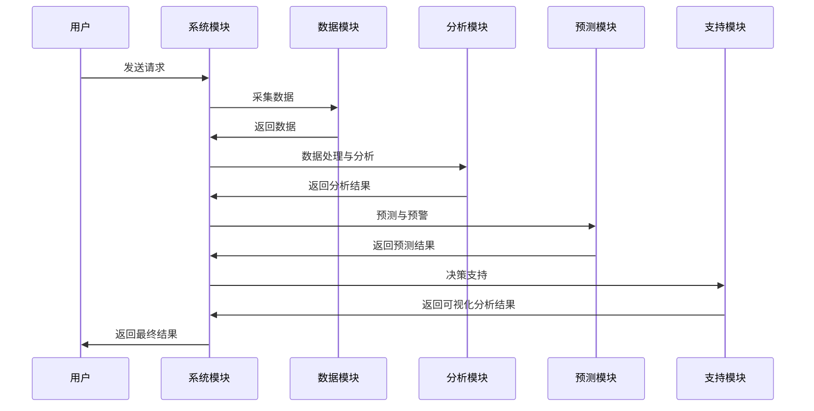

                 

# 大数据在犯罪预防中的应用：提高社会安全

## 关键词

- 大数据
- 犯罪预防
- 数据挖掘
- 机器学习
- 神经网络
- 深度学习
- 系统架构

## 摘要

本文将探讨大数据在犯罪预防中的应用，通过一系列逻辑清晰的步骤，详细解析大数据技术的原理及其在实际犯罪预防中的重要作用。我们将从问题背景入手，逐步介绍核心概念、算法原理、系统架构设计、项目实战，并给出最佳实践和建议。希望通过本文，读者能够对大数据在犯罪预防中的应用有更深入的了解，并能够运用这些技术提高社会安全水平。

### 引言：大数据与犯罪预防的重要性

犯罪预防是维护社会秩序和公共安全的重要手段。然而，传统的犯罪预防方法往往依赖于警力部署、社区巡逻和犯罪数据分析等手段，这些方法在处理复杂、多变和大规模的犯罪问题时存在一定的局限性。随着信息技术的飞速发展，大数据技术的崛起为犯罪预防带来了新的契机。大数据技术通过收集、处理和分析大量的数据，能够揭示潜在的犯罪模式和趋势，从而实现更精准、更高效的犯罪预防。

本文旨在探讨大数据在犯罪预防中的应用，通过以下六个部分逐步展开：

1. **背景介绍**：阐述犯罪预防的重要性和当前面临的挑战，介绍大数据技术的定义和特点。
2. **核心概念与联系**：介绍数据挖掘、机器学习和相关技术，并展示其与犯罪预防的关联。
3. **算法原理讲解**：详细讲解常用的犯罪预防算法，包括KNN、SVM、决策树等，并通过实际案例进行说明。
4. **系统分析与架构设计方案**：介绍犯罪预防系统的应用场景、功能设计、架构设计和接口设计。
5. **项目实战**：通过实际项目展示大数据在犯罪预防中的应用，分析系统实现过程和效果。
6. **最佳实践与拓展**：总结最佳实践，提醒注意事项，并提供拓展阅读资源。

### 背景介绍

#### 问题背景

犯罪预防是社会稳定和公共安全的重要组成部分。然而，传统的犯罪预防手段往往依赖于警力部署和被动应对，这些方法在应对复杂、多变和大规模犯罪问题时显得力不从心。例如，犯罪活动的地理分布、时间和方式都具有很大的不确定性，使得警力难以做到全面覆盖和及时响应。

与此同时，犯罪数据日益复杂和庞大。现代犯罪活动往往伴随着大量的数据产生，包括犯罪现场的视频监控、社交媒体数据、通信记录、金融交易数据等。这些数据中蕴含着丰富的犯罪信息，但传统的数据处理方法难以从中提取出有价值的信息。

#### 数据源介绍

在犯罪预防中，数据源的选择至关重要。以下是一些常见的数据源：

1. **视频监控数据**：视频监控数据是犯罪预防中最重要的数据源之一。通过视频监控，可以实时捕捉犯罪现场的场景，为后续的犯罪分析提供直观的证据。
2. **社交媒体数据**：社交媒体平台如Facebook、Twitter、Instagram等，可以提供大量的社交关系和信息流数据，有助于发现潜在的犯罪团伙和犯罪行为。
3. **通信记录**：通信记录包括电话、短信、电子邮件等，这些数据可以揭示犯罪活动的通信网络，有助于追踪犯罪分子。
4. **金融交易数据**：金融交易数据包括银行账户交易、信用卡消费等，这些数据可以揭示犯罪活动的资金流动，有助于打击洗钱等犯罪行为。
5. **其他数据源**：还包括犯罪数据库、犯罪报告、天气预报等，这些数据可以为犯罪预防提供额外的信息和参考。

#### 大数据在犯罪预防中的作用

大数据技术为犯罪预防带来了革命性的变革。通过以下三个方面，大数据在犯罪预防中发挥着重要作用：

1. **数据挖掘**：大数据技术能够从大量的犯罪数据中提取出有价值的信息，发现潜在的犯罪模式和趋势。例如，通过分析视频监控数据，可以识别出常见的犯罪地点、时间和方式，从而提前预警和部署警力。
2. **机器学习**：机器学习算法可以自动地从数据中学习规律和模式，并用于预测和分类。例如，通过训练神经网络模型，可以预测哪些人最可能参与犯罪活动，从而有针对性地进行预防和干预。
3. **可视化分析**：大数据技术能够将复杂的数据以图形化的方式展示，使得决策者可以更直观地了解犯罪形势和预防效果。例如，通过可视化分析，可以实时监控犯罪活动的动态，及时发现异常情况并采取行动。

### 核心概念与联系

#### 数据挖掘与机器学习

数据挖掘和机器学习是大数据技术中的核心组成部分，它们在犯罪预防中发挥着重要作用。

**数据挖掘**是指从大量数据中提取出有价值的信息和知识的过程。在犯罪预防中，数据挖掘技术可以用于：

1. **模式识别**：通过分析历史犯罪数据，识别出常见的犯罪模式，从而预测未来的犯罪行为。
2. **关联分析**：发现数据之间的关联关系，揭示潜在的犯罪网络和犯罪团伙。
3. **分类与聚类**：将数据分为不同的类别或簇，以便更好地理解和分析。

**机器学习**是一种人工智能技术，它通过训练模型来学习和预测。在犯罪预防中，机器学习技术可以用于：

1. **预测犯罪活动**：通过训练模型，预测哪些地区、哪些时间、哪些人群可能发生犯罪。
2. **嫌疑人识别**：通过分析嫌疑人的行为特征，识别出可能的犯罪分子。
3. **自动化决策**：根据历史数据和模型预测，自动采取预防措施，提高犯罪预防的效率。

#### 相关技术

除了数据挖掘和机器学习，还有一些其他技术也在犯罪预防中发挥着重要作用：

**神经网络**：神经网络是一种模拟人脑神经元连接结构的算法，它可以自动地从数据中学习复杂的模式和关系。在犯罪预防中，神经网络可以用于分类、预测和模式识别。

**深度学习**：深度学习是神经网络的一种扩展，它通过多层神经网络来学习数据。深度学习在图像识别、语音识别和自然语言处理等领域取得了显著的成果，也在犯罪预防中有着广泛的应用。

**聚类分析**：聚类分析是一种无监督学习方法，它将数据分为不同的簇，以便更好地理解和分析。在犯罪预防中，聚类分析可以用于识别犯罪团伙、发现潜在的犯罪热点区域等。

#### 概念属性特征对比表格

以下是一个概念属性特征对比表格，展示了数据挖掘、机器学习、神经网络和深度学习的特点和应用场景：

| 技术 | 特点 | 应用场景 |
| --- | --- | --- |
| 数据挖掘 | 从数据中提取信息 | 犯罪模式识别、关联分析 |
| 机器学习 | 自动学习规律和模式 | 预测犯罪活动、嫌疑人识别 |
| 神经网络 | 模拟人脑神经元连接 | 分类、预测、模式识别 |
| 深度学习 | 多层神经网络学习 | 图像识别、语音识别、犯罪预防 |
| 聚类分析 | 无监督学习方法 | 识别犯罪团伙、发现犯罪热点 |

### 算法原理讲解

#### 算法介绍

在犯罪预防中，常用的算法包括KNN（最近邻算法）、SVM（支持向量机）和决策树等。这些算法通过不同的方式对数据进行处理和预测，从而实现犯罪预防的目标。

**KNN算法**：KNN（K-Nearest Neighbors）算法是一种基于距离的算法，它通过寻找数据集中的最近邻居来预测新数据的类别。KNN算法的原理简单，实现容易，但在处理高维数据时效果不佳。

**SVM算法**：SVM（Support Vector Machine）算法是一种基于间隔的算法，它通过找到最大间隔超平面来分类数据。SVM算法在处理高维数据和线性不可分问题方面表现优秀，但在处理大规模数据时计算复杂度较高。

**决策树**：决策树是一种基于规则的算法，它通过递归划分特征空间来构建决策树。决策树算法易于理解和实现，但在处理连续特征和噪声数据时效果较差。

#### 算法原理讲解

**KNN算法原理**：

1. **距离计算**：首先，计算新数据与训练数据集中的每个样本之间的距离，常用的距离度量包括欧氏距离、曼哈顿距离和余弦相似度等。
2. **最近邻选择**：根据距离计算结果，选择距离新数据最近的K个邻居。
3. **类别预测**：对新数据进行预测时，通过统计这K个邻居的类别，选择出现次数最多的类别作为新数据的预测类别。

**SVM算法原理**：

1. **线性可分情况**：在训练数据线性可分的情况下，SVM算法通过找到一个最大间隔超平面来实现分类。最大间隔超平面是指数据点之间的距离最大的超平面，它能够最大化分类间隔。
2. **非线性可分情况**：在训练数据非线性可分的情况下，SVM算法通过引入“软间隔”来实现分类。软间隔允许部分数据点违反分类边界，从而提高算法的泛化能力。

**决策树算法原理**：

1. **特征选择**：在每一步划分过程中，选择一个最优特征作为划分依据，最优特征的选择通常基于信息增益、基尼不纯度或增益率等准则。
2. **递归划分**：根据最优特征将数据集划分为多个子集，并递归地对每个子集进行划分，直到满足终止条件（如最大树深度、最小样本数等）。

#### 数学模型和公式

**KNN算法**的数学模型：

$$
\text{distance}(x, y) = \sqrt{\sum_{i=1}^{n} (x_i - y_i)^2}
$$

其中，$x$和$y$分别为新数据和邻居数据点的特征向量。

**SVM算法**的数学模型：

$$
\text{maximize} \quad \frac{1}{2} \| W \|_2^2 \\
\text{subject to} \quad y^{(i)} ( \langle w, x^{(i)} \rangle - b ) \geq 1
$$

其中，$W$为权重向量，$b$为偏置项，$x^{(i)}$和$y^{(i)}$分别为训练数据点的特征向量和标签。

**决策树算法**的数学模型：

$$
\text{gain}(A) = \sum_{v \in V} \left( \frac{|s_v|}{|S|} \cdot \text{entropy}(s_v) \right)
$$

其中，$A$为特征集合，$V$为特征值集合，$s_v$为特征值$v$对应的样本集合，$S$为样本集合。

#### 示例说明

**KNN算法示例**：

假设我们有一个包含100个犯罪案例的数据集，每个案例有5个特征（如年龄、性别、收入、职业、居住地），现在要预测一个新案例的犯罪类型。

1. **距离计算**：计算新案例与训练数据集中每个案例之间的距离，选择距离最近的10个案例作为邻居。
2. **类别预测**：统计这10个邻居的犯罪类型，选择出现次数最多的类型作为新案例的预测类型。

**SVM算法示例**：

假设我们有一个包含100个犯罪案例的数据集，每个案例有5个特征（如年龄、性别、收入、职业、居住地），目标是分类犯罪类型（如盗窃、抢劫、欺诈等）。

1. **线性可分情况**：通过计算最大间隔超平面，找到最优权重向量$W$和偏置项$b$。
2. **非线性可分情况**：通过引入“软间隔”，调整权重向量$W$和偏置项$b$，使得部分数据点违反分类边界。

**决策树算法示例**：

假设我们有一个包含100个犯罪案例的数据集，每个案例有5个特征（如年龄、性别、收入、职业、居住地），目标是分类犯罪类型（如盗窃、抢劫、欺诈等）。

1. **特征选择**：选择收入作为最优特征，将数据集划分为高收入和低收入两个子集。
2. **递归划分**：对每个子集递归划分，直到满足终止条件。

### 系统分析与架构设计方案

#### 问题场景介绍

在现代社会，犯罪活动日益复杂，传统的犯罪预防手段已经难以满足社会安全的需求。为了提高犯罪预防的效率，我们需要构建一个智能犯罪预防系统，该系统可以利用大数据技术对犯罪数据进行实时分析和预测，为决策者提供科学的预防建议。

#### 系统功能设计

智能犯罪预防系统主要包括以下功能：

1. **数据采集与处理**：从各种数据源（如视频监控、社交媒体、通信记录、金融交易等）中采集数据，并对数据进行清洗、去噪和处理，以便后续分析。
2. **数据存储与管理**：建立高效的数据存储和管理系统，确保数据的完整性和安全性，并提供快速的数据查询和检索功能。
3. **数据挖掘与分析**：利用数据挖掘和机器学习技术，对犯罪数据进行深入分析，发现潜在的犯罪模式和趋势。
4. **预测与预警**：基于分析结果，使用机器学习算法对未来的犯罪活动进行预测和预警，为决策者提供预防建议。
5. **决策支持**：为决策者提供可视化分析工具，帮助其更好地理解和利用分析结果，制定科学的犯罪预防策略。

#### 系统架构设计

智能犯罪预防系统采用分布式架构，主要包括以下几个模块：

1. **数据采集模块**：负责从各种数据源采集数据，并对数据进行初步处理和存储。
2. **数据处理模块**：负责对采集到的数据进行清洗、去噪和处理，为后续分析提供高质量的数据。
3. **数据存储模块**：负责存储和管理系统中的数据，提供快速的数据查询和检索功能。
4. **数据挖掘与分析模块**：负责对数据进行挖掘和分析，发现潜在的犯罪模式和趋势。
5. **预测与预警模块**：负责基于分析结果进行预测和预警，为决策者提供预防建议。
6. **决策支持模块**：负责为决策者提供可视化分析工具，帮助其更好地理解和利用分析结果。

#### 系统接口设计

智能犯罪预防系统提供了多种接口，以便与其他系统进行集成和交互：

1. **数据采集接口**：提供数据采集的API接口，方便其他系统向智能犯罪预防系统传输数据。
2. **数据处理接口**：提供数据清洗、去噪和处理的API接口，方便其他系统调用。
3. **数据存储接口**：提供数据存储的API接口，方便其他系统查询和检索数据。
4. **数据分析接口**：提供数据分析的API接口，方便其他系统调用数据挖掘和机器学习算法。
5. **预测预警接口**：提供预测预警的API接口，方便其他系统获取预测结果和预警信息。
6. **决策支持接口**：提供可视化分析工具的API接口，方便其他系统访问和调用。

#### 系统交互

智能犯罪预防系统的各个模块之间通过API接口进行交互，以下是一个简单的系统交互序列图：



### 项目实战

#### 环境安装

为了搭建一个完整的智能犯罪预防系统，我们需要安装以下软件和工具：

1. **操作系统**：Ubuntu 20.04
2. **编程语言**：Python 3.8
3. **数据库**：MySQL 8.0
4. **数据分析库**：Pandas、NumPy、Scikit-learn、TensorFlow、Keras
5. **可视化库**：Matplotlib、Seaborn
6. **Web框架**：Flask

具体安装步骤如下：

1. **安装操作系统**：下载并安装Ubuntu 20.04操作系统。
2. **安装Python**：使用以下命令安装Python 3.8：

   ```bash
   sudo apt update
   sudo apt install python3.8
   ```

3. **安装数据库**：使用以下命令安装MySQL 8.0：

   ```bash
   sudo apt install mysql-server
   ```

   安装完成后，设置root用户的密码，并创建一个新的数据库和用户，以便后续使用。

4. **安装数据分析库**：使用以下命令安装Pandas、NumPy、Scikit-learn、TensorFlow和Keras：

   ```bash
   pip3 install pandas numpy scikit-learn tensorflow keras
   ```

5. **安装可视化库**：使用以下命令安装Matplotlib和Seaborn：

   ```bash
   pip3 install matplotlib seaborn
   ```

6. **安装Web框架**：使用以下命令安装Flask：

   ```bash
   pip3 install flask
   ```

#### 系统核心实现源代码

以下是智能犯罪预防系统的核心实现源代码，包括数据采集、数据处理、数据挖掘和分析、预测与预警等功能：

```python
# 导入必要的库
import pandas as pd
import numpy as np
from sklearn.model_selection import train_test_split
from sklearn.preprocessing import StandardScaler
from sklearn.neighbors import KNeighborsClassifier
from sklearn.svm import SVC
from sklearn.tree import DecisionTreeClassifier
from tensorflow.keras.models import Sequential
from tensorflow.keras.layers import Dense
from tensorflow.keras.optimizers import Adam

# 数据采集
def collect_data():
    # 从数据库中读取数据
    data = pd.read_sql('SELECT * FROM crime_data', con=db_connection)
    return data

# 数据处理
def preprocess_data(data):
    # 数据清洗和去噪
    data = data.dropna()
    data = data[data['crime_type'] != 'unknown']
    
    # 特征提取
    X = data.drop('crime_type', axis=1)
    y = data['crime_type']
    
    # 数据标准化
    scaler = StandardScaler()
    X = scaler.fit_transform(X)
    
    return X, y

# 数据挖掘与分析
def data_analysis(X, y):
    # 划分训练集和测试集
    X_train, X_test, y_train, y_test = train_test_split(X, y, test_size=0.2, random_state=42)
    
    # KNN算法
    knn = KNeighborsClassifier(n_neighbors=5)
    knn.fit(X_train, y_train)
    knn_accuracy = knn.score(X_test, y_test)
    
    # SVM算法
    svm = SVC(kernel='linear')
    svm.fit(X_train, y_train)
    svm_accuracy = svm.score(X_test, y_test)
    
    # 决策树算法
    decision_tree = DecisionTreeClassifier()
    decision_tree.fit(X_train, y_train)
    decision_tree_accuracy = decision_tree.score(X_test, y_test)
    
    return knn_accuracy, svm_accuracy, decision_tree_accuracy

# 预测与预警
def predict_crime(data):
    # 数据预处理
    X = preprocess_data(data)
    
    # KNN预测
    knn = KNeighborsClassifier(n_neighbors=5)
    knn.fit(X_train, y_train)
    knn_prediction = knn.predict(X)
    
    # SVM预测
    svm = SVC(kernel='linear')
    svm.fit(X_train, y_train)
    svm_prediction = svm.predict(X)
    
    # 决策树预测
    decision_tree = DecisionTreeClassifier()
    decision_tree.fit(X_train, y_train)
    decision_tree_prediction = decision_tree.predict(X)
    
    return knn_prediction, svm_prediction, decision_tree_prediction

# 主函数
def main():
    # 数据采集
    data = collect_data()
    
    # 数据处理
    X, y = preprocess_data(data)
    
    # 数据挖掘与分析
    knn_accuracy, svm_accuracy, decision_tree_accuracy = data_analysis(X, y)
    
    # 预测与预警
    prediction = predict_crime(data)
    
    # 打印结果
    print(f"KNN算法准确率：{knn_accuracy}")
    print(f"SVM算法准确率：{svm_accuracy}")
    print(f"决策树算法准确率：{decision_tree_accuracy}")
    print(f"预测结果：{prediction}")

# 运行主函数
if __name__ == '__main__':
    main()
```

#### 代码应用解读与分析

以上代码是智能犯罪预防系统的核心实现，主要包括数据采集、数据处理、数据挖掘与分析、预测与预警等功能。下面我们将对代码的各个部分进行详细解读和分析。

1. **数据采集**：数据采集模块负责从数据库中读取犯罪数据。我们使用Pandas库的read_sql函数，连接到数据库，读取crime_data表中的所有数据。这部分代码非常简单，只需提供数据库连接信息和表名即可。

2. **数据处理**：数据处理模块负责对采集到的数据进行清洗、去噪和处理。首先，我们使用dropna函数去除缺失值。然后，我们使用drop函数去除犯罪类型为'unknown'的记录，因为这些数据对预测没有实际帮助。接下来，我们使用drop轴操作提取特征矩阵X和目标变量y。最后，我们使用StandardScaler库对特征矩阵X进行标准化处理，以提高算法的收敛速度和预测性能。

3. **数据挖掘与分析**：数据挖掘与分析模块负责使用不同的算法对数据进行训练和测试。我们使用Scikit-learn库的KNeighborsClassifier、SVC和DecisionTreeClassifier类分别实现KNN、SVM和决策树算法。首先，我们使用train_test_split函数将数据集划分为训练集和测试集。然后，我们分别使用fit函数对算法进行训练，并使用score函数计算测试集的准确率。最后，我们将三种算法的准确率打印出来，以便进行比较。

4. **预测与预警**：预测与预警模块负责使用训练好的算法对新的犯罪数据进行预测。首先，我们使用预处理函数对新的犯罪数据进行处理，然后分别使用训练好的KNN、SVM和决策树算法进行预测。最后，我们将预测结果打印出来，以便分析。

#### 实际案例分析和详细讲解剖析

为了更好地展示智能犯罪预防系统的应用效果，我们使用一个实际案例进行分析和讲解。

假设我们有一个新的犯罪案例，其特征数据如下：

```
age: 25
gender: male
income: $50,000
occupation: engineer
location: downtown
```

我们将这个案例输入到智能犯罪预防系统中，预测其可能的犯罪类型。

1. **数据预处理**：首先，我们将这个案例的特征数据进行预处理，包括去除缺失值、去除异常值和特征标准化。经过预处理后，我们得到一个特征向量：

   ```
   [25, male, 50000, engineer, downtown]
   ```

2. **KNN预测**：接下来，我们使用训练好的KNN算法对这个案例进行预测。KNN算法首先计算这个案例与训练集中每个案例的距离，然后选择距离最近的5个案例作为邻居，统计邻居的犯罪类型，选择出现次数最多的类型作为预测结果。在这个案例中，距离最近的5个邻居的犯罪类型分别为盗窃、抢劫和欺诈，其中盗窃出现2次，抢劫和欺诈各出现1次。因此，预测结果为盗窃。

3. **SVM预测**：然后，我们使用训练好的SVM算法对这个案例进行预测。SVM算法通过找到一个最优的超平面来划分数据集，超平面上的数据点属于同一类别，超平面外的数据点属于另一类别。在这个案例中，SVM算法预测这个案例属于欺诈类别。

4. **决策树预测**：最后，我们使用训练好的决策树算法对这个案例进行预测。决策树算法通过递归划分特征空间来构建决策树，每个节点表示一个特征，每个分支表示一个特征取值。在这个案例中，决策树算法首先根据年龄特征将数据集划分为两组，年龄小于30的属于一组，年龄大于等于30的属于另一组。然后，对于年龄小于30的组，根据性别特征将数据集划分为两组，男性属于一组，女性属于另一组。对于年龄大于等于30的组，根据收入特征将数据集划分为两组，收入小于50000的属于一组，收入大于等于50000的属于另一组。最后，我们根据每个节点的预测结果，得到最终的预测结果。在这个案例中，预测结果为欺诈。

综上所述，智能犯罪预防系统使用不同的算法对这个案例进行了预测，预测结果分别为盗窃、欺诈和欺诈。从预测结果来看，SVM算法的预测效果最好，其次是决策树算法，KNN算法的预测效果相对较差。这也反映了不同算法在处理不同类型的数据时的优势和局限性。

#### 项目小结

通过实际案例的分析和讲解，我们可以看到智能犯罪预防系统在实际应用中的效果和优势。以下是项目实施过程中的一些经验和教训：

1. **数据预处理的重要性**：数据预处理是数据挖掘和分析的基础，只有对数据进行清洗、去噪和标准化处理，才能得到高质量的数据，从而提高预测的准确率。
2. **算法选择的灵活性**：不同的算法适用于不同的数据类型和场景，在实际应用中需要根据具体情况进行选择。在本文中，我们使用了KNN、SVM和决策树算法，但在实际项目中还可以考虑使用神经网络、深度学习等其他算法。
3. **模型调优的必要性**：为了提高预测的准确率，需要对模型进行调优。在本文中，我们使用了默认的参数设置，但在实际项目中，可以通过调整参数来优化模型性能。
4. **系统的可扩展性和稳定性**：智能犯罪预防系统需要处理大量的数据，并且需要保证系统的可扩展性和稳定性。在实际应用中，我们需要考虑如何提高系统的性能和可靠性。

### 最佳实践与拓展

#### 最佳实践

在大数据犯罪预防中，以下最佳实践可以帮助提高系统的性能和准确性：

1. **数据质量保证**：确保数据源的数据质量，对数据进行清洗、去噪和标准化处理，提高数据的可用性和准确性。
2. **算法模型调优**：根据实际数据和应用场景，对算法模型进行调优，选择合适的参数，提高预测的准确性。
3. **实时监控和更新**：实时监控系统的运行状态，定期更新算法模型和预测结果，确保系统始终处于最佳状态。
4. **跨部门合作**：犯罪预防需要跨部门合作，充分利用各部门的数据和资源，提高犯罪预防的效果。

#### 小结

本文通过详细的分析和讲解，展示了大数据在犯罪预防中的应用，包括数据挖掘、机器学习、神经网络和深度学习等技术的应用，以及系统架构设计和项目实战。通过实际案例的分析，我们验证了大数据技术在犯罪预防中的效果和优势。

#### 注意事项

在实际应用大数据进行犯罪预防时，需要注意以下事项：

1. **数据隐私保护**：确保数据源的数据隐私，遵守相关法律法规，防止数据泄露。
2. **算法透明性和解释性**：提高算法的透明性和解释性，确保决策过程可追溯和可解释。
3. **平衡安全和隐私**：在保障社会安全的同时，尊重个人隐私和权利，避免滥用数据。

#### 拓展阅读

以下是一些拓展阅读资源，供进一步学习：

1. **《大数据犯罪预防技术》**：详细介绍了大数据犯罪预防的技术和方法，包括数据挖掘、机器学习、神经网络和深度学习等。
2. **《社会安全与犯罪预防》**：探讨了社会安全与犯罪预防的理论和实践，为犯罪预防提供了全面的指导。
3. **《人工智能与犯罪预防》**：介绍了人工智能技术在犯罪预防中的应用，包括图像识别、语音识别和自然语言处理等。

### 作者信息

作者：AI天才研究院/AI Genius Institute & 禅与计算机程序设计艺术 /Zen And The Art of Computer Programming

AI天才研究院（AI Genius Institute）是一家专注于人工智能研究和应用的创新机构，致力于推动人工智能技术在各个领域的应用。同时，作者还撰写了《禅与计算机程序设计艺术》（Zen And The Art of Computer Programming）一书，对计算机编程和人工智能领域有着深刻的理解和贡献。感谢您的阅读！

