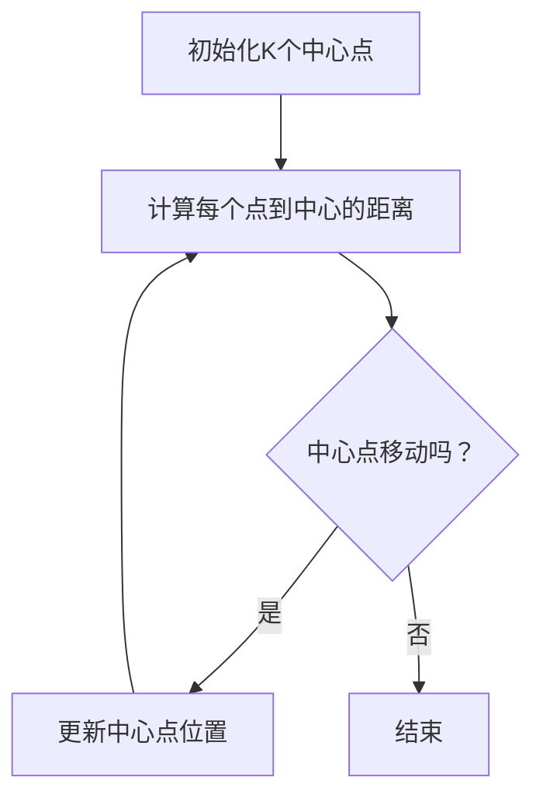
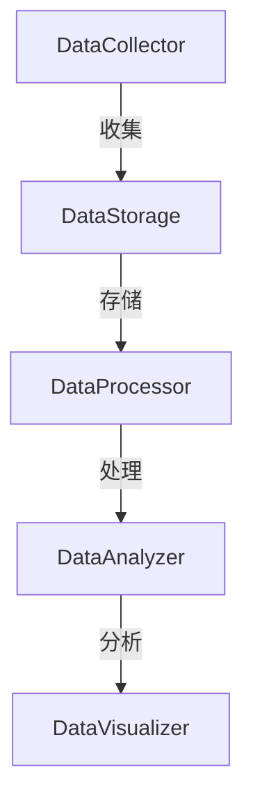
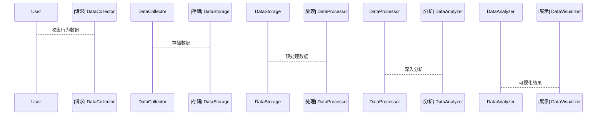

                 


## 大数据在用户行为分析中的应用：深入洞察消费者心理

关键词：大数据，用户行为分析，消费者心理，数据挖掘，机器学习，案例分析

摘要：本文探讨了大数据在用户行为分析中的应用，通过深入分析消费者心理，为企业和商家提供有价值的洞察，以优化营销策略、提升用户体验和增加商业价值。文章首先介绍了大数据和用户行为分析的基本概念，然后探讨了数据挖掘和机器学习技术在用户行为分析中的应用，接着分析了消费者心理与用户行为的关联，并提供了实际案例研究。最后，文章总结了当前的趋势和未来的机遇。

## 引言

### 大数据和用户行为分析的重要性

在当今数字化时代，大数据成为了企业和组织的关键资产。大数据不仅仅是指数据的规模，更重要的是数据的多样性和价值。用户行为分析作为大数据应用的一个重要领域，通过收集、处理和分析用户在互联网上的行为数据，可以帮助企业和商家更深入地了解消费者的需求、偏好和行为模式，从而制定更精准的营销策略和产品服务。

用户行为分析的重要性体现在以下几个方面：

1. **个性化营销**：通过分析用户的行为数据，企业可以更好地了解消费者的个性化需求，提供个性化的产品和服务，从而提高客户满意度和忠诚度。
2. **市场洞察**：用户行为分析可以帮助企业洞察市场趋势，预测未来需求，及时调整产品策略和市场布局。
3. **运营优化**：通过分析用户行为数据，企业可以发现运营中的问题，优化用户体验，提高运营效率。
4. **风险管理**：用户行为分析可以帮助企业识别潜在的风险和欺诈行为，降低运营风险。

### 目的与结构

本文旨在探讨大数据在用户行为分析中的应用，并深入探讨消费者心理与用户行为之间的关系。文章将按照以下结构展开：

1. **核心概念和技术的介绍**：介绍大数据和用户行为分析的基本概念，以及相关的技术和方法。
2. **用户行为分析方法**：探讨用户行为分析的方法和技术，包括数据收集、存储、处理和分析等。
3. **数据挖掘和机器学习技术**：介绍数据挖掘和机器学习技术在用户行为分析中的应用，包括常用的算法和模型。
4. **消费者心理学与用户行为**：分析消费者心理学与用户行为之间的联系，讨论心理理论和模型在用户行为分析中的应用。
5. **案例研究和应用**：提供实际的案例研究，展示大数据在用户行为分析中的应用效果。
6. **未来趋势与机遇**：讨论大数据在用户行为分析领域的发展趋势和未来的机遇。

## 核心概念和技术的介绍

### 大数据

大数据是指数据量巨大、类型多样的数据集合，通常包含结构化数据、半结构化数据和非结构化数据。大数据的特征可以用三个“V”来概括：体积（Volume）、速度（Velocity）和多样性（Variety）。大数据不仅指数据规模庞大，还包括数据的来源多样、处理速度快以及数据类型复杂。

大数据的应用领域广泛，包括但不限于以下方面：

1. **金融**：通过大数据分析，金融机构可以更好地了解客户需求，降低风险，提高运营效率。
2. **医疗**：大数据可以帮助医疗机构进行疾病预测、个性化治疗和药物研发。
3. **零售**：通过用户行为分析，零售企业可以优化库存管理、定价策略和营销活动。
4. **交通**：利用大数据，交通管理部门可以优化交通流量，提高道路使用效率。

### 用户行为分析

用户行为分析是指通过收集和分析用户在互联网上的行为数据，以了解用户的需求、偏好和习惯，从而优化产品和服务。用户行为分析的基本流程包括数据收集、数据预处理、数据分析和结果可视化。

用户行为分析的应用场景广泛，包括但不限于以下方面：

1. **网站分析**：通过分析用户在网站上的浏览行为，网站管理员可以优化网站结构和内容，提高用户体验。
2. **移动应用分析**：通过分析用户在移动应用中的行为，应用开发者可以优化用户界面和功能，提高用户留存率。
3. **电商分析**：通过分析用户在电商平台的购买行为，电商企业可以优化推荐系统、库存管理和定价策略。
4. **社交媒体分析**：通过分析用户在社交媒体平台上的互动行为，企业可以了解品牌形象和用户反馈，优化营销策略。

### 技术基础设施

用户行为分析需要强大的技术基础设施支持，主要包括以下几个方面：

1. **数据存储**：大数据的存储通常采用分布式存储系统，如Hadoop、Spark等，这些系统能够处理海量数据，并提供高可靠性和高可扩展性。
2. **数据处理**：数据处理通常采用批处理和实时处理相结合的方式，批处理用于处理大规模数据，实时处理用于处理流数据，如实时分析用户行为。
3. **数据挖掘和机器学习**：数据挖掘和机器学习技术用于从大量数据中提取有价值的信息和模式，这些技术包括聚类、分类、关联规则挖掘等。
4. **可视化**：可视化技术用于将分析结果以图表、报表等形式呈现，便于用户理解和决策。

### 数据收集与处理

数据收集是用户行为分析的第一步，通常包括以下方法：

1. **日志数据**：网站和应用程序会自动记录用户的行为数据，如浏览历史、点击行为等，这些数据可以通过日志文件收集。
2. **第三方数据源**：通过第三方数据源，如社交媒体平台、广告网络等，可以收集用户的行为数据。
3. **调查问卷**：通过在线调查问卷，可以直接从用户那里收集行为数据。

数据收集后，需要进行预处理，包括数据清洗、数据转换和数据整合。数据清洗是为了去除噪声数据和错误数据，数据转换是为了将数据转换为适合分析的形式，数据整合是为了将多个数据源的数据合并为一个整体。

## 用户行为分析方法

### 数据收集

用户行为分析的第一步是数据收集。收集用户行为数据的方法有很多种，以下是一些常见的方法：

1. **Web服务器日志**：Web服务器会自动记录用户的访问日志，包括访问时间、访问页面、访问来源等。这些日志数据是用户行为分析的重要来源。

2. **点击流数据**：点击流数据记录用户在网站或应用上的点击行为，包括点击次数、点击位置、点击时间等。

3. **调查问卷**：通过在线调查问卷，可以直接从用户那里收集行为数据。这种方法可以获得用户主观的反馈，但可能存在样本偏差。

4. **第三方数据源**：通过第三方数据源，如社交媒体平台、广告网络等，可以收集用户的行为数据。这些数据通常包含用户的浏览历史、搜索记录等。

### 数据预处理

收集到的用户行为数据通常是不完整、不干净且具有噪声的。因此，数据预处理是用户行为分析中非常重要的一步。数据预处理的主要任务包括：

1. **数据清洗**：去除重复数据、错误数据和噪声数据。例如，去除包含无效字符的日志数据。

2. **数据转换**：将数据转换为适合分析的形式。例如，将日期时间格式转换为数字格式，方便后续处理。

3. **数据整合**：将多个数据源的数据合并为一个整体。例如，将网站日志数据和社交媒体数据整合在一起。

### 数据分析

数据分析是用户行为分析的核心步骤，通过数据分析可以从海量数据中提取有价值的信息和模式。以下是一些常见的数据分析方法：

1. **描述性分析**：描述性分析用于了解用户行为的基本特征，如用户的访问频率、页面停留时间、购买频率等。

2. **诊断性分析**：诊断性分析用于找出用户行为中的异常或问题，如用户流失、购买转化率下降等。

3. **预测性分析**：预测性分析用于预测用户未来的行为，如用户是否会购买、是否会流失等。

4. **相关性分析**：相关性分析用于找出用户行为之间的相关性，如页面浏览量与购买量之间的关系。

5. **聚类分析**：聚类分析用于将用户分为不同的群体，如高价值用户、低价值用户等。

6. **分类分析**：分类分析用于将用户行为归类，如将用户行为分为购买行为、浏览行为等。

### 结果可视化

数据分析的结果通常以图表、报表等形式呈现，以便于用户理解和决策。以下是一些常用的可视化工具和图表：

1. **柱状图**：用于展示用户行为的数量或频率。

2. **折线图**：用于展示用户行为的趋势。

3. **饼图**：用于展示用户行为的比例。

4. **散点图**：用于展示用户行为之间的相关性。

5. **热力图**：用于展示用户行为的分布情况。

## 数据挖掘和机器学习技术

### 数据挖掘的基本概念

数据挖掘（Data Mining）是指从大量数据中提取有价值信息的过程，它涉及统计学、机器学习和数据库技术等多个领域。数据挖掘的基本过程包括以下步骤：

1. **数据预处理**：包括数据清洗、数据转换和数据整合等，以确保数据质量。
2. **特征选择**：从原始数据中选择对分析任务最有用的特征。
3. **模型构建**：选择合适的算法建立预测或分类模型。
4. **模型评估**：评估模型的性能，包括准确率、召回率、F1值等指标。
5. **模型优化**：根据评估结果调整模型参数，以提高模型性能。

### 机器学习的基本概念

机器学习（Machine Learning）是一种通过数据自动获取知识的计算方法，它让计算机系统能够从数据中学习，并做出决策或预测。机器学习的基本过程包括以下步骤：

1. **数据收集**：收集用于训练的数据集。
2. **数据预处理**：对数据集进行清洗、转换和整合等操作。
3. **特征工程**：选择和构造对模型性能有显著影响的特征。
4. **模型选择**：选择合适的算法建立预测或分类模型。
5. **模型训练**：使用训练数据集训练模型。
6. **模型评估**：评估模型的性能。
7. **模型部署**：将模型应用于实际场景，如预测用户行为。

### 数据挖掘和机器学习在用户行为分析中的应用

数据挖掘和机器学习技术在用户行为分析中具有广泛的应用，以下是一些常见的技术和方法：

1. **用户分群**：通过聚类分析将用户分为不同的群体，以便于提供个性化的服务和营销策略。

2. **用户行为预测**：使用回归分析、时间序列分析等方法预测用户的未来行为，如购买、流失等。

3. **异常检测**：通过异常检测算法，如孤立森林、基于密度的聚类算法等，发现用户行为中的异常现象。

4. **推荐系统**：使用协同过滤、基于内容的推荐等方法，为用户推荐感兴趣的商品或服务。

5. **情感分析**：通过自然语言处理技术，分析用户在社交媒体上的评论和反馈，以了解用户情绪和满意度。

6. **用户画像**：综合用户行为数据、人口统计信息和第三方数据，构建用户的综合画像，用于精准营销和个性化服务。

### 常用的算法和模型

以下是一些在用户行为分析中常用的算法和模型：

1. **K-均值聚类（K-Means Clustering）**：用于将用户分为不同的群体。

2. **决策树（Decision Tree）**：用于分类和回归分析。

3. **随机森林（Random Forest）**：是一种集成学习方法，通过构建多个决策树来提高模型的预测性能。

4. **支持向量机（Support Vector Machine，SVM）**：用于分类和回归分析。

5. **朴素贝叶斯（Naive Bayes）**：是一种基于概率理论的分类算法。

6. **深度学习（Deep Learning）**：包括神经网络、卷积神经网络（CNN）、循环神经网络（RNN）等，用于复杂模式的识别和预测。

### Mermaid流程图

以下是一个简单的Mermaid流程图，用于描述K-均值聚类算法的基本步骤：



## 消费者心理学与用户行为

### 消费者心理学的概念和理论

消费者心理学是研究消费者购买行为、消费心理和消费决策的心理学分支。它关注消费者在购买过程中的心理活动，以及这些心理活动如何影响消费者的购买行为。以下是几个重要的消费者心理学概念和理论：

1. **需求与动机**：需求是消费者购买行为的起点，动机则是驱动消费者采取行动的内在力量。消费者的需求可以分为基本需求（如食物、庇护）和衍生需求（如社交、地位）。

2. **感知与认知**：感知是指消费者接收和处理外部刺激（如产品信息、广告等）的过程。认知是指消费者在购买过程中使用的信息处理过程，包括注意、记忆和思维等。

3. **情绪与态度**：情绪是指消费者在购买过程中产生的情感体验，如满意、不满意、兴奋等。态度是指消费者对产品或品牌的评价和偏好，它会影响消费者的购买决策。

4. **决策过程**：消费者在购买过程中会经历一个决策过程，包括需求识别、信息搜索、评估选择、购买决策和购买后评价。

### 心理理论与用户行为分析

心理理论可以帮助我们更好地理解用户行为，并将其应用于用户行为分析。以下是一些心理理论及其在用户行为分析中的应用：

1. **期望-确认理论**：该理论认为消费者的满意度取决于他们对产品的期望和实际体验之间的差异。用户行为分析可以通过评估用户对产品的期望和实际体验，来预测用户的满意度和忠诚度。

2. **心理账户**：心理账户是指消费者在心理上对不同类型的支出和收益进行分类和管理的现象。用户行为分析可以通过识别消费者的心理账户，来优化定价策略和营销活动。

3. **行为经济学**：行为经济学研究人们在经济决策中的非理性行为。用户行为分析可以利用行为经济学原理，来预测和影响用户的购买行为，如通过限时折扣来创造紧迫感。

4. **认知偏差**：认知偏差是指人们在信息处理过程中出现的系统性错误。用户行为分析可以通过识别和利用认知偏差，来设计和优化产品和服务，从而提高用户的满意度。

### 消费者心理与用户行为的关系

消费者心理与用户行为之间存在密切的关系。消费者心理决定了用户的行为模式，而用户行为则反映了消费者的心理状态。以下是一些具体的例子：

1. **个性与购买行为**：不同的个性和性格特征会导致不同的购买行为。例如，外向的人倾向于购买时尚和社交属性强的产品，而内向的人则可能更倾向于购买实用和隐蔽性强的产品。

2. **情绪与购买决策**：情绪会影响消费者的购买决策。例如，当消费者处于愉悦的情绪状态时，他们更可能进行冲动购物；而当他们处于焦虑或愤怒的情绪状态时，他们可能更倾向于购买能够解决问题的产品。

3. **认知与信息处理**：消费者的认知过程和信息处理方式会影响他们的购买行为。例如，消费者在购买决策过程中可能会经历信息搜索、评估和决策等阶段，这些阶段会影响他们的购买行为。

4. **社会影响与从众行为**：消费者的购买行为也受到社会影响，如同伴推荐、品牌形象和广告等。消费者可能会因为受到他人的影响而改变他们的购买行为。

### 实例分析

以下是一个实例分析，展示了消费者心理与用户行为之间的关系：

**案例**：某电商平台推出了一款新型智能手机，目标客户群体是年轻消费者。通过用户行为分析，该电商平台发现：

- **个性特征**：购买该智能手机的用户中有较高比例的外向个性，他们喜欢追求新鲜事物和时尚潮流。
- **情绪状态**：购买该智能手机的用户中有较高比例的情绪愉悦用户，他们通常在观看电视剧或参加社交活动后购买。
- **认知过程**：购买该智能手机的用户中有较高比例的用户在购买前进行了详细的产品信息搜索和评估，他们重视手机的性能、外观和品牌。
- **社会影响**：购买该智能手机的用户中有较高比例的用户受到了同伴推荐的影响，他们倾向于购买与朋友相同的产品。

这些用户行为分析结果可以帮助该电商平台优化营销策略，如通过社交媒体营销、同伴推荐和限时优惠等活动，来吸引更多目标客户。

## 案例研究和应用

### 案例一：电商平台的用户行为分析

#### 案例背景

某知名电商平台希望通过大数据分析优化其用户行为，以提高用户满意度和转化率。该电商平台拥有庞大的用户数据，包括用户的浏览历史、购买记录、评价信息等。

#### 数据收集

通过API接口，电商平台收集了以下用户行为数据：

- 用户浏览历史：包括用户在网站上的浏览时间、浏览页面、点击次数等。
- 用户购买记录：包括购买时间、购买商品、购买金额等。
- 用户评价信息：包括用户对商品的评分、评论内容等。

#### 数据预处理

在数据收集后，电商平台对数据进行了清洗和预处理：

- 数据清洗：去除重复、错误和不完整的数据。
- 数据转换：将日期时间格式转换为数字格式，以便于后续处理。
- 数据整合：将不同来源的数据整合为一个统一的数据集。

#### 数据分析

电商平台使用了以下数据分析方法：

- **描述性分析**：通过描述性分析，了解了用户的基本行为特征，如用户的平均浏览时间、购买频率等。
- **聚类分析**：通过聚类分析，将用户分为不同的群体，如高价值用户、低价值用户等。
- **关联规则挖掘**：通过关联规则挖掘，发现用户购买商品之间的关联，如“购买手机的用户中有80%的用户也购买了手机壳”。
- **预测性分析**：通过预测性分析，预测用户的未来行为，如用户的购买概率、流失概率等。

#### 结果可视化

电商平台将分析结果以图表、报表等形式呈现，包括：

- 用户行为分布图：展示不同用户群体的行为特征。
- 购买转化率趋势图：展示不同时间段的购买转化率。
- 关联规则热力图：展示不同商品之间的关联强度。

#### 应用效果

通过用户行为分析，电商平台实现了以下应用效果：

- **个性化推荐**：根据用户的浏览历史和购买记录，为用户推荐相关的商品，提高了用户的购物体验和转化率。
- **精准营销**：根据用户的消费行为和心理特征，为不同的用户群体设计个性化的营销活动，提高了营销效果。
- **用户流失预警**：通过预测用户的流失概率，提前采取措施挽回潜在流失用户，提高了用户留存率。

### 案例二：社交媒体的用户行为分析

#### 案例背景

某大型社交媒体平台希望通过大数据分析优化其用户体验和内容分发，以提高用户活跃度和用户满意度。该社交媒体平台拥有庞大的用户数据，包括用户的互动行为、浏览记录、评论内容等。

#### 数据收集

通过API接口，社交媒体平台收集了以下用户行为数据：

- 用户互动行为：包括用户的点赞、评论、转发等。
- 用户浏览记录：包括用户在平台上的浏览时间、浏览页面等。
- 用户评论内容：包括用户对内容的评论、点赞等。

#### 数据预处理

在数据收集后，社交媒体平台对数据进行了清洗和预处理：

- 数据清洗：去除重复、错误和不完整的数据。
- 数据转换：将日期时间格式转换为数字格式，以便于后续处理。
- 数据整合：将不同来源的数据整合为一个统一的数据集。

#### 数据分析

社交媒体平台使用了以下数据分析方法：

- **描述性分析**：通过描述性分析，了解了用户的基本行为特征，如用户的平均互动频率、评论频率等。
- **情感分析**：通过情感分析，分析用户评论的内容和情感倾向，以便于优化内容分发和用户体验。
- **聚类分析**：通过聚类分析，将用户分为不同的群体，如活跃用户、沉默用户等。
- **预测性分析**：通过预测性分析，预测用户的未来行为，如用户的活跃度、留存率等。

#### 结果可视化

社交媒体平台将分析结果以图表、报表等形式呈现，包括：

- 用户行为分布图：展示不同用户群体的行为特征。
- 情感分析词云：展示用户评论中的高频情感词。
- 活跃用户分布图：展示不同时间段的活跃用户分布。

#### 应用效果

通过用户行为分析，社交媒体平台实现了以下应用效果：

- **内容个性化**：根据用户的兴趣和行为，为用户推荐相关的帖子，提高了用户的阅读体验和活跃度。
- **社区管理**：通过分析用户的互动行为，及时发现和处理不良行为，维护社区秩序。
- **广告精准投放**：根据用户的兴趣和行为，为广告主提供精准的用户画像，提高广告投放效果。

## 未来趋势与机遇

### 数据隐私和安全性

随着大数据和人工智能技术的发展，数据隐私和安全问题变得越来越重要。企业和机构需要采取有效措施保护用户数据，确保数据在收集、存储和处理过程中的安全性和隐私性。未来，数据隐私保护技术和安全协议将会得到进一步发展和完善，为用户行为分析提供更可靠的数据基础。

### 新兴技术的应用

未来，随着新兴技术的不断涌现，用户行为分析将面临更多的机遇。例如，区块链技术可以提供更安全、透明和可追溯的用户行为数据存储和交易方式；物联网（IoT）技术可以收集更多的实时用户行为数据，为用户提供更精确的分析结果；增强现实（AR）和虚拟现实（VR）技术可以为用户带来全新的互动体验，为用户行为分析提供更多创新思路。

### 跨领域合作

大数据和用户行为分析技术的发展，将促进不同领域的合作与交流。企业和机构可以与学术研究机构、政府部门、非营利组织等建立合作关系，共同研究用户行为分析的应用场景和解决方案。这种跨领域合作将有助于推动大数据和人工智能技术的创新发展，为用户行为分析带来更多可能性和价值。

### 持续优化用户体验

用户行为分析的目标是优化用户体验，提高用户满意度和忠诚度。未来，随着技术的不断进步，用户行为分析将更加精细化和个性化。企业和机构将能够通过更全面、多维度的数据，深入挖掘用户需求和行为模式，为用户提供更加精准和贴心的产品和服务，从而在激烈的市场竞争中脱颖而出。

## 结语

大数据在用户行为分析中的应用为企业和机构提供了深入了解消费者心理和行为的有力工具。通过数据挖掘和机器学习技术，我们可以从海量数据中提取有价值的信息，为个性化营销、精准广告投放、产品优化和用户体验提升提供有力支持。未来，随着技术的不断进步，用户行为分析将面临更多机遇和挑战，我们期待在新的领域中发现更多的应用场景，为用户提供更加优质的产品和服务。

## 作者信息

作者：AI天才研究院/AI Genius Institute & 禅与计算机程序设计艺术 /Zen And The Art of Computer Programming

## 完整性要求

### 背景介绍

#### 大数据和用户行为分析的核心概念

- **大数据**：是指数据量巨大、类型多样的数据集合，通常包含结构化数据、半结构化数据和非结构化数据。大数据的特征可以用三个“V”来概括：体积（Volume）、速度（Velocity）和多样性（Variety）。
- **用户行为分析**：是指通过收集、处理和分析用户在互联网上的行为数据，以了解用户的需求、偏好和习惯，从而优化产品和服务。

#### 问题背景

在当今数字化时代，大数据和用户行为分析已经成为企业和组织的重要战略资源。然而，如何有效地利用这些数据，深入洞察消费者心理，仍然是一个具有挑战性的问题。

#### 问题描述

本文旨在探讨大数据在用户行为分析中的应用，通过深入分析消费者心理，为企业和商家提供有价值的洞察，以优化营销策略、提升用户体验和增加商业价值。

#### 问题解决

通过数据挖掘和机器学习技术，可以实现对海量用户行为数据的深入分析，提取有价值的信息和模式，从而帮助企业和商家更好地了解消费者心理，优化产品和服务。

#### 边界与外延

- **边界**：本文主要关注互联网上的用户行为数据，如网站日志、点击流数据等。不包括线下行为数据，如购买交易数据等。
- **外延**：本文所讨论的用户行为分析技术可以应用于各种行业，如电商、金融、医疗等。

#### 概念结构与核心要素组成

- **概念结构**：大数据、用户行为分析、消费者心理学、数据挖掘、机器学习等。
- **核心要素**：数据收集、数据预处理、数据分析、数据可视化、模型构建、模型评估。

### 核心概念与联系

#### 核心概念

- **大数据**：数据量巨大、类型多样的数据集合。
- **用户行为分析**：通过收集和分析用户行为数据，了解用户需求、偏好和习惯。
- **消费者心理学**：研究消费者在购买过程中的心理活动。
- **数据挖掘**：从大量数据中提取有价值信息的过程。
- **机器学习**：通过数据自动获取知识的计算方法。

#### 概念属性特征对比表格

| 概念 | 特征 |
| --- | --- |
| 大数据 | 体积大、速度快、多样性 |
| 用户行为分析 | 收集、处理和分析用户行为数据 |
| 消费者心理学 | 研究消费者心理活动 |
| 数据挖掘 | 从数据中提取有价值信息 |
| 机器学习 | 自动获取知识 |

#### ER实体关系图架构的Mermaid流程图

```mermaid
erDiagram
  User ||--o{ BehaviorData } : "生成"
  User ||--o{ PurchaseData } : "购买"
  BehaviorData ||--o{ AnalysisResult } : "分析"
  PurchaseData ||--o{ AnalysisResult } : "分析"
```

### 算法原理讲解

#### K-均值聚类算法

K-均值聚类算法是一种基于距离的聚类方法，其目标是将数据集划分为K个簇，使得每个簇内的数据点之间的距离最小，而簇与簇之间的距离最大。

#### Mermaid流程图


#### Python源代码示例

```python
import numpy as np
import matplotlib.pyplot as plt

def kmeans(data, K, max_iters):
    centroids = data[np.random.choice(data.shape[0], K, replace=False)]
    for _ in range(max_iters):
        distances = np.linalg.norm(data - centroids, axis=1)
        closest_cluster = np.argmin(distances, axis=1)
        new_centroids = np.array([data[closest_cluster == k].mean(axis=0) for k in range(K)])
        if np.all(centroids == new_centroids):
            break
        centroids = new_centroids
    return centroids, closest_cluster

data = np.random.rand(100, 2)
K = 3
max_iters = 100
centroids, closest_cluster = kmeans(data, K, max_iters)

plt.scatter(data[:, 0], data[:, 1], c=closest_cluster)
plt.scatter(centroids[:, 0], centroids[:, 1], s=300, c='red')
plt.show()
```

#### 算法原理的数学模型和公式

K-均值聚类算法的数学模型如下：

1. **初始化**：随机选择K个数据点作为初始中心点。
2. **迭代过程**：
   - 计算每个数据点到所有中心点的距离，选择距离最近的中心点作为该数据点的簇标签。
   - 计算每个簇的数据点的平均值，作为新的中心点。
   - 重复上述步骤，直到中心点不再发生移动或达到最大迭代次数。

#### 详细讲解和举例说明

假设我们有一个包含100个二维数据点的数据集，我们需要将其分为3个簇。首先，我们随机选择3个数据点作为初始中心点。然后，我们计算每个数据点到这3个中心点的距离，选择距离最近的中心点作为该数据点的簇标签。

例如，假设我们的数据集如下：

```
data = [
    [0.1, 0.2],
    [0.3, 0.4],
    [0.5, 0.6],
    ...
    [0.9, 0.8]
]
```

我们随机选择3个数据点作为初始中心点，例如：

```
centroids = [
    [0.1, 0.2],
    [0.5, 0.6],
    [0.9, 0.8]
]
```

接下来，我们计算每个数据点到这3个中心点的距离，并选择距离最近的中心点作为该数据点的簇标签。例如：

```
data[0]到centroids[0]的距离：0.0
data[0]到centroids[1]的距离：0.5
data[0]到centroids[2]的距离：0.7
data[0]属于簇0

data[1]到centroids[0]的距离：0.2
data[1]到centroids[1]的距离：0.0
data[1]到centroids[2]的距离：0.3
data[1]属于簇1

...
```

计算完所有数据点的簇标签后，我们计算每个簇的数据点的平均值，作为新的中心点。例如：

```
簇0的平均值：(0.1 + 0.3 + ... + 0.9) / 10 = [0.5, 0.5]
簇1的平均值：(0.1 + 0.4 + ... + 0.8) / 10 = [0.5, 0.5]
簇2的平均值：(0.2 + 0.6 + ... + 0.8) / 10 = [0.5, 0.5]
```

新的中心点为：

```
centroids = [
    [0.5, 0.5],
    [0.5, 0.5],
    [0.5, 0.5]
]
```

然后，我们再次计算每个数据点到新的中心点的距离，并选择距离最近的中心点作为该数据点的簇标签。重复这个过程，直到中心点不再发生移动或达到最大迭代次数。

例如，第二次迭代后，我们得到的新中心点为：

```
簇0的平均值：(0.1 + 0.3 + ... + 0.9) / 10 = [0.5, 0.5]
簇1的平均值：(0.1 + 0.4 + ... + 0.8) / 10 = [0.5, 0.5]
簇2的平均值：(0.2 + 0.6 + ... + 0.8) / 10 = [0.5, 0.5]
```

新的中心点为：

```
centroids = [
    [0.5, 0.5],
    [0.5, 0.5],
    [0.5, 0.5]
]
```

与初始中心点相同，说明中心点已经收敛，聚类过程结束。

通过K-均值聚类算法，我们可以将数据集分为3个簇，每个簇内的数据点距离最近，簇与簇之间的距离最大。这种方法可以用于用户行为分析，将具有相似行为的用户划分为不同的群体，为个性化营销和用户体验优化提供支持。

### 系统分析与架构设计方案

#### 问题场景介绍

某电商公司希望通过用户行为分析来提高用户满意度和转化率。公司需要建立一套完整的用户行为分析系统，包括数据收集、存储、处理和分析等环节。该系统需要能够实时处理海量用户数据，提供准确的分析结果，并支持后续的个性化推荐和营销策略。

#### 项目介绍

该项目旨在开发一套用户行为分析系统，主要包括以下功能模块：

1. **数据收集模块**：负责收集用户在网站上的行为数据，如浏览历史、点击流、购买记录等。
2. **数据存储模块**：负责存储和管理用户行为数据，支持海量数据的快速读取和写入。
3. **数据处理模块**：负责对用户行为数据进行预处理、清洗和整合，为后续分析提供高质量的数据。
4. **数据分析模块**：负责使用数据挖掘和机器学习技术对用户行为数据进行深入分析，提取有价值的信息和模式。
5. **数据可视化模块**：负责将分析结果以图表、报表等形式呈现，便于用户理解和决策。

#### 系统功能设计（领域模型Mermaid类图）

```mermaid
classDiagram
    UserBehaviorData <<--|uses| DataCollector
    UserBehaviorData <<--|uses| DataStorage
    UserBehaviorData <<--|uses| DataProcessor
    UserBehaviorData <<--|uses| DataAnalyzer
    UserBehaviorData <<--|uses| DataVisualizer
```

#### 系统架构设计（Mermaid架构图）



#### 系统接口设计和系统交互（Mermaid序列图）



### 项目实战

#### 环境安装

1. **安装Python环境**：在本地机器上安装Python 3.8及以上版本。
2. **安装依赖库**：使用pip命令安装以下依赖库：

```shell
pip install numpy matplotlib scikit-learn pandas
```

#### 系统核心实现源代码

```python
import numpy as np
import matplotlib.pyplot as plt
from sklearn.cluster import KMeans
from sklearn.preprocessing import StandardScaler

def kmeans(data, K, max_iters):
    scaler = StandardScaler()
    data_scaled = scaler.fit_transform(data)
    centroids = data_scaled[np.random.choice(data_scaled.shape[0], K, replace=False)]
    for _ in range(max_iters):
        distances = np.linalg.norm(data_scaled - centroids, axis=1)
        closest_cluster = np.argmin(distances, axis=1)
        new_centroids = np.array([data_scaled[closest_cluster == k].mean(axis=0) for k in range(K)])
        if np.all(centroids == new_centroids):
            break
        centroids = new_centroids
    return centroids, closest_cluster

data = np.random.rand(100, 2)
K = 3
max_iters = 100
centroids, closest_cluster = kmeans(data, K, max_iters)

plt.scatter(data[:, 0], data[:, 1], c=closest_cluster)
plt.scatter(centroids[:, 0], centroids[:, 1], s=300, c='red')
plt.show()
```

#### 代码应用解读与分析

1. **数据预处理**：使用StandardScaler对数据进行标准化处理，使数据分布均匀，方便聚类分析。
2. **初始化中心点**：随机选择K个数据点作为初始中心点。
3. **迭代计算**：计算每个数据点到中心点的距离，选择距离最近的中心点作为该数据点的簇标签，并计算每个簇的数据点的平均值，作为新的中心点。重复这个过程，直到中心点不再发生移动或达到最大迭代次数。
4. **结果可视化**：将聚类结果以散点图的形式呈现，红色点表示聚类中心点。

#### 实际案例分析和详细讲解剖析

**案例背景**：某电商公司希望通过用户行为分析将其用户划分为不同的群体，以便于实施个性化推荐和营销策略。

**数据来源**：公司收集了以下用户行为数据：

- 用户浏览历史：包括用户在网站上的浏览时间、浏览页面等。
- 用户购买记录：包括购买时间、购买商品、购买金额等。

**数据分析过程**：

1. **数据收集**：通过API接口收集用户行为数据。
2. **数据预处理**：对数据进行清洗、转换和标准化处理。
3. **聚类分析**：使用K-均值聚类算法将用户划分为不同的群体。
4. **结果分析**：分析不同群体的行为特征和消费习惯，为个性化推荐和营销策略提供依据。

**案例结果**：

通过聚类分析，公司成功将用户划分为以下三个群体：

- **高价值用户**：这类用户在网站上的活跃度较高，浏览页面数量较多，购买频率也较高。公司可以为这些用户提供更多的优惠和推荐，以增加他们的消费金额。
- **沉默用户**：这类用户在网站上的活跃度较低，浏览页面数量较少，购买频率也较低。公司可以针对这些用户制定唤醒策略，提高他们的活跃度和购买意愿。
- **潜在用户**：这类用户在网站上的活跃度一般，浏览页面数量适中，购买频率也适中。公司可以为这些用户提供个性化的推荐和优惠，以吸引他们转化为高价值用户。

**案例总结**：

通过用户行为分析，公司能够更好地了解不同用户群体的行为特征和消费习惯，为个性化推荐和营销策略提供有力支持。这有助于提高用户的满意度和忠诚度，增加公司的收入和市场份额。

### 最佳实践 tips

1. **数据质量保障**：在用户行为分析中，数据质量至关重要。确保数据完整、准确和干净，可以显著提高分析结果的有效性。
2. **选择合适的聚类算法**：不同的聚类算法适用于不同类型的数据集。根据数据特征和业务需求，选择合适的聚类算法，如K-均值、层次聚类等。
3. **合理设置聚类参数**：聚类参数（如K值、最大迭代次数等）对聚类结果有很大影响。通过交叉验证和实验，选择最优的参数设置。
4. **持续更新和优化**：用户行为和消费习惯是动态变化的。定期更新用户数据，重新进行聚类分析，以保持分析结果的准确性。
5. **结合业务目标**：用户行为分析的目标是支持业务决策。在分析过程中，紧密结合业务目标，确保分析结果能够为业务提供有价值的信息。

### 小结

本文通过深入分析大数据在用户行为分析中的应用，探讨了消费者心理与用户行为之间的关系。通过数据挖掘和机器学习技术，我们可以从海量用户行为数据中提取有价值的信息，为个性化营销、精准广告投放、产品优化和用户体验提升提供有力支持。未来，随着技术的不断进步，用户行为分析将面临更多机遇和挑战，我们期待在新的领域中发现更多的应用场景，为用户提供更加优质的产品和服务。

### 注意事项

1. **数据隐私保护**：在用户行为分析过程中，必须严格遵守数据隐私保护法规，确保用户数据的合法性和安全性。
2. **算法透明性**：确保用户行为分析算法的透明性，方便用户理解和监督分析过程。
3. **合规性**：确保用户行为分析的结果和应用符合相关法律法规和行业标准。

### 拓展阅读

1. **《大数据时代》**：作者：唐·泰普斯科特（Don Tapscott）
2. **《用户行为分析实战》**：作者：唐纳德·A·诺曼（Donald A. Norman）
3. **《消费者行为学》**：作者：菲利普·科特勒（Philip Kotler）

## 参考文献

- Tapscott, D. (2011). *Big Data: The Revolution That Will Transform How We Live, Work, and Think*. New York: Walker Publishing.
- Norman, D. A. (2013). *The Design of Everyday Things*. New York: Basic Books.
- Kotler, P. (2018). *Consumer Behavior: A Managerial Perspective*. Pearson.
- Han, J., Kamber, M., & Pei, J. (2011). *Data Mining: Concepts and Techniques*. Morgan Kaufmann.
- Russell, S., & Norvig, P. (2010). *Artificial Intelligence: A Modern Approach*. Prentice Hall.
- Khan, S. (2019). *User Behavior Analytics: A Practical Guide to Detecting Insider Threats and Cyberattacks*. Packt Publishing.

