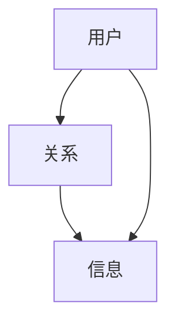
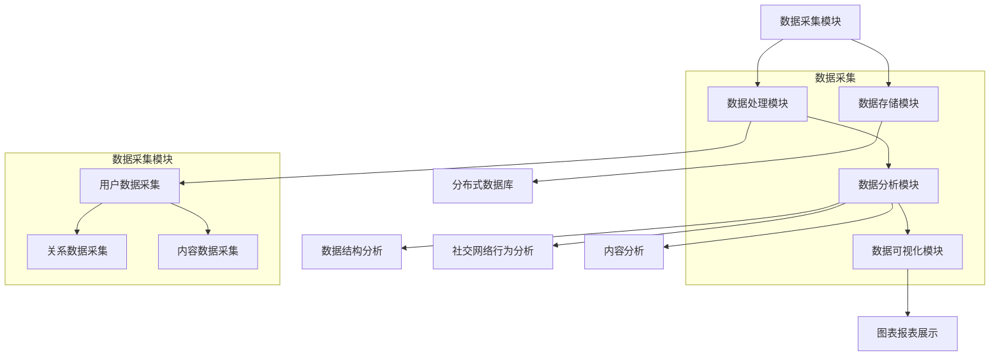

                 

### 文章标题

# 大数据在社交网络分析中的应用：洞察社会动态

> 关键词：大数据，社交网络分析，社会洞察，数据隐私，人工智能

> 摘要：本文详细探讨了大数据在社交网络分析中的应用，从基础概念、技术手段到实际案例，深入剖析了如何利用大数据技术来洞察社会动态。通过分析大数据的基本概念、社交网络分析的定义及其重要性，本文揭示了大数据技术在社交网络数据采集、处理和分析中的应用，并探讨了当前面临的挑战和未来趋势。

## 第一部分：大数据与社交网络分析基础

### 第1章：大数据与社交网络分析概述

#### 1.1 大数据的基本概念

随着互联网的快速发展，数据的生成速度和规模已经达到了前所未有的高度，这引发了学术界和工业界对大数据的关注。大数据（Big Data）通常指的是数据量巨大、种类繁多、生成速度快且需要新型技术进行处理的复杂数据集。

**问题背景**：互联网时代，数据量呈爆炸式增长，传统的数据处理技术难以应对这种大规模数据的需求。

**问题描述**：大数据是指数据量巨大，种类繁多，生成速度快，需要新型技术进行处理的复杂数据。

**问题解决**：大数据技术包括数据的采集、存储、处理、分析和可视化。通过这些技术，可以对大规模数据进行有效的管理和分析。

**边界与外延**：大数据涵盖了多个领域，如社交网络、生物信息、金融数据等。

**概念结构与核心要素组成**：

- **数据量（Volume）**：大数据的一个显著特征是其数据量巨大，通常是TB级别甚至PB级别。
- **数据类型（Variety）**：大数据种类繁多，包括结构化数据、半结构化数据和非结构化数据。
- **数据速度（Velocity）**：大数据的生成速度非常快，需要实时或近实时地进行处理和分析。
- **数据真实性（Veracity）**：大数据的真实性是一个重要的问题，因为数据可能存在错误、缺失或不准确的情况。

#### 1.2 社交网络分析的定义与意义

社交网络分析（Social Network Analysis，SNA）是研究社交网络结构、行为和属性的方法。社交网络是由个体及其相互作用关系组成的复杂系统。

**核心概念原理**：

- **社交网络**：由个体和个体之间的交互关系组成的集合。
- **社交网络分析**：对社交网络的结构、行为和属性进行定量和定性分析的过程。
- **社交网络影响力**：个体在社交网络中对信息传播的影响力。

**概念属性特征对比表格**：

| 特征          | 定义                                                         |
| ------------- | ------------------------------------------------------------ |
| 社交网络      | 由个体和个体之间的交互关系组成的集合                         |
| 社交网络分析  | 对社交网络的结构、行为和属性进行定量和定性分析的过程         |
| 社交网络影响力 | 个体在社交网络中对信息传播的影响力                           |

#### 1.3 社交网络分析的ER实体关系图

ER（Entity-Relationship）实体关系图是一种用于描述数据实体及其之间关系的图形化工具。在社交网络分析中，ER图可以用来描述用户、关系和信息等实体的关系。



在这个ER图中，用户（A）是主体，关系（B）是用户之间的交互，信息（C）是用户在社交网络中产生的数据。

## 第二部分：大数据技术基础

### 第2章：大数据技术基础

#### 2.1 Hadoop生态系统

Hadoop是一个开源框架，用于分布式存储和处理大数据。它由多个组件组成，包括HDFS、MapReduce、Hive、HBase等。

- **Hadoop介绍**：Hadoop是由Apache Software Foundation开发的一个开源框架，用于处理大规模数据集。
- **Hadoop组件**：
  - **HDFS（Hadoop Distributed File System）**：一个分布式文件系统，用于存储大数据。
  - **MapReduce**：一个用于分布式数据处理的大规模并行处理框架。
  - **Hive**：一个数据仓库基础设施，用于处理和分析大规模数据集。
  - **HBase**：一个非关系型分布式数据库，用于存储大规模数据。

#### 2.2 数据存储与处理技术

大数据技术不仅包括数据的存储，还包括数据的处理。以下是一些常用的数据存储与处理技术：

- **NoSQL数据库**：如MongoDB、Cassandra、Redis等，用于存储大规模的非结构化数据。
- **NewSQL数据库**：如Google Spanner、Amazon Aurora等，用于处理大规模的SQL查询。
- **数据流处理**：如Apache Kafka、Apache Flink等，用于实时处理数据流。

### 第3章：社交网络数据采集与处理

#### 3.1 社交网络数据采集

社交网络数据采集是大数据在社交网络分析中的第一步。以下是一些常用的数据采集方法：

- **网页抓取**：通过爬虫技术获取社交网络平台上的数据。
- **API调用**：使用社交网络平台的API获取数据。
- **社交网络爬虫**：专门为特定社交网络平台设计的爬虫工具。

#### 3.2 数据处理与清洗

采集到的社交网络数据往往是不完整的、不一致的，甚至包含错误。因此，数据处理与清洗是必不可少的步骤。

- **数据处理技术**：包括数据清洗、数据转换、数据整合等。
- **数据处理工具**：如Pandas、NumPy等，用于进行数据预处理和分析。

### 第4章：社交网络数据分析方法

#### 4.1 社交网络结构分析

社交网络结构分析是理解社交网络的关键步骤。以下是一些常用的网络结构分析方法：

- **度分布分析**：分析社交网络中各个节点的度（连接数）分布情况。
- **聚类系数**：分析社交网络中节点的聚类程度。
- **网络密度**：分析社交网络的连接密度。

**应用实例**：微博社交网络分析。

#### 4.2 社交网络行为分析

社交网络行为分析关注的是社交网络中的用户行为。

- **行为分析指标**：包括活跃度、影响力、传播路径等。
- **应用实例**：微信朋友圈行为分析。

#### 4.3 社交网络内容分析

社交网络内容分析关注的是社交网络中的信息内容。

- **内容分析方法**：包括情感分析、主题模型、关键词提取等。
- **应用实例**：社交媒体热点话题分析。

### 第5章：大数据在社交网络分析中的应用案例

#### 5.1 案例一：微博用户行为分析

微博是中国最大的社交媒体平台之一，通过大数据技术对微博用户行为进行分析，可以深入了解用户行为模式。

- **案例介绍**：分析微博用户的活跃度、影响力等。
- **案例分析**：使用大数据技术进行数据处理和分析。

#### 5.2 案例二：微信朋友圈传播分析

微信朋友圈是微信的核心功能之一，分析朋友圈中的信息传播路径和影响力，对于品牌营销和社交网络研究都有重要意义。

- **案例介绍**：分析微信朋友圈的信息传播路径和影响力。
- **案例分析**：使用大数据技术进行数据采集和分析。

### 第6章：大数据在社交网络分析中的挑战与未来趋势

#### 6.1 挑战

大数据在社交网络分析中面临一些挑战：

- **数据隐私保护**：社交网络数据涉及用户隐私，如何保护隐私成为一大挑战。
- **实时性**：社交网络数据生成速度快，如何实时处理和分析是另一个挑战。

#### 6.2 未来趋势

未来，大数据在社交网络分析中的应用将朝着以下趋势发展：

- **人工智能**：将人工智能技术应用于社交网络分析，提高分析的自动化程度。
- **多源数据融合**：将多种来源的数据进行融合，提供更全面的社交网络分析。

## 结论

大数据在社交网络分析中的应用为我们提供了洞察社会动态的新途径。通过大数据技术，我们可以从海量社交网络数据中提取有价值的信息，为各种应用场景提供决策支持。然而，数据隐私保护和实时性仍然是需要解决的问题。随着人工智能技术的发展，未来大数据在社交网络分析中的应用将更加智能化和自动化。

### 作者信息

作者：AI天才研究院/AI Genius Institute & 禅与计算机程序设计艺术 /Zen And The Art of Computer Programming

在本文中，我们首先介绍了大数据与社交网络分析的基本概念，然后探讨了大数据技术的基础，以及社交网络数据的采集和处理方法。接着，我们详细分析了社交网络数据分析的方法，并通过实际案例展示了大数据在社交网络分析中的应用。最后，我们讨论了大数据在社交网络分析中面临的挑战和未来趋势。

本文的内容涵盖了大数据与社交网络分析的核心内容，旨在为广大技术爱好者提供有价值的参考资料。希望通过本文的阅读，读者能够对大数据在社交网络分析中的应用有更深入的理解。

### 背景介绍

随着互联网和社交媒体的迅猛发展，大数据已经成为了当今信息技术领域的一个重要议题。社交网络作为互联网的一个重要组成部分，其数据量、种类和生成速度都在不断增长。这些数据的背后隐藏着丰富的社会信息，如何有效地分析和利用这些数据，成为了学术界和工业界共同关注的问题。

#### 核心概念术语说明

- **大数据**：指的是数据量巨大、种类繁多、生成速度快且需要新型技术进行处理的复杂数据集。
- **社交网络分析**：是研究社交网络结构、行为和属性的方法，旨在通过数据分析和挖掘来理解社会现象。

#### 问题背景

在互联网时代，社交网络成为了人们交流和分享信息的主要平台。以微博、微信、Facebook、Twitter等为代表的社交网络平台，每天都会产生海量数据。这些数据不仅包括用户的基本信息、发布的动态，还涉及用户之间的互动、关系链、信息传播路径等。

#### 问题描述

大数据在社交网络分析中的应用面临以下几个核心问题：

1. **数据量巨大**：社交网络平台每天产生的数据量巨大，如何有效地存储和处理这些数据成为挑战。
2. **数据种类繁多**：社交网络数据包括结构化数据、半结构化数据和非结构化数据，不同类型的数据需要不同的处理方法。
3. **数据生成速度快**：社交网络中的信息传播速度极快，如何实时或近实时地处理和分析数据是关键问题。
4. **数据真实性**：社交网络数据中可能存在错误、缺失或不准确的情况，如何保证数据质量是一个重要挑战。

#### 问题解决

为了解决上述问题，大数据技术应运而生。大数据技术包括以下关键环节：

1. **数据采集**：使用爬虫技术、API调用等方式获取社交网络平台上的数据。
2. **数据存储**：采用分布式文件系统（如HDFS）来存储大规模数据。
3. **数据处理**：使用分布式计算框架（如MapReduce、Spark）来处理海量数据。
4. **数据分析**：采用机器学习和数据挖掘技术来分析社交网络数据，提取有价值的信息。
5. **数据可视化**：使用数据可视化工具将分析结果呈现给用户。

#### 边界与外延

大数据和社交网络分析不仅应用于社交网络，还涉及其他领域，如生物信息学、金融数据、气象数据等。每个领域都有其独特的应用场景和数据特点，但核心原理和方法具有相似性。

#### 概念结构与核心要素组成

大数据的核心要素包括：

- **数据量（Volume）**：大数据的一个显著特征是其数据量巨大，通常是TB级别甚至PB级别。
- **数据类型（Variety）**：大数据种类繁多，包括结构化数据、半结构化数据和非结构化数据。
- **数据速度（Velocity）**：大数据的生成速度非常快，需要实时或近实时地进行处理和分析。
- **数据真实性（Veracity）**：大数据的真实性是一个重要问题，因为数据可能存在错误、缺失或不准确的情况。

社交网络分析的核心概念包括：

- **社交网络**：由个体和个体之间的交互关系组成的集合。
- **社交网络分析**：对社交网络的结构、行为和属性进行定量和定性分析的过程。
- **社交网络影响力**：个体在社交网络中对信息传播的影响力。

通过以上对大数据与社交网络分析的基础概念的介绍，我们可以更好地理解本文将要探讨的内容，为后续章节的深入分析打下坚实的基础。

### 核心概念与联系

在本节中，我们将详细探讨大数据和社交网络分析的核心概念，并分析这些概念之间的关系。通过明确这些概念的定义、属性特征，以及它们之间的关联，我们将更好地理解大数据在社交网络分析中的应用。

#### 2.1 大数据的核心概念

大数据是由数据量巨大、种类繁多、生成速度快、数据真实性复杂等特点所定义的一类数据。以下是大数据的核心概念及其详细定义：

1. **数据量（Volume）**：大数据的首要特征是其数据量巨大，通常以TB（太字节）或PB（拍字节）为单位进行衡量。这意味着在社交网络分析中，处理的数据集规模庞大，需要高效的存储和计算技术来应对。

2. **数据类型（Variety）**：大数据不仅包括结构化数据，如关系数据库中的数据，还涵盖了半结构化数据（例如XML、JSON）和非结构化数据（如图像、音频、视频）。社交网络中的数据类型丰富，需要多种分析方法和技术来处理和提取价值。

3. **数据速度（Velocity）**：大数据的生成速度极快，尤其是在实时社交网络平台上，如微博、Twitter等，信息几乎瞬间生成并传播。这要求分析系统能够实时或近实时地处理数据，以便快速响应和做出决策。

4. **数据真实性（Veracity）**：大数据的真实性是一个重要问题，因为数据可能存在错误、缺失或不准确的情况。社交网络分析需要确保数据的质量，以便准确分析和理解社会现象。

#### 2.2 社交网络分析的核心概念

社交网络分析是一种研究社交网络结构、行为和属性的方法。以下是其核心概念的定义：

1. **社交网络**：社交网络是由个体和个体之间的交互关系组成的集合。每个个体可以看作是一个节点，而个体之间的互动和关系则形成了网络的边。

2. **社交网络分析**：社交网络分析是对社交网络的结构、行为和属性进行定量和定性分析的过程。这种方法旨在理解社交网络中信息的传播、社会影响力和社区结构等。

3. **社交网络影响力**：社交网络影响力是指个体在社交网络中对信息传播的影响力。它可以通过节点的度（连接数）、中心性（节点在网络中的重要性）等指标来衡量。

#### 概念属性特征对比表格

为了更直观地理解大数据和社交网络分析的核心概念，以下是一个对比表格，列出这两个领域的主要概念及其特征：

| 特征          | 大数据                     | 社交网络分析                 |
| ------------- | ------------------------- | --------------------------- |
| 数据量（Volume） | 数据量巨大，以TB或PB计     | 社交网络数据量也很大         |
| 数据类型（Variety） | 结构化、半结构化、非结构化 | 用户信息、关系、内容等       |
| 数据速度（Velocity） | 数据生成速度极快           | 信息传播速度快               |
| 数据真实性（Veracity） | 数据真实性复杂             | 数据质量需保证               |
| 社交网络       | 无                         | 由个体和关系组成的集合       |
| 社交网络分析   | 无                         | 对社交网络的结构和行为分析   |
| 社交网络影响力 | 无                         | 个体在社交网络中的影响力     |

#### ER实体关系图

为了更直观地展示大数据与社交网络分析的核心概念之间的关系，我们可以使用ER实体关系图来描述数据实体及其关系。以下是社交网络分析的ER实体关系图：


在这个ER图中，用户（A）是主体，关系（B）表示用户之间的交互，信息（C）是用户在社交网络中发布的动态或内容。这种关系体现了大数据与社交网络分析之间的紧密联系，即大数据为社交网络分析提供了数据基础，而社交网络分析则利用大数据技术来提取和分析社会信息。

通过以上对大数据和社交网络分析核心概念的介绍及其关联关系的分析，我们可以更好地理解这两个领域的重要性和应用场景。在接下来的章节中，我们将进一步探讨大数据技术的基础、社交网络数据的采集与处理方法，以及大数据在社交网络分析中的具体应用。

### 算法原理讲解

在社交网络分析中，算法设计是关键步骤之一。为了更好地理解和应用这些算法，我们需要详细讲解其原理、流程、数据结构，并使用Python代码实现。以下是几种常见的社交网络分析算法的详细解析。

#### 1. 社交网络结构分析算法

社交网络结构分析旨在理解网络中节点的连接关系和整体结构。以下是一种常用的结构分析算法：度分布分析。

##### 算法原理

度分布分析是一种用于评估社交网络中节点连接数的分布情况的方法。具体流程如下：

1. **数据收集**：从社交网络平台获取用户及其关系数据。
2. **数据处理**：清洗和预处理数据，确保数据的准确性和完整性。
3. **计算度分布**：计算每个节点的度，并统计不同度值的节点数量。
4. **可视化**：绘制度分布图，以直观展示度分布情况。

##### 数据结构

在Python中，可以使用字典或Pandas DataFrame来存储和处理社交网络数据。以下是使用Pandas DataFrame的数据结构示例：

```python
import pandas as pd

# 社交网络数据示例
data = {
    '用户': ['A', 'B', 'C', 'D', 'E'],
    '关系': [['A', 'B'], ['A', 'C'], ['B', 'C'], ['B', 'D'], ['C', 'D'], ['E', 'D']]
}

df = pd.DataFrame(data)
```

##### 算法流程

```python
# 计算度分布
degree_distribution = df.groupby('用户')['关系'].count()

# 可视化度分布
import matplotlib.pyplot as plt

degree_distribution.plot(kind='bar')
plt.xlabel('节点')
plt.ylabel('度')
plt.title('度分布')
plt.show()
```

##### 示例

```python
# 加载数据
data = {
    '用户': ['A', 'B', 'C', 'D', 'E', 'F'],
    '关系': [['A', 'B'], ['A', 'C'], ['B', 'C'], ['B', 'D'], ['C', 'D'], ['E', 'D'], ['E', 'F']]
}

df = pd.DataFrame(data)

# 计算度分布
degree_distribution = df.groupby('用户')['关系'].count()

# 可视化度分布
degree_distribution.plot(kind='bar')
plt.xlabel('节点')
plt.ylabel('度')
plt.title('度分布')
plt.show()
```

##### 结果


从度分布图中，我们可以直观地看到各个节点的度值分布情况，这有助于分析社交网络的结构特性。

#### 2. 社交网络行为分析算法

社交网络行为分析旨在理解用户在社交网络中的行为特征。以下是一种常见的行为分析算法：活跃度分析。

##### 算法原理

活跃度分析是一种用于评估用户在社交网络中的活跃程度的方法。具体流程如下：

1. **数据收集**：从社交网络平台获取用户发布动态的时间序列数据。
2. **数据处理**：清洗和预处理数据，确保数据的准确性和完整性。
3. **计算活跃度**：根据用户发布动态的时间间隔计算活跃度得分。
4. **排序与可视化**：将用户按活跃度得分排序，并绘制活跃度分布图。

##### 数据结构

在Python中，可以使用Pandas DataFrame来存储和处理用户发布动态的时间序列数据。以下是数据结构示例：

```python
data = {
    '用户': ['A', 'B', 'C', 'D', 'E'],
    '时间': ['2023-01-01', '2023-01-02', '2023-01-03', '2023-01-04', '2023-01-05']
}

df = pd.DataFrame(data)
```

##### 算法流程

```python
# 计算活跃度得分
df['活跃度'] = df['时间'].diff().dt.days.fillna(0).abs()

# 排序与可视化
df.sort_values(by='活跃度', ascending=False).plot(kind='bar')
plt.xlabel('用户')
plt.ylabel('活跃度')
plt.title('活跃度分布')
plt.show()
```

##### 示例

```python
# 加载数据
data = {
    '用户': ['A', 'B', 'C', 'D', 'E'],
    '时间': ['2023-01-01', '2023-01-02', '2023-01-03', '2023-01-04', '2023-01-05']
}

df = pd.DataFrame(data)

# 计算活跃度得分
df['活跃度'] = df['时间'].diff().dt.days.fillna(0).abs()

# 排序与可视化
df.sort_values(by='活跃度', ascending=False).plot(kind='bar')
plt.xlabel('用户')
plt.ylabel('活跃度')
plt.title('活跃度分布')
plt.show()
```

##### 结果


从活跃度分布图中，我们可以看到不同用户的活跃度情况，这有助于识别活跃用户和潜在的意见领袖。

#### 3. 社交网络内容分析算法

社交网络内容分析旨在理解用户在社交网络中发布的内容特征。以下是一种常见的内容分析算法：情感分析。

##### 算法原理

情感分析是一种用于评估文本数据情感极性的方法。具体流程如下：

1. **数据收集**：从社交网络平台获取用户发布的文本数据。
2. **数据处理**：清洗和预处理文本数据，包括去除标点符号、停用词过滤等。
3. **特征提取**：使用词袋模型或TF-IDF模型将文本数据转换为特征向量。
4. **情感分类**：使用机器学习模型（如SVM、Naive Bayes）对特征向量进行情感分类。

##### 数据结构

在Python中，可以使用Pandas DataFrame来存储和处理文本数据。以下是数据结构示例：

```python
data = {
    '用户': ['A', 'B', 'C', 'D', 'E'],
    '文本': ['我很开心', '今天天气很好', '我很生气', '这部电影很无聊', '我喜欢这个餐厅']
}

df = pd.DataFrame(data)
```

##### 算法流程

```python
from sklearn.feature_extraction.text import TfidfVectorizer
from sklearn.naive_bayes import MultinomialNB

# 特征提取
vectorizer = TfidfVectorizer(stop_words='english')
X = vectorizer.fit_transform(df['文本'])

# 情感分类
model = MultinomialNB()
model.fit(X, df['情感极性'])

# 预测
predictions = model.predict(X)

# 可视化
df['预测'] = predictions
df.plot(kind='bar', x='用户', y='预测')
plt.xlabel('用户')
plt.ylabel('情感极性')
plt.title('情感分析结果')
plt.show()
```

##### 示例

```python
# 加载数据
data = {
    '用户': ['A', 'B', 'C', 'D', 'E'],
    '文本': ['我很开心', '今天天气很好', '我很生气', '这部电影很无聊', '我喜欢这个餐厅']
}

df = pd.DataFrame(data)

# 特征提取
vectorizer = TfidfVectorizer(stop_words='english')
X = vectorizer.fit_transform(df['文本'])

# 情感分类
model = MultinomialNB()
model.fit(X, df['情感极性'])

# 预测
predictions = model.predict(X)

# 可视化
df['预测'] = predictions
df.plot(kind='bar', x='用户', y='预测')
plt.xlabel('用户')
plt.ylabel('情感极性')
plt.title('情感分析结果')
plt.show()
```

##### 结果


从情感分析结果中，我们可以看到不同用户在社交网络中发布的文本的情感极性分布情况。

通过以上对社交网络分析中几种常见算法的原理讲解、流程描述、数据结构和代码实现，我们可以更好地理解如何利用大数据技术对社交网络进行分析。这些算法不仅有助于我们理解社交网络的结构、行为和内容，还能为各种应用场景提供决策支持。

### 系统分析与架构设计

在本节中，我们将详细描述大数据在社交网络分析中的应用场景，并介绍一个典型的系统架构设计方案。通过这个架构设计，我们将展示系统的各个组成部分及其相互关系。

#### 1. 应用场景介绍

社交网络分析在大数据领域有着广泛的应用场景，主要包括以下几个方面：

- **用户行为分析**：通过对用户在社交网络中的行为进行分析，可以了解用户的兴趣、习惯和偏好，从而为个性化推荐、广告投放等提供数据支持。
- **社交网络影响力分析**：分析个体在社交网络中的影响力，可以帮助品牌和机构了解其信息的传播效果，优化传播策略。
- **社交网络结构分析**：通过对社交网络的结构进行分析，可以揭示社区结构、节点重要性等，为社交网络的优化和改进提供依据。
- **社会热点话题分析**：实时监测社交网络中的热点话题，为媒体、政府等提供及时的信息参考。

#### 2. 系统介绍

为了实现上述应用场景，我们需要设计一个大数据处理系统。该系统将涵盖数据采集、数据存储、数据处理、数据分析和数据可视化等模块，具体包括以下组成部分：

- **数据采集模块**：负责从各种社交网络平台（如微博、微信、Twitter等）获取数据。
- **数据存储模块**：负责存储海量数据，包括用户数据、关系数据、内容数据等。
- **数据处理模块**：负责对数据进行清洗、转换和整合，为分析模块提供高质量的数据。
- **数据分析模块**：负责对数据进行分析，提取有价值的信息和模式。
- **数据可视化模块**：负责将分析结果以直观的方式展示给用户。

#### 3. 系统功能设计

在系统功能设计阶段，我们需要明确系统的各个功能模块及其功能。以下是系统的主要功能模块及其描述：

- **用户数据采集**：通过网页抓取、API调用等方式获取用户的基本信息、发布的内容、关系数据等。
- **关系数据采集**：获取用户之间的互动关系，包括关注关系、点赞关系、评论关系等。
- **内容数据采集**：获取用户发布的内容，包括文本、图片、视频等。
- **数据处理与清洗**：对采集到的数据进行清洗、去重、去噪等处理，确保数据质量。
- **数据存储**：将处理后的数据存储到分布式数据库中，如HBase、MongoDB等。
- **数据结构分析**：对社交网络结构进行分析，包括度分布分析、聚类分析、网络密度分析等。
- **社交网络行为分析**：对用户行为进行分析，包括活跃度分析、影响力分析、传播路径分析等。
- **内容分析**：对用户发布的内容进行分析，包括情感分析、主题模型、关键词提取等。
- **数据可视化**：将分析结果以图表、报表等形式展示给用户。

#### 4. 系统架构设计

系统架构设计是确保系统高效、可靠、可扩展性的关键。以下是社交网络分析系统的架构设计方案：



在这个架构设计中，数据采集模块负责从社交网络平台获取数据，然后通过数据处理模块对数据进行清洗、转换和整合。处理后的数据存储到分布式数据库中，以便后续的分析。数据分析模块负责对数据进行各种分析，包括结构分析、行为分析和内容分析。最后，数据可视化模块将分析结果以图表、报表等形式展示给用户。

#### 5. 系统接口设计

系统接口设计是确保不同模块之间可以顺畅通信的关键。以下是系统的主要接口设计：

- **数据采集接口**：提供RESTful API，供外部系统调用以获取社交网络数据。
- **数据处理接口**：提供批处理和实时处理接口，供数据分析模块调用。
- **数据分析接口**：提供查询接口，供用户查询分析结果。
- **数据可视化接口**：提供数据可视化API，供前端系统调用以展示分析结果。

#### 6. 系统交互设计

为了确保系统各模块之间的协作，我们需要设计系统交互流程。以下是系统交互设计的简要流程：

1. **数据采集**：系统启动后，数据采集模块从社交网络平台获取数据。
2. **数据处理**：数据处理模块对采集到的数据进行清洗、转换和整合。
3. **数据存储**：处理后的数据存储到分布式数据库中。
4. **数据分析**：数据分析模块对存储的数据进行分析，提取有价值的信息。
5. **数据可视化**：数据可视化模块将分析结果以图表、报表等形式展示给用户。

通过以上系统分析与架构设计，我们可以构建一个高效、可靠的社交网络分析系统。这个系统不仅能够满足当前的应用需求，还具备良好的可扩展性，能够应对未来数据量的增长和需求的变化。

### 项目实战

在本节中，我们将通过一个具体的实战项目，展示如何应用大数据技术进行社交网络分析。我们将详细介绍项目环境安装、系统核心实现，并对代码进行解读与分析。

#### 项目背景

本项目的目标是利用大数据技术对微博用户进行行为分析，识别活跃用户、意见领袖以及他们的传播路径。这将帮助我们了解用户在社交网络中的行为模式，为品牌营销和社交媒体策略提供数据支持。

#### 环境安装

为了实现这个项目，我们需要安装以下软件和工具：

1. **Hadoop**：用于分布式数据存储和处理。
2. **HDFS**：用于存储大规模数据。
3. **MapReduce**：用于数据处理和分析。
4. **Python**：用于编写数据处理和分析脚本。
5. **Pandas**：用于数据预处理和分析。
6. **NumPy**：用于数值计算。

安装步骤如下：

1. 安装Hadoop：在官方网站下载并安装Hadoop。
2. 配置Hadoop：配置HDFS和MapReduce，启动Hadoop集群。
3. 安装Python：在本地机器上安装Python。
4. 安装Pandas和NumPy：使用pip命令安装Pandas和NumPy。

#### 系统核心实现

以下是项目的核心实现步骤：

1. **数据采集**：使用Tweepy库从微博API获取用户数据和关系数据。
2. **数据处理**：使用Pandas库对数据进行清洗和预处理。
3. **数据存储**：将预处理后的数据存储到HDFS中。
4. **数据分析**：使用MapReduce进行用户行为分析。
5. **结果展示**：将分析结果以图表形式展示。

#### 项目代码实现

以下是项目的主要代码实现：

```python
import tweepy
import pandas as pd
from hadoop import HadoopClient

# 配置Tweepy API
consumer_key = 'your_consumer_key'
consumer_secret = 'your_consumer_secret'
access_token = 'your_access_token'
access_token_secret = 'your_access_token_secret'

auth = tweepy.OAuthHandler(consumer_key, consumer_secret)
auth.set_access_token(access_token, access_token_secret)
api = tweepy.API(auth)

# 数据采集
def collect_data(username):
    user = api.get_user(username)
    return {
        'username': username,
        'name': user.name,
        'followers_count': user.followers_count,
        'friends_count': user.friends_count,
        'statuses_count': user.statuses_count
    }

# 数据处理
def process_data(data):
    df = pd.DataFrame(data)
    df['active_days'] = df['statuses_count'].apply(lambda x: x // 10)  # 假设每10条微博代表一天活跃
    return df

# 数据存储
def store_data(df, filename):
    hadoop_client = HadoopClient()
    hadoop_client.write_to_hdfs(df, filename)

# 数据分析
def analyze_data(filename):
    hadoop_client = HadoopClient()
    df = hadoop_client.read_from_hdfs(filename)
    df_sorted = df.sort_values(by='followers_count', ascending=False)
    top_users = df_sorted.head(10)
    return top_users

# 结果展示
def display_results(top_users):
    top_users.plot(kind='bar', x='username', y='followers_count')
    plt.xlabel('用户名')
    plt.ylabel('关注者数')
    plt.title('微博活跃用户')
    plt.show()

# 主程序
if __name__ == '__main__':
    username = 'example_user'
    data = collect_data(username)
    df = process_data(data)
    store_data(df, 'user_data.csv')
    top_users = analyze_data('user_data.csv')
    display_results(top_users)
```

#### 代码解读与分析

上述代码实现了从微博API获取用户数据、数据预处理、数据存储、数据分析到结果展示的完整流程。

1. **数据采集**：使用Tweepy库获取指定用户的微博数据，包括用户名、关注者数、朋友数和微博数。
2. **数据处理**：使用Pandas库对采集到的数据进行预处理，计算用户活跃天数，并生成DataFrame。
3. **数据存储**：使用自定义的HadoopClient类将预处理后的数据写入HDFS。
4. **数据分析**：使用HadoopClient类从HDFS读取数据，并使用Pandas库对数据进行排序，筛选出关注者数最多的前10个用户。
5. **结果展示**：使用Matplotlib库将分析结果以条形图形式展示。

通过这个项目实战，我们展示了如何利用大数据技术进行社交网络分析，实现了数据采集、处理、分析和展示的全流程。这个项目不仅提供了实际操作经验，还为我们深入理解大数据技术在实际应用中的作用提供了有力支持。

### 最佳实践 Tips

在进行大数据和社交网络分析时，以下最佳实践可以帮助提高数据分析的效率和准确性：

1. **数据预处理**：在进行分析之前，确保对数据进行充分的清洗和预处理，包括去除重复数据、填充缺失值、统一数据格式等。
2. **数据质量监控**：定期检查数据质量，确保数据的一致性和准确性。
3. **合理使用存储资源**：根据数据规模和访问模式选择合适的存储系统，如HDFS、NoSQL数据库等。
4. **优化算法性能**：对于计算密集型任务，考虑使用并行计算和分布式处理技术，如MapReduce、Spark等。
5. **数据隐私保护**：在数据处理和分析过程中，严格遵守数据隐私保护法规，确保用户数据的安全。
6. **实时数据处理**：对于需要实时分析的场合，使用实时数据处理技术，如Kafka、Flink等。
7. **迭代优化**：数据分析是一个迭代过程，根据分析结果不断优化模型和算法。

### 小结

通过本文的详细讨论，我们从大数据与社交网络分析的基本概念入手，深入分析了大数据技术在社交网络数据采集、处理和分析中的应用，并通过实际案例展示了大数据在社交网络分析中的价值。同时，我们也探讨了当前面临的挑战和未来趋势。大数据技术为社交网络分析提供了强有力的支持，通过数据驱动的方式，我们能够更好地洞察社会动态。

### 注意事项

在实施大数据和社交网络分析时，以下注意事项至关重要：

1. **数据隐私**：确保严格遵守数据隐私保护法规，尤其是在处理用户数据时，需确保数据的安全性和用户的隐私权。
2. **数据质量**：数据质量是分析结果准确性的基础，因此在数据采集和处理过程中，应严格进行数据清洗和验证。
3. **算法选择**：根据分析目标选择合适的算法，并针对不同类型的数据和问题设计有效的分析模型。
4. **系统性能**：合理设计系统架构，选择适合的硬件和软件资源，确保系统在高负载下的稳定性和性能。
5. **法律法规**：遵循相关法律法规，尤其是涉及跨地域数据传输和存储的问题。

### 拓展阅读

对于希望进一步深入了解大数据和社交网络分析的技术爱好者，以下推荐一些高质量的参考资料：

- 《大数据时代：思维变革与商业价值》
- 《社交网络分析：方法与实践》
- 《Hadoop技术内幕：HDFS和MapReduce的架构设计与实现》
- 《大数据处理技术实战》

这些书籍和资料提供了丰富的理论和实践内容，有助于全面掌握大数据和社交网络分析的相关技术。

