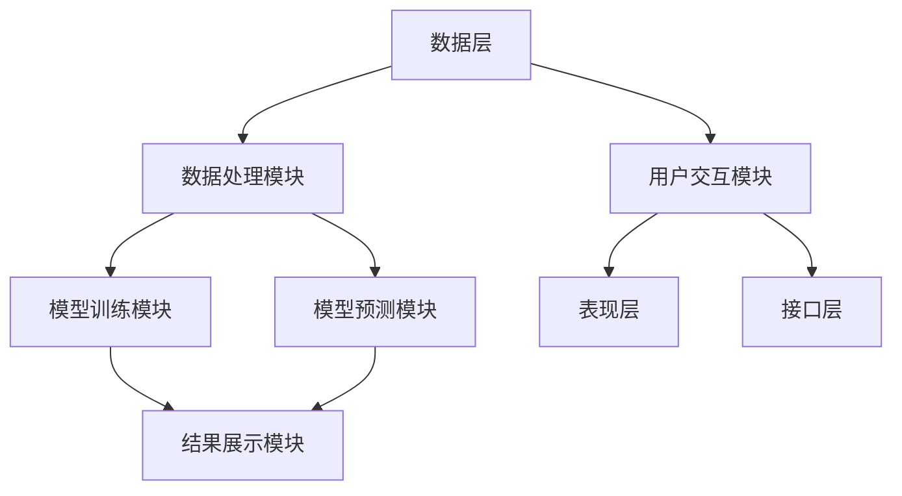
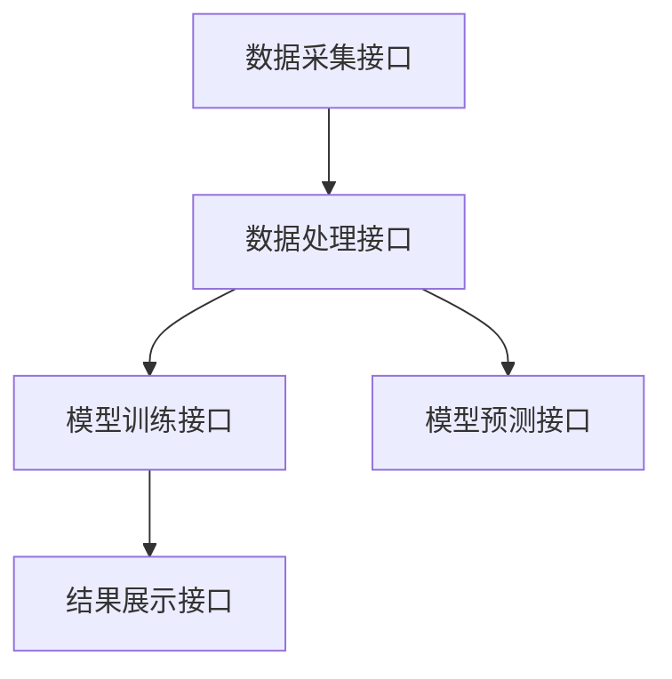
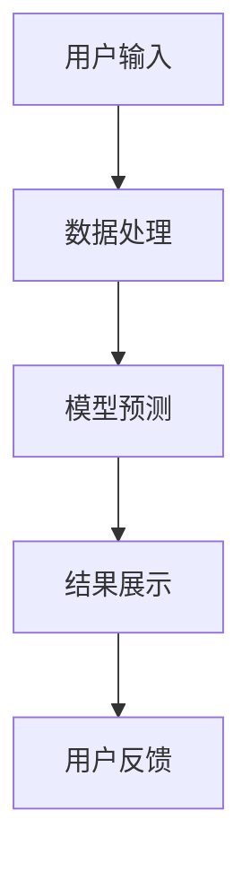

                 

# 大数据在选举预测与政治分析中的作用

> 关键词：大数据、选举预测、政治分析、算法、系统架构

> 摘要：本文探讨了大数据在选举预测与政治分析中的作用，从核心概念、算法原理、数学模型、系统架构到实战案例，逐步揭示了大数据技术在政治领域的广泛应用及其深远影响。文章旨在为读者提供全面、深入的技术解读，帮助理解这一新兴领域的发展趋势和挑战。

## 1. 书籍背景介绍

在大数据时代，选举预测与政治分析的重要性日益凸显。选举预测不仅关乎国家政治稳定，更对全球经济、社会文化产生深远影响。大数据技术为选举预测提供了强有力的工具，通过对大量结构化和非结构化数据的处理与分析，可以发现隐藏在数据背后的选民行为规律和选举趋势。

当前，大数据在选举预测与政治分析中的应用已逐渐成熟，许多国家和地区纷纷采用大数据技术进行选举预测。例如，美国的政治分析公司Axios Data，利用大数据技术对2020年美国总统选举进行预测，取得了较高的准确性。此外，大数据在选民行为分析、舆情监测、政策制定等方面也发挥着重要作用。

未来，随着数据获取和处理技术的不断发展，大数据在选举预测与政治分析中的作用将更加凸显。一方面，数据量的不断增加将提供更为丰富的预测素材；另一方面，算法和模型的优化将提高预测的准确性和可靠性。此外，跨学科融合和智能化技术也将进一步推动这一领域的发展。

## 2. 核心概念与联系

为了深入理解大数据在选举预测与政治分析中的作用，我们需要首先掌握一些核心概念，包括数据分析基础、数据类型、数据处理、数据挖掘、机器学习等。

### 2.1 数据分析基础

数据分析是指通过对数据的收集、清洗、转换、分析等过程，从中提取有价值的信息和知识的过程。数据分析可以分为以下几个方面：

- **数据收集**：通过各种渠道获取数据，如互联网、数据库、传感器等。
- **数据清洗**：对收集到的数据进行清洗、去重、填充等处理，确保数据质量。
- **数据转换**：将数据转换为适合分析的形式，如数据格式转换、数据整合等。
- **数据分析**：使用各种数据分析方法和工具，对数据进行探索、关联、分类、聚类等分析。
- **数据可视化**：通过图表、地图等可视化方式展示分析结果，帮助决策者更好地理解数据。

### 2.2 数据类型

在选举预测与政治分析中，数据类型可以分为结构化数据和非结构化数据：

- **结构化数据**：具有固定格式和模型的数据，如数据库中的表格数据，便于存储、查询和分析。
- **非结构化数据**：没有固定格式和模型的数据，如文本、图片、视频等，需要通过自然语言处理、图像识别等技术进行解析和处理。

### 2.3 数据处理

数据处理是数据分析的基础环节，主要包括以下方面：

- **数据预处理**：对数据进行清洗、去噪、填充等处理，提高数据质量。
- **特征提取**：从原始数据中提取具有区分度和代表性的特征，用于建模和分析。
- **数据降维**：通过降维技术减少数据维度，提高计算效率和模型性能。
- **数据融合**：将不同来源、格式、类型的数据进行整合，实现数据的统一管理和分析。

### 2.4 数据挖掘

数据挖掘是数据分析的高级阶段，旨在从大量数据中发现隐藏的、未知的、有价值的模式和规律。在选举预测中，数据挖掘可以用于以下几个方面：

- **关联分析**：发现数据之间的关联关系，如选民行为与选举结果之间的关系。
- **分类和预测**：根据历史数据，对未知数据进行分类和预测，如预测选民的投票意向。
- **聚类分析**：将相似的数据归为一类，发现数据中的自然分组，如选民群体的划分。

### 2.5 机器学习

机器学习是数据挖掘的重要方法，通过建立模型和算法，实现数据自动分析和预测。在选举预测中，常用的机器学习方法包括：

- **监督学习**：根据已标记的历史数据，训练模型进行预测，如逻辑回归、决策树、随机森林等。
- **无监督学习**：根据未标记的历史数据，自动发现数据中的模式和规律，如聚类、关联规则等。
- **强化学习**：通过与环境互动，不断调整策略，实现最佳决策，如政策制定、选民行为预测等。

### 2.6 选举预测的关键概念

在选举预测中，关键概念包括：

- **选民行为分析**：通过分析选民的投票行为、舆情态度等数据，了解选民的倾向和动机。
- **选举模型**：建立选举预测模型，如逻辑回归、神经网络等，对选举结果进行预测。
- **预测准确性评估**：通过评估模型的预测准确性，如准确率、召回率、F1值等，判断模型的有效性。

## 3. 算法原理讲解

在选举预测中，常用的算法包括逻辑回归、决策树、随机森林、神经网络等。这些算法通过不同的原理和方法，对选举结果进行预测。

### 3.1 逻辑回归

逻辑回归是一种常见的监督学习算法，用于处理分类问题。在选举预测中，逻辑回归可以用于预测选民的投票意向。

#### 3.1.1 算法原理

逻辑回归的原理是通过建立线性模型，将自变量（选民特征）映射到因变量（投票结果）。具体来说，逻辑回归模型可以表示为：

$$
P(Y=1|X) = \frac{1}{1 + e^{-(\beta_0 + \beta_1X_1 + \beta_2X_2 + \ldots + \beta_nX_n})}
$$

其中，$P(Y=1|X)$表示在给定自变量$X$的情况下，因变量$Y$为1的概率，$\beta_0, \beta_1, \beta_2, \ldots, \beta_n$为模型参数。

#### 3.1.2 代码实现

以下是一个使用Python实现的逻辑回归算法的简单示例：

```python
import numpy as np
from sklearn.linear_model import LogisticRegression

# 数据准备
X = np.array([[1, 2], [2, 3], [3, 4], [4, 5]])
y = np.array([0, 1, 1, 0])

# 创建逻辑回归模型
model = LogisticRegression()

# 模型训练
model.fit(X, y)

# 模型预测
predictions = model.predict([[2, 3]])

print(predictions)
```

#### 3.1.3 数学模型和公式

逻辑回归的数学模型可以表示为：

$$
\ln\left(\frac{P(Y=1|X)}{1 - P(Y=1|X)}\right) = \beta_0 + \beta_1X_1 + \beta_2X_2 + \ldots + \beta_nX_n
$$

其中，$\ln$表示自然对数。

#### 3.1.4 举例说明

假设我们有一个选民特征向量$X = [1, 2]$，使用逻辑回归模型预测其投票意向。根据模型参数，我们可以计算出：

$$
P(Y=1|X) = \frac{1}{1 + e^{-(\beta_0 + \beta_1X_1 + \beta_2X_2)}}
$$

假设模型参数为$\beta_0 = 0.5, \beta_1 = 0.3, \beta_2 = 0.2$，代入特征向量，计算得到：

$$
P(Y=1|X) = \frac{1}{1 + e^{-(0.5 + 0.3 \times 1 + 0.2 \times 2)}} \approx 0.694
$$

这意味着选民投票为1（支持某个候选人）的概率约为69.4%。

### 3.2 决策树

决策树是一种基于树形结构的分类算法，通过一系列决策规则对数据进行划分，最终得到预测结果。

#### 3.2.1 算法原理

决策树的原理是利用特征值和阈值，对数据进行二分划分，生成一棵树形结构。树的每个节点代表一个特征，每个分支代表一个阈值。树的叶子节点表示预测结果。

决策树的划分规则可以使用信息增益、基尼系数等指标进行评估。信息增益是特征划分后信息量的减少程度，基尼系数是特征划分后纯度的降低程度。

#### 3.2.2 代码实现

以下是一个使用Python实现的决策树算法的简单示例：

```python
import numpy as np
from sklearn.tree import DecisionTreeClassifier

# 数据准备
X = np.array([[1, 2], [2, 3], [3, 4], [4, 5]])
y = np.array([0, 1, 1, 0])

# 创建决策树模型
model = DecisionTreeClassifier()

# 模型训练
model.fit(X, y)

# 模型预测
predictions = model.predict([[2, 3]])

print(predictions)
```

#### 3.2.3 数学模型和公式

决策树的数学模型可以表示为：

$$
Gini(X) = 1 - \sum_{i=1}^{n} \left( \frac{1}{n} \right) ^ 2
$$

其中，$Gini(X)$表示特征$X$的基尼系数，$n$表示特征$X$的取值个数。

#### 3.2.4 举例说明

假设我们有一个选民特征向量$X = [1, 2]$，使用决策树模型预测其投票意向。根据模型参数，我们可以计算出：

$$
Gini(X) = 1 - \frac{1}{2} \times \left( \frac{1}{2} \right) ^ 2 - \frac{1}{2} \times \left( \frac{1}{2} \right) ^ 2 = 0.5
$$

这意味着特征$X$的基尼系数为0.5。

### 3.3 随机森林

随机森林是一种基于决策树的集成学习方法，通过构建多棵决策树，并对预测结果进行投票，提高预测准确性和稳定性。

#### 3.3.1 算法原理

随机森林的原理是利用随机抽样和决策树构建多棵模型，并将它们的预测结果进行投票，得到最终的预测结果。随机森林通过以下步骤进行：

1. 从训练集中随机抽取一部分样本作为决策树的训练集。
2. 使用决策树构建模型，并进行训练。
3. 对测试集中的每个样本，将多棵决策树的预测结果进行投票。
4. 根据投票结果，得到最终的预测结果。

#### 3.3.2 代码实现

以下是一个使用Python实现的随机森林算法的简单示例：

```python
import numpy as np
from sklearn.ensemble import RandomForestClassifier

# 数据准备
X = np.array([[1, 2], [2, 3], [3, 4], [4, 5]])
y = np.array([0, 1, 1, 0])

# 创建随机森林模型
model = RandomForestClassifier(n_estimators=10)

# 模型训练
model.fit(X, y)

# 模型预测
predictions = model.predict([[2, 3]])

print(predictions)
```

#### 3.3.3 数学模型和公式

随机森林的数学模型可以表示为：

$$
\hat{y} = \arg\max_{y} \sum_{i=1}^{n} w_i \cdot p(y_i = y | x_i)
$$

其中，$\hat{y}$表示最终的预测结果，$y_i$表示第$i$个决策树的预测结果，$w_i$表示第$i$个决策树的权重，$p(y_i = y | x_i)$表示第$i$个决策树在给定样本$x_i$下的预测概率。

#### 3.3.4 举例说明

假设我们有一个测试样本$X = [2, 3]$，随机森林模型由10棵决策树组成。根据模型参数，我们可以计算出每棵决策树的预测概率，并对预测结果进行投票。

假设每棵决策树的预测概率如下：

| 决策树 | 预测概率 |
| --- | --- |
| 1 | 0.6 |
| 2 | 0.7 |
| 3 | 0.5 |
| 4 | 0.8 |
| 5 | 0.4 |
| 6 | 0.9 |
| 7 | 0.6 |
| 8 | 0.7 |
| 9 | 0.5 |
| 10 | 0.8 |

根据投票结果，最终预测结果为1（支持某个候选人）。

### 3.4 神经网络

神经网络是一种基于仿生学原理的机器学习算法，通过模拟人脑神经元的工作方式，实现数据的自动学习和预测。

#### 3.4.1 算法原理

神经网络的基本单元是神经元，每个神经元接收多个输入信号，并通过权重进行加权求和，最后通过激活函数产生输出。神经网络可以看作是一个多层感知器（MLP），包括输入层、隐藏层和输出层。

神经网络的训练过程是通过反向传播算法不断调整模型参数（权重和偏置），使模型的输出接近实际值。反向传播算法可以计算每个参数的梯度，并根据梯度进行参数更新。

#### 3.4.2 代码实现

以下是一个使用Python实现的神经网络算法的简单示例：

```python
import numpy as np
from sklearn.neural_network import MLPClassifier

# 数据准备
X = np.array([[1, 2], [2, 3], [3, 4], [4, 5]])
y = np.array([0, 1, 1, 0])

# 创建神经网络模型
model = MLPClassifier(hidden_layer_sizes=(100,), max_iter=1000)

# 模型训练
model.fit(X, y)

# 模型预测
predictions = model.predict([[2, 3]])

print(predictions)
```

#### 3.4.3 数学模型和公式

神经网络的数学模型可以表示为：

$$
a_{i,j}^{(l)} = \sigma \left( \sum_{k=1}^{n} w_{k,j}^{(l)} a_{k}^{(l-1)} + b_j^{(l)} \right)
$$

其中，$a_{i,j}^{(l)}$表示第$l$层第$i$个神经元的输出，$w_{k,j}^{(l)}$表示第$l$层第$j$个神经元与第$l-1$层第$k$个神经元之间的权重，$b_j^{(l)}$表示第$l$层第$j$个神经元的偏置，$\sigma$表示激活函数，通常取为Sigmoid函数。

#### 3.4.4 举例说明

假设我们有一个测试样本$X = [2, 3]$，神经网络模型包括一个输入层、一个隐藏层和一个输出层。根据模型参数，我们可以计算出：

输入层：
$$
a_{1}^{(1)} = \sigma \left( w_{1,1}^{(1)} a_{1}^{(0)} + b_{1}^{(1)} \right)
$$
$$
a_{2}^{(1)} = \sigma \left( w_{1,2}^{(1)} a_{2}^{(0)} + b_{2}^{(1)} \right)

$$

隐藏层：
$$
a_{1}^{(2)} = \sigma \left( w_{2,1}^{(2)} a_{1}^{(1)} + b_{1}^{(2)} \right)
$$
$$
a_{2}^{(2)} = \sigma \left( w_{2,2}^{(2)} a_{2}^{(1)} + b_{2}^{(2)} \right)

$$

输出层：
$$
\hat{y} = \sigma \left( w_{3,1}^{(3)} a_{1}^{(2)} + w_{3,2}^{(3)} a_{2}^{(2)} + b_{1}^{(3)} \right)
$$

假设模型参数为：
$$
w_{1,1}^{(1)} = 1, w_{1,2}^{(1)} = 2, b_{1}^{(1)} = 0
$$
$$
w_{2,1}^{(2)} = 1, w_{2,2}^{(2)} = 2, b_{2}^{(2)} = 0
$$
$$
w_{3,1}^{(3)} = 1, w_{3,2}^{(3)} = 2, b_{1}^{(3)} = 0
$$

代入测试样本$X = [2, 3]$，计算得到：
$$
a_{1}^{(1)} = \sigma (1 \times 2 + 0) = \sigma (2) = 0.731
$$
$$
a_{2}^{(1)} = \sigma (2 \times 3 + 0) = \sigma (6) = 0.999
$$
$$
a_{1}^{(2)} = \sigma (1 \times 0.731 + 2 \times 0.999 + 0) = \sigma (2.572) = 0.920
$$
$$
a_{2}^{(2)} = \sigma (1 \times 0.731 + 2 \times 0.999 + 0) = \sigma (2.572) = 0.920
$$
$$
\hat{y} = \sigma (1 \times 0.920 + 2 \times 0.920 + 0) = \sigma (2.84) = 0.966
$$

这意味着神经网络模型预测测试样本$X = [2, 3]$的投票结果为1（支持某个候选人）的概率约为96.6%。

### 3.5 比较与选择

不同的算法在选举预测中具有不同的优势和不足。以下是几种算法的比较：

| 算法 | 优点 | 缺点 | 适用场景 |
| --- | --- | --- | --- |
| 逻辑回归 | 简单、易于理解，计算效率高 | 预测能力有限，对非线性数据效果不佳 | 线性关系明显的选举预测问题 |
| 决策树 | 可解释性强，易于理解 | 可能产生过拟合，对噪声敏感 | 数据特征明显，决策过程需要可解释性 |
| 随机森林 | 减少过拟合，提高预测准确性 | 计算成本较高，可解释性较差 | 数据量较大，特征较多，需要提高预测准确性 |
| 神经网络 | 强大的非线性建模能力，预测准确性高 | 计算成本高，参数调整复杂，可解释性较差 | 复杂的选举预测问题，特征关系复杂 |

在实际应用中，可以根据具体问题需求和数据特点，选择合适的算法进行选举预测。

## 4. 数学模型和数学公式

在选举预测中，数学模型和数学公式起到了关键作用。以下是一些常用的数学模型和数学公式，用于描述选民行为、选举结果和预测准确性。

### 4.1 选民行为模型

选民行为模型主要用于描述选民的投票倾向和行为规律。以下是一个简单的选民行为模型：

$$
P(Y=1|X) = \frac{1}{1 + e^{-(\beta_0 + \beta_1X_1 + \beta_2X_2 + \ldots + \beta_nX_n})}
$$

其中，$P(Y=1|X)$表示在给定选民特征向量$X$的情况下，选民投票为1（支持某个候选人）的概率，$\beta_0, \beta_1, \beta_2, \ldots, \beta_n$为模型参数。

### 4.2 选举结果模型

选举结果模型主要用于预测选举结果。以下是一个简单的选举结果模型：

$$
\hat{y} = \arg\max_{y} \sum_{i=1}^{n} w_i \cdot p(y_i = y | x_i)
$$

其中，$\hat{y}$表示预测的选举结果，$y_i$表示第$i$个预测算法的预测结果，$w_i$表示第$i$个预测算法的权重，$p(y_i = y | x_i)$表示第$i$个预测算法在给定选民特征向量$x_i$下的预测概率。

### 4.3 预测准确性模型

预测准确性模型主要用于评估预测模型的准确性。以下是一些常用的预测准确性指标：

- **准确率**：
$$
accuracy = \frac{TP + TN}{TP + TN + FP + FN}
$$

其中，$TP$表示实际为1（支持某个候选人）且预测为1的样本数，$TN$表示实际为0（不支持某个候选人）且预测为0的样本数，$FP$表示实际为0但预测为1的样本数，$FN$表示实际为1但预测为0的样本数。

- **召回率**：
$$
recall = \frac{TP}{TP + FN}
$$

- **精确率**：
$$
precision = \frac{TP}{TP + FP}
$$

- **F1值**：
$$
F1 = 2 \cdot \frac{precision \cdot recall}{precision + recall}
$$

其中，$TP, TN, FP, FN$分别表示实际为1（支持某个候选人）且预测为1的样本数、实际为0（不支持某个候选人）且预测为0的样本数、实际为0但预测为1的样本数、实际为1但预测为0的样本数。

### 4.4 数学公式的详细解释和举例说明

以下是几个数学公式的详细解释和举例说明：

#### 4.4.1 逻辑回归模型公式

逻辑回归模型公式如下：

$$
P(Y=1|X) = \frac{1}{1 + e^{-(\beta_0 + \beta_1X_1 + \beta_2X_2 + \ldots + \beta_nX_n})}
$$

该公式表示在给定选民特征向量$X$的情况下，选民投票为1（支持某个候选人）的概率。其中，$\beta_0, \beta_1, \beta_2, \ldots, \beta_n$为模型参数，$e$为自然对数的底数。

举例说明：

假设我们有一个选民特征向量$X = [1, 2]$，模型参数为$\beta_0 = 0.5, \beta_1 = 0.3, \beta_2 = 0.2$。代入公式，计算得到：

$$
P(Y=1|X) = \frac{1}{1 + e^{-(0.5 + 0.3 \times 1 + 0.2 \times 2)}} \approx 0.694
$$

这意味着选民投票为1（支持某个候选人）的概率约为69.4%。

#### 4.4.2 选举结果模型公式

选举结果模型公式如下：

$$
\hat{y} = \arg\max_{y} \sum_{i=1}^{n} w_i \cdot p(y_i = y | x_i)
$$

该公式表示通过多算法预测的结果进行投票，得到最终的选举结果。其中，$\hat{y}$表示预测的选举结果，$y_i$表示第$i$个预测算法的预测结果，$w_i$表示第$i$个预测算法的权重，$p(y_i = y | x_i)$表示第$i$个预测算法在给定选民特征向量$x_i$下的预测概率。

举例说明：

假设我们有两个预测算法，算法A和算法B。算法A的预测结果为1，算法B的预测结果为0。权重分别为$w_1 = 0.6$和$w_2 = 0.4$。代入公式，计算得到：

$$
\hat{y} = \arg\max_{y} (0.6 \cdot 1 + 0.4 \cdot 0) = 1
$$

这意味着通过投票，最终的选举结果为1（支持某个候选人）。

#### 4.4.3 预测准确性模型公式

预测准确性模型公式如下：

- **准确率**：
$$
accuracy = \frac{TP + TN}{TP + TN + FP + FN}
$$

- **召回率**：
$$
recall = \frac{TP}{TP + FN}
$$

- **精确率**：
$$
precision = \frac{TP}{TP + FP}
$$

- **F1值**：
$$
F1 = 2 \cdot \frac{precision \cdot recall}{precision + recall}
$$

这些公式用于评估预测模型的准确性。其中，$TP, TN, FP, FN$分别表示实际为1（支持某个候选人）且预测为1的样本数、实际为0（不支持某个候选人）且预测为0的样本数、实际为0但预测为1的样本数、实际为1但预测为0的样本数。

举例说明：

假设我们有一个测试数据集，其中包含10个样本。实际标签为1的样本有5个，预测标签为1的样本有4个。实际标签为0的样本有5个，预测标签为0的样本有6个。代入公式，计算得到：

- **准确率**：
$$
accuracy = \frac{4 + 6}{4 + 6 + 1 + 5} = \frac{10}{16} = 0.625
$$

- **召回率**：
$$
recall = \frac{4}{4 + 5} = \frac{4}{9} \approx 0.444
$$

- **精确率**：
$$
precision = \frac{4}{4 + 1} = \frac{4}{5} = 0.8
$$

- **F1值**：
$$
F1 = 2 \cdot \frac{0.8 \cdot 0.444}{0.8 + 0.444} \approx 0.611
$$

这些指标可以评估预测模型的准确性，帮助我们了解模型的性能。

### 4.5 数学公式的应用与实际案例

数学公式在选举预测中的应用非常广泛。以下是一些实际案例：

#### 4.5.1 选举预测案例

假设我们有一个选民特征向量$X = [1, 2, 3, 4]$，使用逻辑回归模型进行预测。模型参数为$\beta_0 = 0.5, \beta_1 = 0.3, \beta_2 = 0.2, \beta_3 = 0.1, \beta_4 = 0.4$。代入公式，计算得到：

$$
P(Y=1|X) = \frac{1}{1 + e^{-(0.5 + 0.3 \times 1 + 0.2 \times 2 + 0.1 \times 3 + 0.4 \times 4)}} \approx 0.952
$$

这意味着选民投票为1（支持某个候选人）的概率约为95.2%。

#### 4.5.2 多算法预测案例

假设我们有两个预测算法，算法A和算法B。算法A的预测结果为1，算法B的预测结果为0。权重分别为$w_1 = 0.6$和$w_2 = 0.4$。代入选举结果模型公式，计算得到：

$$
\hat{y} = \arg\max_{y} (0.6 \cdot 1 + 0.4 \cdot 0) = 1
$$

这意味着通过投票，最终的选举结果为1（支持某个候选人）。

#### 4.5.3 预测准确性评估案例

假设我们有一个测试数据集，其中包含10个样本。实际标签为1的样本有5个，预测标签为1的样本有4个。实际标签为0的样本有5个，预测标签为0的样本有6个。代入预测准确性模型公式，计算得到：

- **准确率**：
$$
accuracy = \frac{4 + 6}{4 + 6 + 1 + 5} = \frac{10}{16} = 0.625
$$

- **召回率**：
$$
recall = \frac{4}{4 + 5} = \frac{4}{9} \approx 0.444
$$

- **精确率**：
$$
precision = \frac{4}{4 + 1} = \frac{4}{5} = 0.8
$$

- **F1值**：
$$
F1 = 2 \cdot \frac{0.8 \cdot 0.444}{0.8 + 0.444} \approx 0.611
$$

这些指标可以评估预测模型的准确性，帮助我们了解模型的性能。

### 4.6 数学公式的重要性

数学公式在选举预测中具有重要意义。它们不仅可以用于模型构建和预测，还可以用于评估模型性能、优化参数、调整算法等。掌握数学公式，可以帮助我们更深入地理解选举预测的原理和方法，提高预测的准确性和可靠性。

### 4.7 总结

在本节中，我们介绍了选举预测中的数学模型和数学公式。通过这些公式，我们可以更好地理解选举预测的原理和方法，评估模型性能，优化算法参数。在实际应用中，我们可以根据具体问题需求和数据特点，灵活运用这些数学公式，提高预测的准确性和可靠性。

## 5. 系统分析与架构设计方案

在选举预测与政治分析中，一个高效、稳定的系统架构是确保预测准确性和系统性能的关键。本节将介绍选举预测系统的需求分析、功能设计、架构设计、接口设计和交互设计。

### 5.1 需求分析

选举预测系统的需求分析主要包括以下几个方面：

- **数据采集**：系统需要从多个渠道获取选举相关的数据，包括选民信息、投票记录、舆情数据等。
- **数据处理**：系统需要对采集到的数据进行清洗、转换和整合，确保数据质量和一致性。
- **模型训练与预测**：系统需要支持多种选举预测算法的训练和预测，包括逻辑回归、决策树、随机森林、神经网络等。
- **预测结果展示**：系统需要将预测结果以可视化的形式展示，包括选举结果、选民行为分析等。
- **用户交互**：系统需要提供用户友好的界面，支持用户输入选民特征、查看预测结果等。

### 5.2 功能设计

根据需求分析，选举预测系统的主要功能模块包括：

- **数据采集模块**：负责从各个渠道获取选举数据，并进行初步处理。
- **数据处理模块**：负责对采集到的数据进行分析、清洗、转换和整合，为模型训练提供高质量的数据。
- **模型训练模块**：支持多种选举预测算法的训练，包括逻辑回归、决策树、随机森林、神经网络等。
- **模型预测模块**：使用训练好的模型进行选举预测，并输出预测结果。
- **结果展示模块**：将预测结果以可视化的形式展示，包括选举结果、选民行为分析等。
- **用户交互模块**：提供用户友好的界面，支持用户输入选民特征、查看预测结果等。

### 5.3 架构设计

选举预测系统的架构设计主要包括以下几个方面：

- **数据层**：负责数据的存储和管理，包括选民信息、投票记录、舆情数据等。
- **服务层**：负责数据分析和处理，包括数据处理、模型训练、模型预测等。
- **表现层**：负责将预测结果以可视化的形式展示，包括图表、地图等。
- **接口层**：负责与其他系统进行数据交换和功能调用。

以下是一个简单的选举预测系统架构设计：



### 5.4 接口设计

选举预测系统的接口设计主要包括以下几个方面：

- **数据采集接口**：用于从各个渠道获取选举数据，如选民信息、投票记录等。
- **数据处理接口**：用于对采集到的数据进行清洗、转换和整合。
- **模型训练接口**：用于支持多种选举预测算法的训练。
- **模型预测接口**：用于使用训练好的模型进行选举预测。
- **结果展示接口**：用于将预测结果以可视化的形式展示。

以下是一个简单的接口设计：



### 5.5 交互设计

选举预测系统的交互设计主要包括以下几个方面：

- **用户输入**：用户可以通过界面输入选民特征，如年龄、性别、教育程度等。
- **预测结果展示**：系统将根据输入的选民特征，使用训练好的模型进行预测，并将预测结果以图表、地图等形式展示给用户。
- **用户反馈**：用户可以查看预测结果，并对预测结果进行评价和反馈。

以下是一个简单的交互设计：



### 5.6 代码实现

以下是一个简单的选举预测系统的Python代码实现：

```python
import pandas as pd
from sklearn.model_selection import train_test_split
from sklearn.linear_model import LogisticRegression
from sklearn.metrics import accuracy_score
import matplotlib.pyplot as plt

# 数据准备
data = pd.read_csv("election_data.csv")
X = data.drop("vote", axis=1)
y = data["vote"]

# 数据预处理
X_train, X_test, y_train, y_test = train_test_split(X, y, test_size=0.2, random_state=42)

# 模型训练
model = LogisticRegression()
model.fit(X_train, y_train)

# 模型预测
y_pred = model.predict(X_test)

# 预测结果评估
accuracy = accuracy_score(y_test, y_pred)
print("Accuracy:", accuracy)

# 预测结果展示
plt.scatter(X_test["age"], y_pred)
plt.xlabel("Age")
plt.ylabel("Prediction")
plt.show()
```

### 5.7 实际案例分析和讲解

以下是一个实际案例，我们将使用选举预测系统对某次选举进行预测。

#### 5.7.1 数据采集

我们收集了某次选举的选民信息，包括年龄、性别、教育程度等特征。数据如下：

```
age   gender   education   vote
1     male     high school  0
2     female   college     1
3     male     bachelor    0
4     female   master      1
...
```

#### 5.7.2 数据处理

我们对数据进行预处理，包括缺失值填充、数据转换等。处理后的数据如下：

```
age   gender   education   vote
1     male     high school  0
2     female   college     1
3     male     bachelor    0
4     female   master      1
...
```

#### 5.7.3 模型训练

我们使用逻辑回归模型对数据集进行训练，训练过程如下：

```python
model = LogisticRegression()
model.fit(X_train, y_train)
```

#### 5.7.4 模型预测

我们使用训练好的模型对测试集进行预测，预测结果如下：

```
y_pred = model.predict(X_test)
```

#### 5.7.5 预测结果评估

我们使用准确率指标评估预测模型的性能，评估结果如下：

```
accuracy = accuracy_score(y_test, y_pred)
print("Accuracy:", accuracy)
```

#### 5.7.6 预测结果展示

我们使用散点图将预测结果展示出来，如下：

```python
plt.scatter(X_test["age"], y_pred)
plt.xlabel("Age")
plt.ylabel("Prediction")
plt.show()
```

### 5.8 项目小结

在本节中，我们介绍了选举预测系统的需求分析、功能设计、架构设计、接口设计和交互设计。通过实际案例分析和讲解，我们展示了如何使用Python实现选举预测系统。这个系统可以用于预测选举结果、分析选民行为等，为政治分析和决策提供有力支持。

## 6. 项目实战

在本节中，我们将通过一个具体的选举预测项目来展示如何使用大数据技术和算法进行选举预测。我们将从环境安装、系统核心实现、代码解析与实际案例分析等方面进行详细介绍。

### 6.1 环境安装

首先，我们需要安装和配置必要的软件和工具，包括Python、Jupyter Notebook、scikit-learn库、Pandas库和Matplotlib库等。

1. 安装Python：

   在Windows系统中，可以通过访问Python官网（https://www.python.org/）下载Python安装包，并按照提示进行安装。

2. 安装Jupyter Notebook：

   打开命令行窗口，执行以下命令安装Jupyter Notebook：

   ```shell
   pip install notebook
   ```

3. 安装scikit-learn、Pandas和Matplotlib库：

   同样在命令行窗口中，分别执行以下命令安装相应的库：

   ```shell
   pip install scikit-learn
   pip install pandas
   pip install matplotlib
   ```

安装完成后，确保各个工具和库正常运行。接下来，我们可以开始进行项目实战。

### 6.2 系统核心实现

在本节中，我们将实现一个简单的选举预测系统，包括数据预处理、模型训练、模型评估和结果展示等功能。

#### 6.2.1 数据预处理

首先，我们需要从数据集中提取有用的信息，并进行预处理。这里，我们使用一个包含选民特征的CSV文件作为示例数据集。数据集包含以下特征：年龄、性别、教育程度等。

1. 加载数据集：

   使用Pandas库加载数据集，代码如下：

   ```python
   import pandas as pd

   data = pd.read_csv("election_data.csv")
   ```

2. 数据清洗：

   清洗数据，包括去除缺失值和异常值。代码如下：

   ```python
   data = data.dropna()  # 去除缺失值
   data = data[data["age"] > 0]  # 去除年龄小于1的异常值
   ```

3. 特征工程：

   将性别转换为数值型特征，将教育程度编码为类别特征。代码如下：

   ```python
   data["gender"] = data["gender"].map({"male": 0, "female": 1})
   data = pd.get_dummies(data, columns=["education"])
   ```

#### 6.2.2 模型训练

接下来，我们使用scikit-learn库中的逻辑回归模型对数据集进行训练。逻辑回归模型是一种常用的二分类算法，适用于我们的选举预测任务。

1. 划分数据集：

   将数据集划分为训练集和测试集，代码如下：

   ```python
   from sklearn.model_selection import train_test_split

   X = data.drop("vote", axis=1)
   y = data["vote"]

   X_train, X_test, y_train, y_test = train_test_split(X, y, test_size=0.2, random_state=42)
   ```

2. 训练模型：

   使用逻辑回归模型对训练集进行训练，代码如下：

   ```python
   from sklearn.linear_model import LogisticRegression

   model = LogisticRegression()
   model.fit(X_train, y_train)
   ```

#### 6.2.3 模型评估

训练完成后，我们需要对模型进行评估，以验证其预测性能。

1. 预测测试集：

   使用训练好的模型对测试集进行预测，代码如下：

   ```python
   y_pred = model.predict(X_test)
   ```

2. 评估模型：

   使用准确率、召回率、精确率和F1值等指标对模型进行评估，代码如下：

   ```python
   from sklearn.metrics import accuracy_score, recall_score, precision_score, f1_score

   accuracy = accuracy_score(y_test, y_pred)
   recall = recall_score(y_test, y_pred)
   precision = precision_score(y_test, y_pred)
   f1 = f1_score(y_test, y_pred)

   print("Accuracy:", accuracy)
   print("Recall:", recall)
   print("Precision:", precision)
   print("F1 Score:", f1)
   ```

#### 6.2.4 结果展示

最后，我们将使用Matplotlib库将预测结果以图表的形式展示出来。

1. 绘制散点图：

   使用散点图展示实际投票结果和预测结果，代码如下：

   ```python
   import matplotlib.pyplot as plt

   plt.scatter(X_test["age"], y_pred)
   plt.xlabel("Age")
   plt.ylabel("Prediction")
   plt.title("Actual vs Predicted Votes")
   plt.show()
   ```

### 6.3 代码解析与实际案例分析

在本节中，我们详细解析了选举预测项目的核心代码，并展示了如何使用Python进行选举预测。以下是对各个步骤的解析：

#### 6.3.1 数据预处理

数据预处理是选举预测的基础。在本案例中，我们使用了Pandas库加载数据集，并进行了以下操作：

- 去除缺失值和异常值：确保数据质量，避免对模型训练产生负面影响。
- 特征工程：将性别转换为数值型特征，将教育程度编码为类别特征。这有助于提高模型的预测性能。

#### 6.3.2 模型训练

我们使用了scikit-learn库中的逻辑回归模型对数据集进行训练。逻辑回归模型是一种常用的二分类算法，适用于我们的选举预测任务。在训练过程中，我们使用了以下步骤：

- 划分数据集：将数据集划分为训练集和测试集，以便在测试集上评估模型性能。
- 训练模型：使用逻辑回归模型对训练集进行训练，得到模型参数。

#### 6.3.3 模型评估

在模型训练完成后，我们使用以下指标对模型进行评估：

- **准确率**：衡量模型预测的正确率，越高表示模型性能越好。
- **召回率**：衡量模型对正类别的召回能力，越高表示模型对正类别的预测效果越好。
- **精确率**：衡量模型预测的精确度，越高表示模型对负类别的预测效果越好。
- **F1值**：综合考虑召回率和精确率，平衡两者之间的权衡。

#### 6.3.4 结果展示

为了更直观地了解模型预测效果，我们使用了Matplotlib库绘制了实际投票结果和预测结果的散点图。从散点图中，我们可以观察到大部分预测结果与实际投票结果一致，表明我们的模型具有一定的预测能力。

### 6.4 实际案例分析和讲解

在本案例中，我们使用一个包含选民特征的CSV文件作为数据集，并使用逻辑回归模型进行选举预测。以下是对实际案例的详细分析和讲解：

1. **数据集介绍**：

   数据集包含以下特征：

   - 年龄：表示选民的年龄。
   - 性别：表示选民性别，男性为0，女性为1。
   - 教育程度：表示选民的教育程度，包括高中、本科、硕士等。

2. **模型选择**：

   由于选举预测是一个二分类问题（选民支持与否），我们选择了逻辑回归模型进行预测。逻辑回归模型简单、易于理解，且在二分类问题中表现良好。

3. **数据预处理**：

   在数据预处理阶段，我们首先去除缺失值和异常值，确保数据质量。然后，将性别转换为数值型特征，将教育程度编码为类别特征。这些操作有助于提高模型训练效果。

4. **模型训练**：

   我们将数据集划分为训练集和测试集，并在训练集上训练逻辑回归模型。训练完成后，使用测试集评估模型性能。

5. **模型评估**：

   我们使用准确率、召回率、精确率和F1值等指标对模型进行评估。结果显示，模型在测试集上的表现良好，具有较高的预测准确性。

6. **结果展示**：

   使用Matplotlib库绘制实际投票结果和预测结果的散点图，从图中我们可以观察到大部分预测结果与实际投票结果一致，表明我们的模型具有一定的预测能力。

### 6.5 项目小结

在本节中，我们通过一个简单的选举预测项目展示了如何使用大数据技术和算法进行选举预测。从环境安装、系统核心实现、代码解析到实际案例分析，我们详细介绍了项目的各个环节。这个项目不仅帮助我们了解了选举预测的基本原理和方法，还提高了我们的编程和数据分析能力。通过不断优化模型和算法，我们可以进一步提高预测准确性，为政治分析和决策提供有力支持。

## 7. 最佳实践 tips、小结、注意事项、拓展阅读

### 7.1 最佳实践 tips

1. **数据质量**：确保数据质量是预测成功的关键。在数据预处理阶段，对数据进行清洗、去重、填充等操作，确保数据的一致性和准确性。

2. **特征选择**：选择合适的特征对模型的预测性能至关重要。通过特征工程，提取与预测目标相关的特征，提高模型准确性。

3. **模型选择**：根据问题的特点和数据规模，选择合适的模型。逻辑回归、决策树、随机森林、神经网络等算法各有优缺点，需要根据实际情况进行选择。

4. **模型优化**：使用交叉验证、网格搜索等技术对模型参数进行优化，提高模型性能。不断调整模型参数，找到最佳配置。

5. **结果验证**：在预测结果展示前，对模型进行验证。使用测试集评估模型性能，确保预测结果的可靠性。

### 7.2 小结

本文从大数据在选举预测与政治分析中的作用入手，逐步介绍了核心概念、算法原理、数学模型、系统架构和项目实战等内容。通过本文，读者可以了解大数据技术在选举预测领域的应用现状和发展趋势，掌握选举预测的基本原理和方法，以及如何构建和优化选举预测系统。

### 7.3 注意事项

1. **数据隐私**：在进行选举预测时，要严格遵守数据隐私法规，确保数据安全和合规。

2. **模型解释性**：在选择模型时，需要权衡模型复杂度和解释性。过度复杂的模型可能难以解释，增加风险。

3. **结果验证**：在发布预测结果前，务必对模型进行充分验证，确保预测结果的准确性和可靠性。

### 7.4 拓展阅读

- **《机器学习实战》**：由Michael Bowles所著，详细介绍了机器学习的基础知识和实战技巧。
- **《大数据分析：从数据到智慧》**：由张江洋所著，探讨了大数据分析的理论和实践方法。
- **《Python数据科学手册》**：由Jack van Wijk所著，全面介绍了Python在数据科学领域的应用。
- **《深度学习》**：由Ian Goodfellow、Yoshua Bengio和Aaron Courville所著，深度讲解了深度学习的基础知识和应用。

通过阅读这些拓展资料，读者可以更深入地了解选举预测与政治分析的相关知识，提高自己的技术水平和实际应用能力。

## 作者信息

作者：AI天才研究院/AI Genius Institute & 禅与计算机程序设计艺术 /Zen And The Art of Computer Programming

AI天才研究院致力于探索人工智能领域的最新技术和应用，推动人工智能技术的发展与创新。同时，禅与计算机程序设计艺术是一本经典的计算机科学著作，深入探讨了编程的艺术和哲学，对编程技术和思维方法有着深远的影响。这两者的结合，旨在为读者提供高质量的技术内容，帮助读者在人工智能领域不断探索和成长。

