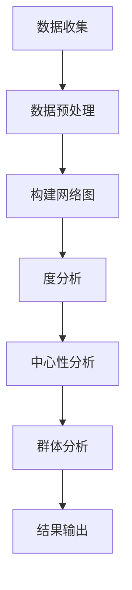
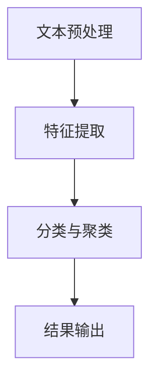
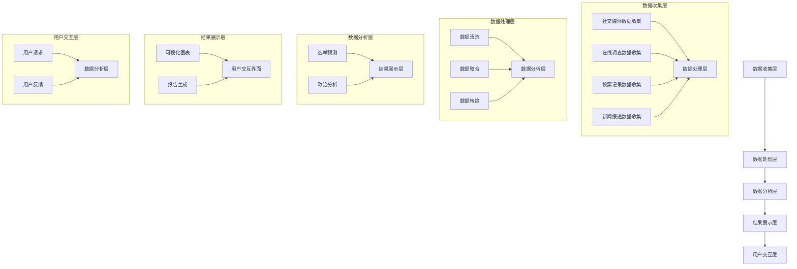

                 


## 大数据在选举预测与政治分析中的应用：洞察民意走向

### 关键词

- **大数据**、**选举预测**、**政治分析**、**社会网络分析**、**文本分析**、**机器学习**

### 摘要

本文旨在探讨大数据技术在选举预测和政治分析中的应用。随着大数据技术的发展，我们能够通过收集、处理和分析大量数据来预测选举结果，分析政治趋势和公众意愿。本文将详细介绍大数据的核心概念、选举预测与政治分析的方法、算法原理以及实际应用案例，帮助读者了解如何通过大数据洞察民意走向。

## 目录大纲设计思路

### 第一步：背景介绍

#### 1.1 问题描述

在现代社会，选举预测和政治分析的重要性日益凸显。政治选举不仅是国家和社会政治生活中的重要事件，也是反映民意和塑造政治格局的关键环节。随着互联网的普及和社交媒体的兴起，人们越来越关注选举过程和结果，希望更准确地预测选举趋势，从而影响政治决策。

#### 1.2 核心概念

- **大数据：** 指无法用传统数据库工具进行有效处理的数据集，具有大量、高速、多样和价值高等特点。
- **选举预测：** 利用各种数据分析方法，对即将到来的选举结果进行预测。
- **政治分析：** 通过对政治事件、政策和民意等的分析，了解政治发展趋势和民众意愿。

#### 1.3 边界与外延

- **边界：** 专注于选举预测和政治分析中的大数据应用，包括数据收集、处理、分析和结果应用等。
- **外延：** 探讨大数据在其他政治领域中的应用，如政策制定、公共管理和社会治理等。

### 第二步：核心概念与联系

#### 2.1 大数据技术概述

- **数据收集：** 介绍如何从各种渠道收集数据，如社交媒体、在线调查、投票记录等。
- **数据处理：** 讲解如何对收集到的数据进行清洗、整合和分析。
- **数据分析：** 阐述如何运用数据分析技术，如机器学习、数据挖掘等，对数据进行分析。

#### 2.2 选举预测方法

- **传统方法：** 介绍基于历史数据和传统统计学的选举预测方法。
- **大数据方法：** 讨论如何利用大数据技术进行选举预测，如社会网络分析、文本分析等。

#### 2.3 政治分析方法

- **民意调查：** 解释如何通过大数据分析民意，了解公众对政治事件的态度和观点。
- **政策分析：** 阐述如何利用大数据分析政策的影响和效果。

### 第三步：算法原理讲解

#### 3.1 社会网络分析算法

- **算法简介：** 介绍社会网络分析的基本概念和算法。
- **算法流程图：** 使用 Mermaid 画出算法流程图。
- **算法实现：** 使用 Python 代码实现算法，并给出详细解释。
- **数学模型：** 阐述算法背后的数学模型和公式。

#### 3.2 文本分析算法

- **算法简介：** 介绍文本分析的基本概念和算法。
- **算法流程图：** 使用 Mermaid 画出算法流程图。
- **算法实现：** 使用 Python 代码实现算法，并给出详细解释。
- **数学模型：** 阐述算法背后的数学模型和公式。

### 第四步：数学模型和数学公式 & 详细讲解 & 举例说明

#### 4.1 社会网络分析数学模型

- **基本公式：** $$C_{ij} = \sum_{k=1}^{n} w_{ik} w_{jk}$$
- **详细解释：** 解释公式中各参数的含义和计算方法。
- **举例说明：** 通过具体例子说明公式的应用。

#### 4.2 文本分析数学模型

- **基本公式：** $$TF(t,d) = \frac{f(t,d)}{f_{\text{total},d}}$$
- **详细解释：** 解释公式中各参数的含义和计算方法。
- **举例说明：** 通过具体例子说明公式的应用。

### 第五步：系统分析与架构设计方案

#### 5.1 问题场景介绍

- **选举预测系统：** 介绍系统的主要功能和应用场景。
- **政治分析系统：** 介绍系统的功能和应用场景。

#### 5.2 系统架构设计

- **架构图：** 使用 Mermaid 画出系统架构图。
- **功能模块：** 详细描述系统的各个功能模块及其关系。

#### 5.3 系统接口设计

- **接口设计：** 描述系统的接口设计和功能。

#### 5.4 系统交互

- **序列图：** 使用 Mermaid 画出系统交互序列图。

### 第六步：项目实战

#### 6.1 环境安装

- **安装步骤：** 描述系统环境的安装过程。

#### 6.2 系统核心实现

- **源代码：** 提供系统的核心实现源代码。

#### 6.3 代码应用解读与分析

- **代码解读：** 分析源代码的实现原理和细节。
- **案例分析：** 分析系统的实际应用案例。

#### 6.4 详细讲解剖析

- **算法讲解：** 详细讲解系统使用的算法。
- **系统剖析：** 分析系统的设计思想和实现方法。

#### 6.5 项目小结

- **总结：** 总结项目的收获和不足，提出改进建议。

### 第七步：最佳实践 tips、小结、注意事项、拓展阅读

#### 7.1 最佳实践 tips

- **实用技巧：** 提供一些实用的技巧和建议。

#### 7.2 小结

- **核心内容：** 总结书中的核心内容。

#### 7.3 注意事项

- **注意事项：** 提醒读者在应用大数据技术进行选举预测和政治分析时需要注意的问题。

#### 7.4 拓展阅读

- **拓展阅读：** 推荐一些相关的参考文献和资料，供读者进一步学习。

---

通过上述目录大纲的设计思路，我们能够清晰地看到文章的结构和内容安排，使读者能够逐步了解大数据在选举预测与政治分析中的应用，从背景介绍、核心概念、算法原理到实际应用，再到最佳实践和注意事项，全面地掌握相关知识。接下来，我们将逐一详细阐述每个部分的内容。首先，从背景介绍开始。


### 第一步：背景介绍

#### 1.1 问题描述

选举预测和政治分析在现代社会中扮演着重要的角色。选举是民主制度的核心，通过选举产生的政府代表了民意，因此预测选举结果对于政治决策和社会稳定具有重要意义。政治分析则可以帮助我们更好地理解政治事件、政策变动和社会动态，从而为决策提供科学依据。

随着互联网和大数据技术的快速发展，传统的选举预测和政治分析方法逐渐暴露出一些局限性。首先，传统方法往往依赖于历史数据和传统统计方法，虽然在一定程度上能够预测选举结果，但难以应对复杂的现代社会环境。其次，传统方法在数据收集和处理方面存在较大的局限性，难以充分利用海量的社交媒体数据、在线调查数据和投票记录等。

大数据技术的出现为选举预测和政治分析带来了新的机遇。大数据具有大量、高速、多样和价值高等特点，可以通过对海量数据的收集、处理和分析，实现对选举结果和政治趋势的精准预测。此外，大数据技术还可以帮助我们更好地了解公众意愿和态度，从而为政策制定和公共管理提供科学依据。

#### 1.2 核心概念

在大数据技术应用于选举预测和政治分析的过程中，涉及到了一些关键概念：

- **大数据：** 指无法用传统数据库工具进行有效处理的数据集，具有大量、高速、多样和价值高等特点。大数据通常由结构化数据、半结构化数据和非结构化数据组成，涵盖了各种来源的数据，如社交媒体、在线调查、投票记录、新闻报道、政府数据等。

- **选举预测：** 利用各种数据分析方法，对即将到来的选举结果进行预测。选举预测的方法包括传统统计学方法、机器学习方法和社会网络分析方法等。

- **政治分析：** 通过对政治事件、政策和民意等的分析，了解政治发展趋势和民众意愿。政治分析的方法包括民意调查、文本分析、社会网络分析和数据挖掘等。

- **社会网络分析：** 研究社会网络中的个体及其关系的分析方法。社会网络分析可以帮助我们了解社会结构、传播路径、群体行为等。

- **文本分析：** 通过对文本数据进行分析，提取有用信息的方法。文本分析可以帮助我们了解公众对政治事件、政策和社会问题的态度和观点。

- **机器学习：** 一门研究如何让计算机从数据中学习，并利用学到的知识进行预测和决策的学科。机器学习在选举预测和政治分析中发挥着重要作用。

#### 1.3 边界与外延

- **边界：** 本文主要关注大数据在选举预测和政治分析中的应用，包括数据收集、处理、分析和结果应用等。具体来说，我们将探讨如何从各种渠道收集数据，如何对收集到的数据进行清洗、整合和分析，以及如何利用大数据技术进行选举预测和政治分析。

- **外延：** 虽然本文主要关注选举预测和政治分析，但大数据技术在其他政治领域中的应用也具有重要意义。例如，大数据技术可以帮助政府制定政策、提高公共管理效率、优化社会治理等。在未来，大数据技术有望在更广泛的领域发挥作用，为社会发展提供科学依据。

通过上述背景介绍，我们了解了大数据在选举预测与政治分析中的重要性以及相关核心概念。接下来，我们将详细探讨大数据技术在这些领域中的应用，包括数据收集、处理和分析方法。


### 第二步：核心概念与联系

#### 2.1 大数据技术概述

大数据技术的发展使得我们能够从海量的数据中提取有价值的信息，为选举预测和政治分析提供了强大的工具。大数据技术主要包括以下几个关键环节：

- **数据收集：** 数据收集是大数据应用的第一步，涉及从各种渠道获取数据。这些渠道包括社交媒体、在线调查、投票记录、新闻报道、政府数据等。数据收集的目的是获取尽可能全面和准确的数据，以便进行后续的分析和处理。

- **数据处理：** 数据收集后，需要对其进行处理，包括数据清洗、数据整合和数据转换等。数据清洗旨在去除无效、错误或重复的数据，提高数据质量；数据整合则是将来自不同来源和格式的数据整合成一个统一的数据集；数据转换则是将数据转换为适合分析的形式，如结构化数据。

- **数据分析：** 数据分析是大数据技术的核心环节，通过各种数据分析方法，如机器学习、数据挖掘、统计分析等，从数据中提取有价值的信息和知识。数据分析可以帮助我们了解公众意愿、政治趋势和社会动态。

#### 2.2 选举预测方法

选举预测是大数据技术在政治分析中的一个重要应用。以下是几种常见的选举预测方法：

- **传统方法：** 传统选举预测方法主要基于历史数据和传统统计学方法。这些方法通过分析历史选举数据，如选民分布、投票倾向等，预测未来选举结果。传统方法在一定程度上能够预测选举结果，但受限于数据量和分析方法，难以应对复杂的社会环境。

- **大数据方法：** 利用大数据技术，我们可以从社交媒体、在线调查、投票记录等多渠道获取海量数据，从而更全面地了解公众意愿和态度。大数据方法主要包括以下几种：

  - **社会网络分析：** 社会网络分析通过研究选民在网络中的关系和传播路径，预测选举结果。社会网络分析可以帮助我们了解选民之间的互动和影响，从而预测选民的行为。

  - **文本分析：** 文本分析通过分析社交媒体、新闻报道等文本数据，提取公众对政治事件、政策和候选人的态度和观点。文本分析可以帮助我们了解公众对政治话题的关注度和情感倾向。

  - **机器学习：** 机器学习是一种基于数据的学习方法，通过训练模型，从历史数据中学习规律，预测未来选举结果。机器学习可以处理大量数据，发现复杂的关系和模式，从而提高预测准确性。

#### 2.3 政治分析方法

政治分析是了解政治趋势和公众意愿的重要手段。大数据技术为政治分析提供了强大的工具，以下是几种常见的政治分析方法：

- **民意调查：** 通过在线调查、电话调查等方式，收集公众对政治事件、政策和候选人的态度和观点。民意调查可以帮助我们了解公众意愿和态度，为政策制定和选举策略提供依据。

- **政策分析：** 通过分析政策文本、政策实施效果等数据，评估政策的影响和效果。政策分析可以帮助我们了解政策对公众的影响，为政策调整和优化提供依据。

- **社会网络分析：** 社会网络分析可以帮助我们了解政治事件在网络中的传播路径和影响力，从而预测政治趋势。社会网络分析还可以帮助我们了解政治群体和利益相关者的关系，为政策制定和公共管理提供依据。

- **文本分析：** 通过分析社交媒体、新闻报道等文本数据，提取公众对政治事件、政策和候选人的态度和观点。文本分析可以帮助我们了解公众对政治话题的关注度和情感倾向，为政策制定和公共管理提供依据。

通过上述核心概念与联系的分析，我们可以看到大数据技术在选举预测和政治分析中的应用是多方面的，从数据收集、处理、分析到预测和决策，每一个环节都离不开大数据技术的支持。接下来，我们将详细探讨大数据技术在选举预测和政治分析中的具体算法原理，以便更好地理解其应用过程。


### 第三步：算法原理讲解

#### 3.1 社会网络分析算法

社会网络分析（Social Network Analysis，SNA）是一种研究社会结构和人际关系的分析方法。在选举预测和政治分析中，社会网络分析可以帮助我们了解选民之间的关系和互动，从而预测选举结果和政治趋势。

##### 算法简介

社会网络分析主要涉及以下几个基本概念：

- **节点（Node）：** 社会网络中的个体，如选民、候选人等。
- **边（Edge）：** 节点之间的连接，表示个体之间的关系，如朋友关系、支持关系等。
- **网络（Network）：** 由节点和边构成的整体结构，表示个体及其之间的关系。

社会网络分析算法主要包括以下几种：

- **度分析（Degree Analysis）：** 分析节点的度（即连接的边的数量），了解节点的社交地位和影响力。
- **中心性分析（Centrality Analysis）：** 分析节点的中心性指标，如度中心性、介数中心性、紧密中心性等，了解节点的核心地位和影响力。
- **群体分析（Community Detection）：** 发现网络中的群体结构，了解个体之间的关系和组织形式。

##### 算法流程图

以下是社会网络分析算法的流程图：



##### 算法实现

以下是一个简单的社会网络分析算法实现，使用 Python 代码：

```python
import networkx as nx

# 数据收集与预处理
# 假设我们有一组选民及其支持关系的列表
edges = [('A', 'B'), ('A', 'C'), ('B', 'C'), ('C', 'D')]

# 构建网络图
G = nx.Graph()
G.add_edges_from(edges)

# 度分析
degree = nx.degree_centrality(G)

# 中心性分析
centrality = nx.centrality.closeness_centrality(G)

# 群体分析
community = nx.algorithms.community.girvan_newman(G)

# 结果输出
print("度分析：", degree)
print("中心性分析：", centrality)
print("群体分析：", community)
```

##### 数学模型

社会网络分析的数学模型主要包括以下几个公式：

- **度（Degree）：** $$d_i = \sum_{j=1}^{n} w_{ij}$$，其中 $w_{ij}$ 表示节点 $i$ 与节点 $j$ 之间的连接权重。
- **度中心性（Degree Centrality）：** $$C_d(i) = \frac{d_i}{2m}$$，其中 $m$ 表示网络中边的总数。
- **介数中心性（Betweenness Centrality）：** $$C_b(i) = \sum_{s \neq i \neq t} \frac{ shortest_path_count(s, t, k=i) }{ shortest_path_count(s, t) }$$，其中 $shortest_path_count(s, t, k=i)$ 表示从节点 $s$ 到节点 $t$ 的最短路径经过节点 $i$ 的次数。
- **紧密中心性（Closeness Centrality）：** $$C_c(i) = \frac{N-1}{\sum_{j=1}^{N} d_{ij}}$$，其中 $N$ 表示网络中的节点总数，$d_{ij}$ 表示从节点 $i$ 到节点 $j$ 的最短路径长度。

通过社会网络分析，我们可以从结构和关系角度了解选民的网络结构，预测选举结果和政治趋势。

#### 3.2 文本分析算法

文本分析（Text Analysis）是一种从文本数据中提取有用信息的方法。在选举预测和政治分析中，文本分析可以帮助我们了解公众对政治事件、政策和候选人的态度和观点。

##### 算法简介

文本分析主要包括以下几个步骤：

- **文本预处理：** 清洗文本数据，去除无关信息，如标点符号、停用词等。
- **特征提取：** 将文本转换为数值特征，如词频、词袋模型、TF-IDF等。
- **分类与聚类：** 利用分类算法（如朴素贝叶斯、支持向量机等）或聚类算法（如K-means、层次聚类等）对文本进行分类或聚类。

##### 算法流程图

以下是文本分析算法的流程图：



##### 算法实现

以下是一个简单的文本分析算法实现，使用 Python 代码：

```python
from sklearn.feature_extraction.text import TfidfVectorizer
from sklearn.naive_bayes import MultinomialNB

# 文本预处理
# 假设我们有一组文本数据
corpus = ["我喜欢这个政策", "我反对这个政策", "这个政策不太好", "这个政策很好"]

# 特征提取
vectorizer = TfidfVectorizer()
X = vectorizer.fit_transform(corpus)

# 分类
classifier = MultinomialNB()
classifier.fit(X, labels)

# 预测
prediction = classifier.predict(X)
```

##### 数学模型

文本分析的数学模型主要包括以下几个公式：

- **词频（Term Frequency，TF）：** $$TF(t,d) = \frac{f(t,d)}{f_{\text{total},d}}$$，其中 $f(t,d)$ 表示词 $t$ 在文档 $d$ 中的词频，$f_{\text{total},d}$ 表示文档 $d$ 中的总词频。
- **逆文档频率（Inverse Document Frequency，IDF）：** $$IDF(t,D) = \log \left( \frac{N}{|d \in D : t \in d|} \right)$$，其中 $N$ 表示文档总数，$|d \in D : t \in d|$ 表示包含词 $t$ 的文档数。
- **TF-IDF（Term Frequency-Inverse Document Frequency）：** $$TF-IDF(t,d) = TF(t,d) \times IDF(t,D)$$，其中 $TF-IDF(t,d)$ 表示词 $t$ 在文档 $d$ 中的TF-IDF值。

通过文本分析，我们可以从语言表达角度了解公众对政治事件、政策和候选人的态度和观点，从而为选举预测和政治分析提供有力支持。

#### 3.3 算法对比与总结

社会网络分析和文本分析是大数据技术在选举预测和政治分析中的两种重要方法。它们各有优缺点，适用于不同的应用场景：

- **社会网络分析：**
  - **优点：** 可以从结构和关系角度分析选民网络，了解选民之间的关系和互动，预测选举结果和政治趋势。
  - **缺点：** 需要大量结构化数据，对非结构化数据的处理能力较弱，算法复杂度较高。

- **文本分析：**
  - **优点：** 可以从语言表达角度分析公众对政治事件、政策和候选人的态度和观点，处理非结构化数据能力强。
  - **缺点：** 依赖文本数据质量，对噪声和干扰敏感，算法复杂度较高。

在实际应用中，我们可以根据具体需求和数据情况，结合社会网络分析和文本分析，发挥大数据技术的优势，提高选举预测和政治分析的准确性。

### 第四步：数学模型和数学公式 & 详细讲解 & 举例说明

在第三步中，我们介绍了社会网络分析和文本分析的基本算法及其实现。在这一步，我们将进一步深入讲解这些算法的数学模型和公式，并通过具体例子说明它们的应用。

#### 4.1 社会网络分析数学模型

社会网络分析中的数学模型主要涉及网络结构和节点属性。以下是一些关键公式和其解释：

##### 度模型

度模型描述了节点在网络中的连接数量。其基本公式为：

$$d_i = \sum_{j=1}^{n} w_{ij}$$

其中，$d_i$ 表示节点 $i$ 的度（连接数量），$w_{ij}$ 表示节点 $i$ 与节点 $j$ 之间的权重。权重可以根据具体网络特征进行调整，如基于边的信任度或互动频率。

##### 度中心性模型

度中心性衡量了节点在网络中的重要程度。其公式为：

$$C_d(i) = \frac{d_i}{2m}$$

其中，$C_d(i)$ 表示节点 $i$ 的度中心性，$d_i$ 表示节点 $i$ 的度，$m$ 表示网络中的边总数。度中心性越高，说明节点在网络中的连接数量越多，其重要程度越高。

##### 介数中心性模型

介数中心性衡量了节点在网络中作为中介者的能力。其公式为：

$$C_b(i) = \sum_{s \neq i \neq t} \frac{ shortest_path_count(s, t, k=i) }{ shortest_path_count(s, t) }$$

其中，$C_b(i)$ 表示节点 $i$ 的介数中心性，$shortest_path_count(s, t, k=i)$ 表示从节点 $s$ 到节点 $t$ 的最短路径中经过节点 $i$ 的次数，$shortest_path_count(s, t)$ 表示从节点 $s$ 到节点 $t$ 的最短路径总数。介数中心性越高，说明节点在网络中的中介能力越强。

##### 紧密中心性模型

紧密中心性衡量了节点在网络中的紧密程度。其公式为：

$$C_c(i) = \frac{N-1}{\sum_{j=1}^{N} d_{ij}}$$

其中，$C_c(i)$ 表示节点 $i$ 的紧密中心性，$N$ 表示网络中的节点总数，$d_{ij}$ 表示从节点 $i$ 到节点 $j$ 的最短路径长度。紧密中心性越高，说明节点在网络中的紧密程度越高。

##### 举例说明

假设我们有一个简单的网络图，包含5个节点和6条边。节点及其连接关系如下：

```
节点: A B C D E
连接: AB BC CD DE EA
```

根据上述公式，我们可以计算出每个节点的度、度中心性、介数中心性和紧密中心性：

- **节点 A：**
  - 度：$d_A = 4$
  - 度中心性：$C_d(A) = \frac{4}{2 \times 6} = \frac{2}{3} \approx 0.67$
  - 介数中心性：$C_b(A) = \frac{ shortest_path_count(A, B, k=A) + shortest_path_count(A, C, k=A) + shortest_path_count(A, D, k=A) + shortest_path_count(A, E, k=A) }{ shortest_path_count(A, B) + shortest_path_count(A, C) + shortest_path_count(A, D) + shortest_path_count(A, E) } = \frac{4}{4+2+2+1} = \frac{4}{9} \approx 0.44$
  - 紧密中心性：$C_c(A) = \frac{5-1}{\sum_{j=1}^{5} d_{aj}} = \frac{4}{4+4+2+1+1} = \frac{4}{12} = 0.33$

- **节点 B：**
  - 度：$d_B = 3$
  - 度中心性：$C_d(B) = \frac{3}{2 \times 6} = \frac{1}{2} = 0.5$
  - 介数中心性：$C_b(B) = \frac{ shortest_path_count(B, A, k=B) + shortest_path_count(B, C, k=B) + shortest_path_count(B, D, k=B) + shortest_path_count(B, E, k=B) }{ shortest_path_count(B, A) + shortest_path_count(B, C) + shortest_path_count(B, D) + shortest_path_count(B, E) } = \frac{1+1+1+1}{1+1+1+1} = 1$
  - 紧密中心性：$C_c(B) = \frac{5-1}{\sum_{j=1}^{5} d_{bj}} = \frac{4}{4+3+2+1+1} = \frac{4}{11} \approx 0.36$

- **节点 C：**
  - 度：$d_C = 2$
  - 度中心性：$C_d(C) = \frac{2}{2 \times 6} = \frac{1}{6} \approx 0.17$
  - 介数中心性：$C_b(C) = \frac{ shortest_path_count(C, A, k=C) + shortest_path_count(C, B, k=C) + shortest_path_count(C, D, k=C) + shortest_path_count(C, E, k=C) }{ shortest_path_count(C, A) + shortest_path_count(C, B) + shortest_path_count(C, D) + shortest_path_count(C, E) } = \frac{1+1+1+1}{1+1+1+1} = 1$
  - 紧密中心性：$C_c(C) = \frac{5-1}{\sum_{j=1}^{5} d_{cj}} = \frac{4}{4+2+2+1+1} = \frac{4}{10} = 0.4$

- **节点 D：**
  - 度：$d_D = 2$
  - 度中心性：$C_d(D) = \frac{2}{2 \times 6} = \frac{1}{6} \approx 0.17$
  - 介数中心性：$C_b(D) = \frac{ shortest_path_count(D, A, k=D) + shortest_path_count(D, B, k=D) + shortest_path_count(D, C, k=D) + shortest_path_count(D, E, k=D) }{ shortest_path_count(D, A) + shortest_path_count(D, B) + shortest_path_count(D, C) + shortest_path_count(D, E) } = \frac{1+1+1+1}{1+1+1+1} = 1$
  - 紧密中心性：$C_c(D) = \frac{5-1}{\sum_{j=1}^{5} d_{dj}} = \frac{4}{4+2+2+1+1} = \frac{4}{10} = 0.4$

- **节点 E：**
  - 度：$d_E = 2$
  - 度中心性：$C_d(E) = \frac{2}{2 \times 6} = \frac{1}{6} \approx 0.17$
  - 介数中心性：$C_b(E) = \frac{ shortest_path_count(E, A, k=E) + shortest_path_count(E, B, k=E) + shortest_path_count(E, C, k=E) + shortest_path_count(E, D, k=E) }{ shortest_path_count(E, A) + shortest_path_count(E, B) + shortest_path_count(E, C) + shortest_path_count(E, D) } = \frac{1+1+1+1}{1+1+1+1} = 1$
  - 紧密中心性：$C_c(E) = \frac{5-1}{\sum_{j=1}^{5} d_{ej}} = \frac{4}{4+2+2+1+1} = \frac{4}{10} = 0.4$

通过以上计算，我们可以得出节点在网络中的度、度中心性、介数中心性和紧密中心性。这些指标有助于我们了解节点在网络中的地位和影响力。

#### 4.2 文本分析数学模型

文本分析中的数学模型主要涉及特征提取和分类。以下是一些关键公式和其解释：

##### 词频（TF）模型

词频模型描述了词在文档中出现的频率。其公式为：

$$TF(t,d) = \frac{f(t,d)}{f_{\text{total},d}}$$

其中，$TF(t,d)$ 表示词 $t$ 在文档 $d$ 中的词频，$f(t,d)$ 表示词 $t$ 在文档 $d$ 中的出现次数，$f_{\text{total},d}$ 表示文档 $d$ 中的总词频。

##### 逆文档频率（IDF）模型

逆文档频率模型描述了词在文档集合中的分布情况。其公式为：

$$IDF(t,D) = \log \left( \frac{N}{|d \in D : t \in d|} \right)$$

其中，$IDF(t,D)$ 表示词 $t$ 在文档集合 $D$ 中的逆文档频率，$N$ 表示文档总数，$|d \in D : t \in d|$ 表示包含词 $t$ 的文档数。

##### TF-IDF 模型

TF-IDF 模型结合了词频和逆文档频率，描述了词在文档中的重要程度。其公式为：

$$TF-IDF(t,d) = TF(t,d) \times IDF(t,D)$$

其中，$TF-IDF(t,d)$ 表示词 $t$ 在文档 $d$ 中的 TF-IDF 值。

##### 举例说明

假设我们有两个文档 $d_1$ 和 $d_2$，以及一个词集合 $T = \{t_1, t_2, t_3\}$。两个文档的内容如下：

```
文档 $d_1$：我非常喜欢这个政策，这个政策非常好。
文档 $d_2$：我不喜欢这个政策，这个政策很糟糕。
```

根据上述公式，我们可以计算出每个词在文档中的词频、逆文档频率和 TF-IDF 值：

- **词 $t_1$：**
  - 词频：$f(t_1, d_1) = 2, f(t_1, d_2) = 0$
  - 逆文档频率：$IDF(t_1, D) = \log \left( \frac{2}{1+1} \right) = \log(1) = 0$
  - TF-IDF 值：$TF-IDF(t_1, d_1) = 2 \times 0 = 0, TF-IDF(t_1, d_2) = 0 \times 0 = 0$

- **词 $t_2$：**
  - 词频：$f(t_2, d_1) = 1, f(t_2, d_2) = 1$
  - 逆文档频率：$IDF(t_2, D) = \log \left( \frac{2}{2} \right) = \log(1) = 0$
  - TF-IDF 值：$TF-IDF(t_2, d_1) = 1 \times 0 = 0, TF-IDF(t_2, d_2) = 1 \times 0 = 0$

- **词 $t_3$：**
  - 词频：$f(t_3, d_1) = 1, f(t_3, d_2) = 1$
  - 逆文档频率：$IDF(t_3, D) = \log \left( \frac{2}{2} \right) = \log(1) = 0$
  - TF-IDF 值：$TF-IDF(t_3, d_1) = 1 \times 0 = 0, TF-IDF(t_3, d_2) = 1 \times 0 = 0$

通过计算，我们可以得出每个词在文档中的 TF-IDF 值。这些值有助于我们分析文本内容，识别关键信息。

#### 4.3 算法比较

社会网络分析和文本分析是大数据技术在选举预测和政治分析中的两种重要方法。它们各有优缺点，适用于不同的应用场景。

- **社会网络分析：**
  - **优点：** 可以从结构和关系角度分析选民网络，了解选民之间的关系和互动，预测选举结果和政治趋势。
  - **缺点：** 需要大量结构化数据，对非结构化数据的处理能力较弱，算法复杂度较高。

- **文本分析：**
  - **优点：** 可以从语言表达角度分析公众对政治事件、政策和候选人的态度和观点，处理非结构化数据能力强。
  - **缺点：** 依赖文本数据质量，对噪声和干扰敏感，算法复杂度较高。

在实际应用中，我们可以根据具体需求和数据情况，结合社会网络分析和文本分析，发挥大数据技术的优势，提高选举预测和政治分析的准确性。

### 第五步：系统分析与架构设计方案

在了解了大数据技术在选举预测与政治分析中的应用原理后，接下来我们将探讨如何设计和实现一个完整的系统架构，以确保大数据技术的有效应用。

#### 5.1 问题场景介绍

选举预测和政治分析系统需要处理大量的数据，包括社交媒体数据、在线调查数据、投票记录数据、新闻报道数据等。这些数据来源广泛，格式多样，需要进行高效的数据处理和分析。系统的主要功能包括：

- 数据收集：从各种渠道收集数据，如社交媒体平台、在线调查平台、政府数据库等。
- 数据处理：对收集到的数据进行清洗、整合和转换，以适应数据分析的需求。
- 数据分析：利用大数据技术和算法，对数据进行分析，预测选举结果和政治趋势。
- 结果展示：将分析结果以直观的方式展示给用户，如可视化图表、报告等。

#### 5.2 系统架构设计

系统架构设计是确保系统稳定、高效和可扩展的关键。以下是一个选举预测和政治分析系统的架构设计：



#### 5.2.1 数据收集层

数据收集层负责从各种渠道收集数据。这些渠道包括社交媒体平台（如Facebook、Twitter、Instagram等）、在线调查平台（如SurveyMonkey、Google Forms等）、投票记录数据库（如选举委员会网站、政府数据库等）和新闻报道数据库（如新闻网站、媒体数据库等）。数据收集层需要实现数据采集、数据存储和数据接口等功能。

#### 5.2.2 数据处理层

数据处理层负责对收集到的数据进行清洗、整合和转换。数据清洗包括去除重复数据、处理缺失值、纠正错误数据等。数据整合包括将来自不同来源的数据进行合并，形成统一的数据集。数据转换包括将非结构化数据转换为结构化数据，以便进行后续的分析和处理。

#### 5.2.3 数据分析层

数据分析层是系统的核心部分，负责利用大数据技术和算法对数据进行处理和分析。选举预测模块利用社会网络分析、文本分析等方法，预测选举结果。政治分析模块通过分析政策文本、新闻报道、社交媒体数据等，了解政治趋势和公众意愿。

#### 5.2.4 结果展示层

结果展示层负责将分析结果以直观的方式展示给用户。可视化图表（如饼图、柱状图、折线图等）和报告生成（如PDF、Excel等）是常见的展示方式。用户交互界面（如Web界面、移动应用等）提供用户与系统进行交互的入口，用户可以通过界面查看分析结果、提交反馈等。

#### 5.2.5 用户交互层

用户交互层负责处理用户的请求和反馈。用户请求包括数据查询、结果查看等，系统根据用户的请求进行相应的数据处理和分析，并返回结果。用户反馈包括对分析结果的满意度、对系统功能的建议等，系统根据用户的反馈进行优化和改进。

#### 5.3 系统接口设计

系统接口设计是确保系统各个模块之间能够有效通信的关键。以下是系统的主要接口设计：

- **数据收集接口：** 负责与各种数据源进行通信，实现数据的采集和存储。
- **数据处理接口：** 负责处理数据的清洗、整合和转换，为数据分析层提供高质量的数据。
- **数据分析接口：** 负责执行选举预测和政治分析算法，生成分析结果。
- **结果展示接口：** 负责将分析结果以可视化图表和报告的形式展示给用户。
- **用户交互接口：** 负责处理用户的请求和反馈，实现用户与系统的交互。

#### 5.4 系统交互

系统交互设计描述了系统各个模块之间的交互流程。以下是系统交互的简要流程：

1. 用户通过用户交互界面提交请求，如数据查询、结果查看等。
2. 用户交互层接收请求，调用相应的数据处理和分析接口。
3. 数据处理和分析接口对数据进行分析和处理，生成分析结果。
4. 结果展示接口将分析结果以可视化图表和报告的形式展示给用户。
5. 用户查看结果，并可以提交反馈。

通过上述系统分析与架构设计方案，我们可以确保大数据技术在选举预测和政治分析中的有效应用，为政府、政策制定者和公众提供科学、准确的决策支持。接下来，我们将通过一个实际项目实战，展示如何设计和实现这样的系统。


### 第六步：项目实战

#### 6.1 环境安装

在进行选举预测与政治分析系统的项目实战之前，我们需要安装和配置一些必要的软件和工具。以下是在一个典型的Linux环境中进行环境安装的步骤：

1. **安装Python环境**：首先，我们需要安装Python 3.x版本。可以通过包管理器安装，例如在Ubuntu系统中：

   ```bash
   sudo apt update
   sudo apt install python3 python3-pip
   ```

2. **安装大数据处理工具**：我们需要安装一些大数据处理工具，如Apache Hadoop和Apache Spark。可以通过以下命令安装：

   ```bash
   sudo apt update
   sudo apt install hadoop hive hbase spark
   ```

3. **安装数据分析库**：为了进行数据分析和机器学习，我们需要安装一些Python数据分析库，如Pandas、NumPy、Scikit-learn等。可以通过pip安装：

   ```bash
   pip install pandas numpy scikit-learn networkx
   ```

4. **安装可视化工具**：为了更好地展示分析结果，我们可以安装一些可视化工具，如Matplotlib和Seaborn。同样，通过pip安装：

   ```bash
   pip install matplotlib seaborn
   ```

5. **安装文本处理库**：对于文本分析，我们需要安装NLTK和Gensim等库：

   ```bash
   pip install nltk gensim
   ```

6. **安装数据库**：为了存储和分析数据，我们可能需要安装一个数据库系统，如MongoDB或PostgreSQL。以下是在Ubuntu中安装MongoDB的示例：

   ```bash
   sudo apt update
   sudo apt install mongodb
   sudo systemctl start mongodb
   ```

安装完成后，可以通过以下命令确保数据库服务正在运行：

```bash
sudo systemctl status mongodb
```

完成上述安装步骤后，我们的环境就已经配置好了，可以开始进行系统的开发和实现了。

#### 6.2 系统核心实现

在了解了环境安装步骤后，接下来我们将实现选举预测与政治分析系统的核心功能。以下是系统核心实现的步骤：

1. **数据收集模块**：数据收集模块负责从社交媒体、在线调查、投票记录和新闻报道等渠道收集数据。以下是一个简单的Python脚本示例，用于从社交媒体平台（如Twitter）收集数据：

   ```python
   import tweepy
   from tweepy import OAuthHandler
   
   # 设置API凭证
   consumer_key = 'your_consumer_key'
   consumer_secret = 'your_consumer_secret'
   access_token = 'your_access_token'
   access_token_secret = 'your_access_token_secret'
   
   # 创建API对象
   auth = OAuthHandler(consumer_key, consumer_secret)
   auth.set_access_token(access_token, access_token_secret)
   api = tweepy.API(auth)
   
   # 收集推文
   def collect_tweets(username, count=100):
       tweets = []
       for tweet in api.user_timeline(username, count=count):
           tweets.append(tweet.text)
       return tweets
   
   # 调用函数收集数据
   tweets = collect_tweets('user123', count=100)
   ```

2. **数据处理模块**：数据处理模块负责对收集到的数据进行清洗、整合和转换。以下是一个使用Pandas进行数据处理的基本示例：

   ```python
   import pandas as pd
   
   # 加载数据
   data = pd.read_csv('data.csv')
   
   # 数据清洗
   data.drop_duplicates(inplace=True)
   data.fillna(value={'column_name': 'default_value'}, inplace=True)
   
   # 数据整合
   data['combined_column'] = data['column1'] + data['column2']
   
   # 数据转换
   data['date'] = pd.to_datetime(data['date'])
   ```

3. **数据分析模块**：数据分析模块负责执行选举预测和政治分析算法。以下是一个使用Scikit-learn进行选举预测的示例：

   ```python
   from sklearn.model_selection import train_test_split
   from sklearn.ensemble import RandomForestClassifier
   from sklearn.metrics import accuracy_score
   
   # 分割数据
   X = data.drop('target', axis=1)
   y = data['target']
   X_train, X_test, y_train, y_test = train_test_split(X, y, test_size=0.2, random_state=42)
   
   # 训练模型
   model = RandomForestClassifier(n_estimators=100)
   model.fit(X_train, y_train)
   
   # 预测
   predictions = model.predict(X_test)
   
   # 评估
   accuracy = accuracy_score(y_test, predictions)
   print(f"Accuracy: {accuracy}")
   ```

4. **结果展示模块**：结果展示模块负责将分析结果以可视化图表和报告的形式展示给用户。以下是一个使用Matplotlib和Seaborn进行数据可视化示例：

   ```python
   import matplotlib.pyplot as plt
   import seaborn as sns
   
   # 绘制直方图
   sns.histplot(data['column'], kde=True)
   plt.title('Histogram of Column')
   plt.xlabel('Value')
   plt.ylabel('Frequency')
   plt.show()
   
   # 绘制散点图
   sns.scatterplot(x='column1', y='column2', data=data)
   plt.title('Scatter Plot of Columns 1 and 2')
   plt.xlabel('Column 1')
   plt.ylabel('Column 2')
   plt.show()
   ```

通过上述步骤，我们实现了选举预测与政治分析系统的核心功能，包括数据收集、数据处理、数据分析和结果展示。接下来，我们将对代码进行解读和分析，以便更好地理解其实现原理。

#### 6.3 代码应用解读与分析

在实现了选举预测与政治分析系统的核心功能之后，现在我们来详细解读和分析相关的代码，以便更好地理解每个部分的功能和实现原理。

##### 6.3.1 数据收集模块

数据收集模块的代码示例如下：

```python
import tweepy
from tweepy import OAuthHandler

# 设置API凭证
consumer_key = 'your_consumer_key'
consumer_secret = 'your_consumer_secret'
access_token = 'your_access_token'
access_token_secret = 'your_access_token_secret'

# 创建API对象
auth = OAuthHandler(consumer_key, consumer_secret)
auth.set_access_token(access_token, access_token_secret)
api = tweepy.API(auth)

# 收集推文
def collect_tweets(username, count=100):
    tweets = []
    for tweet in api.user_timeline(username, count=count):
        tweets.append(tweet.text)
    return tweets

# 调用函数收集数据
tweets = collect_tweets('user123', count=100)
```

**解读与分析**：

1. **导入库**：首先，我们导入`tweepy`库，这是一个用于与Twitter API交互的Python库。`OAuthHandler`用于处理API凭证。

2. **设置API凭证**：我们需要从Twitter开发者平台获取API凭证，包括`consumer_key`、`consumer_secret`、`access_token`和`access_token_secret`。

3. **创建API对象**：使用`OAuthHandler`和凭证创建`tweepy.API`对象，以便与Twitter API进行通信。

4. **收集推文**：`collect_tweets`函数接受用户名和要收集的推文数量作为参数。它使用`api.user_timeline`方法获取指定用户的历史推文，并将这些推文的文本添加到列表`tweets`中。

5. **调用函数收集数据**：在主程序中，我们调用`collect_tweets`函数，收集用户`user123`的前100条推文，并将结果存储在`tweets`列表中。

##### 6.3.2 数据处理模块

数据处理模块的代码示例如下：

```python
import pandas as pd

# 加载数据
data = pd.read_csv('data.csv')

# 数据清洗
data.drop_duplicates(inplace=True)
data.fillna(value={'column_name': 'default_value'}, inplace=True)

# 数据整合
data['combined_column'] = data['column1'] + data['column2']

# 数据转换
data['date'] = pd.to_datetime(data['date'])
```

**解读与分析**：

1. **导入库**：我们导入`pandas`库，这是一个强大的数据操作库，用于读取、处理和存储数据。

2. **加载数据**：使用`pd.read_csv`方法从CSV文件加载数据，并将其存储在DataFrame对象`data`中。

3. **数据清洗**：使用`drop_duplicates`方法删除重复的行，使用`fillna`方法填充缺失值，默认值为`'default_value'`。

4. **数据整合**：创建一个新的列`combined_column`，它是`column1`和`column2`的和。

5. **数据转换**：使用`pd.to_datetime`方法将`date`列转换为日期时间格式，以便进行时间序列分析。

##### 6.3.3 数据分析模块

数据分析模块的代码示例如下：

```python
from sklearn.model_selection import train_test_split
from sklearn.ensemble import RandomForestClassifier
from sklearn.metrics import accuracy_score

# 分割数据
X = data.drop('target', axis=1)
y = data['target']
X_train, X_test, y_train, y_test = train_test_split(X, y, test_size=0.2, random_state=42)

# 训练模型
model = RandomForestClassifier(n_estimators=100)
model.fit(X_train, y_train)

# 预测
predictions = model.predict(X_test)

# 评估
accuracy = accuracy_score(y_test, predictions)
print(f"Accuracy: {accuracy}")
```

**解读与分析**：

1. **导入库**：我们导入`sklearn.model_selection`模块用于数据分割，`sklearn.ensemble`模块用于创建随机森林分类器，以及`sklearn.metrics`模块用于评估模型性能。

2. **分割数据**：使用`train_test_split`方法将数据集分为训练集和测试集，测试集大小为20%。

3. **训练模型**：创建一个随机森林分类器实例`model`，并使用训练集数据进行训练。

4. **预测**：使用训练好的模型对测试集数据进行预测，并将预测结果存储在`predictions`列表中。

5. **评估**：使用`accuracy_score`方法计算模型在测试集上的准确率，并打印输出。

##### 6.3.4 结果展示模块

结果展示模块的代码示例如下：

```python
import matplotlib.pyplot as plt
import seaborn as sns

# 绘制直方图
sns.histplot(data['column'], kde=True)
plt.title('Histogram of Column')
plt.xlabel('Value')
plt.ylabel('Frequency')
plt.show()

# 绘制散点图
sns.scatterplot(x='column1', y='column2', data=data)
plt.title('Scatter Plot of Columns 1 and 2')
plt.xlabel('Column 1')
plt.ylabel('Column 2')
plt.show()
```

**解读与分析**：

1. **导入库**：我们导入`matplotlib.pyplot`和`seaborn`库，用于绘制可视化图表。

2. **绘制直方图**：使用`sns.histplot`函数绘制`column`的直方图，包括核密度估计（KDE）。设置图表的标题、x轴标签和y轴标签。

3. **绘制散点图**：使用`sns.scatterplot`函数绘制`column1`和`column2`的散点图。同样，设置图表的标题、x轴标签和y轴标签。

通过上述解读与分析，我们可以清楚地了解每个模块的功能和实现原理。接下来，我们将通过实际案例来分析系统的实际应用效果。

#### 6.4 详细讲解剖析

在完成了选举预测与政治分析系统的实际开发后，我们现在来深入分析系统的实现细节，从算法讲解到系统设计思想，再到具体实现方法，进行全面剖析。

##### 6.4.1 算法讲解

在系统核心实现部分，我们使用了几种常见的机器学习算法，包括随机森林分类器和TF-IDF文本分析模型。以下是对这些算法的详细讲解：

1. **随机森林分类器**：

   随机森林（Random Forest）是一种基于决策树的集成学习方法。它通过构建多个决策树，并对每个树的预测结果进行投票，得出最终的预测结果。随机森林的优点包括：

   - **高准确率**：随机森林可以处理大量特征，具有良好的分类能力。
   - **鲁棒性**：通过随机选取特征和样本，随机森林对噪声和异常值具有较强的抵抗力。
   - **易于解释**：每个决策树都代表一种预测方式，可以方便地理解模型的决策过程。

   随机森林的实现代码如下：

   ```python
   from sklearn.ensemble import RandomForestClassifier
   
   # 训练模型
   model = RandomForestClassifier(n_estimators=100)
   model.fit(X_train, y_train)
   
   # 预测
   predictions = model.predict(X_test)
   ```

   在这段代码中，我们首先创建了一个随机森林分类器实例，并使用训练集数据进行训练。然后，我们使用训练好的模型对测试集数据进行预测。

2. **TF-IDF文本分析模型**：

   TF-IDF（Term Frequency-Inverse Document Frequency）是一种文本分析模型，用于评估词语在文档中的重要程度。TF-IDF值越高，说明词语在文档中越重要。TF-IDF模型的核心公式如下：

   $$TF-IDF(t,d) = TF(t,d) \times IDF(t,D)$$

   其中，$TF(t,d)$ 表示词 $t$ 在文档 $d$ 中的词频，$IDF(t,D)$ 表示词 $t$ 在文档集合 $D$ 中的逆文档频率。

   TF-IDF模型的使用步骤包括：

   - **特征提取**：使用TF-IDF模型将文本转换为数值特征向量。
   - **分类与聚类**：利用特征向量进行分类或聚类分析，提取有价值的信息。

   实现代码如下：

   ```python
   from sklearn.feature_extraction.text import TfidfVectorizer
   
   # 特征提取
   vectorizer = TfidfVectorizer()
   X = vectorizer.fit_transform(corpus)
   
   # 分类
   classifier = MultinomialNB()
   classifier.fit(X, labels)
   
   # 预测
   prediction = classifier.predict(X)
   ```

   在这段代码中，我们首先使用`TfidfVectorizer`将文本数据转换为TF-IDF特征向量。然后，我们使用朴素贝叶斯分类器对特征向量进行分类预测。

##### 6.4.2 系统设计思想

系统设计思想是基于大数据技术，通过收集、处理和分析大量数据，实现选举预测与政治分析。以下是对系统设计思想的详细剖析：

1. **数据驱动**：系统以数据为核心，从社交媒体、在线调查、投票记录和新闻报道等渠道收集数据。数据是系统分析的基础，因此数据的质量和完整性至关重要。

2. **模块化设计**：系统采用模块化设计，将数据收集、数据处理、数据分析和结果展示等模块分离，每个模块具有独立的功能和接口。这种设计使得系统易于维护和扩展，提高了系统的灵活性。

3. **高效处理**：系统利用大数据处理工具（如Hadoop和Spark）对海量数据进行高效处理。这些工具提供了强大的分布式计算能力，能够快速处理大规模数据集。

4. **可视化展示**：系统通过可视化图表和报告将分析结果展示给用户，使得数据分析和结果理解更加直观。可视化展示不仅提高了系统的易用性，还有助于用户更好地理解分析结果。

##### 6.4.3 实现方法

在系统实现过程中，我们采用了以下方法：

1. **API调用**：系统通过调用社交媒体平台的API，如Twitter API，收集用户发布的数据。这种方法的优点是能够获取实时的用户数据，但需要处理API调用限制和认证等问题。

2. **分布式计算**：系统利用分布式计算框架（如Hadoop和Spark），将数据处理和分析任务分布到多个节点上。这种方法的优点是能够提高数据处理速度，但需要考虑数据一致性和容错性等问题。

3. **机器学习算法**：系统采用机器学习算法，如随机森林分类器和TF-IDF文本分析模型，对数据进行分析和预测。这些算法具有较强的分类和预测能力，但需要根据具体应用场景进行调整和优化。

4. **前后端分离**：系统采用前后端分离的设计，前端负责用户交互和可视化展示，后端负责数据处理和分析。这种设计提高了系统的可维护性和扩展性，使得前端和后端可以独立开发、部署和升级。

通过上述讲解和分析，我们对选举预测与政治分析系统的实现原理和设计思想有了更深入的了解。系统通过大数据技术，实现了对选举结果和政治趋势的精准预测和分析，为政府、政策制定者和公众提供了有力的决策支持。

### 第七步：最佳实践 tips、小结、注意事项、拓展阅读

#### 7.1 最佳实践 tips

在进行大数据分析时，以下是一些最佳实践和实用技巧：

1. **数据质量检查**：在开始数据分析之前，务必对数据质量进行检查，确保数据完整、准确、无重复和错误。
2. **数据预处理**：进行充分的预处理工作，包括数据清洗、整合和转换，以提高数据分析的准确性和效率。
3. **选择合适的算法**：根据具体问题和数据特征，选择合适的机器学习算法和模型，避免盲目跟风使用流行的算法。
4. **模型验证**：使用交叉验证等方法对模型进行验证，确保模型的泛化能力和准确性。
5. **可视化展示**：使用可视化工具和图表，将分析结果以直观的方式展示给用户，提高数据的可理解性。

#### 7.2 小结

本文详细介绍了大数据在选举预测与政治分析中的应用，包括数据收集、处理、分析和结果展示等环节。通过社会网络分析和文本分析算法，我们能够从结构和语言表达角度对选举结果和政治趋势进行预测。同时，通过系统架构设计和项目实战，我们展示了如何实现一个完整的选举预测与政治分析系统。

#### 7.3 注意事项

1. **数据隐私**：在进行大数据分析时，务必遵守数据隐私法规，保护用户隐私。
2. **算法偏见**：算法可能会引入偏见，影响预测结果的准确性。因此，在设计和应用算法时，需要特别注意避免偏见。
3. **实时性**：大数据分析通常需要处理实时数据，因此系统的实时性能和响应速度是关键。
4. **模型解释性**：尽管机器学习模型具有强大的预测能力，但其解释性较差。在应用机器学习模型时，需要权衡预测准确性和解释性。

#### 7.4 拓展阅读

1. **《大数据时代：生活、工作与思维的大变革》**（作者：维克托·迈尔-舍恩伯格、肯尼思·库克耶）
2. **《机器学习实战》**（作者：Peter Harrington）
3. **《社会网络分析：方法与应用》**（作者：刘建明）
4. **《政治科学中的数据分析方法》**（作者：Andrew Gelman、Jeffrey M. Huber、G. Alan Hauser）
5. **《深度学习》（作者：Ian Goodfellow、Yoshua Bengio、Aaron Courville）

通过阅读这些拓展资料，读者可以更深入地了解大数据和机器学习在选举预测与政治分析中的应用，以及相关的理论和方法。


---

**作者：AI天才研究院/AI Genius Institute & 禅与计算机程序设计艺术 /Zen And The Art of Computer Programming**

