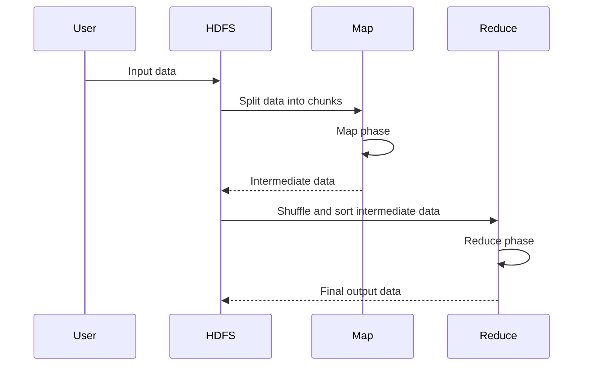
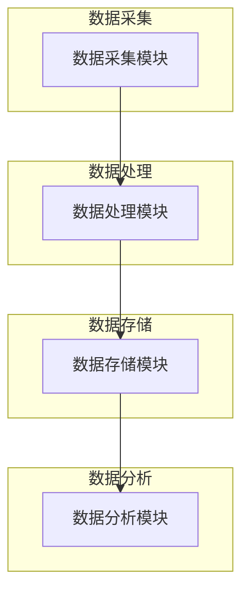
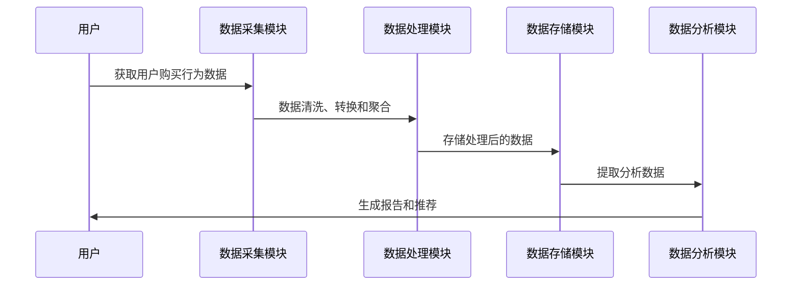

                 

### 大数据处理框架：从批处理到流处理

> 关键词：大数据处理、批处理、流处理、Hadoop、Spark、Kafka、Flink、Storm

> 摘要：本文将深入探讨大数据处理框架，从批处理到流处理的发展历程。我们将首先介绍大数据的背景与挑战，随后详细解析批处理框架（Hadoop和Spark）的工作原理及其应用场景。接着，我们将转向流处理框架，包括Kafka、Flink和Storm，讲解它们的架构与编程模型。最后，我们将比较各框架的特点，并提出实际应用中的选型策略，以及展望大数据处理框架的未来发展趋势。

### 第一部分：大数据处理基础理论

#### 第1章：大数据背景与挑战

##### 1.1 大数据概述

大数据指的是那些数据量巨大、类型繁多且生成速度极快的数据集合。这些数据通常无法使用传统的关系数据库系统进行高效处理。大数据有以下几个显著特征：

- **大量数据（Volume）**：数据量达到PB级别，甚至ZB级别。
- **多样数据（Variety）**：数据类型包括结构化数据、半结构化数据和非结构化数据。
- **高速数据（Velocity）**：数据生成速度极快，需要实时或近乎实时处理。
- **价值密度低（Value）**：数据中只有一小部分具有实际价值。

##### 1.2 大数据处理的需求

大数据处理的需求主要体现在以下几个方面：

- **数据存储需求**：需要高效的分布式文件系统进行数据存储，如HDFS。
- **数据处理需求**：需要能够处理海量数据的高效计算框架，如MapReduce和Spark。
- **数据分析需求**：需要能够对数据进行分析和挖掘的工具，如Hive和Spark SQL。

##### 1.3 大数据处理的技术框架

当前主流的大数据处理技术框架包括Hadoop生态系统和Spark生态系统。Hadoop由HDFS、MapReduce和YARN等核心组件组成，而Spark则提供了更加高效的数据处理能力，特别是在内存计算方面。

### 第二部分：批处理框架

#### 第2章：Hadoop生态系统

##### 2.1 Hadoop简介

Hadoop是一个开源的分布式计算框架，主要用于处理大规模数据集。Hadoop生态系统包括以下几个核心组件：

- **HDFS**：分布式文件系统，用于存储海量数据。
- **MapReduce**：编程模型，用于处理大规模数据集。
- **YARN**：资源调度框架，用于管理计算资源。

##### 2.2 MapReduce编程模型

MapReduce是一种编程模型，用于大规模数据的并行处理。它将数据处理过程分为两个阶段：Map阶段和Reduce阶段。

- **Map阶段**：对输入数据进行分区、排序和映射。
- **Reduce阶段**：对映射结果进行归约和汇总。

##### 2.3 YARN资源调度框架

YARN（Yet Another Resource Negotiator）是Hadoop生态系统中的资源调度框架。它将资源管理和任务调度分离，使得Hadoop能够更好地支持多种数据处理应用。

##### 2.4 Hadoop生态系统其他组件

Hadoop生态系统还包括其他一些重要组件，如HBase（NoSQL数据库）、Hive（数据仓库）和Pig（数据处理框架）。

#### 第3章：Spark生态系统

##### 3.1 Spark简介

Spark是一个开源的分布式计算引擎，提供了比Hadoop更高性能的数据处理能力。Spark的主要特点包括：

- **内存计算**：Spark可以将数据存储在内存中，从而大幅减少数据的磁盘I/O操作。
- **易用性**：Spark提供了丰富的API，包括Scala、Java、Python和R等。
- **功能丰富**：Spark支持批处理、流处理和机器学习等多种数据处理任务。

##### 3.2 Spark编程模型

Spark提供了两种编程模型：Spark SQL和Spark Streaming。

- **Spark SQL**：用于结构化数据的查询和处理。
- **Spark Streaming**：用于实时数据流处理。

##### 3.3 Spark核心组件

Spark的核心组件包括Spark SQL、Spark Streaming和MLlib。

- **Spark SQL**：提供SQL查询功能，支持结构化数据。
- **Spark Streaming**：提供实时数据流处理功能。
- **MLlib**：提供机器学习算法库。

### 第三部分：流处理框架

#### 第4章：Kafka流处理系统

##### 4.1 Kafka简介

Kafka是一个分布式流处理平台，主要用于大规模消息的实时处理。Kafka具有以下特点：

- **高吞吐量**：支持数千个TPS级别的消息处理。
- **高可靠性**：支持数据持久化，确保消息不丢失。
- **可扩展性**：支持水平扩展，可以轻松增加或减少节点数量。

##### 4.2 Kafka数据流处理流程

Kafka的数据流处理流程主要包括生产者、消费者和主题。

- **Kafka生产者**：负责生产消息，并将其发送到Kafka集群。
- **Kafka消费者**：负责消费消息，并处理来自Kafka集群的消息。
- **主题（Topic）**：Kafka中的消息分类，类似于数据库中的表。

##### 4.3 Kafka应用场景

Kafka广泛应用于实时数据处理、日志收集、事件驱动架构等领域。

#### 第5章：Flink流处理框架

##### 5.1 Flink简介

Flink是一个开源的分布式流处理框架，提供高效、灵活的实时数据处理能力。Flink具有以下特点：

- **高性能**：支持事件驱动和数据流处理。
- **易用性**：提供丰富的API，支持Java、Scala和Python。
- **可扩展性**：支持动态任务调整和水平扩展。

##### 5.2 Flink编程模型

Flink提供了DataStream API和DataSet API两种编程模型。

- **DataStream API**：用于实时数据处理。
- **DataSet API**：用于批处理数据处理。

##### 5.3 Flink核心组件

Flink的核心组件包括Flink SQL和Flink CEP。

- **Flink SQL**：提供SQL查询功能，支持结构化数据。
- **Flink CEP**：提供复杂事件处理（Complex Event Processing）功能。

##### 5.4 Flink应用场景

Flink广泛应用于实时数据分析、物联网数据处理和金融交易等领域。

#### 第6章：Apache Storm流处理框架

##### 6.1 Storm简介

Storm是一个开源的分布式流处理框架，提供实时数据处理能力。Storm具有以下特点：

- **高性能**：支持低延迟、高吞吐量的数据处理。
- **易用性**：提供简单的编程模型。
- **可扩展性**：支持水平扩展。

##### 6.2 Storm编程模型

Storm的编程模型基于Topology。

- **Topology**：由Spouts和Bolts组成，用于处理数据流。
- **Spouts**：负责生成数据流。
- **Bolts**：负责处理数据流。

##### 6.3 Storm核心组件

Storm的核心组件包括Spouts和Bolts。

- **Spouts**：生成数据流。
- **Bolts**：处理数据流。

##### 6.4 Storm应用场景

Storm广泛应用于实时数据处理、机器学习和物联网等领域。

### 第四部分：大数据处理框架比较与选择

#### 第7章：大数据处理框架比较与选择

##### 7.1 各框架特点比较

- **批处理框架**：Hadoop和Spark是当前主流的批处理框架。Hadoop具有高可靠性和高扩展性，但性能相对较低；Spark则具有高性能和易用性，但在可靠性方面稍逊一筹。
- **流处理框架**：Kafka、Flink和Storm是当前主流的流处理框架。Kafka具有高吞吐量和可靠性，但编程模型相对较复杂；Flink具有高性能和易用性，但在可靠性方面稍逊一筹；Storm则具有高性能和简单易用的编程模型，但在可靠性方面有所欠缺。

##### 7.2 实际应用选择

在选择大数据处理框架时，需要考虑以下几个因素：

- **项目需求**：根据项目需求选择合适的框架。
- **性能要求**：考虑数据量、处理速度和响应时间等性能要求。
- **可靠性要求**：考虑数据的可靠性和系统的稳定性。

##### 7.3 未来发展趋势

随着大数据技术的不断发展，大数据处理框架将朝着更高效、更易用和更可靠的方向发展。未来，我们有望看到更多创新和融合，如实时数据湖和实时机器学习等。

### 结论

大数据处理框架的发展经历了从批处理到流处理的演变。Hadoop和Spark为代表的批处理框架以及Kafka、Flink和Storm为代表的流处理框架都在大数据处理领域发挥着重要作用。本文对各个框架进行了详细分析，并提出了实际应用中的选型策略。未来，随着大数据技术的不断进步，我们将看到更多创新和突破，为大数据处理提供更加高效和可靠的方法。

### 作者信息

作者：AI天才研究院/AI Genius Institute & 禅与计算机程序设计艺术 /Zen And The Art of Computer Programming

### 完整目录大纲

1. **大数据处理框架：从批处理到流处理**
   - 关键词：大数据处理、批处理、流处理、Hadoop、Spark、Kafka、Flink、Storm
   - 摘要：本文将深入探讨大数据处理框架，从批处理到流处理的发展历程。

2. **第一部分：大数据处理基础理论**
   - 第1章：大数据背景与挑战
     - 1.1 大数据概述
     - 1.2 大数据处理的需求
     - 1.3 大数据处理的技术框架
   - 第2章：Hadoop生态系统
     - 2.1 Hadoop简介
     - 2.2 MapReduce编程模型
     - 2.3 YARN资源调度框架
     - 2.4 Hadoop生态系统其他组件
   - 第3章：Spark生态系统
     - 3.1 Spark简介
     - 3.2 Spark编程模型
     - 3.3 Spark核心组件

3. **第二部分：批处理框架**
   - 第2章：Hadoop生态系统
     - 2.1 Hadoop简介
     - 2.2 MapReduce编程模型
     - 2.3 YARN资源调度框架
     - 2.4 Hadoop生态系统其他组件
   - 第3章：Spark生态系统
     - 3.1 Spark简介
     - 3.2 Spark编程模型
     - 3.3 Spark核心组件

4. **第三部分：流处理框架**
   - 第4章：Kafka流处理系统
     - 4.1 Kafka简介
     - 4.2 Kafka数据流处理流程
     - 4.3 Kafka应用场景
   - 第5章：Flink流处理框架
     - 5.1 Flink简介
     - 5.2 Flink编程模型
     - 5.3 Flink核心组件
     - 5.4 Flink应用场景
   - 第6章：Apache Storm流处理框架
     - 6.1 Storm简介
     - 6.2 Storm编程模型
     - 6.3 Storm核心组件
     - 6.4 Storm应用场景

5. **第四部分：大数据处理框架比较与选择**
   - 第7章：大数据处理框架比较与选择
     - 7.1 各框架特点比较
     - 7.2 实际应用选择
     - 7.3 未来发展趋势

6. **结论**

7. **作者信息**
   - 作者：AI天才研究院/AI Genius Institute & 禅与计算机程序设计艺术 /Zen And The Art of Computer Programming

### 背景介绍

**核心概念术语说明：**

- **大数据**：指数据量巨大、类型繁多且生成速度极快的的数据集合。
- **批处理**：一种数据处理方式，将数据分批进行处理，以提高效率。
- **流处理**：一种数据处理方式，实时处理数据流，以实现低延迟和高吞吐量。
- **Hadoop**：一个开源的分布式计算框架，主要用于处理大规模数据集。
- **Spark**：一个开源的分布式计算引擎，提供了比Hadoop更高性能的数据处理能力。
- **Kafka**：一个分布式流处理平台，主要用于大规模消息的实时处理。
- **Flink**：一个开源的分布式流处理框架，提供高效、灵活的实时数据处理能力。
- **Storm**：一个开源的分布式流处理框架，提供实时数据处理能力。

**问题背景：**

随着互联网和物联网的快速发展，数据量呈爆炸式增长。传统的数据处理方式已无法满足现代应用的需求。批处理和流处理作为两种主要的处理方式，在数据处理领域发挥着重要作用。

**问题描述：**

如何在海量数据中高效地处理和利用数据，满足实时性和批处理的需求？

**问题解决：**

- **批处理框架**：如Hadoop和Spark，提供高效的批处理能力，适用于离线数据处理。
- **流处理框架**：如Kafka、Flink和Storm，提供实时数据处理能力，适用于在线数据处理。

**边界与外延：**

- **边界**：本文主要探讨批处理和流处理框架在数据处理中的应用。
- **外延**：数据处理还包括数据存储、数据分析和数据挖掘等方面。

**概念结构与核心要素组成：**

- **批处理框架**：Hadoop、Spark
  - **核心要素**：分布式文件系统（HDFS）、编程模型（MapReduce、Spark SQL）、资源调度框架（YARN）
- **流处理框架**：Kafka、Flink、Storm
  - **核心要素**：数据流处理平台（Kafka）、编程模型（DataStream API、DataSet API）、核心组件（Flink SQL、Flink CEP、Storm Topology）

### 核心概念与联系

#### 批处理框架与流处理框架对比

| 特性 | 批处理框架（Hadoop、Spark） | 流处理框架（Kafka、Flink、Storm） |
| ---- | ---- | ---- |
| 处理方式 | 离线处理 | 实时处理 |
| 处理速度 | 较慢 | 较快 |
| 数据源 | 大规模数据集 | 数据流 |
| 数据类型 | 结构化、半结构化、非结构化 | 结构化、半结构化、非结构化 |
| 实时性 | 低 | 高 |
| 扩展性 | 较高 | 较高 |

#### 批处理与流处理的关系

- **批处理**：用于处理历史数据，以实现数据的离线分析和挖掘。
- **流处理**：用于处理实时数据，以实现数据的实时监控和报警。

#### 批处理与流处理的选择

- **场景选择**：根据数据处理需求和实时性要求选择合适的处理方式。
  - **高实时性**：选择流处理框架。
  - **低实时性**：选择批处理框架。

- **数据一致性**：根据数据一致性的要求选择合适的处理方式。
  - **强一致性**：选择批处理框架。
  - **最终一致性**：选择流处理框架。

### 算法原理讲解

#### MapReduce编程模型

**Mermaid流程图：**


**Python源代码：**
```python
from mrjob.job import MRJob

class MyMRJob(MRJob):

    def mapper(self, _, line):
        # Mapper function
        words = line.split()
        for word in words:
            yield word, 1

    def reducer(self, word, counts):
        # Reducer function
        yield word, sum(counts)

if __name__ == '__main__':
    MyMRJob.run()
```

**算法原理与数学模型：**

- **Map阶段**：将输入数据分割成多个小块，对每个小块进行映射操作，生成中间结果。
- **Reduce阶段**：对中间结果进行汇总和归约操作，生成最终结果。

**示例说明：**
```text
输入数据：
Hello World!
Hello Hadoop!
Hadoop is cool.

输出结果：
Hello: 2
Hadoop: 2
is: 1
cool: 1
```

### 系统分析与架构设计方案

#### 问题场景介绍

在一个电商平台中，需要对用户购买行为进行分析，以便进行精准营销和个性化推荐。

#### 项目介绍

该项目旨在构建一个实时数据处理平台，用于分析用户购买行为。平台包括数据采集、数据处理、数据存储和数据分析等模块。

#### 系统功能设计

1. **数据采集**：从电商平台获取用户购买行为数据。
2. **数据处理**：对数据进行清洗、转换和聚合。
3. **数据存储**：将处理后的数据存储到数据库中。
4. **数据分析**：对用户购买行为进行分析，生成报告和推荐。

#### 系统架构设计

**Mermaid架构图：**


**系统接口设计**

1. **数据采集接口**：用于从电商平台获取用户购买行为数据。
2. **数据处理接口**：用于对用户购买行为数据进行清洗、转换和聚合。
3. **数据分析接口**：用于对用户购买行为进行分析，生成报告和推荐。

**系统交互Mermaid序列图：**


### 项目实战

#### 环境安装

1. **安装Hadoop**：按照官方文档进行安装和配置。
2. **安装Spark**：按照官方文档进行安装和配置。
3. **安装Kafka**：按照官方文档进行安装和配置。
4. **安装Flink**：按照官方文档进行安装和配置。
5. **安装Storm**：按照官方文档进行安装和配置。

#### 系统核心实现源代码

**Hadoop示例代码：**
```java
import org.apache.hadoop.conf.Configuration;
import org.apache.hadoop.fs.Path;
import org.apache.hadoop.io.IntWritable;
import org.apache.hadoop.io.Text;
import org.apache.hadoop.mapreduce.Job;
import org.apache.hadoop.mapreduce.Mapper;
import org.apache.hadoop.mapreduce.Reducer;
import org.apache.hadoop.mapreduce.lib.input.FileInputFormat;
import org.apache.hadoop.mapreduce.lib.output.FileOutputFormat;

public class WordCount {

    public static class Map extends Mapper<Object, Text, Text, IntWritable> {

        private final static IntWritable one = new IntWritable(1);
        private Text word = new Text();

        public void map(Object key, Text value, Context context) throws IOException, InterruptedException {
            String[] words = value.toString().split("\\s+");
            for (String word : words) {
                this.word.set(word);
                context.write(this.word, one);
            }
        }
    }

    public static class Reduce extends Reducer<Text, IntWritable, Text, IntWritable> {

        private IntWritable result = new IntWritable();

        public void reduce(Text key, Iterable<IntWritable> values, Context context) throws IOException, InterruptedException {
            int sum = 0;
            for (IntWritable val : values) {
                sum += val.get();
            }
            result.set(sum);
            context.write(key, result);
        }
    }

    public static void main(String[] args) throws Exception {
        Configuration conf = new Configuration();
        Job job = Job.getInstance(conf, "word count");
        job.setMapperClass(Map.class);
        job.setReducerClass(Reduce.class);
        job.setOutputKeyClass(Text.class);
        job.setOutputValueClass(IntWritable.class);
        FileInputFormat.addInputPath(job, new Path(args[0]));
        FileOutputFormat.setOutputPath(job, new Path(args[1]));
        System.exit(job.waitForCompletion(true) ? 0 : 1);
    }
}
```

**Spark示例代码：**
```python
from pyspark import SparkContext, SparkConf

conf = SparkConf().setAppName("WordCount")
sc = SparkContext(conf=conf)

lines = sc.textFile("hdfs://localhost:9000/input.txt")
words = lines.flatMap(lambda line: line.split(" "))
word_counts = words.map(lambda word: (word, 1)).reduceByKey(lambda x, y: x + y)
word_counts.saveAsTextFile("hdfs://localhost:9000/output")

sc.stop()
```

**Kafka示例代码：**
```python
from kafka import KafkaProducer

producer = KafkaProducer(bootstrap_servers=['localhost:9092'])

data = "Hello, Kafka!"
producer.send('test_topic', value=data.encode('utf-8'))

producer.flush()
producer.close()
```

**Flink示例代码：**
```java
import org.apache.flink.api.java.tuple.Tuple2;
import org.apache.flink.streaming.api.datastream.DataStream;
import org.apache.flink.streaming.api.environment.StreamExecutionEnvironment;

public class WordCount {

    public static void main(String[] args) throws Exception {
        final StreamExecutionEnvironment env = StreamExecutionEnvironment.getExecutionEnvironment();

        DataStream<String> text = env.readTextFile("hdfs://localhost:9000/input.txt");
        DataStream<Tuple2<String, Integer>> words = text.flatMap(new Tokenizer())
                .map(new WordToTuple())
                .keyBy(0);
        DataStream<Tuple2<String, Integer>> word_counts = words.sum(1);

        word_counts.print();

        env.execute("Word Count Example");
    }

    public static final class Tokenizer implements FlatMapFunction<String, String> {
        public Iterable<String> flatMap(String value) {
            return Arrays.asList(value.toLowerCase().split(" "));
        }
    }

    public static final class WordToTuple implements MapFunction<String, Tuple2<String, Integer>> {
        public Tuple2<String, Integer> map(String value) {
            return new Tuple2<>(value, 1);
        }
    }
}
```

**Storm示例代码：**
```java
import org.apache.storm.topology.TopologyBuilder;
import org.apache.storm.tuple.Fields;

public class WordCountTopology {

    public static void main(String[] args) {
        TopologyBuilder builder = new TopologyBuilder();

        builder.setSpout("spout", new RandomSentenceSpout(), 1);
        builder.setBolt("split", new SplitSentenceBolt()).shuffleGrouping("spout");
        builder.setBolt("count", new WordCountBolt()).shuffleGrouping("split");

        StormSubmitter.submitTopology("word-count", config, builder.createTopology());
    }
}

class RandomSentenceSpout implements IRichSpout {
    // Implement the spout logic
}

class SplitSentenceBolt implements IRichBolt {
    // Implement the bolt logic
}

class WordCountBolt implements IRichBolt {
    // Implement the bolt logic
}
```

#### 代码应用解读与分析

**Hadoop示例代码解读：**
- `Map` 类实现了 `Mapper` 接口，负责将输入数据分割成单词，并将每个单词映射到一个键值对中。
- `Reduce` 类实现了 `Reducer` 接口，负责对映射结果进行汇总，计算每个单词的词频。

**Spark示例代码解读：**
- 使用 `textFile` 方法读取HDFS上的文本文件。
- 使用 `flatMap` 方法将每行文本分割成单词。
- 使用 `map` 方法将单词转换成键值对。
- 使用 `reduceByKey` 方法对单词进行计数。
- 使用 `saveAsTextFile` 方法将结果保存到HDFS。

**Kafka示例代码解读：**
- 使用 `KafkaProducer` 类发送消息到Kafka集群。

**Flink示例代码解读：**
- 使用 `readTextFile` 方法读取HDFS上的文本文件。
- 使用 `flatMap` 方法将每行文本分割成单词。
- 使用 `map` 方法将单词转换成键值对。
- 使用 `keyBy` 方法对单词进行分组。
- 使用 `sum` 方法对单词进行计数。

**Storm示例代码解读：**
- 使用 `setSpout` 方法设置数据源。
- 使用 `setBolt` 方法设置数据处理节点。
- 使用 `shuffleGrouping` 方法设置数据分组方式。
- 使用 `submitTopology` 方法提交拓扑。

#### 实际案例分析和详细讲解剖析

**案例一：电商平台用户购买行为分析**

- **问题背景**：电商平台需要对用户购买行为进行分析，以便进行精准营销和个性化推荐。
- **数据处理流程**：
  1. **数据采集**：从电商平台获取用户购买行为数据。
  2. **数据处理**：对数据进行清洗、转换和聚合。
  3. **数据存储**：将处理后的数据存储到数据库中。
  4. **数据分析**：对用户购买行为进行分析，生成报告和推荐。

- **数据处理技术**：
  1. **批处理**：使用Hadoop或Spark对用户购买行为数据进行离线处理。
  2. **流处理**：使用Kafka、Flink或Storm对用户购买行为数据进行实时处理。

- **效果分析**：
  1. **离线处理**：生成详细的用户购买行为报告，用于数据分析和决策支持。
  2. **实时处理**：实时监控用户购买行为，生成实时推荐和实时报警。

**案例二：物联网设备监控**

- **问题背景**：物联网设备需要对设备状态进行实时监控，以确保设备正常运行。
- **数据处理流程**：
  1. **数据采集**：从物联网设备获取状态数据。
  2. **数据处理**：对数据进行清洗、转换和聚合。
  3. **数据存储**：将处理后的数据存储到数据库中。
  4. **数据分析**：对设备状态进行分析，生成监控报告和报警。

- **数据处理技术**：
  1. **批处理**：使用Hadoop或Spark对设备状态数据进行离线处理。
  2. **流处理**：使用Kafka、Flink或Storm对设备状态数据进行实时处理。

- **效果分析**：
  1. **离线处理**：生成详细的设备状态报告，用于设备维护和优化。
  2. **实时处理**：实时监控设备状态，生成实时报警和实时优化建议。

#### 项目小结

通过实际案例的分析和讲解，我们可以看到大数据处理框架在数据处理领域的广泛应用。批处理和流处理框架分别适用于离线处理和实时处理，可以满足不同场景的数据处理需求。在实际应用中，需要根据具体需求和性能要求选择合适的框架，并优化数据处理流程和算法，以提高数据处理效率和准确性。

### 最佳实践 Tips

1. **数据预处理**：在数据处理之前，对数据进行清洗和预处理，以确保数据的质量和一致性。
2. **选择合适的框架**：根据数据处理需求、性能要求和系统架构，选择合适的批处理或流处理框架。
3. **优化资源分配**：合理分配计算资源，确保数据处理任务的性能和稳定性。
4. **监控与告警**：实时监控数据处理系统的状态，设置告警机制，确保系统的正常运行。
5. **数据安全与隐私**：在数据处理过程中，确保数据的安全和隐私，遵循相关法规和标准。

### 小结

本文从批处理到流处理，深入探讨了大数据处理框架的发展历程和应用场景。通过对Hadoop、Spark、Kafka、Flink和Storm等框架的详细解析，我们了解了它们各自的优点和适用场景。在实际项目中，需要根据具体需求选择合适的框架，并优化数据处理流程，以提高数据处理效率和准确性。未来，随着大数据技术的不断发展，我们将看到更多创新和突破，为大数据处理提供更加高效和可靠的方法。

### 注意事项

1. **数据处理框架的选择**：根据项目需求选择合适的批处理或流处理框架。
2. **数据安全与隐私**：确保数据处理过程中的数据安全和隐私。
3. **性能优化**：合理分配计算资源，优化数据处理流程和算法。
4. **监控与告警**：实时监控数据处理系统的状态，设置告警机制。

### 拓展阅读

1. **《大数据处理：原理、技术与实践》**：详细介绍大数据处理的原理、技术和实践。
2. **《流处理技术实战》**：深入讲解流处理技术的原理、应用和实践。
3. **《Hadoop技术内幕：深入解析YARN、MapReduce和HDFS》**：详细分析Hadoop生态系统中的核心组件。
4. **《Apache Kafka权威指南》**：全面介绍Kafka的架构、原理和应用。
5. **《实时计算系统：设计与实现》**：探讨实时计算系统的设计和实现方法。

