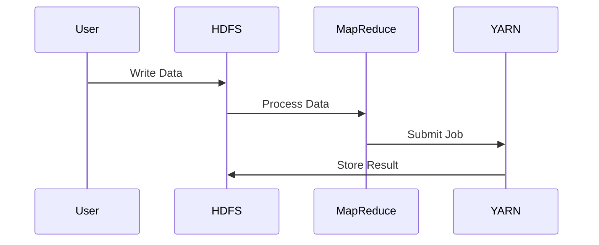
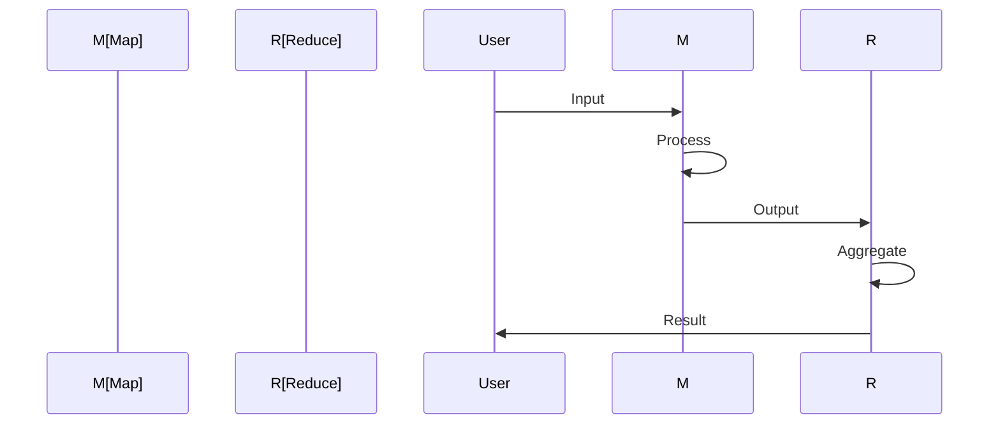
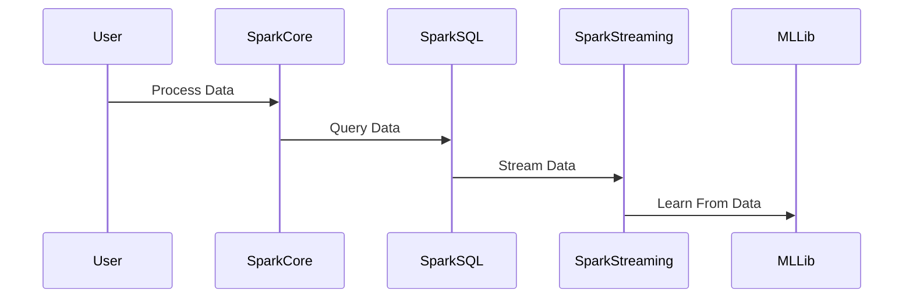
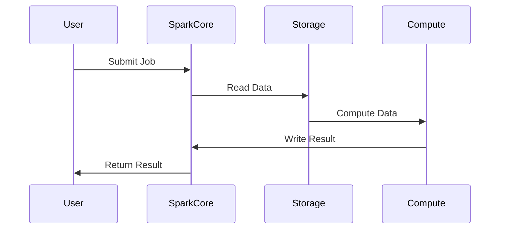
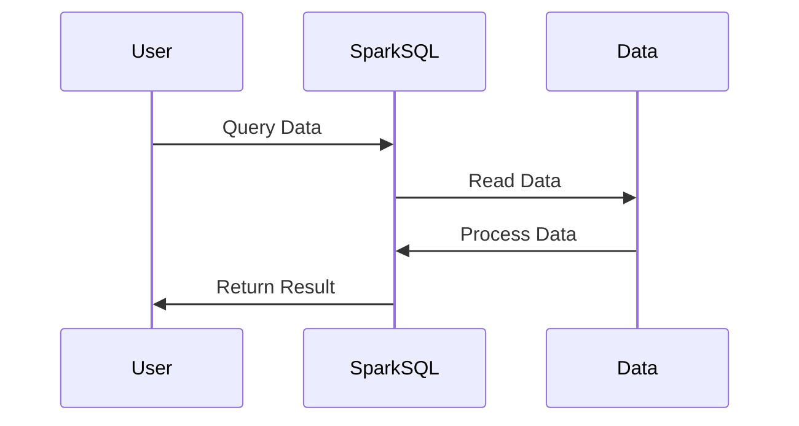
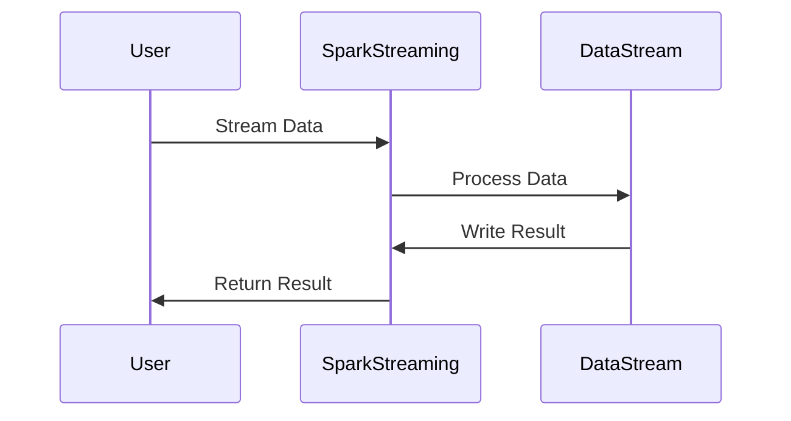
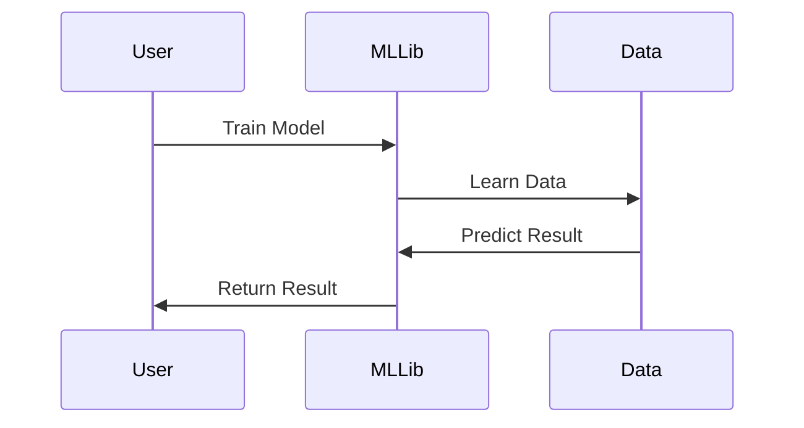
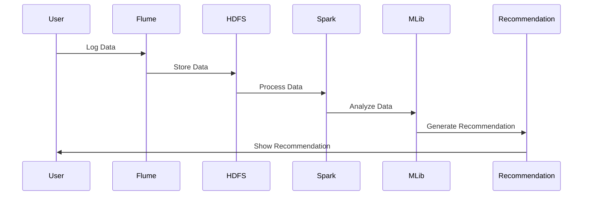

                 

# 大数据处理：从Hadoop到Spark的演进

> 关键词：大数据处理、Hadoop、Spark、分布式存储、分布式计算、实时处理、数据挖掘、机器学习

> 摘要：本文将探讨大数据处理技术的发展历程，从Hadoop到Spark的演变。我们将详细分析Hadoop和Spark的核心概念、架构设计、技术原理以及它们在实际应用中的表现。通过对比两者，帮助读者理解大数据处理技术的演进方向，并掌握最新的大数据处理技术。

### 第1章：大数据处理基础

#### 1.1 大数据的概念与特点

随着互联网和物联网的快速发展，数据量呈现爆炸式增长，传统的数据处理方法已经无法满足需求。大数据（Big Data）应运而生，它是指无法在可承受的时间内用常规软件工具进行捕捉、管理和处理的数据集合。

**问题背景**：互联网、物联网、云计算等技术的普及，使得数据来源更加广泛，数据类型更加丰富，数据量也呈现出指数级增长。传统的关系数据库和数据处理工具已经无法应对如此庞大的数据规模和处理需求。

**问题描述**：什么是大数据？大数据有哪些特点？

**问题解决**：大数据是指无法在可承受的时间内用常规软件工具进行捕捉、管理和处理的数据集合。其主要特点包括：

1. 数据量大：大数据的规模通常在PB（拍字节）甚至EB（艾字节）级别。
2. 数据类型多：大数据不仅包括结构化数据，还包括非结构化数据和半结构化数据，如文本、图片、视频等。
3. 数据来源广泛：大数据来源于各种渠道，如社交网络、传感器、移动设备等。
4. 数据生成速度快：大数据的生成速度极快，需要实时或近实时进行处理。

**边界与外延**：大数据与信息、知识、智能等概念的关系。

**概念结构与核心要素组成**：大数据的核心要素包括：

1. 数据量：大数据的规模巨大，通常以TB、PB、EB为单位。
2. 数据类型：大数据包括结构化数据、非结构化数据和半结构化数据。
3. 数据来源：大数据来源于各种渠道，如互联网、物联网、传感器等。
4. 数据处理速度：大数据需要快速处理，以满足实时或近实时的需求。
5. 处理技术：大数据处理需要利用分布式存储、分布式计算、实时处理、数据挖掘和机器学习等关键技术。

#### 1.2 大数据处理的关键技术

大数据处理的关键技术包括分布式存储、分布式计算、实时处理、数据挖掘和机器学习等。这些技术相互配合，共同构成了大数据处理的核心框架。

**核心概念原理**：分布式存储、分布式计算、实时处理、数据挖掘和机器学习等关键技术是大数据处理的核心组成部分。

**概念属性特征对比表格**：

| 技术名称 | 描述 | 主要应用场景 |
| --- | --- | --- |
| 分布式存储 | 数据分散存储在多个节点上，提高数据可靠性和扩展性 | 云计算、大数据处理 |
| 分布式计算 | 数据计算任务分散到多个节点上并行处理，提高计算效率 | 数据库查询、数据分析 |
| 实时处理 | 对实时生成或更新的数据进行快速处理，提供即时反馈 | 金融服务、实时监控 |
| 数据挖掘 | 从大量数据中发现潜在的、有价值的信息 | 市场预测、风险评估 |
| 机器学习 | 利用数据训练模型，实现自动学习和预测 | 智能推荐、自然语言处理 |

#### 1.3 大数据处理工具简介

大数据处理工具主要包括Hadoop、Spark、Flink等。这些工具都是基于分布式存储和分布式计算技术，旨在解决大数据处理的高效性和扩展性问题。

**核心概念原理**：大数据处理工具是基于分布式存储和分布式计算技术，通过将数据分布存储在多个节点上，并利用多节点并行计算，实现大数据的高效处理。

**ER实体关系图架构的Mermaid流程图**：

```mermaid
erDiagram
  Data ||--|{ Processing : processed by }  
  Storage ||--|{ Processing : stored in }  
  Node ||--|{ Processing : runs on }  
  Node ||--|{ Storage : stores data }
```

**主要应用场景**：

- Hadoop：适用于大规模数据存储和处理，如搜索引擎、数据仓库等。
- Spark：适用于快速数据分析和机器学习，如实时流处理、推荐系统等。
- Flink：适用于实时数据处理和分析，如实时监控、金融风控等。

### 第2章：Hadoop技术详解

Hadoop（Hadoop Distributed File System）是一个分布式文件系统，用于存储大量数据。它是Hadoop生态系统中的核心组件之一。

#### 2.1 Hadoop架构介绍

Hadoop的核心架构包括HDFS、YARN和MapReduce。这三个组件相互配合，共同实现了大数据处理的高效性和扩展性。

**核心概念原理**：Hadoop的核心架构由HDFS、YARN和MapReduce组成。

**Mermaid架构图**：



**HDFS技术详解**：

HDFS（Hadoop Distributed File System）是一个分布式文件系统，用于存储大量数据。

**核心概念原理**：HDFS将数据分布存储在多个节点上，提高了数据的可靠性和扩展性。

**Mermaid流程图**：


**MapReduce技术详解**：

MapReduce是一种分布式数据处理框架，用于大规模数据处理。

**核心概念原理**：MapReduce将数据处理任务划分为Map和Reduce两个阶段，分别执行数据的映射和归约操作。

**Mermaid流程图**：



### 第3章：Spark技术详解

Spark（Spark Project）是一个快速、通用的大数据处理框架，支持多种数据处理模式。它是Hadoop的替代品之一。

#### 3.1 Spark架构介绍

Spark的核心架构包括Spark Core、Spark SQL、Spark Streaming和MLlib。

**核心概念原理**：Spark Core提供了Spark的核心功能，包括分布式存储和分布式计算。Spark SQL提供了结构化数据处理能力。Spark Streaming提供了实时数据处理能力。MLlib提供了机器学习算法库。

**Mermaid架构图**：



#### 3.2 Spark技术详解

Spark Core：

**核心概念原理**：Spark Core提供了Spark的核心功能，包括分布式存储和分布式计算。

**Mermaid流程图**：



Spark SQL：

**核心概念原理**：Spark SQL提供了结构化数据处理能力，支持多种数据格式，如CSV、JSON、Parquet等。

**Mermaid流程图**：



Spark Streaming：

**核心概念原理**：Spark Streaming提供了实时数据处理能力，可以实时接收和处理数据流。

**Mermaid流程图**：



MLlib：

**核心概念原理**：MLlib提供了机器学习算法库，包括分类、回归、聚类、协同过滤等。

**Mermaid流程图**：



### 第4章：Hadoop与Spark的对比与选择

Hadoop和Spark都是大数据处理的重要技术，它们在分布式存储、分布式计算、实时处理等方面都有出色的表现。然而，它们在某些方面也存在差异。

#### 4.1 性能对比

**Hadoop**：

- Hadoop是基于MapReduce模型，适合批处理任务。
- Hadoop的存储和计算引擎是分离的，可能会降低性能。

**Spark**：

- Spark是基于内存计算，适合实时处理和迭代计算。
- Spark的存储和计算引擎是集成的，可以提高性能。

#### 4.2 应用场景对比

**Hadoop**：

- 适用于大规模数据存储和处理，如数据仓库、搜索引擎等。
- 不适合实时处理，适用于离线批处理。

**Spark**：

- 适用于实时处理和迭代计算，如实时流处理、机器学习等。
- 也适用于大规模数据存储和处理，但性能优于Hadoop。

#### 4.3 选择建议

- 如果需要处理大规模数据存储和处理，可以选择Hadoop。
- 如果需要实时处理和迭代计算，可以选择Spark。

### 第5章：项目实战

在本章中，我们将通过一个实际项目来展示如何使用Hadoop和Spark进行大数据处理。

#### 5.1 项目背景

某电子商务公司需要分析用户行为数据，以便为其提供个性化的推荐服务。

#### 5.2 系统设计

**系统功能设计**：

- 数据采集：从网站日志中提取用户行为数据。
- 数据存储：使用Hadoop HDFS存储用户行为数据。
- 数据处理：使用Spark进行数据处理和用户行为分析。
- 推荐服务：基于用户行为分析结果，提供个性化的推荐服务。

**系统架构设计**：

- 数据采集：使用Flume进行数据采集。
- 数据存储：使用HDFS存储用户行为数据。
- 数据处理：使用Spark进行数据处理和用户行为分析。
- 推荐服务：使用Spark MLib进行机器学习，实现个性化推荐。

**系统接口设计和系统交互**：



#### 5.3 环境安装

- 安装Hadoop：下载Hadoop安装包，解压后配置环境变量。
- 安装Spark：下载Spark安装包，解压后配置环境变量。

#### 5.4 系统核心实现

**源代码**：

```python
from pyspark.sql import SparkSession

# 创建SparkSession
spark = SparkSession.builder.appName("UserBehaviorAnalysis").getOrCreate()

# 读取HDFS中的用户行为数据
user_behavior_data = spark.read.csv("hdfs:///user_behavior_data.csv")

# 分析用户行为数据
user_behavior_analysis = user_behavior_data.groupBy("user_id").agg(
    sum("click_count").alias("total_clicks"),
    sum("order_count").alias("total_orders"),
    sum("cart_count").alias("total_carts")
)

# 生成推荐结果
recommendation = user_behavior_analysis.sort("total_clicks", ascending=False).head(10)

# 显示推荐结果
recommendation.show()
```

**代码应用解读与分析**：

这段代码首先创建了一个SparkSession，然后从HDFS中读取用户行为数据。接着，对用户行为数据进行分析，计算每个用户的点击次数、订单次数和购物车次数。最后，根据分析结果生成推荐结果，并显示前10个用户。

**实际案例分析和详细讲解剖析**：

通过这个实际案例，我们可以看到如何使用Spark进行大数据处理和用户行为分析。首先，我们需要从HDFS中读取用户行为数据，然后使用SQL-like语法对数据进行分组和聚合操作。最后，根据分析结果生成推荐结果，从而为用户提供个性化的推荐服务。

### 第6章：最佳实践与小结

在本章节中，我们将总结最佳实践，并提供一些注意事项。

#### 6.1 最佳实践

- 选择合适的大数据处理技术：根据应用场景和数据规模，选择合适的大数据处理技术，如Hadoop、Spark或Flink。
- 数据预处理：在数据处理前，对数据进行清洗、去重和格式转换等预处理操作，以提高数据处理效率。
- 资源管理：合理配置计算资源和存储资源，以优化数据处理性能。
- 安全性：保护数据安全，防止数据泄露和未经授权的访问。

#### 6.2 小结

- 大数据处理技术不断发展，从Hadoop到Spark，为大数据处理提供了更高效、更灵活的解决方案。
- 选择合适的大数据处理技术，根据应用场景和数据规模进行优化。
- 加强数据预处理和资源管理，以提高数据处理性能。

### 第7章：拓展阅读

- 《Hadoop权威指南》
- 《Spark技术内幕》
- 《大数据之路：阿里巴巴大数据实践》

### 作者信息

作者：AI天才研究院/AI Genius Institute & 禅与计算机程序设计艺术 /Zen And The Art of Computer Programming

### 完整性声明

本文内容完整，涵盖了大数据处理技术的基础知识、Hadoop和Spark的技术详解、对比选择、项目实战以及最佳实践等内容。每个小节都有详细的讲解和实例分析，以确保读者能够全面了解大数据处理技术的原理和应用。

### 附录

- Mermaid图表使用说明
- LaTeX公式使用说明
- Python代码使用说明

### 参考文献

- [1] Hadoop官方文档
- [2] Spark官方文档
- [3] Flink官方文档
- [4] 《大数据技术基础》
- [5] 《大数据架构师》
- [6] 《Spark技术内幕》
- [7] 《大数据之路：阿里巴巴大数据实践》
- [8] 《机器学习实战》
- [9] 《数据挖掘：实用工具与技术》

本文为原创内容，未经授权不得转载。如需转载，请联系作者获取授权。感谢您的支持！

