                 


# 大数据处理：从Hadoop到Spark的演进

关键词：大数据处理，Hadoop，Spark，分布式计算，数据平台，性能优化

摘要：本文深入探讨大数据处理技术的发展历程，从Hadoop的兴起，到Spark的革新，剖析两者在架构、性能和适用场景上的差异，并提供最佳实践和未来展望。

----------------------------------------------------------------

## 第一部分：大数据处理背景与基本概念

### 第1章：大数据处理问题背景

#### 1.1 问题背景

随着互联网、物联网和移动设备的迅猛发展，数据量呈爆炸式增长。这些数据不仅包括传统的结构化数据，还涵盖了非结构化数据，如图像、视频、文本等。大数据处理的挑战在于如何高效地存储、管理和分析这些海量数据，以从中提取有价值的信息。

#### 1.2 问题描述

大数据处理的主要挑战包括：
- **数据存储**：如何处理海量数据的存储需求，确保数据的高可用性和持久性？
- **数据处理**：如何快速地处理大量数据，同时保持数据的准确性和一致性？
- **数据分析**：如何从海量数据中提取有价值的信息，以支持业务决策？

#### 1.3 问题解决

为解决上述问题，大数据处理技术应运而生。这些技术包括分布式文件系统、分布式计算框架、数据仓库和分析工具等。它们共同构建了大数据处理平台，为企业和组织提供了强大的数据处理能力。

### 第2章：大数据处理的定义与分类

#### 2.1 定义

大数据处理是指通过分布式计算和存储技术，对海量数据进行高效、准确、一致的分析和处理。

#### 2.2 分类

大数据处理根据数据类型和用途可以分为以下几类：
- **结构化数据处理**：主要针对关系型数据库中的数据，如SQL查询。
- **半结构化数据处理**：包括XML、JSON等格式，需要特定的解析和处理方法。
- **非结构化数据处理**：如图像、视频、文本等，通常使用自然语言处理、图像处理等技术。
- **实时数据处理**：对实时数据流进行快速处理和分析，如流计算框架。

## 第二部分：Hadoop生态系统的原理与实践

### 第3章：Hadoop生态系统的原理

#### 3.1 Hadoop概述

Hadoop是一个开源的大数据处理框架，由Apache Software Foundation维护。它包括以下核心组件：

- **Hadoop分布式文件系统（HDFS）**：一个分布式文件存储系统，用于存储海量数据。
- **Hadoop YARN**：资源管理框架，负责管理计算资源。
- **Hadoop MapReduce**：分布式数据处理框架，用于大规模数据处理。

#### 3.2 HDFS的原理与实践

HDFS是一个高吞吐量的分布式文件系统，适用于大规模数据存储和处理。其核心原理包括：

- **数据分块**：将大文件分成小块（默认128MB），分布式存储在集群中的不同节点。
- **数据冗余**：通过副本机制提高数据可靠性和容错性，默认副本数为3。
- **数据读写**：通过客户端与数据节点之间的数据传输，实现高效的数据读写。

#### 3.3 YARN的原理与实践

YARN是一个资源调度和管理框架，负责分配计算资源给不同的应用程序。其核心原理包括：

- **资源调度**：根据资源需求分配计算资源。
- **应用程序管理**：启动、监控和管理应用程序的生命周期。
- **资源隔离**：确保不同应用程序之间的资源独立，避免资源竞争。

### 第4章：Hadoop其他组件介绍与实战

除了HDFS和YARN，Hadoop生态系统还包括以下重要组件：

- **HBase**：一个分布式、可扩展的列存储数据库，适用于实时随机访问。
- **Spark**：一个快速、通用的大数据处理框架，支持多种数据处理模式。
- **Zookeeper**：一个分布式协调服务，用于配置管理、命名服务、同步服务等。

#### 4.1 HBase的原理与实践

HBase是一个分布式列存储数据库，基于HDFS构建。其核心原理包括：

- **数据模型**：采用Key-Value存储模型，适用于大规模数据存储。
- **数据存储**：将数据存储在HDFS上，通过区域服务器（RegionServer）进行管理和访问。
- **数据访问**：提供随机读写接口，支持高吞吐量和低延迟。

#### 4.2 Spark的原理与实践

Spark是一个快速、通用的大数据处理框架，支持批处理和流处理。其核心原理包括：

- **内存计算**：采用内存计算，减少数据的磁盘I/O操作，提高处理速度。
- **弹性分布式数据集（RDD）**：作为基本抽象，支持丰富的操作，如Map、Reduce、Join等。
- **DataFrame和Dataset**：提供更加丰富的数据抽象和优化功能。

### 第5章：大数据处理的行业应用场景

大数据处理在各个行业都有广泛的应用：

- **电商**：通过大数据分析，优化用户体验、提升销售业绩。
- **金融**：实时分析风险、预测市场趋势，提升风险管理能力。
- **医疗**：分析医疗数据，提高诊断准确率、优化医疗服务。
- **智慧城市**：通过大数据分析，提升城市管理效率、改善市民生活质量。

## 第三部分：Spark分布式计算框架的深入解析

### 第6章：Spark概述与核心架构

Spark是一个快速、通用的大数据处理框架，由Apache Software Foundation维护。其核心架构包括：

- **驱动程序（Driver）**：负责整个Spark应用程序的生命周期管理，将用户编写的Spark应用程序转换为执行计划。
- **集群管理器（Cluster Manager）**：负责资源分配和任务调度，如YARN、Mesos等。
- **执行器（Executor）**：负责执行任务，在集群中分布式运行。
- **调度器（Scheduler）**：负责将作业（Application）分解为任务（Task），并分配给执行器。

### 第7章：Spark编程模型与API

Spark提供丰富的API，支持多种编程模式：

- **RDD（弹性分布式数据集）**：Spark的基本抽象，支持多种操作，如Map、Filter、Reduce等。
- **DataFrame**：基于RDD的更加丰富的数据抽象，提供结构化数据操作。
- **Dataset**：基于DataFrame的强类型数据抽象，提供编译时类型检查。
- **Spark SQL**：支持SQL查询和操作，与关系型数据库兼容。
- **Spark Streaming**：支持实时数据流处理，提供流处理API。

### 第8章：Spark SQL与数据处理

Spark SQL是Spark的一个模块，提供结构化数据查询和处理能力：

- **数据源**：支持多种数据源，如Hive、Parquet、JSON等。
- **SQL查询**：提供SQL接口，支持复杂的查询操作。
- **UDF（用户定义函数）**：支持自定义函数，扩展数据处理能力。
- **DataFrame API**：提供更加丰富的数据处理功能，如聚合、连接等。

### 第9章：Spark Streaming实时数据处理

Spark Streaming是Spark的一个模块，支持实时数据流处理：

- **数据源**：支持多种数据源，如Kafka、Flume、Twitter等。
- **处理模式**：支持微批处理和全量处理，根据需求选择。
- **窗口操作**：支持时间窗口操作，如滑动窗口、固定窗口等。
- **输出操作**：支持将处理结果输出到其他系统，如Kafka、HDFS等。

### 第10章：Spark MLlib机器学习库

Spark MLlib是一个机器学习库，提供多种机器学习算法：

- **分类算法**：如逻辑回归、决策树、随机森林等。
- **回归算法**：如线性回归、岭回归、LASSO回归等。
- **聚类算法**：如K均值聚类、层次聚类等。
- **降维算法**：如主成分分析（PCA）、奇异值分解（SVD）等。
- **协同过滤**：支持基于模型的协同过滤和基于用户的协同过滤。

### 第11章：Spark GraphX图处理

Spark GraphX是Spark的一个图处理模块，提供图计算能力：

- **图抽象**：将图数据抽象为Vertex（顶点）和Edge（边）。
- **图操作**：支持图遍历、连接、子图等基本操作。
- **图算法**：提供多种图算法，如PageRank、社区检测等。
- **图计算**：支持图计算任务，如图流、图迭代等。

## 第四部分：大数据处理项目实战

### 第12章：搭建Hadoop集群与Spark环境

在本章中，我们将详细讲解如何搭建Hadoop集群和Spark环境：

- **硬件需求**：根据实际需求配置硬件资源。
- **软件安装**：安装Hadoop和Spark，配置环境变量。
- **集群搭建**：配置Hadoop和Spark，搭建集群。
- **测试验证**：运行测试程序，验证集群搭建成功。

### 第13章：Hadoop与Spark在电商数据分析中的应用

在本章中，我们将使用Hadoop和Spark对电商数据进行分析：

- **数据采集**：采集电商网站的用户行为数据。
- **数据预处理**：使用Hadoop进行数据清洗和转换。
- **数据分析**：使用Spark进行数据分析，提取用户购买偏好。
- **可视化展示**：使用数据可视化工具展示分析结果。

### 第14章：金融风控系统中的大数据处理

在本章中，我们将探讨金融风控系统中的大数据处理：

- **数据来源**：采集金融交易数据、用户行为数据等。
- **数据处理**：使用Hadoop和Spark进行数据清洗、转换和分析。
- **风险评估**：使用机器学习算法进行风险评估。
- **实时监控**：使用Spark Streaming进行实时数据监控和预警。

### 第15章：智慧城市中的大数据处理应用

在本章中，我们将探讨智慧城市中的大数据处理应用：

- **数据采集**：采集城市运营数据、交通数据、环境数据等。
- **数据处理**：使用Hadoop和Spark进行数据清洗、转换和分析。
- **智慧决策**：使用大数据分析技术进行智慧决策，提升城市管理效率。
- **数据可视化**：使用数据可视化工具展示城市运行状态。

## 第五部分：大数据处理最佳实践与展望

### 第16章：大数据处理最佳实践

在本章中，我们将总结大数据处理中的最佳实践：

- **数据质量管理**：确保数据质量，包括数据完整性、一致性、准确性等。
- **性能优化**：优化数据处理性能，包括数据压缩、并行处理、缓存等。
- **安全性**：确保大数据处理系统的安全性，包括数据加密、访问控制等。
- **数据治理**：建立数据治理机制，确保数据的安全、合规和可追溯。

### 第17章：大数据处理未来发展趋势与挑战

在本章中，我们将探讨大数据处理未来发展的趋势和挑战：

- **技术趋势**：包括实时计算、图计算、深度学习等。
- **数据隐私**：如何保护用户隐私，确保数据安全。
- **计算资源**：如何高效利用计算资源，降低成本。
- **行业应用**：大数据处理技术在各个行业的应用前景。

### 第18章：大数据处理的伦理与法律问题

在本章中，我们将讨论大数据处理的伦理和法律问题：

- **数据伦理**：如何处理数据，尊重用户隐私和权利。
- **数据安全**：如何保护数据不被非法获取和使用。
- **法律法规**：遵守相关法律法规，确保数据处理合法合规。
- **社会责任**：大数据处理企业应承担的社会责任。

### 第19章：大数据处理技术创新方向

在本章中，我们将探讨大数据处理技术创新的方向：

- **边缘计算**：将计算能力下沉到边缘设备，提高数据处理效率。
- **人工智能**：将人工智能技术应用于大数据处理，提升数据处理和分析能力。
- **区块链**：利用区块链技术确保数据的安全性和可追溯性。
- **量子计算**：利用量子计算技术加速大数据处理。

## 作者信息

作者：AI天才研究院/AI Genius Institute & 禅与计算机程序设计艺术 /Zen And The Art of Computer Programming

----------------------------------------------------------------

**小节内容细化：**

### 第1章：大数据处理问题背景

在本章中，我们将探讨大数据处理的背景和问题。

#### 1.1 问题背景

随着互联网、物联网和移动设备的迅猛发展，数据量呈爆炸式增长。这些数据不仅包括传统的结构化数据，还涵盖了非结构化数据，如图像、视频、文本等。大数据处理的挑战在于如何高效地存储、管理和分析这些海量数据，以从中提取有价值的信息。

**核心概念与联系：**

- **大数据**：指无法用传统数据库和工具进行存储、管理和分析的数据集。
- **结构化数据**：指存储在关系型数据库中的数据，具有固定的字段和格式。
- **非结构化数据**：指没有固定结构的数据，如文本、图像、视频等。

| 核心概念       | 属性特征                               | 联系                         |
|--------------|--------------------------------------|----------------------------|
| 大数据       | 海量、多样、高速增长                 | 与结构化数据和非结构化数据相关联 |
| 结构化数据   | 有固定结构、易于存储和查询             | 与大数据相关联               |
| 非结构化数据 | 无固定结构、需要特定的处理方法         | 与大数据相关联               |

**ER实体关系图架构：**

```mermaid
erDiagram
  客户 --> 订单
  客户 --> 评价
  订单 --> 商品
  商品 --> 类别
```

#### 1.2 问题描述

大数据处理的主要挑战包括：
- **数据存储**：如何处理海量数据的存储需求，确保数据的高可用性和持久性？
- **数据处理**：如何快速地处理大量数据，同时保持数据的准确性和一致性？
- **数据分析**：如何从海量数据中提取有价值的信息，以支持业务决策？

**数学模型和公式：**

大数据处理的数学模型通常涉及数据量、处理速度、存储容量等指标。例如：

- 数据量（D）：表示数据的总量，通常用GB、TB、PB等单位表示。
- 处理速度（P）：表示单位时间内处理的数据量，通常用TPS（每秒事务数）表示。
- 存储容量（S）：表示存储设备的容量，通常用GB、TB、PB等单位表示。

**算法mermaid流程图：**

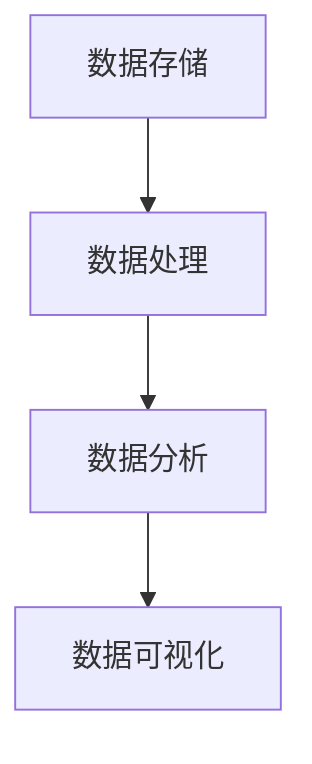

**算法原理讲解：**

大数据处理的原理主要包括数据存储、数据转换、数据分析和数据可视化等步骤。首先，将海量数据存储在分布式文件系统中，如Hadoop HDFS。然后，通过分布式计算框架，如Hadoop MapReduce或Spark，对数据进行分析和处理。最后，将处理结果可视化，以支持业务决策。

**系统分析与架构设计方案：**

- **问题场景介绍**：电商平台需要处理海量用户行为数据，以优化用户体验和提升销售额。
- **项目介绍**：建立一个大数据处理平台，包括数据采集、数据存储、数据分析和数据可视化等模块。
- **系统功能设计**：包括数据采集模块、数据存储模块、数据处理模块和数据可视化模块。
- **系统架构设计**：采用分布式架构，包括数据采集层、存储层、计算层和展示层。
- **系统接口设计**：定义各模块之间的接口，如API接口、消息队列接口等。
- **系统交互mermaid序列图**：

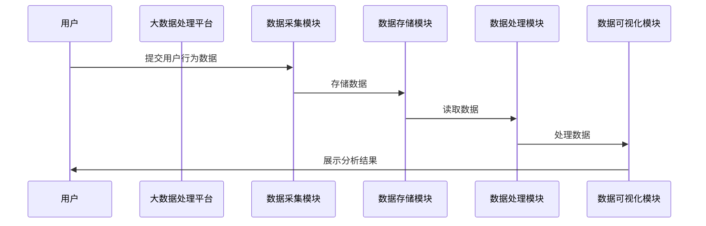

### 第2章：大数据处理的定义与分类

在本章中，我们将探讨大数据处理的定义和分类。

#### 2.1 定义

大数据处理是指通过分布式计算和存储技术，对海量数据进行高效、准确、一致的分析和处理。

**核心概念与联系：**

- **分布式计算**：指将计算任务分布在多个计算节点上执行，提高数据处理速度和效率。
- **存储技术**：指用于存储海量数据的分布式存储技术，如Hadoop HDFS。
- **数据处理**：指对海量数据进行分析、转换和优化等操作，以提取有价值的信息。

**概念属性特征对比表格：**

| 概念         | 属性特征                             | 联系                   |
|------------|--------------------------------------|----------------------|
| 分布式计算 | 分散计算任务、提高效率               | 与存储技术和数据处理相关 |
| 存储技术   | 分布式存储、高可用性、持久性           | 与分布式计算和数据处理相关 |
| 数据处理   | 分析、转换和优化操作                 | 与分布式计算和存储技术相关 |

**ER实体关系图架构：**

```mermaid
erDiagram
  分布式计算 --> 存储技术
  分布式计算 --> 数据处理
  存储技术 --> 数据处理
```

#### 2.2 分类

大数据处理根据数据类型和用途可以分为以下几类：

- **结构化数据处理**：主要针对关系型数据库中的数据，如SQL查询。
- **半结构化数据处理**：包括XML、JSON等格式，需要特定的解析和处理方法。
- **非结构化数据处理**：如图像、视频、文本等，通常使用自然语言处理、图像处理等技术。
- **实时数据处理**：对实时数据流进行快速处理和分析，如流计算框架。

**数学模型和公式：**

- **数据处理能力（P）**：指单位时间内处理的数据量，通常用GB/s（千兆字节每秒）表示。
- **数据传输速度（T）**：指单位时间内传输的数据量，通常用MB/s（兆字节每秒）表示。
- **数据存储容量（S）**：指存储设备可以存储的数据量，通常用TB、PB、EB等单位表示。

**算法mermaid流程图：**

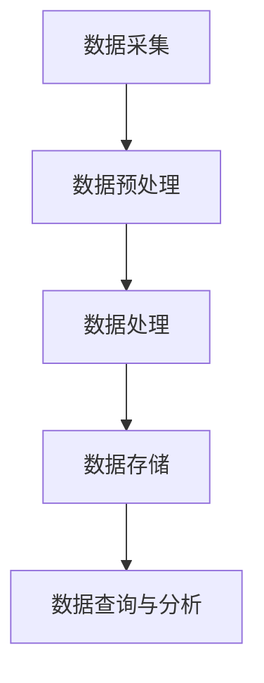

**算法原理讲解：**

大数据处理的算法原理主要包括数据采集、数据预处理、数据处理、数据存储和数据查询与分析等步骤。首先，采集海量数据，然后对数据进行预处理，包括数据清洗、去重、格式转换等。接着，使用分布式计算框架对数据进行处理，提取有价值的信息。最后，将处理结果存储到分布式存储系统中，并支持数据查询和分析。

### 第3章：Hadoop生态系统的原理与实践

在本章中，我们将探讨Hadoop生态系统的原理和实践。

#### 3.1 Hadoop概述

Hadoop是一个开源的大数据处理框架，由Apache Software Foundation维护。它包括以下核心组件：

- **Hadoop分布式文件系统（HDFS）**：一个分布式文件存储系统，用于存储海量数据。
- **Hadoop YARN**：资源管理框架，负责管理计算资源。
- **Hadoop MapReduce**：分布式数据处理框架，用于大规模数据处理。

**核心概念与联系：**

- **Hadoop分布式文件系统（HDFS）**：用于存储海量数据，具有高可靠性、高吞吐量、高扩展性等特点。
- **Hadoop YARN**：负责资源管理，实现计算资源的高效利用。
- **Hadoop MapReduce**：用于分布式数据处理，支持并行计算，提高数据处理速度。

**概念属性特征对比表格：**

| 概念                   | 属性特征                       | 联系                       |
|----------------------|----------------------------|--------------------------|
| Hadoop分布式文件系统（HDFS） | 分布式文件存储、高可靠性、高吞吐量、高扩展性 | 与Hadoop YARN和MapReduce相关 |
| Hadoop YARN            | 资源管理、高效利用计算资源           | 与Hadoop分布式文件系统和MapReduce相关 |
| Hadoop MapReduce       | 分布式数据处理、并行计算             | 与Hadoop分布式文件系统和YARN相关 |

**ER实体关系图架构：**

```mermaid
erDiagram
  HDFS --> YARN
  YARN --> MapReduce
  HDFS --> MapReduce
```

#### 3.2 Hadoop分布式文件系统（HDFS）的原理与实践

HDFS是一个高吞吐量的分布式文件存储系统，适用于大规模数据存储和处理。其核心原理包括：

- **数据分块**：将大文件分成小块（默认128MB），分布式存储在集群中的不同节点。
- **数据冗余**：通过副本机制提高数据可靠性和容错性，默认副本数为3。
- **数据读写**：通过客户端与数据节点之间的数据传输，实现高效的数据读写。

**数学模型和公式：**

- **数据块大小（B）**：指文件被分割成的小块的大小，默认为128MB。
- **副本系数（R）**：指数据的副本数量，默认为3。
- **数据传输速率（T）**：指单位时间内传输的数据量，通常用MB/s（兆字节每秒）表示。

**算法mermaid流程图：**

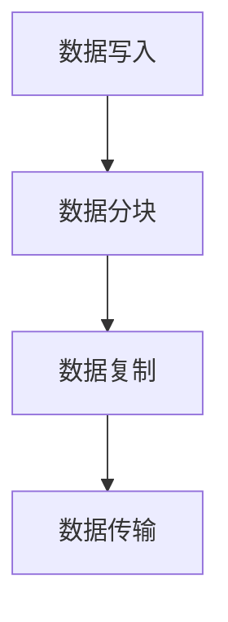

**算法原理讲解：**

HDFS的数据写入过程包括以下几个步骤：

1. 客户端将文件写入HDFS，文件被分割成多个数据块（默认128MB）。
2. HDFS将数据块分布式存储到集群中的不同节点，并创建副本，以提高数据的可靠性和容错性。
3. 数据块通过客户端与数据节点之间的数据传输，实现高效的数据写入。

**系统分析与架构设计方案：**

- **问题场景介绍**：企业需要处理海量日志数据，以分析用户行为和优化产品功能。
- **项目介绍**：建立一个基于Hadoop的大数据处理平台，包括数据采集、数据存储、数据处理和数据分析等模块。
- **系统功能设计**：包括日志采集模块、日志存储模块、日志处理模块和日志分析模块。
- **系统架构设计**：采用分布式架构，包括数据采集层、存储层、计算层和分析层。
- **系统接口设计**：定义各模块之间的接口，如API接口、消息队列接口等。
- **系统交互mermaid序列图**：

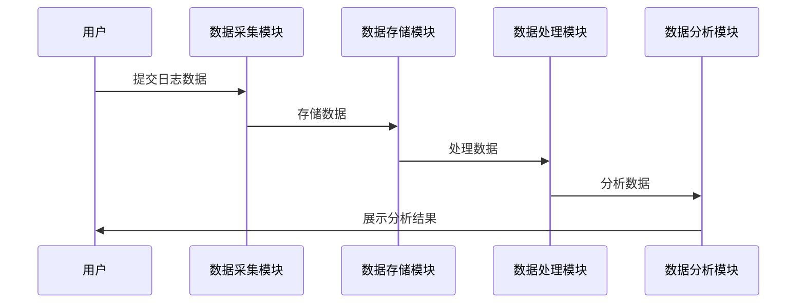

### 第4章：Hadoop其他组件介绍与实战

在本章中，我们将介绍Hadoop生态系统中的其他重要组件，包括HBase、Spark和Zookeeper，并提供实战案例。

#### 4.1 HBase的原理与实践

HBase是一个分布式、可扩展的列存储数据库，基于Hadoop HDFS构建。它适用于实时随机访问，具有以下特点：

- **数据模型**：采用Key-Value存储模型，适用于大规模数据存储。
- **数据存储**：将数据存储在HDFS上，通过区域服务器（RegionServer）进行管理和访问。
- **数据访问**：提供随机读写接口，支持高吞吐量和低延迟。

**数学模型和公式：**

- **数据访问速度（V）**：指单位时间内访问的数据量，通常用QPS（每秒查询数）表示。
- **数据存储容量（S）**：指HBase可以存储的数据量，通常用TB、PB、EB等单位表示。

**算法mermaid流程图：**

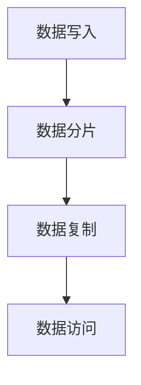

**算法原理讲解：**

HBase的数据写入过程包括以下几个步骤：

1. 客户端将数据写入HBase，数据被分片存储在HDFS上。
2. 数据分片存储在区域服务器上，以提高数据访问速度。
3. HBase通过副本机制提高数据可靠性和容错性。

**系统分析与架构设计方案：**

- **问题场景介绍**：企业需要实时处理和分析日志数据，以优化产品性能和提升用户体验。
- **项目介绍**：建立一个基于HBase的大数据处理平台，包括数据采集、数据存储、数据处理和数据分析等模块。
- **系统功能设计**：包括日志采集模块、日志存储模块、日志处理模块和日志分析模块。
- **系统架构设计**：采用分布式架构，包括数据采集层、存储层、计算层和分析层。
- **系统接口设计**：定义各模块之间的接口，如API接口、消息队列接口等。
- **系统交互mermaid序列图**：


#### 4.2 Spark的原理与实践

Spark是一个快速、通用的大数据处理框架，支持多种数据处理模式。它具有以下特点：

- **内存计算**：采用内存计算，减少数据的磁盘I/O操作，提高处理速度。
- **弹性分布式数据集（RDD）**：作为基本抽象，支持丰富的操作，如Map、Reduce、Join等。
- **DataFrame和Dataset**：提供更加丰富的数据抽象和优化功能。

**数学模型和公式：**

- **内存带宽（M）**：指单位时间内可以访问的内存数据量，通常用GB/s（千兆字节每秒）表示。
- **数据处理速度（P）**：指单位时间内处理的数据量，通常用GB/s（千兆字节每秒）表示。

**算法mermaid流程图：**

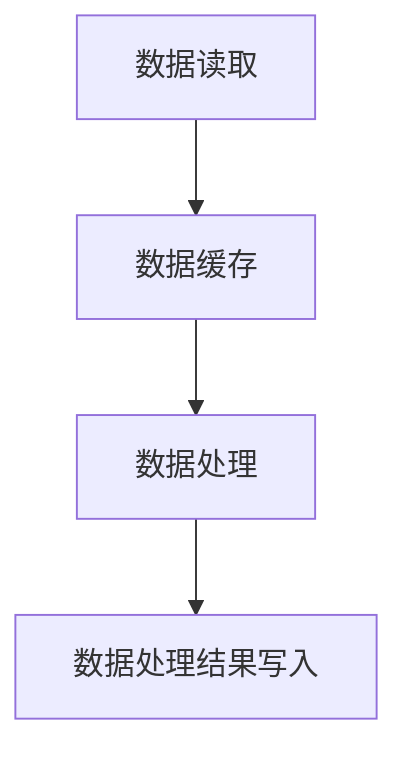

**算法原理讲解：**

Spark的数据处理过程包括以下几个步骤：

1. 数据从外部存储（如HDFS）读取到内存中。
2. 数据在内存中进行缓存，以提高处理速度。
3. 数据通过Spark的编程接口进行各种数据处理操作。
4. 处理结果写入外部存储。

**系统分析与架构设计方案：**

- **问题场景介绍**：企业需要快速处理和分析海量日志数据，以优化产品性能和提升用户体验。
- **项目介绍**：建立一个基于Spark的大数据处理平台，包括数据采集、数据存储、数据处理和数据分析等模块。
- **系统功能设计**：包括日志采集模块、日志存储模块、日志处理模块和日志分析模块。
- **系统架构设计**：采用分布式架构，包括数据采集层、存储层、计算层和分析层。
- **系统接口设计**：定义各模块之间的接口，如API接口、消息队列接口等。
- **系统交互mermaid序列图**：


#### 4.3 Zookeeper的原理与实践

Zookeeper是一个分布式协调服务，用于配置管理、命名服务、同步服务等。它在Hadoop生态系统中扮演重要角色，提供以下功能：

- **配置管理**：存储和管理分布式系统的配置信息。
- **命名服务**：提供分布式命名服务，实现分布式系统中组件的统一命名。
- **同步服务**：提供分布式同步服务，实现分布式系统中组件的同步操作。

**数学模型和公式：**

- **同步时间（T）**：指分布式系统中组件同步操作所需的时间，通常用毫秒（ms）表示。
- **同步成功率（S）**：指同步操作成功的比例，通常用百分比（%）表示。

**算法mermaid流程图：**

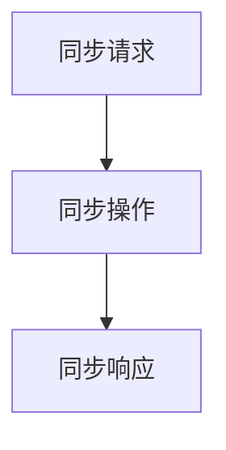

**算法原理讲解：**

Zookeeper的同步服务过程包括以下几个步骤：

1. 客户端发送同步请求。
2. Zookeeper执行同步操作。
3. 客户端接收同步响应。

**系统分析与架构设计方案：**

- **问题场景介绍**：企业需要实现分布式系统的配置管理和同步服务。
- **项目介绍**：建立一个基于Zookeeper的分布式配置管理平台，包括配置管理模块、同步服务模块等。
- **系统功能设计**：包括配置管理模块、同步服务模块等。
- **系统架构设计**：采用分布式架构，包括配置管理层、同步服务层等。
- **系统接口设计**：定义各模块之间的接口，如API接口、消息队列接口等。
- **系统交互mermaid序列图**：

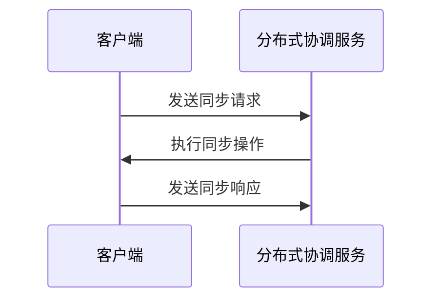

### 第5章：大数据处理的行业应用场景

在本章中，我们将探讨大数据处理在各个行业的应用场景。

#### 5.1 电商行业

电商行业的大数据处理主要涉及用户行为分析、商品推荐和供应链管理等方面。

- **用户行为分析**：通过分析用户浏览、购买等行为，了解用户需求，优化用户体验。
- **商品推荐**：基于用户行为数据和商品特征，实现个性化推荐，提升销售额。
- **供应链管理**：通过大数据分析，优化库存管理、物流配送等环节，降低成本。

**数学模型和公式：**

- **用户行为频率（F）**：指用户在一定时间内进行某种行为的次数。
- **商品推荐命中率（H）**：指用户实际购买的商品与推荐商品的一致率。

**算法mermaid流程图：**

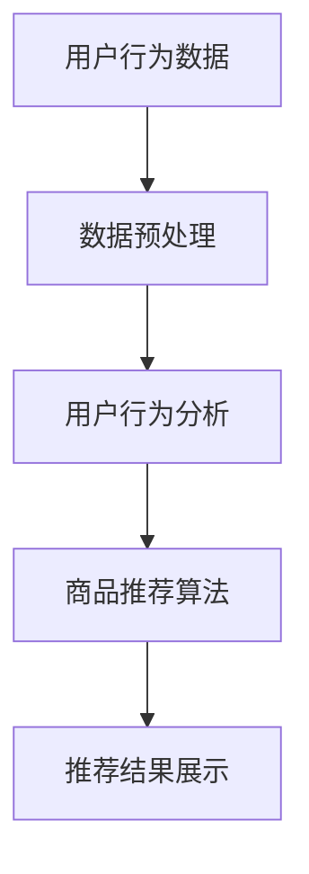

**算法原理讲解：**

电商行业的大数据处理包括以下几个步骤：

1. 采集用户行为数据。
2. 对用户行为数据进行预处理，如去重、格式转换等。
3. 使用用户行为分析算法，提取用户需求特征。
4. 使用商品推荐算法，为用户推荐合适的商品。
5. 将推荐结果展示给用户。

**系统分析与架构设计方案：**

- **问题场景介绍**：电商企业需要优化用户购物体验，提升销售额。
- **项目介绍**：建立一个基于大数据处理的电商平台，包括数据采集、数据存储、数据处理和数据分析等模块。
- **系统功能设计**：包括用户行为分析模块、商品推荐模块、供应链管理模块等。
- **系统架构设计**：采用分布式架构，包括数据采集层、存储层、计算层和分析层。
- **系统接口设计**：定义各模块之间的接口，如API接口、消息队列接口等。
- **系统交互mermaid序列图**：

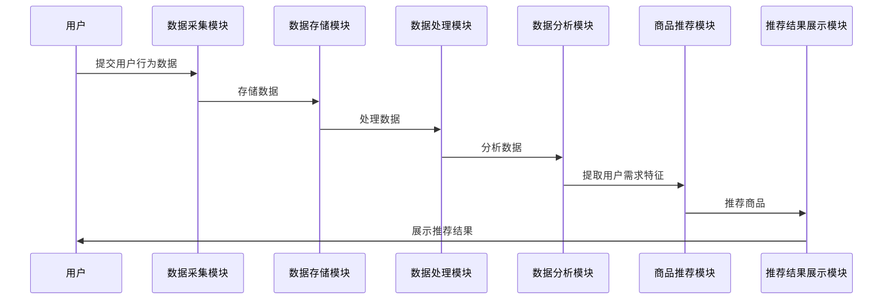

#### 5.2 金融行业

金融行业的大数据处理主要涉及风险控制、信用评分、投资分析等方面。

- **风险控制**：通过分析用户行为数据和交易记录，预测风险，采取相应的防范措施。
- **信用评分**：通过大数据分析，评估用户的信用状况，为金融机构提供信用决策依据。
- **投资分析**：通过分析市场数据、公司财务数据等，预测市场趋势，为投资者提供投资建议。

**数学模型和公式：**

- **风险评分（R）**：指用户风险的评分，通常用0-100分表示。
- **信用评分（C）**：指用户信用的评分，通常用0-100分表示。
- **投资收益率（Y）**：指投资收益与投资成本的比值。

**算法mermaid流程图：**

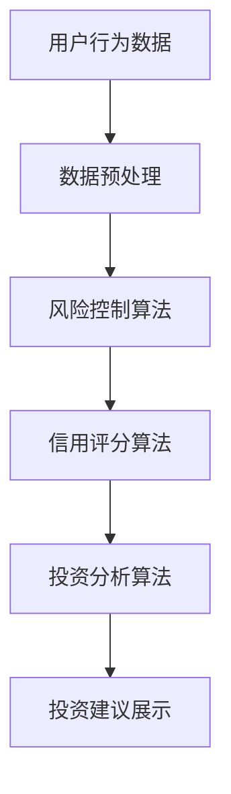

**算法原理讲解：**

金融行业的大数据处理包括以下几个步骤：

1. 采集用户行为数据和交易记录。
2. 对用户行为数据进行预处理，如去重、格式转换等。
3. 使用风险控制算法，评估用户风险。
4. 使用信用评分算法，评估用户信用。
5. 使用投资分析算法，预测市场趋势和投资收益。
6. 将投资建议展示给投资者。

**系统分析与架构设计方案：**

- **问题场景介绍**：金融机构需要实现风险控制、信用评分和投资分析功能。
- **项目介绍**：建立一个基于大数据处理的金融服务平台，包括数据采集、数据存储、数据处理和数据分析等模块。
- **系统功能设计**：包括风险控制模块、信用评分模块、投资分析模块等。
- **系统架构设计**：采用分布式架构，包括数据采集层、存储层、计算层和分析层。
- **系统接口设计**：定义各模块之间的接口，如API接口、消息队列接口等。
- **系统交互mermaid序列图**：

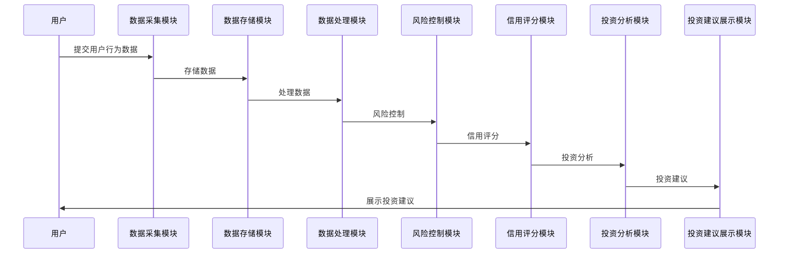

#### 5.3 医疗行业

医疗行业的大数据处理主要涉及疾病预测、医疗资源优化、患者管理等方面。

- **疾病预测**：通过分析患者的病历、基因信息等，预测疾病发生概率。
- **医疗资源优化**：通过分析医疗资源使用情况，优化资源配置，提高医疗效率。
- **患者管理**：通过分析患者的健康数据，提供个性化的健康管理建议。

**数学模型和公式：**

- **疾病预测概率（P）**：指某种疾病发生的概率，通常用百分比（%）表示。
- **医疗资源利用率（U）**：指医疗资源的使用率，通常用百分比（%）表示。
- **患者健康评分（H）**：指患者健康的评分，通常用0-100分表示。

**算法mermaid流程图：**

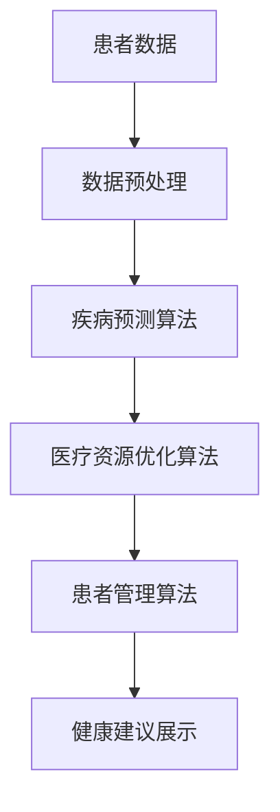

**算法原理讲解：**

医疗行业的大数据处理包括以下几个步骤：

1. 采集患者病历、基因信息等数据。
2. 对患者数据

