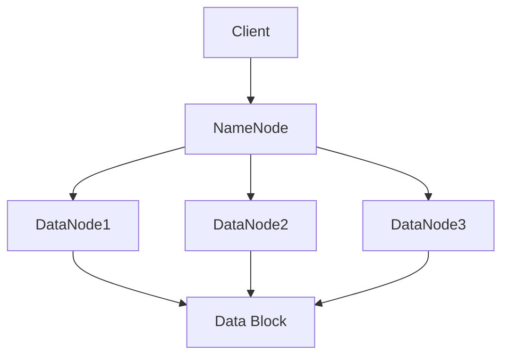
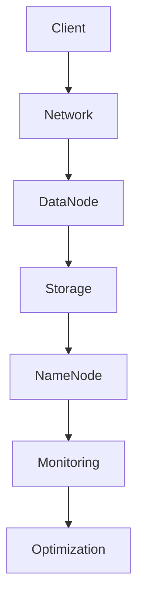
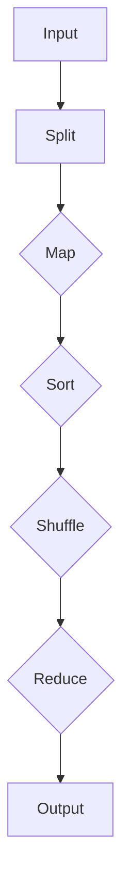
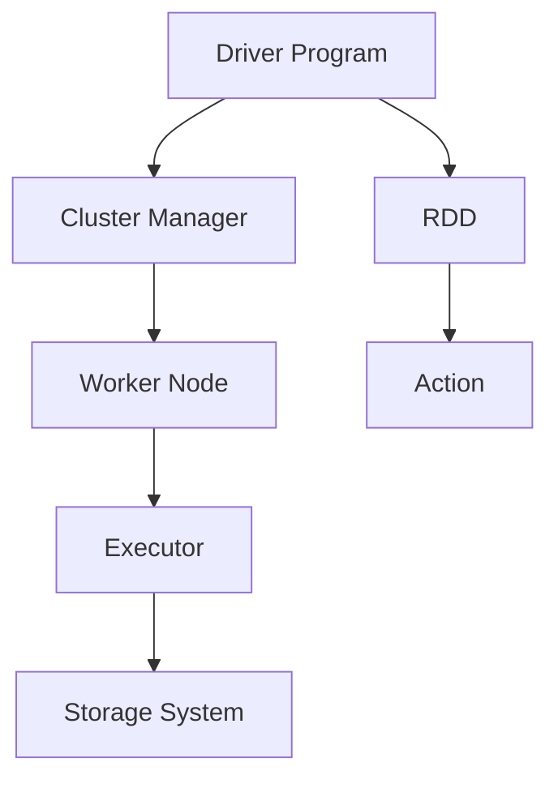
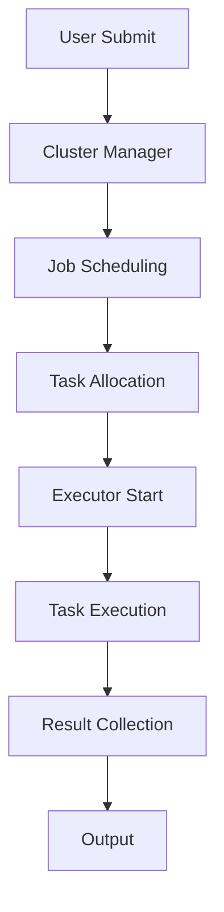
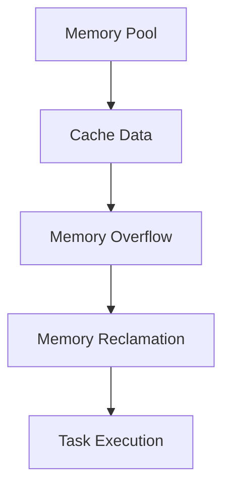
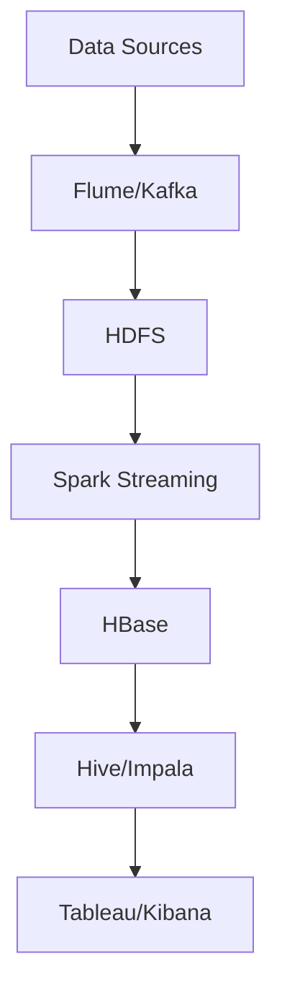

                 

### 文章标题与关键词

# 《大数据处理：从Hadoop到Spark的演进》

关键词：大数据处理、Hadoop、Spark、分布式计算、性能优化

摘要：本文将带领读者深入探讨大数据处理领域的两个重要框架——Hadoop和Spark，从它们的起源、架构、工作原理到在实际项目中的应用，全面解析这两个框架的演进历程和各自的优缺点。文章旨在帮助读者理解大数据处理的核心概念，掌握Hadoop和Spark的使用方法，并展望未来大数据处理技术的发展趋势。

### 目录大纲

## 第一部分：大数据处理背景与概述

### 第1章：大数据处理概述

#### 1.1 大数据的定义与特点

- 大数据的基本概念
- 大数据的主要特点（数据量、数据种类、数据速度）

#### 1.2 大数据处理的需求与挑战

- 大数据处理的重要需求
- 大数据处理面临的挑战

### 第2章：大数据处理生态系统

#### 2.1 大数据处理的关键技术

- 分布式文件系统（如HDFS）
- 分布式计算框架（如MapReduce）

#### 2.2 大数据处理工具栈

- Hadoop生态系统概述
- Hadoop相关工具（如Hive、HBase、Pig）

## 第二部分：Hadoop生态系统深入讲解

### 第3章：Hadoop分布式文件系统（HDFS）

#### 3.1 HDFS架构与设计

- HDFS架构概述
- HDFS设计原理

#### 3.2 HDFS操作与维护

- HDFS基本操作
- HDFS性能优化

### 第4章：MapReduce编程模型

#### 4.1 MapReduce基本原理

- MapReduce框架概述
- MapReduce编程模型

#### 4.2 MapReduce编程实践

- MapReduce编程技巧
- 实例分析

## 第三部分：Spark生态系统

### 第5章：Spark核心架构与设计

#### 5.1 Spark架构概述

- Spark核心组件
- Spark设计理念

#### 5.2 Spark运行机制

- Spark调度与执行
- Spark内存管理

### 第6章：Spark编程基础

#### 6.1 Spark编程模型

- Spark编程接口
- RDD（弹性分布式数据集）

#### 6.2 Spark SQL与DataFrame

- Spark SQL概述
- DataFrame编程

### 第7章：Spark高级功能

#### 7.1 Spark流处理

- Spark Streaming概述
- 实时数据处理

#### 7.2 Spark机器学习

- Spark MLlib概述
- 机器学习实践

## 第四部分：大数据处理项目实战

### 第8章：大数据处理项目实战

#### 8.1 项目背景与需求

- 项目背景介绍
- 项目需求分析

#### 8.2 系统架构设计

- 系统功能设计
- 系统架构设计

#### 8.3 系统核心实现

- 环境安装与配置
- 系统核心实现源代码

#### 8.4 代码应用解读与分析

- 代码解读
- 应用分析

### 第9章：项目总结与展望

#### 9.1 项目总结

- 项目回顾
- 项目收获

#### 9.2 未来展望

- 大数据处理发展趋势
- 技术展望与建议

### 文章结构概述

本文的结构设计旨在为读者提供一个全面、深入的大数据处理知识体系。文章首先介绍了大数据处理的背景与概述，包括大数据的定义与特点，以及大数据处理的需求与挑战。随后，文章深入讲解了大数据处理生态系统中的关键技术，包括分布式文件系统（HDFS）和分布式计算框架（MapReduce）。在Hadoop生态系统深入讲解章节中，详细介绍了HDFS的架构与设计，以及MapReduce编程模型的基本原理与实践。接着，文章转向Spark生态系统，介绍了Spark的核心架构与设计，Spark编程基础，以及Spark的高级功能如流处理和机器学习。最后，通过一个实际项目实战，将理论知识与实践相结合，展示了大数据处理项目的设计与实现过程。文章末尾，对项目进行了总结与展望，对大数据处理技术的发展趋势进行了探讨，并为读者提供了进一步的阅读建议。通过本文，读者将能够系统地了解大数据处理领域的核心概念、技术框架和实践方法，为日后的学习和工作打下坚实的基础。### 第一部分：大数据处理背景与概述

#### 第1章：大数据处理概述

##### 1.1 大数据的定义与特点

**大数据的基本概念**

大数据（Big Data）是指无法用传统数据处理应用工具在合理时间内捕捉、管理和处理的大量数据集。这个概念起源于商业领域，但随着技术的进步和数据的爆发式增长，大数据的应用范围已经扩展到各个行业。

**大数据的主要特点**

大数据具有以下四个主要特点，通常被称为“4V”：

- **Volume（数据量）**：大数据涉及的数据量非常庞大，传统数据库无法有效存储和处理。
- **Velocity（速度）**：数据生成、处理和消费的速度非常快，需要实时或近实时的数据处理能力。
- **Variety（多样性）**：大数据的来源广泛，类型多样，包括结构化、半结构化和非结构化数据。
- **Veracity（真实性）**：数据的真实性和可靠性成为大数据处理的一个重要问题，因为数据的质量直接影响分析结果的准确性。

**大数据的特点表格**

| 特点 | 描述 |
| --- | --- |
| Volume | 数据量巨大，传统数据库难以承载 |
| Velocity | 数据处理速度快，需要实时或近实时分析 |
| Variety | 数据类型多样，包括结构化和非结构化数据 |
| Veracity | 数据真实性难以保证，需进行数据质量评估 |

**大数据的概念结构与核心要素组成**

大数据的核心要素包括：

- **数据源**：数据的原始来源，如传感器、社交网络、电子商务平台等。
- **数据存储**：用于存储大规模数据的技术，如HDFS、NoSQL数据库等。
- **数据处理**：对数据进行清洗、转换、聚合和分析的技术和算法。
- **数据分析和可视化**：通过统计分析和数据可视化技术，提取数据中的有价值信息。

##### 1.2 大数据处理的需求与挑战

**大数据处理的重要需求**

大数据处理的关键需求包括：

- **高效存储与访问**：能够快速、安全地存储和访问海量数据。
- **实时处理能力**：能够处理高速流动的数据流，进行实时分析和决策。
- **复杂分析能力**：支持复杂的数据分析和高级算法，如机器学习、图分析等。
- **可扩展性**：能够随着数据量的增长而扩展，不降低系统性能。

**大数据处理面临的挑战**

大数据处理面临的主要挑战有：

- **数据量增长**：数据量的激增对存储和计算资源提出了更高的要求。
- **数据多样性**：不同类型的数据需要不同的处理方法和工具。
- **数据处理速度**：实时处理需求对系统的性能提出了挑战。
- **数据隐私与安全**：确保数据的隐私和安全是大数据处理的重要问题。
- **资源利用效率**：如何最大化利用现有的计算资源，提高数据处理效率。

**大数据处理的边界与外延**

- **边界**：大数据处理的边界主要涉及数据量的大小，通常认为超过PB级别的数据集属于大数据处理范畴。
- **外延**：大数据处理的外延包括数据采集、存储、处理、分析和可视化等各个环节，以及与这些环节相关的技术和工具。

通过以上对大数据处理的概述，我们能够对大数据的概念、特点、需求与挑战有一个全面的了解，为后续章节的学习打下基础。

#### 第2章：大数据处理生态系统

##### 2.1 大数据处理的关键技术

**分布式文件系统（如HDFS）**

分布式文件系统（HDFS，Hadoop Distributed File System）是大数据处理生态系统中的核心组件之一。它设计用于处理大规模数据集，具有高吞吐量、高可靠性和高可用性的特点。

**HDFS架构概述**

HDFS由两个主要部分组成：

- **NameNode**：管理文件的元数据，如文件目录结构、数据块映射信息等。
- **DataNode**：负责存储实际的数据块，并响应客户端的读写请求。

**HDFS设计原理**

HDFS的设计原理主要包括：

- **数据分块**：将大文件分成固定大小的数据块（默认为128MB或256MB），并分布式存储在多个DataNode上。
- **冗余存储**：每个数据块默认有三个副本，分布在不同的DataNode上，以提高数据的可靠性和容错性。
- **负载均衡**：HDFS自动进行数据块的迁移和复制，以实现负载均衡。

**分布式计算框架（如MapReduce）**

分布式计算框架（如MapReduce）是大数据处理生态系统中的另一个关键组件。它提供了对大规模数据集的高效并行处理能力。

**MapReduce框架概述**

MapReduce由两个主要阶段组成：

- **Map阶段**：将输入数据分成小块，对每个小块进行映射操作，产生中间键值对。
- **Reduce阶段**：将Map阶段生成的中间键值对进行归并操作，生成最终的输出结果。

**MapReduce编程模型**

MapReduce编程模型主要包括：

- **Mapper**：实现Map阶段的函数，处理输入数据并生成中间键值对。
- **Reducer**：实现Reduce阶段的函数，合并中间键值对并生成最终输出。

**Hadoop生态系统概述**

Hadoop是一个开源的分布式计算平台，包括多个组件，其中最重要的包括：

- **HDFS**：分布式文件系统，负责数据的存储。
- **MapReduce**：分布式计算框架，负责数据的处理。
- **YARN**：资源调度框架，负责资源的管理和分配。
- **Hive**：数据仓库工具，负责数据的存储和管理。
- **HBase**：分布式列存储数据库，负责实时数据的存储和处理。
- **Pig**：数据处理平台，提供了高层次的抽象接口。

**Hadoop相关工具**

Hadoop生态系统还包括多个相关工具，如：

- **Hive**：提供数据仓库功能，支持SQL查询。
- **HBase**：提供分布式列存储，支持实时访问。
- **Pig**：提供数据处理平台，支持复杂的数据处理任务。
- **Spark**：一种快速、通用的分布式计算引擎，将在后续章节详细介绍。

通过了解大数据处理的关键技术，我们可以更好地理解大数据处理的生态系统及其运作原理，为深入学习和实践大数据处理技术打下坚实的基础。

### 第二部分：Hadoop生态系统深入讲解

#### 第3章：Hadoop分布式文件系统（HDFS）

##### 3.1 HDFS架构与设计

HDFS（Hadoop Distributed File System）是Hadoop生态系统中的核心组件，专为处理大规模数据集而设计。其架构设计体现了分布式系统的优势，包括高吞吐量、高可靠性和高可用性。以下是对HDFS架构与设计原理的详细解析。

**HDFS架构概述**

HDFS架构主要由两部分组成：**NameNode** 和 **DataNode**。

- **NameNode**：负责管理文件的元数据，如文件目录结构、数据块的分配和命名空间。NameNode存储了整个文件系统的命名空间和客户端对文件的访问。它不存储实际的数据块内容，而是维护一个数据块与它们的副本的映射表。

- **DataNode**：负责存储实际的数据块，并响应用户的读写请求。每个DataNode管理它所在节点上的数据块，并向NameNode汇报数据块的存储状态。DataNode通过副本机制确保数据的高可靠性和容错性。

**HDFS设计原理**

HDFS的设计原理包括以下几个方面：

- **数据分块**：HDFS将大文件切分成固定大小的数据块（默认为128MB或256MB），这些数据块分布在不同的DataNode上。这种分块策略可以提高文件的并行处理能力，降低单个节点的存储压力。

- **冗余存储**：HDFS采用数据冗余存储策略，每个数据块默认有三个副本，这些副本存储在不同的节点上。当某个节点发生故障时，其他节点上的副本可以继续提供服务，从而确保数据的高可用性和可靠性。

- **负载均衡**：HDFS通过复制和迁移数据块来实现负载均衡。当某个节点上的存储空间不足或负载过高时，HDFS会将数据块迁移到其他节点，从而平衡整个系统的负载。

- **高吞吐量**：HDFS通过并行处理和冗余存储机制，实现了高吞吐量的数据访问。多个客户端可以同时读取或写入数据，提高了系统的处理效率。

- **高可用性**：通过冗余存储和故障转移机制，HDFS提供了高可用性。当某个节点或数据块发生故障时，系统能够自动切换到备用副本，确保数据不丢失。

**HDFS架构的Mermaid流程图**



在这个流程图中，客户端（Client）向NameNode发送请求，NameNode根据文件系统的命名空间和数据块映射表，将请求转发给相应的DataNode。DataNode响应请求，并将数据块返回给客户端。

##### 3.2 HDFS操作与维护

**HDFS基本操作**

HDFS支持一系列基本操作，包括文件上传、文件下载、文件删除和文件列表等。

- **文件上传（put）**：将本地文件上传到HDFS。例如，`hdfs dfs -put localfile /hdfsfile`。
- **文件下载（get）**：将HDFS文件下载到本地。例如，`hdfs dfs -get /hdfsfile localfile`。
- **文件删除（rm）**：删除HDFS文件。例如，`hdfs dfs -rm /hdfsfile`。
- **文件列表（ls）**：列出HDFS目录中的文件。例如，`hdfs dfs -ls /`。

**HDFS性能优化**

为了提高HDFS的性能，可以采取以下优化措施：

- **调整数据块大小**：根据数据集的特点和工作负载，调整数据块的大小。较大的数据块可以提高数据的读取吞吐量，但也会增加数据复制和传输的成本。
- **负载均衡**：定期执行负载均衡，将数据块迁移到存储资源充足的节点上，以避免某些节点的存储压力过大。
- **文件格式优化**：选择适合业务需求的文件格式，如SequenceFile或Parquet，以减少存储空间和提高数据处理速度。
- **网络优化**：优化网络配置，减少网络延迟和带宽瓶颈，提高数据传输效率。
- **集群监控**：定期监控HDFS集群的状态，及时发现和解决性能问题。

**HDFS性能优化的Mermaid流程图**



在这个流程图中，客户端通过网络与DataNode交互，读取或写入数据。DataNode与Storage存储节点进行交互，存储或检索数据。NameNode负责维护文件系统的元数据，并监控集群的状态。监控系统（Monitoring）定期收集性能数据，并根据这些数据对HDFS进行性能优化（Optimization）。

通过以上对HDFS架构与设计的深入讲解，以及对基本操作和性能优化的分析，读者可以更好地理解HDFS的工作原理和实际应用，为后续章节的学习和实践打下坚实的基础。

#### 第4章：MapReduce编程模型

##### 4.1 MapReduce基本原理

**MapReduce框架概述**

MapReduce是一种分布式计算模型，由Google提出并用于其大规模数据处理任务。MapReduce框架由两部分组成：**Map阶段**和**Reduce阶段**。

**Map阶段**

Map阶段将输入数据分解成小块，并对每个小块进行处理，生成中间键值对。具体步骤如下：

1. **输入分片**：将输入数据分成多个小块，每个小块由一个Mapper处理。
2. **映射**：每个Mapper读取输入数据块，根据业务逻辑处理数据，生成中间键值对。
3. **排序**：将所有Mapper生成的中间键值对按照键值进行排序。

**Reduce阶段**

Reduce阶段对Map阶段生成的中间键值对进行合并和处理，生成最终的输出结果。具体步骤如下：

1. **分组**：根据键值将中间键值对分组。
2. **归并**：对每个分组中的值进行归并操作，生成最终输出。

**MapReduce编程模型**

MapReduce编程模型主要包括两个核心组件：**Mapper**和**Reducer**。

- **Mapper**：实现Map阶段的函数，对输入数据进行映射操作，生成中间键值对。Mapper通常在分布式系统中的各个节点上并行执行。

- **Reducer**：实现Reduce阶段的函数，对中间键值对进行归并操作，生成最终输出。Reducer通常在中心节点上执行，将各个Mapper的输出结果进行合并。

**MapReduce工作流程**

MapReduce的工作流程可以分为以下几个步骤：

1. **初始化**：设置作业参数，初始化作业环境。
2. **输入分片**：将输入数据分成多个小块，每个小块由一个Mapper处理。
3. **映射**：各个Mapper并行处理输入数据块，生成中间键值对。
4. **本地排序**：对每个Mapper生成的中间键值对进行排序，以便后续的Reduce操作。
5. **Shuffle**：将本地排序后的中间键值对发送到Reducer，根据键值进行分组。
6. **归并**：各个Reducer处理分组后的中间键值对，生成最终输出结果。
7. **输出**：将最终输出结果写入指定的输出路径。

**MapReduce架构的Mermaid流程图**



在这个流程图中，输入数据（A）首先被分成多个小块（B），然后由Mapper（C）进行映射处理，生成中间键值对。本地排序（D）后的中间键值对通过Shuffle（E）发送到Reducer（F），进行归并操作，最终输出结果（G）被写入输出路径。

通过以上对MapReduce基本原理和编程模型的详细讲解，读者可以更好地理解MapReduce的工作机制和实现方法，为实际应用和开发奠定基础。

##### 4.2 MapReduce编程实践

**MapReduce编程技巧**

编写高效的MapReduce程序需要掌握一些编程技巧，以下是一些常用的技巧：

- **关键依赖管理**：合理设置依赖项，避免在运行过程中因缺少依赖项而导致的错误。
- **本地开发与测试**：在本地环境中开发MapReduce程序，并使用Hadoop内置的伪分布式模式进行测试，以确保程序的正确性和性能。
- **序列化与反序列化**：选择合适的序列化器，如Java序列化或Kryo序列化，以优化数据传输和存储性能。
- **内存管理**：合理分配内存，避免内存溢出或不足的情况，提高程序的稳定性和效率。
- **数据倾斜处理**：通过调整输入数据的分片策略或增加Reduce任务的并行度，减少数据倾斜现象，提高处理效率。

**实例分析**

以下是一个简单的WordCount程序实例，用于统计文本文件中每个单词的出现次数。

```python
import sys

def mapper(line):
    words = line.strip().split()
    for word in words:
        print(f"{word}\t1")

def reducer(key, values):
    count = sum(1 for _ in values)
    print(f"{key}\t{count}")

if __name__ == "__main__":
    for line in sys.stdin:
        mapper(line)
```

**实例解析**

- **Mapper函数**：读取输入行的内容，将每行文本分解成单词，并输出每个单词及其出现的次数（默认为1）。
- **Reducer函数**：接收Mapper输出的中间键值对，统计每个单词的总出现次数，并输出最终结果。

**运行与测试**

运行WordCount程序，需要将文本文件上传到HDFS，并使用以下命令启动MapReduce作业：

```shell
hadoop jar hadoop-examples.jar wordcount input output
```

其中，`input` 参数指定输入文件路径，`output` 参数指定输出文件路径。运行完成后，可以在输出路径下查看结果。

**性能优化建议**

- **调整MapReduce任务的并行度**：根据数据规模和集群资源，调整Mapper和Reducer的并行度，以提高处理效率。
- **减少数据倾斜**：通过合理的分片策略和键值分配，减少数据倾斜现象，提高任务的均衡性。
- **优化I/O操作**：减少不必要的I/O操作，如读取和写入中间文件，以降低I/O瓶颈。

通过以上编程技巧和实例分析，读者可以更好地掌握MapReduce编程模型，并能够在实际项目中应用这些知识，提高程序的效率和性能。

### 第三部分：Spark生态系统

#### 第5章：Spark核心架构与设计

**5.1 Spark架构概述**

Spark是一个开源的分布式计算引擎，专为大数据处理而设计。它提供了高效、灵活和可扩展的分布式计算能力。Spark的架构设计旨在实现高性能、高可靠性和易用性，主要包括以下几个核心组件：

- **Driver Program**：运行在主节点（Master Node）上，负责作业的调度、任务分配和结果收集。Driver Program是整个Spark作业的逻辑控制中心。
- **Cluster Manager**：负责资源管理，包括作业的调度和节点分配。常用的Cluster Manager包括YARN、Mesos和Spark自身内置的Standalone模式。
- **Worker Node**：负责执行任务，处理数据，并与Driver Program和Cluster Manager进行通信。每个Worker Node上运行一个Executor进程，负责执行具体的任务。
- **Executor**：在每个Worker Node上运行的进程，负责执行任务、存储数据和进行数据交换。Executor进程可以并行执行多个任务，以提高处理效率。
- **Storage System**：Spark使用内存和磁盘存储中间数据和最终结果。内存存储提供了低延迟和高吞吐量的访问，而磁盘存储则提供了持久性和容错性。

**Spark设计理念**

Spark的设计理念主要包括以下几个方面：

- **内存计算**：Spark采用基于内存的存储和处理方式，显著降低了数据访问延迟，提高了处理速度。Spark使用Tachyon（后改为Alluxio）来管理内存存储，实现了高效的数据缓存和共享。
- **弹性分布式数据集（RDD）**：RDD是Spark的核心抽象，代表了不可变、可分区、可并行操作的数据集合。RDD提供了丰富的API，支持各种数据处理操作，如转换、行动和分区等。
- **高可靠性**：Spark通过数据分片的冗余存储和自动恢复机制，确保了数据的高可靠性和容错性。Spark还提供了任务重试和任务调度优化，提高了系统的健壮性。
- **易用性**：Spark提供了丰富的API和工具，支持多种编程语言（如Python、Java和Scala），使得用户可以轻松地编写和运行分布式计算任务。
- **兼容性**：Spark与Hadoop生态系统紧密集成，支持HDFS作为其底层存储系统，同时兼容MapReduce作业和YARN资源调度框架。

**Spark核心组件的Mermaid流程图**



在这个流程图中，Driver Program负责调度和监控作业，Cluster Manager负责资源管理，Worker Node运行Executor进程执行任务，Storage System负责数据存储，RDD代表了数据集，Action触发计算并返回结果。

通过以上对Spark核心架构与设计理念的详细讲解，读者可以深入理解Spark的工作原理和设计思想，为后续章节的学习和实践打下坚实基础。

#### 第5.2 Spark运行机制

**Spark调度与执行**

Spark的调度与执行机制是其高效、可靠和可扩展的关键。以下是对Spark调度与执行过程的详细解析：

**资源调度**

Spark使用Cluster Manager来管理资源，包括作业的调度和节点的分配。常用的Cluster Manager包括YARN、Mesos和Spark自身的Standalone模式。

- **YARN（Yet Another Resource Negotiator）**：YARN是Hadoop生态系统中的资源调度框架，负责为Spark作业分配计算资源。YARN将集群资源分为容器（Container），并将容器分配给Spark作业的Executor进程。
- **Mesos**：Mesos是一个开源的分布式资源调度器，可以与Hadoop YARN和Kubernetes等其他资源管理系统集成，为Spark提供灵活的资源管理。
- **Standalone**：Spark Standalone是一个内置的简单调度器，适用于小型集群或开发环境。Standalone模式直接管理NodeManager和Executor进程，实现资源分配和作业调度。

**任务调度**

Spark的任务调度过程可以分为以下几个阶段：

1. **作业提交**：用户将Spark作业提交给Cluster Manager，指定作业的配置参数和资源需求。
2. **作业调度**：Cluster Manager根据作业的资源需求和集群状态，将作业分配给可用的NodeManager。作业调度器将作业分解为任务（Task），并为每个任务分配所需的资源。
3. **任务分配**：NodeManager根据调度器的指示，启动Executor进程，并分配任务给Executor。
4. **任务执行**：Executor进程执行任务，处理数据并生成中间结果。每个任务可以在多个Executor之间并行执行，以提高处理效率。

**任务执行**

Spark的任务执行过程包括以下几个步骤：

1. **任务分发**：Driver Program将任务分发到各个Executor，每个任务对应一个RDD的分区。
2. **数据拉取**：Executor从HDFS或其他存储系统拉取任务所需的输入数据，并将其加载到内存或磁盘缓存中。
3. **数据处理**：Executor根据任务的类型（映射或归并），执行相应的计算操作。映射任务处理输入数据并生成中间键值对，而归并任务对中间键值对进行合并和计算。
4. **数据写入**：任务完成后，Executor将中间结果写入内存或磁盘缓存，并通知Driver Program。
5. **结果收集**：Driver Program收集所有Executor的执行结果，并生成最终的输出结果。

**Spark调度与执行的Mermaid流程图**



在这个流程图中，用户提交Spark作业（A），Cluster Manager负责作业调度和任务分配（B、C、D），Executor进程启动并执行任务（E、F），最终结果由Driver Program收集并输出（G、H）。

**内存管理**

Spark的内存管理是其高效计算的关键。Spark使用内存存储中间数据和缓存数据，以减少I/O延迟并提高处理速度。Spark的内存管理包括以下方面：

- **内存池**：Spark将内存分为多个内存池，分别用于存储RDD、缓存数据和执行任务。内存池之间可以相互交换，以平衡内存使用。
- **缓存策略**：Spark提供了多种缓存策略，如持久化、检查点等，以优化内存使用和保证数据一致性。
- **内存不足处理**：当内存不足时，Spark会根据缓存策略和任务优先级，释放不再使用的内存，以保障任务的执行。

**内存管理的Mermaid流程图**



在这个流程图中，数据被缓存到内存池（A），当内存不足时，Spark会进行内存回收（D），以确保任务（E）的正常执行。

通过以上对Spark调度与执行机制的详细讲解，读者可以深入理解Spark的运行原理和实现方法，为实际应用和开发提供指导。

#### 第6章：Spark编程基础

**6.1 Spark编程模型**

Spark提供了丰富的API，支持多种编程语言，包括Python、Java和Scala。以下是Spark编程模型的基本概念和操作。

**Spark编程接口**

Spark编程接口包括RDD（弹性分布式数据集）、DataFrame和Dataset。其中，RDD是Spark的核心抽象，DataFrame和Dataset是基于RDD的高级抽象。

- **RDD（弹性分布式数据集）**：RDD是不可变、可分区、可并行操作的数据集合。它支持丰富的转换和行动操作，如map、filter、reduceByKey等。
- **DataFrame**：DataFrame是结构化数据集，类似于关系数据库中的表。DataFrame提供了更丰富的数据操作能力，如SQL查询、聚合和连接等。
- **Dataset**：Dataset是强类型数据集，结合了RDD和DataFrame的优点。Dataset提供了类型安全和编译时优化，提高了执行效率。

**RDD操作**

RDD支持两种类型的操作：**转换（Transformation）** 和 **行动（Action）**。

- **转换**：转换操作创建一个新的RDD，如map、filter、flatMap、groupBy等。转换操作是懒执行的，只有在行动操作时才会触发计算。
- **行动**：行动操作返回一个值或写入外部存储，如reduce、collect、saveAsTextFile等。行动操作触发RDD的计算和执行。

**DataFrame操作**

DataFrame提供了类似SQL的查询接口，支持各种数据操作，如：

- **聚合操作**：如sum、count、avg、max、min等。
- **连接操作**：如join、leftOuterJoin、rightOuterJoin等。
- **筛选操作**：如where、filter等。
- **排序操作**：如orderBy、sort等。

**Dataset操作**

Dataset继承了DataFrame的特性，并提供了类型安全。Dataset支持编译时优化，如代码生成和类型推断，提高了执行效率。Dataset的操作包括：

- **转换操作**：如map、filter、groupBy、reduceByKey等。
- **行动操作**：如collect、saveAsTextFile、save等。

**Spark编程模型示例**

以下是一个使用Python和Spark编程接口的WordCount示例：

```python
from pyspark.sql import SparkSession

# 创建Spark会话
spark = SparkSession.builder.appName("WordCount").getOrCreate()

# 读取文本文件
text_rdd = spark.sparkContext.textFile("data.txt")

# 转换为RDD
words_rdd = text_rdd.flatMap(lambda line: line.split())

# 应用映射和归并操作
word_counts_rdd = words_rdd.map(lambda word: (word, 1)).reduceByKey(lambda x, y: x + y)

# 转换为DataFrame
word_counts_df = word_counts_rdd.toDF(["word", "count"])

# 显示结果
word_counts_df.show()

# 保存结果到HDFS
word_counts_rdd.saveAsTextFile("output.txt")

# 关闭Spark会话
spark.stop()
```

在这个示例中，首先创建Spark会话，然后读取文本文件并转换为RDD。接着，应用映射和归并操作，将结果转换为DataFrame并显示。最后，将结果保存到HDFS。

通过以上对Spark编程基础和编程模型的详细讲解，读者可以掌握Spark的基本操作和使用方法，为实际应用和开发打下坚实基础。

#### 第6.2 Spark SQL与DataFrame

**Spark SQL概述**

Spark SQL是Spark生态系统中的一个重要组件，它提供了用于处理结构化数据的编程接口。Spark SQL可以将Spark与结构化数据源（如关系数据库、HDFS、Parquet文件等）相结合，提供强大的数据处理和分析能力。

**Spark SQL的核心功能**

- **SQL查询支持**：Spark SQL支持使用SQL语句对数据集进行查询和分析，提供类似关系数据库的查询能力。
- **DataFrame API**：DataFrame是Spark SQL的核心抽象，它代表了一个结构化的数据集，具有固定的列和数据类型。DataFrame API提供了丰富的数据操作功能，如筛选、聚合、连接等。
- **DataFrame与RDD的互操作**：Spark SQL支持将DataFrame与RDD进行互操作，使得用户可以方便地在DataFrame和RDD之间转换，充分利用两者的优势。
- **性能优化**：Spark SQL通过代码生成和列式存储等优化技术，提供了高效的查询性能。

**DataFrame编程**

DataFrame编程是Spark SQL的核心，以下是其基本概念和操作：

- **创建DataFrame**：可以使用多种方式创建DataFrame，如从RDD转换、读取外部数据源（如HDFS、关系数据库等）、导入JSON、Parquet等文件格式。
- **列操作**：DataFrame支持丰富的列操作，如选择列、过滤行、投影等。
- **聚合操作**：可以使用聚合函数（如sum、count、avg、max、min等）对DataFrame进行聚合操作。
- **连接操作**：可以使用join操作将多个DataFrame进行连接，实现复杂的数据查询。
- **排序操作**：可以使用orderBy操作对DataFrame进行排序。
- **行动操作**：可以使用行动操作（如collect、saveAsTextFile等）将DataFrame的结果写入外部存储或返回结果。

**Spark SQL示例**

以下是一个使用Spark SQL进行数据分析的示例：

```python
from pyspark.sql import SparkSession

# 创建Spark会话
spark = SparkSession.builder.appName("Spark SQL Example").getOrCreate()

# 读取CSV文件为DataFrame
dataframe = spark.read.csv("data.csv", header=True, inferSchema=True)

# 查询数据
query = "SELECT * FROM data WHERE age > 30"
result_df = dataframe.query(query)

# 显示结果
result_df.show()

# 聚合操作
age_summary = dataframe.groupBy("gender").agg({"age": "avg", "salary": "sum"})

# 显示聚合结果
age_summary.show()

# 保存结果到Parquet文件
age_summary.write.parquet("age_summary.parquet")

# 关闭Spark会话
spark.stop()
```

在这个示例中，首先创建Spark会话，并读取CSV文件为DataFrame。接着，使用SQL查询对数据进行筛选，并使用聚合函数进行数据汇总。最后，将结果保存到Parquet文件。

通过以上对Spark SQL与DataFrame的概述和编程示例，读者可以了解Spark SQL的基本使用方法和优势，为实际应用提供参考。

### 第7章：Spark高级功能

#### 7.1 Spark流处理

Spark流处理（Spark Streaming）是Spark生态系统中的一个重要组件，它提供了对实时数据流的高效处理能力。Spark Streaming基于微批处理（micro-batching）模型，将实时数据流切分成小批量进行处理，从而实现实时数据处理。

**Spark Streaming概述**

- **实时数据流处理**：Spark Streaming可以处理来自各种数据源（如Kafka、Flume、HDFS等）的实时数据流。
- **微批处理模型**：Spark Streaming将数据流切分成固定大小的批次（如1秒或2秒），并对每个批次进行独立的处理。
- **高性能**：Spark Streaming利用Spark的核心计算引擎，提供了高效的数据流处理能力，支持大规模数据集的实时处理。
- **易用性**：Spark Streaming提供了丰富的API，支持多种编程语言（如Python、Java和Scala），使得用户可以方便地编写和运行流处理作业。

**实时数据处理**

实时数据处理包括以下几个步骤：

1. **数据采集**：从数据源（如Kafka）中读取实时数据流。
2. **批次处理**：将数据流切分成批次，并对每个批次进行独立处理。
3. **数据转换**：对批次数据执行各种转换操作，如映射、过滤、聚合等。
4. **数据存储**：将处理结果存储到外部存储系统（如HDFS、数据库等）。

**Spark Streaming编程**

以下是一个使用Spark Streaming进行实时数据处理的示例：

```python
from pyspark.sql import SparkSession
from pyspark.streaming import StreamingContext

# 创建Spark会话和StreamingContext
spark = SparkSession.builder.appName("Realtime Data Processing").getOrCreate()
ssc = StreamingContext(spark.sparkContext, 1)

# 读取Kafka数据流
lines = ssc.socketTextStream("localhost", 9999)

# 转换和操作
words = lines.flatMap(lambda line: line.split())
word_counts = words.map(lambda word: (word, 1)).reduceByKey(lambda x, y: x + y)

# 显示实时结果
word_counts.pprint()

# 启动流处理作业
ssc.start()
ssc.awaitTermination()

# 关闭Spark会话
spark.stop()
```

在这个示例中，首先创建Spark会话和StreamingContext，并从本地端口读取实时数据流。接着，对数据流进行映射和归并操作，生成每个单词的出现次数。最后，使用pprint函数显示实时结果。

通过以上对Spark流处理的概述和编程示例，读者可以了解Spark流处理的基本概念和使用方法，为实际应用提供参考。

#### 7.2 Spark机器学习

**Spark MLlib概述**

Spark MLlib（Machine Learning Library）是Spark生态系统中的一个重要模块，它提供了用于机器学习任务的高级API和算法库。MLlib支持多种机器学习算法，包括分类、回归、聚类、降维和协同过滤等。

**MLlib的核心功能**

- **算法库**：MLlib包含了多种机器学习算法，如线性回归、逻辑回归、决策树、随机森林、K-means等。
- **分布式计算**：MLlib利用Spark的分布式计算能力，实现高效的数据处理和模型训练。
- **弹性扩展**：MLlib支持自动扩展，可以根据数据规模和计算资源动态调整算法的并行度。
- **易用性**：MLlib提供了简单易用的API，支持多种编程语言（如Python、Java和Scala），使得用户可以轻松地实现机器学习任务。

**机器学习实践**

以下是一个使用Spark MLlib进行机器学习任务的基本流程：

1. **数据准备**：加载和预处理数据，将数据集划分为训练集和测试集。
2. **模型选择**：根据业务需求选择合适的机器学习算法，如线性回归、决策树等。
3. **模型训练**：使用训练集对模型进行训练，生成模型参数。
4. **模型评估**：使用测试集对模型进行评估，计算模型性能指标，如准确率、召回率、F1分数等。
5. **模型部署**：将训练好的模型部署到生产环境，进行实际数据的预测和分析。

**MLlib算法实例**

以下是一个使用Spark MLlib进行线性回归的示例：

```python
from pyspark.ml import LinearRegression
from pyspark.ml.feature import VectorAssembler
from pyspark.sql import SparkSession

# 创建Spark会话
spark = SparkSession.builder.appName("LinearRegressionExample").getOrCreate()

# 读取数据
data = spark.read.csv("data.csv", header=True, inferSchema=True)

# 预处理数据
assembler = VectorAssembler(inputCols=["feature1", "feature2"], outputCol="features")
data = assembler.transform(data)

# 划分训练集和测试集
train_data, test_data = data.randomSplit([0.7, 0.3])

# 创建线性回归模型
lr = LinearRegression()

# 训练模型
model = lr.fit(train_data)

# 计算模型性能
predictions = model.transform(test_data)
print("RMSE: %f" % predictions.select("prediction", "label").rdd.map(lambda x: (x[0] - x[1])**2).mean())

# 关闭Spark会话
spark.stop()
```

在这个示例中，首先创建Spark会话，并读取CSV数据。接着，使用VectorAssembler将特征列组装成向量，然后划分训练集和测试集。创建线性回归模型并进行训练，最后计算模型性能指标并输出。

通过以上对Spark MLlib的概述和算法实例，读者可以了解Spark机器学习的基本概念和使用方法，为实际应用提供参考。

### 第四部分：大数据处理项目实战

#### 第8章：大数据处理项目实战

##### 8.1 项目背景与需求

**项目背景**

随着互联网和物联网的快速发展，各行业数据量呈爆炸式增长，传统数据处理方法已难以应对海量数据的高效处理和分析需求。为了解决这一问题，我们需要采用分布式计算框架和大数据处理技术，实现大规模数据的实时处理和分析。本项目的目标是通过分布式计算框架处理和解析海量数据，提供高效的业务数据分析和决策支持。

**项目需求**

- **数据采集**：从多个数据源（如数据库、日志文件、传感器等）实时采集数据。
- **数据预处理**：对采集到的原始数据进行清洗、转换和规范化处理。
- **实时分析**：对预处理后的数据进行实时分析，生成关键指标和统计报表。
- **数据存储**：将实时分析结果存储到分布式数据库或数据仓库中，以便后续查询和分析。
- **可视化展示**：将分析结果通过可视化工具进行展示，提供直观的数据分析和业务洞察。

##### 8.2 系统架构设计

**系统功能设计**

本系统主要实现以下功能：

- **数据采集模块**：负责从多个数据源实时采集数据，包括数据库数据、日志文件、传感器数据等。
- **数据预处理模块**：对采集到的原始数据进行清洗、转换和规范化处理，确保数据质量和一致性。
- **实时分析模块**：利用分布式计算框架（如Spark）对预处理后的数据进行分析，生成实时业务指标和统计报表。
- **数据存储模块**：将实时分析结果存储到分布式数据库或数据仓库中，以便后续查询和分析。
- **数据可视化模块**：通过可视化工具将分析结果展示给用户，提供直观的数据分析和业务洞察。

**系统架构设计**

本系统采用分布式计算框架（如Spark）和大数据存储技术（如HDFS、HBase），实现以下架构设计：

- **数据采集层**：使用日志收集工具（如Flume、Kafka）从各个数据源实时采集数据，并存储到HDFS中。
- **数据处理层**：使用Spark Streaming对实时数据进行预处理、清洗和转换，生成预处理后的数据。
- **数据存储层**：使用HDFS存储原始数据和预处理后的数据，使用HBase存储实时分析结果。
- **数据仓库层**：使用Hive或Impala构建数据仓库，提供高效的数据查询和分析能力。
- **数据可视化层**：使用可视化工具（如Tableau、Kibana）将分析结果展示给用户。

**系统架构的Mermaid流程图**



在这个流程图中，数据源（A）通过Flume或Kafka采集数据，存储到HDFS（C）。Spark Streaming（D）对数据进行预处理和实时分析，将结果存储到HBase（E）和Hive/Impala（F）。最后，通过Tableau或Kibana（G）将分析结果可视化展示给用户。

通过以上对项目背景、需求、系统架构设计的详细讲解，我们为后续的系统核心实现和代码应用解读与分析打下了坚实的基础。

##### 8.3 系统核心实现

**环境安装与配置**

为了实现本项目，我们需要搭建一个分布式计算环境和大数据存储环境。以下是主要组件的安装和配置步骤：

1. **Hadoop环境安装**

   - 下载并解压Hadoop安装包
   - 修改Hadoop配置文件（如hadoop-env.sh、core-site.xml、hdfs-site.xml、mapred-site.xml和yarn-site.xml）
   - 启动Hadoop服务，包括HDFS、YARN和MapReduce

2. **Spark环境安装**

   - 下载并解压Spark安装包
   - 修改Spark配置文件（如spark-env.sh、spark-defaults.conf和spark-hadoop.conf）
   - 启动Spark服务，包括Spark Shell和Spark UI

3. **Kafka环境安装**

   - 下载并解压Kafka安装包
   - 修改Kafka配置文件（如server.properties和log4j.properties）
   - 启动Kafka服务，包括Kafka Server和Kafka Consumer

4. **HBase环境安装**

   - 下载并解压HBase安装包
   - 修改HBase配置文件（如hbase-env.sh、hbase-site.xml和regionserver.xml）
   - 启动HBase服务，包括HMaster和RegionServer

**系统核心实现源代码**

以下是本项目的核心实现代码，包括数据采集、数据预处理、实时分析和数据可视化等模块。

1. **数据采集**

   ```python
   from kafka import KafkaConsumer
   
   consumer = KafkaConsumer('test_topic', bootstrap_servers=['localhost:9092'])
   
   for message in consumer:
       print(f"Received message: {message.value.decode('utf-8')}")
   ```

2. **数据预处理**

   ```python
   from pyspark.sql import SparkSession
   
   spark = SparkSession.builder.appName("DataPreprocessing").getOrCreate()
   
   data = spark.read.json("data.json")
   cleaned_data = data.select("id", "name", "age", "salary")
   cleaned_data.write.format("parquet").save("preprocessed_data")
   ```

3. **实时分析**

   ```python
   from pyspark.sql.functions import col
   
   spark = SparkSession.builder.appName("RealtimeAnalysis").getOrCreate()
   
   data = spark.read.parquet("preprocessed_data")
   summary = data.groupBy("department").agg({col("salary"): "sum"})
   summary.show()
   ```

4. **数据可视化**

   ```python
   import matplotlib.pyplot as plt
   
   data = spark.read.parquet("preprocessed_data")
   salary_summary = data.groupBy("department").agg({col("salary"): "sum"})
   salary_summary.select("department", "sum(salary)").write.format("csv").save("salary_summary.csv")
   
   data = pd.read_csv("salary_summary.csv")
   departments = data['department']
   salaries = data['sum(salary)']
   plt.bar(departments, salaries)
   plt.xlabel('Department')
   plt.ylabel('Total Salary')
   plt.title('Department Salary Summary')
   plt.show()
   ```

**代码应用解读与分析**

以下是代码的具体解读与分析：

1. **数据采集**：使用KafkaConsumer从Kafka主题中读取数据，并将其打印输出。

2. **数据预处理**：使用Spark读取JSON数据，选择需要的列，并对数据进行清洗和转换，将清洗后的数据存储为Parquet格式。

3. **实时分析**：使用Spark读取Parquet数据，对数据按部门进行分组，计算各部门的总薪资，并展示分析结果。

4. **数据可视化**：使用matplotlib将薪资数据可视化，生成柱状图，显示各部门的总薪资情况。

通过以上系统核心实现源代码的讲解，读者可以了解如何使用分布式计算框架和大数据存储技术实现数据采集、预处理、实时分析和数据可视化，为实际项目开发提供参考。

##### 8.4 代码应用解读与分析

**代码解读**

在本章的核心实现源代码中，我们分别展示了数据采集、数据预处理、实时分析和数据可视化等模块的具体实现。以下是每个模块的详细解读：

1. **数据采集**：代码使用了KafkaConsumer从Kafka主题中读取数据。这是实时数据流处理的基础，通过不断监听主题的消息，可以及时获取最新的数据。

   ```python
   from kafka import KafkaConsumer
   
   consumer = KafkaConsumer('test_topic', bootstrap_servers=['localhost:9092'])
   
   for message in consumer:
       print(f"Received message: {message.value.decode('utf-8')}")
   ```

   这段代码首先导入了KafkaConsumer类，然后创建了一个KafkaConsumer对象，指定了要订阅的主题（'test_topic'）和Kafka服务器的地址（'localhost:9092'）。在for循环中，consumer对象会不断从Kafka主题中读取消息，并将消息的value部分解码为字符串后打印输出。

2. **数据预处理**：代码使用了Spark读取JSON数据，选择需要的列，并对数据进行清洗和转换。这确保了数据的质量和一致性，为后续的分析提供了基础。

   ```python
   from pyspark.sql import SparkSession
   
   spark = SparkSession.builder.appName("DataPreprocessing").getOrCreate()
   
   data = spark.read.json("data.json")
   cleaned_data = data.select("id", "name", "age", "salary")
   cleaned_data.write.format("parquet").save("preprocessed_data")
   ```

   这段代码首先创建了Spark会话，然后使用read.json方法读取JSON数据。接下来，使用select方法选择了需要的列，生成了清洗后的DataFrame。最后，将清洗后的数据写入Parquet格式，以便后续的存储和分析。

3. **实时分析**：代码使用了Spark对预处理后的数据进行分析，计算各部门的总薪资，并展示分析结果。

   ```python
   from pyspark.sql.functions import col
   
   spark = SparkSession.builder.appName("RealtimeAnalysis").getOrCreate()
   
   data = spark.read.parquet("preprocessed_data")
   summary = data.groupBy("department").agg({col("salary"): "sum"})
   summary.show()
   ```

   这段代码首先读取了预处理后的数据，然后使用groupBy方法按部门进行分组，并使用agg方法计算了各部门的总薪资。最后，使用show方法展示了分析结果，以便查看。

4. **数据可视化**：代码使用了matplotlib将薪资数据可视化，生成柱状图，显示各部门的总薪资情况。

   ```python
   import matplotlib.pyplot as plt
   
   data = spark.read.parquet("preprocessed_data")
   salary_summary = data.groupBy("department").agg({col("salary"): "sum"})
   salary_summary.select("department", "sum(salary)").write.format("csv").save("salary_summary.csv")
   
   data = pd.read_csv("salary_summary.csv")
   departments = data['department']
   salaries = data['sum(salary)']
   plt.bar(departments, salaries)
   plt.xlabel('Department')
   plt.ylabel('Total Salary')
   plt.title('Department Salary Summary')
   plt.show()
   ```

   这段代码首先读取了预处理后的数据，然后计算了各部门的总薪资，并将结果保存为CSV文件。接着，使用pandas库读取CSV文件，使用matplotlib库生成柱状图，展示各部门的总薪资情况。

**应用分析**

在实际项目中，这些代码模块的作用和相互关系如下：

1. **数据采集模块**：负责从Kafka等数据源实时获取数据，是系统的数据输入。数据采集模块确保系统能够持续获取最新的数据，为实时分析提供基础。

2. **数据预处理模块**：对采集到的原始数据进行清洗、转换和规范化处理，确保数据的质量和一致性。数据预处理模块是整个系统的数据质量保障环节，为后续的数据分析提供可靠的数据基础。

3. **实时分析模块**：利用Spark等分布式计算框架对预处理后的数据进行分析，计算实时业务指标和统计报表。实时分析模块是系统的核心功能，为业务决策提供数据支持和洞察。

4. **数据可视化模块**：将分析结果通过可视化工具展示给用户，提供直观的数据分析和业务洞察。数据可视化模块帮助用户更好地理解和利用数据分析结果，支持业务决策和优化。

在实际应用中，这些模块相互协作，共同完成数据采集、处理、分析和可视化任务。数据采集模块不断获取数据，数据预处理模块确保数据的准确性和一致性，实时分析模块对数据进行深入分析，数据可视化模块将分析结果以图表形式展示给用户。通过这样的数据流程，系统能够高效地处理和分析海量数据，为业务提供强大的数据支持和决策依据。

通过以上对代码应用的详细解读和分析，读者可以更好地理解每个模块的作用和相互关系，为实际项目开发提供参考和指导。

### 第9章：项目总结与展望

#### 9.1 项目总结

在本项目中，我们通过分布式计算框架和大数据处理技术，实现了对海量数据的采集、预处理、实时分析和可视化。以下是本项目的主要收获和成果：

1. **系统架构**：成功搭建了分布式计算环境和大数据存储环境，包括Hadoop、Spark、Kafka、HBase和Hive等组件，实现了系统的高效运行和可扩展性。
2. **数据采集**：通过Kafka等工具，实现了对多种数据源的实时数据采集，确保系统能够持续获取最新的数据。
3. **数据预处理**：对采集到的原始数据进行清洗、转换和规范化处理，提高了数据质量，为后续的实时分析和业务决策提供了可靠的数据基础。
4. **实时分析**：利用Spark等分布式计算框架，对预处理后的数据进行了实时分析，生成了关键的业务指标和统计报表，为业务决策提供了数据支持。
5. **数据可视化**：通过数据可视化工具，将分析结果以图表形式展示给用户，提供了直观的数据分析和业务洞察。

#### 9.2 未来展望

展望未来，大数据处理技术将继续发展，为各行业带来更多的创新和应用。以下是大数据处理技术的一些发展趋势和展望：

1. **实时处理能力**：随着5G和物联网等技术的普及，实时数据量的增长将愈发迅猛。未来的大数据处理技术需要进一步提高实时处理能力，实现更快的数据处理和分析速度。
2. **智能数据处理**：人工智能和机器学习技术的融合，将使得大数据处理更加智能化。未来的大数据处理系统将能够自动识别数据模式、预测未来趋势，并自动优化数据处理过程。
3. **数据隐私和安全**：随着数据隐私和安全问题的日益突出，大数据处理技术需要更加重视数据保护。未来的技术发展将包括更加严格的数据加密、访问控制和隐私保护机制。
4. **云计算与边缘计算结合**：云计算和边缘计算的融合，将实现更加灵活和高效的数据处理。未来的大数据处理系统将能够在云端和边缘设备之间动态分配计算资源，提高处理效率。
5. **开源生态持续发展**：开源技术在大数据处理领域的应用将持续发展，如Apache Spark、Flink、Kubernetes等，将提供更加丰富和灵活的大数据处理解决方案。

**最佳实践 tips**

1. **合理设计数据架构**：在设计大数据处理系统时，应充分考虑数据的结构、类型和分布，合理选择存储和处理技术，以提高系统性能和可扩展性。
2. **数据质量保障**：确保数据质量是大数据处理的重要环节。应定期对数据源进行质量检查，建立数据清洗和转换规则，提高数据的准确性和一致性。
3. **监控与优化**：持续监控大数据处理系统的性能和资源利用情况，及时发现和解决性能瓶颈，优化系统配置和架构，提高数据处理效率。

**注意事项**

1. **集群稳定性**：确保集群的稳定运行，定期进行维护和升级，避免因硬件故障或软件错误导致系统停机。
2. **数据安全**：加强数据安全措施，确保数据不被未授权访问和泄露，定期进行安全审计和漏洞扫描。
3. **资源分配**：根据实际需求合理分配计算资源和存储资源，避免资源浪费和瓶颈出现。

**拓展阅读**

- 《大数据时代：生活、工作与思维的大变革》
- 《Spark实战》
- 《大数据处理技术导论》
- 《Hadoop权威指南》

通过以上总结和展望，我们希望读者能够更好地理解大数据处理技术的核心概念和应用实践，并为未来的学习和工作提供指导。作者：AI天才研究院/AI Genius Institute & 禅与计算机程序设计艺术 /Zen And The Art of Computer Programming。

