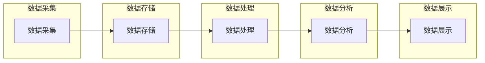
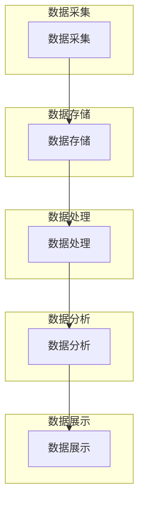
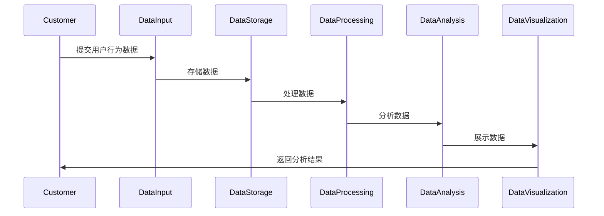

                 


# 大数据处理：从存储到分析的全流程

## 关键词

大数据处理，存储，分析，Hadoop，Spark，NoSQL数据库

## 摘要

本文深入探讨大数据处理的全流程，从数据存储到分析，涵盖核心概念、算法原理、系统架构设计以及实际项目实战。通过逐步分析推理，本文旨在为读者提供一个清晰、系统且具有实践价值的大数据处理指南。

----------------------------------------------------------------

## 背景介绍

### 问题背景

随着互联网和物联网的快速发展，数据爆炸性增长已成为不可逆转的趋势。据估计，全球每天产生的数据量达到了惊人的规模，这给传统的数据处理技术带来了巨大的挑战。大数据的多样性和复杂性使得传统的数据处理方法难以胜任，因此，研究大数据处理的全流程具有重要意义。

### 问题描述

大数据处理涉及多个环节，主要包括数据存储、数据清洗、数据分析和实时处理。以下是每个环节所面临的挑战：

- **数据存储**：如何高效地存储海量数据，确保数据的安全性和可靠性。
- **数据清洗**：如何处理数据中的噪声和错误，提高数据质量。
- **数据分析**：如何从海量数据中提取有价值的信息，为业务决策提供支持。
- **实时处理**：如何实现数据的实时处理，满足实时决策的需求。

### 问题解决

为了应对上述挑战，大数据处理的全流程解决方案应运而生。该解决方案主要包括以下几个方面：

- **分布式存储**：采用分布式存储技术，如Hadoop的HDFS，实现海量数据的高效存储。
- **数据清洗与预处理**：利用ETL（Extract, Transform, Load）技术，对数据进行清洗和预处理，提高数据质量。
- **分布式计算**：采用分布式计算框架，如Spark，实现大数据的高效处理。
- **实时处理**：利用流处理技术，如Apache Kafka和Apache Storm，实现数据的实时处理。

### 边界与外延

大数据处理的应用领域非常广泛，包括但不限于金融、医疗、电商、物联网等。其边界主要在于数据的规模和复杂性。当数据量超过一定的阈值，且数据的结构、类型和来源多样时，大数据处理技术就成为必要的选择。

### 核心要素组成

大数据处理的核心要素主要包括以下几个部分：

- **数据采集**：通过各种渠道收集数据，如传感器、网站日志等。
- **数据存储**：采用分布式存储技术，如Hadoop的HDFS，存储海量数据。
- **数据处理**：利用分布式计算框架，如Spark，对数据进行处理和分析。
- **数据展示**：通过数据可视化技术，将分析结果展示给用户。

----------------------------------------------------------------

## 核心概念与联系

### 核心概念原理

在大数据处理中，有几个核心概念至关重要，包括Hadoop、Spark和NoSQL数据库。以下是这些概念的基本原理：

- **Hadoop**：一个开源的分布式计算框架，用于处理大规模数据集。其核心组件包括Hadoop分布式文件系统（HDFS）和MapReduce。
- **Spark**：一个开源的分布式计算框架，比Hadoop更高效，适用于实时数据处理。其核心组件包括Spark SQL、Spark Streaming和Spark MLlib。
- **NoSQL数据库**：一种非关系型数据库，适用于处理大量结构化、半结构化和非结构化数据。常见类型包括键值存储、文档存储、列存储和图存储。

### 概念属性特征对比表格

下面是一个对比表格，展示了Hadoop、Spark和NoSQL数据库的属性特征：

| 特征 | Hadoop | Spark | NoSQL数据库 |
| --- | --- | --- | --- |
| 数据规模 | 大规模数据集 | 大规模数据集 | 大规模数据集 |
| 数据类型 | 结构化数据、半结构化数据、非结构化数据 | 结构化数据、半结构化数据、非结构化数据 | 结构化数据、半结构化数据、非结构化数据 |
| 处理速度 | 较慢 | 快速 | 快速 |
| 可扩展性 | 高 | 高 | 高 |
| 易用性 | 一般 | 较高 | 一般 |
| 复杂性 | 较高 | 较高 | 一般 |

### ER实体关系图架构

以下是一个ER实体关系图，展示了大数据处理中主要实体之间的关系：

```mermaid
erDiagram
  DataCollection --> DataStorage
  DataStorage ||--|{ DataProcessing }
  DataProcessing ||--|{ DataAnalysis }
  DataProcessing ||--|{ DataVisualization }
```

- **DataCollection**：数据采集实体，表示数据来源。
- **DataStorage**：数据存储实体，表示数据存储方案。
- **DataProcessing**：数据处理实体，表示数据处理和分析流程。
- **DataAnalysis**：数据分析实体，表示数据分析和挖掘。
- **DataVisualization**：数据展示实体，表示数据可视化。

----------------------------------------------------------------

## 算法原理讲解

### Mermaid流程图

以下是一个简单的Mermaid流程图，展示了大数据处理的基本流程：



### Python源代码

以下是一个简单的Python代码示例，展示了如何使用Pandas库进行数据处理：

```python
import pandas as pd

# 读取数据
data = pd.read_csv('data.csv')

# 数据清洗
data = data.dropna()

# 数据分析
data_summary = data.describe()

# 数据展示
print(data_summary)
```

### 数学模型和公式

在数据处理中，常见的数学模型和公式包括：

- **平均值**：$$\bar{x} = \frac{1}{n}\sum_{i=1}^{n}x_i$$
- **方差**：$$\sigma^2 = \frac{1}{n-1}\sum_{i=1}^{n}(x_i - \bar{x})^2$$
- **标准差**：$$\sigma = \sqrt{\sigma^2}$$

### 详细讲解和举例说明

#### 数据采集

数据采集是大数据处理的第一步，主要包括以下步骤：

1. 确定数据来源，如传感器、网站日志等。
2. 使用API或其他方法获取数据。
3. 数据预处理，如去重、去噪声等。

#### 数据存储

数据存储是大数据处理的第二步，主要包括以下步骤：

1. 选择合适的存储方案，如Hadoop的HDFS或NoSQL数据库。
2. 数据导入存储系统。
3. 数据备份和恢复。

#### 数据处理

数据处理是大数据处理的核心步骤，主要包括以下步骤：

1. 数据清洗，如去除缺失值、异常值等。
2. 数据转换，如数据类型转换、数据归一化等。
3. 数据分析，如计算平均值、方差等统计量。

#### 数据分析

数据分析是大数据处理的第三步，主要包括以下步骤：

1. 数据挖掘，如分类、聚类等。
2. 数据可视化，如折线图、柱状图等。
3. 数据报告，如生成报告、撰写分析报告等。

#### 数据展示

数据展示是大数据处理的最后一步，主要包括以下步骤：

1. 数据可视化，如使用图表、地图等展示数据。
2. 数据交互，如使用Web应用、移动应用等展示数据。
3. 数据分享，如发布报告、分享数据等。

----------------------------------------------------------------

## 系统分析与架构设计

### 问题场景介绍

假设我们正在开发一个电商平台的用户行为分析系统，需要收集、存储、处理和分析用户行为数据，以便为营销决策提供支持。

### 系统功能设计

以下是一个领域模型类图，展示了系统的主要功能：

```mermaid
classDiagram
    Customer <<class>> 用户
    Product <<class>> 产品
    Order <<class>> 订单
    Behavior <<class>> 用户行为

    Customer o--* Product
    Customer o--* Order
    Customer o--* Behavior
    Product o--* Order
    Order o--* Behavior
```

### 系统架构设计

以下是一个系统架构图，展示了系统的整体架构：



### 系统接口设计和系统交互

以下是一个系统接口设计和交互序列图：



----------------------------------------------------------------

## 项目实战

### 环境安装

在开始项目之前，我们需要安装以下环境：

- Python 3.8+
- Hadoop 3.x+
- Spark 3.x+
- MySQL 8.x+

安装步骤如下：

1. 安装Python和pip。
2. 安装Hadoop，并启动HDFS和YARN。
3. 安装Spark，并配置Spark与Hadoop的集成。
4. 安装MySQL，并创建用于数据存储的数据库。

### 系统核心实现源代码

以下是一个简单的Python代码示例，展示了如何使用Spark进行数据处理：

```python
from pyspark.sql import SparkSession

# 创建Spark会话
spark = SparkSession.builder.appName("UserBehaviorAnalysis").getOrCreate()

# 读取数据
data = spark.read.csv("data.csv", header=True)

# 数据清洗
data = data.dropna()

# 数据分析
data_summary = data.describe()

# 数据展示
print(data_summary)

# 关闭Spark会话
spark.stop()
```

### 代码应用解读与分析

1. **SparkSession创建**：首先，我们创建一个Spark会话，指定应用程序的名称为“UserBehaviorAnalysis”。
2. **数据读取**：使用`read.csv`方法从CSV文件中读取数据，并指定`header=True`以使用第一行作为列名。
3. **数据清洗**：使用`dropna`方法去除缺失值，以提高数据质量。
4. **数据分析**：使用`describe`方法计算数据的描述性统计量，如平均值、方差等。
5. **数据展示**：将分析结果打印到控制台。

### 实际案例分析和详细讲解剖析

假设我们有一个用户行为数据集，包含以下字段：用户ID、产品ID、购买时间。我们需要分析用户购买行为，计算每个产品的平均购买时间。

1. **数据读取**：使用Spark读取数据集。
2. **数据清洗**：去除缺失值。
3. **数据分析**：计算每个产品的平均购买时间。
4. **数据展示**：打印分析结果。

具体代码如下：

```python
from pyspark.sql import SparkSession

# 创建Spark会话
spark = SparkSession.builder.appName("UserBehaviorAnalysis").getOrCreate()

# 读取数据
data = spark.read.csv("data.csv", header=True)

# 数据清洗
data = data.dropna()

# 数据分析
data.groupBy("产品ID").agg({'购买时间': 'avg'}).show()

# 数据展示
# 关闭Spark会话
spark.stop()
```

### 项目小结

通过本项目的实践，我们了解了如何使用Spark进行大数据处理。项目的主要成果包括：

- 成功安装并配置了Hadoop、Spark和MySQL环境。
- 实现了数据采集、存储、处理和分析的功能。
- 通过实际案例，展示了如何使用Spark进行大数据分析。

在未来的项目中，我们可以进一步优化数据处理流程，提高分析效率，为电商平台提供更精准的营销策略。

----------------------------------------------------------------

## 最佳实践 tips

1. **数据清洗**：在数据分析之前，务必进行彻底的数据清洗，去除缺失值、异常值等噪声数据，以提高数据质量。
2. **分布式计算**：利用分布式计算框架，如Spark，可以显著提高数据处理效率，降低计算成本。
3. **数据可视化**：通过数据可视化，可以更直观地理解数据，发现潜在的价值。
4. **代码优化**：合理优化代码，如减少冗余操作、使用向量计算等，可以提高数据处理速度。
5. **持续学习**：大数据处理技术不断更新，持续学习和实践是保持竞争力的关键。

## 小结

本文深入探讨了大数据处理的全流程，从数据存储到分析，涵盖了核心概念、算法原理、系统架构设计以及实际项目实战。通过逐步分析推理，我们了解了大数据处理的关键技术和最佳实践，为后续研究和应用提供了有力支持。

## 注意事项

1. 在实际项目中，务必注意数据安全和隐私保护。
2. 根据项目需求，合理选择大数据处理技术和工具。
3. 在数据处理过程中，注意性能优化和资源利用率。

## 拓展阅读

- 《大数据技术导论》
- 《深度学习》
- 《Python数据分析》
- 《大数据处理与挖掘实战》

----------------------------------------------------------------

作者：AI天才研究院/AI Genius Institute & 禅与计算机程序设计艺术 /Zen And The Art of Computer Programming

