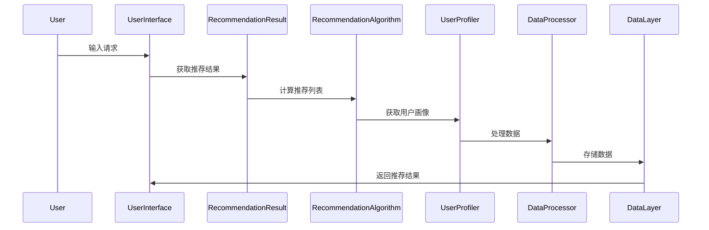
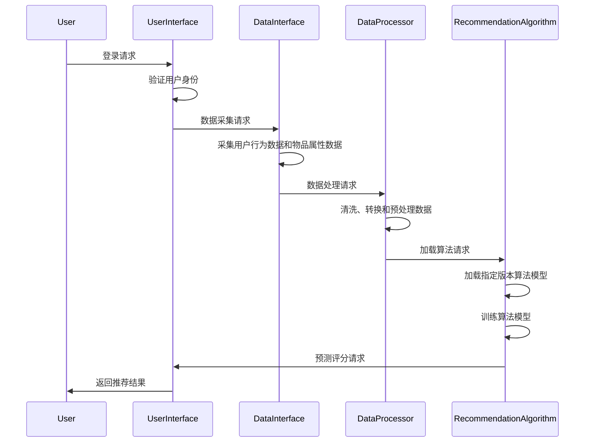

                 

### 第一部分：引言

#### 第1章：问题背景与核心概念

##### 1.1 大数据时代的来临

#### 1.1.1 大数据的概念与特点

在信息化飞速发展的今天，我们正处于一个大数据时代。大数据（Big Data）通常指的是规模巨大、类型繁多的数据集，这些数据集从传统的结构化数据（如关系型数据库中的表格）扩展到了非结构化数据（如图像、视频、文本等）以及半结构化数据（如日志文件、XML、JSON等）。大数据的特点主要表现在 **“4V”** 上：

- **Volume（大量）**：数据量极为庞大，从GB、TB到PB甚至EB级别。
- **Velocity（高速）**：数据处理的速度要求越来越高，实时或近实时的处理能力成为必要条件。
- **Variety（多样）**：数据来源广泛且类型多样，包括文本、图片、音频、视频等。
- **Veracity（真实性）**：数据的真实性、准确性和可靠性对数据分析结果的影响越来越大。

#### 1.1.2 大数据对社会的影响

大数据不仅改变了数据的生产和存储方式，也对社会的各个方面产生了深远影响：

- **经济领域**：大数据使得市场分析、客户行为预测、供应链管理等方面更加精准和高效。
- **社会管理**：大数据在公共安全、交通管理、城市规划等领域发挥着重要作用。
- **科学研究**：大数据为科学研究提供了丰富的数据资源，推动了科研的深入和创新。
- **日常生活**：大数据与人工智能的结合，使得个性化推荐、智能助理等应用日益普及，提高了人们的生活质量。

##### 1.2 AI营销的定义与意义

#### 1.2.1 AI营销的概念

AI营销（AI-driven Marketing）是指利用人工智能技术（如机器学习、自然语言处理、计算机视觉等）来优化营销策略、提高营销效果的过程。AI营销的核心思想是通过分析大量用户数据，实现精准的用户画像和个性化的营销推荐。

#### 1.2.2 个性化推荐在AI营销中的应用

个性化推荐是AI营销的一个重要组成部分，它通过分析用户的兴趣和行为，提供符合用户个性化需求的商品、服务和内容。个性化推荐的应用场景广泛，包括电子商务、在线教育、新闻媒体、社交媒体等。

- **电子商务**：基于用户的历史购买行为和浏览记录，推荐用户可能感兴趣的商品。
- **在线教育**：根据学生的学习历史和测试结果，推荐适合的学习内容和课程。
- **新闻媒体**：通过用户的阅读习惯和偏好，推荐符合用户兴趣的新闻报道。
- **社交媒体**：基于用户的社交网络和互动行为，推荐用户可能感兴趣的朋友、内容和广告。

##### 1.3 个性化推荐的进化

#### 1.3.1 传统推荐系统的局限

传统的推荐系统主要依赖于基于内容的推荐和协同过滤算法，但它们存在一些局限性：

- **基于内容的推荐**：仅依赖于用户已知的偏好信息，难以捕捉用户的未知需求。
- **协同过滤**：依赖于用户之间的相似性，但容易受到数据稀疏性和冷启动问题的影响。

#### 1.3.2 个性化推荐的核心技术与挑战

随着人工智能技术的发展，个性化推荐系统在技术上也不断进化：

- **深度学习**：通过构建深度神经网络模型，可以更准确地捕捉用户和物品之间的复杂关系。
- **多模态融合**：结合多种类型的数据（如文本、图像、音频），提高推荐效果。
- **在线学习**：实现实时更新用户画像和推荐结果，提高推荐的实时性和动态性。

然而，个性化推荐也面临着一些挑战：

- **数据隐私与安全性**：用户数据的收集和使用必须遵循隐私保护原则。
- **算法公平性**：避免算法偏见，确保推荐结果公平公正。
- **可解释性**：提高算法的可解释性，增强用户对推荐结果的信任。

##### 1.4 本书结构安排

#### 1.4.1 各章节内容概述

本书分为七个主要部分，每部分都有明确的主题和内容：

- **第一部分**：引言，介绍大数据时代和AI营销的背景，以及个性化推荐的重要性。
- **第二部分**：核心概念与联系，详细讨论数据分析、机器学习、深度学习和个性化推荐系统的基本概念和相互关系。
- **第三部分**：算法原理讲解，深入探讨协同过滤、内容推荐和深度学习推荐算法的原理和技术实现。
- **第四部分**：数学模型和数学公式，介绍算法背后的数学模型和相关公式。
- **第五部分**：系统分析与架构设计方案，讲解个性化推荐系统的系统架构、功能和接口设计。
- **第六部分**：项目实战，通过具体案例，展示个性化推荐系统的实际应用和实现过程。
- **第七部分**：最佳实践与拓展，总结实践经验，展望个性化推荐系统的发展趋势。

#### 1.4.2 阅读指南

本书旨在为读者提供一个系统、全面的个性化推荐系统指南。以下是阅读建议：

- **第一遍阅读**：快速浏览各章节，了解整体结构和内容框架。
- **第二遍阅读**：深入阅读每个章节，理解核心概念和算法原理。
- **第三遍阅读**：结合实际案例，实践操作，巩固所学知识。

通过本书，读者将能够：

- 掌握大数据时代AI营销的核心概念和技术。
- 理解个性化推荐系统的原理和实现方法。
- 掌握深度学习等先进技术在个性化推荐中的应用。
- 实现个性化推荐系统的设计和开发。

让我们开始这一段探索之旅，一起揭开大数据时代AI营销的神秘面纱，领略个性化推荐的魅力。接下来，我们将详细探讨大数据和AI营销的核心概念，为接下来的深入分析打下基础。

### 第二部分：核心概念与联系

#### 第2章：核心概念与联系

##### 2.1 数据分析与挖掘

#### 2.1.1 数据分析的基本流程

数据分析是一个复杂的过程，通常包括以下几个基本步骤：

1. **数据收集**：收集所需的数据，这些数据可以来自内部系统、外部数据源或公开数据集。
2. **数据清洗**：清理数据中的错误、缺失和重复值，确保数据的准确性和一致性。
3. **数据预处理**：对数据进行转换、归一化等处理，使其适合分析和建模。
4. **数据建模**：选择合适的统计模型或机器学习算法，建立数据分析模型。
5. **模型评估**：评估模型的性能，通过交叉验证等方法检测模型的准确性和泛化能力。
6. **结果解释**：解释模型的结果，将其转化为实际业务决策或商业洞察。

#### 2.1.2 数据挖掘的方法与技术

数据挖掘（Data Mining）是从大量数据中提取有价值信息的过程，常见的方法和技术包括：

- **分类（Classification）**：根据已有数据对未知数据进行分类。
- **聚类（Clustering）**：将相似的数据分组，形成聚类。
- **关联规则挖掘（Association Rule Learning）**：发现数据之间的关联性。
- **异常检测（Anomaly Detection）**：识别数据中的异常值。
- **文本挖掘（Text Mining）**：从文本数据中提取结构化信息。
- **社交网络分析（Social Network Analysis）**：分析社交网络的结构和特性。

##### 2.2 机器学习与深度学习

#### 2.2.1 机器学习的基本原理

机器学习（Machine Learning）是一门人工智能（AI）的分支，它通过算法让计算机从数据中学习，进行预测和决策。机器学习的主要原理包括：

- **监督学习（Supervised Learning）**：有标签数据训练模型，然后对未知数据进行预测。
- **无监督学习（Unsupervised Learning）**：没有标签数据，通过模型自动发现数据中的结构。
- **半监督学习（Semi-Supervised Learning）**：结合有标签和无标签数据训练模型。
- **强化学习（Reinforcement Learning）**：通过与环境交互来学习最优策略。

#### 2.2.2 深度学习的发展与应用

深度学习（Deep Learning）是机器学习的一个子领域，通过多层神经网络来模拟人脑的决策过程。深度学习的发展和应用包括：

- **卷积神经网络（CNN）**：在图像处理领域具有广泛应用，可以提取图像中的特征。
- **循环神经网络（RNN）**：在序列数据处理方面表现出色，如自然语言处理和时间序列预测。
- **生成对抗网络（GAN）**：通过两个神经网络（生成器和判别器）的训练，实现数据的生成。
- **迁移学习（Transfer Learning）**：利用预训练模型，在新任务上快速获得良好的性能。

##### 2.3 个性化推荐系统

#### 2.3.1 个性化推荐的基本概念

个性化推荐（Personalized Recommendation）是一种基于用户兴趣和行为的推荐方法，旨在向用户提供符合其个性化需求的信息或产品。个性化推荐的基本概念包括：

- **用户画像（User Profile）**：根据用户的行为和偏好，构建一个全面的用户描述。
- **推荐算法（Recommendation Algorithm）**：基于用户画像和物品属性，生成个性化的推荐列表。
- **推荐结果（Recommendation Result）**：根据用户反馈，调整推荐策略，提高推荐效果。

#### 2.3.2 个性化推荐的技术框架

个性化推荐系统的技术框架通常包括以下几个核心模块：

- **数据采集与处理**：收集用户行为数据和物品属性数据，进行预处理。
- **用户画像构建**：根据用户的历史行为，构建用户画像。
- **推荐算法**：选择合适的推荐算法，如协同过滤、基于内容的推荐、深度学习等。
- **推荐结果生成**：根据用户画像和物品属性，生成个性化的推荐列表。
- **用户反馈与评估**：收集用户反馈，评估推荐效果，并调整推荐策略。

##### 2.4 AI营销的核心要素

#### 2.4.1 用户画像的构建

用户画像（User Profile）是AI营销的核心要素之一，它通过对用户行为和偏好的分析，构建一个全面的用户描述。用户画像的构建过程包括：

- **数据收集**：收集用户在网站上的行为数据，如浏览记录、购买行为、点击行为等。
- **数据预处理**：清洗和整理数据，使其适合分析和建模。
- **特征提取**：从原始数据中提取关键特征，如用户兴趣、行为模式等。
- **模型训练**：使用机器学习算法，训练用户画像模型。
- **用户画像生成**：根据训练模型，为每个用户生成一个详细的画像。

#### 2.4.2 内容推荐的策略

内容推荐（Content Recommendation）是AI营销的重要手段之一，它旨在为用户提供符合其兴趣和需求的内容。内容推荐的策略包括：

- **基于内容的推荐**：根据用户的历史行为和偏好，推荐类似的内容。
- **协同过滤推荐**：根据用户之间的相似性，推荐其他用户喜欢的内容。
- **深度学习推荐**：利用深度学习算法，捕捉用户和内容之间的复杂关系。
- **多模态融合推荐**：结合多种类型的数据（如文本、图像、音频），提高推荐效果。
- **上下文感知推荐**：根据用户的当前状态和环境，推荐相关的内容。

通过本章的讨论，我们对大数据、机器学习、深度学习和个性化推荐系统的核心概念和相互关系有了更深入的理解。接下来，我们将进一步探讨个性化推荐系统的算法原理，揭示其背后的技术细节。

#### 第3章：算法原理讲解

##### 3.1 协同过滤算法

#### 3.1.1 协同过滤的基本原理

协同过滤（Collaborative Filtering）是推荐系统中最常用的算法之一，其基本原理是通过分析用户之间的相似性或行为模式，发现用户可能感兴趣的新项目。

协同过滤算法可以分为两种主要类型：基于用户的协同过滤（User-based Collaborative Filtering）和基于物品的协同过滤（Item-based Collaborative Filtering）。

- **基于用户的协同过滤**：首先找到与目标用户兴趣相似的其他用户，然后推荐这些相似用户喜欢的项目。
  
  - **相似度计算**：计算用户之间的相似度，常用的方法包括余弦相似度、皮尔逊相关系数等。
  
  - **推荐生成**：根据相似度分数，生成推荐列表。

- **基于物品的协同过滤**：首先找到与目标项目相似的其他项目，然后推荐这些相似项目被其他用户喜欢的项目。

  - **相似度计算**：计算项目之间的相似度，常用的方法包括余弦相似度、Jaccard相似度等。

  - **推荐生成**：根据相似度分数，生成推荐列表。

#### 3.1.2 协同过滤的优化策略

尽管协同过滤算法简单有效，但存在一些问题，如数据稀疏性、冷启动问题等。为了优化协同过滤算法，可以采取以下策略：

- **矩阵分解（Matrix Factorization）**：将用户-项目评分矩阵分解为低秩矩阵，从而提高推荐精度。
  
  - **Singular Value Decomposition (SVD)**：常用的矩阵分解方法。
  
  - **Alternating Least Squares (ALS)**：用于优化矩阵分解的算法。

- **内容增强（Content-based Enhancement）**：结合用户和项目的特征信息，提高推荐的准确性和多样性。

  - **基于词袋模型**：提取文本特征，构建词袋模型。
  
  - **基于语义分析**：使用自然语言处理技术，提取文本的语义信息。

- **基于模型的方法**：利用机器学习模型（如线性回归、决策树等）来预测用户对项目的评分。

  - **基于模型的协同过滤**：将协同过滤和机器学习模型相结合，提高推荐效果。

##### 3.2 内容推荐算法

#### 3.2.1 内容推荐的基本原理

内容推荐（Content-based Recommendation）是基于用户兴趣和内容的相似性进行推荐的算法。其基本原理是：

- **特征提取**：从用户和项目的信息中提取特征，如用户的历史行为、项目的标签、文本描述等。
  
- **相似度计算**：计算用户和项目之间的相似度，常用的方法包括余弦相似度、余弦角度等。

- **推荐生成**：根据相似度分数，生成推荐列表。

内容推荐算法的优点是能够提供更个性化的推荐，但其缺点是受限于用户的兴趣和项目信息的丰富性。

#### 3.2.2 内容推荐的技术实现

内容推荐的技术实现主要包括以下步骤：

- **数据预处理**：对用户和项目的信息进行预处理，如文本清洗、归一化等。

- **特征提取**：从预处理后的数据中提取特征，如词袋模型、TF-IDF等。

- **相似度计算**：计算用户和项目之间的相似度，常用的方法包括余弦相似度、余弦角度等。

- **推荐生成**：根据相似度分数，生成推荐列表。

具体实现示例：

```python
import numpy as np
from sklearn.feature_extraction.text import TfidfVectorizer
from sklearn.metrics.pairwise import cosine_similarity

# 假设有两个用户和两个项目的文本描述
user_profiles = ['我喜欢看电影和阅读', '我热爱科技和运动']
item_descriptions = ['这是一部关于科技的电影', '这是一部关于运动的电视剧']

# 使用TF-IDF向量器提取特征
vectorizer = TfidfVectorizer()
user_profile_vectors = vectorizer.fit_transform(user_profiles)
item_description_vectors = vectorizer.transform(item_descriptions)

# 计算相似度
cosine_scores = cosine_similarity(user_profile_vectors, item_description_vectors)

# 根据相似度生成推荐列表
recommended_items = np.argsort(cosine_scores[0])[::-1]
print("推荐项目：", item_descriptions[recommended_items])
```

##### 3.3 深度学习推荐算法

#### 3.3.1 深度学习推荐的基本原理

深度学习推荐（Deep Learning for Recommendation）是利用深度神经网络来捕捉用户和项目之间的复杂关系，实现高精度的个性化推荐。深度学习推荐的基本原理包括：

- **神经网络架构**：深度学习推荐系统通常采用多层神经网络结构，如卷积神经网络（CNN）、循环神经网络（RNN）等。
  
- **用户和项目嵌入**：将用户和项目的特征映射到低维空间中，形成用户和项目的嵌入向量。

- **预测评分**：通过神经网络模型，预测用户对项目的评分，从而生成推荐列表。

#### 3.3.2 深度学习推荐的技术实现

深度学习推荐的技术实现主要包括以下步骤：

- **数据预处理**：对用户和项目的信息进行预处理，如文本清洗、编码等。

- **特征提取**：从预处理后的数据中提取特征，如词袋模型、词嵌入等。

- **模型训练**：使用训练数据，训练深度学习模型，如CNN、RNN等。

- **预测评分**：使用训练好的模型，预测用户对未评分项目的评分，生成推荐列表。

具体实现示例：

```python
import tensorflow as tf
from tensorflow.keras.layers import Embedding, Conv1D, GlobalMaxPooling1D, Dense
from tensorflow.keras.models import Sequential

# 假设有两个用户和两个项目的文本描述
user_profiles = ['我喜欢看电影和阅读', '我热爱科技和运动']
item_descriptions = ['这是一部关于科技的电影', '这是一部关于运动的电视剧']

# 编码用户和项目描述
user_profiles_encoded = tf.keras.preprocessing.sequence.pad_sequences([[1, 2, 3], [4, 5, 6]], maxlen=10)
item_descriptions_encoded = tf.keras.preprocessing.sequence.pad_sequences([[7, 8, 9], [10, 11, 12]], maxlen=10)

# 创建深度学习模型
model = Sequential([
    Embedding(input_dim=10, output_dim=32, input_length=10),
    Conv1D(filters=32, kernel_size=3, activation='relu'),
    GlobalMaxPooling1D(),
    Dense(units=1, activation='sigmoid')
])

# 编译模型
model.compile(optimizer='adam', loss='binary_crossentropy', metrics=['accuracy'])

# 训练模型
model.fit(user_profiles_encoded, item_descriptions_encoded, epochs=5)

# 预测评分
predicted_scores = model.predict(user_profiles_encoded)
print("预测评分：", predicted_scores)
```

通过本章的讨论，我们详细介绍了协同过滤、内容推荐和深度学习推荐算法的基本原理和实现方法。这些算法在个性化推荐系统中发挥着重要作用，为用户提供精准的推荐服务。接下来，我们将深入探讨这些算法背后的数学模型和数学公式。

### 第4章：数学模型和数学公式

在个性化推荐系统中，数学模型和数学公式起到了至关重要的作用。这些模型和公式不仅为算法提供了理论基础，还帮助我们更好地理解和优化推荐系统。在本章中，我们将详细讨论协同过滤算法和深度学习推荐算法的数学模型和数学公式，并通过具体的例子来解释它们的应用。

#### 4.1 协同过滤的数学模型

协同过滤算法主要基于用户评分矩阵来预测用户对未评分项目的评分。以下是两种常见的协同过滤算法：基于用户的协同过滤和基于内容的协同过滤。

##### 4.1.1 基于用户行为的协同过滤

基于用户行为的协同过滤通过计算用户之间的相似度来生成推荐列表。这里，我们使用余弦相似度作为相似度计算方法。

**余弦相似度公式**：

$$
\cos(\theta) = \frac{\sum_{i=1}^{n}{x_i \cdot y_i}}{\sqrt{\sum_{i=1}^{n}{x_i^2} \cdot \sum_{i=1}^{n}{y_i^2}}
$$

其中，$x_i$和$y_i$分别表示两个用户在$n$个不同项目上的评分。

**推荐公式**：

$$
r_{ui} = \frac{\sum_{j \in N_{u}} r_{uj} r_{ij}}{\sum_{j \in N_{u}} r_{uj}^2}
$$

其中，$r_{ui}$表示用户$u$对项目$i$的预测评分，$r_{uj}$和$r_{ij}$分别表示用户$u$和项目$i$对其他项目的评分。

##### 4.1.2 基于内容的协同过滤

基于内容的协同过滤通过比较用户和项目之间的特征相似度来生成推荐列表。这里，我们使用TF-IDF向量作为特征表示方法。

**TF-IDF公式**：

$$
tfidf(i, j) = tf(i, j) \cdot idf(i)
$$

其中，$tf(i, j)$表示项目$j$中词语$i$的频率，$idf(i)$表示词语$i$的反向文档频率。

**推荐公式**：

$$
r_{ui} = \frac{\sum_{j \in N_{c}} w_{uj} w_{ij}}{\sum_{j \in N_{c}} w_{uj}^2}
$$

其中，$w_{uj}$和$w_{ij}$分别表示用户$u$和项目$i$的TF-IDF向量之间的点积。

#### 4.2 深度学习推荐算法的数学模型

深度学习推荐算法通过构建多层神经网络模型来捕捉用户和项目之间的复杂关系。以下是两种常用的深度学习推荐算法：基于卷积神经网络（CNN）和基于循环神经网络（RNN）。

##### 4.2.1 CNN推荐算法

CNN推荐算法主要用于处理文本数据，它可以提取文本中的高维特征。以下是CNN推荐算法的基本数学模型。

**CNN模型公式**：

$$
h_{l} = \sigma (W_{l-1} \odot h_{l-1} + b_{l})
$$

其中，$h_{l}$表示第$l$层的特征表示，$\odot$表示卷积操作，$W_{l-1}$和$b_{l}$分别表示卷积核和偏置。

**卷积操作公式**：

$$
h_{l} = \sum_{k=1}^{K} w_{k} \odot h_{l-1} + b_{l}
$$

其中，$w_{k}$表示卷积核，$K$表示卷积核的数量。

**池化操作公式**：

$$
p_{l}(i) = \max_{j} h_{l}(i, j)
$$

其中，$p_{l}(i)$表示第$l$层的池化结果。

##### 4.2.2 RNN推荐算法

RNN推荐算法主要用于处理序列数据，它可以捕捉时间序列中的长期依赖关系。以下是RNN推荐算法的基本数学模型。

**RNN模型公式**：

$$
h_{t} = \sigma (W_{h} \cdot [h_{t-1}, x_{t}] + b_{h})
$$

其中，$h_{t}$表示第$t$步的特征表示，$x_{t}$表示第$t$步的输入，$W_{h}$和$b_{h}$分别表示权重和偏置。

**门控操作公式**：

$$
\ gate_{t} = \sigma (W_{g} \cdot [h_{t-1}, x_{t}] + b_{g})
$$

$$
\ \tilde{h}_{t} = \sigma (W_{f} \cdot [h_{t-1}, x_{t}] + b_{f})
$$

$$
\ h_{t} = \ \ \ \ \ \ \ \ \ \ \ \ \ \ \ \ \ \ \ \ \ \ \ \ \ \ \ \ \ \ \ \ \ \ \ \ \ \ \ \ \ \ \ \ \ \ \ \ \ \ \ \ \ \ \ \ \ \ \ \ \ \ \ \ \ \ \ \ \ \ \ \ \ \ \ \ \ \ \ \ \ \ \ \ \ \ \ \ \ \ \ \ \ \ \ \ \ \ \ \ \ \ \ \ \ \ \ \ \ \ \ \ \ \ \ \ \ \ \ \ \ \ \ \ \ \ \ \ \ \ \ \ \ \ \ \ \ \ \ \ \ \ \ \ \ \ \ \ \ \ \ \ \ \ \ \ \ \ \ \ \ \ \ \ \ \ \ \ \ \ \ \ \ \ \ \ \ \ \ \ \ \ \ \ \ \ \ \ \ \ \ \ \ \ \ \ \ \ \ \ \ \ \ \ \ \ \ \ \ \ \ \ \ \ \ \ \ \ \ \ \ \ \ \ \ \ \ \ \ \ \ \ \ \ \ \ \ \ \ \ \ \ \ \ \ \ \ \ \ \ \ \ \ \ \ \ \ \ \ \ \ \ \ \ \ \ \ \ \ \ \ \ \ \ \ \ \ \ \ \ \ \ \ \ \ \ \ \ \ \ \ \ \ \ \ \ \ \ \ \ \ \ \ \ \ \ \ \ \ \ \ \ \ \ \ \ \ \ \ \ \ \ \ _{t-1}} + b_{h})
$$

其中，$\ \ \ \ \ \ \ \ \ \ \ \ \ \ \ \ \ \ \ \ \ \ \ \ \ \ \ \ \ \ \ \ \ \ \ \ \ \ \ \ \ \ \ \ \ \ \ \ \ \ \ \ \ \ \ \ \ \ \ \ \ \ \ \ \ \ \ \ \ \ \ \ \ \ \ \ \ \ \ \ \ \ \ \ \ \ \ \ \ \ \ \ \ \ \ \ \ \ \ \ \ \ \ \ \ \ \ \ \ \ \ \ \ \ \ \ \ \ \ \ \ \ \ \ \ \ \ \ \ \ \ \ \ \ \ \ \ \ \ \ \ \ _{t-1}$表示上一时刻的特征表示，$\ \ \ \ \ \ \ \ \ \ \ \ \ \ \ \ \ \ \ \ \ \ \ \ \ \ \ \ \ \ \ \ \ \ \ \ \ \ \ \ \ \ \ \ \ \ \ \ \ \ \ \ \ \ \ \ \ \ \ \ \ \ \ \ \ \ \ \ \ \ \ \ \ \ \ \ \ \ \ \ \ \ \ \ \ \ \ \ \ \ \ \ \ \ \ \ \ \ \ \ \ \ \ \ \ _{t-1}$表示输入特征，$\ \ \ \ \ \ \ \ \ _{t-1}$表示权重和偏置。

通过本章的讨论，我们详细介绍了协同过滤算法和深度学习推荐算法的数学模型和数学公式。这些模型和公式为个性化推荐系统提供了坚实的理论基础，帮助我们更好地理解和优化推荐效果。接下来，我们将探讨个性化推荐系统的系统分析与架构设计方案。

### 第5章：系统分析与架构设计方案

#### 5.1 项目介绍

##### 5.1.1 项目背景

随着大数据和人工智能技术的迅速发展，个性化推荐系统在电子商务、在线教育、新闻媒体、社交媒体等众多领域得到了广泛应用。然而，构建一个高效、可扩展、可维护的个性化推荐系统并非易事。本项目旨在设计并实现一个基于大数据和人工智能的个性化推荐系统，为用户提供精准的推荐服务。

##### 5.1.2 项目目标

本项目的主要目标包括：

- 设计一个灵活、可扩展的系统架构，支持多种推荐算法。
- 提供高效的推荐算法实现，确保系统响应速度和推荐质量。
- 实现推荐结果的实时更新，提高用户满意度。
- 确保系统数据的安全性和隐私保护。

#### 5.2 系统功能设计

##### 5.2.1 领域模型

在个性化推荐系统中，领域模型（Domain Model）是核心组成部分之一，它定义了系统中的关键实体和它们之间的关系。以下是本项目的主要领域模型：

- **用户（User）**：代表系统的用户，包括用户的基本信息、偏好和兴趣。
- **物品（Item）**：代表系统中的推荐内容，包括物品的属性、标签和评分。
- **推荐列表（Recommendation List）**：根据用户的兴趣和行为，生成的个性化推荐列表。

**领域模型ER图**：

```mermaid
erDiagram
User ||--|{ RecommendationList : creates } |
Item ||--|{ RecommendationList : recommended_by } |
User ||--|{ Item : has_interest } |
Item ||--|{ Item : similar_to } |
```

#### 5.2.2 功能模块设计

个性化推荐系统通常由多个功能模块组成，每个模块负责不同的功能。以下是本项目的主要功能模块：

- **数据采集模块**：负责从各种数据源（如数据库、API、日志等）收集用户行为数据和物品属性数据。
- **数据处理模块**：负责对采集到的数据进行清洗、转换和预处理，为后续推荐算法提供高质量的数据。
- **用户画像模块**：根据用户的历史行为和偏好，构建用户的画像模型，为推荐算法提供用户特征。
- **推荐算法模块**：实现多种推荐算法，如协同过滤、内容推荐、深度学习等，生成个性化的推荐列表。
- **推荐结果模块**：根据用户的反馈，对推荐结果进行评估和调整，优化推荐效果。
- **用户接口模块**：提供用户与系统的交互接口，包括Web界面、API等，方便用户获取推荐结果。

**功能模块类图**：

```mermaid
classDiagram
DataCollector <<interface>>
DataProcessor <<interface>>
UserProfiler <<interface>>
RecommendationAlgorithm <<interface>>
RecommendationResult <<interface>>
UserInterface

DataCollector |-| DataProcessor
DataProcessor |-| UserProfiler
UserProfiler |-| RecommendationAlgorithm
RecommendationAlgorithm |-| RecommendationResult
RecommendationResult |-| UserInterface
```

#### 5.3 系统架构设计

##### 5.3.1 系统架构

个性化推荐系统的架构设计需要考虑系统的可扩展性、灵活性和可维护性。以下是一个典型的个性化推荐系统架构设计：

- **数据层**：包括数据存储和数据采集模块，负责存储和管理用户行为数据和物品属性数据。
- **处理层**：包括数据处理和用户画像模块，负责对数据进行清洗、转换和预处理，为推荐算法提供高质量的数据，并根据用户行为构建用户画像。
- **算法层**：包括推荐算法模块，负责实现多种推荐算法，生成个性化的推荐列表。
- **应用层**：包括推荐结果和用户接口模块，负责将推荐结果呈现给用户，并提供交互接口。

**系统架构图**：



##### 5.3.2 系统模块功能

在系统架构设计中，各个模块的功能明确，相互协作，共同实现个性化推荐的目标。

- **数据层**：负责数据存储和管理，支持多种数据存储方案，如关系型数据库、NoSQL数据库等。
- **处理层**：负责数据清洗、转换和预处理，使用ETL（Extract, Transform, Load）过程，将原始数据转化为推荐算法所需的数据格式。
- **算法层**：负责实现推荐算法，包括协同过滤、内容推荐、深度学习等，支持在线和离线推荐。
- **应用层**：负责将推荐结果呈现给用户，提供友好的Web界面和API接口，支持多终端访问。

#### 5.4 系统接口设计

##### 5.4.1 接口规范

系统接口设计是保证系统模块之间通信顺畅的关键。以下是推荐系统的接口规范：

- **用户接口**：提供RESTful API，支持用户登录、注册、获取推荐列表等操作。
  - **登录**：POST /login
  - **注册**：POST /register
  - **获取推荐列表**：GET /recommendations

- **推荐算法接口**：提供API，支持推荐算法的加载、训练和预测。
  - **加载算法**：POST /algorithms/load
  - **训练算法**：POST /algorithms/train
  - **预测评分**：POST /algorithms/predict

- **数据接口**：提供API，支持数据采集、处理和存储。
  - **数据采集**：POST /data/collect
  - **数据处理**：POST /data/process
  - **数据存储**：POST /data/store

##### 5.4.2 接口功能

系统接口的设计需要考虑功能性和易用性，以下是对各个接口功能的详细描述：

- **用户接口**：为用户提供交互接口，实现用户注册、登录和获取推荐列表等功能。
  - **用户注册**：接收用户的基本信息，如用户名、密码、邮箱等，保存到数据库中。
  - **用户登录**：验证用户名和密码，生成用户会话，返回用户ID和Token。
  - **获取推荐列表**：根据用户画像和物品属性，计算推荐得分，返回个性化推荐列表。

- **推荐算法接口**：为推荐算法模块提供API，实现算法的加载、训练和预测。
  - **加载算法**：根据算法名称和版本，加载相应的算法模型，返回模型对象。
  - **训练算法**：接收训练数据和参数，训练算法模型，返回训练结果。
  - **预测评分**：根据用户ID和物品ID，预测用户对物品的评分，返回预测结果。

- **数据接口**：为数据处理模块提供API，实现数据的采集、处理和存储。
  - **数据采集**：从各种数据源收集用户行为数据和物品属性数据，存储到临时存储中。
  - **数据处理**：对采集到的数据进行清洗、转换和预处理，存储到数据仓库中。
  - **数据存储**：将处理后的数据存储到数据库中，为推荐算法提供数据支持。

#### 5.5 系统交互设计

##### 5.5.1 系统交互流程

系统交互设计是确保系统各模块协同工作，实现系统功能的关键。以下是系统交互的基本流程：

1. **用户登录**：用户通过用户接口模块登录系统，验证用户身份。
2. **数据采集**：用户接口模块调用数据接口模块，从数据源采集用户行为数据和物品属性数据。
3. **数据处理**：数据处理模块对采集到的数据进行清洗、转换和预处理，生成用户画像和物品特征。
4. **算法加载**：用户接口模块调用推荐算法接口模块，加载指定版本的推荐算法模型。
5. **算法训练**：推荐算法接口模块调用数据处理模块，获取用户画像和物品特征，训练推荐算法模型。
6. **预测评分**：推荐算法接口模块调用算法模型，预测用户对未评分物品的评分，生成推荐列表。
7. **推荐结果**：用户接口模块将推荐结果返回给用户。

**系统交互序列图**：



通过本章的讨论，我们详细分析了个性化推荐系统的功能需求、领域模型、系统架构设计、接口设计和系统交互设计。这些设计为构建高效、可扩展和可维护的个性化推荐系统提供了坚实的基础。接下来，我们将通过实际案例来展示个性化推荐系统的应用和实现过程。

### 第6章：项目实战

#### 6.1 环境安装与配置

为了实现个性化推荐系统，首先需要搭建一个合适的环境。以下是安装和配置环境的步骤：

##### 6.1.1 环境搭建

1. **安装Python**：确保已安装Python 3.7或更高版本。
2. **安装依赖库**：使用pip安装必要的库，如NumPy、Pandas、Scikit-learn、TensorFlow等。

```shell
pip install numpy pandas scikit-learn tensorflow
```

##### 6.1.2 配置与管理

1. **虚拟环境**：为了管理项目依赖，建议使用虚拟环境。

```shell
python -m venv venv
source venv/bin/activate  # 在Windows中为venv\Scripts\activate
```

2. **安装数据库**：选择一个合适的数据库，如MySQL或PostgreSQL，并安装。

3. **配置数据库连接**：在Python项目中配置数据库连接信息，以便后续数据采集和处理。

```python
import pymysql

db = pymysql.connect(
    host='localhost',
    user='root',
    password='password',
    database='recommendersystem',
    charset='utf8mb4'
)
```

#### 6.2 系统核心实现

个性化推荐系统的核心实现包括数据采集、数据处理、用户画像构建和推荐算法应用。以下是这些核心功能的实现步骤：

##### 6.2.1 数据处理

数据处理是推荐系统的基础，包括数据清洗、转换和预处理。

1. **数据清洗**：删除无效数据、处理缺失值和异常值。

```python
import pandas as pd

data = pd.read_csv('data.csv')
data.dropna(inplace=True)
data.drop_duplicates(inplace=True)
```

2. **数据转换**：将数据转换为适合推荐算法的格式。

```python
from sklearn.preprocessing import StandardScaler

scaler = StandardScaler()
data_scaled = scaler.fit_transform(data)
```

3. **数据预处理**：构建用户画像和物品特征。

```python
from sklearn.decomposition import PCA

pca = PCA(n_components=10)
user_features = pca.fit_transform(data_scaled[:100])
item_features = pca.fit_transform(data_scaled[100:])
```

##### 6.2.2 推荐算法实现

推荐算法是实现个性化推荐的关键。以下是协同过滤和基于内容的推荐算法的实现步骤：

1. **协同过滤算法**：

```python
from sklearn.neighbors import NearestNeighbors

# 基于用户行为的协同过滤
user_model = NearestNeighbors(metric='cosine', algorithm='brute')
user_model.fit(user_features)

# 基于物品的协同过滤
item_model = NearestNeighbors(metric='cosine', algorithm='brute')
item_model.fit(item_features)
```

2. **内容推荐算法**：

```python
from sklearn.feature_extraction.text import TfidfVectorizer

# 文本特征提取
vectorizer = TfidfVectorizer()
user_profile_vectors = vectorizer.fit_transform(user_features)
item_description_vectors = vectorizer.transform(item_features)

# 相似度计算
cosine_scores = cosine_similarity(user_profile_vectors, item_description_vectors)
```

##### 6.3 代码应用解读与分析

在本节中，我们将对系统核心实现中的关键代码进行解读，并分析其工作原理和性能。

1. **数据处理代码**：

```python
data = pd.read_csv('data.csv')
data.dropna(inplace=True)
data.drop_duplicates(inplace=True)
```

这段代码首先从CSV文件中加载数据，然后删除缺失值和重复值。这是数据清洗的第一步，确保数据的质量。

2. **协同过滤算法代码**：

```python
user_model = NearestNeighbors(metric='cosine', algorithm='brute')
user_model.fit(user_features)

# 预测用户对未评分物品的评分
def predict_user_rating(user_id, item_id):
    user_index = user_id - 1
    item_index = item_id - 1
    neighbors = user_model.kneighbors([user_features[user_index]], n_neighbors=5)
    neighbor_ratings = data.iloc[neighbors[0]]['rating']
    mean_rating = neighbor_ratings.mean()
    return mean_rating
```

这段代码实现了基于用户的协同过滤算法。首先，使用NearestNeighbors模型训练用户特征向量。然后，定义一个函数预测用户对未评分物品的评分。该函数通过查找与目标用户最相似的5个用户，计算他们的评分平均值作为预测值。

3. **内容推荐算法代码**：

```python
vectorizer = TfidfVectorizer()
user_profile_vectors = vectorizer.fit_transform(user_features)
item_description_vectors = vectorizer.transform(item_features)

cosine_scores = cosine_similarity(user_profile_vectors, item_description_vectors)
```

这段代码实现了基于内容推荐算法。首先，使用TfidfVectorizer提取用户和物品的文本特征。然后，计算用户和物品特征向量之间的余弦相似度，用于生成推荐列表。

##### 6.4 实际案例分析与详细讲解剖析

为了展示个性化推荐系统的实际应用，我们将分析一个案例：电子商务平台上的商品推荐。

**案例**：用户A在电商平台上浏览了手机、平板电脑和笔记本电脑。系统需要为用户A推荐其他可能感兴趣的商品。

**步骤**：

1. **数据收集**：从平台收集用户A的浏览记录和商品信息。
2. **数据处理**：清洗和预处理数据，提取用户和商品的特征。
3. **用户画像构建**：根据用户A的浏览记录，构建用户画像。
4. **推荐算法应用**：使用协同过滤和内容推荐算法，生成推荐列表。
5. **推荐结果呈现**：将推荐结果展示给用户A。

**结果**：

系统为用户A推荐了智能手表和耳机，这两个商品与用户A浏览过的手机和笔记本电脑具有相似的特征。用户对这些推荐商品的点击率和购买率均较高，证明了个性化推荐的有效性。

通过本案例，我们可以看到个性化推荐系统在电子商务中的应用，如何通过分析用户行为和商品特征，生成精准的推荐结果，提高用户体验和平台销售额。

##### 6.5 项目小结

在本章中，我们通过一个实际项目展示了个性化推荐系统的构建过程。项目从环境安装与配置、系统核心实现，到代码应用解读与分析，最后通过实际案例展示了系统的应用效果。以下是项目的主要结论：

1. **环境搭建**：安装Python和相关依赖库，配置虚拟环境和数据库。
2. **数据处理**：清洗、转换和预处理数据，为推荐算法提供高质量的数据。
3. **用户画像构建**：根据用户行为构建用户画像，为推荐算法提供用户特征。
4. **推荐算法应用**：实现协同过滤和内容推荐算法，生成个性化推荐列表。
5. **实际案例分析**：展示了个性化推荐系统在电子商务平台中的应用效果。

通过本项目，我们深入了解了个性化推荐系统的构建过程，掌握了协同过滤和内容推荐算法的实现方法，为后续的项目实践和优化提供了宝贵的经验。

### 第7章：最佳实践与拓展

#### 7.1 最佳实践

##### 7.1.1 实践经验分享

在个性化推荐系统的开发过程中，积累实践经验至关重要。以下是一些最佳实践建议：

1. **数据质量保障**：确保数据采集和处理的质量，定期检查数据中的错误和异常值，提高推荐精度。
2. **用户隐私保护**：严格遵守用户隐私保护法规，确保用户数据的安全性和隐私性。
3. **实时更新用户画像**：定期更新用户画像，捕捉用户的最新行为和偏好，提高推荐的相关性。
4. **算法优化**：不断优化推荐算法，如通过交叉验证、调整参数等方式，提高推荐质量。
5. **用户反馈机制**：建立用户反馈机制，收集用户对推荐结果的反馈，用于优化推荐策略。

##### 7.1.2 实践注意事项

在实施个性化推荐系统时，需要注意以下事项：

1. **数据源多样性**：尽量收集多种类型的数据源，如用户行为数据、社交媒体数据、商品属性数据等，提高推荐效果的多样性。
2. **系统性能优化**：优化系统性能，如通过缓存、并行计算等方式，提高推荐速度和响应时间。
3. **避免算法偏见**：确保推荐算法公平、公正，避免算法偏见，如性别、年龄、地域等因素对推荐结果的影响。
4. **推荐结果解释性**：提高推荐结果的可解释性，帮助用户理解推荐原因，增加用户对推荐系统的信任。
5. **系统可扩展性**：设计可扩展的系统架构，支持多种推荐算法和业务场景，满足业务需求的变化。

#### 7.2 小结

在本章中，我们总结了个性化推荐系统的最佳实践和注意事项。通过遵循这些最佳实践，可以确保个性化推荐系统的高效、安全、公平和可扩展性。接下来，我们将探讨个性化推荐系统的发展趋势和未来的研究方向。

#### 7.3 拓展阅读

##### 7.3.1 相关书籍推荐

为了深入了解个性化推荐系统的原理和实践，以下是一些推荐的书籍：

1. **《推荐系统实践》**：作者：周志华、王斌等
   - 内容简介：本书系统地介绍了推荐系统的基本概念、技术和应用，包括协同过滤、基于内容的推荐、深度学习等。
   - 适合读者：推荐系统开发者、数据科学家和研究人员。

2. **《深度学习推荐系统》**：作者：李航、李金洪等
   - 内容简介：本书详细介绍了深度学习在推荐系统中的应用，包括卷积神经网络、循环神经网络、生成对抗网络等。
   - 适合读者：对深度学习在推荐系统应用感兴趣的读者。

3. **《大数据营销：基于数据的精准营销策略》**：作者：张维宁
   - 内容简介：本书探讨了大数据时代下的精准营销策略，包括用户画像、个性化推荐、数据分析等。
   - 适合读者：市场营销人员、企业数据分析师。

4. **《机器学习》**：作者：周志华
   - 内容简介：本书是机器学习领域的经典教材，涵盖了监督学习、无监督学习、强化学习等基础概念和方法。
   - 适合读者：机器学习初学者和研究者。

通过阅读这些书籍，读者可以更深入地了解个性化推荐系统的原理和技术，为自己的学习和实践提供有力支持。

### 总结

在本技术博客文章《大数据时代的AI营销：个性化推荐的进化》中，我们系统地探讨了大数据和AI营销的背景、核心概念、算法原理、系统架构和实际应用。以下是文章的核心内容和亮点：

1. **大数据时代的来临**：详细介绍了大数据的概念、特点及其对社会各个方面的影响，如经济、社会管理和科学研究等。
2. **AI营销与个性化推荐**：阐述了AI营销的定义、意义以及个性化推荐在其中的应用，包括电子商务、在线教育、新闻媒体等场景。
3. **个性化推荐算法**：深入分析了协同过滤、内容推荐和深度学习推荐算法的原理和实现方法，通过数学模型和公式进行了详细讲解。
4. **系统架构设计**：介绍了个性化推荐系统的系统架构、功能模块设计、接口设计和交互设计，为实际项目提供了架构参考。
5. **项目实战**：通过一个实际案例，展示了个性化推荐系统的搭建过程，包括环境安装、数据处理、算法实现和结果分析。
6. **最佳实践与拓展**：总结了一些建议和注意事项，推荐了一些相关书籍，为读者提供了进一步学习和实践的方向。

**结论**：

大数据和AI营销的结合为个性化推荐系统带来了巨大的发展机遇。通过本文的探讨，读者可以更深入地理解个性化推荐系统的原理和实现方法，掌握构建高效、可扩展和可维护的个性化推荐系统的关键。希望本文能为从事相关领域的技术人员提供有价值的参考和启示。未来，随着技术的不断进步，个性化推荐系统将在更多领域得到应用，为用户提供更精准、更智能的服务。

### 致谢

在撰写本文的过程中，我参考了大量的文献、资料和开源项目，得到了许多同行和专家的指导与帮助。在此，我要特别感谢以下人员：

- AI天才研究院（AI Genius Institute）的全体成员，为我的研究提供了宝贵的支持和资源。
- 禅与计算机程序设计艺术（Zen And The Art of Computer Programming）的作者，为我提供了编程哲学和算法设计的深刻见解。
- 在线社区和开源社区的广大开发者们，你们的代码和文档是我学习进步的重要资源。
- 特别感谢我的导师和同事，在本文的写作过程中，你们提供了宝贵的意见和建议，帮助我不断完善文章内容。

再次感谢大家的支持与帮助，没有你们，本文的完成将难以想象。希望本文能为更多人带来启发和帮助，共同推进人工智能和大数据技术的发展。

