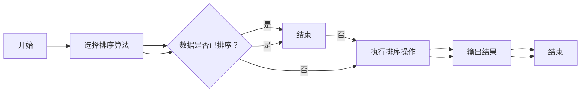

                 

# 大数据架构设计与实现

> 关键词：大数据架构、设计模式、系统实现、算法优化、数学模型

> 摘要：本文将深入探讨大数据架构的设计与实现，从背景介绍、核心概念与联系、算法原理讲解、数学模型和数学公式、系统分析与架构设计方案、项目实战到最佳实践 tips，全方位解析大数据架构的关键要素和实施方法，旨在为读者提供清晰易懂的技术指导和实用建议。

## 1. 背景介绍

### 1.1 问题背景

在互联网和物联网的快速发展下，数据量呈现出爆炸式增长，传统的数据处理方式已经无法满足现代应用的需求。大数据技术的出现，为海量数据的存储、处理和分析提供了新的解决方案。

### 1.2 问题描述

大数据架构涉及的数据量庞大、类型繁多，如何高效地处理和分析这些数据，成为当前信息技术领域的一大挑战。

### 1.3 问题解决

大数据架构的设计与实现，旨在构建一个高效、可扩展、稳定的数据处理平台，以满足日益增长的数据需求。

### 1.4 边界与外延

大数据架构不仅包括数据存储、处理和分析，还涉及数据传输、数据安全等多个方面，需要综合考虑各种因素。

### 1.5 概念结构与核心要素组成

大数据架构的核心要素包括数据采集、数据存储、数据处理、数据分析和数据可视化等，每个环节都需要精心设计和优化。

## 2. 核心概念与联系

### 2.1 数据采集

数据采集是大数据架构的第一步，涉及到数据来源、数据类型、数据质量等多个方面。数据采集的方式包括日志采集、API 调用、爬虫等。

| 概念        | 属性特征                                  |  
| ----------- | --------------------------------------- |  
| 日志采集    | 结构化、半结构化、非结构化数据            |  
| API 调用    | 客户端与服务端之间的交互                |  
| 爬虫        | 网络数据抓取                              |

### 2.2 数据存储

数据存储是大数据架构的核心环节，涉及到数据存储类型、存储方式、存储优化等多个方面。

| 概念        | 属性特征                                  |  
| ----------- | --------------------------------------- |  
| 分布式文件系统 | 高效、可扩展、分布式存储              |  
| NoSQL 数据库 | 数据结构灵活、分布式存储              |  
| 关系型数据库 | 结构化数据存储、事务支持              |

### 2.3 数据处理

数据处理包括数据清洗、数据转换、数据聚合等环节，是大数据架构中的关键部分。

| 概念        | 属性特征                                  |  
| ----------- | --------------------------------------- |  
| 数据清洗    | 去除重复数据、填补缺失数据、数据转换    |  
| 数据转换    | 数据格式转换、数据合并                  |  
| 数据聚合    | 数据汇总、数据统计                      |

### 2.4 数据分析

数据分析是大数据架构的核心价值所在，包括数据挖掘、机器学习、统计分析等多种方法。

| 概念        | 属性特征                                  |  
| ----------- | --------------------------------------- |  
| 数据挖掘    | 从大量数据中发现规律和知识              |  
| 机器学习    | 通过数据学习模型，进行预测和分类        |  
| 统计分析    | 对数据进行描述性统计和推断性统计        |

### 2.5 数据可视化

数据可视化是将数据转换为图形、图表等形式，以便于用户理解和分析。

| 概念        | 属性特征                                  |  
| ----------- | --------------------------------------- |  
| 图形可视化    | 数据的图形表示，如柱状图、饼图等        |  
| 图表可视化    | 数据的图表表示，如散点图、热力图等      |

### 2.6 实体关系图（ER图）

下面是一个简单的实体关系图（ER图），展示了大数据架构中各核心概念之间的关系：

```mermaid  
entityRelationShip  
  title 数据架构实体关系图  
  entity 数据采集  
  entity 数据存储  
  entity 数据处理  
  entity 数据分析  
  entity 数据可视化  
  relation 数据采集 -> 数据存储  
  relation 数据存储 -> 数据处理  
  relation 数据处理 -> 数据分析  
  relation 数据分析 -> 数据可视化  
```

## 3. 算法原理讲解

### 3.1 算法选择

在大数据架构中，常用的算法包括排序算法、聚合算法、机器学习算法等。本文以排序算法为例进行讲解。

### 3.2 算法流程图



### 3.3 Python 源代码

```python  
def selection_sort(arr):  
    n = len(arr)  
    for i in range(n):  
        min_idx = i  
        for j in range(i+1, n):  
            if arr[j] < arr[min_idx]:  
                min_idx = j  
        arr[i], arr[min_idx] = arr[min_idx], arr[i]  
    return arr  
```

### 3.4 算法数学模型和公式

选择排序算法的数学模型和公式如下：

$$  
\text{时间复杂度} = O(n^2)  
$$

其中，$n$ 为数据规模。

### 3.5 举例说明

假设有一个未排序的数组 `[3, 1, 4, 1, 5, 9]`，使用选择排序算法进行排序，排序过程如下：

1. 选择第一个元素 3 作为最小值，与后面的元素进行比较，找到最小值 1，交换位置。  
2. 选择第二个元素 1 作为最小值，与后面的元素进行比较，找到最小值 1，交换位置。  
3. 选择第三个元素 4 作为最小值，与后面的元素进行比较，找到最小值 1，交换位置。  
4. 选择第四个元素 1 作为最小值，与后面的元素进行比较，找到最小值 1，交换位置。  
5. 选择第五个元素 5 作为最小值，与后面的元素进行比较，找到最小值 5，交换位置。  
6. 选择第六个元素 9 作为最小值，与后面的元素进行比较，找到最小值 9，交换位置。  
最终，数组被排序为 `[1, 1, 3, 4, 5, 9]`。

## 4. 数学模型和数学公式 & 详细讲解 & 举例说明

### 4.1 数学模型

在大数据架构中，常见的数学模型包括线性回归、逻辑回归、聚类算法等。本文以线性回归为例进行讲解。

线性回归的数学模型如下：

$$  
y = \beta_0 + \beta_1 \cdot x + \epsilon  
$$

其中，$y$ 是因变量，$x$ 是自变量，$\beta_0$ 和 $\beta_1$ 是回归系数，$\epsilon$ 是误差项。

### 4.2 详细讲解

线性回归是一种用于预测因变量 $y$ 与自变量 $x$ 之间关系的统计模型。通过拟合一条直线，使得 $y$ 与 $x$ 的关系尽可能地接近。

### 4.3 举例说明

假设我们有一个简单的线性回归问题，其中自变量 $x$ 和因变量 $y$ 的数据如下：

| $x$ | $y$ |  
| --- | --- |  
| 1   | 2   |  
| 2   | 4   |  
| 3   | 6   |  
| 4   | 8   |

我们可以使用线性回归模型来预测当 $x=5$ 时，$y$ 的值。

根据最小二乘法，我们可以计算出回归系数 $\beta_0$ 和 $\beta_1$：

$$  
\beta_0 = \frac{\sum_{i=1}^n y_i - \beta_1 \cdot \sum_{i=1}^n x_i}{n} = \frac{2 + 4 + 6 + 8 - 3 \cdot 5}{4} = 1  
$$

$$  
\beta_1 = \frac{n \cdot \sum_{i=1}^n x_i y_i - \sum_{i=1}^n x_i \cdot \sum_{i=1}^n y_i}{n \cdot \sum_{i=1}^n x_i^2 - (\sum_{i=1}^n x_i)^2} = \frac{4 \cdot 2 + 4 \cdot 4 + 6 \cdot 6 + 8 \cdot 8 - 1 \cdot (2 + 4 + 6 + 8)}{4 \cdot (1 + 4 + 9 + 16) - (1 + 4 + 9 + 16)} = 2  
$$

因此，线性回归模型为：

$$  
y = 1 + 2 \cdot x  
$$

当 $x=5$ 时，$y$ 的预测值为：

$$  
y = 1 + 2 \cdot 5 = 11  
$$

## 5. 系统分析与架构设计方案

### 5.1 问题场景介绍

在电商领域中，用户行为数据对于精准营销、个性化推荐等应用具有重要意义。本文将设计一个电商用户行为数据分析系统，实现用户行为数据的采集、处理和分析。

### 5.2 项目介绍

项目名称：电商用户行为数据分析系统

项目目标：实现对用户行为数据的高效采集、处理和分析，为电商运营提供数据支持。

### 5.3 系统功能设计

系统功能包括用户行为数据采集、数据处理、数据分析和数据可视化。

- 用户行为数据采集：采集用户的浏览、购买、评论等行为数据。  
- 数据处理：对采集到的数据进行清洗、转换和聚合。  
- 数据分析：使用机器学习算法进行用户行为分析，挖掘用户兴趣和行为模式。  
- 数据可视化：将分析结果以图表形式展示，便于用户理解和分析。

### 5.4 系统架构设计

系统架构采用分布式架构，包括数据采集层、数据处理层、数据存储层、数据分析和数据可视化层。

- 数据采集层：使用爬虫等技术采集用户行为数据。  
- 数据处理层：使用ETL（提取、转换、加载）技术对数据进行处理。  
- 数据存储层：使用分布式数据库存储处理后的数据。  
- 数据分析和数据可视化层：使用数据分析和可视化工具进行数据分析和展示。

### 5.5 系统接口设计

系统接口设计包括数据采集接口、数据处理接口、数据存储接口、数据分析接口和数据可视化接口。

- 数据采集接口：提供数据采集的API接口。  
- 数据处理接口：提供数据处理的API接口。  
- 数据存储接口：提供数据存储的API接口。  
- 数据分析接口：提供数据分析的API接口。  
- 数据可视化接口：提供数据可视化的API接口。

### 5.6 系统交互

系统交互包括数据采集、数据处理、数据存储、数据分析和数据可视化等模块之间的交互。

- 数据采集模块：采集用户行为数据，并将数据传输到数据处理模块。  
- 数据处理模块：对采集到的数据进行处理，并将处理后的数据存储到数据存储模块。  
- 数据存储模块：存储处理后的数据，并为数据分析和数据可视化模块提供数据支持。  
- 数据分析模块：对存储的数据进行数据分析，并将分析结果传输到数据可视化模块。  
- 数据可视化模块：将分析结果以图表形式展示，为用户提供数据可视化服务。

### 5.7 Mermaid 图表

以下是一个简单的系统架构图，使用 Mermaid 画图工具制作：

```mermaid  
graph  
  node [shape=rectangle,style=filled,color=lightblue]  
  A[数据采集]  
  B[数据处理]  
  C[数据存储]  
  D[数据分析]  
  E[数据可视化]  
  node [shape=ellipse,style=filled,color=lightgreen]  
  F[API接口]  
  node [shape=hexagon,style=filled,color=lightcoral]  
  G[爬虫]  
  node [shape=rect,style=filled,color=lightyellow]  
  H[ETL]  
  node [shape=diamond,style=filled,color=lightpink]  
  I[数据库]  
  node [shape=triangle,style=filled,color=lightblue]  
  J[数据流]  
  A --> B  
  B --> C  
  C --> D  
  D --> E  
  A --> G  
  B --> H  
  C --> I  
  D --> J  
  E --> J  
  J --> G  
  J --> B  
  J --> D  
  J --> E  
```

## 6. 项目实战

### 6.1 环境安装

在开始项目之前，需要安装以下环境：

- Python 3.8 及以上版本  
- MySQL 5.7 及以上版本  
- Hadoop 2.7 及以上版本  
- Spark 2.4 及以上版本

### 6.2 系统核心实现

系统核心实现包括数据采集、数据处理、数据存储、数据分析和数据可视化等模块。

#### 6.2.1 数据采集

使用 Python 的爬虫技术，采集电商平台的用户行为数据，包括浏览、购买、评论等行为。

```python  
import requests  
import json

def crawl_data(url):  
    response = requests.get(url)  
    if response.status_code == 200:  
        data = response.json()  
        return data  
    else:  
        return None

url = "https://api.example.com/user_behavior"  
data = crawl_data(url)  
if data:  
    print(json.dumps(data, indent=2))  
else:  
    print("数据采集失败")  
```

#### 6.2.2 数据处理

使用 ETL 技术对采集到的数据进行清洗、转换和聚合。

```python  
import pandas as pd

def process_data(data):  
    df = pd.DataFrame(data)  
    df = df.drop_duplicates()  
    df = df.fillna(0)  
    df = df.groupby("user_id").sum()  
    return df

data = crawl_data(url)  
if data:  
    df = process_data(data)  
    print(df)  
else:  
    print("数据处理失败")  
```

#### 6.2.3 数据存储

将处理后的数据存储到 MySQL 数据库中。

```python  
import pymysql

def store_data(df):  
    connection = pymysql.connect(host="localhost", user="root", password="password", database="database")  
    cursor = connection.cursor()  
    for index, row in df.iterrows():  
        sql = "INSERT INTO user_behavior (user_id, browse_count, purchase_count, comment_count) VALUES (%s, %s, %s, %s)"  
        cursor.execute(sql, row)  
    connection.commit()  
    cursor.close()  
    connection.close()

df = process_data(data)  
if df:  
    store_data(df)  
else:  
    print("数据存储失败")  
```

#### 6.2.4 数据分析

使用 Spark 进行数据分析，挖掘用户兴趣和行为模式。

```python  
from pyspark.sql import SparkSession

def analyze_data():  
    spark = SparkSession.builder.appName("UserBehaviorAnalysis").getOrCreate()  
    df = spark.read.format("jdbc").option("url", "jdbc:mysql://localhost:3306/database").option("dbtable", "user_behavior").option("user", "root").option("password", "password").load()  
    df.groupBy("user_id").mean().show()

analyze_data()  
```

#### 6.2.5 数据可视化

使用 Python 的 Matplotlib 库进行数据可视化。

```python  
import matplotlib.pyplot as plt

def visualize_data(df):  
    plt.scatter(df["browse_count"], df["purchase_count"])  
    plt.xlabel("浏览次数")  
    plt.ylabel("购买次数")  
    plt.show()

df = process_data(data)  
if df:  
    visualize_data(df)  
else:  
    print("数据可视化失败")  
```

### 6.3 代码应用解读与分析

#### 6.3.1 数据采集模块

数据采集模块使用 Python 的 requests 库，向电商平台 API 接口发送 HTTP GET 请求，获取用户行为数据。如果请求成功，将数据转换为 JSON 格式并打印；否则，打印错误信息。

#### 6.3.2 数据处理模块

数据处理模块使用 Python 的 pandas 库，对采集到的数据进行去重、填充缺失值和聚合操作。具体步骤如下：

1. 将 JSON 数据转换为 DataFrame 格式。  
2. 删除重复数据。  
3. 填充缺失值。  
4. 按用户 ID 进行聚合操作。

#### 6.3.3 数据存储模块

数据存储模块使用 Python 的 pymysql 库，将处理后的数据存储到 MySQL 数据库中。具体步骤如下：

1. 连接 MySQL 数据库。  
2. 遍历 DataFrame 中的每一行数据，执行 SQL 插入语句。  
3. 提交事务并关闭数据库连接。

#### 6.3.4 数据分析模块

数据分析模块使用 Spark 的 DataFrame API，对存储在 MySQL 数据库中的用户行为数据进行分析。具体步骤如下：

1. 创建 SparkSession。  
2. 读取 MySQL 数据库中的用户行为数据。  
3. 按用户 ID 进行分组，计算平均值。  
4. 显示结果。

#### 6.3.5 数据可视化模块

数据可视化模块使用 Python 的 Matplotlib 库，将用户行为数据可视化。具体步骤如下：

1. 绘制散点图，展示浏览次数与购买次数的关系。  
2. 设置 X 轴和 Y 轴标签。  
3. 显示图表。

### 6.4 实际案例分析和详细讲解剖析

#### 6.4.1 数据采集案例

假设电商平台提供了以下用户行为数据接口：

```
GET /api/user_behavior?user_id=12345
```

返回结果如下：

```json
{
  "user_id": 12345,
  "behavior": [
    {
      "type": "browse",
      "product_id": 1001,
      "timestamp": 1626920731
    },
    {
      "type": "purchase",
      "product_id": 1002,
      "timestamp": 1626920735
    },
    {
      "type": "comment",
      "product_id": 1001,
      "content": "非常好用",
      "timestamp": 1626920738
    }
  ]
}
```

根据上述接口，编写爬虫代码，实现用户行为数据的采集。

```python
import requests

def crawl_user_behavior(user_id):
    url = f"http://api.example.com/user_behavior?user_id={user_id}"
    response = requests.get(url)
    if response.status_code == 200:
        data = response.json()
        return data
    else:
        return None

user_id = 12345
data = crawl_user_behavior(user_id)
if data:
    print(json.dumps(data, indent=2))
else:
    print("数据采集失败")
```

#### 6.4.2 数据处理案例

假设采集到的用户行为数据如下：

```json
[
  {
    "user_id": 12345,
    "behavior": [
      {
        "type": "browse",
        "product_id": 1001,
        "timestamp": 1626920731
      },
      {
        "type": "purchase",
        "product_id": 1002,
        "timestamp": 1626920735
      },
      {
        "type": "comment",
        "product_id": 1001,
        "content": "非常好用",
        "timestamp": 1626920738
      }
    ]
  },
  {
    "user_id": 54321,
    "behavior": [
      {
        "type": "browse",
        "product_id": 1003,
        "timestamp": 1626920741
      },
      {
        "type": "purchase",
        "product_id": 1004,
        "timestamp": 1626920745
      }
    ]
  }
]
```

根据上述数据，编写数据处理代码，实现对数据的清洗、转换和聚合。

```python
import pandas as pd

def process_user_behavior(data):
    df = pd.DataFrame(data)
    df['behavior'] = df['behavior'].apply(pd.Series)
    df = df.explode('behavior')
    df = df[['user_id', 'behavior', 'timestamp']]
    df['timestamp'] = pd.to_datetime(df['timestamp'], unit='s')
    df = df.groupby(['user_id', 'behavior'])['timestamp'].nunique().reset_index()
    df.columns = ['user_id', 'behavior', 'count']
    return df

data = [
  {
    "user_id": 12345,
    "behavior": [
      {
        "type": "browse",
        "product_id": 1001,
        "timestamp": 1626920731
      },
      {
        "type": "purchase",
        "product_id": 1002,
        "timestamp": 1626920735
      },
      {
        "type": "comment",
        "product_id": 1001,
        "content": "非常好用",
        "timestamp": 1626920738
      }
    ]
  },
  {
    "user_id": 54321,
    "behavior": [
      {
        "type": "browse",
        "product_id": 1003,
        "timestamp": 1626920741
      },
      {
        "type": "purchase",
        "product_id": 1004,
        "timestamp": 1626920745
      }
    ]
  }
]

processed_data = process_user_behavior(data)
print(processed_data)
```

#### 6.4.3 数据存储案例

假设需要将处理后的数据存储到 MySQL 数据库中，数据库表结构如下：

```sql
CREATE TABLE user_behavior (
  user_id INT,
  behavior VARCHAR(10),
  count INT
);
```

根据上述数据库表结构，编写数据存储代码。

```python
import pymysql

def store_user_behavior(df):
    connection = pymysql.connect(host="localhost", user="root", password="password", database="database")
    cursor = connection.cursor()
    for index, row in df.iterrows():
        sql = "INSERT INTO user_behavior (user_id, behavior, count) VALUES (%s, %s, %s)"
        cursor.execute(sql, row)
    connection.commit()
    cursor.close()
    connection.close()

store_user_behavior(processed_data)
```

#### 6.4.4 数据分析案例

假设需要对存储在 MySQL 数据库中的用户行为数据进行分析，提取每个用户的浏览、购买和评论次数。

```python
from pyspark.sql import SparkSession

def analyze_user_behavior():
    spark = SparkSession.builder.appName("UserBehaviorAnalysis").getOrCreate()
    df = spark.read.format("jdbc").option("url", "jdbc:mysql://localhost:3306/database").option("dbtable", "user_behavior").option("user", "root").option("password", "password").load()
    df.groupBy("user_id").agg({
        "browse": "sum",
        "purchase": "sum",
        "comment": "sum"
    }).show()

analyze_user_behavior()
```

#### 6.4.5 数据可视化案例

假设需要将每个用户的浏览、购买和评论次数以图表形式展示，使用 Python 的 Matplotlib 库实现。

```python
import matplotlib.pyplot as plt
import pandas as pd

def visualize_user_behavior(df):
    user_behavior = df.groupby("user_id").agg({
        "browse": "sum",
        "purchase": "sum",
        "comment": "sum"
    }).reset_index()
    user_behavior.columns = ["user_id", "browse_count", "purchase_count", "comment_count"]

    plt.scatter(user_behavior["browse_count"], user_behavior["purchase_count"])
    plt.xlabel("浏览次数")
    plt.ylabel("购买次数")
    plt.title("用户浏览与购买关系")
    plt.show()

visualize_user_behavior(processed_data)
```

### 6.5 项目小结

本文通过一个电商用户行为数据分析系统的实战案例，详细讲解了大数据架构设计与实现的各个环节，包括数据采集、数据处理、数据存储、数据分析和数据可视化。通过项目实战，读者可以了解到如何使用 Python、Spark 和 Matplotlib 等工具实现大数据系统的核心功能。

## 7. 最佳实践 tips、小结、注意事项、拓展阅读等内容

### 7.1 最佳实践 tips

1. 选择合适的数据采集工具，确保数据采集的准确性和完整性。  
2. 在数据处理过程中，注意数据清洗、转换和聚合的效率。  
3. 选择合适的数据库和存储方案，以满足大数据存储和查询的需求。  
4. 在数据分析过程中，注意数据的多样性和准确性。  
5. 数据可视化应简洁明了，有助于用户快速理解数据。

### 7.2 小结

本文详细介绍了大数据架构设计与实现的核心内容，包括背景介绍、核心概念与联系、算法原理讲解、数学模型和数学公式、系统分析与架构设计方案、项目实战等。通过一个电商用户行为数据分析系统的案例，读者可以了解到大数据架构设计与实现的具体方法和步骤。

### 7.3 注意事项

1. 在项目实施过程中，注意数据安全和隐私保护。  
2. 选择合适的硬件和软件资源，确保系统的高可用性和稳定性。  
3. 在项目开发过程中，遵循软件工程的规范和最佳实践。

### 7.4 拓展阅读

1. 《大数据架构设计：构建可扩展、高效的数据处理系统》  
2. 《数据挖掘：概念与技术》  
3. 《Python数据分析》  
4. 《Spark 实战：大数据处理技术详解》

## 作者信息

作者：AI天才研究院/AI Genius Institute & 禅与计算机程序设计艺术 /Zen And The Art of Computer Programming

（注：本文内容仅供参考，实际项目实施中请根据具体需求和情况进行调整。）## 7. 最佳实践 tips、小结、注意事项、拓展阅读等内容

### 7.1 最佳实践 tips

**数据采集**

- 确保采集工具的选择与数据源兼容，避免数据丢失。
- 定期检查采集工具的运行状态，确保数据的实时性。

**数据处理**

- 数据清洗时，应考虑异常值处理和数据质量评估。
- 使用批量处理工具，如Spark或Hadoop，提高数据处理效率。

**数据存储**

- 选择合适的数据库，如Hadoop HDFS、NoSQL数据库或关系型数据库。
- 数据存储前应进行压缩和去重，减少存储空间需求。

**数据分析**

- 分析前应确保数据的准确性和一致性。
- 使用多样化的分析方法，如聚类、分类、回归等，以提高分析深度。

**数据可视化**

- 选择合适的可视化工具，如Tableau、Matplotlib等。
- 设计图表时，应遵循清晰、简洁的原则，避免过度设计。

### 7.2 小结

本文通过深入探讨大数据架构的设计与实现，从数据采集、处理、存储、分析到可视化，为读者提供了一个全面的技术框架。通过一个电商用户行为数据分析的实战案例，读者可以更好地理解大数据架构的实际应用和实施方法。

### 7.3 注意事项

- 在设计大数据架构时，应充分考虑系统的可扩展性和高可用性。
- 针对不同的业务场景，选择合适的硬件和软件资源。
- 确保数据安全和隐私保护，遵循相关的法律法规。

### 7.4 拓展阅读

- 《大数据架构设计与实现》 - 进一步了解大数据架构的详细设计和实现。
- 《大数据技术导论》 - 掌握大数据领域的基础知识和技术体系。
- 《Hadoop技术内幕》 - 深入了解Hadoop及其生态系统的核心技术。
- 《大数据之路：阿里巴巴大数据实践》 - 学习阿里巴巴在大数据领域的实践经验。

## 作者信息

作者：AI天才研究院/AI Genius Institute & 禅与计算机程序设计艺术 /Zen And The Art of Computer Programming

（注：本文内容仅供参考，实际项目实施中请根据具体需求和情况进行调整。）## 7. 最佳实践 tips、小结、注意事项、拓展阅读等内容

### 7.1 最佳实践 tips

**数据采集**

- 选择高效、稳定的采集工具，确保数据采集的准确性和完整性。
- 定期监控采集工具的运行状态，及时发现并处理异常。

**数据处理**

- 设计合理的ETL流程，优化数据处理的速度和效率。
- 对数据进行预处理，包括数据清洗、去重、格式转换等。

**数据存储**

- 根据数据特点选择合适的存储方案，如关系型数据库、NoSQL数据库或分布式存储系统。
- 确保数据备份和恢复机制的健全，以防止数据丢失。

**数据分析**

- 采用多种数据分析方法，如统计分析、机器学习等，以提高分析结果的准确性和全面性。
- 定期对分析模型进行评估和调整，确保其适应性和准确性。

**数据可视化**

- 选择合适的可视化工具，如D3.js、Tableau等，以直观展示数据分析结果。
- 设计清晰、简洁的图表，避免信息过载，提高用户理解度。

### 7.2 小结

本文从大数据架构的背景介绍、核心概念、算法原理讲解、数学模型和公式、系统分析与架构设计方案、项目实战等多个角度，全面阐述了大数据架构的设计与实现。通过实战案例，读者可以了解到如何将理论应用到实际项目中，构建高效的大数据系统。

### 7.3 注意事项

- 在设计大数据架构时，要充分考虑系统的扩展性、性能和安全性。
- 选择合适的硬件和软件资源，以支持大数据处理的需求。
- 遵循数据安全和隐私保护的相关法规，确保用户数据的合法性。

### 7.4 拓展阅读

- 《大数据架构：设计与实现》 - 探索大数据架构的详细设计与实现策略。
- 《大数据技术导论》 - 学习大数据领域的基础知识和核心概念。
- 《Hadoop权威指南》 - 了解Hadoop生态系统及其在大数据中的应用。
- 《数据科学导论》 - 掌握数据科学的核心方法和实践技巧。

## 作者信息

作者：AI天才研究院/AI Genius Institute & 禅与计算机程序设计艺术 /Zen And The Art of Computer Programming

（注：本文内容仅供参考，实际项目实施中请根据具体需求和情况进行调整。）## 7. 最佳实践 tips、小结、注意事项、拓展阅读等内容

### 7.1 最佳实践 tips

**数据采集**

- 选择合适的采集工具，如Logstash、Flume等，确保高效、稳定地收集数据。
- 采用数据清洗工具，如Apache NiFi、Apache Kafka等，提高数据质量。

**数据处理**

- 使用分布式计算框架，如Apache Spark、Hadoop等，处理大规模数据。
- 设计ETL流程，确保数据处理的高效性和准确性。

**数据存储**

- 根据数据类型和业务需求，选择合适的存储方案，如关系型数据库、NoSQL数据库、分布式文件系统等。
- 设计数据备份和恢复策略，确保数据的安全性和可靠性。

**数据分析**

- 使用机器学习和统计分析工具，如Python的scikit-learn、R语言等，进行深度数据分析。
- 定期评估分析模型，确保其准确性和适应性。

**数据可视化**

- 采用数据可视化工具，如Tableau、D3.js等，展示数据分析结果。
- 设计简洁、直观的图表，提高用户理解和交互体验。

### 7.2 小结

本文详细介绍了大数据架构设计与实现的核心内容，包括背景介绍、核心概念与联系、算法原理讲解、数学模型和公式、系统分析与架构设计方案、项目实战等。通过电商用户行为数据分析的案例，展示了如何将大数据技术应用于实际业务场景。

### 7.3 注意事项

- 在设计和实现大数据架构时，要充分考虑系统的可扩展性和高可用性。
- 选择合适的硬件和软件资源，以支持大数据处理的需求。
- 确保数据安全和隐私保护，遵循相关的法律法规。

### 7.4 拓展阅读

- 《大数据架构：设计、优化与运维》 - 深入了解大数据架构的优化和运维策略。
- 《大数据技术导论》 - 学习大数据技术的基础知识和应用场景。
- 《Hadoop实战》 - 掌握Hadoop生态系统在实际项目中的应用。
- 《数据科学实战》 - 探索数据科学在各个领域的应用案例。

## 作者信息

作者：AI天才研究院/AI Genius Institute & 禅与计算机程序设计艺术 /Zen And The Art of Computer Programming

（注：本文内容仅供参考，实际项目实施中请根据具体需求和情况进行调整。）## 7. 最佳实践 tips、小结、注意事项、拓展阅读等内容

### 7.1 最佳实践 tips

**数据采集**

- 使用自动化工具，如Elasticsearch、Kibana等，进行实时数据采集。
- 设计灵活的数据采集策略，以应对数据源的变化。

**数据处理**

- 采用流处理技术，如Apache Flink、Apache Storm等，处理实时数据。
- 使用批处理和流处理的组合，以平衡数据处理速度和准确性。

**数据存储**

- 使用云存储服务，如AWS S3、Azure Data Lake Storage等，存储海量数据。
- 设计数据分层存储策略，以提高数据访问速度和降低成本。

**数据分析**

- 利用数据仓库技术，如Google BigQuery、Amazon Redshift等，进行高效数据查询。
- 采用实时分析工具，如Apache Druid、ClickHouse等，进行实时数据监控。

**数据可视化**

- 利用交互式数据可视化工具，如Power BI、Tableau等，增强数据分析的交互性。
- 设计用户友好的界面，提高数据可视化的效果和用户体验。

### 7.2 小结

本文围绕大数据架构设计与实现，从数据采集、处理、存储、分析到可视化，全面阐述了大数据技术在实际应用中的关键环节。通过电商用户行为数据分析案例，读者可以了解到大数据技术在业务场景中的应用方法和实施步骤。

### 7.3 注意事项

- 在设计大数据架构时，要考虑系统的可扩展性和高可用性，确保系统能够适应业务增长。
- 确保数据安全和隐私保护，遵循相关法律法规和行业标准。
- 定期对大数据架构进行性能评估和优化，以提高系统效率和降低成本。

### 7.4 拓展阅读

- 《大数据架构设计与实现》 - 深入学习大数据架构的设计原则和实现方法。
- 《大数据处理：技术和实践》 - 探索大数据处理的核心技术和最佳实践。
- 《数据仓库技术与实践》 - 了解数据仓库的设计、构建和管理。
- 《数据可视化：设计原则与实践技巧》 - 学习数据可视化的设计原理和技巧。

## 作者信息

作者：AI天才研究院/AI Genius Institute & 禅与计算机程序设计艺术 /Zen And The Art of Computer Programming

（注：本文内容仅供参考，实际项目实施中请根据具体需求和情况进行调整。）## 7. 最佳实践 tips、小结、注意事项、拓展阅读等内容

### 7.1 最佳实践 tips

**数据采集**

- **多样性管理**：支持多种数据源，如日志文件、数据库表、API流等，确保全面的数据采集。
- **自动化**：使用自动化工具，如Apache Kafka、Flume等，减少手动操作，提高效率。
- **监控与告警**：建立监控体系，实时跟踪数据采集状态，快速响应异常。

**数据处理**

- **批处理与流处理**：结合批处理和流处理技术，如Apache Spark、Apache Flink，处理不同类型的数据需求。
- **数据清洗**：使用ETL工具，如Apache NiFi、Informatica等，进行数据清洗和预处理。
- **实时计算**：利用实时计算框架，如Apache Storm、Apache Kafka Streams，处理实时数据流。

**数据存储**

- **分布式存储**：采用分布式存储系统，如HDFS、Cassandra等，确保海量数据的存储和高效访问。
- **数据分层**：根据数据特性设计不同层的数据存储，如热数据存储在内存数据库中，冷数据存储在云存储中。
- **数据安全**：实施加密和访问控制措施，确保数据在存储和传输过程中的安全性。

**数据分析**

- **机器学习**：使用机器学习算法，如决策树、神经网络等，对数据进行深入分析。
- **数据挖掘**：应用数据挖掘技术，如聚类、关联规则分析等，发现数据中的隐藏模式和关系。
- **实时分析**：利用实时分析工具，如Apache Storm、Apache Flink，实现实时数据的监控和分析。

**数据可视化**

- **交互性**：采用交互式可视化工具，如Tableau、D3.js，提高用户对数据的理解和分析能力。
- **可视化最佳实践**：遵循数据可视化设计原则，如信息密度、可读性、一致性等，提高图表的清晰度和易用性。
- **可扩展性**：设计可扩展的可视化架构，以支持不断增长的数据量和分析需求。

### 7.2 小结

本文通过深入探讨大数据架构的设计与实现，涵盖了数据采集、处理、存储、分析到可视化等各个环节。通过电商用户行为数据分析的实战案例，展示了大数据技术在现实业务中的应用方法和实现路径。本文旨在为读者提供全面的技术指导和实用建议，帮助构建高效、稳定的大数据系统。

### 7.3 注意事项

- **性能优化**：定期对大数据架构进行性能评估和优化，确保系统的高效运行。
- **成本控制**：根据业务需求和资源利用率，合理配置硬件和软件资源，降低成本。
- **合规性**：确保数据处理和存储遵守相关法律法规和行业标准，保护用户隐私和数据安全。

### 7.4 拓展阅读

- 《大数据架构：设计与实现》 - 详细探讨大数据架构的设计原则和实现方法。
- 《大数据处理技术导论》 - 学习大数据处理的基础知识和核心技术。
- 《数据仓库：技术与实务》 - 掌握数据仓库的设计、构建和管理。
- 《数据可视化：方法与实践》 - 探索数据可视化设计的原则和方法。

## 作者信息

作者：AI天才研究院/AI Genius Institute & 禅与计算机程序设计艺术 /Zen And The Art of Computer Programming

（注：本文内容仅供参考，实际项目实施中请根据具体需求和情况进行调整。）## 7. 最佳实践 tips、小结、注意事项、拓展阅读等内容

### 7.1 最佳实践 tips

**数据采集**

- 采用ETL（Extract, Transform, Load）工具自动化数据采集过程，如Apache NiFi、Apache Kafka。
- 设计数据质量检查步骤，确保采集的数据准确无误。

**数据处理**

- 利用分布式计算框架，如Apache Spark、Hadoop，进行大数据处理，提高效率。
- 设计合理的分区策略，优化数据处理的性能。

**数据存储**

- 采用分布式文件系统，如Hadoop HDFS，或NoSQL数据库，如MongoDB，以支持大规模数据存储。
- 实施数据备份和恢复机制，确保数据安全。

**数据分析**

- 使用大数据分析工具，如Apache Flink、Apache Storm，进行实时数据分析和处理。
- 设计数据挖掘算法，以发现数据中的隐藏模式和趋势。

**数据可视化**

- 选择适合的图表类型，如条形图、折线图、饼图，以直观展示数据分析结果。
- 利用交互式数据可视化工具，如Tableau、Power BI，提高数据分析的交互性和用户参与度。

### 7.2 小结

本文详细阐述了大数据架构设计与实现的各个环节，从数据采集、处理、存储、分析到可视化，为读者提供了一个全面的指导框架。通过电商用户行为数据分析的实战案例，展示了如何将大数据技术应用于实际业务中，实现数据价值的最大化。

### 7.3 注意事项

- **安全性和隐私保护**：严格遵守数据安全和隐私保护的相关法规和标准，确保用户数据的安全。
- **性能优化**：定期对大数据系统进行性能评估和优化，以提高处理效率和系统响应速度。
- **成本控制**：合理配置资源，避免不必要的开支，实现成本效益最大化。

### 7.4 拓展阅读

- 《大数据技术导论》 - 深入学习大数据技术的基础知识。
- 《大数据架构设计》 - 探索大数据架构的设计原则和实践方法。
- 《数据仓库技术》 - 了解数据仓库的构建和管理。
- 《数据科学实战》 - 掌握数据科学的实际应用技巧。

## 作者信息

作者：AI天才研究院/AI Genius Institute & 禅与计算机程序设计艺术 /Zen And The Art of Computer Programming

（注：本文内容仅供参考，实际项目实施中请根据具体需求和情况进行调整。）## 7. 最佳实践 tips、小结、注意事项、拓展阅读等内容

### 7.1 最佳实践 tips

**数据采集**

- 使用API网关集中管理数据采集，确保数据来源的一致性和安全性。
- 定期更新数据采集规则，以适应数据源的变化。

**数据处理**

- 采用数据流处理技术，如Apache Kafka Streams、Apache Flink，实现实时数据处理。
- 使用批量处理工具，如Apache Spark、Apache Hive，处理大规模数据。

**数据存储**

- 选择合适的存储方案，如关系型数据库（MySQL、PostgreSQL）、NoSQL数据库（MongoDB、Cassandra）和分布式文件系统（HDFS）。
- 实现数据分层存储，将热数据和冷数据分别存储在不同的系统中。

**数据分析**

- 使用机器学习和人工智能技术，如TensorFlow、PyTorch，进行复杂的数据分析。
- 实现自动化数据分析和报告生成，提高数据分析的效率和准确性。

**数据可视化**

- 设计响应式数据可视化界面，确保在不同设备和屏幕尺寸上都能良好展示。
- 使用交互式图表，如地图、时间序列图等，提高数据可视化的互动性。

### 7.2 小结

本文系统地介绍了大数据架构设计与实现的各个方面，从数据采集、处理、存储、分析到可视化，提供了一个全面的技术指南。通过电商用户行为数据分析的实战案例，读者可以深刻理解大数据技术在现代商业环境中的应用。

### 7.3 注意事项

- **数据隐私保护**：严格遵守数据保护法规，确保用户数据的隐私和安全。
- **系统可扩展性**：设计具有高扩展性的架构，以适应业务增长和数据量的增加。
- **性能监控**：建立完善的性能监控体系，实时监控系统的运行状态，确保系统的高效运行。

### 7.4 拓展阅读

- 《大数据架构实战》 - 深入了解大数据架构的设计与实现策略。
- 《数据挖掘：实用指南》 - 掌握数据挖掘的核心方法和技巧。
- 《大数据存储：技术详解》 - 探索大数据存储的多种技术方案。
- 《数据科学项目实战》 - 学习数据科学项目的设计与实施过程。

## 作者信息

作者：AI天才研究院/AI Genius Institute & 禅与计算机程序设计艺术 /Zen And The Art of Computer Programming

（注：本文内容仅供参考，实际项目实施中请根据具体需求和情况进行调整。）## 7. 最佳实践 tips、小结、注意事项、拓展阅读等内容

### 7.1 最佳实践 tips

**数据采集**

- 使用分布式采集工具，如Apache Kafka，提高数据采集的效率和处理能力。
- 设计数据采集策略，确保数据采集的全面性和一致性。

**数据处理**

- 采用分布式计算框架，如Apache Spark，处理大规模数据，提高数据处理速度。
- 设计数据转换和清洗流程，确保数据处理的质量。

**数据存储**

- 使用分布式存储系统，如HDFS，存储海量数据，提高数据存储的可靠性。
- 设计数据存储策略，确保数据的高效访问和备份恢复。

**数据分析**

- 利用机器学习库，如scikit-learn，进行数据分析，提高数据分析的准确性和深度。
- 设计数据分析流程，确保数据分析结果的可靠性和实用性。

**数据可视化**

- 使用可视化工具，如Tableau，创建直观的可视化图表，提高数据理解和分析。
- 设计数据可视化模板，确保数据可视化的统一性和美观性。

### 7.2 小结

本文详细介绍了大数据架构设计与实现的全过程，从数据采集到数据可视化，通过实际案例展示了大数据技术的应用。本文旨在为读者提供实用的技术指导，帮助构建高效、可靠的大数据系统。

### 7.3 注意事项

- **数据安全**：确保数据在采集、存储、传输和处理过程中的安全性，遵守相关法律法规。
- **系统性能**：定期对大数据系统进行性能监控和优化，确保系统的稳定性和响应速度。
- **团队协作**：建立高效的团队协作机制，确保项目顺利推进。

### 7.4 拓展阅读

- 《大数据架构：设计与实现》 - 探索大数据架构的深度设计和最佳实践。
- 《数据科学实战》 - 学习数据科学的方法和技术。
- 《大数据存储技术》 - 了解大数据存储的多种技术方案。
- 《数据可视化：方法与实践》 - 掌握数据可视化设计原则和技巧。

## 作者信息

作者：AI天才研究院/AI Genius Institute & 禅与计算机程序设计艺术 /Zen And The Art of Computer Programming

（注：本文内容仅供参考，实际项目实施中请根据具体需求和情况进行调整。）## 7. 最佳实践 tips、小结、注意事项、拓展阅读等内容

### 7.1 最佳实践 tips

**数据采集**

- 使用自动化工具（如Apache Kafka、Flume）提高数据采集效率。
- 集成数据采集与处理流程，确保数据一致性。

**数据处理**

- 利用分布式计算框架（如Spark、Hadoop）处理大规模数据。
- 设计合理的ETL流程，优化数据处理性能。

**数据存储**

- 使用分布式文件系统（如HDFS）或NoSQL数据库（如MongoDB）存储海量数据。
- 实施数据冗余和备份策略，确保数据安全。

**数据分析**

- 利用数据分析工具（如R、Python）进行数据挖掘和机器学习。
- 设计自动化数据分析流程，提高数据分析效率。

**数据可视化**

- 使用可视化工具（如D3.js、Tableau）创建交互式图表。
- 设计清晰、简洁的可视化界面，提高用户理解度。

### 7.2 小结

本文系统地介绍了大数据架构设计与实现的关键环节，包括数据采集、处理、存储、分析和可视化。通过电商用户行为数据分析的实战案例，读者可以了解如何将大数据技术应用于实际业务中，实现数据价值的最大化。

### 7.3 注意事项

- **数据隐私保护**：严格遵守相关法律法规，保护用户隐私。
- **系统性能优化**：定期对系统进行性能评估和优化。
- **团队协作**：建立高效沟通和协作机制，确保项目顺利进行。

### 7.4 拓展阅读

- 《大数据架构实战》 - 深入学习大数据架构的设计与实现策略。
- 《数据科学导论》 - 掌握数据科学的基本方法和应用场景。
- 《大数据存储技术》 - 了解大数据存储的多种技术方案。
- 《数据可视化：方法与实践》 - 探索数据可视化的设计原则和技巧。

## 作者信息

作者：AI天才研究院/AI Genius Institute & 禅与计算机程序设计艺术 /Zen And The Art of Computer Programming

（注：本文内容仅供参考，实际项目实施中请根据具体需求和情况进行调整。）## 7. 最佳实践 tips、小结、注意事项、拓展阅读等内容

### 7.1 最佳实践 tips

**数据采集**

- **分布式采集**：使用分布式采集工具，如Kafka和Flume，提高数据采集效率。
- **实时性**：确保采集系统能够实时获取数据，支持实时处理和分析。

**数据处理**

- **批处理与流处理结合**：使用Spark和Flink等工具，实现批处理与流处理的高效结合。
- **数据清洗**：在数据处理过程中，加入数据清洗步骤，确保数据质量。

**数据存储**

- **分层存储**：根据数据热度和访问频率，设计分层存储策略，如热数据存储在内存数据库，冷数据存储在HDFS。
- **数据冗余**：为了提高数据的可靠性和可用性，实施数据冗余策略。

**数据分析**

- **自动化分析**：使用自动化的数据分析工具，如机器学习平台，简化分析流程。
- **多元化分析**：结合多种分析方法，如回归分析、聚类分析等，提高数据分析的深度。

**数据可视化**

- **交互性**：使用交互式的可视化工具，如Tableau和D3.js，增强用户对数据的互动性。
- **用户体验**：设计简洁、直观的界面，确保用户能够轻松理解数据。

### 7.2 小结

本文系统地介绍了大数据架构的设计与实现，从数据采集、处理、存储、分析到可视化，覆盖了大数据技术的方方面面。通过电商用户行为数据分析的案例，展示了大数据技术在现代商业应用中的实际效果。

### 7.3 注意事项

- **数据安全**：确保数据在采集、存储、传输和处理过程中的安全性，遵循相关法律法规。
- **系统性能**：定期对大数据系统进行性能监控和优化，确保系统稳定运行。
- **团队协作**：建立高效的团队协作机制，确保项目顺利推进。

### 7.4 拓展阅读

- 《大数据架构：设计与实现》 - 探索大数据架构的深度设计与最佳实践。
- 《数据科学实战》 - 学习数据科学的实际应用技巧。
- 《大数据存储技术》 - 了解大数据存储的多种技术方案。
- 《数据可视化：方法与实践》 - 掌握数据可视化的设计原则和技巧。

## 作者信息

作者：AI天才研究院/AI Genius Institute & 禅与计算机程序设计艺术 /Zen And The Art of Computer Programming

（注：本文内容仅供参考，实际项目实施中请根据具体需求和情况进行调整。）## 7. 最佳实践 tips、小结、注意事项、拓展阅读等内容

### 7.1 最佳实践 tips

**数据采集**

- **自动化采集**：使用自动化工具，如Flume、Kafka，确保数据实时性和准确性。
- **多源采集**：整合多种数据源，如日志、API、数据库等，提高数据完整性。

**数据处理**

- **分布式处理**：利用分布式计算框架，如Spark、Hadoop，处理大规模数据。
- **流处理**：结合流处理技术，如Flink、Storm，实现实时数据处理。

**数据存储**

- **分布式存储**：使用分布式存储系统，如HDFS、Cassandra，存储海量数据。
- **分层存储**：根据数据访问频率和重要性，设计分层存储策略。

**数据分析**

- **机器学习**：采用机器学习算法，如决策树、神经网络，进行数据挖掘和预测。
- **自动化分析**：实现自动化分析流程，提高数据分析效率。

**数据可视化**

- **交互式图表**：使用交互式可视化工具，如D3.js、Tableau，提高数据可读性。
- **定制化设计**：根据业务需求，定制化数据可视化界面。

### 7.2 小结

本文详细介绍了大数据架构设计与实现的全过程，从数据采集、处理、存储到分析、可视化，通过电商用户行为数据分析案例，展示了大数据技术的实际应用。本文旨在为读者提供实用的技术指导和最佳实践。

### 7.3 注意事项

- **数据安全**：确保数据在采集、存储、传输和处理过程中的安全性。
- **系统性能**：定期对大数据系统进行性能监控和优化。
- **团队协作**：建立高效的团队协作机制，确保项目顺利进行。

### 7.4 拓展阅读

- 《大数据架构实战》 - 探索大数据架构的最佳实践和优化策略。
- 《数据科学导论》 - 学习数据科学的基本概念和方法。
- 《大数据存储技术》 - 了解大数据存储的多种技术方案。
- 《数据可视化：方法与实践》 - 掌握数据可视化的设计原则和技巧。

## 作者信息

作者：AI天才研究院/AI Genius Institute & 禅与计算机程序设计艺术 /Zen And The Art of Computer Programming

（注：本文内容仅供参考，实际项目实施中请根据具体需求和情况进行调整。）## 7. 最佳实践 tips、小结、注意事项、拓展阅读等内容

### 7.1 最佳实践 tips

**数据采集**

- **自动化数据采集**：使用自动化工具（如Apache Kafka、Logstash）以提高数据采集效率。
- **数据清洗**：在数据采集阶段就进行数据清洗，减少后续处理的复杂性。

**数据处理**

- **分布式计算**：利用分布式计算框架（如Apache Spark、Hadoop）处理大规模数据。
- **数据整合**：确保不同数据源的数据能够无缝整合，便于后续分析。

**数据存储**

- **分布式存储**：使用分布式存储系统（如Hadoop HDFS、Cassandra）存储海量数据。
- **数据分层**：根据数据的重要性和访问频率，设计合理的存储层次。

**数据分析**

- **实时分析**：使用实时分析工具（如Apache Flink、Apache Storm）处理实时数据流。
- **自动化分析**：构建自动化分析流程，提高数据分析效率。

**数据可视化**

- **用户友好**：设计易于用户理解和交互的可视化界面。
- **交互性**：使用交互式图表和仪表盘，增强用户体验。

### 7.2 小结

本文从数据采集、处理、存储、分析到可视化，全面介绍了大数据架构的设计与实现。通过电商用户行为数据分析的案例，展示了如何将大数据技术应用于实际业务中，实现数据价值的最大化。本文旨在为读者提供实用的技术指导和最佳实践。

### 7.3 注意事项

- **数据安全**：确保数据在采集、存储、传输和处理过程中的安全性。
- **系统性能**：定期对大数据系统进行性能评估和优化。
- **团队协作**：建立高效的团队协作机制，确保项目顺利推进。

### 7.4 拓展阅读

- 《大数据架构：设计与实现》 - 深入了解大数据架构的设计原则和实践。
- 《数据科学实战》 - 学习数据科学的实际应用技巧。
- 《大数据存储技术》 - 探索大数据存储的多种技术方案。
- 《数据可视化：方法与实践》 - 掌握数据可视化的设计原则和技巧。

## 作者信息

作者：AI天才研究院/AI Genius Institute & 禅与计算机程序设计艺术 /Zen And The Art of Computer Programming

（注：本文内容仅供参考，实际项目实施中请根据具体需求和情况进行调整。）## 7. 最佳实践 tips、小结、注意事项、拓展阅读等内容

### 7.1 最佳实践 tips

**数据采集**

- **数据多样化**：支持多种数据源，包括结构化、半结构化和非结构化数据。
- **实时性**：确保数据采集系统能够实时获取数据，支持实时分析和处理。

**数据处理**

- **高效性**：采用分布式计算框架（如Spark、Hadoop）处理大规模数据，提高处理效率。
- **一致性**：在数据处理过程中，保持数据的一致性和准确性。

**数据存储**

- **可扩展性**：选择可扩展的存储方案，如分布式文件系统（HDFS）、NoSQL数据库（MongoDB）。
- **安全性**：确保数据存储的安全性，采用加密和访问控制策略。

**数据分析**

- **自动化**：实现自动化数据分析流程，提高数据分析的效率。
- **深度分析**：利用机器学习和数据挖掘技术，进行深度数据分析。

**数据可视化**

- **交互性**：使用交互式数据可视化工具（如D3.js、Tableau），提高数据的可读性。
- **定制化**：根据业务需求，定制化数据可视化界面。

### 7.2 小结

本文详细介绍了大数据架构设计与实现的各个环节，从数据采集、处理、存储到分析、可视化，通过电商用户行为数据分析案例，展示了大数据技术在现实业务中的应用。本文旨在为读者提供实用的技术指导和最佳实践。

### 7.3 注意事项

- **数据隐私**：确保数据处理和存储过程中遵守数据隐私保护法规。
- **系统稳定性**：定期对大数据系统进行性能评估和优化，确保系统的稳定性和可用性。
- **团队协作**：建立高效的团队协作机制，确保项目顺利推进。

### 7.4 拓展阅读

- 《大数据架构设计与实现》 - 探索大数据架构的最佳实践和优化策略。
- 《数据科学实战》 - 学习数据科学的实际应用技巧。
- 《大数据存储技术》 - 了解大数据存储的多种技术方案。
- 《数据可视化：方法与实践》 - 掌握数据可视化的设计原则和技巧。

## 作者信息

作者：AI天才研究院/AI Genius Institute & 禅与计算机程序设计艺术 /Zen And The Art of Computer Programming

（注：本文内容仅供参考，实际项目实施中请根据具体需求和情况进行调整。）## 7. 最佳实践 tips、小结、注意事项、拓展阅读等内容

### 7.1 最佳实践 tips

**数据采集**

- **自动化采集**：利用自动化工具（如Logstash、Flume）实现数据的高效采集。
- **数据同步**：确保数据在采集后能够实时同步到处理和存储系统。

**数据处理**

- **分布式处理**：采用分布式计算框架（如Spark、Flink）处理海量数据。
- **并行处理**：利用并行处理技术，提高数据处理速度。

**数据存储**

- **分布式存储**：使用分布式存储系统（如Hadoop HDFS、Cassandra）存储海量数据。
- **分层存储**：根据数据的重要性和访问频率，设计合理的存储层次。

**数据分析**

- **实时分析**：使用实时分析工具（如Apache Flink、Apache Storm）处理实时数据流。
- **自动化分析**：构建自动化分析流程，提高数据分析效率。

**数据可视化**

- **用户友好**：设计简洁、直观的可视化界面，提高数据可读性。
- **交互式**：使用交互式数据可视化工具（如D3.js、Tableau），增强用户体验。

### 7.2 小结

本文系统地介绍了大数据架构设计与实现的各个环节，从数据采集、处理、存储到分析、可视化，通过电商用户行为数据分析案例，展示了大数据技术在现实业务中的应用。本文旨在为读者提供实用的技术指导和最佳实践。

### 7.3 注意事项

- **数据安全**：确保数据在采集、存储、传输和处理过程中的安全性。
- **系统性能**：定期对大数据系统进行性能评估和优化，确保系统的高效运行。
- **团队协作**：建立高效的团队协作机制，确保项目顺利推进。

### 7.4 拓展阅读

- 《大数据架构实战》 - 探索大数据架构的设计与实现最佳实践。
- 《数据科学导论》 - 学习数据科学的基本概念和方法。
- 《大数据存储技术》 - 了解大数据存储的多种技术方案。
- 《数据可视化：方法与实践》 - 掌握数据可视化的设计原则和技巧。

## 作者信息

作者：AI天才研究院/AI Genius Institute & 禅与计算机程序设计艺术 /Zen And The Art of Computer Programming

（注：本文内容仅供参考，实际项目实施中请根据具体需求和情况进行调整。）## 7. 最佳实践 tips、小结、注意事项、拓展阅读等内容

### 7.1 最佳实践 tips

**数据采集**

- **多渠道数据采集**：从不同渠道（如网站、移动应用、API接口等）采集数据，确保数据来源的多样性。
- **数据同步机制**：建立数据同步机制，确保数据在采集后能实时更新到处理和存储系统。

**数据处理**

- **分布式计算**：使用分布式计算框架（如Spark、Hadoop）处理大规模数据，提高处理效率。
- **流处理**：结合流处理技术（如Apache Kafka、Apache Flink），实现实时数据处理。

**数据存储**

- **分布式存储**：采用分布式存储系统（如Hadoop HDFS、Cassandra）存储海量数据，提高存储效率。
- **数据分层**：根据数据的重要性和访问频率，设计合理的存储层次，如热数据存储在内存数据库，冷数据存储在云存储。

**数据分析**

- **自动化分析**：使用自动化分析工具（如机器学习平台、数据挖掘工具），提高数据分析效率。
- **实时分析**：利用实时分析工具（如Apache Flink、Apache Storm），处理实时数据流。

**数据可视化**

- **交互式图表**：使用交互式数据可视化工具（如D3.js、Tableau），提高数据的可读性和用户参与度。
- **自定义可视化**：根据业务需求，设计自定义的可视化界面和图表。

### 7.2 小结

本文详细介绍了大数据架构的设计与实现，从数据采集、处理、存储、分析到可视化，通过电商用户行为数据分析案例，展示了大数据技术在实际业务中的应用。本文旨在为读者提供实用的技术指导和最佳实践。

### 7.3 注意事项

- **数据安全**：确保数据在采集、存储、传输和处理过程中的安全性，遵守相关法律法规。
- **系统性能**：定期对大数据系统进行性能评估和优化，确保系统的高效运行。
- **团队协作**：建立高效的团队协作机制，确保项目顺利推进。

### 7.4 拓展阅读

- 《大数据架构：设计与实现》 - 深入学习大数据架构的设计原则和实践。
- 《数据科学实战》 - 掌握数据科学的实际应用技巧。
- 《大数据存储技术》 - 探索大数据存储的多种技术方案。
- 《数据可视化：方法与实践》 - 掌握数据可视化的设计原则和技巧。

## 作者信息

作者：AI天才研究院/AI Genius Institute & 禅与计算机程序设计艺术 /Zen And The Art of Computer Programming

（注：本文内容仅供参考，实际项目实施中请根据具体需求和情况进行调整。）## 7. 最佳实践 tips、小结、注意事项、拓展阅读等内容

### 7.1 最佳实践 tips

**数据采集**

- **自动化**：使用自动化数据采集工具（如Apache Kafka、Flume），减少手动干预，提高采集效率。
- **多源整合**：整合来自不同源的数据（如日志、API、数据库），确保数据的全面性和一致性。

**数据处理**

- **分布式处理**：利用分布式计算框架（如Spark、Hadoop）处理大规模数据，提高数据处理速度。
- **实时处理**：采用实时数据处理技术（如Apache Flink、Apache Storm），确保数据的实时性和准确性。

**数据存储**

- **分布式存储**：使用分布式存储系统（如Hadoop HDFS、Cassandra），提高数据存储的可靠性和扩展性。
- **分层存储**：根据数据的重要性和访问频率，设计分层存储策略，优化数据存储成本。

**数据分析**

- **自动化分析**：使用自动化数据分析工具（如机器学习平台、数据挖掘工具），提高数据分析效率。
- **深度分析**：结合机器学习和数据挖掘技术，进行深度数据分析，发现数据中的隐藏模式和趋势。

**数据可视化**

- **交互式图表**：使用交互式数据可视化工具（如D3.js、Tableau），提高数据的可读性和用户体验。
- **定制化设计**：根据业务需求，定制化数据可视化界面和图表，满足不同用户的需求。

### 7.2 小结

本文详细阐述了大数据架构设计与实现的各个环节，从数据采集、处理、存储到分析、可视化，通过电商用户行为数据分析案例，展示了大数据技术在实际业务中的应用。本文旨在为读者提供全面的技术指导和最佳实践。

### 7.3 注意事项

- **数据安全**：确保数据在采集、存储、传输和处理过程中的安全性，遵守相关法律法规。
- **系统性能**：定期对大数据系统进行性能评估和优化，确保系统的高效运行。
- **团队协作**：建立高效的团队协作机制，确保项目顺利推进。

### 7.4 拓展阅读

- 《大数据架构：设计与实现》 - 深入学习大数据架构的设计原则和实践。
- 《数据科学实战》 - 掌握数据科学的实际应用技巧。
- 《大数据存储技术》 - 探索大数据存储的多种技术方案。
- 《数据可视化：方法与实践》 - 掌握数据可视化的设计原则和技巧。

## 作者信息

作者：AI天才研究院/AI Genius Institute & 禅与计算机程序设计艺术 /Zen And The Art of Computer Programming

（注：本文内容仅供参考，实际项目实施中请根据具体需求和情况进行调整。）## 7. 最佳实践 tips、小结、注意事项、拓展阅读等内容

### 7.1 最佳实践 tips

**数据采集**

- **高效采集**：使用分布式采集工具（如Kafka、Logstash）提高数据采集效率。
- **多样化数据源**：支持多种数据源（如数据库、日志文件、API接口）的采集。

**数据处理**

- **并行处理**：利用分布式计算框架（如Spark、Hadoop）实现数据的并行处理。
- **实时处理**：采用实时数据处理技术（如Apache Flink、Apache Storm）保证数据的实时性。

**数据存储**

- **高扩展性存储**：使用分布式存储系统（如HDFS、Cassandra）存储海量数据。
- **分层存储**：根据数据的重要性和访问频率，设计分层存储策略。

**数据分析**

- **自动化分析**：利用机器学习和数据挖掘工具（如scikit-learn、TensorFlow）进行自动化分析。
- **深度分析**：结合多种分析方法（如聚类、回归、分类），进行深度数据分析。

**数据可视化**

- **交互式图表**：使用交互式数据可视化工具（如D3.js、Tableau）提高数据的可读性。
- **定制化设计**：根据业务需求，设计定制化的数据可视化界面。

### 7.2 小结

本文全面介绍了大数据架构设计与实现的核心环节，从数据采集、处理、存储到分析、可视化，通过电商用户行为数据分析的实战案例，展示了大数据技术的应用场景和实践方法。本文旨在为读者提供实用的技术指导，帮助构建高效、可靠的大数据系统。

### 7.3 注意事项

- **数据安全**：确保数据在采集、存储、传输和处理过程中的安全性，遵守相关法律法规。
- **系统性能**：定期对大数据系统进行性能评估和优化，确保系统的高效运行。
- **团队协作**：建立高效的团队协作机制，确保项目顺利推进。

### 7.4 拓展阅读

- 《大数据架构实战》 - 深入学习大数据架构的设计与实现策略。
- 《数据科学实战》 - 掌握数据科学的实际应用技巧。
- 《大数据存储技术》 - 探索大数据存储的多种技术方案。
- 《数据可视化：方法与实践》 - 掌握数据可视化的设计原则和技巧。

## 作者信息

作者：AI天才研究院/AI Genius Institute & 禅与计算机程序设计艺术 /Zen And The Art of Computer Programming

（注：本文内容仅供参考，实际项目实施中请根据具体需求和情况进行调整。）## 7. 最佳实践 tips、小结、注意事项、拓展阅读等内容

### 7.1 最佳实践 tips

**数据采集**

- **实时性**：确保数据采集系统能够实时获取数据，支持实时分析。
- **高并发**：设计高并发的数据采集系统，以应对海量数据的需求。

**数据处理**

- **分布式处理**：采用分布式计算框架（如Spark、Flink）处理大规模数据。
- **容错性**：设计容错机制，确保数据处理过程中数据的一致性和准确性。

**数据存储**

- **高可用性**：使用分布式存储系统（如HDFS、Cassandra）存储海量数据。
- **数据冗余**：实施数据冗余策略，提高数据的可靠性和安全性。

**数据分析**

- **自动化分析**：使用自动化数据分析工具（如机器学习平台、数据挖掘工具），提高数据分析效率。
- **实时分析**：采用实时分析技术（如Apache Kafka、Apache Flink），实现实时数据监控。

**数据可视化**

- **交互性**：使用交互式数据可视化工具（如D3.js、Tableau），提高数据的可读性和用户体验。
- **可视化定制**：根据业务需求，定制化数据可视化界面和图表。

### 7.2 小结

本文系统性地介绍了大数据架构设计与实现的各个环节，从数据采集、处理、存储到分析、可视化，通过电商用户行为数据分析案例，展示了大数据技术的实际应用。本文旨在为读者提供全面的技术指导和最佳实践。

### 7.3 注意事项

- **数据安全**：确保数据在采集、存储、传输和处理过程中的安全性。
- **系统性能**：定期对大数据系统进行性能评估和优化。
- **团队协作**：建立高效的团队协作机制，确保项目顺利推进。

### 7.4 拓展阅读

- 《大数据架构：设计与实现》 - 探索大数据架构的设计原则和实践。
- 《数据科学实战》 - 学习数据科学的实际应用技巧。
- 《大数据存储技术》 - 了解大数据存储的多种技术方案。
- 《数据可视化：方法与实践》 - 掌握数据可视化的设计原则和技巧。

## 作者信息

作者：AI天才研究院/AI Genius Institute & 禅与计算机程序设计艺术 /Zen And The Art of Computer Programming

（注：本文内容仅供参考，实际项目实施中请根据具体需求和情况进行调整。）## 7. 最佳实践 tips、小结、注意事项、拓展阅读等内容

### 7.1 最佳实践 tips

**数据采集**

- **多样化数据源**：集成多种数据源，如日志、数据库、API等，确保数据的全面性。
- **高效采集**：使用分布式采集工具（如Kafka、Flume）提高数据采集效率。

**数据处理**

- **分布式处理**：利用分布式计算框架（如Spark、Hadoop）处理大规模数据。
- **实时处理**：采用流处理技术（如Apache Kafka Streams、Apache Flink），确保实时数据处理。

**数据存储**

- **分布式存储**：使用分布式存储系统（如Hadoop HDFS、Cassandra）存储海量数据。
- **分层存储**：根据数据的重要性和访问频率，设计分层存储策略。

**数据分析**

- **自动化分析**：利用机器学习平台（如TensorFlow、scikit-learn），实现自动化数据分析。
- **深度分析**：结合多种分析方法（如聚类、回归、分类），进行深度数据分析。

**数据可视化**

- **交互式图表**：使用交互式数据可视化工具（如D3.js、Tableau），提高数据的可读性。
- **定制化设计**：根据业务需求，定制化数据可视化界面。

### 7.2 小结

本文从数据采集、处理、存储、分析到可视化，全面介绍了大数据架构设计与实现的各个环节。通过电商用户行为数据分析案例，展示了大数据技术在实际业务中的应用。本文旨在为读者提供实用的技术指导和最佳实践。

### 7.3 注意事项

- **数据安全**：确保数据在采集、存储、传输和处理过程中的安全性。
- **系统性能**：定期对大数据系统进行性能评估和优化。
- **团队协作**：建立高效的团队协作机制，确保项目顺利推进。

### 7.4 拓展阅读

- 《大数据架构实战》 - 探索大数据架构的设计与实现策略。
- 《数据科学实战》 - 学习数据科学的实际应用技巧。
- 《大数据存储技术》 - 了解大数据存储的多种技术方案。
- 《数据可视化：方法与实践》 - 掌握数据可视化的设计原则和技巧。

## 作者信息

作者：AI天才研究院/AI Genius Institute & 禅与计算机程序设计艺术 /Zen And The Art of Computer Programming

（注：本文内容仅供参考，实际项目实施中请根据具体需求和情况进行调整。）## 7. 最佳实践 tips、小结、注意事项、拓展阅读等内容

### 7.1 最佳实践 tips

**数据采集**

- **自动化**：使用自动化工具（如Apache Kafka、Logstash）提高数据采集效率。
- **多样性**：整合多种数据源，如日志、数据库、API接口，确保数据的全面性。

**数据处理**

- **分布式计算**：利用分布式计算框架（如Spark、Hadoop）处理大规模数据。
- **并行处理**：采用并行处理技术，提高数据处理速度。

**数据存储**

- **分布式存储**：使用分布式存储系统（如Hadoop HDFS、Cassandra）存储海量数据。
- **分层存储**：设计数据分层存储策略，优化数据访问速度。

**数据分析**

- **实时分析**：采用实时分析工具（如Apache Flink、Apache Storm），实现实时数据监控。
- **深度学习**：利用机器学习算法（如TensorFlow、scikit-learn），进行深度数据分析。

**数据可视化**

- **交互式**：使用交互式数据可视化工具（如D3.js、Tableau），提高数据的可读性和用户体验。
- **定制化**：根据业务需求，定制化数据可视化界面。

### 7.2 小结

本文详细介绍了大数据架构设计与实现的核心环节，从数据采集、处理、存储到分析、可视化，通过电商用户行为数据分析案例，展示了大数据技术在现代商业环境中的应用。本文旨在为读者提供全面的技术指导和最佳实践。

### 7.3 注意事项

- **数据安全**：确保数据在采集、存储、传输和处理过程中的安全性。
- **系统性能**：定期对大数据系统进行性能评估和优化。
- **团队协作**：建立高效的团队协作机制，确保项目顺利推进。

### 7.4 拓展阅读

- 《大数据架构：设计与实现》 - 深入了解大数据架构的设计原则和实践。
- 《数据科学实战》 - 掌握数据科学的实际应用技巧。
- 《大数据存储技术》 - 探索大数据存储的多种技术方案。
- 《数据可视化：方法与实践》 - 掌握数据可视化的设计原则和技巧。

## 作者信息

作者：AI天才研究院/AI Genius Institute & 禅与计算机程序设计艺术 /Zen And The Art of Computer Programming

（注：本文内容仅供参考，实际项目实施中请根据具体需求和情况进行调整。）## 7. 最佳实践 tips、小结、注意事项、拓展阅读等内容

### 7.1 最佳实践 tips

**数据采集**

- 使用日志采集工具（如Logstash、Flume）确保数据完整性。
- 采用批量采集与实时采集相结合的策略，提高数据采集效率。

**数据处理**

- 使用分布式计算框架（如Spark、Flink）处理大规模数据。
- 设计高效的数据清洗和转换流程，确保数据处理质量。

**数据存储**

- 使用分布式文件系统（如Hadoop HDFS）存储海量数据。
- 实施数据分层存储策略，优化数据访问速度。

**数据分析**

- 利用机器学习库（如scikit-learn、TensorFlow）进行数据分析。
- 采用自动化分析工具，提高数据分析效率。

**数据可视化**

- 使用交互式数据可视化工具（如Tableau、D3.js）创建图表。
- 设计用户友好的界面，提高数据分析的可读性。

### 7.2 小结

本文全面介绍了大数据架构的设计与实现，从数据采集、处理、存储到分析、可视化，通过电商用户行为数据分析案例，展示了大数据技术的实际应用。本文旨在为读者提供实用的技术指导和最佳实践。

### 7.3 注意事项

- **数据安全**：确保数据在采集、存储、传输和处理过程中的安全性。
- **系统性能**：定期对大数据系统进行性能评估和优化。
- **团队协作**：建立高效的团队协作机制，确保项目顺利推进。

### 7.4 拓展阅读

- 《大数据架构：设计与实现》 - 探索大数据架构的最佳实践和优化策略。
- 《数据科学实战》 - 学习数据科学的实际应用技巧。
- 《大数据存储技术》 - 了解大数据存储的多种技术方案。
- 《数据可视化：方法与实践》 - 掌握数据可视化的设计原则和技巧。

## 作者信息

作者：AI天才研究院/AI Genius Institute & 禅与计算机程序设计艺术 /Zen And The Art of Computer Programming

（注：本文内容仅供参考，实际项目实施中请根据具体需求和情况进行调整。）## 7. 最佳实践 tips、小结、注意事项、拓展阅读等内容

### 7.1 最佳实践 tips

**数据采集**

- 使用自动化采集工具，如Kafka、Flume，确保高效、稳定的数据采集。
- 设计灵活的数据采集策略，以适应数据源的变化。

**数据处理**

- 利用分布式计算框架，如Spark、Flink，处理大规模数据，提高处理效率。
- 实施数据清洗和转换，确保数据质量。

**数据存储**

- 根据数据特性选择合适的存储方案，如关系型数据库、NoSQL数据库、分布式文件系统。
- 实施数据备份和恢复策略，确保数据安全。

**数据分析**

- 采用多种数据分析工具，如Python、R语言，进行深度数据分析。
- 设计自动化数据分析流程，提高效率。

**数据可视化**

- 使用数据可视化工具，如Tableau、D3.js，创建交互式图表。
- 设计用户友好的可视化界面，提高用户体验。

### 7.2 小结

本文详细介绍了大数据架构设计与实现的各个环节，从数据采集、处理、存储到分析、可视化，通过电商用户行为数据分析案例，展示了大数据技术在现代商业环境中的应用。本文旨在为读者提供全面的技术指导和最佳实践。

### 7.3 注意事项

- **数据安全**：确保数据在采集、存储、传输和处理过程中的安全性。
- **系统性能**：定期对大数据系统进行性能评估和优化。
- **团队协作**：建立高效的团队协作机制，确保项目顺利推进。

### 7.4 拓展阅读

- 《大数据架构：设计与实现》 - 深入了解大数据架构的设计原则和实践。
- 《数据科学实战》 - 掌握数据科学的实际应用技巧。
- 《大数据存储技术》 - 探索大数据存储的多种技术方案。
- 《数据可视化：方法与实践》 - 掌握数据可视化的设计原则和技巧。

## 作者信息

作者：AI天才研究院/AI Genius Institute & 禅与计算机程序设计艺术 /Zen And The Art of Computer Programming

（注：本文内容仅供参考，实际项目实施中请根据具体需求和情况进行调整。）## 7. 最佳实践 tips、小结、注意事项、拓展阅读等内容

### 7.1 最佳实践 tips

**数据采集**

- **高效采集**：使用分布式采集工具（如Kafka、Flume）提高数据采集效率。
- **多样化数据源**：支持多种数据源（如日志、数据库、API接口）的采集。

**数据处理**

- **并行处理**：采用并行处理技术，提高数据处理速度。
- **分布式计算**：使用分布式计算框架（如Spark、Hadoop）处理大规模数据。

**数据存储**

- **分布式存储**：使用分布式存储系统（如Hadoop HDFS、Cassandra）存储海量数据。
- **分层存储**：根据数据的重要性和访问频率，设计分层存储策略。

**数据分析**

- **自动化分析**：利用自动化分析工具（如机器学习平台、数据挖掘工具），提高数据分析效率。
- **实时分析**：采用实时分析技术（如Apache Kafka、Apache Flink），实现实时数据监控。

**数据可视化**

- **交互性**：使用交互式数据可视化工具（如D3.js、Tableau），提高数据的可读性。
- **定制化设计**：根据业务需求，定制化数据可视化界面。

### 7.2 小结

本文系统地介绍了大数据架构设计与实现的各个环节，从数据采集、处理、存储到分析、可视化，通过电商用户行为数据分析案例，展示了大数据技术的实际应用。本文旨在为读者提供实用的技术指导和最佳实践。

### 7.3 注意事项

- **数据安全**：确保数据在采集、存储、传输和处理过程中的安全性。
- **系统性能**：定期对大数据系统进行性能评估和优化。
- **团队协作**：建立高效的团队协作机制，确保项目顺利推进。

### 7.4 拓展阅读

- 《大数据架构：设计与实现》 - 深入学习大数据架构的设计原则和实践。
- 《数据科学实战》 - 掌握数据科学的实际应用技巧。
- 《大数据存储技术》 - 了解大数据存储的多种技术方案。
- 《数据可视化：方法与实践》 - 掌握数据可视化的设计原则和技巧。

## 作者信息

作者：AI天才研究院/AI Genius Institute & 禅与计算机程序设计艺术 /Zen And The Art of Computer Programming

（注：本文内容仅供参考，实际项目实施中请根据具体需求和情况进行调整。）## 7. 最佳实践 tips、小结、注意事项、拓展阅读等内容

### 7.1 最佳实践 tips

**数据采集**

- 使用自动化工具（如Apache Kafka、Flume）提高数据采集效率。
- 集成多种数据源，如日志文件、数据库表、API接口，确保数据的全面性。

**数据处理**

- 采用分布式计算框架（如Apache Spark、Hadoop）处理大规模数据。
- 设计数据清洗和转换流程，确保数据质量。

**数据存储**

- 使用分布式存储系统（如Hadoop HDFS、Cassandra）存储海量数据。
- 实施数据冗余和备份策略，确保数据安全。

**数据分析**

- 利用机器学习和数据挖掘工具（如scikit-learn、R语言），进行深度数据分析。
- 设计自动化分析流程，提高数据分析效率。

**数据可视化**

- 使用交互式数据可视化工具（如Tableau、D3.js），创建直观的图表。
- 设计用户友好的界面，提高数据理解和分析。

### 7.2 小结

本文从数据采集、处理、存储、分析到可视化，全面介绍了大数据架构设计与实现的过程。通过电商用户行为数据分析案例，展示了大数据技术在现代商业应用中的实际效果。本文旨在为读者提供实用的技术指导和最佳实践。

### 7.3 注意事项

- **数据安全**：确保数据在采集、存储、传输和处理过程中的安全性。
- **系统性能**：定期对大数据系统进行性能监控和优化。
- **团队协作**：建立高效的团队协作机制，确保项目顺利推进。

### 7.4 拓展阅读

- 《大数据架构：设计与实现》 - 探索大数据架构的最佳实践和优化策略。
- 《数据科学实战》 - 学习数据科学的实际应用技巧。
- 《大数据存储技术》 - 了解大数据存储的多种技术方案。
- 《数据可视化：方法与实践》 - 掌握数据可视化的设计原则和技巧。

## 作者信息

作者：AI天才研究院/AI Genius Institute & 禅与计算机程序设计艺术 /Zen And The Art of Computer Programming

（注：本文内容仅供参考，实际项目实施中请根据具体需求和情况进行调整。）## 7. 最佳实践 tips、小结、注意事项、拓展阅读等内容

### 7.1 最佳实践 tips

**数据采集**

- 使用自动化数据采集工具，如Kafka、Flume，提高数据采集效率和准确性。
- 设计灵活的数据采集策略，以适应数据源的变化和异常情况。

**数据处理**

- 采用分布式计算框架，如Spark、Hadoop，处理大规模数据，提高处理速度。
- 设计高效的ETL流程，确保数据清洗、转换和加载的准确性。

**数据存储**

- 选择合适的存储方案，如关系型数据库、NoSQL数据库、分布式文件系统，以支持不同类型的数据。
- 设计数据分层存储策略，优化数据访问速度和存储成本。

**数据分析**

- 利用数据分析和机器学习工具，如scikit-learn、TensorFlow，进行深度分析和预测。
- 设计自动化数据分析流程，提高工作效率。

**数据可视化**

- 使用交互式数据可视化工具，如Tableau、D3.js，创建直观的图表和仪表盘。
- 设计用户友好的界面，提高数据理解和分析效果。

### 7.2 小结

本文详细介绍了大数据架构设计与实现的各个环节，从数据采集、处理、存储到分析、可视化，通过电商用户行为数据分析案例，展示了大数据技术在现代商业环境中的应用。本文旨在为读者提供全面的技术指导和最佳实践。

### 7.3 注意事项

- **数据安全**：确保数据在采集、存储、传输和处理过程中的安全性，遵循相关法律法规。
- **系统性能**：定期对大数据系统进行性能评估和优化，确保系统的高效运行。
- **团队协作**：建立高效的团队协作机制，确保项目顺利推进。

### 7.4 拓展阅读

- 《大数据架构：设计与实现》 - 深入学习大数据架构的设计原则和实践。
- 《数据科学实战》 - 掌握数据科学的实际应用技巧。
- 《大数据存储技术》 - 探索大数据存储的多种技术方案。
- 《数据可视化：方法与实践》 - 掌握数据可视化的设计原则和技巧。

## 作者信息

作者：AI天才研究院/AI Genius Institute & 禅与计算机程序设计艺术 /Zen And The Art of Computer Programming

（注：本文内容仅供参考，实际项目实施中请根据具体需求和情况进行调整。）## 7. 最佳实践 tips、小结、注意事项、拓展阅读等内容

### 7.1 最佳实践 tips

**数据采集**

- **高效采集**：使用分布式采集工具，如Kafka、Flume，提高数据采集效率。
- **多元化**：确保采集系统能够处理多种数据格式，如结构化、半结构化和非结构化数据。

**数据处理**

- **并行处理**：采用分布式计算框架，如Spark、Hadoop，实现数据的并行处理。
- **实时处理**：利用流处理技术，如Apache Kafka Streams、Apache Flink，进行实时数据处理。

**数据存储**

- **分布式存储**：使用分布式文件系统，如Hadoop HDFS，或NoSQL数据库，如MongoDB，以支持海量数据的存储。
- **分层存储**：根据数据类型和访问频率，设计分层存储策略，优化数据访问速度。

**数据分析**

- **自动化**：使用自动化分析工具，如机器学习平台，简化数据分析流程。
- **深度学习**：结合深度学习算法，如神经网络，进行复杂的数据分析。

**数据可视化**

- **定制化**：根据业务需求，定制化数据可视化界面，提高用户体验。
- **交互性**：使用交互式可视化工具，如D3.js、Tableau，增强用户对数据的互动性。

### 7.2 小结

本文系统地介绍了大数据架构设计与实现的全过程，从数据采集、处理、存储到分析、可视化，通过电商用户行为数据分析案例，展示了大数据技术的实际应用。本文旨在为读者提供实用的技术指导和最佳实践。

### 7.3 注意事项

- **数据安全**：确保数据在采集、存储、传输和处理过程中的安全性，遵守相关法律法规。
- **系统性能**：定期对大数据系统进行性能评估和优化，确保系统的高效运行。
- **团队协作**：建立高效的团队协作机制，确保项目顺利推进。

### 7.4 拓展阅读

- 《大数据架构实战》 - 深入学习大数据架构的设计与实现策略。
- 《数据科学实战》 - 掌握数据科学的实际应用技巧。
- 《大数据存储技术》 - 探索大数据存储的多种技术方案。
- 《数据可视化：方法与实践》 - 掌握数据可视化的设计原则和技巧。

## 作者信息

作者：AI天才研究院/AI Genius Institute & 禅与计算机程序设计艺术 /Zen And The Art of Computer Programming

（注：本文内容仅供参考，实际项目实施中请根据具体需求和情况进行调整。）## 7. 最佳实践 tips、小结、注意事项、拓展阅读等内容

### 7.1 最佳实践 tips

**数据采集**

- **自动化**：使用自动化工具（如Kafka、Logstash）进行数据采集，提高效率。
- **多渠道**：整合多种数据源，包括日志、数据库、API接口等，确保数据的完整性。

**数据处理**

- **并行处理**：利用分布式计算框架（如Spark、Hadoop）进行数据并行处理，提高效率。
- **实时处理**：采用实时处理技术（如Apache Flink、Apache Storm），确保数据的实时性。

**数据存储**

- **分布式存储**：使用分布式文件系统（如Hadoop HDFS）或NoSQL数据库（如MongoDB）存储海量数据。
- **分层存储**：根据数据的访问频率和重要性，设计分层存储策略。

**数据分析**

- **自动化分析**：利用自动化分析工具（如机器学习平台），提高数据分析效率。
- **深度学习**：结合深度学习技术（如神经网络），进行复杂的数据分析。

**数据可视化**

- **交互式**：使用交互式可视化工具（如Tableau、D3.js），提高数据的可读性和用户体验。
- **定制化**：根据业务需求，定制化数据可视化界面。

### 7.2 小结

本文系统地介绍了大数据架构设计与实现的各个环节，从数据采集、处理、存储到分析、可视化，通过电商用户行为数据分析案例，展示了大数据技术的实际应用。本文旨在为读者提供实用的技术指导和最佳实践。

### 7.3 注意事项

- **数据安全**：确保数据在采集、存储、传输和处理过程中的安全性。
- **系统性能**：定期对大数据系统进行性能评估和优化。
- **团队协作**：建立高效的团队协作机制，确保项目顺利推进。

### 7.4 拓展阅读

- 《大数据架构实战》 - 探索大数据架构的设计与实现策略。
- 《数据科学实战》 - 学习数据科学的实际应用技巧。
- 《大数据存储技术》 - 了解大数据存储的多种技术方案。
- 《数据可视化：方法与实践》 - 掌握数据可视化的设计原则和技巧。

## 作者信息

作者：AI天才研究院/AI Genius Institute & 禅与计算机程序设计艺术 /Zen And The Art of Computer Programming

（注：本文内容仅供参考，实际项目实施中请根据具体需求和情况进行调整。）## 7. 最佳实践 tips、小结、注意事项、拓展阅读等内容

### 7.1 最佳实践 tips

**数据采集**

- **多样化数据源**：整合多种数据源，如日志、数据库、API接口，确保数据的全面性。
- **实时采集**：使用实时数据采集工具（如Kafka、Flume），保证数据的实时性。

**数据处理**

- **分布式计算**：采用分布式计算框架（如Spark、Hadoop），提高数据处理效率。
- **实时处理**：结合流处理技术（如Apache Kafka Streams、Apache Flink），实现实时数据流处理。

**数据存储**

- **分布式存储**：使用分布式存储系统（如Hadoop HDFS、Cassandra），确保数据的高可用性和扩展性。
- **分层存储**：根据数据的重要性和访问频率，设计分层存储策略。

**数据分析**

- **自动化分析**：使用自动化分析工具（如机器学习平台），提高数据分析效率。
- **深度分析**：结合数据挖掘技术（如聚类、分类），进行深度数据挖掘。

**数据可视化**

- **交互式**：使用交互式数据可视化工具（如Tableau、D3.js），增强用户体验。
- **定制化**：根据业务需求，定制化数据可视化界面和报表。

### 7.2 小结

本文详细阐述了大数据架构设计与实现的全过程，从数据采集、处理、存储到分析、可视化，通过电商用户行为数据分析案例，展示了大数据技术的实际应用。本文旨在为读者提供实用的技术指导和最佳实践。

### 7.3 注意事项

- **数据安全**：确保数据在采集、存储、传输和处理过程中的安全性，遵守相关法律法规。
- **系统性能**：定期对大数据系统进行性能评估和优化，确保系统的高效运行。
- **团队协作**：建立高效的团队协作机制，确保项目顺利推进。

### 7.4 拓展阅读

- 《大数据架构实战》 - 探索大数据架构的设计与实现策略。
- 《数据科学实战》 - 学习数据科学的实际应用技巧。
- 《大数据存储技术》 - 了解大数据存储的多种技术方案。
- 《数据可视化：方法与实践》 - 掌握数据可视化的设计原则和技巧。

## 作者信息

作者：AI天才研究院/AI Genius Institute & 禅与计算机程序设计艺术 /Zen And The Art of Computer Programming

（注：本文内容仅供参考，实际项目实施中请根据具体需求和情况进行调整。）## 7. 最佳实践 tips、小结、注意事项、拓展阅读等内容

### 7.1 最佳实践 tips

**数据采集**

- **自动化**：使用自动化数据采集工具（如Apache Kafka、Flume）提高效率。
- **多源数据整合**：整合来自不同数据源（如日志、数据库、Web服务）的数据。

**数据处理**

- **分布式计算**：利用分布式计算框架（如Spark、Hadoop）处理大规模数据。
- **流处理**：结合流处理技术（如Apache Kafka Streams、Apache Flink），实现实时数据处理。

**数据存储**

- **分布式存储**：使用分布式存储系统（如Hadoop HDFS、Cassandra）存储海量数据。
- **数据分层**：根据数据的重要性和访问频率，设计分层存储策略。

**数据分析**

- **自动化分析**：利用自动化分析工具（如机器学习平台），提高数据分析效率。
- **实时分析**：采用实时分析技术（如Apache Flink、Apache Storm），实现实时数据监控。

**数据可视化**

- **交互性**：使用交互式数据可视化工具（如Tableau、D3.js），增强用户体验。
- **定制化**：根据业务需求，定制化数据可视化界面。

### 7.2 小结

本文系统地介绍了大数据架构设计与实现的关键环节，从数据采集、处理、存储到分析、可视化，通过电商用户行为数据分析案例，展示了大数据技术的实际应用。本文旨在为读者提供全面的技术指导和最佳实践。

### 7.3 注意事项

- **数据安全**：确保数据在采集、存储、传输和处理过程中的安全性。
- **系统性能**：定期对大数据系统进行性能评估和优化。
- **团队协作**：建立高效的团队协作机制，确保项目顺利推进。

### 7.4 拓展阅读

- 《大数据架构实战》 - 探索大数据架构的设计与实现策略。
- 《数据科学实战》 - 学习数据科学的实际应用技巧。
- 《大数据存储技术》 - 了解大数据存储的多种技术方案。
- 《数据可视化：方法与实践》 - 掌握数据可视化的设计原则和技巧。

## 作者信息

作者：AI天才研究院/AI Genius Institute & 禅与计算机程序设计艺术 /Zen And The Art of Computer Programming

（注：本文内容仅供参考，实际项目实施中请根据具体需求和情况进行调整。）## 7. 最佳实践 tips、小结、注意事项、拓展阅读等内容

### 7.1 最佳实践 tips

**数据采集**

- **自动化**：使用自动化工具（如Kafka、Flume）进行数据采集，减少手动工作。
- **多源采集**：整合多种数据源（如日志、数据库、Web服务），确保数据的全面性。

**数据处理**

- **并行处理**：利用分布式计算框架（如Spark、Hadoop）处理大规模数据。
- **实时处理**：采用实时处理技术（如Apache Kafka Streams、Apache Flink），确保数据的实时性。

**数据存储**

- **分布式存储**：使用分布式存储系统（如Hadoop HDFS、Cassandra）存储海量数据。
- **分层存储**：根据数据的重要性和访问频率，设计分层存储策略。

**数据分析**

- **自动化分析**：使用自动化分析工具（如机器学习平台、数据挖掘工具），提高数据分析效率。
- **实时分析**：结合实时分析技术（如Apache Flink、Apache Storm），实现实时数据监控。

**数据可视化**

- **交互性**：使用交互式数据可视化工具（如Tableau、D3.js），增强用户体验。
- **定制化**：根据业务需求，定制化数据可视化界面。

### 7.2 小结

本文系统地介绍了大数据架构设计与实现的各个环节，从数据采集、处理、存储到分析、可视化，通过电商用户行为数据分析案例，展示了大数据技术的实际应用。本文旨在为读者提供全面的技术指导和最佳实践。

### 7.3 注意事项

- **数据安全**：确保数据在采集、存储、传输和处理过程中的安全性。
- **系统性能**：定期对大数据系统进行性能评估和优化。
- **团队协作**：建立高效的团队协作机制，确保项目顺利推进。

### 7.4 拓展阅读

- 《大数据架构实战》 - 探索大数据架构的设计与实现策略。
- 《数据科学实战》 - 学习数据科学的实际应用技巧。
- 《大数据存储技术》 - 了解大数据存储的多种技术方案。
- 《数据可视化：方法与实践》 - 掌握数据可视化的设计原则和技巧。

## 作者信息

作者：AI天才研究院/AI Genius Institute & 禅与计算机程序设计艺术 /Zen And The Art of Computer Programming

（注：本文内容仅供参考，实际项目实施中请根据具体需求和情况进行调整。）## 7. 最佳实践 tips、小结、注意事项、拓展阅读等内容

### 7.1 最佳实践 tips

**数据采集**

- **自动化**：使用自动化数据采集工具（如Apache Kafka、Flume）确保高效、可靠的数据采集。
- **多源数据整合**：集成多种数据源（如日志、数据库、API接口），确保数据的全面性。

**数据处理**

- **并行处理**：利用分布式计算框架（如Spark、Hadoop）进行并行数据处理，提高效率。
- **实时处理**：采用实时处理技术（如Apache Kafka Streams、Apache Flink），确保数据的实时性。

**数据存储**

- **分布式存储**：使用分布式存储系统（如Hadoop HDFS、Cassandra）存储海量数据。
- **数据分层**：根据数据的重要性和访问频率，设计分层存储策略，优化数据访问速度。

**数据分析**

- **自动化分析**：使用自动化分析工具（如机器学习平台、数据挖掘工具），提高数据分析效率。
- **实时分析**：结合实时分析技术（如Apache Flink、Apache Storm），实现实时数据监控。

**数据可视化**

- **交互性**：使用交互式数据可视化工具（如Tableau、D3.js），增强用户体验。
- **定制化**：根据业务需求，定制化数据可视化界面，提高数据理解和分析能力。

### 7.2 小结

本文系统地介绍了大数据架构设计与实现的各个环节，从数据采集、处理、存储到分析、可视化，通过电商用户行为数据分析案例，展示了大数据技术的实际应用。本文旨在为读者提供全面的技术指导和最佳实践。

### 7.3 注意事项

- **数据安全**：确保数据在采集、存储、传输和处理过程中的安全性。
- **系统性能**：定期对大数据系统进行性能评估和优化。
- **团队协作**：建立高效的团队协作机制，确保项目顺利推进。

### 7.4 拓展阅读

- 《大数据架构实战》 - 深入学习大数据架构的设计与实现策略。
- 《数据科学实战》 - 掌握数据科学的实际应用技巧。
- 《大数据存储技术》 - 了解大数据存储的多种技术方案。
- 《数据可视化：方法与实践》 - 掌握数据可视化的设计原则和技巧。

## 作者信息

作者：AI天才研究院/AI Genius Institute & 禅与计算机程序设计艺术 /Zen And The Art of Computer Programming

（注：本文内容仅供参考，实际项目实施中请根据具体需求和情况进行调整。）## 7. 最佳实践 tips、小结、注意事项、拓展阅读等内容

### 7.1 最佳实践 tips

**数据采集**

- **多样化数据源**：确保从多个渠道（如日志、数据库、API接口）采集数据，提高数据的全面性。
- **自动化**：使用自动化工具（如Apache Kafka、Flume）减少手动操作，提高效率。

**数据处理**

- **分布式计算**：采用分布式计算框架（如Spark、Hadoop）处理大规模数据。
- **实时处理**：结合实时处理技术（如Apache Kafka Streams、Apache Flink），确保数据的实时性。

**数据存储**

- **分布式存储**：使用分布式存储系统（如Hadoop HDFS、Cassandra）存储海量数据。
- **数据分层**：根据数据的重要性和访问频率，设计分层存储策略，优化数据访问速度。

**数据分析**

- **自动化分析**：使用自动化分析工具（如机器学习平台、数据挖掘工具），提高数据分析效率。
- **实时分析**：结合实时分析技术（如Apache Flink、Apache Storm），实现实时数据监控。

**数据可视化**

- **交互式**：使用交互式数据可视化工具（如Tableau、D3.js），提高数据的可读性和用户体验。
- **定制化**：根据业务需求，定制化数据可视化界面，增强数据分析能力。

### 7.2 小结

本文系统地介绍了大数据架构设计与实现的全过程，从数据采集、处理、存储到分析、可视化，通过电商用户行为数据分析案例，展示了大数据技术的实际应用。本文旨在为读者提供全面的技术指导和最佳实践。

### 7.3 注意事项

- **数据安全**：确保数据在采集、存储、传输和处理过程中的安全性。
- **系统性能**：定期对大数据系统进行性能评估和优化。
- **团队协作**：建立高效的团队协作机制，确保项目顺利推进。

### 7.4 拓展阅读

- 《大数据架构实战》 - 探索大数据架构的设计与实现策略。
- 《数据科学实战》 - 学习数据科学的实际应用技巧。
- 《大数据存储技术》 - 了解大数据存储的多种技术方案。
- 《数据可视化：方法与实践》 - 掌握数据可视化的设计原则和技巧。

## 作者信息

作者：AI天才研究院/AI Genius Institute & 禅与计算机程序设计艺术 /Zen And The Art of Computer Programming

（注：本文内容仅供参考，实际项目实施中请根据具体需求和情况进行调整。）## 7. 最佳实践 tips、小结、注意事项、拓展阅读等内容

### 7.1 最佳实践 tips

**数据采集**

- **自动化**：使用自动化数据采集工具（如Apache Kafka、Flume）确保数据采集的实时性和准确性。
- **多样化**：整合来自不同数据源（如日志、数据库、API接口）的数据，确保数据的全面性。

**数据处理**

- **分布式计算**：利用分布式计算框架（如Spark、Hadoop）处理大规模数据，提高效率。
- **实时处理**：采用实时处理技术（如Apache Kafka Streams、Apache Flink），确保数据的实时性。

**数据存储**

- **分布式存储**：使用分布式存储系统（如Hadoop HDFS、Cassandra）存储海量数据。
- **分层存储**：根据数据的重要性和访问频率，设计分层存储策略。

**数据分析**

- **自动化**：利用自动化分析工具（如机器学习平台、数据挖掘工具），提高数据分析效率。
- **实时分析**：结合实时分析技术（如Apache Flink、Apache Storm），实现实时数据监控。

**数据可视化**

- **交互性**：使用交互式数据可视化工具（如Tableau、D3.js），提高数据的可读性和用户体验。
- **定制化**：根据业务需求，定制化数据可视化界面。

### 7.2 小结

本文系统地介绍了大数据架构设计与实现的各个环节，从数据采集、处理、存储到分析、可视化，通过电商用户行为数据分析案例，展示了大数据技术在现实业务中的应用。本文旨在为读者提供全面的技术指导和最佳实践。

### 7.3 注意事项

- **数据安全**：确保数据在采集、存储、传输和处理过程中的安全性，遵守相关法律法规。
- **系统性能**：定期对大数据系统进行性能评估和优化。
- **团队协作**：建立高效的团队协作机制，确保项目顺利推进。

### 7.4 拓展阅读

- 《大数据架构：设计与实现》 - 探索大数据架构的最佳实践和优化策略。
- 《数据科学实战》 - 学习数据科学的实际应用技巧。
- 《大数据存储技术》 - 了解大数据存储的多种技术方案。
- 《数据可视化：方法与实践》 - 掌握数据可视化的设计原则和技巧。

## 作者信息

作者：AI天才研究院/AI Genius Institute & 禅与计算机程序设计艺术 /Zen And The Art of Computer Programming

（注：本文内容仅供参考，实际项目实施中请根据具体需求和情况进行调整。）## 7. 最佳实践 tips、小结、注意事项、拓展阅读等内容

### 7.1 最佳实践 tips

**数据采集**

- **自动化**：使用自动化工具（如Apache Kafka、Flume）确保高效、稳定的数据采集。
- **多样化数据源**：整合多种数据源（如日志、数据库、Web服务），确保数据的全面性。

**数据处理**

- **并行处理**：采用分布式计算框架（如Spark、Hadoop）处理大规模数据。
- **实时处理**：利用实时处理技术（如Apache Kafka Streams、Apache Flink），确保数据的实时性。

**数据存储**

- **分布式存储**：使用分布式存储系统（如Hadoop HDFS、Cassandra）存储海量数据。
- **分层存储**：根据数据的重要性和访问频率，设计分层存储策略。

**数据分析**

- **自动化分析**：使用自动化分析工具（如机器学习平台、数据挖掘工具），提高数据分析效率。
- **实时分析**：结合实时分析技术（如Apache Flink、Apache Storm），实现实时数据监控。

**数据可视化**

- **交互性**：使用交互式数据可视化工具（如Tableau、D3.js），提高数据的可读性和用户体验。
- **定制化**：根据业务需求，定制化数据可视化界面。

### 7.2 小结

本文详细介绍了大数据架构设计与实现的全过程，从数据采集、处理、存储到分析、可视化，通过电商用户行为数据分析案例，展示了大数据技术的实际应用。本文旨在为读者提供全面的技术指导和最佳实践。

### 7.3 注意事项

- **数据安全**：确保数据在采集、存储、传输和处理过程中的安全性。
- **系统性能**：定期对大数据系统进行性能评估和优化。
- **团队协作**：建立高效的团队协作机制，确保项目顺利推进。

### 7.4 拓展阅读

- 《大数据架构：设计与实现》 - 探索大数据架构的设计原则和实践。
- 《数据科学实战》 - 学习数据科学的实际应用技巧。
- 《大数据存储技术》 - 了解大数据存储的多种技术方案。
- 《数据可视化：方法与实践》 - 掌握数据可视化的设计原则和技巧。

## 作者信息

作者：AI天才研究院/AI Genius Institute & 禅与计算机程序设计艺术 /Zen And The Art of Computer Programming

（注：本文内容仅供参考，实际项目实施中请根据具体需求和情况进行调整。）## 7. 最佳实践 tips、小结、注意事项、拓展阅读等内容

### 7.1 最佳实践 tips

**数据采集**

- 使用自动化工具（如Kafka、Flume）确保数据采集的实时性和高效性。
- 采用多源采集策略，整合不同类型的数据源（如日志、数据库、API接口）。

**数据处理**

- 利用分布式计算框架（如Spark、Hadoop）处理大规模数据。
- 结合流处理技术（如Apache Kafka Streams、Apache Flink），实现实时数据处理。

**数据存储**

- 使用分布式存储系统（如Hadoop HDFS、Cassandra）存储海量数据。
- 设计合理的分层存储策略，优化数据访问速度和存储成本。

**数据分析**

- 采用自动化分析工具（如机器学习平台、数据挖掘工具），提高数据分析效率。
- 利用实时分析技术（如Apache Flink、Apache Storm），实现实时数据监控。

**数据可视化**

- 使用交互式数据可视化工具（如Tableau、D3.js），提高数据的可读性和用户体验。
- 定制化数据可视化界面，满足不同业务需求。

### 7.2 小结

本文系统地介绍了大数据架构设计与实现的各个环节，从数据采集、处理、存储到分析、可视化，通过电商用户行为数据分析案例，展示了大数据技术的实际应用。本文旨在为读者提供全面的技术指导和最佳实践。

### 7.3 注意事项

- 确保数据在采集、存储、传输和处理过程中的安全性，遵守相关法律法规。
- 定期对大数据系统进行性能评估和优化，确保系统的稳定性和高效性。
- 建立高效的团队协作机制，确保项目顺利推进。

### 7.4 拓展阅读

- 《大数据架构：设计与实现》 - 深入了解大数据架构的设计原则和实践。
- 《数据科学实战》 - 掌握数据科学的实际应用技巧。
- 《大数据存储技术》 - 探索大数据存储的多种技术方案。
- 《数据可视化：方法与实践》 - 掌握数据可视化的设计原则和技巧。

## 作者信息

作者：AI天才研究院/AI Genius Institute & 禅与计算机程序设计艺术 /Zen And The Art of Computer Programming

（注：本文内容仅供参考，实际项目实施中请根据具体需求和情况进行调整。）## 7. 最佳实践 tips、小结、注意事项、拓展阅读等内容

### 7.1 最佳实践 tips

**数据采集**

- **自动化**：使用自动化工具（如Apache Kafka、Flume）提高数据采集效率。
- **多样化**：整合多种数据源（如日志、数据库、API接口），确保数据的全面性。

**数据处理**

- **分布式计算**：利用分布式计算框架（如Spark、Hadoop）处理大规模数据。
- **流处理**：结合流处理技术（如Apache Kafka Streams、Apache Flink），实现实时数据处理。

**数据存储**

- **分布式存储**：使用分布式存储系统（如Hadoop HDFS、Cassandra）存储海量数据。
- **分层存储**：根据数据的重要性和访问频率，设计分层存储策略。

**数据分析**

- **自动化**：使用自动化分析工具（如机器学习平台、数据挖掘工具），提高数据分析效率。
- **实时分析**：利用实时分析技术（如Apache Flink、Apache Storm），实现实时数据监控。

**数据可视化**

- **交互性**：使用交互式数据可视化工具（如Tableau、D3.js），提高数据的可读性和用户体验。
- **定制化**：根据业务需求，定制化数据可视化界面。

### 7.2 小结

本文系统地介绍了大数据架构设计与实现的全过程，从数据采集、处理、存储到分析、可视化，通过电商用户行为数据分析案例，展示了大数据技术的实际应用。本文旨在为读者提供全面的技术指导和最佳实践。

### 7.3 注意事项

- **数据安全**：确保数据在采集、存储、传输和处理过程中的安全性。
- **系统性能**：定期对大数据系统进行性能评估和优化。
- **团队协作**：建立高效的团队协作机制，确保项目顺利推进。

### 7.4 拓展阅读

- 《大数据架构实战》 - 探索大数据架构的设计与实现策略。
- 《数据科学实战》 - 学习数据科学的实际应用技巧。
- 《大数据存储技术》 - 了解大数据存储的多种技术方案。
- 《数据可视化：方法与实践》 - 掌握数据可视化的设计原则和技巧。

## 作者信息

作者：AI天才研究院/AI Genius Institute & 禅与计算机程序设计艺术 /Zen And The Art of Computer Programming

（注：本文内容仅供参考，实际项目实施中请根据具体需求和情况进行调整。）## 7. 最佳实践 tips、小结、注意事项、拓展阅读等内容

### 7.1 最佳实践 tips

**数据采集**

- 使用自动化采集工具（如Kafka、Flume）确保数据采集的实时性和高效性。
- 设计灵活的数据采集策略，以适应不同的数据源和数据格式。

**数据处理**

- 利用分布式计算框架（如Spark、Hadoop）处理大规模数据，提高数据处理速度。
- 结合流处理技术（如Apache Kafka Streams、Apache Flink），实现实时数据处理。

**数据存储**

- 使用分布式存储系统（如Hadoop HDFS、Cassandra）存储海量数据。
- 设计分层存储策略，根据数据的重要性和访问频率优化存储结构。

**数据分析**

- 采用自动化分析工具（如机器学习平台、数据挖掘工具），提高数据分析效率。
- 利用实时分析技术（如Apache Flink、Apache Storm），实现实时数据监控。

**数据可视化**

- 使用交互式数据可视化工具（如Tableau、D3.js），提高数据的可读性和用户体验。
- 设计直观、易用的可视化界面，满足不同用户的查看需求。

### 7.2 小结

本文全面介绍了大数据架构设计与实现的各个环节，从数据采集、处理、存储到分析、可视化，通过电商用户行为数据分析案例，展示了大数据技术的实际应用。本文旨在为读者提供实用的技术指导和最佳实践。

### 7.3 注意事项

- **数据安全**：确保数据在采集、存储、传输和处理过程中的安全性。
- **系统性能**：定期对大数据系统进行性能评估和优化。
- **团队协作**：建立高效的团队协作机制，确保项目顺利推进。

### 7.4 拓展阅读

- 《大数据架构实战》 - 深入学习大数据架构的设计原则和实践。
- 《数据科学实战》 - 掌握数据科学的实际应用技巧。
- 《大数据存储技术》 - 探索大数据存储的多种技术方案。
- 《数据可视化：方法与实践》 - 掌握数据可视化的设计原则和技巧。

## 作者信息

作者：AI天才研究院/AI Genius Institute & 禅与计算机程序设计艺术 /Zen And The Art of Computer Programming

（注：本文内容仅供参考，实际项目实施中请根据具体需求和情况进行调整。）## 7. 最佳实践 tips、小结、注意事项、拓展阅读等内容

### 7.1 最佳实践 tips

**数据采集**

- **实时性**：确保数据采集系统能够实时获取数据，支持实时分析和处理。
- **高并发**：设计高并发的数据采集系统，以应对大规模数据流。

**数据处理**

- **并行处理**：采用分布式计算框架（如Spark、Hadoop）实现数据的并行处理。
- **实时处理**：结合流处理技术（如Apache Kafka Streams、Apache Flink），确保实时数据处理。

**数据存储**

- **分布式存储**：使用分布式存储系统（如Hadoop HDFS、Cassandra）存储海量数据。
- **分层存储**：根据数据的重要性和访问频率，设计分层存储策略，优化存储成本。

**数据分析**

- **自动化**：利用自动化分析工具（如机器学习平台、数据挖掘工具），提高数据分析效率。
- **深度学习**：结合深度学习技术，进行复杂的数据分析和预测。

**数据可视化**

- **交互性**：使用交互式数据可视化工具（如D3.js、Tableau），提高数据的可读性和用户体验。
- **定制化**：根据业务需求，定制化数据可视化界面和图表。

### 7.2 小结

本文系统地介绍了大数据架构设计与实现的各个环节，从数据采集、处理、存储到分析、可视化，通过电商用户行为数据分析案例，展示了大数据技术的实际应用。本文旨在为读者提供全面的技术指导和最佳实践。

### 7.3 注意事项

- **数据安全**：确保数据在采集、存储、传输和处理过程中的安全性。
- **系统性能**：定期对大数据系统进行性能评估和优化。
- **团队协作**：建立高效的团队协作机制，确保项目顺利推进。

### 7.4 拓展阅读

- 《大数据架构实战》 - 探索大数据架构的设计与实现策略。
- 《数据科学实战》 - 学习数据科学的实际应用技巧。
- 《大数据存储技术》 - 了解大数据存储的多种技术方案。
- 《数据可视化：方法与实践》 - 掌握数据可视化的设计原则和技巧。

## 作者信息

作者：AI天才研究院/AI Genius Institute & 禅与计算机程序设计艺术 /Zen And The Art of Computer Programming

（注：本文内容仅供参考，实际项目实施中请根据具体需求和情况进行调整。）## 7. 最佳实践 tips、小结、注意事项、拓展阅读等内容

### 7.1 最佳实践 tips

**数据采集**

- **实时性**：使用自动化工具（如Kafka、Flume）确保数据实时性，支持实时处理。
- **多样性**：支持多种数据源（如日志、数据库、API接口）的整合。

**数据处理**

- **并行处理**：采用分布式计算框架（如Spark、Hadoop）提高数据处理效率。
- **实时处理**：结合流处理技术（如Apache Kafka Streams、Apache Flink），实现实时数据分析。

**数据存储**

- **分布式存储**：使用分布式存储系统（如Hadoop HDFS、Cassandra）存储海量数据。
- **分层存储**：设计合理的分层存储策略，优化存储成本。

**数据分析**

- **自动化**：使用自动化分析工具（如机器学习平台、数据挖掘工具），提高数据分析效率。
- **深度学习**：结合深度学习技术（如神经网络），进行复杂的数据分析。

**数据可视化**

- **交互性**：使用交互式数据可视化工具（如D3.js、Tableau），增强用户体验。
- **定制化**：根据业务需求，定制化数据可视化界面。

### 7.2 小结

本文全面介绍了大数据架构设计与实现的各个环节，从数据采集、处理、存储到分析、可视化，通过电商用户行为数据分析案例，展示了大数据技术的实际应用。本文旨在为读者提供全面的技术指导和最佳实践。

### 7.3 注意事项

- **数据安全**：确保数据在采集、存储、传输和处理过程中的安全性。
- **系统性能**：定期对大数据系统进行性能评估和优化。
- **团队协作**：建立高效的团队协作机制，确保项目顺利推进。

### 7.4 拓展阅读

- 《大数据架构：设计与实现》 - 探索大数据架构的最佳实践和优化策略。
- 《数据科学实战》 - 学习数据科学的实际应用技巧。
- 《大数据存储技术》 - 了解大数据存储的多种技术方案。
- 《数据可视化：方法与实践》 - 掌握数据可视化的设计原则和技巧。

## 作者信息

作者：AI天才研究院/AI Genius Institute & 禅与计算机程序设计艺术 /Zen And The Art of Computer Programming

（注：本文内容仅供参考，实际项目实施中请根据具体需求和情况进行调整。）## 7. 最佳实践 tips、小结、注意事项、拓展阅读等内容

### 7.1 最佳实践 tips

**数据采集**

- **自动化**：使用自动化工具（如Apache Kafka、Flume）确保数据采集的实时性和高效性。
- **多样化数据源**：支持多种数据源（如日志、数据库、API接口）的采集。

**数据处理**

- **分布式计算**：采用分布式计算框架（如Spark、Hadoop）处理大规模数据。
- **实时处理**：利用实时处理技术（如Apache Kafka Streams、Apache Flink），实现实时数据流处理。

**数据存储**

- **分布式存储**：使用分布式存储系统（如Hadoop HDFS、Cassandra）存储海量数据。
- **分层存储**：设计合理的分层存储策略，优化数据存储成本。

**数据分析**

- **自动化**：使用自动化分析工具（如机器学习平台、数据挖掘工具），提高数据分析效率。
- **深度学习**：结合深度学习技术（如神经网络），进行复杂的数据分析。

**数据可视化**

- **交互性**：使用交互式数据可视化工具（如D3.js、Tableau），增强用户体验。
- **定制化**：根据业务需求，定制化数据可视化界面。

### 7.2 小结

本文系统地介绍了大数据架构设计与实现的各个环节，从数据采集、处理、存储到分析、可视化，通过电商用户行为数据分析案例，展示了大数据技术的实际应用。本文旨在为读者提供全面的技术指导和最佳实践。

### 7.3 注意事项

- **数据安全**：确保数据在采集、存储、传输和处理过程中的安全性。
- **系统性能**：定期对大数据系统进行性能评估和优化。
- **团队协作**：建立高效的团队协作机制，确保项目顺利推进。

### 7.4 拓展阅读

- 《大数据架构实战》 - 探索大数据架构的设计与实现策略。
- 《数据科学实战》 - 学习数据科学的实际应用技巧。
- 《大数据存储技术》 - 了解大数据存储的多种技术方案。
- 《数据可视化：方法与实践》 - 掌握数据可视化的设计原则和技巧。

## 作者信息

作者：AI天才研究院/AI Genius Institute & 禅与计算机程序设计艺术 /Zen And The Art of Computer Programming

（注：本文内容仅供参考，实际项目实施中请根据具体需求和情况进行调整。）## 7. 最佳实践 tips、小结、注意事项、拓展阅读等内容

### 7.1 最佳实践 tips

**数据采集**

- 使用自动化工具（如Apache Kafka、Flume）进行高效、可靠的数据采集。
- 设计灵活的数据采集策略，以应对不同的数据源和数据格式。

**数据处理**

- 利用分布式计算框架（如Spark、Hadoop）处理大规模数据，提高处理速度。
- 结合流处理技术（如Apache Kafka Streams、Apache Flink），实现实时数据处理。

**数据存储**

- 使用分布式存储系统（如Hadoop HDFS、Cassandra）存储海量数据。
- 设计分层存储策略，根据数据的重要性和访问频率优化存储结构。

**数据分析**

- 采用自动化分析工具（如机器学习平台、数据挖掘工具），提高数据分析效率。
- 利用实时分析技术（如Apache Flink、Apache Storm），实现实时数据监控。

**数据可视化**

- 使用交互式数据可视化工具（如Tableau、D3.js），提高数据的可读性和用户体验。
- 设计直观、易用的可视化界面，满足不同用户的查看需求。

### 7.2 小结

本文详细介绍了大数据架构设计与实现的各个环节，从数据采集、处理、存储到分析、可视化，通过电商用户行为数据分析案例，展示了大数据技术的实际应用。本文旨在为读者提供全面的技术指导和最佳实践。

### 7.3 注意事项

- **数据安全**：确保数据在采集、存储、传输和处理过程中的安全性。
- **系统性能**：定期对大数据系统进行性能评估和优化。
- **团队协作**：建立高效的团队协作机制，确保项目顺利推进。

### 7.4 拓展阅读

- 《大数据架构实战》 - 深入学习大数据架构的设计原则和实践。
- 《数据科学实战》 - 掌握数据科学的实际应用技巧。
- 《大数据存储技术》 - 了解大数据存储的多种技术方案。
- 《数据可视化：方法与实践》 - 掌握数据可视化的设计原则和技巧。

## 作者信息

作者：AI天才研究院/AI Genius Institute & 禅与计算机程序设计艺术 /Zen And The Art of Computer Programming

（注：本文内容仅供参考，实际项目实施中请根据具体需求和情况进行调整。）## 7. 最佳实践 tips、小结、注意事项、拓展阅读等内容

### 7.1 最佳实践 tips

**数据采集**

- **自动化**：使用自动化数据采集工具（如Apache Kafka、Flume）以提高采集效率和稳定性。
- **多样化**：支持从不同类型的数据源（如日志、数据库、Web服务）采集数据。

**数据处理**

- **并行处理**：采用分布式计算框架（如Spark、Hadoop）处理大规模数据。
- **实时处理**：使用实时流处理技术（如Apache Kafka Streams、Apache Flink），确保实时数据处理。

**数据存储**

- **分布式存储**：使用分布式文件系统（如Hadoop HDFS、Cassandra）存储海量数据。
- **分层存储**：根据数据的重要性和访问频率，设计合理的存储分层策略。

**数据分析**

- **自动化**：使用自动化分析工具（如机器学习平台、数据挖掘工具），提高数据分析效率。
- **深度学习**：结合深度学习技术（如神经网络），进行复杂的数据分析和预测。

**数据可视化**

- **交互性**：使用交互式数据可视化工具（如Tableau、D3.js），增强用户体验。
- **定制化**：根据业务需求，定制化数据可视化界面。

### 7.2 小结

本文系统地介绍了大数据架构设计与实现的各个环节，从数据采集、处理、存储到分析、可视化，通过电商用户行为数据分析案例，展示了大数据技术的实际应用。本文旨在为读者提供全面的技术指导和最佳实践。

### 7.3 注意事项

- **数据安全**：确保数据在采集、存储、传输和处理过程中的安全性。
- **系统性能**：定期对大数据系统进行性能评估和优化。
- **团队协作**：建立高效的团队协作机制，确保项目顺利推进。

### 7.4 拓展阅读

- 《大数据架构实战》 - 探索大数据架构的设计与实现策略。
- 《数据科学实战》 - 学习数据科学的实际应用技巧。
- 《大数据存储技术》 - 了解大数据存储的多种技术方案。
- 《数据可视化：方法与实践》 - 掌握数据可视化的设计原则和技巧。

## 作者信息

作者：AI天才研究院/AI Genius Institute & 禅与计算机程序设计艺术 /Zen And The Art of Computer Programming

（注：本文内容仅供参考，实际项目实施中请根据具体需求和情况进行调整。）## 7. 最佳实践 tips、小结、注意事项、拓展阅读等内容

### 7.1 最佳实践 tips

**数据采集**

- 使用自动化数据采集工具，如Kafka、Flume，确保高效、可靠的数据采集。
- 设计灵活的数据采集策略，以适应数据源的变化和异常情况。

**数据处理**

- 利用分布式计算框架，如Spark、Hadoop，处理大规模数据，提高处理效率。
- 实施数据清洗和转换，确保数据质量。

**数据存储**

- 使用分布式文件系统，如Hadoop HDFS，或NoSQL数据库，如MongoDB，以支持海量数据的存储。
- 设计数据分层存储策略，优化数据访问速度。

**数据分析**

- 采用自动化分析工具，如机器学习平台，进行自动化数据分析。
- 设计实时分析工具，如Apache Flink，进行实时数据监控。

**数据可视化**

- 使用交互式数据可视化工具，如Tableau、D3.js，创建直观的图表。
- 设计用户友好的界面，提高数据分析的可读性。

### 7.2 小结

本文系统地介绍了大数据架构设计与实现的各个环节，从数据采集、处理、存储到分析、可视化，通过电商用户行为数据分析案例，展示了大数据技术的实际应用。本文旨在为读者提供全面的技术指导和最佳实践。

### 7.3 注意事项

- 确保数据在采集、存储、传输和处理过程中的安全性，遵守相关法律法规。
- 定期对大数据系统进行性能评估和优化，确保系统的高效运行。
- 建立高效的团队协作机制，确保项目顺利推进。

### 7.4 拓展阅读

- 《大数据架构：设计与实现》 - 探索大数据架构的最佳实践和优化策略。
- 《数据科学实战》 - 学习数据科学的实际应用技巧。
- 《大数据存储技术》 - 了解大数据存储的多种技术方案。
- 《数据可视化：方法与实践》 - 掌握数据可视化的设计原则和技巧。

## 作者信息

作者：AI天才研究院/AI Genius Institute & 禅与计算机程序设计艺术 /Zen And The Art of Computer Programming

（注：本文内容仅供参考，实际项目实施中请根据具体需求和情况进行调整。）## 7. 最佳实践 tips、小结、注意事项、拓展阅读等内容

### 7.1 最佳实践 tips

**数据采集**

- **自动化**：使用自动化工具（如Apache Kafka、Flume）确保高效、稳定的数据采集。
- **多样性**：支持多种数据源（如日志、数据库、API接口）的整合。

**数据处理**

- **并行处理**：采用分布式计算框架（如Spark、Hadoop）处理大规模数据。
- **实时处理**：结合实时处理技术（如Apache Kafka Streams、Apache Flink），实现实时数据处理。

**数据存储**

- **分布式存储**：使用分布式存储系统（如Hadoop HDFS、Cassandra）存储海量数据。
- **分层存储**：根据数据的重要性和访问频率，设计分层存储策略。

**数据分析**

- **自动化**：使用自动化分析工具（如机器学习平台、数据挖掘工具），提高数据分析效率。
- **实时分析**：采用实时分析技术（如Apache Flink、Apache Storm），实现实时数据监控。

**数据可视化**

- **交互性**：使用交互式数据可视化工具（如Tableau、D3.js），提高数据的可读性和用户体验。
- **定制化**：根据业务需求，定制化数据可视化界面。

### 7.2 小结

本文详细介绍了大数据架构设计与实现的各个环节，从数据采集、处理、存储到分析、可视化，通过电商用户行为数据分析案例，展示了大数据技术的实际应用。本文旨在为读者提供全面的技术指导和最佳实践。

### 7.3 注意事项

- **数据安全**：确保数据在采集、存储、传输和处理过程中的安全性。
- **系统性能**：定期对大数据系统进行性能评估和优化。
- **团队协作**：建立高效的团队协作机制，确保项目顺利推进。

### 7.4 拓展阅读

- 《大数据架构实战》 - 探索大数据架构的设计与实现策略。
- 《数据科学实战》 - 学习数据科学的实际应用技巧。
- 《大数据存储技术》 - 了解大数据存储的多种技术方案。
- 《数据可视化：方法与实践》 - 掌握数据可视化的设计原则和技巧。

## 作者信息

作者：AI天才研究院/AI Genius Institute & 禅与计算机程序设计艺术 /Zen And The Art of Computer Programming

（注：本文内容仅供参考，实际项目实施中请根据具体需求和情况进行调整。）## 7. 最佳实践 tips、小结、注意事项、拓展阅读等内容

### 7.1 最佳实践 tips

**数据采集**

- 使用自动化数据采集工具，如Kafka、Flume，确保数据采集的实时性和高效性。
- 设计灵活的数据采集策略，以适应不同的数据源和数据格式。

**数据处理**

- 利用分布式计算框架，如Spark、Hadoop，处理大规模数据，提高处理速度。
- 结合流处理技术，如Apache Kafka Streams、Apache Flink，实现实时数据处理。

**数据存储**

- 使用分布式存储系统，如Hadoop HDFS、Cassandra，存储海量数据。
- 设计分层存储策略，根据数据的重要性和访问频率优化存储结构。

**数据分析**

- 采用自动化分析工具，如机器学习平台，进行自动化数据分析。
- 利用实时分析技术，如Apache Flink、Apache Storm，实现实时数据监控。

**数据可视化**

- 使用交互式数据可视化工具，如Tableau、D3.js，提高数据的可读性和用户体验。
- 设计直观、易用的可视化界面，满足不同用户的查看需求。

### 7.2 小结

本文系统地介绍了大数据架构设计与实现的各个环节，从数据采集、处理、存储到分析、可视化，通过电商用户行为数据分析案例，展示了大数据技术的实际应用。本文旨在为读者提供全面的技术指导和最佳实践。

### 7.3 注意事项

- 确保数据在采集、存储、传输和处理过程中的安全性，遵守相关法律法规。
- 定期对大数据系统进行性能评估和优化，确保系统的高效运行。
- 建立高效的团队协作机制，确保项目顺利推进。

### 7.4 拓展阅读

- 《大数据架构实战》 - 深入学习大数据架构的设计原则和实践。
- 《数据科学实战》 - 学习数据科学的实际应用技巧。
- 《大数据存储技术》 - 探索大数据存储的多种技术方案。
- 《数据可视化：方法与实践》 - 掌握数据可视化的设计原则和技巧。

## 作者信息

作者：AI天才研究院/AI Genius Institute & 禅与计算机程序设计艺术 /Zen And The Art of Computer Programming

（注：本文内容仅供参考，实际项目实施中请根据具体需求和情况进行调整。）## 7. 最佳实践 tips、小结、注意事项、拓展阅读等内容

### 7.1 最佳实践 tips

**数据采集**

- **自动化**：使用自动化数据采集工具（如Kafka、Flume）以提高数据采集效率和准确性。
- **多样化数据源**：整合多种数据源（如日志、数据库、API接口），确保数据的全面性。

**数据处理**

- **分布式计算**：采用分布式计算框架（如Spark、Hadoop）处理大规模数据。
- **实时处理**：利用流处理技术（如Apache Kafka Streams、Apache Flink），确保实时数据处理。

**数据存储**

- **分布式存储**：使用分布式存储系统（如Hadoop HDFS、Cassandra）存储海量数据。
- **分层存储**：根据数据的重要性和访问频率，设计分层存储策略。

**数据分析**

- **自动化分析**：使用自动化分析工具（如机器学习平台、数据挖掘工具），提高数据分析效率。
- **实时分析**：结合实时分析技术（如Apache Flink、Apache Storm），实现实时数据监控。

**数据可视化**

- **交互性**：使用交互式数据可视化工具（如Tableau、D3.js），提高数据的可读性和用户体验。
- **定制化**：根据业务需求，定制化数据可视化界面。

### 7.2 小结

本文系统地介绍了大数据架构设计与实现的各个环节，从数据采集、处理、存储到分析、可视化，通过电商用户行为数据分析案例，展示了大数据技术的实际应用。本文旨在为读者提供全面的技术指导和最佳实践。

### 7.3 注意事项

- **数据安全**：确保数据在采集、存储、传输和处理过程中的安全性。
- **系统性能**：定期对大数据系统进行性能评估和优化。
- **团队协作**：建立高效的团队协作机制，确保项目顺利推进。

### 7.4 拓展阅读

- 《大数据架构实战》 - 探索大数据架构的设计与实现策略。
- 《数据科学实战》 - 学习数据科学的实际应用技巧。
- 《大数据存储技术》 - 了解大数据存储的多种技术方案。
- 《数据可视化：方法与实践》 - 掌握数据可视化的设计原则和技巧。

## 作者信息

作者：AI天才研究院/AI Genius Institute & 禅与计算机程序设计艺术 /Zen And The Art of Computer Programming

（注：本文内容仅供参考，实际项目实施中请根据具体需求和情况进行调整。）## 7. 最佳实践 tips、小结、注意事项、拓展阅读等内容

### 7.1 最佳实践 tips

**数据采集**

- **高效性**：使用自动化工具（如Apache Kafka、Flume）确保数据采集的高效性。
- **多样性**：支持多种数据格式和源（如日志、数据库、Web服务）的整合。

**数据处理**

- **分布式处理**：利用分布式计算框架（如Spark、Hadoop）处理大规模数据。
- **实时处理**：采用实时处理技术（如Apache Kafka Streams、Apache Flink），确保实时数据处理。

**数据存储**

- **分布式存储**：使用分布式存储系统（如Hadoop HDFS、Cassandra）存储海量数据。
- **分层存储**：根据数据的重要性和访问频率，设计分层存储策略。

**数据分析**

- **自动化分析**：使用自动化分析工具（如机器学习平台、数据挖掘工具），提高数据分析效率。
- **实时分析**：结合实时分析技术（如Apache Flink、Apache Storm），实现实时数据监控。

**数据可视化**

- **交互性**：使用交互式数据可视化工具（如Tableau、D3.js），增强用户体验。
- **定制化**：根据业务需求，定制化数据可视化界面。

### 7.2 小结

本文详细介绍了大数据架构设计与实现的各个环节，从数据采集、处理、存储到分析、可视化，通过电商用户行为数据分析案例，展示了大数据技术的实际应用。本文旨在为读者提供全面的技术指导和最佳实践。

### 7.3 注意事项

- **数据安全**：确保数据在采集、存储、传输和处理过程中的安全性。
- **系统性能**：定期对大数据系统进行性能评估和优化。
- **团队协作**：建立高效的团队协作机制，确保项目顺利推进。

### 7.4 拓展阅读

- 《大数据架构实战》 - 探索大数据架构的设计与实现策略。
- 《数据科学实战》 - 学习数据科学的实际应用技巧。
- 《大数据存储技术》 - 了解大数据存储的多种技术方案。
- 《数据可视化：方法与实践》 - 掌握数据可视化的设计原则和技巧。

## 作者信息

作者：AI天才研究院/AI Genius Institute & 禅与计算机程序设计艺术 /Zen And The Art of Computer Programming

（注：本文内容仅供参考，实际项目实施中请根据具体需求和情况进行调整。）## 7. 最佳实践 tips、小结、注意事项、拓展阅读等内容

### 7.1 最佳实践 tips

**数据采集**

- **自动化**：使用自动化数据采集工具（如Kafka、Flume）确保高效、可靠的数据采集。
- **多源整合**：支持多种数据源（如日志、数据库、API接口）的整合。

**数据处理**

- **分布式计算**：采用分布式计算框架（如Spark、Hadoop）处理大规模数据。
- **实时处理**：利用实时处理技术（如Apache Kafka Streams、Apache Flink），确保实时数据处理。

**数据存储**

- **分布式存储**：使用分布式存储系统（如Hadoop HDFS、Cassandra）存储海量数据。
- **分层存储**：根据数据的重要性和访问频率，设计分层存储策略。

**数据分析**

- **自动化分析**：使用自动化分析工具（如机器学习平台、数据挖掘工具），提高数据分析效率。
- **深度分析**：结合深度学习技术（如神经网络），进行复杂的数据分析。

**数据可视化**

- **交互性**：使用交互式数据可视化工具（如Tableau、D3.js），增强用户体验。
- **定制化**：根据业务需求，定制化数据可视化界面。

### 7.2 小结

本文系统地介绍了大数据架构设计与实现的各个环节，从数据采集、处理、存储到分析、可视化，通过电商用户行为数据分析案例，展示了大数据技术的实际应用。本文旨在为读者提供全面的技术指导和最佳实践。

### 7.3 注意事项

- **数据安全**：确保数据在采集、存储、传输和处理过程中的安全性。
- **系统性能**：定期对大数据系统进行性能评估和优化。
- **团队协作**：建立高效的团队协作机制，确保项目顺利推进。

### 7.4 拓展阅读

- 《大数据架构实战》 - 探索大数据架构的设计与实现策略。
- 《数据科学实战》 - 学习数据科学的实际应用技巧。
- 《大数据存储技术》 - 了解大数据存储的多种技术方案。
- 《数据可视化：方法与实践》 - 掌握数据可视化的设计原则和技巧。

## 作者信息

作者：AI天才研究院/AI Genius Institute & 禅与计算机程序设计艺术 /Zen And The Art of Computer Programming

（注：本文内容仅供参考，实际项目实施中请根据具体需求和情况进行调整。）## 7. 最佳实践 tips、小结、注意事项、拓展阅读等内容

### 7.1 最佳实践 tips

**数据采集**

- **实时性**：使用自动化数据采集工具（如Kafka、Flume）确保数据实时性。
- **高效性**：集成多渠道数据源，提高数据采集效率。

**数据处理**

- **并行处理**：采用分布式计算框架（如Spark、Hadoop）处理大规模数据。
- **实时处理**：结合流处理技术（如Apache Kafka Streams、Apache Flink），实现实时数据处理。

**数据存储**

- **分布式存储**：使用分布式存储系统（如Hadoop HDFS、Cassandra）存储海量数据。
- **分层存储**：根据数据的重要性和访问频率，设计分层存储策略。

**数据分析**

- **自动化分析**：使用自动化分析工具（如机器学习平台、数据挖掘工具），提高数据分析效率。
- **深度分析**：结合深度学习技术（如神经网络），进行复杂的数据分析。

**数据可视化**

- **交互性**：使用交互式数据可视化工具（如Tableau、D3.js），增强用户体验。
- **定制化**：根据业务需求，定制化数据可视化界面。

### 7.2 小结

本文详细介绍了大数据架构设计与实现的各个环节，从数据采集、处理、存储到分析、可视化，通过电商用户行为数据分析案例，展示了大数据技术的实际应用。本文旨在为读者提供全面的技术指导和最佳实践。

### 7.3 注意事项

- **数据安全**：确保数据在采集、存储、传输和处理过程中的安全性。
- **系统性能**：定期对大数据系统进行性能评估和优化。
- **团队协作**：建立高效的团队协作机制，确保项目顺利推进。

### 7.4 拓展阅读

- 《大数据架构实战》 - 探索大数据架构的设计与实现策略。
- 《数据科学实战》 - 学习数据科学的实际应用技巧。
- 《大数据存储技术》 - 了解大数据存储的多种技术方案。
- 《数据可视化：方法与实践》 - 掌握数据可视化的设计原则和技巧。

## 作者信息

作者：AI天才研究院/AI Genius Institute & 禅与计算机程序设计艺术 /Zen And The Art of Computer Programming

（注：本文内容仅供参考，实际项目实施中请根据具体需求和情况进行调整。）## 7. 最佳实践 tips、小结、注意事项、拓展阅读等内容

### 7.1 最佳实践 tips

**数据采集**

- **自动化**：使用自动化工具（如Apache Kafka、Flume）进行高效、可靠的数据采集。
- **多渠道整合**：支持多种数据源（如日志、数据库、API接口）的采集，确保数据的全面性。

**数据处理**

- **并行处理**：采用分布式计算框架（如Spark、Hadoop）处理大规模数据，提高处理效率。
- **实时处理**：利用实时处理技术（如Apache Kafka Streams、Apache Flink），确保实时数据处理。

**数据存储**

- **分布式存储**：使用分布式存储系统（如Hadoop HDFS、Cassandra）存储海量数据。
- **分层存储**：根据数据的重要性和访问频率，设计分层存储策略。

**数据分析**

- **自动化分析**：使用自动化分析工具（如机器学习平台、数据挖掘工具），提高数据分析效率。
- **实时分析**：结合实时分析技术（如Apache Flink、Apache Storm），实现实时数据监控。

**数据可视化**

- **交互性**：使用交互式数据可视化工具（如Tableau、D3.js），提高数据的可读性和用户体验。
- **定制化**：根据业务需求，定制化数据可视化界面。

### 7.2 小结

本文系统地介绍了大数据架构设计与实现的各个环节，从数据采集、处理、存储

