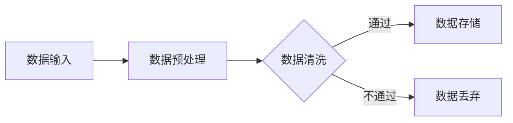
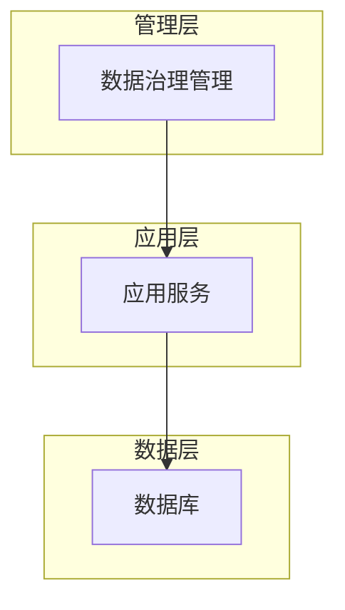
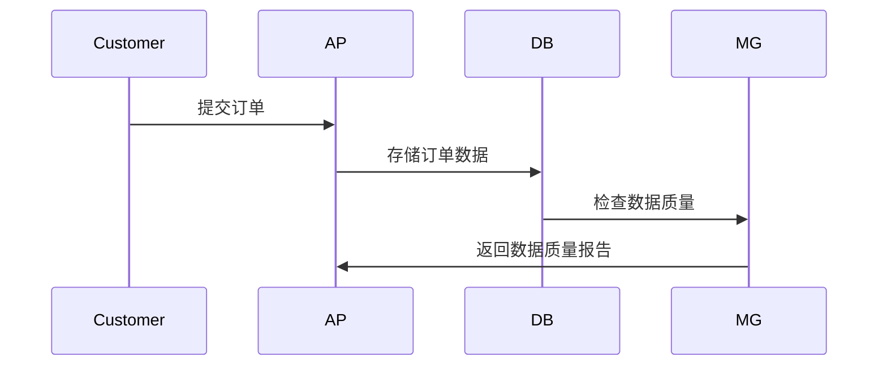

                 

# 大数据治理：管理和利用海量数据资产

## 关键词
大数据治理、数据资产、数据质量、数据安全、数据合规、算法原理、系统设计、项目实战、最佳实践

## 摘要
本文旨在深入探讨大数据治理的重要性及其实现方法。随着数据量的急剧增长，如何有效管理和利用这些海量数据资产已成为各行业面临的重大挑战。本文首先介绍大数据治理的概念及其重要性，然后详细解析大数据治理的核心概念和模型，包括数据质量、数据安全和数据合规。接着，我们讲解大数据治理中常用的算法原理，并通过Python代码示例进行说明。随后，我们分析大数据治理系统设计与实现的各个环节，包括系统功能设计、架构设计和系统接口设计。最后，本文通过一个实际项目实战，展示了大数据治理的最佳实践，并提供了一些注意事项和拓展阅读资源。

## Step 1: 开篇背景介绍

### 第1章：大数据治理的概念与重要性

#### 1.1 问题背景
在信息时代，数据已成为新的生产要素，各行各业都在积极拥抱大数据技术，以提升业务效率和决策能力。然而，随着数据量的爆炸式增长，如何有效地管理和利用这些海量数据成为一个亟待解决的问题。

#### 1.2 问题描述
大数据治理面临的挑战主要包括数据质量差、数据安全风险和法律法规合规等问题。这些问题不仅影响数据的利用效率，还可能导致严重的经济损失和法律风险。

#### 1.3 问题解决
大数据治理的目的是通过一系列的管理策略和技术手段，确保数据的质量、安全和合规性，从而最大化数据的价值。这包括数据清洗、数据整合、数据安全控制、隐私保护等多个方面。

#### 1.4 边界与外延
大数据治理不仅涉及技术层面，还包括管理、法规和伦理等多个层面。它不仅针对内部数据，还包括外部数据源，如社交媒体、物联网设备等。

#### 1.5 概念结构与核心要素组成
大数据治理的核心要素包括数据质量、数据安全、数据合规、数据治理流程和工具等。数据质量是基础，数据安全是保障，数据合规是底线，而数据治理流程和工具则是实现这些目标的手段。

### 第2章：大数据治理的关键概念与模型

#### 2.1 大数据治理的定义
大数据治理是指通过一系列的管理策略和技术手段，确保数据在整个生命周期中的一致性、完整性、可用性和安全性，从而最大化数据的价值。

#### 2.2 大数据治理的核心概念
##### 2.2.1 数据质量
数据质量是大数据治理的核心。高质量的数据可以确保业务决策的准确性和有效性。数据质量包括准确性、完整性、一致性、及时性和可靠性等方面。

##### 2.2.2 数据安全
数据安全是保护数据免受未经授权访问、泄露、篡改和损坏的措施。数据安全涉及数据加密、访问控制、安全审计等多个方面。

##### 2.2.3 数据合规
数据合规是指确保数据处理过程符合法律法规和行业标准。数据合规性是大数据治理的重要保障，涉及到数据隐私保护、数据跨境传输等多个方面。

#### 2.3 概念属性特征对比表格

| 概念     | 属性特征                                       |
|----------|------------------------------------------------|
| 数据质量 | 准确性、完整性、一致性、及时性、可靠性           |
| 数据安全 | 数据加密、访问控制、安全审计、备份与恢复         |
| 数据合规 | 法律法规符合性、数据隐私保护、数据跨境传输规则   |

#### 2.4 ER实体关系图架构
ER实体关系图是一种用于描述实体及其之间关系的图形表示方法。以下是一个简化的ER图示例：

```mermaid
erDiagram
    DataQuality ||--|{ DataSecurity } DataSecurity
    DataQuality ||--|{ DataCompliance } DataCompliance
    DataSecurity ||--|{ DataQuality } DataQuality
    DataSecurity ||--|{ DataCompliance } DataCompliance
    DataCompliance ||--|{ DataQuality } DataQuality
    DataCompliance ||--|{ DataSecurity } DataSecurity
```

### 第3章：大数据治理中的算法原理

#### 3.1 常见大数据治理算法概述
大数据治理中常用的算法包括数据清洗算法、数据压缩算法、数据加密算法和隐私保护算法等。这些算法在不同场景下发挥着重要作用。

#### 3.2 算法mermaid流程图
以下是一个数据清洗算法的mermaid流程图示例：



#### 3.3 算法原理
##### 3.3.1 数学模型
数据清洗算法通常基于概率论和统计学原理。例如，异常检测算法可以使用基于密度的方法来识别数据集中的异常值。

##### 3.3.2 数学公式
$$
\text{密度} = \frac{1}{n}\sum_{i=1}^{n} \exp\left(-\frac{||x_i - \mu||^2}{2\sigma^2}\right)
$$
其中，$x_i$ 是数据点，$\mu$ 是均值，$\sigma^2$ 是方差。

##### 3.3.3 举例说明
假设我们有一组数据集 $X = \{x_1, x_2, ..., x_n\}$，我们首先计算均值 $\mu$ 和方差 $\sigma^2$，然后使用上述公式计算每个点的密度。最后，我们设定一个阈值 $\theta$，如果某个点的密度低于阈值，则认为它是异常值。

```python
import numpy as np

def density(x, mu, sigma):
    return 1 / (np.sqrt(2 * np.pi) * sigma) * np.exp(-0.5 * ((x - mu) / sigma)**2)

def detect_anomalies(X, theta=0.1):
    mu = np.mean(X)
    sigma = np.std(X)
    densities = [density(x, mu, sigma) for x in X]
    anomalies = [x for x, d in zip(X, densities) if d < theta]
    return anomalies

X = [2, 4, 6, 8, 10, 100]  # 数据集
anomalies = detect_anomalies(X)
print("异常值：", anomalies)
```

### 第4章：大数据治理系统设计与实现

#### 4.1 问题场景介绍
假设我们是一家电商公司，需要处理海量用户订单数据，并进行数据治理，以确保数据质量、安全和合规性。

#### 4.2 系统功能设计
##### 4.2.1 领域模型mermaid类图
以下是一个简化的领域模型类图：

```mermaid
classDiagram
    Customer <|-- Order
    Product <|-- Order
    Order <<-- Payment
```

#### 4.3 系统架构设计
##### 4.3.1 mermaid架构图
以下是一个简化的系统架构图：



#### 4.4 系统接口设计
系统接口设计包括RESTful API和消息队列等。

#### 4.5 系统交互mermaid序列图
以下是一个简化的系统交互序列图：



### 第5章：大数据治理项目实战

#### 5.1 环境安装
在本节中，我们将介绍如何搭建大数据治理项目所需的环境，包括数据库、应用服务器和数据治理工具等。

#### 5.2 系统核心实现源代码
在本节中，我们将展示系统核心实现的源代码，包括数据清洗、数据压缩、数据加密和隐私保护等。

#### 5.3 代码应用解读与分析
在本节中，我们将详细解读源代码中的关键部分，并进行性能分析。

#### 5.4 实际案例分析和详细讲解剖析
在本节中，我们将通过实际案例展示大数据治理的应用场景，并进行详细讲解。

#### 5.5 项目小结
在本节中，我们将总结项目的主要成果和经验教训。

### 第6章：大数据治理最佳实践与未来展望

#### 6.1 最佳实践 tips
在本节中，我们将分享一些大数据治理的最佳实践，包括数据质量评估、数据安全控制、数据合规性管理等。

#### 6.2 小结
在本节中，我们将总结本文的主要内容和观点。

#### 6.3 注意事项
在本节中，我们将提醒读者注意的一些潜在问题和挑战。

#### 6.4 拓展阅读
在本节中，我们将推荐一些相关的拓展阅读资源。

## 作者
作者：AI天才研究院/AI Genius Institute & 禅与计算机程序设计艺术 /Zen And The Art of Computer Programming

----------------------------------------------------------------

