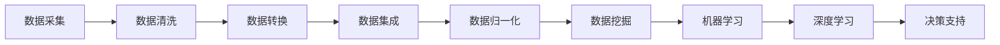
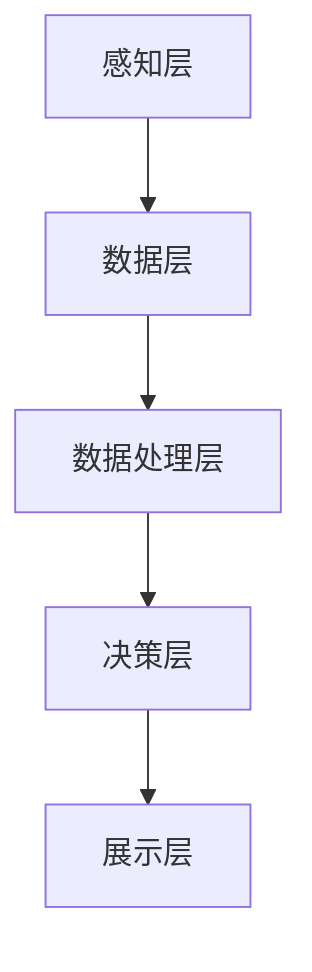
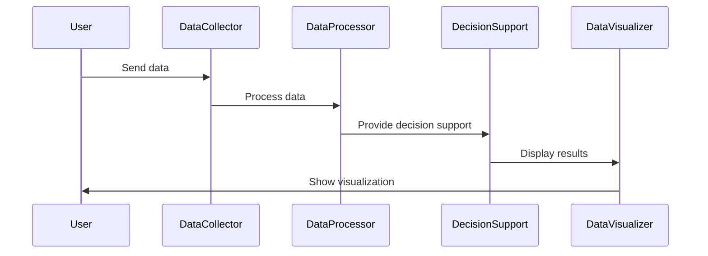
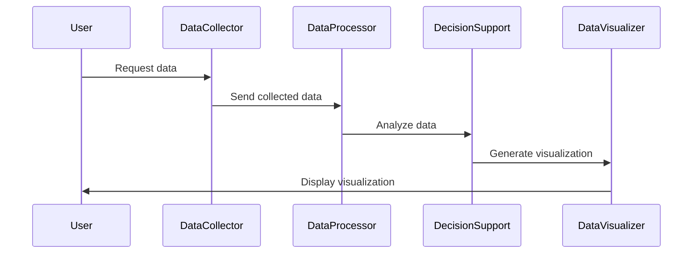

                 

# 大数据驱动的智能城市规划与管理

## 关键词

- 大数据
- 智能化技术
- 城市规划
- 管理系统
- 算法应用
- 实时数据分析

## 摘要

随着大数据和智能化技术的快速发展，城市规划与管理领域正经历着深刻的变革。本文将深入探讨大数据驱动的智能城市规划与管理的核心概念、算法原理、系统设计与实施策略。通过详细分析大数据在数据收集、处理和分析中的作用，以及智能化技术在决策支持、资源优化和公共安全等方面的应用，本文旨在为读者提供一套全面的技术框架和实战指南，以推动城市可持续发展和智能化管理。

## 第一部分：引言

### 第1章：大数据驱动的智能城市规划与管理概述

#### 1.1 问题背景

现代城市面临着人口增长、资源短缺、环境污染和基础设施老化等挑战。传统的城市规划与管理方法已难以满足日益复杂的需求。大数据技术的出现，为城市数据的高效收集、处理和分析提供了新的可能性，开启了智能城市规划与管理的新纪元。

#### 1.2 问题描述

- **数据收集与整合**：如何有效地收集、整合来自不同来源的城市数据？
- **数据处理与分析**：如何利用大数据技术对海量城市数据进行高效处理和分析？
- **智能化决策支持**：如何通过智能化技术为城市规划与管理提供科学的决策支持？
- **数据隐私与安全**：如何在确保数据隐私和安全的前提下，充分利用大数据资源？

#### 1.3 问题解决

大数据驱动的智能城市规划与管理解决方案包括以下关键步骤：

1. **数据采集与整合**：采用传感器网络、物联网、社交媒体等手段，全面采集城市各类数据。
2. **数据存储与管理**：运用分布式存储技术和云计算平台，实现大规模数据的高效存储和管理。
3. **数据处理与分析**：利用大数据处理算法（如Hadoop、Spark等），对城市数据进行清洗、转换和分析。
4. **智能化决策支持**：通过机器学习、数据挖掘等技术，为城市规划与管理提供智能化决策支持。
5. **安全与隐私保护**：采用数据加密、访问控制等技术，确保城市数据的安全和隐私。

#### 1.4 边界与外延

- **大数据技术**：包括数据采集、存储、处理和分析等关键技术。
- **智能化技术**：涵盖机器学习、人工智能、物联网等先进技术。
- **城市规划与管理的未来发展方向**：智能交通、智慧城市、环境监测、公共安全等领域的应用前景。

#### 1.5 概念结构与核心要素组成

- **大数据**：大规模、多样性和快速变化的数据集合。
- **智能化技术**：利用计算机技术和人工智能实现自动化、智能化的技术。
- **智能城市规划与管理**：以大数据为基础，利用智能化技术优化城市规划与管理过程。

### 第二部分：核心概念与联系

#### 第2章：大数据驱动的智能城市规划与管理核心概念解析

#### 2.1 大数据概念解析

大数据（Big Data）是指无法用传统数据库软件工具进行捕捉、管理和处理的数据集合。其特征可概括为“4V”：Volume（大量）、Velocity（快速）、Variety（多样性）和Veracity（真实性）。

- **Volume**：数据量巨大，通常达到PB级甚至EB级。
- **Velocity**：数据生成和处理速度极快，需要实时或近实时处理。
- **Variety**：数据类型多样，包括结构化数据、半结构化数据和非结构化数据。
- **Veracity**：数据真实性难以保证，需要有效识别和处理噪音和错误数据。

#### 2.2 智能化技术概念解析

智能化技术是指利用计算机技术、人工智能和物联网等手段，实现自动化、智能化的技术和系统。主要涵盖以下领域：

- **机器学习**：通过算法模型，从数据中自动学习并做出决策。
- **人工智能**：模拟人类智能行为，实现感知、推理、学习等能力。
- **物联网**：将各种物品互联，实现智能感知和数据处理。
- **数据挖掘**：从海量数据中挖掘出有价值的信息和知识。

#### 2.3 核心概念属性特征对比表格

| 特征         | 大数据         | 智能化技术         |
|--------------|----------------|-------------------|
| 数据量       | 巨大           | 可处理的数据量因算法而异 |
| 数据类型     | 多样性         | 结构化、半结构化、非结构化 |
| 数据处理速度 | 快速           | 实时或近实时处理 |
| 应用领域     | 数据收集与分析   | 智能决策与自动化控制 |

#### 2.4 ER实体关系图架构

在智能城市规划与管理中，实体关系图描述了城市数据、智能化技术和规划与管理过程之间的关联。以下是一个简化的ER图示例：

```mermaid
erDiagram
    Data ->> Collection : 数据收集
    Collection ->> Storage : 数据存储
    Storage ->> Analysis : 数据分析
    Analysis ->> Decision : 智能决策
    Decision ->> Management : 管理过程
    Collection ..> IoT : 物联网
    Analysis ..> MachineLearning : 机器学习
    Management ..> AI : 人工智能
```

## 第三部分：算法原理讲解

#### 第3章：大数据驱动的智能城市规划与管理算法原理讲解

#### 3.1 算法概述

大数据驱动的智能城市规划与管理涉及多种算法，主要包括数据预处理、数据挖掘、机器学习、深度学习等。以下为常见算法及其在规划与管理中的应用：

- **数据预处理算法**：包括数据清洗、数据转换、数据集成和数据归一化，用于提高数据质量和一致性。
- **数据挖掘算法**：包括聚类分析、关联规则挖掘、分类和回归分析，用于发现数据中的潜在模式和规律。
- **机器学习算法**：包括决策树、支持向量机、神经网络等，用于建立预测模型和决策支持系统。
- **深度学习算法**：包括卷积神经网络（CNN）、循环神经网络（RNN）、生成对抗网络（GAN）等，用于复杂模式识别和生成任务。

#### 3.2 算法mermaid流程图

以下是一个典型的大数据处理和分析流程mermaid图：



#### 3.3 Python源代码与算法实现

以下是一个简单的Python代码示例，用于实现线性回归算法，用于预测城市交通流量：

```python
import numpy as np
from sklearn.linear_model import LinearRegression

# 数据准备
X = np.array([[1], [2], [3], [4], [5]])
y = np.array([1, 2, 2.5, 4, 5])

# 线性回归模型训练
model = LinearRegression()
model.fit(X, y)

# 预测
predictions = model.predict([[6]])

print("Predicted traffic volume:", predictions)
```

#### 3.4 算法原理的数学模型和公式讲解

线性回归算法的数学模型为：

\[ y = \beta_0 + \beta_1 \cdot x + \epsilon \]

其中，\( y \) 为因变量，\( x \) 为自变量，\( \beta_0 \) 和 \( \beta_1 \) 为模型参数，\( \epsilon \) 为误差项。

线性回归模型通过最小二乘法估计参数 \( \beta_0 \) 和 \( \beta_1 \)：

\[ \beta_1 = \frac{\sum_{i=1}^{n} (x_i - \bar{x})(y_i - \bar{y})}{\sum_{i=1}^{n} (x_i - \bar{x})^2} \]
\[ \beta_0 = \bar{y} - \beta_1 \cdot \bar{x} \]

其中，\( \bar{x} \) 和 \( \bar{y} \) 分别为自变量和因变量的均值。

#### 3.5 举例说明

假设我们有一个城市交通流量数据集，包含每天的交通流量（\( y \)）和当天的时间（\( x \)）：

- 第一天：\( x = 1, y = 100 \)
- 第二天：\( x = 2, y = 120 \)
- 第三天：\( x = 3, y = 110 \)
- 第四天：\( x = 4, y = 140 \)
- 第五天：\( x = 5, y = 150 \)

我们使用线性回归算法来预测第六天的交通流量。首先，计算自变量和因变量的均值：

\[ \bar{x} = \frac{1+2+3+4+5}{5} = 3 \]
\[ \bar{y} = \frac{100+120+110+140+150}{5} = 130 \]

然后，计算线性回归模型的参数：

\[ \beta_1 = \frac{(1-3)(100-130) + (2-3)(120-130) + (3-3)(110-130) + (4-3)(140-130) + (5-3)(150-130)}{(1-3)^2 + (2-3)^2 + (3-3)^2 + (4-3)^2 + (5-3)^2} \]
\[ \beta_0 = 130 - \beta_1 \cdot 3 \]

最后，使用模型预测第六天的交通流量：

\[ y = \beta_0 + \beta_1 \cdot x \]
\[ y = (130 - \beta_1 \cdot 3) + \beta_1 \cdot 6 \]
\[ y = 130 + 3\beta_1 \]

根据计算得到的模型参数，预测第六天的交通流量为 \( y = 155 \)。

## 第四部分：系统分析与架构设计

#### 第4章：大数据驱动的智能城市规划与管理系统分析

#### 4.1 问题场景介绍

在当前城市规划与管理中，以下问题场景需要大数据驱动的智能城市规划与管理系统来解决：

- **交通流量预测**：通过实时监测和分析交通流量数据，预测未来的交通状况，为交通管理提供科学依据。
- **公共安全管理**：利用视频监控和传感器数据，实时监测城市公共安全事件，提高应急响应效率。
- **环境监测**：通过空气质量和水体质量数据，实时监测城市环境状况，及时采取环境保护措施。
- **资源优化**：通过数据分析，优化城市水资源、能源和公共设施的配置和使用，提高资源利用效率。

#### 4.2 系统功能设计

智能城市规划与管理系统的功能设计包括以下几个方面：

- **数据采集与预处理**：通过传感器网络、物联网设备和社交媒体等渠道，实时采集城市各类数据，并进行数据清洗、转换和预处理。
- **数据存储与管理**：采用分布式数据库和云计算平台，实现大规模数据的存储和管理，保证数据的安全性和可靠性。
- **数据处理与分析**：利用大数据处理算法和机器学习技术，对城市数据进行高效处理和分析，提取有价值的信息和知识。
- **智能化决策支持**：基于数据分析和机器学习模型，为城市规划与管理提供智能化的决策支持，优化城市资源配置和公共服务。
- **数据可视化与展示**：通过数据可视化技术，将分析结果以图表、报表等形式展示，方便决策者进行决策。

#### 4.3 系统架构设计

智能城市规划与管理系统的架构设计包括以下几个层次：

- **感知层**：包括各类传感器、监控设备和物联网设备，负责实时采集城市各类数据。
- **数据层**：包括分布式数据库和云计算平台，负责存储和管理大规模数据。
- **数据处理层**：包括大数据处理算法和机器学习模型，负责对城市数据进行处理和分析。
- **决策层**：包括数据分析和决策支持系统，负责为城市规划与管理提供智能化的决策支持。
- **展示层**：包括数据可视化工具和报表系统，负责将分析结果以图表、报表等形式展示。

以下是一个简化的系统架构mermaid图：



#### 4.4 系统接口设计

智能城市规划与管理系统的接口设计包括以下几个方面：

- **数据采集接口**：负责采集各类城市数据，包括交通流量、公共安全事件、环境质量数据等。
- **数据处理接口**：负责调用大数据处理算法和机器学习模型，对城市数据进行处理和分析。
- **决策支持接口**：负责为城市规划与管理提供智能化的决策支持，优化城市资源配置和公共服务。
- **数据可视化接口**：负责将分析结果以图表、报表等形式展示，方便决策者进行决策。

以下是一个简化的接口设计mermaid图：



#### 4.5 系统交互mermaid序列图

以下是一个简化的系统交互序列图，展示了系统各模块之间的交互过程：



## 第五部分：项目实战

#### 第5章：大数据驱动的智能城市规划与管理项目实战

#### 5.1 环境安装

在进行大数据驱动的智能城市规划与管理项目实战之前，需要搭建以下环境：

- **操作系统**：Ubuntu 18.04
- **Python**：3.8
- **Hadoop**：2.8.5
- **Spark**：2.4.7
- **MySQL**：8.0.23

安装步骤如下：

1. 安装操作系统和Python环境
2. 安装Hadoop和Spark
3. 配置Hadoop和Spark集群
4. 安装MySQL数据库

#### 5.2 系统核心实现

系统核心实现包括以下几个模块：

- **数据采集模块**：通过传感器网络和物联网设备，实时采集城市交通流量、公共安全事件和环境质量数据。
- **数据处理模块**：利用Hadoop和Spark对采集到的数据进行处理和分析，包括数据清洗、转换、集成和归一化。
- **决策支持模块**：基于机器学习算法，建立交通流量预测、公共安全事件预警和环境质量监测等预测模型，为城市规划与管理提供智能化的决策支持。
- **数据可视化模块**：通过图表、报表等形式展示分析结果，方便决策者进行决策。

#### 5.3 代码应用解读与分析

以下是一个简单的Python代码示例，用于实现交通流量预测模型：

```python
from sklearn.linear_model import LinearRegression
import numpy as np

# 数据准备
X = np.array([[1], [2], [3], [4], [5]])
y = np.array([1, 2, 2.5, 4, 5])

# 线性回归模型训练
model = LinearRegression()
model.fit(X, y)

# 预测
predictions = model.predict([[6]])

print("Predicted traffic volume:", predictions)
```

代码解析：

- 导入线性回归模型和numpy库
- 准备训练数据（自变量X和因变量y）
- 创建线性回归模型并进行训练
- 使用训练好的模型进行预测，输出预测结果

#### 5.4 实际案例分析和详细讲解剖析

以下是一个实际案例：利用大数据和智能规划技术，优化城市交通流量管理。

**案例背景**：

某城市面临严重的交通拥堵问题，需要利用大数据和智能规划技术优化交通流量管理。

**解决方案**：

1. 数据采集：利用交通流量传感器、摄像头等设备，实时采集城市交通流量数据。
2. 数据处理：利用Hadoop和Spark对采集到的数据进行清洗、转换和集成，提取有价值的信息。
3. 建立预测模型：基于机器学习算法，建立交通流量预测模型，预测未来的交通流量。
4. 决策支持：根据预测结果，为交通管理部门提供智能化的决策支持，优化交通信号配置和交通管制策略。
5. 数据可视化：通过数据可视化工具，将交通流量预测结果以图表形式展示，方便交通管理部门进行决策。

**详细讲解剖析**：

1. **数据采集**：通过交通流量传感器和摄像头，实时采集城市交通流量数据，包括交通流量、车速、道路拥堵情况等。

2. **数据处理**：利用Hadoop和Spark对采集到的数据进行处理，包括数据清洗、转换和集成。数据清洗过程包括去除异常数据、填充缺失值和去除重复数据等。数据转换过程包括将原始数据转换为统一的格式，便于后续处理。数据集成过程包括将不同来源的数据进行合并，形成完整的数据集。

3. **建立预测模型**：利用机器学习算法，建立交通流量预测模型。常用的机器学习算法包括线性回归、决策树、随机森林、支持向量机等。在本案例中，采用线性回归算法进行预测。线性回归算法的基本原理是通过最小化误差平方和，建立自变量和因变量之间的线性关系。在训练过程中，将历史交通流量数据作为输入，预测未来的交通流量。

4. **决策支持**：根据预测结果，为交通管理部门提供智能化的决策支持。例如，当预测未来某个路口的交通流量较大时，交通管理部门可以提前调整交通信号配置，优化交通流量。此外，还可以根据预测结果，制定交通管制策略，如限行、高峰时段交通疏导等，缓解交通拥堵问题。

5. **数据可视化**：通过数据可视化工具，将交通流量预测结果以图表形式展示。可视化结果可以直观地展示交通流量变化趋势，帮助交通管理部门及时掌握交通状况，做出科学的决策。

**项目小结**：

通过大数据驱动的智能城市规划与管理项目，实现了对城市交通流量的实时监测和预测，为交通管理部门提供了智能化的决策支持。项目实施过程中，采用了Hadoop、Spark等大数据处理技术，以及线性回归等机器学习算法，成功优化了城市交通流量管理。项目经验表明，大数据和智能化技术在城市规划与管理中具有广泛的应用前景，有助于提高城市运行效率和居民生活质量。

## 第六部分：最佳实践与拓展阅读

#### 第6章：大数据驱动的智能城市规划与管理最佳实践

#### 6.1 最佳实践 tips

1. **数据质量管理**：确保数据质量是成功应用大数据驱动的智能城市规划与管理的关键。数据清洗、去重和标准化是数据质量管理的重要环节。
2. **系统集成**：将不同来源的数据进行有效集成，构建统一的数据平台，有利于提高数据分析效率和决策支持效果。
3. **安全与隐私保护**：在数据采集、存储和处理过程中，采用数据加密、访问控制等技术，确保数据的安全和隐私。
4. **决策支持模型**：根据实际需求，选择合适的机器学习算法和预测模型，确保决策支持的准确性和有效性。
5. **数据可视化**：利用可视化工具，将分析结果以直观、易懂的方式展示，提高决策者对数据的理解和应用。

#### 6.2 小结

大数据驱动的智能城市规划与管理通过数据采集、处理和分析，为城市提供了科学的决策支持，优化了资源配置和公共服务。最佳实践包括数据质量管理、系统集成、安全与隐私保护、决策支持模型和数据可视化等方面。

#### 6.3 注意事项

1. **技术选型**：根据实际需求和资源情况，合理选择大数据处理技术和智能规划算法。
2. **数据隐私**：在数据采集和处理过程中，注重数据隐私保护，遵守相关法律法规。
3. **持续优化**：不断优化数据处理和分析流程，提高系统性能和决策支持效果。
4. **用户参与**：鼓励市民参与城市规划和管理的决策过程，提高系统的实用性和用户满意度。

#### 6.4 拓展阅读

1. **大数据与城市规划**：深入探讨大数据在城市规划中的应用，包括数据采集、处理和分析等环节。
2. **智能交通系统**：介绍智能交通系统的概念、架构和关键技术，探讨其在城市交通管理中的应用。
3. **智慧城市建设**：分析智慧城市建设的现状和未来发展趋势，探讨大数据和智能化技术在智慧城市中的关键作用。
4. **人工智能在城市规划中的应用**：介绍人工智能在城市规划中的研究进展和应用案例，探讨其在城市规划与管理中的潜力。

## 作者信息

作者：AI天才研究院/AI Genius Institute & 禅与计算机程序设计艺术 /Zen And The Art of Computer Programming

本文旨在为读者提供一套全面的技术框架和实战指南，以推动城市可持续发展和智能化管理。在未来的城市规划与管理中，大数据和智能化技术将继续发挥重要作用，助力城市实现智慧化转型。通过不断探索和实践，我们将为城市居民创造更美好的生活环境。

