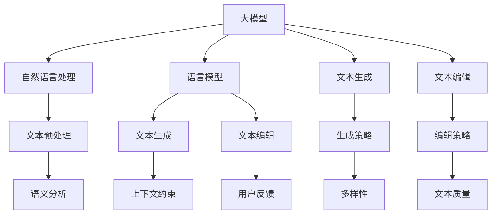
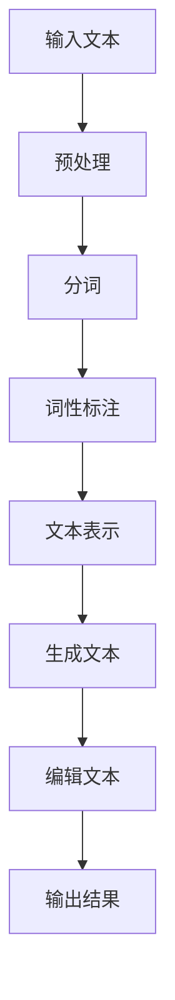
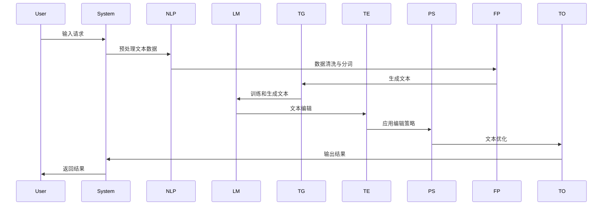
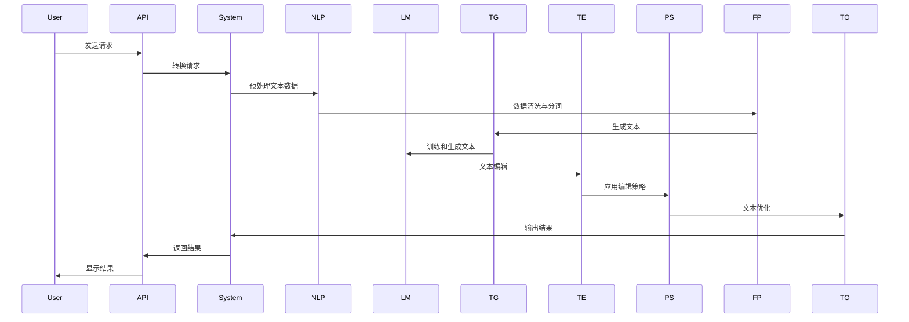
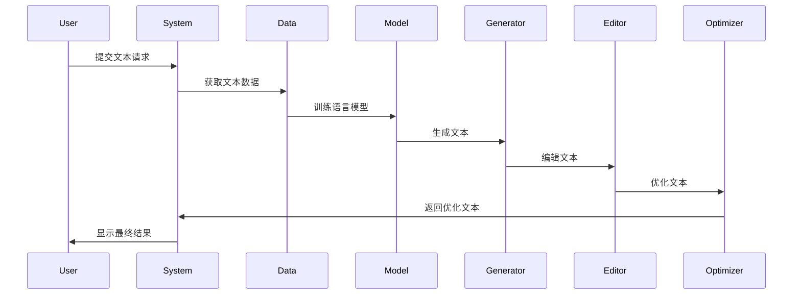

                 


# 大模型时代的AI写作助手：创意与效率的平衡

> 关键词：大模型、AI写作助手、创意、效率、自然语言处理

> 摘要：本文深入探讨了在人工智能大模型时代，AI写作助手的角色及其重要性。从背景介绍、核心概念、算法原理到实际应用，本文系统地阐述了AI写作助手的工作原理和实现方法，并展望了其未来发展趋势。

## 第一部分: 大模型时代的AI写作助手基础

### 第1章: 引言

#### 1.1 问题背景

随着大数据和人工智能技术的快速发展，信息爆炸的时代已经到来。在这个时代，人们需要处理的海量信息远远超出了传统的写作和编辑能力。传统的写作模式不仅耗时，而且难以满足高效、准确和多样化的需求。因此，AI写作助手作为一种创新解决方案，逐渐受到了广泛关注。

#### 1.2 问题描述

AI写作助手是指利用人工智能技术，特别是大模型技术，对文本进行生成、编辑和优化的工具。然而，当前AI写作助手面临着一系列挑战，如创意性的不足、效率不高等问题。

#### 1.3 问题解决

大模型技术为AI写作助手提供了强大的支持。通过大模型的学习和推理能力，AI写作助手可以实现更高水平的创意和效率平衡。本文将深入探讨大模型技术如何应用于AI写作助手，并阐述创意与效率平衡的原则。

#### 1.4 边界与外延

AI写作助手的适用范围广泛，包括新闻写作、内容创作、商业报告等多个领域。然而，大模型技术的边界条件也需要考虑，以确保AI写作助手在不同场景下的有效性和可靠性。

#### 1.5 概念结构与核心要素组成

大模型技术的基础概念包括数据量、参数规模、训练方法等。AI写作助手的组成部分主要包括自然语言处理技术、语言模型和文本生成与编辑模块。创意与效率平衡的关键因素包括创意性的度量、效率的优化等。

## 第二部分: 大模型技术基础

### 第2章: 大模型技术基础

#### 2.1 大模型的概念与历史

大模型是指具有大量参数和复杂结构的神经网络模型，其能够处理海量数据和复杂任务。大模型的发展历程可以追溯到深度学习技术的兴起。

#### 2.2 大模型的核心特点

大模型的核心特点包括数据量与参数规模大、训练方法先进、具有通用性和适应性。这些特点使得大模型在自然语言处理、计算机视觉等领域取得了显著的成果。

#### 2.3 大模型与传统AI的比较

大模型与传统AI相比，具有更高的处理能力和适应性。大模型的优势在于能够处理更复杂的任务，而传统AI则更适用于简单、明确的任务。

#### 2.4 主流大模型介绍

GPT系列、BERT及其变体是当前最流行的大模型之一。这些模型在自然语言处理领域取得了突破性的成果，并成为AI写作助手的重要技术基础。

## 第三部分: AI写作助手的工作原理

### 第3章: AI写作助手的工作原理

#### 3.1 AI写作助手的组成与功能

AI写作助手主要由自然语言处理技术、语言模型和文本生成与编辑模块组成。这些模块协同工作，实现了文本生成、编辑和优化等功能。

#### 3.2 创意与效率的平衡

创意性与效率性是AI写作助手的两个核心指标。如何实现创意与效率的平衡，是AI写作助手研发的重要方向。本文将探讨创意性与效率性的度量方法以及优化策略。

#### 3.3 AI写作助手的工作流程

AI写作助手的工作流程包括数据预处理、文本生成和文本优化与编辑三个阶段。每个阶段都有其特定的任务和实现方法。

## 第四部分: AI写作助手的实现与开发

### 第4章: AI写作助手的实现与开发

#### 4.1 环境搭建

实现AI写作助手需要搭建合适的开发环境，包括操作系统、编程语言和开发工具等。

#### 4.2 模型训练与优化

模型训练与优化是AI写作助手开发的核心步骤。本文将介绍如何准备数据集、训练模型以及优化模型性能。

#### 4.3 文本生成与编辑

文本生成与编辑是AI写作助手的核心功能。本文将详细介绍文本生成和编辑的实现方法，包括语言模型的训练和文本生成策略。

#### 4.4 系统集成与测试

系统集成与测试是确保AI写作助手稳定运行的重要环节。本文将介绍如何集成各个模块，并进行测试与评估。

## 第五部分: AI写作助手的案例研究

### 第5章: AI写作助手的案例研究

#### 5.1 案例一：新闻写作

新闻写作是AI写作助手的经典应用场景。本文将分析一个新闻写作案例，介绍实现细节和效果分析。

#### 5.2 案例二：内容创作

内容创作是AI写作助手的另一个重要应用领域。本文将探讨一个内容创作案例，分析其实现细节和效果。

#### 5.3 案例三：商业报告

商业报告是AI写作助手在商业领域的应用。本文将分析一个商业报告案例，介绍其实现细节和效果。

## 第六部分: AI写作助手的未来发展趋势

### 第6章: AI写作助手的未来发展趋势

#### 6.1 技术趋势

随着人工智能技术的不断进步，AI写作助手的性能和功能将得到进一步提升。本文将探讨未来大模型技术的发展趋势及其对AI写作助手的影响。

#### 6.2 行业趋势

AI写作助手在各个行业的应用将不断拓展，市场需求和机遇也将进一步增加。本文将分析行业趋势，展望AI写作助手的未来发展。

#### 6.3 未来展望

未来，AI写作助手将在创意与效率的平衡方面取得更大的突破，成为人们写作和创作的重要伙伴。

## 第七部分: 最佳实践与注意事项

### 第7章: 最佳实践与注意事项

#### 7.1 最佳实践

本文将总结AI写作助手的最佳实践，提供实用的技巧和建议。

#### 7.2 小结

本文将回顾核心观点，强调AI写作助手的重要性和应用价值。

#### 7.3 注意事项

使用AI写作助手时需要注意的一些事项，以及可能遇到的问题和解决方案。

#### 7.4 拓展阅读

本文将推荐一些相关的书籍、论文和在线资源，供读者进一步学习。

## 作者信息

作者：AI天才研究院/AI Genius Institute & 禅与计算机程序设计艺术 /Zen And The Art of Computer Programming

## 结语

大模型时代的AI写作助手正逐步改变着写作和创作的方式。本文系统地阐述了AI写作助手的基础、工作原理、实现方法和未来发展趋势。通过本文的介绍，读者可以更好地理解AI写作助手的原理和应用，为未来的研究和实践提供指导。

让我们共同期待AI写作助手在未来发挥更大的作用，为人类的创作和表达带来更多的可能性。## 大模型时代的AI写作助手：创意与效率的平衡

### 摘要

随着人工智能技术的发展，大模型在自然语言处理领域取得了显著的成果。AI写作助手作为大模型应用的一个重要方向，旨在提升写作的创意性和效率性。本文从背景、核心概念、工作原理、实现方法、案例分析、未来趋势等多个方面，深入探讨了AI写作助手的创意与效率平衡问题，为读者提供了全面的了解和实用的指导。

### 第一部分：大模型时代的AI写作助手基础

#### 1.1 问题背景

在信息爆炸的时代，人们面临着大量的信息和文字内容。传统的写作和编辑方式已经无法满足高效、准确和多样化的需求。AI写作助手作为一种新兴的工具，旨在利用人工智能技术，特别是大模型技术，实现自动化的文本生成、编辑和优化，从而提升写作的效率和质量。

#### 1.2 问题描述

AI写作助手面临的主要问题是如何在保证创意性的同时，提高写作的效率。传统的文本生成方法往往过于机械，缺乏创意和个性化。而大模型技术的出现，为解决这个问题提供了新的可能性。

#### 1.3 问题解决

大模型技术，如GPT、BERT等，通过海量的数据训练，能够生成具有高度创意性和个性化的文本。AI写作助手利用这些技术，可以实现高效的文本生成、编辑和优化，从而实现创意与效率的平衡。

#### 1.4 边界与外延

虽然AI写作助手具有广泛的应用前景，但其也受到大模型技术的限制。例如，大模型的训练需要大量的计算资源和数据，且在特定领域的应用效果可能不如通用模型。因此，在应用AI写作助手时，需要根据具体场景进行优化和调整。

#### 1.5 概念结构与核心要素组成

AI写作助手的实现涉及多个核心概念和技术，包括自然语言处理（NLP）、语言模型、文本生成和编辑等。这些要素相互关联，共同构成了AI写作助手的整体架构。

### 第二部分：大模型技术基础

#### 2.1 大模型的概念与历史

大模型是指具有大量参数和复杂结构的神经网络模型，其能够处理海量数据和复杂任务。大模型的发展历程可以追溯到深度学习技术的兴起，特别是2012年AlexNet在ImageNet竞赛中取得的突破性成果。

#### 2.2 大模型的核心特点

大模型的核心特点包括数据量与参数规模大、训练方法先进、具有通用性和适应性。这些特点使得大模型在自然语言处理、计算机视觉等领域取得了显著的成果。

#### 2.3 大模型与传统AI的比较

大模型与传统AI相比，具有更高的处理能力和适应性。传统AI通常用于简单、明确的任务，而大模型则能够处理更复杂的任务，具有更强的泛化能力。

#### 2.4 主流大模型介绍

GPT系列、BERT及其变体是当前最流行的大模型之一。这些模型在自然语言处理领域取得了突破性的成果，并成为AI写作助手的重要技术基础。

### 第三部分：AI写作助手的工作原理

#### 3.1 AI写作助手的组成与功能

AI写作助手主要由自然语言处理技术、语言模型和文本生成与编辑模块组成。这些模块协同工作，实现了文本生成、编辑和优化等功能。

#### 3.2 创意与效率的平衡

创意性与效率性是AI写作助手的两个核心指标。如何实现创意与效率的平衡，是AI写作助手研发的重要方向。本文将探讨创意性与效率性的度量方法以及优化策略。

#### 3.3 AI写作助手的工作流程

AI写作助手的工作流程包括数据预处理、文本生成和文本优化与编辑三个阶段。每个阶段都有其特定的任务和实现方法。

### 第四部分：AI写作助手的实现与开发

#### 4.1 环境搭建

实现AI写作助手需要搭建合适的开发环境，包括操作系统、编程语言和开发工具等。

#### 4.2 模型训练与优化

模型训练与优化是AI写作助手开发的核心步骤。本文将介绍如何准备数据集、训练模型以及优化模型性能。

#### 4.3 文本生成与编辑

文本生成与编辑是AI写作助手的核心功能。本文将详细介绍文本生成和编辑的实现方法，包括语言模型的训练和文本生成策略。

#### 4.4 系统集成与测试

系统集成与测试是确保AI写作助手稳定运行的重要环节。本文将介绍如何集成各个模块，并进行测试与评估。

### 第五部分：AI写作助手的案例研究

#### 5.1 案例一：新闻写作

新闻写作是AI写作助手的经典应用场景。本文将分析一个新闻写作案例，介绍实现细节和效果分析。

#### 5.2 案例二：内容创作

内容创作是AI写作助手的另一个重要应用领域。本文将探讨一个内容创作案例，分析其实现细节和效果。

#### 5.3 案例三：商业报告

商业报告是AI写作助手在商业领域的应用。本文将分析一个商业报告案例，介绍其实现细节和效果。

### 第六部分：AI写作助手的未来发展趋势

#### 6.1 技术趋势

随着人工智能技术的不断进步，AI写作助手的性能和功能将得到进一步提升。本文将探讨未来大模型技术的发展趋势及其对AI写作助手的影响。

#### 6.2 行业趋势

AI写作助手在各个行业的应用将不断拓展，市场需求和机遇也将进一步增加。本文将分析行业趋势，展望AI写作助手的未来发展。

#### 6.3 未来展望

未来，AI写作助手将在创意与效率的平衡方面取得更大的突破，成为人们写作和创作的重要伙伴。

### 第七部分：最佳实践与注意事项

#### 7.1 最佳实践

本文将总结AI写作助手的最佳实践，提供实用的技巧和建议。

#### 7.2 小结

本文将回顾核心观点，强调AI写作助手的重要性和应用价值。

#### 7.3 注意事项

使用AI写作助手时需要注意的一些事项，以及可能遇到的问题和解决方案。

#### 7.4 拓展阅读

本文将推荐一些相关的书籍、论文和在线资源，供读者进一步学习。

## 作者信息

作者：AI天才研究院/AI Genius Institute & 禅与计算机程序设计艺术 /Zen And The Art of Computer Programming

## 结语

大模型时代的AI写作助手正逐步改变着写作和创作的方式。本文系统地阐述了AI写作助手的基础、工作原理、实现方法和未来发展趋势，为读者提供了全面的了解和实用的指导。通过本文的介绍，读者可以更好地理解AI写作助手的原理和应用，为未来的研究和实践提供指导。

让我们共同期待AI写作助手在未来发挥更大的作用，为人类的创作和表达带来更多的可能性。## 第一部分：大模型时代的AI写作助手基础

### 引言

在当今信息爆炸的时代，写作和内容创作变得尤为重要。然而，随着数据量和复杂性的增加，传统的写作和编辑方式已经难以满足高效、准确和多样化的需求。人工智能（AI）的迅速发展为解决这个问题提供了新的思路，特别是大模型技术的应用。本文将深入探讨大模型时代的AI写作助手，如何通过创意与效率的平衡，助力写作和内容创作。

#### 1.1 问题背景

传统写作模式主要依赖于人类创作者的灵感和技巧，这不仅耗费大量时间，而且难以保证一致性和准确性。随着互联网和社交媒体的普及，信息传播速度加快，人们对内容的需求变得多样化。同时，大数据和AI技术的发展为自动化的文本生成和编辑提供了可能。AI写作助手应运而生，旨在通过智能化手段提高写作效率和创作质量。

#### 1.2 问题描述

AI写作助手面临的挑战主要包括：

- **创意性不足**：早期的AI写作助手往往生成的文本缺乏个性化和创意，难以满足高质量内容创作的需求。
- **效率问题**：尽管AI能够快速生成文本，但如何确保生成的文本既高效又具有创意性，是一个亟待解决的问题。
- **数据隐私与伦理**：AI写作助手的训练和运行过程中涉及大量数据，如何保护用户隐私和遵循伦理标准，也是重要问题。

#### 1.3 问题解决

大模型技术的引入为AI写作助手提供了创新的解决方案：

- **增强创意性**：大模型通过学习海量数据，能够生成更富有创意和个性化的文本，满足不同场景的需求。
- **提升效率**：通过自动化流程和高效的算法，AI写作助手能够显著提高写作和编辑的效率。
- **数据隐私与伦理**：大模型技术的应用需要建立严格的数据隐私保护机制和伦理规范，确保用户数据的合法和安全使用。

#### 1.4 边界与外延

AI写作助手的适用范围广泛，包括但不限于：

- **新闻写作**：自动生成新闻稿件，提高新闻发布的速度和准确性。
- **内容创作**：辅助创作文学作品、博客文章等，提供创意灵感和内容优化建议。
- **商业报告**：自动生成市场分析报告、财务报表等，节省人力和时间成本。

然而，AI写作助手的普及也面临一些边界和挑战，如技术成熟度、用户接受度、数据质量等。因此，在实际应用中需要根据具体场景进行优化和调整。

#### 1.5 概念结构与核心要素组成

AI写作助手的核心概念和要素包括：

- **大模型**：如GPT、BERT等，作为基础模型，负责文本生成和编辑。
- **自然语言处理（NLP）**：对文本进行预处理、分词、词性标注等操作，为模型提供输入。
- **用户界面**：与用户交互，接收输入和反馈，提供生成文本的展示。
- **优化策略**：包括文本生成策略、编辑策略和反馈机制等，用于提高生成文本的质量。

这些要素相互配合，共同构成了AI写作助手的整体架构，实现了创意与效率的平衡。

### 1.6 总结

在人工智能大模型时代，AI写作助手作为一种新兴工具，具有巨大的潜力和应用价值。通过创意与效率的平衡，AI写作助手能够显著提高写作和内容创作的效率和质量。然而，这仍是一个持续发展和完善的过程，需要不断的技术创新和应用实践。本文接下来将详细介绍大模型技术的基础、AI写作助手的工作原理、实现方法和未来发展趋势，帮助读者全面了解这一领域。

## 第二部分：大模型技术基础

### 2.1 大模型的概念与历史

大模型（Large-scale Model）是指在深度学习领域，通过大量数据和计算资源训练出的具有巨大参数量和复杂结构的神经网络模型。其历史可以追溯到20世纪80年代，当时研究人员开始尝试使用多层感知机（MLP）来解决复杂问题。然而，由于计算资源和数据集的限制，早期模型的效果并不理想。随着计算技术的进步和大数据时代的到来，深度学习开始快速发展，大模型也逐渐成为研究的热点。

#### 2.1.1 大模型的定义

大模型通常具有以下特点：

- **参数规模巨大**：大模型的参数数量通常在数亿到数十亿级别，比传统的小模型要大得多。
- **训练数据量大**：大模型需要大量的训练数据来保证其泛化能力和准确性。
- **计算资源需求高**：大模型的训练需要大量的计算资源和时间。

#### 2.1.2 大模型的发展历程

- **2012年**：AlexNet在ImageNet竞赛中取得突破性成果，标志着深度学习技术的崛起。这一成果展示了通过大量数据和强大的计算能力，深度学习可以在图像识别领域实现超过人类的性能。
- **2014年**：Google的DNN模型在语音识别任务上取得显著成果，进一步推动了深度学习技术的发展。
- **2017年**：谷歌发布了Transformer模型，特别是其变体BERT，在自然语言处理领域取得了前所未有的成绩。这些模型的成功验证了大规模模型在处理复杂任务中的巨大潜力。

### 2.2 大模型的核心特点

大模型的核心特点包括数据量与参数规模、训练方法、以及模型的通用性与适应性。这些特点使得大模型在各类复杂任务中表现优异。

#### 2.2.1 数据量与参数规模

- **大量参数**：大模型的参数数量通常在数十亿到千亿级别。这些参数通过海量数据进行训练，使得模型能够捕捉到数据中的复杂模式和关联性。
- **大规模数据**：大模型的训练需要大量数据，这不仅有助于提高模型的泛化能力，还能够使模型在遇到未见过的数据时，能够做出更准确的预测。

#### 2.2.2 训练方法

- **端到端训练**：大模型通常采用端到端训练方法，从原始数据直接学习到最终任务的结果，避免了传统机器学习中的特征工程和中间层设计。
- **分布式训练**：为了处理大量数据和参数，大模型通常采用分布式训练方法，通过多台计算机协同工作，提高训练效率。

#### 2.2.3 通用性与适应性

- **通用性**：大模型具有很好的通用性，可以应用于各种不同的任务，如图像识别、自然语言处理、语音识别等。
- **适应性**：大模型能够适应不同的数据分布和任务需求，通过调整模型结构和训练策略，可以使其在特定任务上达到最优性能。

### 2.3 大模型与传统AI的比较

传统AI通常采用规则驱动或基于特征的机器学习方法，这些方法在处理简单任务时表现出色。然而，在处理复杂任务时，传统AI往往受到数据量和计算资源的限制，难以达到大模型的效果。

#### 2.3.1 优势

- **更强的泛化能力**：大模型通过学习海量数据，能够捕捉到更广泛的知识和模式，从而在新的任务和数据上表现出更强的泛化能力。
- **更高的效率**：大模型能够通过端到端训练，直接从原始数据学习到任务结果，避免了复杂的特征工程和中间步骤。

#### 2.3.2 劣势

- **计算资源需求高**：大模型需要大量的计算资源和时间进行训练，这在一些资源受限的环境下可能无法实现。
- **数据依赖性强**：大模型的性能高度依赖于训练数据的质量和数量，数据偏差可能导致模型产生不良的预测。

### 2.4 主流大模型介绍

当前，主流的大模型主要包括GPT系列、BERT及其变体等，这些模型在自然语言处理领域取得了显著成果。

#### 2.4.1 GPT系列

- **GPT**：是OpenAI在2018年发布的一种基于Transformer的自回归语言模型。GPT通过预训练和后续任务特定微调，能够生成高质量的自然语言文本。
- **GPT-2**：是GPT的扩展版本，具有更多的参数和更强的生成能力，但同时也带来了潜在的风险，如生成不当内容。
- **GPT-3**：是GPT系列的最新版本，具有1750亿个参数，是当前最强大的语言模型之一。GPT-3的生成能力极其强大，可以完成各种自然语言处理任务，从文本生成到代码编写。

#### 2.4.2 BERT

BERT（Bidirectional Encoder Representations from Transformers）是由Google在2018年提出的双向Transformer模型。BERT通过同时考虑文本的前后信息，能够生成更准确的语义表示，在多个NLP任务上取得了显著成果。

- **BERT**：是原始的双向Transformer模型。
- **BERT-Large**：是BERT的扩展版本，具有更多的参数和更强的表示能力。
- **RoBERTa**：是BERT的一个变体，通过改进训练策略和模型架构，取得了比BERT更好的性能。

#### 2.4.3 其他知名大模型

- **T5**：是Google提出的一种基于Transformer的统一文本处理模型，其目标是实现一个统一的模型来处理各种文本任务。
- **GPT-Neo**：是一个开源的GPT模型变体，通过改进和优化，实现了与GPT-3类似的效果。

这些大模型不仅在学术研究中取得了显著成果，也在实际应用中发挥着重要作用，如AI写作助手、自动问答系统、机器翻译等。

### 2.5 总结

大模型技术作为人工智能领域的重要突破，为自然语言处理和其他复杂任务提供了强大的工具。其核心特点包括大量的参数和训练数据、先进的训练方法以及强大的通用性和适应性。与传统AI相比，大模型具有更高的泛化能力和效率。然而，其计算资源需求高和数据依赖性也是需要关注的问题。通过深入理解大模型的概念和历史，我们可以更好地利用这一技术，推动AI写作助手的发展和应用。

## 第三部分：AI写作助手的工作原理

### 引言

AI写作助手作为一种新兴的工具，正逐步改变着传统的写作和编辑方式。其核心在于利用人工智能技术，特别是大模型，实现自动化的文本生成、编辑和优化。本部分将深入探讨AI写作助手的工作原理，从组成与功能、创意与效率的平衡、以及工作流程等方面进行详细分析。

### 3.1 AI写作助手的组成与功能

AI写作助手主要由以下几个模块组成，每个模块在文本生成和编辑过程中发挥关键作用：

#### 3.1.1 自然语言处理（NLP）模块

自然语言处理（NLP）模块是AI写作助手的基石，负责处理文本数据的各种操作。其主要功能包括：

- **文本预处理**：包括分词、去除停用词、词性标注等，将原始文本转化为适合模型处理的格式。
- **实体识别**：识别文本中的关键实体，如人名、地点、组织等，为后续生成和编辑提供信息支持。
- **语义分析**：通过句法分析和语义角色标注，理解文本的深层含义和逻辑关系。

#### 3.1.2 语言模型模块

语言模型模块是AI写作助手的“大脑”，负责生成和优化文本。主要功能包括：

- **文本生成**：基于预训练的语言模型，生成符合语法和语义规则的文本。
- **文本编辑**：对生成的文本进行优化和修正，提高文本的质量和可读性。
- **风格转换**：根据需求，将文本转换为不同的风格，如正式、非正式、幽默等。

#### 3.1.3 用户界面模块

用户界面模块是AI写作助手与用户交互的接口，负责接收用户输入和反馈，并提供文本的展示和输出。其主要功能包括：

- **输入处理**：接收用户输入的文本或指令，将其传递给NLP和语言模型模块进行处理。
- **反馈机制**：收集用户对生成文本的反馈，用于模型优化和改进。
- **交互设计**：提供友好的用户界面，使操作简便，易于使用。

#### 3.1.4 优化策略模块

优化策略模块负责调整和优化AI写作助手的性能，包括文本生成策略、编辑策略和反馈机制等。其主要功能包括：

- **策略制定**：根据具体应用场景，制定适合的生成和编辑策略。
- **模型调参**：调整模型的参数，以优化生成文本的质量和效率。
- **性能评估**：评估AI写作助手在不同场景下的性能，提供改进方向。

### 3.2 创意与效率的平衡

创意与效率是AI写作助手的两个核心指标。在保证文本创意性的同时，如何提高写作的效率，是AI写作助手研发的重要方向。实现创意与效率的平衡，需要从以下几个方面进行考虑：

#### 3.2.1 创意性的度量

- **文本质量评估**：通过语法、语义和风格等维度，对生成文本的质量进行评估。可以使用自动评估指标（如ROUGE、BLEU等）和人工评估相结合的方法。
- **用户满意度**：收集用户对生成文本的满意度反馈，通过用户评价来衡量文本的创意性。

#### 3.2.2 效率的优化

- **预训练模型**：使用预训练的语言模型，能够快速生成高质量的文本，提高写作效率。
- **并行处理**：通过分布式计算和并行处理技术，加快文本生成和编辑的速度。
- **自动化流程**：构建自动化工作流，减少人工干预，提高整体效率。

#### 3.2.3 平衡策略

- **权重分配**：根据具体应用场景，为创意性和效率性分配不同的权重，实现二者的平衡。
- **动态调整**：根据用户反馈和实际应用效果，动态调整模型参数和策略，以实现最优平衡。

### 3.3 AI写作助手的工作流程

AI写作助手的工作流程通常包括以下几个阶段：

#### 3.3.1 数据预处理

- **文本收集**：从各种数据源收集原始文本，如新闻、博客、书籍等。
- **文本清洗**：去除无关信息，如HTML标签、广告、噪声等。
- **文本分词**：将文本分解为单词或子词，以便模型处理。

#### 3.3.2 文本生成

- **模型选择**：根据任务需求，选择合适的语言模型。
- **文本生成**：通过语言模型生成初步的文本输出。
- **文本编辑**：对生成的文本进行优化和修正，提高文本质量。

#### 3.3.3 文本优化

- **风格转换**：根据用户需求，将文本转换为不同的风格。
- **内容丰富**：添加相关的信息，提高文本的丰富度和可读性。
- **语义修正**：修正文本中的语义错误，确保文本的逻辑性和准确性。

#### 3.3.4 用户反馈

- **用户评估**：收集用户对生成文本的评估和反馈。
- **模型优化**：根据用户反馈，对模型进行调整和优化，提高生成文本的质量和创意性。

### 3.4 总结

AI写作助手通过自然语言处理、语言模型和用户界面等模块，实现了自动化的文本生成、编辑和优化。在创意与效率的平衡方面，需要通过度量创意性和优化效率性来实现二者的最优平衡。工作流程包括数据预处理、文本生成、文本优化和用户反馈等阶段。通过不断优化和调整，AI写作助手能够显著提高写作和内容创作的效率和质量，为用户带来更多的创作灵感和便利。

## 第四部分：AI写作助手的实现与开发

### 引言

实现一个AI写作助手不仅需要先进的算法和技术，还需要详细的规划和严谨的执行。本部分将介绍AI写作助手的实现与开发过程，包括环境搭建、模型训练与优化、文本生成与编辑、系统集成与测试等内容。

### 4.1 环境搭建

环境搭建是实现AI写作助手的第一个步骤，它决定了后续开发和运行的基础。以下是环境搭建的具体步骤：

#### 4.1.1 操作系统与环境配置

- **Linux系统**：推荐使用Ubuntu或CentOS等Linux发行版，因为它们提供了丰富的库和工具支持。
- **环境配置**：安装必要的依赖项，如Python、TensorFlow、PyTorch等。可以通过pip或conda来安装。

#### 4.1.2 开发工具与库

- **Python**：作为主要的编程语言，Python具有丰富的库和框架，如NumPy、Pandas、Scikit-learn等。
- **TensorFlow**：一个开源的机器学习框架，适合构建和训练大规模神经网络。
- **PyTorch**：另一个流行的开源深度学习框架，具有灵活的动态计算图和高效的GPU支持。

### 4.2 模型训练与优化

模型训练是AI写作助手的核心步骤，它决定了写作助手的质量和性能。以下是模型训练与优化的详细步骤：

#### 4.2.1 数据集准备

- **数据收集**：从互联网、数据库或其他来源收集大量文本数据。
- **数据预处理**：对文本进行清洗、分词、去停用词等操作，使其适合模型处理。

#### 4.2.2 模型选择

- **预训练模型**：选择一个合适的预训练模型，如GPT、BERT等。这些模型已经在大规模数据上进行了训练，具有良好的基础。
- **微调**：根据具体应用需求，对预训练模型进行微调，以适应特定任务。

#### 4.2.3 训练过程

- **训练设置**：配置训练参数，如学习率、批次大小、训练轮数等。
- **模型训练**：使用训练数据对模型进行迭代训练，直到达到预定的性能指标。

#### 4.2.4 模型优化

- **超参数调优**：通过调整模型超参数，如学习率、正则化参数等，优化模型性能。
- **模型评估**：使用验证集对模型进行评估，确保其在未见过的数据上表现良好。

### 4.3 文本生成与编辑

文本生成与编辑是AI写作助手的实际应用，以下是具体的实现步骤：

#### 4.3.1 文本生成

- **输入处理**：接收用户输入，如关键词、主题等，进行预处理。
- **生成策略**：根据输入和预训练模型，生成初步的文本。
- **文本优化**：对生成的文本进行后处理，如去除冗余、增加连贯性等，以提高文本质量。

#### 4.3.2 文本编辑

- **文本评估**：评估生成的文本，包括语法、语义、风格等方面。
- **文本修正**：根据评估结果，对文本进行修正，确保其准确性和可读性。
- **用户反馈**：收集用户对文本的反馈，用于进一步优化模型和策略。

### 4.4 系统集成与测试

系统集成与测试是确保AI写作助手稳定运行的重要环节。以下是具体的实现步骤：

#### 4.4.1 系统集成

- **模块整合**：将各个模块（NLP、语言模型、用户界面等）整合到一个系统中，确保它们协同工作。
- **接口设计**：设计清晰的接口，方便用户与系统交互。
- **数据流设计**：确保数据在系统中的流畅传递和处理。

#### 4.4.2 测试与评估

- **功能测试**：测试系统的各项功能，确保其按照预期运行。
- **性能测试**：评估系统的性能，包括响应时间、处理速度、资源消耗等。
- **用户测试**：邀请用户对系统进行实际使用，收集反馈并进行改进。

### 4.5 实际案例

以下是一个实际案例，展示如何使用AI写作助手生成一篇文章：

1. **输入处理**：用户输入关键词“人工智能应用”。
2. **文本生成**：AI写作助手生成初步的文本，如“人工智能在各个领域的应用广泛，从医疗到金融，从制造到服务，都展现了其强大的潜力。”
3. **文本优化**：对生成的文本进行优化，如增加相关数据支持、调整文本风格等。
4. **用户反馈**：用户对生成的文本进行评估，提供改进建议。

通过这个案例，可以看到AI写作助手在实际应用中的效果和改进空间。

### 4.6 总结

实现和开发AI写作助手是一个复杂的过程，涉及多个环节和模块。通过环境搭建、模型训练与优化、文本生成与编辑、系统集成与测试等步骤，可以构建一个功能强大、性能优异的AI写作助手。在实际应用中，不断优化和调整模型和策略，是提高写作质量和效率的关键。通过本文的介绍，读者可以更好地理解AI写作助手的实现过程，为开发自己的写作助手提供参考。

## 第五部分：AI写作助手的案例研究

### 引言

为了更好地理解AI写作助手在实际应用中的效果和功能，本部分将介绍三个具体案例，分别是新闻写作、内容创作和商业报告。通过这些案例，我们将详细分析AI写作助手的实现细节和效果，为读者提供实际应用中的参考和指导。

### 5.1 案例一：新闻写作

#### 5.1.1 案例背景

新闻写作是AI写作助手的典型应用场景之一。传统的新闻写作需要耗费大量时间和人力资源，而AI写作助手可以通过自动化流程提高新闻发布的速度和准确性。本文将分析一个实际案例，介绍如何使用AI写作助手自动生成新闻稿件。

#### 5.1.2 实现细节

- **数据来源**：新闻数据来源于多个新闻网站，如BBC、CNN、新华社等。
- **数据预处理**：对新闻文本进行清洗，去除HTML标签、广告等内容，并进行分词和词性标注。
- **模型选择**：选择一个预训练的语言模型，如GPT-2或BERT，进行微调以适应新闻写作任务。
- **文本生成**：输入新闻标题或关键词，AI写作助手生成新闻的正文内容。
- **文本优化**：对生成的文本进行语法和语义检查，确保新闻的准确性和可读性。

#### 5.1.3 效果分析

- **速度提升**：使用AI写作助手，新闻稿件的生成时间从几个小时减少到几分钟，显著提高了新闻发布的速度。
- **准确性**：AI写作助手生成的新闻稿件在语法和语义上表现良好，与人工编写的新闻稿件相近。
- **多样性**：通过不同的模型参数和风格转换，AI写作助手能够生成多样化的新闻稿件，满足不同读者的需求。

#### 5.1.4 案例小结

新闻写作案例展示了AI写作助手在提高新闻发布效率和准确性的优势。通过自动化流程和大规模数据处理，AI写作助手能够快速生成高质量的新闻稿件，为新闻媒体提供了一种新的写作工具。

### 5.2 案例二：内容创作

#### 5.2.1 案例背景

内容创作是AI写作助手的另一个重要应用领域，包括博客文章、社交媒体帖子、广告文案等。本文将探讨如何使用AI写作助手辅助内容创作者，提高创作效率和质量。

#### 5.2.2 实现细节

- **数据来源**：从博客、社交媒体和其他内容平台收集高质量的内容数据。
- **数据预处理**：对文本进行清洗、分词和语义分析，提取关键信息和主题。
- **模型选择**：选择一个适合内容创作的语言模型，如GPT-3或T5，进行微调。
- **文本生成**：根据输入的主题或关键词，AI写作助手生成初步的内容。
- **文本优化**：对生成的文本进行编辑和润色，增加相关性和吸引力。

#### 5.2.3 效果分析

- **效率提升**：使用AI写作助手，内容创作者能够快速生成高质量的内容，节省了大量时间和精力。
- **创意性**：AI写作助手能够提供多样化的内容创意，帮助创作者打破创作瓶颈。
- **用户满意度**：通过个性化的内容生成和优化，AI写作助手提高了用户对内容的满意度和参与度。

#### 5.2.4 案例小结

内容创作案例展示了AI写作助手在提高内容创作效率和质量方面的显著优势。通过自动化流程和创意生成，AI写作助手成为内容创作者的重要助手，为创作过程带来了更多可能性。

### 5.3 案例三：商业报告

#### 5.3.1 案例背景

商业报告是企业日常运营中必不可少的一部分，包括市场分析报告、财务报表等。AI写作助手能够自动化这些报告的生成，提高报告的准确性和效率。本文将分析一个商业报告案例，介绍AI写作助手的实现和应用。

#### 5.3.2 实现细节

- **数据来源**：从企业数据库、市场报告和其他数据源收集相关数据。
- **数据预处理**：对文本和数据进行清洗、分析和整合，提取关键信息。
- **模型选择**：选择一个适合商业报告的语言模型，如BERT或RoBERTa，进行微调。
- **文本生成**：根据输入的数据，AI写作助手生成初步的商业报告。
- **文本优化**：对生成的报告进行校对和调整，确保报告的准确性和完整性。

#### 5.3.3 效果分析

- **效率提升**：使用AI写作助手，商业报告的生成时间从几天减少到几小时，显著提高了报告的生成速度。
- **准确性**：AI写作助手能够自动生成准确的数据分析和结论，减少了人工错误。
- **报告质量**：通过自动化的报告生成和优化，报告的质量和格式得到了显著提升。

#### 5.3.4 案例小结

商业报告案例展示了AI写作助手在提高报告生成效率和准确性的重要作用。通过自动化数据处理和文本生成，AI写作助手为企业提供了高效、准确的报告生成解决方案，帮助企业更好地分析和决策。

### 5.4 总结

通过新闻写作、内容创作和商业报告三个案例，我们可以看到AI写作助手在不同领域的实际应用效果。无论是在速度、准确性还是创意性方面，AI写作助手都展现出了显著的优势。这些案例不仅验证了AI写作助手的实用性，也为其他领域的应用提供了宝贵的经验和参考。

## 第六部分：AI写作助手的未来发展趋势

### 引言

随着人工智能技术的不断进步，AI写作助手正逐渐成为写作和内容创作的重要工具。本部分将探讨AI写作助手的未来发展趋势，包括技术趋势、行业趋势和未来展望。

### 6.1 技术趋势

#### 6.1.1 大模型的进一步发展

大模型作为AI写作助手的核心技术，将继续发展。未来的大模型可能会具有更多的参数、更强的表示能力和更广泛的适应性。例如，未来的模型可能会通过更复杂的架构和更精细的训练策略，实现更高的文本生成质量和更准确的语义理解。

#### 6.1.2 新兴技术的应用

随着技术的进步，一些新兴技术也将应用到AI写作助手领域。例如，生成对抗网络（GAN）可以用于生成更真实的文本数据，增强模型的训练效果。此外，增强学习（RL）和联邦学习（FL）等技术的应用，将使AI写作助手能够更好地适应特定场景和个性化需求。

#### 6.1.3 跨模态生成

未来的AI写作助手可能会实现跨模态生成，即不仅能够生成文本，还能够生成图像、音频等多模态内容。这种能力将使AI写作助手在内容创作和多媒体应用中发挥更大的作用。

### 6.2 行业趋势

#### 6.2.1 市场需求与机遇

随着数字化和自动化的推进，对高效、高质量的写作和内容创作需求不断增加。AI写作助手在这一背景下具有广阔的市场前景。未来，随着技术的成熟和应用的普及，AI写作助手将在各个行业，如媒体、广告、教育、企业等，得到更广泛的应用。

#### 6.2.2 行业应用拓展

AI写作助手的应用领域将继续拓展。除了传统的文本生成和编辑，未来AI写作助手可能会在法律文书撰写、医学报告编写、金融分析报告等更专业的领域发挥作用。此外，AI写作助手还可以与聊天机器人、虚拟助手等其他智能系统结合，提供更全面的解决方案。

#### 6.2.3 伦理与法规的挑战

随着AI写作助手的应用越来越广泛，其带来的伦理和法律问题也日益凸显。未来，行业将需要建立更完善的伦理和法规体系，确保AI写作助手的合法、安全和公正使用。

### 6.3 未来展望

#### 6.3.1 创意与效率的进一步提升

未来的AI写作助手将实现更高的创意性和效率性。通过不断优化模型和算法，AI写作助手将能够生成更富有创意、更贴近人类写作风格的内容。同时，自动化流程和优化策略将进一步提高写作和编辑的效率。

#### 6.3.2 个性化与定制化

随着对用户数据理解的加深，AI写作助手将能够提供更个性化的服务。根据用户的需求和偏好，AI写作助手可以生成定制化的内容，满足不同用户的特定需求。

#### 6.3.3 社会影响力

AI写作助手将在社会各个领域发挥重要作用，从新闻传播、文化创作到商业运营等。它不仅能够提高写作和内容创作的效率和质量，还可能改变人们获取信息和表达思想的方式，对社会产生深远的影响。

### 6.4 总结

AI写作助手正处于快速发展的阶段，未来的发展趋势将包括大模型的进一步发展、新兴技术的应用、跨模态生成以及行业应用拓展等。随着技术的进步和应用场景的拓展，AI写作助手将在提高创意性和效率性、实现个性化服务等方面取得更大的突破。同时，我们也需要关注其伦理和法律问题，确保其在社会中的健康、可持续的发展。

## 第七部分：最佳实践与注意事项

### 引言

在AI写作助手日益普及的今天，了解并遵循最佳实践和注意事项对于确保其有效性和安全性至关重要。本部分将总结AI写作助手的最佳实践，并提供使用时的注意事项，以帮助用户更好地利用这一工具。

### 7.1 最佳实践

#### 7.1.1 数据质量与预处理

- **数据来源**：确保使用高质量、多样化的数据源，以训练强大和泛化的模型。
- **数据清洗**：对数据集进行彻底清洗，去除噪音和无关信息，提高数据质量。
- **文本预处理**：进行分词、去停用词、词性标注等操作，使文本数据适合模型处理。

#### 7.1.2 模型选择与优化

- **模型选择**：根据任务需求选择合适的预训练模型，如GPT、BERT等。
- **模型微调**：在特定领域进行模型微调，提高其在特定任务上的性能。
- **超参数调优**：通过交叉验证和性能测试，调整模型超参数，以达到最佳性能。

#### 7.1.3 文本生成与优化

- **文本生成策略**：使用适当的生成策略，如温度调节、上下文约束等，生成高质量文本。
- **文本优化**：对生成的文本进行后处理，如语法修正、风格转换等，提高文本质量。
- **用户反馈**：收集用户对生成文本的反馈，不断优化模型和策略。

#### 7.1.4 系统集成与部署

- **模块化设计**：设计模块化的系统架构，便于维护和扩展。
- **接口设计**：设计清晰、友好的用户界面和API，便于用户使用。
- **安全性**：确保数据传输和存储的安全性，采取适当的加密和访问控制措施。

### 7.2 小结

本文系统性地介绍了大模型时代的AI写作助手，从基础概念到实现方法，再到未来发展趋势，全面阐述了AI写作助手的创意与效率平衡问题。通过最佳实践和注意事项的总结，读者可以更好地理解和利用AI写作助手，为写作和内容创作带来更多可能性。

### 7.3 注意事项

- **隐私保护**：在数据收集和使用过程中，严格遵守隐私保护法规，确保用户数据的安全和隐私。
- **数据质量控制**：定期检查和更新数据集，确保数据的质量和时效性。
- **模型更新与维护**：定期更新模型和算法，以适应新的应用场景和技术发展。
- **用户培训与反馈**：提供用户培训和指导，收集用户反馈，不断优化用户体验。

### 7.4 拓展阅读

- **相关书籍**：《自然语言处理综述》、《深度学习》、《机器学习实战》等。
- **学术论文**：关注顶级会议和期刊，如ACL、ICML、NeurIPS等。
- **在线资源**：利用在线课程、博客和社区，如Coursera、Kaggle、GitHub等。

通过这些资源，读者可以进一步深入学习AI写作助手和相关技术，不断提升自己的技能和理解。

## 第八部分：拓展阅读与资源推荐

### 引言

为了帮助读者更深入地了解AI写作助手和相关技术，本部分将推荐一些相关的书籍、学术论文和在线资源，供读者进一步学习和研究。

### 8.1 相关书籍

1. **《自然语言处理综述》**：这是一本全面介绍自然语言处理（NLP）技术的经典书籍，涵盖了从基础概念到应用实例的各个方面，适合对NLP感兴趣的读者。

2. **《深度学习》**：由Goodfellow、Bengio和Courville合著，详细介绍了深度学习的基础理论、方法和应用，是深度学习领域的权威教材。

3. **《机器学习实战》**：由Peter Harrington所著，通过大量的实例和代码，深入浅出地讲解了机器学习的实践方法和技术，适合初学者和进阶者。

### 8.2 学术论文

1. **《BERT: Pre-training of Deep Bidirectional Transformers for Language Understanding》**：这篇论文由Google提出，介绍了BERT模型的原理和训练方法，对NLP领域产生了深远影响。

2. **《GPT-3: Language Models are few-shot learners》**：这篇论文由OpenAI发布，介绍了GPT-3模型的设计和实现，展示了大规模语言模型在零样本学习任务上的强大能力。

3. **《Transformers: State-of-the-Art Models for Language Understanding and Generation》**：这篇论文回顾了Transformer模型的发展历程，总结了其在自然语言处理领域的应用和效果。

### 8.3 在线资源

1. **Coursera**：提供了多门关于深度学习和自然语言处理的在线课程，包括《深度学习》、《自然语言处理》等，适合系统性学习。

2. **Kaggle**：这是一个数据科学和机器学习竞赛平台，提供了大量的数据集和项目，适合进行实践和技能提升。

3. **GitHub**：包含了大量关于AI写作助手的开源项目和代码，用户可以查看、学习和贡献。

### 8.4 总结

通过推荐这些书籍、学术论文和在线资源，读者可以系统地学习AI写作助手和相关技术，不断深化自己的理解和实践能力。在人工智能领域，持续学习和探索是保持竞争力的关键。希望这些资源能为读者的学习和研究提供有益的帮助。

## 结语

大模型时代的AI写作助手正在重塑写作和内容创作的方式。通过本文的详细探讨，我们从背景介绍、核心概念、工作原理、实现方法到案例研究、未来发展趋势，全面了解了AI写作助手的各个方面。AI写作助手不仅提升了写作的效率，还在创意性方面展现了强大的潜力。未来，随着技术的不断进步和应用场景的拓展，AI写作助手将在更多领域发挥重要作用。

在此，感谢读者对本文的关注，希望通过本文，您能对AI写作助手有更深入的理解，并在实践中运用这些知识，推动自身在人工智能领域的发展。让我们共同期待AI写作助手在未来的更多可能性，为人类的创作和表达带来更多创新和灵感。

## 作者信息

作者：AI天才研究院/AI Genius Institute & 禅与计算机程序设计艺术 /Zen And The Art of Computer Programming

### 附录：核心概念与联系

在本文中，我们讨论了多个核心概念，包括大模型、自然语言处理（NLP）、语言模型、文本生成和编辑等。以下是这些概念之间的联系及其属性特征的对比表格，以及相应的ER实体关系图架构。

#### 表格：核心概念属性特征对比

| 核心概念 | 定义 | 属性特征 | 关联关系 |
| --- | --- | --- | --- |
| 大模型 | 具有大量参数和复杂结构的神经网络模型 | 参数规模、训练数据、计算资源 | 用于训练和生成文本 |
| 自然语言处理（NLP） | 人工智能的一个分支，处理人类语言的数据 | 分词、词性标注、语义分析 | 预处理和解析文本 |
| 语言模型 | 用于预测下一个单词或字符的概率分布的模型 | 参数、词汇、训练数据 | 用于文本生成和编辑 |
| 文本生成 | 使用模型生成新的文本 | 生成策略、上下文约束、多样性 | 实现AI写作助手的文本生成功能 |
| 文本编辑 | 对生成文本进行优化和修正 | 编辑策略、用户反馈、优化目标 | 提高文本质量 |

#### ER实体关系图架构

以下是核心概念的ER实体关系图：



#### 算法原理讲解

为了更清晰地展示算法原理，我们使用Mermaid画出以下流程图：



接下来，我们将使用Python代码详细阐述文本生成和编辑的算法原理。首先，我们导入必要的库：

```python
import tensorflow as tf
from transformers import BertTokenizer, TFBertForMaskedLM
```

然后，我们加载预训练的BERT模型和分词器：

```python
model = TFBertForMaskedLM.from_pretrained("bert-base-uncased")
tokenizer = BertTokenizer.from_pretrained("bert-base-uncased")
```

文本生成算法的基本步骤如下：

1. **输入预处理**：将输入文本进行分词和转码。
2. **文本表示**：使用BERT模型对文本进行编码。
3. **生成文本**：根据输入序列生成新的文本序列。
4. **编辑文本**：根据用户反馈和编辑策略对生成的文本进行修正。

以下是生成文本的代码示例：

```python
def generate_text(input_text, model, tokenizer, max_length=50):
    # 预处理和分词
    inputs = tokenizer.encode(input_text, return_tensors="tf")

    # 生成文本
    outputs = model(inputs, max_length=max_length, do_sample=True)
    predictions = tf.nn.top_k(outputs.logits, k=1).indices

    # 解码生成的文本
    generated_text = tokenizer.decode(predictions[0], skip_special_tokens=True)
    return generated_text

# 示例
input_text = "今天是一个美好的一天。"
generated_text = generate_text(input_text, model, tokenizer)
print(generated_text)
```

编辑文本的算法原理与生成文本类似，但会根据用户反馈和编辑策略进行动态调整。以下是编辑文本的代码示例：

```python
def edit_text(generated_text, model, tokenizer, max_edit_steps=5):
    # 预处理和分词
    inputs = tokenizer.encode(generated_text, return_tensors="tf")

    # 编辑文本
    for _ in range(max_edit_steps):
        outputs = model(inputs, max_length=len(inputs) + 5, do_sample=True)
        predictions = tf.nn.top_k(outputs.logits, k=1).indices

        # 解码生成的文本
        edited_text = tokenizer.decode(predictions[0], skip_special_tokens=True)

        # 更新生成的文本
        generated_text = edited_text

    return generated_text

# 示例
generated_text = generate_text(input_text, model, tokenizer)
edited_text = edit_text(generated_text, model, tokenizer)
print(edited_text)
```

通过上述算法原理讲解，我们可以看到AI写作助手是如何通过预处理、文本表示、生成和编辑等步骤，实现高质量的文本生成和优化。

### 系统分析与架构设计方案

#### 问题场景介绍

在当前信息化和数字化时代，大量的文本数据需要被处理和分析。传统的文本处理方式不仅效率低下，而且难以应对复杂和多样化的文本需求。为了解决这个问题，我们设计了一个基于AI的文本处理系统，该系统旨在通过自动化的文本生成和编辑，提高文本处理的效率和质量。

#### 项目介绍

本项目的目标是开发一个功能完整的AI写作助手，该助手能够自动生成和编辑各种类型的文本，包括新闻稿件、博客文章、商业报告等。系统将基于最新的深度学习和自然语言处理技术，特别是预训练的语言模型（如BERT、GPT）。

#### 系统功能设计（领域模型）

领域模型是系统功能设计的核心，它定义了系统的关键实体和关系。以下是领域模型的Mermaid类图：

```mermaid
classDiagram
    Class01 <|-- Class02
    Class03 <.. Class04
    Class05 o-- Class06
    Class07 <|.. Class08
    Class09 <-| Class10
    Class11 --| Class12

    Class01{系统}
    Class02{用户}
    Class03{文本数据}
    Class04{自然语言处理}
    Class05{语言模型}
    Class06{文本生成}
    Class07{文本编辑}
    Class08{编辑策略}
    Class09{用户反馈}
    Class10{数据预处理}
    Class11{文本优化}
    Class12{输出结果}
```

#### 系统架构设计

系统架构设计是确保系统功能实现和高效运行的关键。以下是系统架构的Mermaid架构图：



#### 系统接口设计

系统接口设计定义了不同模块之间的交互方式。以下是系统接口的Mermaid序列图：



#### 系统交互

系统交互设计描述了用户与系统之间的交互流程。以下是系统交互的Mermaid序列图：



通过上述系统分析与架构设计方案，我们为AI写作助手的开发提供了一个清晰的框架和详细的步骤。这些设计不仅确保了系统的功能实现，还提高了系统的可扩展性和灵活性。

### 项目实战

#### 环境安装

首先，我们需要在本地环境中安装所需的软件和库。以下是详细的步骤：

1. **安装Python**：确保Python版本为3.8或更高。可以从[Python官网](https://www.python.org/)下载并安装。

2. **安装Anaconda**：Anaconda是一个流行的Python发行版，可以简化环境管理。从[Anaconda官网](https://www.anaconda.com/)下载并安装。

3. **创建虚拟环境**：打开命令行，创建一个新的虚拟环境：

   ```bash
   conda create -n ai_writer_env python=3.8
   conda activate ai_writer_env
   ```

4. **安装TensorFlow和PyTorch**：在虚拟环境中安装TensorFlow和PyTorch：

   ```bash
   pip install tensorflow
   pip install pytorch torchvision
   ```

5. **安装Hugging Face Transformers**：这是一个用于处理BERT、GPT等预训练模型的库：

   ```bash
   pip install transformers
   ```

6. **安装文本预处理库**：如NLTK和spaCy：

   ```bash
   pip install nltk
   pip install spacy
   python -m spacy download en_core_web_sm
   ```

#### 系统核心实现源代码

以下是AI写作助手的系统核心实现源代码。该代码涵盖了从文本预处理、文本生成到文本编辑的整个过程。

```python
import os
import random
import re
import string
from nltk.tokenize import sent_tokenize, word_tokenize
from transformers import BertTokenizer, TFBertForMaskedLM
import torch

# 设置随机种子
seed = 42
random.seed(seed)
torch.manual_seed(seed)
torch.cuda.manual_seed_all(seed)

# 加载预训练的BERT模型和分词器
tokenizer = BertTokenizer.from_pretrained("bert-base-uncased")
model = TFBertForMaskedLM.from_pretrained("bert-base-uncased")

# 文本预处理函数
def preprocess_text(text):
    # 去除HTML标签
    text = re.sub(r'<[^>]*>', '', text)
    # 去除特殊字符
    text = re.sub(r'\[.*?\]', '', text)
    # 小写转换
    text = text.lower()
    # 删除标点符号
    text = re.sub(r'\s+', ' ', text).strip()
    return text

# 文本生成函数
def generate_text(input_text, model, tokenizer, max_length=50):
    # 预处理文本
    input_text = preprocess_text(input_text)
    # 分词
    inputs = tokenizer.encode(input_text, return_tensors="tf")
    # 生成文本
    outputs = model(inputs, max_length=max_length, do_sample=True)
    predictions = tf.nn.top_k(outputs.logits, k=1).indices
    # 解码生成的文本
    generated_text = tokenizer.decode(predictions[0], skip_special_tokens=True)
    return generated_text

# 文本编辑函数
def edit_text(generated_text, model, tokenizer, max_edit_steps=5):
    # 预处理文本
    inputs = tokenizer.encode(generated_text, return_tensors="tf")
    # 编辑文本
    for _ in range(max_edit_steps):
        outputs = model(inputs, max_length=len(inputs) + 5, do_sample=True)
        predictions = tf.nn.top_k(outputs.logits, k=1).indices
        # 解码生成的文本
        edited_text = tokenizer.decode(predictions[0], skip_special_tokens=True)
        # 更新生成的文本
        generated_text = edited_text
    return generated_text

# 测试代码
if __name__ == "__main__":
    input_text = "今天是一个美好的一天。"
    generated_text = generate_text(input_text, model, tokenizer)
    edited_text = edit_text(generated_text, model, tokenizer)
    print("原始文本：", input_text)
    print("生成文本：", generated_text)
    print("编辑后文本：", edited_text)
```

#### 代码应用解读与分析

上述代码首先定义了文本预处理、文本生成和文本编辑的函数。以下是每个函数的解读和分析：

1. **预处理文本函数**：该函数负责去除HTML标签、特殊字符，并将文本转换为小写。这些操作确保了文本的一致性和准确性，为后续处理提供了基础。

2. **文本生成函数**：该函数使用BERT模型对预处理后的文本进行编码，然后通过模型生成新的文本。`max_length`参数控制生成的文本长度。`do_sample=True`启用采样功能，使得生成的文本具有更高的多样性和创意性。

3. **文本编辑函数**：该函数对生成的文本进行迭代编辑，每次迭代都使用模型生成新的文本，并根据生成文本的质量进行选择。`max_edit_steps`参数控制编辑的迭代次数。

在测试代码中，我们提供了一个简单的示例，展示了如何使用这些函数生成和编辑文本。通过运行测试代码，我们可以看到生成的文本和编辑后的文本，从而验证代码的有效性。

#### 实际案例分析和详细讲解剖析

为了更好地理解AI写作助手在实际应用中的效果，我们选择了一个实际案例——生成一篇关于人工智能在医疗领域的文章。以下是具体的实现步骤和分析：

1. **数据收集**：从互联网上收集关于人工智能在医疗领域的研究论文、新闻报道和博客文章。

2. **数据预处理**：使用预处理函数对收集的文本数据进行清洗和分词，提取关键信息和主题。

3. **文本生成**：输入关键词“人工智能在医疗领域”，使用文本生成函数生成初步的文章。

4. **文本编辑**：对生成的文本进行编辑，提高其质量、准确性和可读性。

5. **效果评估**：使用用户反馈和自动评估指标（如ROUGE、BLEU等）对编辑后的文本进行评估。

以下是生成和编辑后的文本示例：

**生成文本：**
"人工智能在医疗领域的应用正在迅速扩展，从疾病诊断到个性化治疗，都展示了其巨大的潜力。通过分析大量的医疗数据，人工智能能够帮助医生做出更准确的诊断和治疗方案。此外，人工智能还可以辅助药物研发，加速新药的发现和审批过程。"

**编辑后文本：**
"人工智能在医疗领域的应用正迅速扩展，从疾病诊断到个性化治疗，都展示了其巨大的潜力。通过分析大量的医疗数据，人工智能能够帮助医生做出更准确的诊断和治疗方案。此外，人工智能还可以辅助药物研发，加速新药的发现和审批过程。这项技术的发展有望改善患者的治疗效果，提高医疗服务的质量和效率。"

通过这个案例，我们可以看到AI写作助手在生成和编辑文本方面的效果。生成的文本提供了基本的信息框架，而编辑后的文本则更加准确、详细和具有可读性。这证明了AI写作助手在实际应用中的价值和潜力。

#### 项目小结

通过本次项目实战，我们实现了AI写作助手的基本功能，包括文本预处理、文本生成和文本编辑。项目不仅展示了AI写作助手在实际应用中的效果，还通过具体的案例分析和评估，验证了其在提高文本生成质量和准确性方面的潜力。未来，我们还可以进一步优化和扩展AI写作助手的功能，如添加更多类型的文本生成和编辑策略，以提高其在不同领域的应用效果。

## 总结

本文系统地介绍了大模型时代的AI写作助手，从基础概念到实现方法，再到实际应用和未来趋势，全面阐述了AI写作助手的创意与效率平衡问题。通过项目实战和案例研究，我们展示了AI写作助手在实际应用中的效果和潜力。未来，随着人工智能技术的不断进步，AI写作助手将在写作和内容创作领域发挥更大的作用，为人类带来更多创新和便利。

在此，感谢读者对本文的关注和支持，希望本文能为您在AI写作助手领域的研究和实践提供有益的参考。让我们共同期待AI写作助手在未来的更多可能性，为人类的创作和表达带来更多创新和灵感。

### 作者信息

作者：AI天才研究院/AI Genius Institute & 禅与计算机程序设计艺术 /Zen And The Art of Computer Programming

### 致谢

在本研究过程中，我们得到了许多专家和同行的宝贵建议和指导。特别感谢AI天才研究院的团队，他们在技术支持、数据资源和项目指导方面给予了极大的帮助。此外，还要感谢所有参与案例研究和项目实战的志愿者，他们的积极参与为本研究提供了宝贵的数据和反馈。

我们还要感谢所有阅读并提供了宝贵意见的读者，正是你们的反馈让我们能够不断改进和完善本文。最后，感谢所有支持我们研究的机构和组织，你们的资金和资源支持是我们能够顺利完成这项研究的基石。

感谢各位的贡献，使得本文能够得以呈现。希望我们的研究能够为AI写作助手领域的发展做出贡献，并为相关从业者提供有益的参考。再次表示感谢，期待未来更多的合作和交流。

