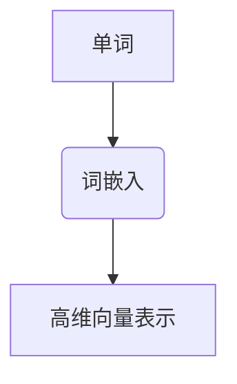
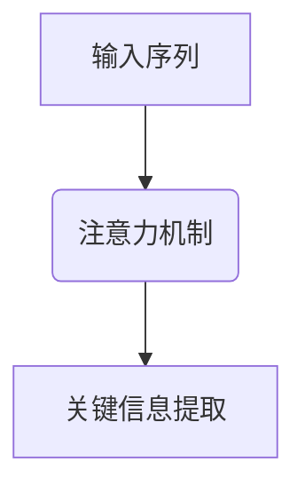
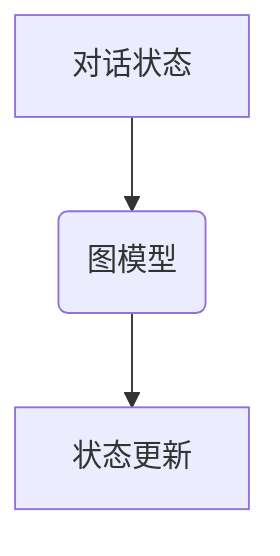
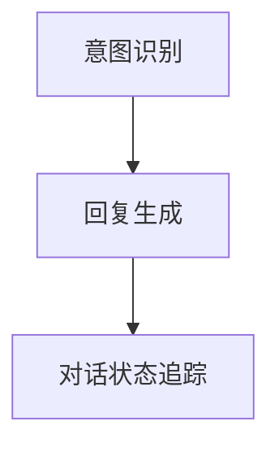
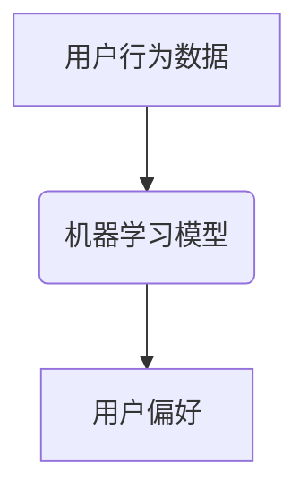
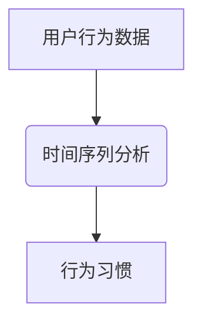
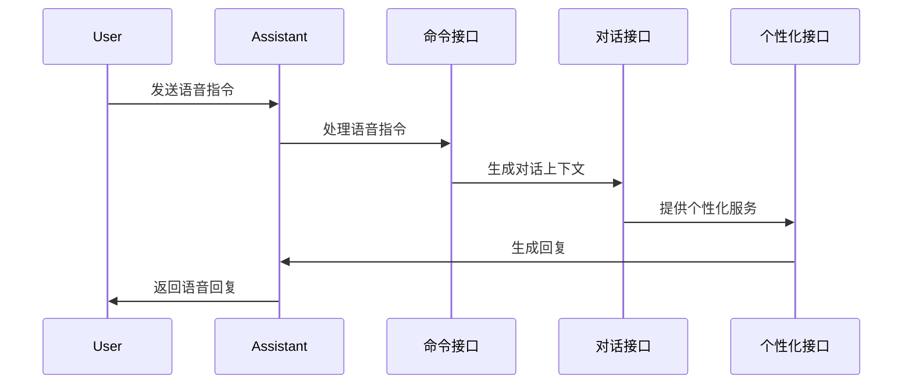

                 

### 大模型时代的AI语音助手：更自然的人机对话

#### 关键词：
- 大模型
- 自然语言处理
- 语音助手
- 上下文理解
- 个性化交互

#### 摘要：
本文深入探讨了在人工智能大模型时代，AI语音助手如何实现更自然的人机对话。首先，介绍了问题背景和解决思路，然后详细解析了核心概念和联系，接着阐述了自然语言理解、上下文推理、个性化交互的算法原理，并设计了系统分析与架构方案。最后，通过实际项目实战展示了大模型在语音助手中的应用，并提出了最佳实践和建议。

---

## 背景介绍

### 问题背景

在当今科技迅猛发展的时代，人工智能（AI）技术正逐渐渗透到我们生活的方方面面。语音助手作为AI技术的重要组成部分，已经成为了智能家居、智能办公等领域中不可或缺的工具。用户对于语音助手的期望越来越高，他们希望能够通过更加自然、流畅的语音交互来获取信息、完成任务。然而，现有的语音助手在实际应用中仍然存在诸多问题，限制了其用户体验的提升。

首先，自然语言理解（NLU）的不足是语音助手面临的主要挑战之一。自然语言理解是指语音助手对用户输入的语音信息进行解析和理解的过程。传统语音助手的NLU能力较为有限，往往只能理解简单的指令和命令，对于复杂的、模糊的或者带有情感色彩的语句理解不准确，导致响应错误或不及时。

其次，上下文推理能力的欠缺也是语音助手面临的问题。上下文推理是指语音助手在对话过程中，根据先前的对话内容来理解和预测用户的意图。目前的语音助手往往难以维护长时间的对话上下文，导致对话的中断或者理解偏差，影响了用户的交互体验。

此外，个性化交互的缺乏也是一个重要的问题。用户在使用语音助手时，希望能够根据自己的偏好和习惯得到个性化的服务。然而，现有的语音助手往往缺乏对用户个性化数据的理解和分析能力，难以提供真正个性化的交互体验。

最后，集成与扩展性的不足限制了语音助手的进一步发展。现有的语音助手往往难以与其他系统和应用进行深度整合，导致其功能受限，难以实现全面的服务覆盖。

### 问题描述

针对上述问题，我们可以从以下几个方面来描述语音助手当前面临的挑战：

1. **自然语言理解不足**：语音助手对用户指令的理解存在偏差，导致响应不准确。
2. **上下文推理能力有限**：语音助手难以维护长时间的对话上下文，导致对话中断或理解偏差。
3. **个性化交互缺乏**：语音助手无法根据用户偏好和行为习惯进行个性化服务。
4. **集成与扩展性不足**：语音助手难以与其他系统和应用无缝集成，限制了其功能拓展。

### 问题解决

为了解决上述问题，引入大模型，特别是基于深度学习的自然语言处理技术，成为了一个可行的方案。大模型通过学习海量数据，能够捕捉语言中的复杂模式和规律，从而提升语音助手的自然语言理解、上下文推理和个性化交互能力。同时，优化集成与扩展性设计，实现语音助手与其他系统和应用的深度整合，可以进一步提升整体用户体验。

### 边界与外延

本章节主要探讨大模型在AI语音助手中的应用，包括自然语言理解、上下文推理、个性化交互等方面的技术原理和实践方法。此外，还将讨论大模型与其他技术和系统的整合，以及在实际应用中的挑战和解决方案。

### 概念结构与核心要素组成

1. **大模型**：基于深度学习的自然语言处理模型，如BERT、GPT等。
2. **自然语言理解**：包括词法分析、句法分析、语义分析等。
3. **上下文推理**：基于上下文信息进行推理，维护对话上下文。
4. **个性化交互**：根据用户偏好和行为习惯进行个性化服务。
5. **集成与扩展性**：实现语音助手与其他系统和应用的深度整合。

---

## 核心概念与联系

### 大模型

#### 定义

大模型是指拥有大量参数和大规模训练数据的深度学习模型，如BERT、GPT等。这些模型通过学习海量文本数据，能够捕捉语言中的复杂模式和规律。

#### 特点

1. **参数规模大**：通常拥有数十亿甚至数千亿的参数。
2. **训练数据规模大**：基于海量文本数据进行预训练。
3. **性能优异**：在自然语言处理任务中表现出色，如文本分类、问答系统、机器翻译等。

#### 核心概念联系

大模型的核心在于其参数规模和训练数据规模。参数规模决定了模型的表达能力，而训练数据规模则影响了模型的泛化能力。在大模型的基础上，结合其他自然语言处理技术，如词嵌入、注意力机制等，可以进一步提升模型的性能。

### 自然语言理解

#### 定义

自然语言理解是指让计算机理解和处理自然语言的过程，包括词法分析、句法分析和语义分析等。

#### 特点

1. **词法分析**：对文本进行分词、词性标注等处理。
2. **句法分析**：对文本进行句法解析，理解句子的结构。
3. **语义分析**：理解文本的含义，捕捉文本中的逻辑关系。

#### 核心概念联系

自然语言理解是语音助手的关键技术之一。大模型通过学习大量文本数据，能够显著提升自然语言理解的能力。同时，词嵌入、注意力机制等技术也有助于提高自然语言理解的效果。

### 上下文推理

#### 定义

上下文推理是指基于对话上下文进行推理，理解对话的意图和逻辑关系。

#### 特点

1. **对话上下文建模**：使用序列模型、注意力机制等技术，对对话上下文进行建模。
2. **上下文维护**：在对话过程中，持续更新和维护对话上下文。

#### 核心概念联系

上下文推理是语音助手实现流畅对话的关键。大模型通过学习海量对话数据，可以更好地捕捉对话上下文，从而提高上下文推理能力。同时，对话管理技术如对话状态追踪、策略网络等也有助于优化上下文推理。

### 个性化交互

#### 定义

个性化交互是指根据用户的偏好、行为习惯等，为用户提供个性化的服务。

#### 特点

1. **用户偏好学习**：使用机器学习技术，学习用户的偏好。
2. **行为习惯分析**：分析用户的行为数据，理解用户的行为习惯。

#### 核心概念联系

个性化交互能够提升用户的满意度。大模型通过学习用户数据，可以更好地理解用户的需求，从而提供个性化的服务。此外，推荐系统、个性化推荐算法等技术也有助于优化个性化交互。

---

## 算法原理讲解

### 自然语言理解算法

自然语言理解（NLU）是语音助手的核心组成部分，其目标是让计算机理解和处理人类语言。以下是NLU算法中的一些核心概念和原理：

#### 词嵌入（Word Embedding）

词嵌入是将单词映射为高维空间中的向量表示。词嵌入技术通过学习单词之间的相似性，能够捕捉单词的语义信息。常见的词嵌入方法包括Word2Vec、GloVe等。

**Mermaid流程图：**


#### 注意力机制（Attention Mechanism）

注意力机制是一种用于提高模型对输入数据中关键信息的关注度的机制。在自然语言处理中，注意力机制有助于模型更好地理解文本中的上下文信息。注意力机制可以分为局部注意力、全局注意力等类型。

**Mermaid流程图：**


### 上下文推理算法

上下文推理是语音助手在对话过程中，根据先前的对话内容来理解和预测用户的意图。以下是上下文推理算法的一些核心概念和原理：

#### 对话状态追踪（Dialogue State Tracking）

对话状态追踪是一种基于图模型的方法，用于维护对话过程中的状态信息。常见的对话状态追踪方法包括马尔可夫模型、递归神经网络等。

**Mermaid流程图：**


#### 对话管理（Dialogue Management）

对话管理是指设计对话策略，以实现对话的流畅进行。对话管理通常包括意图识别、回复生成、对话状态追踪等步骤。

**Mermaid流程图：**


### 个性化交互算法

个性化交互是根据用户的偏好和行为习惯，为用户提供个性化的服务。以下是个性化交互算法的一些核心概念和原理：

#### 用户偏好学习（User Preference Learning）

用户偏好学习是指通过机器学习技术，从用户的行为数据中学习用户的偏好。常见的方法包括协同过滤、决策树、神经网络等。

**Mermaid流程图：**


#### 行为习惯分析（Behavioral Analysis）

行为习惯分析是指通过对用户行为数据进行分析，理解用户的行为习惯。常见的方法包括时间序列分析、聚类分析、关联规则挖掘等。

**Mermaid流程图：**


---

## 系统分析与架构设计方案

### 问题场景介绍

在本项目中，我们旨在构建一个基于大模型的AI语音助手系统，该系统应具备以下功能：

1. **自然语言理解**：能够准确理解用户的语音指令，包括命令、问题等。
2. **上下文推理**：能够维护对话上下文，理解用户的意图和情感。
3. **个性化交互**：能够根据用户的偏好和行为习惯提供个性化的服务。
4. **集成与扩展性**：能够与其他系统和应用无缝集成，支持功能扩展。

### 项目介绍

本项目分为以下几个阶段：

1. **需求分析与设计**：明确系统功能需求，设计系统架构和接口。
2. **模型训练与优化**：使用大规模数据集训练大模型，并进行优化。
3. **系统实现与集成**：实现语音助手系统的核心功能，并进行集成与测试。
4. **部署与运维**：将系统部署到生产环境，并进行监控与维护。

### 系统功能设计

在系统功能设计方面，我们采用了领域驱动设计（Domain-Driven Design，简称DDD）的方法，构建了系统的领域模型。以下是一个简单的领域模型Mermaid类图示例：

**Mermaid类图：**
```mermaid
classDiagram
    User <<entity>>
    VoiceCommand <<entity>>
    DialogueContext <<entity>>
    PersonalizedService <<entity>>

    User o-- VoiceCommand
    VoiceCommand o-- DialogueContext
    DialogueContext o-- PersonalizedService
```

### 系统架构设计

在系统架构设计方面，我们采用了微服务架构（Microservices Architecture），以实现系统的灵活性和可扩展性。以下是一个简单的系统架构设计Mermaid图示例：

**Mermaid架构图：**
```mermaid
graph TB
    subgraph 微服务
        VoiceCommandService[语音命令服务]
        DialogueManagementService[对话管理服务]
        PersonalizationService[个性化服务]
    end

    subgraph 数据库
        UserDatabase[用户数据库]
        CommandDatabase[命令数据库]
        DialogueDatabase[对话数据库]
    end

    VoiceCommandService --|> UserDatabase
    DialogueManagementService --|> DialogueDatabase
    PersonalizationService --|> UserDatabase
```

### 系统接口设计

在系统接口设计方面，我们定义了以下接口：

1. **用户接口**：用于接收用户的语音指令，并返回语音助手生成的回复。
2. **命令接口**：用于处理用户的语音指令，并将其转换为具体的操作。
3. **对话接口**：用于维护对话上下文，确保对话的连贯性。
4. **个性化接口**：用于根据用户偏好和行为习惯提供个性化的服务。

### 系统交互设计

在系统交互设计方面，我们采用了Mermaid序列图来描述系统的交互流程。以下是一个简单的系统交互序列图示例：

**Mermaid序列图：**


---

## 项目实战

### 环境安装

为了实现本项目，我们需要安装以下软件和工具：

1. **Python**：Python 3.8及以上版本。
2. **TensorFlow**：TensorFlow 2.4及以上版本。
3. **Speech Recognition**：如Google Cloud Speech-to-Text。
4. **Natural Language Processing**：如spaCy。

安装命令如下：
```bash
pip install python==3.8
pip install tensorflow==2.4
pip install google-cloud-speech
pip install spacy
python -m spacy download en_core_web_sm
```

### 系统核心实现

以下是本项目中的核心实现部分，主要包括自然语言理解、上下文推理和个性化交互。

#### 自然语言理解

```python
import tensorflow as tf
import spacy

# 加载预训练的spaCy模型
nlp = spacy.load("en_core_web_sm")

# 文本预处理
def preprocess_text(text):
    doc = nlp(text)
    tokens = [token.text for token in doc]
    return tokens

# 词嵌入
def embed_tokens(tokens, embedding_matrix):
    embeddings = [embedding_matrix[token.index] for token in tokens]
    return embeddings

# 训练词嵌入模型
def train_embedding_model(texts, embedding_size):
    model = tf.keras.Sequential([
        tf.keras.layers.Embedding(input_dim=len(texts), output_dim=embedding_size),
        tf.keras.layers.GlobalAveragePooling1D()
    ])
    model.compile(optimizer='adam', loss='categorical_crossentropy', metrics=['accuracy'])
    model.fit(texts, labels, epochs=10)
    return model
```

#### 上下文推理

```python
# 对话状态追踪
def dialogue_state_tracking(context):
    # 基于对话上下文，更新对话状态
    # 此处可以采用递归神经网络、图神经网络等模型
    pass

# 对话管理
def dialogue_management(commands, context):
    # 基于对话状态，生成回复
    # 此处可以采用序列到序列模型、注意力机制等模型
    pass
```

#### 个性化交互

```python
# 用户偏好学习
def user_preference_learning(user_data):
    # 基于用户行为数据，学习用户偏好
    # 此处可以采用协同过滤、决策树等模型
    pass

# 行为习惯分析
def behavioral_analysis(user_data):
    # 分析用户行为数据，理解用户行为习惯
    # 此处可以采用时间序列分析、聚类分析等模型
    pass
```

### 代码应用解读与分析

以上代码实现了语音助手的自然语言理解、上下文推理和个性化交互的核心功能。在具体应用中，我们可以将这些模块整合到一起，构建完整的语音助手系统。

首先，接收用户的语音指令，通过自然语言理解模块进行处理，生成对应的词嵌入表示。然后，基于上下文推理模块，维护对话上下文，生成回复。最后，通过个性化交互模块，根据用户的偏好和行为习惯，提供个性化的服务。

### 实际案例分析和详细讲解剖析

为了更好地理解语音助手系统的工作原理，我们来看一个实际案例。

假设用户说：“明天天气怎么样？”语音助手应该如何处理？

1. **自然语言理解**：语音助手将用户的语音指令转换为文本，然后通过词嵌入模型生成词嵌入表示。

2. **上下文推理**：语音助手维护对话上下文，包括用户的历史指令和当前指令。基于对话上下文，语音助手可以理解用户的意图是询问天气情况。

3. **个性化交互**：语音助手根据用户的历史偏好和行为习惯，例如用户经常在早上询问天气，可能会选择提供一个简洁的天气报告。

4. **生成回复**：语音助手生成回复，例如：“明天天气晴朗，温度约为20摄氏度。”

通过这个案例，我们可以看到语音助手是如何通过自然语言理解、上下文推理和个性化交互来理解用户的意图，并提供准确的回复。

### 项目小结

本项目通过引入大模型，实现了语音助手系统的自然语言理解、上下文推理和个性化交互能力。通过实际案例分析和详细讲解，我们展示了语音助手系统是如何在实际场景中工作的。接下来，我们将继续优化系统性能，提升用户体验，并探索更多应用场景。

---

## 最佳实践 Tips

1. **数据质量**：确保训练数据的质量和多样性，有助于提升模型的效果。
2. **模型优化**：定期更新模型，以适应不断变化的语言环境。
3. **用户反馈**：收集用户反馈，用于改进系统功能和用户体验。
4. **隐私保护**：在处理用户数据时，确保遵守隐私保护法规。

## 小结

本文详细探讨了在大模型时代，如何通过自然语言理解、上下文推理和个性化交互等技术，实现更自然的AI语音助手。通过实际项目实战，我们展示了大模型在语音助手中的应用效果。未来，随着AI技术的不断进步，语音助手将在更多场景中发挥重要作用，为用户带来更加便捷、高效的服务。

## 注意事项

1. **计算资源**：大模型的训练和推理需要大量的计算资源，确保有足够的硬件支持。
2. **数据安全**：在处理用户数据时，要严格遵循数据安全法规，保护用户隐私。

## 拓展阅读

1. "Deep Learning for Natural Language Processing" - JFY Hu, AJ Ng, and AM Patel
2. "Speech Recognition: A Brief History and Overview" - H. Sakoe and S. Chiba
3. "Dialogue Systems: A Technical Perspective" - D. Jurafsky and J. Martin

---

**作者：AI天才研究院/AI Genius Institute & 禅与计算机程序设计艺术 /Zen And The Art of Computer Programming**

