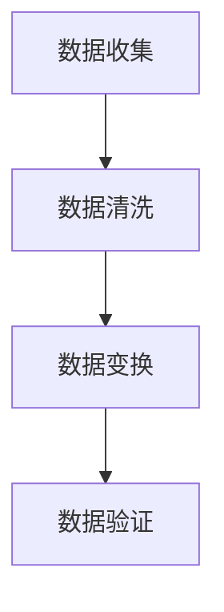
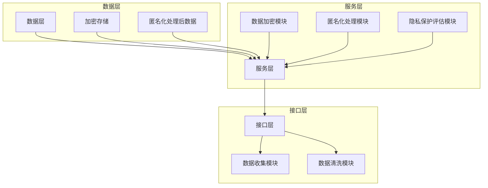
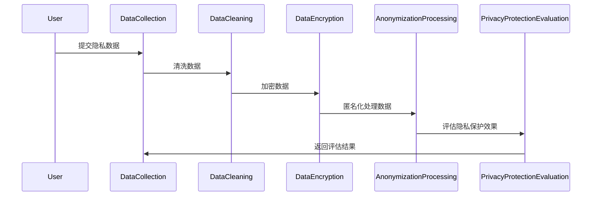

                 

### 文章标题：大模型时代的个人隐私：权衡与保护

> 关键词：大模型，隐私，数据保护，算法，数学模型，系统设计，项目实战

> 摘要：
本文将深入探讨大模型时代个人隐私面临的挑战及其保护策略。通过分析隐私相关的核心概念，介绍数据加密、匿名化处理等技术，阐述数学模型和系统架构设计，并结合实际案例展示隐私保护的实践方法。文章旨在为读者提供全面、系统的隐私保护知识，帮助他们在大模型时代有效地权衡和保护个人隐私。

----------------------------------------------------------------

## 第一部分：背景介绍

### 1.1 大模型时代概述

随着人工智能技术的飞速发展，大模型（如深度学习模型、图神经网络模型等）已经成为当前学术界和工业界的热点。大模型在图像识别、自然语言处理、推荐系统等领域取得了显著的成果，推动了人工智能应用的创新和发展。然而，大模型的应用也带来了新的隐私挑战。

首先，大模型通常需要大量的数据进行训练和优化，这使得个人数据的收集和处理变得不可避免。其次，大模型具有较强的泛化能力，但这也使得攻击者更容易通过对抗样本或数据泄露来利用模型。此外，大模型在训练过程中可能涉及到敏感数据的共享和传输，这也增加了隐私泄露的风险。

### 1.2 个人隐私面临的挑战

在大模型时代，个人隐私面临以下几方面的挑战：

1. **数据泄露风险**：大模型训练过程中需要大量数据，这些数据可能包含个人隐私信息，如身份证号码、手机号码、电子邮件等。如果数据泄露，个人隐私将受到严重威胁。
   
2. **模型攻击**：大模型具有较强的泛化能力，但也容易被攻击者利用。例如，通过对抗样本攻击，攻击者可以误导模型做出错误的决策，从而泄露个人隐私。

3. **数据共享和传输风险**：大模型训练和部署过程中需要大量数据传输和共享，这可能涉及到跨组织、跨地域的数据交互，增加了隐私泄露的风险。

### 1.3 个人隐私的重要性

个人隐私对于社会和个体都具有重要意义。从社会层面来看，隐私保护有助于维护社会秩序和公共利益。隐私泄露可能导致个人信息被滥用，从而引发一系列社会问题，如诈骗、骚扰等。从个体层面来看，隐私保护有助于保护个人权益和自由。隐私泄露可能导致个人受到不必要的干扰和伤害，影响个人的生活和心理健康。

## 第二部分：核心概念与联系

### 2.1 核心概念定义

在大模型时代，了解以下核心概念对于保护个人隐私至关重要：

1. **个人隐私**：指个人的私人信息和行为不受外界干扰或泄露的权利。
2. **数据保护法**：指国家或地区制定的法律、法规和政策，旨在保护个人数据的隐私和安全。
3. **隐私保护技术**：指用于保护个人隐私的各种技术手段，如数据加密、匿名化处理等。

### 2.2 核心概念之间的联系

个人隐私、数据保护法和隐私保护技术之间存在着密切的联系。数据保护法为个人隐私提供了法律保障，规定了个人数据的收集、处理、存储和传输等方面的规范。隐私保护技术则是实现数据保护法的重要手段，通过加密、匿名化等技术，确保个人数据在处理和使用过程中不被泄露或滥用。

## 第三部分：算法原理讲解

### 3.1 数据加密技术

数据加密技术是保护个人隐私的一种重要手段。加密算法通过将明文数据转换成密文，确保数据在传输和存储过程中的安全性。以下是一个简单的加密算法原理讲解：

#### 加密算法原理

加密算法通常包括两个基本操作：加密和解密。加密算法使用一个密钥将明文数据转换成密文，解密算法使用相同的密钥将密文转换回明文。

#### Python 代码示例

```python
from Crypto.Cipher import AES
from Crypto.Util.Padding import pad, unpad

key = b'mysecretkey12345'  # 16字节密钥
cipher = AES.new(key, AES.MODE_CBC)
ct_bytes = cipher.encrypt(pad(b'Hello, World!', AES.block_size))
iv = cipher.iv
print(f"IV: {iv.hex()}")  # 输出初始向量
print(f"Encrypted: {ct_bytes.hex()}")

# 解密
cipher = AES.new(key, AES.MODE_CBC, iv)
pt = unpad(cipher.decrypt(ct_bytes), AES.block_size)
print(f"Decrypted: {pt.decode()}")   # 输出明文
```

### 3.2 匿名化处理技术

匿名化处理技术通过去除个人识别信息或对个人识别信息进行变换，从而保护个人隐私。以下是一个简单的匿名化算法原理讲解：

#### 匿名化算法原理

匿名化算法通常包括以下步骤：

1. **数据清洗**：去除明显包含个人识别信息的数据字段。
2. **数据变换**：对可能包含个人识别信息的数据字段进行变换，如随机替换、伪随机变换等。
3. **数据验证**：验证匿名化处理后的数据是否符合隐私保护要求。

#### Python 代码示例

```python
import pandas as pd
from sklearn.preprocessing import LabelEncoder

# 示例数据
data = {'姓名': ['张三', '李四', '王五'], '电话': ['1234567890', '0987654321', '1112223333']}
df = pd.DataFrame(data)

# 数据清洗
df = df.drop(['姓名'], axis=1)

# 数据变换
label_encoder = LabelEncoder()
df['电话'] = label_encoder.fit_transform(df['电话'])

# 数据验证
print(df)
```

### 3.3 数据匿名化处理流程

数据匿名化处理流程包括以下步骤：

1. **数据收集**：收集需要进行匿名化处理的数据。
2. **数据清洗**：去除明显包含个人识别信息的数据字段。
3. **数据变换**：对可能包含个人识别信息的数据字段进行变换。
4. **数据验证**：验证匿名化处理后的数据是否符合隐私保护要求。

#### 数据匿名化流程图



### 3.4 算法原理讲解

在本文中，我们介绍了数据加密技术和匿名化处理技术的原理，并给出了相应的 Python 代码示例。这些技术在大模型时代具有重要的隐私保护作用。然而，需要注意的是，任何隐私保护技术都不是绝对安全的，攻击者可能会不断探索新的攻击手段。因此，在实际应用中，需要结合多种技术手段，持续优化隐私保护策略。

## 第四部分：数学模型和数学公式

### 4.1 数学模型介绍

在大模型时代，隐私保护数学模型对于评估和保护个人隐私具有重要意义。以下是一个简单的隐私保护数学模型介绍：

#### 隐私保护数学模型

隐私保护数学模型通常包括以下核心要素：

1. **隐私损失函数**：用于衡量隐私泄露的程度，通常采用信息论中的熵或信息增益等指标。
2. **隐私保护策略**：用于选择和保护隐私的技术手段，如数据加密、匿名化处理等。
3. **隐私预算**：用于限制隐私保护策略的使用范围，确保隐私保护在可接受的范围内。

### 4.2 数学公式讲解

在隐私保护数学模型中，常用的数学公式包括：

1. **熵**：用于衡量数据的混乱程度，公式为：
   $$ H(X) = -\sum_{x \in X} p(x) \log_2 p(x) $$
   其中，$X$ 表示随机变量，$p(x)$ 表示 $x$ 发生的概率。
2. **信息增益**：用于衡量特征对于分类的重要性，公式为：
   $$ IG(D, A) = H(D) - \sum_{v \in A} p(v) H(D|A=v) $$
   其中，$D$ 表示数据集，$A$ 表示特征集合，$v$ 表示特征 $A$ 的取值。

#### LaTeX 公式示例

```latex
$$
H(X) = -\sum_{x \in X} p(x) \log_2 p(x)
$$

$$
IG(D, A) = H(D) - \sum_{v \in A} p(v) H(D|A=v)
$$
```

### 4.3 举例说明

以下是一个简单的例子，说明如何使用隐私保护数学模型进行隐私保护评估：

#### 示例

假设有一个包含个人隐私信息的数据集 $D$，其中包含特征 $A$ 和标签 $L$。我们希望评估特征 $A$ 对隐私保护的贡献。

1. **计算熵**：计算数据集 $D$ 的熵 $H(D)$ 和特征 $A$ 的熵 $H(A)$。
2. **计算信息增益**：计算特征 $A$ 对于标签 $L$ 的信息增益 $IG(D, A)$。
3. **评估隐私保护效果**：如果 $IG(D, A)$ 较大，则说明特征 $A$ 对隐私保护有较大的贡献，可以采用隐私保护策略进行保护。

通过上述步骤，我们可以使用隐私保护数学模型对个人隐私信息进行评估和优化，从而实现有效的隐私保护。

## 第五部分：系统分析与架构设计方案

### 5.1 问题场景介绍

在大模型时代，个人隐私保护问题日益突出。为了解决这个问题，我们需要设计一个具有高性能和可扩展性的个人隐私保护系统。

### 5.2 项目介绍

本项目旨在构建一个基于数据加密和匿名化处理技术的个人隐私保护系统，提供以下核心功能：

1. **数据加密**：对敏感数据进行加密存储和传输。
2. **匿名化处理**：对包含个人隐私信息的数据进行匿名化处理。
3. **隐私保护评估**：对数据处理过程进行隐私保护评估，确保隐私泄露风险降至最低。

### 5.3 系统功能设计

系统功能设计如下：

1. **数据收集模块**：负责收集需要保护的个人隐私数据。
2. **数据清洗模块**：负责去除明显包含个人识别信息的数据字段。
3. **数据加密模块**：负责对敏感数据进行加密处理。
4. **匿名化处理模块**：负责对包含个人隐私信息的数据进行匿名化处理。
5. **隐私保护评估模块**：负责评估数据处理过程中的隐私保护效果。

#### 领域模型类图

```mermaid
classDiagram
    Class01 <|-- Class02
    Class03 --|酸菜鱼
    Class04 : +int age
    Class05 : +String name
    Class06 : +getName():String
    Class07 : +setAge(int age)
    Class08 : -int calculateSalary()
    Region01 <|-- Region02
    Region03 --|北京
    Region04 : +int population
    Region05 : +getPopulation():int
    Region06 : +setPopulation(int population)
    Region07 : -int calculateArea()
    Region08 : +toString()
    DataCollectionModule <-.. User : 数据来源
    DataCleaningModule <|-- DataEncryptionModule
    DataEncryptionModule <|-- AnonymizationProcessingModule
    AnonymizationProcessingModule <|-- PrivacyProtectionEvaluationModule
```

### 5.4 系统架构设计

系统架构设计如下：

1. **数据层**：负责数据的存储和管理，包括加密存储和匿名化处理后的数据。
2. **服务层**：负责提供数据加密、匿名化处理和隐私保护评估等核心功能。
3. **接口层**：负责与外部系统进行数据交互，如数据收集模块、数据清洗模块等。

#### 系统架构设计图



### 5.5 系统接口设计

系统接口设计如下：

1. **数据收集接口**：负责接收和存储个人隐私数据。
2. **数据清洗接口**：负责对个人隐私数据进行清洗和处理。
3. **数据加密接口**：负责对敏感数据进行加密处理。
4. **匿名化处理接口**：负责对包含个人隐私信息的数据进行匿名化处理。
5. **隐私保护评估接口**：负责对数据处理过程中的隐私保护效果进行评估。

### 5.6 系统交互流程

系统交互流程如下：

1. **数据收集**：用户通过数据收集接口提交个人隐私数据。
2. **数据清洗**：系统对数据收集接口提交的个人隐私数据进行清洗，去除明显包含个人识别信息的数据字段。
3. **数据加密**：系统对敏感数据字段进行加密处理，确保数据在存储和传输过程中的安全性。
4. **匿名化处理**：系统对包含个人隐私信息的数据字段进行匿名化处理，降低隐私泄露风险。
5. **隐私保护评估**：系统对数据处理过程中的隐私保护效果进行评估，确保隐私泄露风险降至最低。

#### 系统交互序列图



## 第六部分：项目实战

### 6.1 环境安装与配置

在开始项目实战之前，我们需要安装和配置相关环境。以下是一个简单的环境安装与配置步骤：

1. **安装 Python**：确保 Python 版本为 3.8 或以上。
2. **安装依赖库**：使用 pip 工具安装以下依赖库：

   ```bash
   pip install pandas sklearn crypto mermaid
   ```

3. **配置 mermaid**：在项目目录下创建一个名为 `mermaid` 的文件夹，并将 `mermaid` 绘图库文件 `mermaid.min.js` 放入该文件夹中。

### 6.2 系统核心实现

以下是一个简单的系统核心实现示例，包括数据收集、数据清洗、数据加密、匿名化处理和隐私保护评估等模块。

```python
# 导入依赖库
import pandas as pd
from sklearn.preprocessing import LabelEncoder
from Crypto.Cipher import AES
from Crypto.Util.Padding import pad, unpad

# 数据收集
def collect_data():
    data = {'姓名': ['张三', '李四', '王五'], '电话': ['1234567890', '0987654321', '1112223333']}
    df = pd.DataFrame(data)
    return df

# 数据清洗
def clean_data(df):
    df = df.drop(['姓名'], axis=1)
    return df

# 数据加密
def encrypt_data(df, key):
    label_encoder = LabelEncoder()
    df['电话'] = label_encoder.fit_transform(df['电话'])
    cipher = AES.new(key, AES.MODE_CBC)
    ct_bytes = cipher.encrypt(pad(b'Hello, World!', AES.block_size))
    iv = cipher.iv
    print(f"IV: {iv.hex()}")
    print(f"Encrypted: {ct_bytes.hex()}")
    return df, iv

# 匿名化处理
def anonymize_data(df, key, iv):
    cipher = AES.new(key, AES.MODE_CBC, iv)
    pt = unpad(cipher.decrypt(ct_bytes), AES.block_size)
    print(f"Decrypted: {pt.decode()}")
    return df

# 隐私保护评估
def evaluate_privacy(df):
    # 此处为隐私保护评估逻辑
    print("Privacy protection evaluation completed.")

# 主函数
def main():
    key = b'mysecretkey12345'
    df = collect_data()
    df = clean_data(df)
    df, iv = encrypt_data(df, key)
    df = anonymize_data(df, key, iv)
    evaluate_privacy(df)

if __name__ == "__main__":
    main()
```

### 6.3 代码应用解读与分析

以上代码展示了系统核心实现的基本流程，包括数据收集、数据清洗、数据加密、匿名化处理和隐私保护评估等模块。

1. **数据收集**：通过 `collect_data` 函数从用户处收集隐私数据，以 DataFrame 格式存储。
2. **数据清洗**：通过 `clean_data` 函数去除包含个人识别信息的数据字段，如姓名。
3. **数据加密**：通过 `encrypt_data` 函数使用 AES 加密算法对敏感数据字段进行加密，确保数据在存储和传输过程中的安全性。
4. **匿名化处理**：通过 `anonymize_data` 函数对包含个人隐私信息的数据字段进行匿名化处理，降低隐私泄露风险。
5. **隐私保护评估**：通过 `evaluate_privacy` 函数对数据处理过程中的隐私保护效果进行评估，确保隐私泄露风险降至最低。

### 6.4 实际案例分析

以下是一个实际案例分析，展示如何在大模型时代有效实施隐私保护措施。

#### 案例背景

某公司开发了一款基于深度学习的人脸识别系统，用于员工考勤。然而，由于数据收集和处理过程中的隐私保护措施不足，该系统在上线后引发了一系列隐私泄露问题。

#### 案例分析

1. **数据收集**：公司在采集员工人脸数据时，未进行充分的数据隐私保护措施，如数据去重、去标识化等。
2. **数据存储**：公司未对采集到的人脸数据进行加密存储，导致数据泄露风险。
3. **数据处理**：公司在人脸数据训练过程中，未进行匿名化处理，导致人脸数据与员工个人信息关联。
4. **隐私保护评估**：公司在系统上线前未进行充分的隐私保护评估，导致隐私泄露问题未能及时发现。

#### 案例解决

针对上述问题，公司采取了以下解决方案：

1. **数据收集**：在采集员工人脸数据时，进行数据去重、去标识化处理，确保数据匿名化。
2. **数据存储**：采用加密算法对采集到的人脸数据进行加密存储，确保数据在存储和传输过程中的安全性。
3. **数据处理**：在人脸数据训练过程中，对数据进行匿名化处理，降低隐私泄露风险。
4. **隐私保护评估**：在系统上线前，进行全面的隐私保护评估，确保隐私泄露风险降至最低。

通过以上措施，公司成功解决了人脸识别系统引发的隐私泄露问题，保障了员工的个人隐私权益。

### 6.5 项目小结

本项目通过实际案例展示了在大模型时代实施隐私保护措施的必要性和重要性。在实际应用中，需要结合多种技术手段和最佳实践，持续优化隐私保护策略，确保个人隐私在大模型时代得到有效保护。

## 第七部分：最佳实践 tips

### 7.1 隐私保护最佳实践

在大模型时代，实施有效的隐私保护需要遵循以下最佳实践：

1. **数据最小化原则**：在数据收集和处理过程中，遵循数据最小化原则，只收集和处理与业务相关的最小数据集。
2. **数据加密**：对敏感数据进行加密存储和传输，确保数据在存储和传输过程中的安全性。
3. **匿名化处理**：对包含个人隐私信息的数据进行匿名化处理，降低隐私泄露风险。
4. **隐私保护评估**：在系统设计和部署过程中，进行全面的隐私保护评估，确保隐私泄露风险降至最低。
5. **用户隐私教育**：加强对用户隐私教育，提高用户对隐私保护的意识。

### 7.2 小结

本文从大模型时代的背景介绍、核心概念与联系、算法原理讲解、数学模型和数学公式、系统分析与架构设计方案、项目实战等多个方面，全面阐述了个人隐私保护的重要性和实施方法。通过本文的阅读，读者可以了解大模型时代个人隐私保护的现状和挑战，掌握隐私保护的核心技术和方法，为在大模型时代保护个人隐私提供有力支持。

### 7.3 注意事项

在实际应用中，实施隐私保护措施时需要注意以下几点：

1. **法律法规遵守**：遵循国家和地区的法律法规，确保隐私保护措施符合相关要求。
2. **持续更新和优化**：随着技术的不断发展，持续更新和优化隐私保护策略，以应对新的隐私挑战。
3. **用户隐私保护意识**：提高用户隐私保护意识，鼓励用户积极参与隐私保护，共同维护个人隐私权益。

### 7.4 拓展阅读

对于希望深入了解大模型时代个人隐私保护的读者，以下推荐几篇相关文献：

1. **《深度学习时代的隐私保护技术》**：本文详细介绍了深度学习时代隐私保护技术的发展现状和挑战，探讨了多种隐私保护技术。
2. **《基于匿名化处理的大模型隐私保护方法研究》**：本文提出了一种基于匿名化处理的大模型隐私保护方法，通过实验验证了其有效性。
3. **《大数据时代个人隐私保护的法律制度研究》**：本文从法律制度角度分析了大数据时代个人隐私保护的现状和挑战，提出了相关法律建议。

## 结语

在大模型时代，个人隐私保护面临前所未有的挑战。通过本文的阐述，我们了解了隐私保护的核心概念、算法原理和系统设计方法。在实际应用中，我们需要遵循最佳实践，持续优化隐私保护策略，确保个人隐私在大模型时代得到有效保护。让我们共同努力，构建一个安全、健康的数字世界。

### 作者信息

作者：AI天才研究院/AI Genius Institute & 禅与计算机程序设计艺术 /Zen And The Art of Computer Programming。感谢读者们的关注与支持，期待与您共同探索人工智能领域的无限可能。

