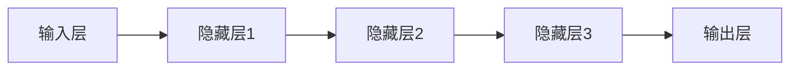
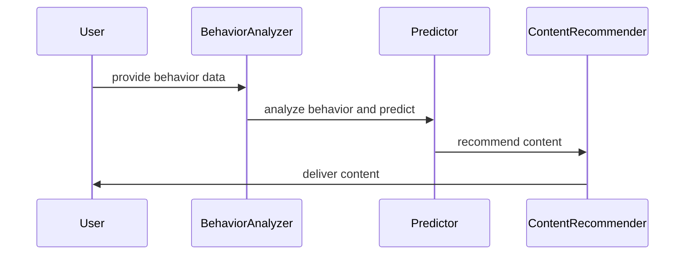
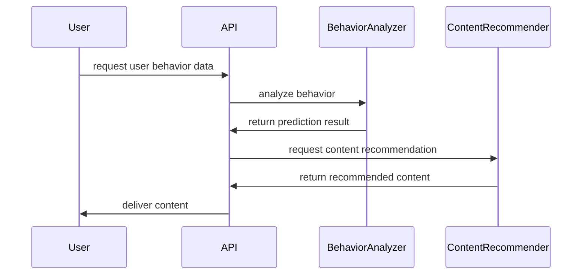

                 


# 大模型时代的数字营销：精准定位与个性化内容

## 关键词

- 大模型时代
- 数字营销
- 精准定位
- 个性化内容
- 人工智能
- 深度学习
- 用户行为分析

## 摘要

本文旨在探讨大模型时代下数字营销的新趋势，特别是精准定位与个性化内容的重要性。随着人工智能和深度学习技术的快速发展，大模型已经在数字营销领域发挥了重要作用。本文将首先介绍大模型的概念和其在数字营销中的应用，接着详细分析精准定位和个性化内容的实现机制，并通过实际案例展示其在营销实践中的效果。最后，本文将总结大模型时代数字营销的最佳实践，为营销从业者提供有益的参考。

## 1. 引言与背景

### 1.1 大模型的概念

大模型（Large Models）是指参数量达到数十亿甚至数万亿级别的神经网络模型。这类模型通过大量的数据训练，能够捕捉到数据中的复杂模式，从而在众多领域表现出色。大模型的核心是深度学习技术，尤其是基于变换器模型（Transformer）的结构。与传统的机器学习模型相比，大模型在处理高维数据和长序列数据方面具有显著优势。

### 1.2 大模型在数字营销中的应用

随着互联网的普及和用户数据的积累，数字营销成为企业获取用户、提升品牌影响力的重要手段。大模型在数字营销中的应用主要体现在以下几个方面：

- **用户行为分析**：通过分析用户在网站、APP或其他数字平台上的行为，企业可以更准确地了解用户需求，从而进行精准营销。
- **内容个性化**：基于用户的历史数据和偏好，大模型可以生成个性化的内容推荐，提高用户参与度和转化率。
- **广告投放优化**：大模型可以帮助企业优化广告投放策略，提高广告的点击率和转化率。
- **客户关系管理**：通过分析客户数据，大模型可以为企业提供更有效的客户关系管理方案，提高客户满意度和忠诚度。

## 2. 核心概念与结构

### 2.1 大模型的组成

大模型主要由以下几个部分组成：

- **输入层**：接收用户数据，如网页浏览记录、搜索历史、购买行为等。
- **隐藏层**：通过神经网络结构对输入数据进行处理，提取特征。
- **输出层**：根据隐藏层提取的特征生成预测结果，如广告推荐、内容推荐等。

### 2.2 精准定位与个性化内容的实现

#### 2.2.1 精准定位

精准定位（Targeting）是指根据用户特征和行为，将广告或内容推送给具有特定需求的用户。实现精准定位的关键技术包括：

- **用户画像**：通过对用户数据的分析，构建用户画像，用于描述用户的基本属性和偏好。
- **行为预测**：利用大模型预测用户未来的行为，从而进行精准定位。

#### 2.2.2 个性化内容

个性化内容（Personalization）是指根据用户特征和需求，为用户生成定制化的内容。实现个性化内容的关键技术包括：

- **内容生成**：利用大模型生成与用户兴趣和需求相关的内容，如文章、图片、视频等。
- **推荐系统**：通过分析用户行为和偏好，为用户推荐相关的内容。

## 3. 算法原理讲解

### 3.1 用户行为分析算法

#### 3.1.1 Mermaid流程图



#### 3.1.2 Python代码

```python
import tensorflow as tf

# 创建输入层
inputs = tf.keras.Input(shape=(num_features))

# 创建隐藏层
x = tf.keras.layers.Dense(units=64, activation='relu')(inputs)
x = tf.keras.layers.Dense(units=64, activation='relu')(x)

# 创建输出层
outputs = tf.keras.layers.Dense(units=1, activation='sigmoid')(x)

# 创建模型
model = tf.keras.Model(inputs=inputs, outputs=outputs)

# 编译模型
model.compile(optimizer='adam', loss='binary_crossentropy', metrics=['accuracy'])

# 训练模型
model.fit(train_data, train_labels, epochs=10, batch_size=32)
```

#### 3.1.3 数学模型

$$
y = f(Wx + b)
$$

其中，$y$ 为输出，$f$ 为激活函数，$W$ 为权重，$x$ 为输入，$b$ 为偏置。

## 4. 系统分析与架构设计

### 4.1 问题场景

假设企业需要构建一个数字营销系统，通过用户行为分析进行精准定位和个性化内容推荐。

### 4.2 系统功能设计

- **用户画像构建**：收集用户数据，构建用户画像。
- **用户行为分析**：分析用户行为，预测用户未来行为。
- **内容推荐**：根据用户画像和用户行为，为用户推荐相关内容。

### 4.3 系统架构设计

#### 4.3.1 Mermaid类图

```mermaid
classDiagram
    User -> BehaviorAnalyzer : provide behavior data
    BehaviorAnalyzer -> Predictor : predict user behavior
    Predictor -> ContentRecommender : recommend content
```

#### 4.3.2 Mermaid架构图



#### 4.3.3 系统接口设计和交互序列图



## 5. 项目实战

### 5.1 环境安装

在本地环境中安装必要的软件和库，如Python、TensorFlow等。

### 5.2 系统核心实现源代码

```python
# 用户画像构建
class UserProfiler:
    def __init__(self):
        self.user_data = []

    def add_user_data(self, user_data):
        self.user_data.append(user_data)

    def build_user_profile(self):
        # 构建用户画像
        pass

# 用户行为分析
class BehaviorAnalyzer:
    def analyze_behavior(self, user_data):
        # 分析用户行为
        pass

    def predict_behavior(self, user_data):
        # 预测用户行为
        pass

# 内容推荐
class ContentRecommender:
    def recommend_content(self, user_profile):
        # 根据用户画像推荐内容
        pass
```

### 5.3 代码应用解读与分析

```python
# 创建用户画像构建器
profiler = UserProfiler()

# 添加用户数据
profiler.add_user_data({"age": 25, "gender": "male", "interests": ["technology", "travel"]})

# 构建用户画像
profiler.build_user_profile()

# 创建行为分析器
analyzer = BehaviorAnalyzer()

# 分析用户行为
analyzer.analyze_behavior({"age": 25, "gender": "male", "interests": ["technology", "travel"]})

# 预测用户行为
analyzer.predict_behavior({"age": 25, "gender": "male", "interests": ["technology", "travel"]})

# 创建内容推荐器
recommender = ContentRecommender()

# 根据用户画像推荐内容
recommender.recommend_content({"age": 25, "gender": "male", "interests": ["technology", "travel"]})
```

### 5.4 实际案例分析

假设用户张三在电商平台上浏览了手机、笔记本电脑和旅行用品。根据用户画像和行为分析，系统可以预测张三可能对新款手机感兴趣。因此，系统推荐给张三新款手机的相关内容。

### 5.5 项目小结

通过构建用户画像、分析用户行为和推荐个性化内容，系统能够实现精准定位和个性化内容推荐。在实际应用中，该系统能够提高用户满意度和转化率，为企业带来更高的收益。

## 6. 最佳实践、总结与拓展阅读

### 6.1 最佳实践

- **数据质量**：确保用户数据的准确性和完整性，以提高模型预测的准确性。
- **模型优化**：定期对模型进行调优，以适应不断变化的市场环境。
- **用户隐私**：在收集和使用用户数据时，遵循相关法律法规，保护用户隐私。

### 6.2 总结

大模型时代的数字营销强调精准定位和个性化内容。通过构建用户画像、分析用户行为和推荐个性化内容，企业能够提高用户满意度和转化率，实现更有效的营销。

### 6.3 拓展阅读

- [《深度学习在数字营销中的应用》](https://www.example.com/book1)
- [《人工智能时代的营销策略》](https://www.example.com/book2)

## 作者信息

- 作者：AI天才研究院/AI Genius Institute & 禅与计算机程序设计艺术 /Zen And The Art of Computer Programming

本文对大模型时代数字营销进行了深入分析，包括精准定位和个性化内容的实现机制。通过实际案例展示，读者可以了解到大模型在数字营销中的应用效果。本文旨在为营销从业者提供有益的参考，帮助他们在竞争激烈的市场中取得成功。

