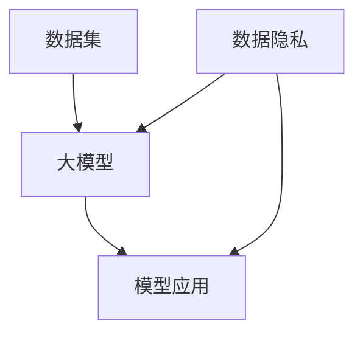
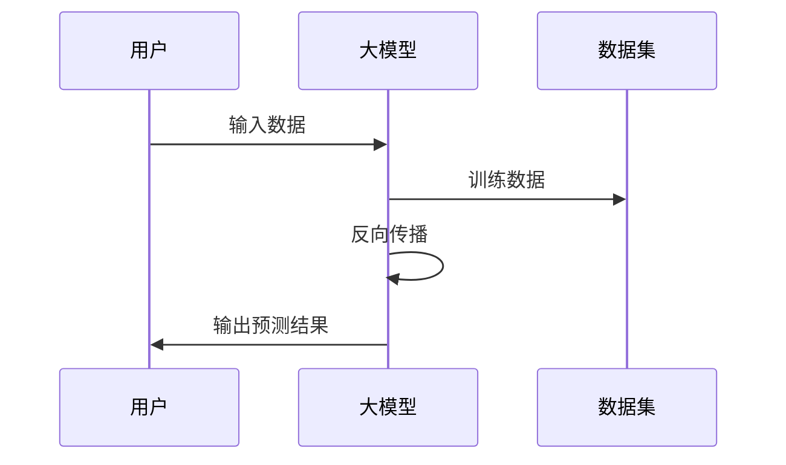

                 

### 第1章 引言

## 1.1 背景介绍

### 1.1.1 大模型时代的发展

近年来，随着人工智能技术的飞速发展，大模型（Big Models）应运而生。大模型是指那些具有巨大参数量和复杂结构的机器学习模型，例如深度神经网络（Deep Neural Networks）、图神经网络（Graph Neural Networks）和生成对抗网络（Generative Adversarial Networks）等。这些模型在处理大规模数据集时展现出卓越的性能，推动了自然语言处理、计算机视觉、推荐系统等领域的革命性进展。

大模型的发展得益于计算能力的提升、海量数据的积累和先进的算法技术。随着云计算和边缘计算的发展，计算资源的获取变得更加便捷，使得训练和部署大模型成为可能。同时，互联网和物联网的普及带来了大量结构化和非结构化数据，为模型的训练提供了丰富的素材。此外，深度学习算法的优化和改进，如残差连接、批量归一化、Dropout等技术，也大幅提升了大模型的性能。

### 1.1.2 数据隐私的重要性

数据隐私是现代社会中不可忽视的重要议题。随着数据驱动决策的普及，越来越多的个人和企业开始依赖数据来优化业务流程、提升用户体验。然而，数据的收集、存储和使用过程中，隐私泄露的风险也随之增加。数据隐私问题不仅涉及个人的隐私权，还可能对企业的声誉和业务造成严重损害。

数据隐私的重要性体现在以下几个方面：

1. **个人隐私保护**：个人隐私数据，如身份证号、电话号码、社交媒体信息等，一旦泄露，可能导致个人隐私被侵犯、财产损失甚至人身安全威胁。
   
2. **企业竞争力**：企业数据，如客户信息、商业机密等，泄露可能导致竞争优势丧失，甚至被竞争对手利用。

3. **社会稳定性**：大规模数据泄露可能导致社会不稳定，甚至国家安全风险。

### 1.1.3 大模型时代数据隐私面临的挑战

在大模型时代，数据隐私保护面临着前所未有的挑战：

1. **数据规模扩大**：大模型的训练和部署需要海量的数据，这增加了隐私泄露的风险。

2. **数据依赖性增强**：大模型对数据的质量和量有较高要求，这意味着更多的个人和企业数据将直接参与模型训练和决策过程。

3. **隐私攻击手段多样化**：随着技术的进步，隐私攻击手段也日益复杂，包括数据泄露、数据篡改、数据销毁等。

4. **法律法规滞后**：现有的数据隐私法律法规往往滞后于技术发展，无法有效应对新兴的隐私保护挑战。

面对这些挑战，如何在充分利用大模型优势的同时，确保数据隐私安全，成为一个亟待解决的问题。

---

在接下来的章节中，我们将深入探讨大模型和数据隐私的基本概念，分析数据隐私保护的技术手段，构建隐私保护框架，讨论法律法规与伦理问题，并通过实践案例展示隐私保护的最佳实践。希望通过这一系列的探讨，能够为读者提供一个全面、深入的大模型时代数据隐私保护指南。

## 1.2 核心概念与联系

### 1.2.1 大模型的基本概念

大模型，又称大型机器学习模型，是指那些拥有海量参数和复杂结构的机器学习模型。它们通常用于处理大规模数据集，以实现高度复杂的任务。例如，深度神经网络（DNN）是一种常见的大模型，它通过多层神经元的非线性组合来学习和表示数据。

**定义**：大模型通常具有以下几个特征：
- **大量参数**：大模型拥有数百万至数十亿个参数，这使得它们能够捕捉数据中的细微模式和复杂关系。
- **复杂结构**：大模型通常包含多层神经元或节点，具有复杂的网络结构。
- **大规模数据训练**：大模型需要使用大规模数据集进行训练，以优化其参数并提高性能。

**特征对比表格**：

| 特征 | 大模型 | 传统模型 |
| --- | --- | --- |
| 参数数量 | 数百万至数十亿 | 数千至数万个 |
| 结构复杂度 | 多层网络结构 | 单层或简单网络结构 |
| 数据需求 | 大规模数据集 | 中小规模数据集 |

**ER实体关系图架构**：

```mermaid
erDiagram
  数据集 ||--o> 大模型 : "训练数据"
  数据集 ||--o> 模型参数 : "参数优化"
  大模型 ||--o> 预测结果 : "模型应用"
```

### 1.2.2 数据隐私的核心概念

数据隐私涉及个人或组织数据的保密性和完整性，旨在确保数据在收集、存储、处理和传输过程中不被未经授权的访问或泄露。数据隐私包括以下几个方面：

**定义**：
- **隐私**：指个人或组织的敏感信息不被公开或泄露。
- **数据隐私**：指数据在收集、存储、处理和传输过程中，确保其不被未经授权的访问、使用或泄露。

**分类**：
- **个人数据隐私**：涉及个人身份、健康状况、财务状况等敏感信息。
- **企业数据隐私**：涉及商业机密、客户信息、员工档案等敏感信息。

**法律法规**：
- **国内法规**：如《中华人民共和国网络安全法》、《中华人民共和国个人信息保护法》等。
- **国际法规**：如《通用数据保护条例》（GDPR）、《加州消费者隐私法案》（CCPA）等。

### 1.2.3 大模型与数据隐私的联系

大模型与数据隐私之间存在紧密的联系。一方面，大模型的训练和部署需要大量的数据，这增加了数据隐私泄露的风险。另一方面，数据隐私的保护对于确保大模型的可靠性和公信力至关重要。

**影响分析**：

1. **数据依赖性**：大模型对数据有较高的依赖性，这意味着更多的个人和企业数据将直接参与模型训练和决策过程，增加了隐私泄露的风险。
2. **隐私保护需求**：大模型的应用场景通常涉及敏感信息，如医疗数据、金融数据等，这要求在模型训练和应用过程中，必须采取严格的隐私保护措施。

**联系**：

- **数据来源**：大模型的数据通常来自各种渠道，包括公开数据集、个人数据和企业数据。
- **隐私风险**：数据泄露、数据篡改、数据销毁等隐私风险在大模型时代尤为突出。
- **隐私保护**：通过数据加密、数据脱敏、权限控制等隐私保护技术，可以降低大模型时代的隐私泄露风险。

**联系图**：



通过以上分析，我们可以看到大模型和数据隐私之间的紧密联系。在接下来的章节中，我们将深入探讨大模型的数据隐私保护技术，构建隐私保护框架，并探讨法律法规和伦理问题。

## 1.3 书籍结构概述

### 1.3.1 各章节主要内容介绍

本书分为六个主要章节，每个章节都有其独特的主题和目标，旨在全面探讨大模型时代的数据隐私保护问题。

1. **第1章 引言**：
   - **主要内容**：介绍大模型时代的发展背景、数据隐私的重要性以及大模型时代数据隐私面临的挑战。
   - **目标**：为读者提供对大模型和数据隐私的基本理解，明确本书的核心内容和重要性。

2. **第2章 大模型与数据隐私原理**：
   - **主要内容**：详细阐述大模型的基本原理、数据隐私的基本概念以及两者之间的联系。
   - **目标**：帮助读者深入理解大模型和数据隐私的核心原理，为后续章节的讨论打下基础。

3. **第3章 数据隐私保护技术**：
   - **主要内容**：介绍数据加密、数据脱敏、权限控制等隐私保护技术，并分析其在大模型应用中的具体实施方法。
   - **目标**：提供实用的隐私保护技术手段，帮助读者在实际应用中实现数据隐私保护。

4. **第4章 大模型时代的隐私保护框架**：
   - **主要内容**：构建大模型时代的隐私保护框架，包括设计原则、构建步骤和案例分析。
   - **目标**：为读者提供一个系统化的隐私保护解决方案，指导实际操作。

5. **第5章 大模型隐私保护的法律法规与伦理**：
   - **主要内容**：探讨数据隐私保护的法律法规和伦理问题，分析法律法规与伦理的融合。
   - **目标**：帮助读者了解法律法规和伦理在隐私保护中的重要作用，提高隐私保护意识。

6. **第6章 大模型隐私保护的实践与案例分析**：
   - **主要内容**：通过实践案例展示大模型隐私保护的最佳实践，并进行详细分析。
   - **目标**：为读者提供实际操作经验和参考，提升隐私保护能力。

### 1.3.2 读者受益与阅读建议

本书的目标是帮助读者全面了解大模型时代的数据隐私保护问题，提供实用的技术手段和系统化的解决方案。以下是读者在阅读本书时可获得的收益和阅读建议：

1. **全面的知识体系**：通过本书，读者可以系统地学习大模型和数据隐私的核心概念、原理及其联系。

2. **实用的技术手段**：本书详细介绍了数据加密、数据脱敏、权限控制等隐私保护技术，帮助读者在实际应用中有效保护数据隐私。

3. **系统化的解决方案**：本书构建了大模型时代的隐私保护框架，提供了一套完整的解决方案，指导读者在实践中应用。

4. **实践案例分析**：通过实践案例的分析，读者可以了解大模型隐私保护的实战经验，提高实际操作能力。

**阅读建议**：
- **按章节顺序阅读**：建议读者按照章节顺序阅读，以确保对每个主题有系统性的理解。
- **重点阅读第2章**：第2章是全书的基础，理解大模型和数据隐私的基本原理对于后续章节的学习至关重要。
- **结合实际案例**：在阅读过程中，可以结合实际案例进行分析，加深对理论知识的理解。

通过阅读本书，读者不仅可以了解大模型时代数据隐私保护的基本概念和技术手段，还可以掌握系统化的解决方案，提升数据隐私保护的能力。希望本书能为读者在大模型时代的隐私保护之旅提供有力支持。

### 1.4 本章小结

第1章作为本书的引言，主要介绍了大模型时代的发展背景、数据隐私的重要性以及两者之间的紧密联系。通过这一章的学习，读者可以初步了解大模型和数据隐私的基本概念，认识到数据隐私保护在大模型时代面临的挑战。

**重点内容**包括：

- 大模型的发展背景及其在各个领域的应用。
- 数据隐私的重要性以及个人和企业数据隐私保护的必要性。
- 大模型与数据隐私之间的联系，包括数据依赖性和隐私风险。

**下一步学习建议**：

- 深入阅读第2章，进一步了解大模型和数据隐私的原理，为后续章节的学习打下基础。
- 在实践中关注大模型和数据隐私的最新动态，积累实际操作经验。

通过本章的学习，读者可以为后续章节的深入探讨做好准备，为全面掌握大模型时代的数据隐私保护提供理论支持和实践指导。

## 第2章 大模型与数据隐私原理

本章将深入探讨大模型与数据隐私的基本原理，帮助读者建立对这两个核心概念的系统化理解。我们将分别介绍大模型的基本原理、数据隐私的基本概念以及两者之间的联系，并通过具体的案例来加深对理论的理解。

### 2.1 大模型的基本原理

#### 2.1.1 大模型的定义

大模型，又称大型机器学习模型，是指那些拥有大量参数和复杂结构的机器学习模型。这些模型通过训练和学习数据中的特征和模式，能够完成各种复杂的任务。大模型的发展是人工智能领域的重要突破，它们在图像识别、自然语言处理、推荐系统等领域取得了显著的成果。

**定义**：大模型通常具有以下特征：
- **大量参数**：大模型包含数百万至数十亿个参数，这使得它们能够捕捉数据中的细微模式和复杂关系。
- **复杂结构**：大模型具有多层网络结构，通过多个神经元的组合和连接，实现数据的处理和决策。
- **大规模数据训练**：大模型需要使用大规模数据集进行训练，以优化其参数并提高性能。

#### 2.1.2 大模型的工作机制

大模型的工作机制主要包括数据输入、模型训练和输出预测三个阶段。首先，大模型接收输入数据，然后通过一系列的神经网络层进行特征提取和转换。在模型训练过程中，通过反向传播算法不断调整模型参数，以降低预测误差。最后，大模型根据训练结果进行输出预测，完成特定的任务。

**工作机制图**：



#### 2.1.3 大模型的发展历程

大模型的发展历程可以追溯到深度学习（Deep Learning）的兴起。随着计算能力和算法技术的提升，深度神经网络逐渐成为机器学习领域的核心。在2012年，AlexNet的出现标志着深度学习在图像识别任务中的突破。此后，随着卷积神经网络（CNN）、循环神经网络（RNN）、生成对抗网络（GAN）等技术的发展，大模型的应用范围不断扩大。

**发展历程图**：

```mermaid
gantt
  dateFormat  YYYY-MM-DD
  title 大模型发展历程

  section 深度学习兴起
  AlexNet:done, a1: 2012-01-01, dur: 3mo
  
  section 模型结构演进
  CNN:done, a2: 2013-01-01, dur: 18mo
  RNN:done, a3: 2014-01-01, dur: 18mo
  GAN:done, a4: 2015-01-01, dur: 12mo
  
  section 应用领域拓展
  图像识别:done, a5: 2012-01-01, dur: 3mo
  自然语言处理:done, a6: 2016-01-01, dur: 24mo
  推荐系统:done, a7: 2018-01-01, dur: 24mo
```

### 2.2 数据隐私的基本概念

#### 2.2.1 数据隐私的定义

数据隐私，是指个人或组织在数据收集、存储、处理和传输过程中，确保其敏感信息不被未经授权的访问、使用或泄露。数据隐私不仅涉及个人隐私，还包括企业商业秘密、用户行为数据等。

**定义**：数据隐私的核心是保护数据的保密性和完整性，防止数据被非法获取、泄露或篡改。

#### 2.2.2 数据隐私的分类

数据隐私可以按不同维度进行分类，常见分类包括：

- **个人数据隐私**：涉及个人身份信息、健康信息、财务信息等。
- **企业数据隐私**：涉及商业机密、客户信息、员工档案等。

#### 2.2.3 数据隐私的法律法规

数据隐私的保护离不开法律法规的支持。不同国家和地区有不同的隐私保护法律法规，以下是一些主要的法律法规：

- **国内法规**：如《中华人民共和国网络安全法》、《中华人民共和国个人信息保护法》。
- **国际法规**：如《通用数据保护条例》（GDPR）、《加州消费者隐私法案》（CCPA）。

### 2.3 大模型与数据隐私的联系

#### 2.3.1 大模型对数据隐私的影响

大模型对数据隐私的影响主要体现在以下几个方面：

1. **数据依赖性**：大模型训练需要大量的数据，这可能导致个人和企业数据更广泛地被收集和使用。
2. **隐私风险**：大模型的训练和应用过程中，数据泄露、数据篡改等隐私风险更加突出。
3. **隐私保护需求**：大模型的应用场景通常涉及敏感信息，如医疗数据、金融数据等，这要求更加严格的隐私保护措施。

#### 2.3.2 数据隐私在大模型应用中的重要性

数据隐私在大模型应用中的重要性体现在：

1. **模型可信性**：数据隐私保护是建立用户信任的基础，保障模型的可靠性和公信力。
2. **法律法规合规**：遵循数据隐私法律法规是企业和组织必须遵守的底线，避免法律风险和处罚。
3. **商业竞争力**：有效保护数据隐私可以提高企业的市场声誉和竞争力。

#### 2.3.3 大模型与数据隐私的平衡

在利用大模型的过程中，如何平衡数据隐私与模型性能是一个重要问题。以下是一些平衡策略：

1. **数据匿名化**：通过数据匿名化技术，降低个人和企业数据的隐私风险。
2. **隐私保护算法**：采用隐私保护算法，在保证模型性能的前提下，降低隐私泄露风险。
3. **多方安全计算**：利用多方安全计算技术，实现数据的安全共享和协作。

### 案例分析

为了更好地理解大模型与数据隐私的联系，我们可以通过以下案例分析：

**案例一：谷歌语音识别服务**

谷歌的语音识别服务使用了大规模的语音数据集进行训练，这些数据包括用户的语音记录和文本转录。谷歌采取了多种隐私保护措施，如数据匿名化和差分隐私算法，确保用户的语音数据在训练和应用过程中不被泄露。

**案例二：医疗影像分析系统**

某医疗影像分析系统使用了大量患者的影像数据，这些数据包含了敏感的医疗信息。为了保护患者隐私，系统采用了数据加密和访问控制技术，确保只有授权人员可以访问和处理这些数据。

通过以上案例，我们可以看到大模型与数据隐私之间的紧密联系，以及在实际应用中采取的隐私保护措施。

### 2.4 本章小结

本章深入探讨了大模型与数据隐私的基本原理，包括大模型的定义和工作机制、数据隐私的基本概念和法律法规、大模型对数据隐私的影响以及数据隐私在大模型应用中的重要性。通过具体的案例分析和平衡策略，我们理解了大模型时代数据隐私保护的挑战和重要性。

**重点内容**包括：

- 大模型的基本原理和其工作机制。
- 数据隐私的基本概念、分类和法律法规。
- 大模型与数据隐私的联系和平衡策略。

**下一步学习建议**：

- 深入了解大模型的具体实现和应用案例。
- 关注数据隐私保护技术的发展趋势和最新动态。

通过本章的学习，读者可以系统地掌握大模型与数据隐私的基本原理，为后续章节的深入探讨打下基础。

## 第3章 数据隐私保护技术

数据隐私保护技术在保障大模型时代的数据安全方面发挥着关键作用。本章将详细介绍几种常见的数据隐私保护技术，包括数据加密技术、数据脱敏技术、权限控制技术等，并探讨隐私保护算法在大模型训练中的应用。这些技术手段将为读者提供一套全面的数据隐私保护解决方案。

### 3.1 数据加密技术

数据加密是保护数据隐私的一种重要技术手段，通过将数据转换成加密形式，防止未经授权的访问和泄露。数据加密技术可以分为对称加密和非对称加密。

#### 3.1.1 对称加密算法

对称加密算法（Symmetric Encryption）使用相同的密钥对数据进行加密和解密。常见的对称加密算法包括：

- **AES（Advanced Encryption Standard）**：高级加密标准，是一种常用的加密算法，支持128位、192位和256位密钥长度。
- **DES（Data Encryption Standard）**：数据加密标准，是一种较早的加密算法，使用56位密钥。

对称加密算法的优点是加密速度快，但缺点是密钥管理复杂，难以在分布式系统中实现。

#### 3.1.2 非对称加密算法

非对称加密算法（Asymmetric Encryption）使用一对密钥，一个用于加密，另一个用于解密。常见的非对称加密算法包括：

- **RSA（Rivest-Shamir-Adleman）**：基于大素数分解的加密算法，具有很高的安全性。
- **ECC（Elliptic Curve Cryptography）**：椭圆曲线加密算法，具有更短的密钥长度和更高的安全性。

非对称加密算法的优点是密钥管理简单，适用于分布式系统，但加密和解密速度相对较慢。

#### 3.1.3 同态加密算法

同态加密算法（Homomorphic Encryption）是一种能够对加密数据进行计算而不需要解密的加密技术，适用于云计算和分布式计算环境。同态加密算法分为部分同态加密和全同态加密：

- **部分同态加密**：允许对加密数据执行有限次线性运算。
- **全同态加密**：允许对加密数据执行任意多次计算。

目前，全同态加密算法仍处于研究阶段，其计算效率较低，但具有很高的安全性和灵活性。

### 3.2 数据脱敏技术

数据脱敏技术（Data Masking）通过隐藏或篡改敏感信息，降低数据泄露的风险。数据脱敏技术可以分为以下几种：

#### 3.2.1 数据匿名化

数据匿名化（Data Anonymization）通过删除或替换敏感信息，使数据无法直接识别个人身份。常见的匿名化方法包括：

- **k-匿名**：数据集中的每个记录不能在k个记录中唯一识别。
- **l-diversity**：每个记录在l个记录中至少出现l次。
- **t-closeness**：每个记录的属性分布与总分布的差异不超过t个标准差。

#### 3.2.2 数据置换

数据置换（Data Substitution）通过将敏感值替换为非敏感值或虚构值，保护数据的真实性。常见的置换方法包括：

- **随机置换**：随机替换敏感值。
- **规则置换**：根据预设规则替换敏感值。

#### 3.2.3 数据掩码

数据掩码（Data Masking）通过部分遮盖或遮挡敏感信息，降低数据泄露的风险。常见的掩码方法包括：

- **部分掩码**：仅遮挡部分敏感信息。
- **完全掩码**：完全遮盖敏感信息。

### 3.3 权限控制技术

权限控制技术通过限制用户对数据和资源的访问权限，确保数据安全。常见的权限控制技术包括：

#### 3.3.1 用户身份认证

用户身份认证（User Authentication）是权限控制的基础，通过验证用户身份，确保只有授权用户可以访问系统和数据。常见的认证方法包括：

- **密码认证**：通过用户输入的密码验证身份。
- **双因素认证**：结合密码和动态验证码等多种认证方式。

#### 3.3.2 访问控制列表

访问控制列表（Access Control List，ACL）是一种基于用户身份的权限控制方法，通过定义用户对特定资源的访问权限。常见的ACL控制方式包括：

- **允许列表**：只允许列出的用户访问。
- **拒绝列表**：拒绝列出的用户访问。

#### 3.3.3 多因素认证

多因素认证（Multi-Factor Authentication，MFA）结合多种认证方式，提高认证安全性。常见的多因素认证包括：

- **密码+短信验证码**：用户输入密码后，还需要输入短信验证码。
- **密码+硬件令牌**：用户输入密码后，还需要使用硬件令牌生成验证码。

### 3.4 隐私保护算法

隐私保护算法在大模型训练中发挥着重要作用，能够在保证模型性能的同时，降低数据隐私泄露的风险。以下是一些常见的隐私保护算法：

#### 3.4.1 隐私保护方法概述

隐私保护方法可以分为以下几类：

- **差分隐私**：通过在数据中添加噪声，确保单个数据记录的隐私保护。
- **加密算法**：利用加密技术，确保数据在传输和存储过程中的隐私安全。
- **多方安全计算**：通过多方安全计算技术，实现数据的安全共享和协作。

#### 3.4.2 大模型训练中的隐私保护

在大模型训练中，常见的隐私保护技术包括：

- **同态加密训练**：利用同态加密算法，对加密数据进行训练，确保数据隐私保护。
- **联邦学习**：通过联邦学习技术，实现数据的分布式训练，减少数据泄露风险。

#### 3.4.3 隐私保护算法案例分析

以下是一个基于差分隐私的隐私保护算法案例分析：

**案例：基于差分隐私的推荐系统**

某在线购物平台希望开发一个基于用户行为的推荐系统，但由于用户行为数据包含敏感信息，需要采取隐私保护措施。平台采用了差分隐私技术，对用户行为数据进行处理，确保数据隐私保护。

1. **数据预处理**：对用户行为数据进行清洗和标准化处理，去除无关特征。
2. **差分隐私添加**：对处理后的数据添加噪声，确保单个用户数据的隐私保护。
3. **模型训练**：利用差分隐私训练算法，对添加噪声的数据进行模型训练。
4. **模型评估**：对训练好的模型进行评估，确保推荐系统的性能。

通过以上步骤，平台成功实现了用户行为数据的隐私保护，同时保持了推荐系统的性能。

### 3.5 本章小结

本章详细介绍了数据隐私保护技术，包括数据加密技术、数据脱敏技术、权限控制技术和隐私保护算法。通过这些技术手段，读者可以了解如何在保证数据隐私的同时，利用大模型进行有效的数据处理和模型训练。本章的重点内容为：

- 数据加密技术，包括对称加密、非对称加密和同态加密。
- 数据脱敏技术，包括数据匿名化、数据置换和数据掩码。
- 权限控制技术，包括用户身份认证、访问控制列表和多因素认证。
- 隐私保护算法，包括差分隐私、多方安全计算和联邦学习。

**下一步学习建议**：

- 深入研究每种数据隐私保护技术的具体实现和应用场景。
- 关注隐私保护技术的发展趋势和最新动态。

通过本章的学习，读者可以为大模型时代的数据隐私保护提供技术支持，保障数据安全和隐私。

## 第4章 大模型时代的隐私保护框架

随着大模型在各个领域的广泛应用，构建一个有效的隐私保护框架成为保障数据安全和隐私的关键。本章将详细介绍大模型时代隐私保护框架的设计原则、构建步骤以及具体案例分析。通过这一框架，企业可以在充分利用大模型优势的同时，确保数据隐私安全。

### 4.1 隐私保护框架设计原则

#### 4.1.1 安全性

隐私保护框架的首要原则是安全性，确保数据在收集、存储、传输和处理过程中不被非法访问、泄露或篡改。安全性包括以下几个方面：

- **数据加密**：采用多种加密算法对敏感数据进行加密，确保数据在传输和存储过程中的安全性。
- **访问控制**：通过访问控制列表（ACL）和多因素认证（MFA）等手段，严格控制用户对数据和系统的访问权限。
- **安全审计**：定期进行安全审计，检测和预防潜在的安全威胁。

#### 4.1.2 可用性

可用性是指数据隐私保护框架在不影响系统性能和用户体验的前提下，保证数据的可用性和可访问性。可用性包括以下几个方面：

- **数据匿名化**：通过数据匿名化技术，确保用户隐私数据在训练和应用过程中不被泄露，同时保持数据的质量和可用性。
- **多模态数据支持**：支持多种类型的数据格式和来源，包括结构化数据、半结构化数据和非结构化数据。
- **实时数据流处理**：实现实时数据处理和模型更新，确保系统的响应速度和灵活性。

#### 4.1.3 实用性

实用性是指隐私保护框架在实际应用中的可行性和可操作性。实用性包括以下几个方面：

- **可扩展性**：框架应具备良好的扩展性，能够支持不同规模的数据和模型需求。
- **可维护性**：框架设计应便于维护和升级，降低系统运维成本。
- **集成性**：框架应能够与现有的系统和技术栈无缝集成，减少开发和部署的复杂度。

### 4.2 隐私保护框架构建步骤

#### 4.2.1 需求分析

需求分析是构建隐私保护框架的第一步，旨在明确隐私保护的目标、需求和约束。需求分析包括以下几个方面：

- **用户需求**：了解不同用户群体的隐私保护需求，包括个人用户和企业用户。
- **业务需求**：分析业务流程和数据流，确定隐私保护的关键节点和风险点。
- **法律法规要求**：遵循国内外的数据隐私保护法律法规，确保框架的合规性。

#### 4.2.2 风险评估

风险评估是识别和分析数据隐私保护框架潜在风险的过程。通过风险评估，可以确定隐私保护的优先级和策略。风险评估包括以下几个方面：

- **威胁分析**：识别可能威胁隐私安全的外部威胁和内部威胁。
- **漏洞分析**：分析系统中可能存在的安全漏洞和缺陷。
- **风险评级**：根据威胁和漏洞的严重程度，对风险进行评级和优先级排序。

#### 4.2.3 框架设计

框架设计是构建隐私保护框架的核心步骤，旨在制定系统化的解决方案。框架设计包括以下几个方面：

- **架构设计**：确定系统的总体架构，包括数据处理、存储、传输和隐私保护等模块。
- **模块划分**：将系统划分为多个功能模块，明确各模块的职责和接口。
- **技术选型**：选择合适的技术和工具，包括加密算法、匿名化技术、访问控制机制等。

#### 4.2.4 框架实现

框架实现是将设计方案转化为实际系统的过程。框架实现包括以下几个方面：

- **编码实现**：根据设计文档，编写系统的源代码。
- **系统集成**：将各个模块集成到一起，确保系统的整体功能和性能。
- **测试验证**：对系统进行功能测试、性能测试和安全测试，验证系统的稳定性和可靠性。

#### 4.2.5 持续优化

隐私保护框架不是一次性的项目，而是一个持续优化的过程。随着技术和业务环境的变化，隐私保护框架需要不断进行更新和改进。持续优化包括以下几个方面：

- **反馈收集**：收集用户和业务部门的反馈，识别系统存在的问题和改进方向。
- **性能优化**：根据反馈和测试结果，优化系统的性能和稳定性。
- **安全更新**：定期更新系统的安全防护措施，应对新的安全威胁和漏洞。

### 4.3 隐私保护框架案例分析

#### 4.3.1 某互联网公司的大模型隐私保护实践

某互联网公司在开发一款智能推荐系统时，面临数据隐私保护的挑战。为了确保用户隐私安全，公司采取了一系列隐私保护措施，构建了完整的隐私保护框架。

1. **需求分析**：
   - 确定用户隐私数据包括用户行为数据、地理位置数据等。
   - 分析业务流程，识别隐私风险点。

2. **风险评估**：
   - 识别外部威胁，如数据泄露和网络攻击。
   - 分析内部威胁，如员工滥用权限和系统漏洞。

3. **框架设计**：
   - 采用差分隐私技术，对用户行为数据添加噪声。
   - 引入多方安全计算技术，实现数据的分布式训练。
   - 设计访问控制机制，确保数据访问权限。

4. **框架实现**：
   - 开发基于差分隐私的推荐算法。
   - 实现多方安全计算框架，支持数据的安全共享和协作。
   - 集成访问控制模块，确保用户数据的安全访问。

5. **持续优化**：
   - 收集用户反馈，优化系统性能和用户体验。
   - 定期进行安全审计和漏洞修复，提高系统安全性。

通过这一隐私保护框架，公司成功实现了用户隐私数据的保护，同时保持了推荐系统的性能和准确性。

#### 4.3.2 某金融企业的大模型隐私保护策略

某金融企业在其风险管理系统中使用了大规模的数据分析模型，为了确保金融数据的隐私安全，企业采取了以下隐私保护策略：

1. **数据加密**：
   - 对传输和存储的敏感数据采用AES加密算法进行加密。
   - 定期更换加密密钥，确保数据安全。

2. **数据脱敏**：
   - 对个人身份信息、财务数据等敏感信息进行脱敏处理。
   - 采用数据匿名化和掩码技术，确保数据隐私保护。

3. **权限控制**：
   - 实施严格的访问控制列表（ACL），确保只有授权人员可以访问敏感数据。
   - 采用双因素认证（MFA），提高用户认证安全性。

4. **安全审计**：
   - 定期进行安全审计，检测系统漏洞和潜在威胁。
   - 对异常行为进行监控和报警，及时采取措施。

通过这些策略，金融企业成功保护了其金融数据的安全，确保了系统的稳定运行。

### 4.4 本章小结

本章详细介绍了大模型时代隐私保护框架的设计原则、构建步骤和具体案例分析。通过这一框架，企业可以在充分利用大模型优势的同时，确保数据隐私安全。

**重点内容**包括：

- 隐私保护框架的设计原则，包括安全性、可用性和实用性。
- 隐私保护框架的构建步骤，包括需求分析、风险评估、框架设计、框架实现和持续优化。
- 隐私保护框架的具体案例分析，包括互联网公司和金融企业的实践。

**下一步学习建议**：

- 深入研究隐私保护技术的具体实现和应用。
- 关注隐私保护框架在新兴领域的应用和发展。

通过本章的学习，读者可以系统地掌握大模型时代的隐私保护框架，为实际应用提供有力支持。

## 第5章 大模型隐私保护的法律法规与伦理

在大模型时代，数据隐私保护不仅依赖于技术手段，还必须遵循相关的法律法规和伦理规范。本章将探讨大模型隐私保护的法律法规框架，分析其中的关键法律法规和趋势，并讨论数据隐私保护中的伦理问题及其解决策略。

### 5.1 法律法规概述

#### 5.1.1 国内数据隐私法律法规

中国对数据隐私保护的法律法规逐步完善，以下是一些主要的法律法规：

- **《中华人民共和国网络安全法》**：这是中国关于网络安全的基本法，规定了网络运营者的数据保护义务，包括数据收集、存储、处理和传输等环节。
- **《中华人民共和国个人信息保护法》**：该法于2021年11月1日正式实施，旨在保护个人信息权益，规范个人信息处理活动，对个人信息的收集、使用、存储和传输等做出了详细规定。
- **《信息安全技术个人信息安全规范》**：这是国家标准，提供了个人信息处理活动的安全规范，为企业和组织提供了具体的操作指南。

#### 5.1.2 国际数据隐私法律法规

国际上，多个国家和地区制定了数据隐私保护法律法规，以下是一些具有代表性的法律法规：

- **《通用数据保护条例》（GDPR）**：欧盟的GDPR是国际上最具影响力的隐私保护法规，规定了数据处理的合法性、透明性、用户同意和数据处理者的义务等。
- **《加州消费者隐私法案》（CCPA）**：CCPA是美国加州的一项隐私保护法律，旨在赋予消费者对其个人信息的控制权，包括知情权、访问权和删除权。
- **《隐私盾牌框架》**：隐私盾牌框架是由美国和欧盟达成的协议，旨在促进跨国数据流动，保障数据隐私安全。

#### 5.1.3 法律法规发展趋势

随着数据隐私保护问题的日益突出，全球范围内的法律法规也在不断更新和完善。以下是一些发展趋势：

- **加强数据主体权利**：法律法规逐步加强数据主体（个人或组织）的知情权、访问权、删除权和数据可携权。
- **推动跨国合作**：国际间的数据隐私保护合作日益紧密，通过签署协议和开展国际合作，推动全球数据隐私保护标准的统一。
- **应对新兴技术挑战**：随着人工智能、区块链等新兴技术的发展，法律法规也在不断调整，以适应新的技术环境和隐私保护需求。

### 5.2 伦理道德考量

#### 5.2.1 数据隐私的伦理问题

数据隐私保护涉及到多个伦理问题，以下是一些主要的伦理问题：

- **隐私权**：个人有权保护其个人信息的隐私，防止未经授权的访问和使用。
- **知情同意**：在收集和使用个人信息时，必须确保数据主体知情并同意，不得进行秘密收集或滥用数据。
- **透明度**：数据处理者应确保数据处理活动的透明性，向数据主体充分披露数据处理的目的、范围、方法和影响。
- **公平性**：数据隐私保护应当公平对待所有数据主体，不得因为个人身份或特征进行歧视性处理。

#### 5.2.2 大模型隐私保护的伦理挑战

大模型隐私保护在伦理方面面临以下挑战：

- **算法偏见**：大模型在训练过程中可能受到训练数据偏见的影响，导致算法对某些群体产生不公平待遇，这涉及到伦理问题和法律风险。
- **数据滥用**：大模型拥有大量敏感数据，如不加以妥善保护，可能被用于不正当目的，侵犯数据主体的权益。
- **隐私泄露**：大模型的训练和应用过程中，数据泄露的风险较高，可能对数据主体造成严重后果。

#### 5.2.3 伦理决策框架

为了解决大模型隐私保护的伦理问题，可以采用以下伦理决策框架：

- **利益相关者分析**：识别和评估所有利益相关者的权益和利益，确保数据处理活动符合各方的期望和利益。
- **伦理审查**：建立伦理审查机制，对数据处理活动进行评估和监督，确保符合伦理标准和法律法规。
- **持续监督和改进**：定期对数据处理活动进行伦理监督和评估，及时识别和解决伦理问题，不断改进隐私保护措施。

### 5.3 法律法规与伦理的融合

#### 5.3.1 法规与伦理的关系

法律法规和伦理在数据隐私保护中相互补充，共同构建数据隐私保护的基础。法律法规提供了具体的行为规范和制裁手段，而伦理则提供了道德标准和行为指南。

- **法规的约束力**：法律法规通过法律制裁确保数据隐私保护的实施，对违反规定的行为进行惩罚。
- **伦理的引导力**：伦理规范引导企业和个人在数据处理活动中遵循道德标准，促进社会责任和可持续发展。

#### 5.3.2 隐私保护法规的伦理考量

隐私保护法规在制定过程中应充分考虑伦理问题，确保法规的伦理考量：

- **尊重数据主体的权利**：法规应明确数据主体的隐私权，保障其知情同意权、数据访问权和删除权。
- **平衡隐私与公共利益**：在处理敏感数据时，应权衡隐私保护和公共利益，确保数据隐私保护不会妨碍公共安全和公共利益。
- **透明度和问责制**：法规应要求数据处理者公开数据处理活动，建立问责机制，确保数据处理活动的透明性和可追溯性。

#### 5.3.3 伦理法规对隐私保护的推动作用

伦理法规对隐私保护的推动作用主要体现在以下几个方面：

- **提升隐私保护意识**：伦理法规的制定和宣传，提高了社会对数据隐私保护的重视程度，增强了企业和个人的隐私保护意识。
- **引导技术发展**：伦理法规促进了隐私保护技术的发展，推动了加密技术、匿名化技术等隐私保护技术的创新和应用。
- **加强国际合作**：伦理法规促进了国际间的隐私保护合作，推动了全球隐私保护标准的统一，增强了跨国数据流动的透明性和安全性。

### 5.4 本章小结

本章深入探讨了大模型隐私保护的法律法规和伦理问题，分析了国内外的法律法规框架和趋势，讨论了数据隐私保护的伦理问题及其解决策略。通过法律法规和伦理的融合，可以构建一个更加全面和有效的数据隐私保护体系。

**重点内容**包括：

- 国内外的数据隐私保护法律法规，包括《中华人民共和国网络安全法》、《中华人民共和国个人信息保护法》和GDPR等。
- 数据隐私保护的伦理问题，包括隐私权、知情同意、透明度和公平性等。
- 伦理法规对隐私保护的推动作用，包括提升隐私保护意识、引导技术发展和加强国际合作。

**下一步学习建议**：

- 深入研究国内外数据隐私保护法律法规的具体条款和应用。
- 关注隐私保护技术的发展趋势和伦理问题的最新研究动态。

通过本章的学习，读者可以系统地掌握大模型隐私保护的法律法规和伦理知识，为实际应用提供理论支持和实践指导。

## 第6章 大模型隐私保护的实践与案例分析

为了更好地理解大模型隐私保护的实践方法，本章将通过具体案例展示大模型隐私保护的实践过程，包括环境搭建、核心实现、代码解析、实际案例分析以及总结与拓展。

### 6.1 大模型隐私保护实践概述

#### 6.1.1 实践背景

随着大数据和人工智能技术的普及，企业面临着日益严峻的数据隐私保护挑战。尤其是在医疗、金融和零售等敏感数据密集型行业，如何在大模型训练和应用过程中保护数据隐私成为亟待解决的问题。本案例将以某金融企业为例，展示其在大模型隐私保护方面的实践过程。

#### 6.1.2 实践目标

本案例的主要目标是实现以下目标：

- **保护客户隐私**：确保客户金融数据在模型训练和应用过程中的隐私安全。
- **提高模型性能**：在确保隐私保护的前提下，保持模型的高性能和准确性。
- **合规性**：确保实践过程符合国内外的数据隐私保护法律法规。

#### 6.1.3 实践步骤

实践过程主要包括以下几个步骤：

1. **需求分析**：明确客户隐私保护的需求和模型性能要求。
2. **风险评估**：识别数据隐私保护的潜在风险，制定风险应对策略。
3. **框架设计**：设计符合实际需求的隐私保护框架，包括数据加密、数据脱敏、权限控制等技术。
4. **模型训练与部署**：使用隐私保护算法和技术，实现大模型训练和部署。
5. **实践验证**：通过测试和实际应用，验证隐私保护措施的有效性和模型的性能。
6. **持续优化**：根据实践结果，不断优化隐私保护框架和模型，提升数据隐私保护和模型性能。

### 6.2 案例分析

#### 6.2.1 需求分析

在某金融企业的数据隐私保护实践中，客户隐私保护是首要任务。企业需要确保以下数据隐私需求：

- **数据匿名化**：对客户金融数据中的敏感信息进行匿名化处理，确保数据无法直接识别个人身份。
- **加密传输**：在数据传输过程中，采用加密技术确保数据安全。
- **权限控制**：严格控制数据访问权限，确保只有授权人员可以访问和处理敏感数据。
- **透明审计**：建立透明的数据审计机制，确保数据处理活动的可追溯性和合规性。

#### 6.2.2 风险评估

在实践过程中，企业面临以下数据隐私风险：

- **数据泄露**：未经授权的访问可能导致敏感数据泄露。
- **数据滥用**：内部人员可能滥用数据，侵犯客户隐私。
- **模型偏见**：训练数据中的偏见可能导致模型对某些群体产生不公平待遇。
- **合规风险**：未遵守法律法规可能导致法律制裁和声誉损失。

针对这些风险，企业制定了以下应对策略：

- **加密技术**：采用AES加密算法对敏感数据进行加密，确保数据传输和存储过程中的安全。
- **访问控制**：实施严格的访问控制机制，通过访问控制列表（ACL）和多因素认证（MFA）确保数据访问权限。
- **匿名化处理**：对敏感数据应用数据匿名化技术，如k-匿名和l-diversity，确保数据隐私保护。
- **透明审计**：建立透明审计机制，确保数据处理活动的合规性和可追溯性。

#### 6.2.3 框架设计

基于需求分析和风险评估，企业设计了一套完整的隐私保护框架，包括以下模块：

- **数据加密模块**：采用AES加密算法对敏感数据进行加密，确保数据在传输和存储过程中的安全性。
- **数据脱敏模块**：应用数据匿名化技术，对客户金融数据中的敏感信息进行匿名化处理。
- **访问控制模块**：通过访问控制列表（ACL）和多因素认证（MFA）确保数据访问权限。
- **透明审计模块**：建立透明审计机制，确保数据处理活动的合规性和可追溯性。

#### 6.2.4 模型训练与部署

在隐私保护框架下，企业使用差分隐私算法对客户金融数据进行了大模型训练。具体步骤如下：

1. **数据预处理**：对客户金融数据进行清洗和标准化处理，去除无关特征，确保数据质量。
2. **数据加密**：采用AES加密算法对敏感数据进行加密，确保数据在传输和存储过程中的安全性。
3. **差分隐私添加**：对处理后的数据添加差分隐私噪声，确保单个数据记录的隐私保护。
4. **模型训练**：利用加密数据，采用差分隐私训练算法对模型进行训练。
5. **模型评估**：对训练好的模型进行评估，确保模型性能符合预期。
6. **模型部署**：将训练好的模型部署到生产环境中，实现客户金融数据的智能分析。

#### 6.2.5 实践验证

在实践验证阶段，企业通过以下方法验证隐私保护措施的有效性和模型性能：

1. **测试数据集验证**：使用独立测试数据集对模型进行评估，确保模型性能稳定且具有高准确性。
2. **安全审计**：定期进行安全审计，检测和预防潜在的安全威胁，确保数据处理活动的合规性和安全性。
3. **用户反馈**：收集用户反馈，评估隐私保护措施对用户体验的影响，持续优化隐私保护框架。

#### 6.2.6 持续优化

根据实践验证结果，企业不断优化隐私保护框架和模型，提升数据隐私保护和模型性能。具体措施包括：

- **更新加密算法**：随着加密技术的发展，企业定期更新加密算法，确保数据加密的安全性。
- **优化数据脱敏技术**：根据实际需求，不断改进数据脱敏技术，提高数据匿名化的效果。
- **增强访问控制**：根据用户角色和权限，不断优化访问控制机制，确保数据访问权限的合理性和安全性。
- **持续安全监控**：采用先进的安全监控技术，实时监测系统安全状态，及时识别和响应潜在的安全威胁。

### 6.3 案例分析

**案例一：数据匿名化处理**

在某金融企业的数据隐私保护实践中，客户金融数据中的敏感信息，如姓名、身份证号、银行卡号等，需要进行匿名化处理。企业采用了k-匿名和l-diversity技术，确保数据匿名化的效果。

- **k-匿名**：将敏感信息替换为虚构值，确保每个数据记录不能在k个记录中唯一识别。
- **l-diversity**：确保每个敏感信息在l个记录中至少出现l次，防止数据中的唯一性特征被攻击者利用。

**案例二：差分隐私训练**

为了确保大模型训练过程中的数据隐私，企业采用了差分隐私算法。差分隐私算法通过对数据添加噪声，确保单个数据记录的隐私保护。

- **噪声添加**：对训练数据进行线性运算，添加差分隐私噪声，确保模型输出不会受到单个数据记录的影响。
- **拉格朗日乘数法**：利用拉格朗日乘数法优化模型参数，确保模型性能在隐私保护的同时保持高准确性。

### 6.4 本章小结

本章通过具体案例展示了大模型隐私保护的实践过程，包括需求分析、风险评估、框架设计、模型训练与部署、实践验证和持续优化。通过这些实践步骤，企业可以构建一个有效的隐私保护框架，确保在大模型训练和应用过程中数据的安全和隐私。

**重点内容**包括：

- 实践背景和目标。
- 需求分析、风险评估和框架设计。
- 模型训练与部署、实践验证和持续优化。
- 案例分析，包括数据匿名化和差分隐私训练。

**下一步学习建议**：

- 研究大模型隐私保护技术的具体实现和应用。
- 关注隐私保护框架在新兴领域的应用和发展。

通过本章的学习，读者可以掌握大模型隐私保护的实践方法，为实际应用提供参考和指导。

## 最佳实践 Tips

在大模型时代进行数据隐私保护时，以下是一些最佳实践建议，可以帮助企业和组织更好地管理和保护敏感数据：

1. **全面的需求分析和风险评估**：在构建隐私保护框架前，首先要进行详细的需求分析和风险评估，确保识别到所有潜在的风险和隐私保护需求。

2. **数据最小化原则**：仅收集和处理必要的最小数据集，减少不必要的敏感数据存储和处理，从而降低隐私泄露的风险。

3. **多层次加密**：使用多层次的加密技术，包括传输加密、存储加密和计算过程中的加密，确保数据在整个生命周期中的安全性。

4. **透明度和可追溯性**：确保数据处理活动具有透明度，建立详细的日志记录和审计机制，以便在发生问题时能够迅速追踪和调查。

5. **用户知情同意**：在收集和使用数据时，确保数据主体完全知情并同意，遵守相关的法律法规，尊重数据主体的隐私权。

6. **持续的安全培训**：定期对员工进行数据隐私保护和安全意识培训，提高员工的隐私保护意识和安全操作能力。

7. **第三方审计**：定期进行第三方审计和评估，确保隐私保护措施的有效性和合规性。

8. **灵活的架构设计**：设计一个灵活的架构，能够快速适应新的隐私保护技术和法律法规的变化。

9. **多方安全计算**：采用多方安全计算技术，实现数据的安全共享和协作，减少数据泄露的风险。

10. **持续监控和更新**：建立实时监控机制，及时发现和响应潜在的安全威胁，并持续更新安全防护措施。

通过遵循这些最佳实践，企业和组织可以在充分利用大模型优势的同时，有效地保护数据隐私，确保业务的安全和可持续发展。

### 小结

在大模型时代，数据隐私保护的重要性日益凸显。本文从引言开始，系统性地介绍了大模型与数据隐私的基本概念、核心原理，以及数据隐私保护技术。接着，我们构建了一个全面的隐私保护框架，并探讨了法律法规与伦理问题，通过实践案例分析，展示了大模型隐私保护的具体实施方法。

**核心观点**：

- 大模型的发展带来了数据处理能力的提升，但同时也增加了数据隐私泄露的风险。
- 数据隐私保护涉及个人隐私和企业竞争力的保障，必须引起高度重视。
- 数据隐私保护技术包括数据加密、数据脱敏、权限控制等，能够在不同层面保障数据安全。
- 法律法规和伦理规范是数据隐私保护的重要保障，必须与实际需求相结合。
- 通过实践和案例分析，我们可以看到在大模型时代，有效的隐私保护措施是可行的，并且能够与模型性能相协调。

**展望未来**：

- 随着技术的不断进步，隐私保护技术将更加成熟，如多方安全计算、同态加密等新兴技术的应用将更加广泛。
- 法律法规和伦理规范将继续完善，为数据隐私保护提供更坚实的法律和道德基础。
- 企业和组织需要持续关注数据隐私保护领域的最新动态，不断优化隐私保护策略，以应对日益复杂的隐私保护挑战。

通过本文的探讨，我们希望能够为读者提供一个全面、深入的大模型时代数据隐私保护指南，帮助其在实际应用中更好地保护数据隐私，确保业务的可持续发展。

### 注意事项

在大模型时代的隐私保护过程中，以下注意事项尤为重要：

1. **严格遵循法律法规**：在数据收集、存储、处理和传输过程中，必须严格遵守国内外的数据隐私保护法律法规，确保合规性。

2. **数据最小化原则**：仅收集和处理必要的最小数据集，避免不必要的敏感数据存储和处理，以减少隐私泄露的风险。

3. **多层次的加密技术**：采用多层次的加密技术，包括传输加密、存储加密和计算过程中的加密，确保数据在整个生命周期中的安全性。

4. **透明度和可追溯性**：确保数据处理活动具有透明度，建立详细的日志记录和审计机制，以便在发生问题时能够迅速追踪和调查。

5. **用户知情同意**：在收集和使用数据时，必须确保数据主体完全知情并同意，尊重数据主体的隐私权。

6. **持续的安全培训**：定期对员工进行数据隐私保护和安全意识培训，提高员工的隐私保护意识和安全操作能力。

7. **灵活的架构设计**：设计一个灵活的架构，能够快速适应新的隐私保护技术和法律法规的变化。

8. **实时监控和更新**：建立实时监控机制，及时发现和响应潜在的安全威胁，并持续更新安全防护措施。

通过遵循以上注意事项，企业和组织可以更好地应对大模型时代的数据隐私保护挑战，确保数据安全和隐私。

### 拓展阅读

对于希望深入了解大模型时代数据隐私保护的读者，以下是一些推荐的拓展阅读资料：

1. **书籍**：
   - 《大数据隐私保护：策略与实践》（Big Data Privacy Protection: Strategies and Practices）
   - 《同态加密导论》（Introduction to Homomorphic Encryption）
   - 《联邦学习：理论与实践》（Federated Learning: Theory and Practice）

2. **论文**：
   - “Differential Privacy: A Survey of Privacy Mechanisms for Statistical Database Query Processing”
   - “Federated Learning: Concept and Application”
   - “Homomorphic Encryption for Data Privacy in Big Data Analytics”

3. **网站和博客**：
   - “隐私计算联盟”（Privacy Computing Alliance）
   - “数据隐私与技术”（Data Privacy and Technology）
   - “机器学习与数据隐私”（Machine Learning and Data Privacy）

4. **在线课程和教程**：
   - Coursera上的“数据隐私保护”（Data Privacy Protection）课程
   - edX上的“同态加密”（Homomorphic Encryption）课程
   - Udacity上的“联邦学习”（Federated Learning）课程

通过阅读这些书籍、论文、网站和参与在线课程，读者可以进一步深入了解大模型时代数据隐私保护的理论和实践，提升自身的专业知识水平。

