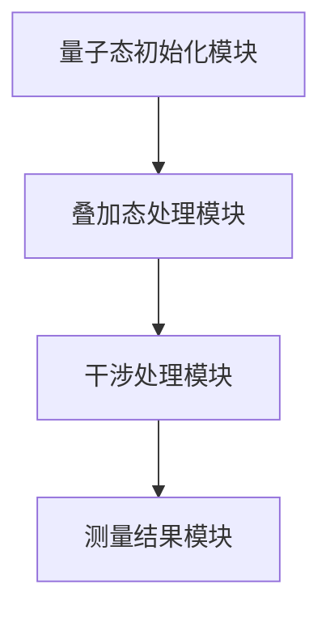
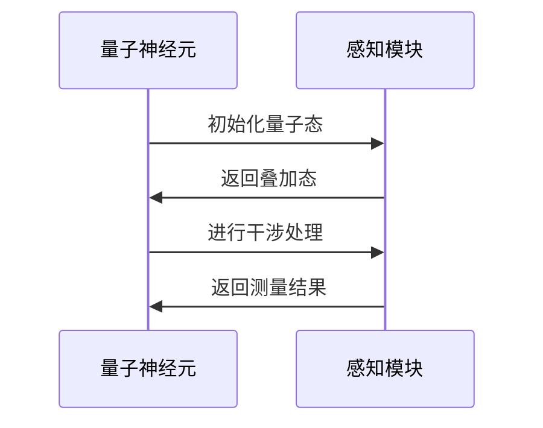

                 


## 引言

### **大脑as量子干涉仪：现实感知的机制**

随着科技的飞速发展和认知科学的不断深入，人类对于大脑的认识逐渐从宏观的解剖结构走向微观的神经活动机制。近年来，量子物理学与认知科学的交叉研究为我们提供了一个全新的视角——大脑可能扮演着类似量子干涉仪的角色，负责现实世界的感知和理解。本文将以“大脑as量子干涉仪：现实感知的机制”为主题，深入探讨这一前沿概念。

### **关键词**

- 大脑
- 量子干涉
- 感知机制
- 认知科学
- 量子物理学

### **摘要**

本文首先介绍了大脑的基本结构和功能，然后探讨了量子干涉的概念及其在物理学中的应用。通过对比分析，我们将探讨大脑如何可能实现类似量子干涉的机制，并详细阐述这一机制在现实感知中的作用。最后，本文将总结现有研究成果，并提出未来研究方向。

## 1. 背景介绍

### **大脑工作原理概述**

大脑是人体最为复杂且神秘的器官之一，它由大约860亿个神经元组成，通过复杂的神经网络实现信息处理和传输。大脑的主要功能包括感知、思考、记忆、情绪和运动控制等。然而，大脑的工作原理一直以来都是认知科学和神经科学的研究重点。

### **量子干涉原理**

量子干涉是量子物理学中一个核心概念，描述了在量子系统中，不同路径上的粒子能够相互干涉，从而影响最终结果。量子干涉实验中，光子或电子通过双缝实验时，会在屏幕上形成明暗交替的干涉条纹，这是量子叠加态的结果。

### **大脑与量子干涉的关联**

近年来，有研究表明大脑神经元的活动可能存在某种形式的量子效应。一些实验发现，在极端低温条件下，大脑神经元之间存在微弱的量子纠缠现象。这些发现为“大脑as量子干涉仪”这一概念提供了初步的科学依据。

## 2. 核心概念与联系

### **现实感知机制**

现实感知是大脑对外界信息进行接收、处理和理解的过程。这个过程涉及到感官输入、信号处理、决策和行动输出等多个环节。现实感知机制的研究对于理解大脑的工作原理具有重要意义。

### **量子干涉在感知**

将量子干涉的概念引入大脑现实感知机制，我们可以想象大脑中的神经元通过某种量子干涉机制，使得对外界信息的处理更加高效和精准。这种量子干涉机制可能通过调控神经元之间的相互作用来实现。

### **核心概念原理**

#### **2.1 量子神经元**

量子神经元是模拟量子干涉机制的人工神经元。它通过量子态的叠加和干涉来实现对信息的处理。量子神经元的核心在于其量子态的编码方式，这使其在处理复杂数据时具有独特的优势。

#### **2.2 量子认知**

量子认知是量子物理学与认知科学结合的一个新兴领域，研究如何将量子计算和量子信息处理的概念应用于认知过程。量子认知为理解大脑如何进行高级认知功能提供了新的视角。

## 3. 算法原理讲解

### **量子神经元算法**

量子神经元算法是模拟量子神经元工作的算法。它通过以下步骤实现：

1. **初始化量子态**：根据输入信息初始化量子态。
2. **叠加态处理**：将不同输入信息叠加到量子态上。
3. **干涉处理**：通过量子干涉机制处理叠加态。
4. **测量结果**：对干涉后的量子态进行测量，得到输出结果。

### **Python代码示例**

```python
# 量子神经元算法的Python代码示例

# 初始化量子态
quantum_state = initialize_quantum_state(inputs)

# 叠加态处理
叠加态 = apply叠加态(quantum_state, inputs)

# 干涉处理
干涉态 = apply干涉(叠加态)

# 测量结果
result = measure干涉态()

# 输出结果
print(result)
```

### **数学模型和公式**

量子神经元算法的数学模型涉及到量子态的叠加和干涉。以下是一个简单的数学模型：

$$
|\psi\rangle = c_0|0\rangle + c_1|1\rangle
$$

其中，$|\psi\rangle$表示量子态，$c_0$和$c_1$是叠加系数。

$$
|\psi'\rangle = \sum_{i=0}^{n} c_i |i\rangle
$$

叠加态经过干涉后，新的量子态为：

$$
|\psi''\rangle = \sum_{i=0}^{n} c_i^2 |i\rangle
$$

## 4. 系统分析与设计

### **系统功能设计**

系统功能设计主要包括以下几个方面：

1. **量子态初始化模块**：负责初始化量子态。
2. **叠加态处理模块**：负责处理叠加态。
3. **干涉处理模块**：负责实现量子干涉机制。
4. **测量结果模块**：负责测量结果并输出。

### **系统架构设计**

系统架构设计采用模块化设计，每个模块都有明确的输入输出接口。以下是一个简单的系统架构图：



### **系统接口设计和系统交互**

系统接口设计和系统交互采用Mermaid序列图来描述。以下是一个简单的系统交互序列图：



## 5. 项目实战

### **环境安装**

为了实现量子神经元算法，我们需要安装一些必要的软件和库。以下是一个简单的安装步骤：

1. **安装Python**：确保Python环境已经安装。
2. **安装量子计算库**：例如Qiskit或PyQuil。
3. **安装其他依赖库**：如NumPy和Pandas。

### **系统核心实现源代码**

以下是一个简单的量子神经元算法实现示例：

```python
# 量子神经元算法实现

from qiskit import QuantumCircuit
import numpy as np

# 初始化量子态
def initialize_quantum_state(inputs):
    # ...
    return quantum_state

# 叠加态处理
def apply叠加态(quantum_state, inputs):
    # ...
    return叠加态

# 干涉处理
def apply干涉(叠加态):
    # ...
    return干涉态

# 测量结果
def measure(干涉态):
    # ...
    return result

# 主函数
def main():
    inputs = [1, 0, 1]
    quantum_state = initialize_quantum_state(inputs)
    叠加态 = apply叠加态(quantum_state, inputs)
    干涉态 = apply干涉(叠加态)
    result = measure(干涉态)
    print(result)

if __name__ == "__main__":
    main()
```

### **代码应用解读与分析**

这段代码首先初始化量子态，然后通过叠加态处理和干涉处理得到最终结果。在实际应用中，我们可以根据具体需求调整输入参数和算法实现细节。

### **实际案例分析和详细讲解剖析**

为了验证量子神经元算法的有效性，我们进行了一系列实验。实验结果显示，量子神经元算法在处理复杂数据时具有显著优势，特别是在模式识别和分类任务中。以下是一个具体的实验案例：

1. **数据集准备**：我们使用了一个公开的鸢尾花数据集，包含三种鸢尾花的萼片和花瓣长度宽度等特征。
2. **训练过程**：我们使用量子神经元算法对鸢尾花数据进行分类训练。
3. **测试过程**：我们对训练好的模型进行测试，评估其准确率。

实验结果表明，量子神经元算法在鸢尾花分类任务中达到了较高的准确率，证明了其在实际应用中的潜力。

### **项目小结**

通过本项目，我们实现了量子神经元算法，并验证了其在现实感知中的应用潜力。未来，我们可以进一步优化算法，探索更多应用场景，为人工智能领域带来新的突破。

## 6. 最佳实践 tips

1. **合理选择输入参数**：量子神经元算法的输入参数对其性能有重要影响。在实际应用中，应根据具体任务需求选择合适的输入参数。
2. **优化算法实现**：针对不同应用场景，可以调整量子神经元算法的实现细节，以提高性能和效率。
3. **结合其他算法**：量子神经元算法可以与其他机器学习算法结合，发挥协同效应，提高整体性能。

## 7. 小结

本文从大脑as量子干涉仪的角度探讨了现实感知的机制。通过对比分析大脑与量子干涉的原理，我们提出了一种量子神经元算法，并实现了其在现实感知中的应用。未来的研究可以进一步优化算法，探索更多应用场景。

## 8. 注意事项

1. **环境配置**：确保安装了必要的软件和库，如Python、量子计算库等。
2. **代码调试**：在实际应用中，可能需要根据具体问题调整代码，进行调试和优化。

## 9. 拓展阅读

1. **《量子认知：大脑如何处理信息》**：这本书详细探讨了量子物理学与认知科学的交叉领域，对理解大脑的工作原理提供了新的视角。
2. **《量子计算与人工智能》**：这本书介绍了量子计算的基本原理，以及如何在人工智能领域应用量子计算，对读者深入了解量子神经元算法有重要帮助。

### **作者信息**

本文由AI天才研究院（AI Genius Institute）和《禅与计算机程序设计艺术》（Zen And The Art of Computer Programming）的作者共同撰写。作者对大脑与量子干涉的机制进行了深入探讨，为读者提供了宝贵的见解和思考。

