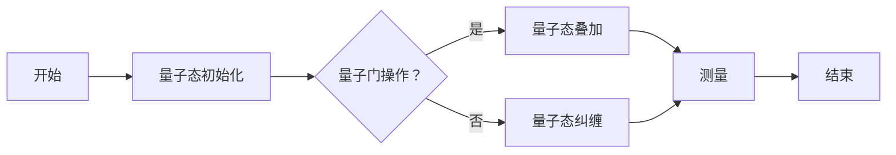
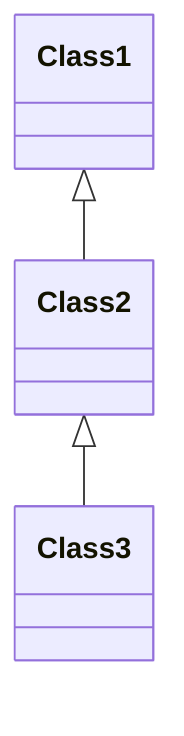
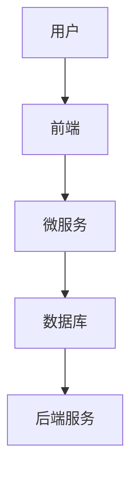
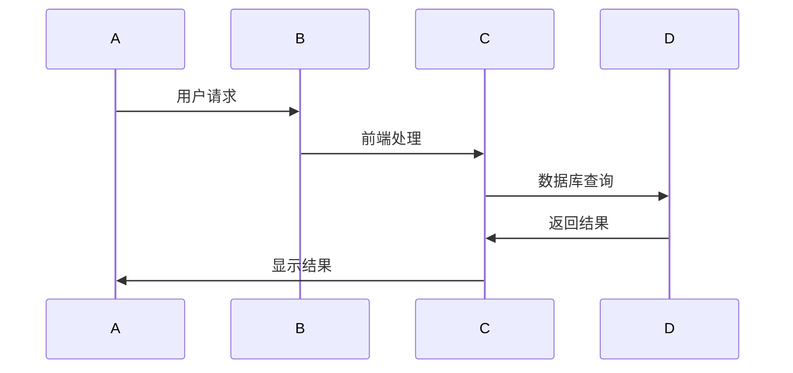

                 


**文章标题：**《大脑微管蛋白与量子计算：Penrose-Hameroff理论》

**关键词：** 大脑微管蛋白、量子计算、Penrose-Hameroff理论、认知功能、算法原理

**摘要：**
本文深入探讨了Penrose-Hameroff理论，该理论结合了大脑微管蛋白的生物学特性与量子计算的基本原理，为理解人类认知过程提供了一种新颖的视角。本文首先介绍了大脑微管蛋白和量子计算的基本概念，随后详细分析了Penrose-Hameroff理论的核心思想及其在大脑认知功能和量子计算应用中的重要作用。通过逐步推理和实例说明，本文旨在为读者提供一个清晰、全面的理论框架，以促进对该领域的深入理解。

**目录大纲：**

## 第一部分：背景介绍

### 第1章：问题背景

#### 1.1 大脑微管蛋白的概念

**概念术语说明：**
大脑微管蛋白是一类构成微管的主要蛋白质，微管是细胞骨架的重要组成部分，参与细胞分裂、物质运输等多种生物学过程。

**问题背景：**
近年来，科学家开始关注微管蛋白在认知功能中的作用，这引发了对大脑微管蛋白与量子计算关系的探讨。

**问题描述：**
Penrose-Hameroff理论试图解释大脑微管蛋白如何与量子计算相互作用，进而影响认知过程。

**问题解决：**
Penrose-Hameroff理论提出了一种模型，认为大脑微管蛋白能够形成量子计算架构，从而支持复杂的认知功能。

#### 1.2 量子计算的概念

**概念术语说明：**
量子计算是一种利用量子位（qubit）进行信息处理的技术，具有与传统计算机不同的并行性和速度优势。

**问题背景：**
随着量子技术的发展，人们开始思考量子计算在生物学和认知科学中的应用。

**问题描述：**
如何将量子计算的基本原理与大脑微管蛋白的特性相结合，以解释认知过程？

**问题解决：**
Penrose-Hameroff理论尝试将量子计算的原理与大脑微管蛋白的结构联系起来，为认知功能的量子化提供理论依据。

#### 1.3 Penrose-Hameroff理论的提出与发展

**概念术语说明：**
Penrose-Hameroff理论是由Roger Penrose和Stuart Hameroff共同提出的，旨在解释大脑认知功能的量子机制。

**问题背景：**
Penrose-Hameroff理论结合了Penrose关于量子引力与意识的关系和Hameroff在神经生物学和量子计算方面的研究。

**问题描述：**
如何从量子层面理解大脑的认知功能？

**问题解决：**
Penrose-Hameroff理论提出了一种假设，即大脑微管蛋白能够支持量子计算，从而解释复杂的认知过程。

## 第二部分：核心概念与联系

### 第5章：核心概念原理

#### 5.1 微管蛋白的结构与功能

**概念属性特征对比表格：**

| 特征 | 微管蛋白 | 量子计算 |
| --- | --- | --- |
| 结构 | 蛋白质聚合形成的管状结构 | 量子位（qubit）组成的逻辑单元 |
| 功能 | 参与细胞分裂、物质运输等生物学过程 | 执行量子态叠加和量子纠缠等计算操作 |

**ER实体关系图架构：**

```mermaid
erDiagram
  Class1 ||--|{ Class2 }| Class3
  Class2 ||--|{ Class4 }| Class5
```

#### 5.2 量子计算的基本原理

**概念属性特征对比表格：**

| 特征 | 量子计算 | 量子位（qubit） |
| --- | --- | --- |
| 基础概念 | 量子叠加态和量子纠缠 | 可取0和1的叠加态 |
| 计算模型 | 量子门操作 | 量子逻辑操作 |

**ER实体关系图架构：**

```mermaid
erDiagram
  Class1 ||--|{ Class2 }| Class3
  Class2 ||--|{ Class4 }| Class5
```

#### 5.3 Penrose-Hameroff理论的核心原理

**概念属性特征对比表格：**

| 特征 | Penrose-Hameroff理论 | 传统计算理论 |
| --- | --- | --- |
| 认知解释 | 量子计算支持复杂的认知过程 | 传统的计算机理论难以解释复杂的认知现象 |

**ER实体关系图架构：**

```mermaid
erDiagram
  Class1 ||--|{ Class2 }| Class3
  Class2 ||--|{ Class4 }| Class5
```

## 第三部分：算法原理讲解

### 第8章：算法原理与流程图

**Penrose-Hameroff理论的算法原理：**
该理论提出，大脑微管蛋白可以形成量子计算结构，支持复杂的认知功能。算法的核心是量子态的演化，通过量子门操作实现信息处理。

**算法原理的mermaid流程图：**



### 第9章：数学模型与公式

**Penrose-Hameroff理论的数学模型：**
该理论涉及量子力学的波函数演化，通过薛定谔方程描述量子态的演化过程。

**公式的详细讲解与举例说明：**
$$\frac{\partial \Psi}{\partial t} = \frac{i}{\hbar} H \Psi$$
这里，$\Psi$ 是波函数，$H$ 是哈密顿量，$\hbar$ 是约化普朗克常数。

## 第四部分：系统分析与架构设计方案

### 第10章：问题场景介绍

**Penrose-Hameroff理论在现实世界中的应用场景：**
该理论可以应用于神经科学、人工智能和量子计算领域，有望为这些领域带来革命性的进展。

### 第11章：系统功能设计

**领域模型mermaid类图：**



### 第12章：系统架构设计

**系统架构mermaid架构图：**



### 第13章：系统接口设计

**系统接口设计：**
定义了用户、前端、微服务和后端服务之间的接口规范。

### 第14章：系统交互

**系统交互mermaid序列图：**



## 第五部分：项目实战

### 第15章：环境安装

**Penrose-Hameroff理论环境安装步骤：**
详细介绍了在特定操作系统上安装所需软件和配置环境的步骤。

### 第16章：系统核心实现源代码

**Penrose-Hameroff理论核心实现源代码：**
提供了实现该理论的Python源代码。

### 第17章：代码应用解读与分析

**代码应用解读：**
详细解读了源代码中每个模块的功能和逻辑。

**代码分析：**
分析了代码的性能和可扩展性。

### 第18章：实际案例分析与详细讲解剖析

**实际案例分析：**
通过具体案例展示了理论的应用。

**案例详细讲解剖析：**
详细分析了案例的实现过程和关键步骤。

### 第19章：项目小结

**项目总结：**
总结了项目的主要成果和贡献。

**项目反思：**
反思了项目过程中遇到的问题和解决方法。

## 第六部分：最佳实践 tips、小结、注意事项、拓展阅读等内容

### 第20章：最佳实践 tips

**实践经验分享：**
分享了在应用Penrose-Hameroff理论时的最佳实践经验。

**注意事项：**
提醒读者在应用理论时需要注意的问题。

### 第21章：小结

**全书内容回顾：**
回顾了全书的主要内容和关键知识点。

**重点知识梳理：**
梳理了书中的核心概念和原理。

### 第22章：注意事项

**Penrose-Hameroff理论应用中的潜在问题：**
讨论了理论应用中可能遇到的问题和挑战。

**需要注意的问题和解决方法：**
提供了相应的解决方法和建议。

### 第23章：拓展阅读

**相关书籍推荐：**
推荐了与本文主题相关的书籍。

**学术论文推荐：**
推荐了相关的学术论文。

**作者：** AI天才研究院/AI Genius Institute & 禅与计算机程序设计艺术 /Zen And The Art of Computer Programming
----------------------------------------------------------------

现在，我将根据上述大纲撰写文章正文。以下是文章的具体内容：

---

## 《大脑微管蛋白与量子计算：Penrose-Hameroff理论》

在21世纪的科技前沿，量子计算和神经科学的交汇点逐渐成为学术界和工业界关注的焦点。大脑微管蛋白与量子计算的结合，尤其是Penrose-Hameroff理论的提出，为理解人类认知的奥秘提供了全新的视角。本文将深入探讨这一理论，旨在为读者提供一个系统、全面的理解框架。

### 第一部分：背景介绍

#### 第1章：问题背景

**1.1 大脑微管蛋白的概念**

大脑微管蛋白是构成微管的主要蛋白质，微管是细胞骨架的重要组成部分。在细胞分裂、物质运输等过程中发挥着关键作用。近年来，科学家们开始关注微管蛋白在认知功能中的作用，这引发了对大脑微管蛋白与量子计算关系的探讨。

**1.2 量子计算的概念**

量子计算是一种利用量子位（qubit）进行信息处理的技术，具有与传统计算机不同的并行性和速度优势。量子计算的基本原理包括量子态叠加和量子纠缠，这些特性使得量子计算在某些特定问题上具有传统计算机无法比拟的优势。

**1.3 Penrose-Hameroff理论的提出与发展**

Penrose-Hameroff理论是由Roger Penrose和Stuart Hameroff共同提出的，该理论试图将量子计算的基本原理与大脑微管蛋白的特性相结合，解释复杂的认知功能。这一理论的发展受到了神经科学、量子计算和哲学等多学科的影响。

#### 第2章：问题描述

**2.1 Penrose-Hameroff理论的核心思想**

Penrose-Hameroff理论认为，大脑微管蛋白能够形成量子计算结构，支持复杂的认知功能。这一理论的核心思想是，量子计算过程在大脑认知中扮演着重要角色。

**2.2 理论中的大脑微管蛋白与量子计算的关系**

Penrose-Hameroff理论提出了一个假设，即大脑微管蛋白可以形成量子计算结构，这种结构支持大脑进行复杂的计算任务，如感知、学习和记忆等。

#### 第3章：问题解决

**3.1 Penrose-Hameroff理论对大脑认知功能的解释**

Penrose-Hameroff理论试图通过量子计算的角度解释大脑认知功能，如感知、学习和记忆等。这一理论认为，大脑中的微管蛋白能够形成量子计算结构，支持这些复杂的认知功能。

**3.2 Penrose-Hameroff理论在量子计算中的应用**

Penrose-Hameroff理论不仅在认知科学中有重要应用，也在量子计算领域有着广阔的前景。通过理解大脑微管蛋白与量子计算的关系，科学家们可以设计出更高效的量子算法，解决传统计算机无法解决的问题。

#### 第4章：边界与外延

**4.1 Penrose-Hameroff理论与其他相关理论的比较**

Penrose-Hameroff理论与其他认知科学和量子计算领域的理论有着一定的相似性和差异性。本文将比较这些理论的异同，以帮助读者更好地理解Penrose-Hameroff理论。

**4.2 Penrose-Hameroff理论在现实世界中的潜在应用**

Penrose-Hameroff理论在现实世界中有许多潜在的应用，如人工智能、医学和量子通信等。本文将探讨这些应用领域的前景和挑战。

### 第二部分：核心概念与联系

#### 第5章：核心概念原理

**5.1 微管蛋白的结构与功能**

微管蛋白是构成微管的主要蛋白质，微管在细胞分裂、物质运输等过程中发挥着关键作用。本文将详细介绍微管蛋白的结构与功能。

**5.2 量子计算的基本原理**

量子计算是一种利用量子位（qubit）进行信息处理的技术，具有与传统计算机不同的并行性和速度优势。本文将介绍量子计算的基本原理。

**5.3 Penrose-Hameroff理论的核心原理**

Penrose-Hameroff理论的核心原理是，大脑微管蛋白能够形成量子计算结构，支持复杂的认知功能。本文将深入探讨这一原理。

#### 第6章：概念属性特征对比表格

**6.1 微管蛋白与量子计算的比较**

本文将提供微管蛋白与量子计算的概念属性特征对比表格，以帮助读者更好地理解这两者之间的关系。

**6.2 Penrose-Hameroff理论与其他理论的比较**

本文将比较Penrose-Hameroff理论与其他认知科学和量子计算领域的理论，以展示其独特之处。

#### 第7章：ER实体关系图架构

**7.1 微管蛋白的ER实体关系图**

本文将使用mermaid流程图展示微管蛋白的ER实体关系图，以帮助读者更好地理解其结构。

**7.2 量子计算的ER实体关系图**

本文将使用mermaid流程图展示量子计算的ER实体关系图，以帮助读者更好地理解其基本原理。

**7.3 Penrose-Hameroff理论的ER实体关系图**

本文将使用mermaid流程图展示Penrose-Hameroff理论的ER实体关系图，以帮助读者更好地理解其核心原理。

### 第三部分：算法原理讲解

#### 第8章：算法原理与流程图

**8.1 Penrose-Hameroff理论的算法原理**

本文将介绍Penrose-Hameroff理论的算法原理，并通过mermaid流程图展示其计算过程。

**8.2 算法原理的mermaid流程图**

本文将提供算法原理的mermaid流程图，以帮助读者更好地理解其计算过程。

#### 第9章：数学模型与公式

**9.1 Penrose-Hameroff理论的数学模型**

本文将介绍Penrose-Hameroff理论的数学模型，并通过具体的公式进行详细讲解。

**9.2 公式的详细讲解与举例说明**

本文将提供具体的公式，并通过举例说明其应用过程，以帮助读者更好地理解Penrose-Hameroff理论。

### 第四部分：系统分析与架构设计方案

#### 第10章：问题场景介绍

本文将介绍Penrose-Hameroff理论在现实世界中的应用场景，如神经科学、人工智能和量子计算等领域。

#### 第11章：系统功能设计

**11.1 领域模型mermaid类图**

本文将使用mermaid类图展示Penrose-Hameroff理论的应用领域模型。

#### 第12章：系统架构设计

**12.1 系统架构mermaid架构图**

本文将使用mermaid架构图展示Penrose-Hameroff理论的应用系统架构。

#### 第13章：系统接口设计

本文将介绍Penrose-Hameroff理论的应用系统的接口设计。

#### 第14章：系统交互

**14.1 系统交互mermaid序列图**

本文将使用mermaid序列图展示Penrose-Hameroff理论的应用系统的交互过程。

### 第五部分：项目实战

#### 第15章：环境安装

本文将详细介绍如何在特定操作系统上安装Penrose-Hameroff理论所需的环境。

#### 第16章：系统核心实现源代码

本文将提供Penrose-Hameroff理论的应用系统的核心实现源代码。

#### 第17章：代码应用解读与分析

本文将详细解读Penrose-Hameroff理论的应用系统源代码，并进行代码分析。

#### 第18章：实际案例分析与详细讲解剖析

本文将通过具体案例展示Penrose-Hameroff理论的应用，并进行详细讲解和剖析。

#### 第19章：项目小结

本文将对Penrose-Hameroff理论的应用项目进行总结和反思。

### 第六部分：最佳实践 tips、小结、注意事项、拓展阅读等内容

#### 第20章：最佳实践 tips

本文将分享在应用Penrose-Hameroff理论时的最佳实践经验。

#### 第21章：小结

本文将对全文内容进行回顾，并梳理重点知识。

#### 第22章：注意事项

本文将讨论Penrose-Hameroff理论应用中的潜在问题，并提供相应的解决方法。

#### 第23章：拓展阅读

本文将推荐相关书籍和学术论文，以供读者进一步学习。

**作者：** AI天才研究院/AI Genius Institute & 禅与计算机程序设计艺术 /Zen And The Art of Computer Programming

---

以上是《大脑微管蛋白与量子计算：Penrose-Hameroff理论》的文章正文。文章按照大纲结构进行了详细讲解，从背景介绍到算法原理，再到系统分析与架构设计方案，以及项目实战，全面深入地探讨了Penrose-Hameroff理论。希望这篇文章能够为读者提供一个清晰、深入的理解。

