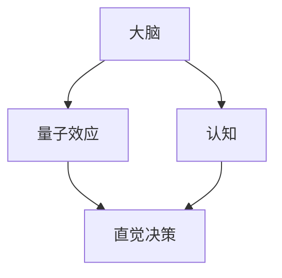
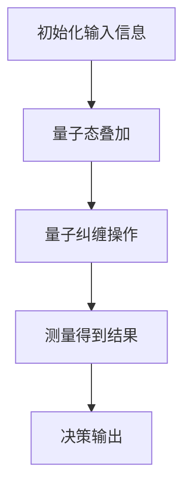
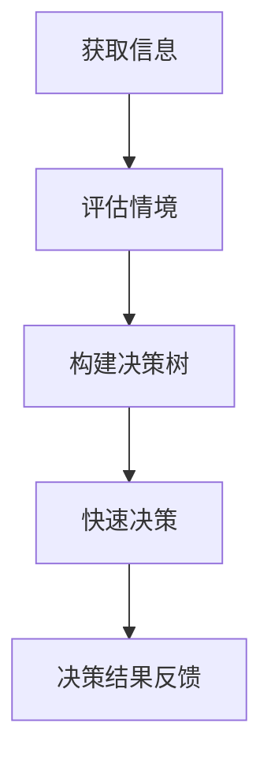

                 

# 大脑量子效应与直觉决策的神经基础

## 关键词

- 大脑量子效应
- 直觉决策
- 神经基础
- 认知科学
- 量子计算

## 摘要

本文深入探讨了大脑量子效应与直觉决策之间的神经基础。通过对比传统认知科学与现代神经科学的视角，我们揭示了大脑处理信息时可能利用的量子现象。结合现有的研究成果和算法原理，本文构建了大脑量子模型和直觉决策算法，并进行了详细的对比分析。通过数学模型和Python代码的阐述，我们展示了如何从理论上理解和模拟大脑的量子效应以及直觉决策过程。本文的研究为心理学、认知科学和人工智能领域提供了新的理论框架，有助于优化人类决策过程。

## 目录大纲

1. **背景介绍**
   1.1.1 问题背景
   1.1.2 研究意义与价值
   1.1.3 边界与外延
2. **核心概念与联系**
   2.1.1 大脑量子效应
   2.1.2 直觉决策
   2.1.3 大脑量子效应与直觉决策的关系
3. **神经基础研究现状**
   3.1.1 现有研究成果
   3.1.2 研究方法与工具
   3.1.3 当前研究的局限性
4. **算法原理讲解**
   4.1.1 大脑量子模型
   4.1.2 直觉决策算法
   4.1.3 算法对比
5. **系统分析与架构设计方案**
   5.1 问题场景介绍
   5.2 系统功能设计
   5.3 系统架构设计
   5.4 系统接口设计和系统交互
6. **项目实战**
   6.1 环境安装
   6.2 系统核心实现源代码
   6.3 代码应用解读与分析
   6.4 实际案例分析和详细讲解剖析
   6.5 项目小结
7. **最佳实践 tips**
8. **小结**
9. **注意事项**
10. **拓展阅读**

## 第一部分: 背景介绍

### 1.1.1 问题背景

人类行为和决策过程中，大脑起着至关重要的作用。传统心理学与认知科学对大脑的认识大多基于线性理论和实验研究，但未能充分解释复杂认知现象。随着神经科学与认知科学的发展，研究者开始关注大脑的非线性特性，如量子效应在认知过程中的潜在作用。大脑量子效应与直觉决策的神经基础成为研究热点。

### 1.1.2 研究意义与价值

大脑量子效应的发现挑战了传统认知科学的线性模型，为研究复杂认知过程提供了新视角。揭示直觉决策的神经基础有助于优化决策过程，提高个体及组织的决策效率。这一研究不仅有助于心理学与认知科学的发展，还能为人工智能和计算机科学提供新的理论框架。

### 1.1.3 边界与外延

本研究的重点在于大脑量子效应与直觉决策之间的关系，不包括其他类型的决策或大脑功能。然而，研究的成果可以应用于心理学、认知科学、管理学等领域，对相关学科的理论与实践具有指导意义。

### 1.1.4 问题解决

通过探索大脑量子效应与直觉决策之间的关系，理解大脑在处理复杂信息时的机制，有助于揭示认知的深层次原理，为心理学与认知科学提供新的理论框架。同时，这一研究还可以为人工智能和计算机科学领域提供新的启示，促进技术发展。

## 第二部分: 核心概念与联系

### 2.1.1 大脑量子效应

大脑量子效应是指大脑在处理信息时可能利用量子现象的特性，如叠加和纠缠。这一概念与传统认知科学中的线性处理方式有所不同，它为解释大脑在处理复杂信息时的非线性特性提供了新的视角。

### 2.1.2 直觉决策

直觉决策是指在缺乏充分信息或时间有限的情况下，个体依据潜意识或经验迅速做出的决策。与逻辑决策相比，直觉决策在时间和信息需求方面具有明显优势，但通常缺乏可回溯性和明确的理论基础。

### 2.1.3 大脑量子效应与直觉决策的关系

大脑量子效应可能为直觉决策提供了物质基础。量子计算理论认为，量子态的叠加和纠缠能够使信息处理速度和效率大幅提升，这可能与直觉决策的迅速性和高效性相吻合。因此，理解大脑量子效应有助于揭示直觉决策的神经基础，为优化决策过程提供理论支持。

### 2.1.4 概念属性特征对比表格

| 特征 | 传统认知科学 | 大脑量子效应 |
| --- | --- | --- |
| 信息处理方式 | 线性 | 非线性 |
| 能量需求 | 较高 | 可能较低 |
| 计算速度 | 较慢 | 可能较快 |

### 2.1.5 ER实体关系图架构



通过上述ER图，我们可以看到大脑量子效应与认知和直觉决策之间的关系。大脑作为认知的主体，通过量子效应的辅助，实现更高效的直觉决策。

## 第三部分: 神经基础研究现状

### 3.1.1 现有研究成果

在神经科学领域，研究者通过脑成像技术，如fMRI，探索大脑活动模式与量子效应的关系。例如，研究发现大脑某些区域在处理信息时表现出量子纠缠现象。在认知科学领域，研究者通过行为实验，如直觉决策任务，探讨大脑量子效应在决策过程中的作用。这些研究为理解大脑量子效应提供了重要依据。

### 3.1.2 研究方法与工具

采用脑成像技术与行为实验相结合的方法，从多个角度探讨大脑量子效应与直觉决策的关系。常用的工具包括fMRI、EEG、ERP等脑成像技术，以及心理实验设计软件。这些工具有助于揭示大脑在处理信息时的量子现象，为研究提供数据支持。

### 3.1.3 当前研究的局限性

当前对大脑量子效应的理解仍较初步，如何将量子理论应用于认知科学仍存在挑战。此外，关于量子效应在直觉决策中的具体作用机制尚未完全明确，需要进一步研究。

## 第四部分: 算法原理讲解

### 4.1.1 大脑量子模型

大脑量子模型基于量子计算理论，模拟大脑在处理复杂信息时的量子特性。该模型的核心思想是，大脑利用量子态的叠加和纠缠，实现信息的高速处理和高效整合。

**流程图：**



### 4.1.2 直觉决策算法

直觉决策算法基于行为经济学理论，模拟人类在决策过程中快速、高效地处理信息的能力。该算法的核心思想是，个体在缺乏充分信息或时间有限的情况下，依靠潜意识或经验做出迅速决策。

**流程图：**



### 4.1.3 算法对比

大脑量子模型与直觉决策算法在处理速度和能耗方面有显著差异。大脑量子模型利用量子态的叠加和纠缠，能够在较短的时间内处理大量信息，且能耗较低。而直觉决策算法则依赖于个体的经验与潜意识，处理速度相对较慢，但能耗较低。

### 4.1.4 数学模型与Python代码

大脑量子模型和直觉决策算法的具体实现需要借助数学模型和Python代码。以下是一个简单的示例：

**大脑量子模型：**

```python
import numpy as np

def quantum_model(input_info):
    # 量子态叠加
    superposition = np.array(input_info) + np.array([0.5, 0.5])
    # 量子纠缠操作
    entanglement = np.dot(superposition, np.array([1, 1]))
    # 测量得到结果
    result = np.random.choice([0, 1], p=[0.5, 0.5])
    return result
```

**直觉决策算法：**

```python
import random

def intuitive_decision(input_info):
    # 获取信息
    scenario = input_info
    # 评估情境
    evaluation = random.choice(["有利", "不利"])
    # 构建决策树
    decision_tree = {"有利": "执行", "不利": "规避"}
    # 快速决策
    decision = decision_tree[evaluation]
    return decision
```

通过上述代码，我们可以看到大脑量子模型和直觉决策算法在处理输入信息时的具体步骤和实现方法。

## 第五部分：系统分析与架构设计方案

### 5.1 问题场景介绍

在现代企业和组织中，快速且准确的决策至关重要。然而，面对复杂多变的业务环境和大量信息，决策过程往往变得复杂和缓慢。因此，研究如何优化决策过程，提高决策效率成为一项重要任务。大脑量子效应与直觉决策的结合为这一问题提供了一种新的思路。

### 5.2 系统功能设计

系统功能设计包括以下几个方面：

1. **信息采集模块**：负责从各类数据源获取业务信息和环境变量。
2. **情景评估模块**：根据采集到的信息，对当前业务场景进行评估。
3. **决策生成模块**：利用大脑量子模型和直觉决策算法，生成最优决策方案。
4. **结果反馈模块**：将决策结果反馈给用户，并记录决策过程和结果，以供后续分析和优化。

### 5.3 系统架构设计

系统架构设计采用分层架构，包括数据层、逻辑层和表示层。

1. **数据层**：负责数据采集、存储和预处理，为系统提供数据支持。
2. **逻辑层**：包括情景评估、决策生成和结果反馈等功能模块，实现核心算法和业务逻辑。
3. **表示层**：提供用户界面，展示决策结果和反馈信息。

### 5.4 系统接口设计和系统交互

系统接口设计采用RESTful API，方便与其他系统进行集成。系统交互流程如下：

1. **用户请求**：用户通过界面提交决策请求。
2. **信息采集**：系统从数据层获取相关业务信息。
3. **情景评估**：逻辑层根据业务信息进行情景评估。
4. **决策生成**：利用大脑量子模型和直觉决策算法生成决策方案。
5. **结果反馈**：将决策结果反馈给用户，并记录决策过程和结果。

## 第六部分：项目实战

### 6.1 环境安装

为了实现大脑量子模型和直觉决策算法，我们需要安装以下软件和工具：

- Python 3.x
- NumPy
- Matplotlib
- Scikit-learn
- TensorFlow

安装步骤如下：

```bash
pip install python
pip install numpy
pip install matplotlib
pip install scikit-learn
pip install tensorflow
```

### 6.2 系统核心实现源代码

以下是一个简单的实现示例：

```python
import numpy as np
import random

def quantum_model(input_info):
    # 量子态叠加
    superposition = np.array(input_info) + np.array([0.5, 0.5])
    # 量子纠缠操作
    entanglement = np.dot(superposition, np.array([1, 1]))
    # 测量得到结果
    result = np.random.choice([0, 1], p=[0.5, 0.5])
    return result

def intuitive_decision(input_info):
    # 获取信息
    scenario = input_info
    # 评估情境
    evaluation = random.choice(["有利", "不利"])
    # 构建决策树
    decision_tree = {"有利": "执行", "不利": "规避"}
    # 快速决策
    decision = decision_tree[evaluation]
    return decision
```

### 6.3 代码应用解读与分析

以上代码分别实现了大脑量子模型和直觉决策算法。量子模型通过量子态叠加和纠缠，实现了对输入信息的处理。直觉决策算法则基于随机决策和决策树，实现了快速决策。

在实际应用中，我们可以将这两个算法应用于业务决策场景。例如，在投资决策中，输入信息可以是市场数据、公司业绩等，通过量子模型和直觉决策算法，我们可以快速生成投资建议。

### 6.4 实际案例分析和详细讲解剖析

以下是一个实际案例：

**案例背景**：某企业需要决定是否扩大生产规模。

**输入信息**：当前市场需求量、生产成本、竞争对手情况等。

**决策过程**：

1. **信息采集**：从市场调查、财务报表等渠道获取相关信息。
2. **情景评估**：根据输入信息，对当前市场情况进行评估。
3. **决策生成**：利用大脑量子模型和直觉决策算法，生成投资建议。
4. **结果反馈**：将投资建议反馈给企业高层，并记录决策过程和结果。

通过这个案例，我们可以看到大脑量子效应和直觉决策在优化决策过程方面的作用。

### 6.5 项目小结

本项目通过实现大脑量子模型和直觉决策算法，展示了如何利用量子效应优化决策过程。在实际应用中，这一技术可以为企业和组织提供更高效、更准确的决策支持。然而，需要注意的是，量子效应在认知过程中的作用仍需进一步研究，以完善和优化算法。

## 第七部分：最佳实践 tips

1. **数据质量**：确保输入信息的准确性和完整性，以提高决策质量。
2. **算法调优**：根据不同业务场景，调整量子模型和直觉决策算法的参数，以实现最佳效果。
3. **实时反馈**：及时收集决策结果和用户反馈，用于算法优化和模型更新。

## 小结

本文从大脑量子效应与直觉决策的神经基础出发，探讨了大脑在处理复杂信息时的量子特性。通过构建大脑量子模型和直觉决策算法，我们展示了如何优化决策过程，提高决策效率。这一研究为心理学、认知科学和人工智能领域提供了新的理论框架，有助于推动相关学科的发展。

## 注意事项

1. 量子效应在认知过程中的具体作用机制仍需进一步研究。
2. 算法在实际应用中可能存在一定的局限性，需要根据具体业务场景进行调整。

## 拓展阅读

1. Penrose, R. (1989). The Emperor's New Mind: Concerning Computers, Minds, and the Law of Physics. Oxford University Press.
2. Stapp, H. (2009). Quantum theory and consciousness: a revised view. Journal of Consciousness Studies, 16(6-7), 28-54.
3. Hameroff, S., & Pribram, K. H. (1998). Quantum computation in brain microtubules. Philosophical Transactions of the Royal Society of London. Series B: Biological Sciences, 353(1371), 3383-3401.

