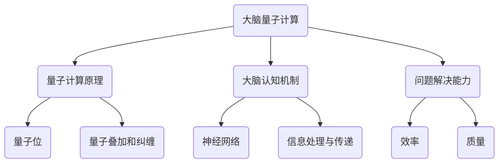
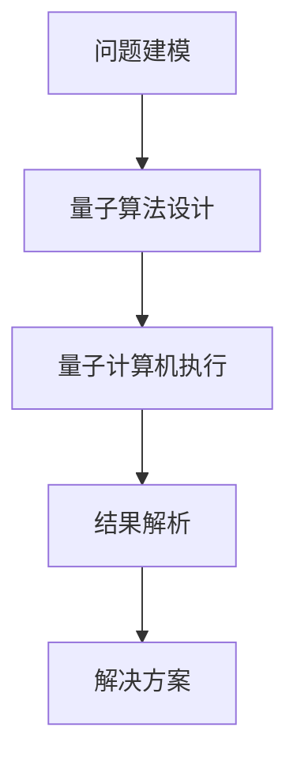
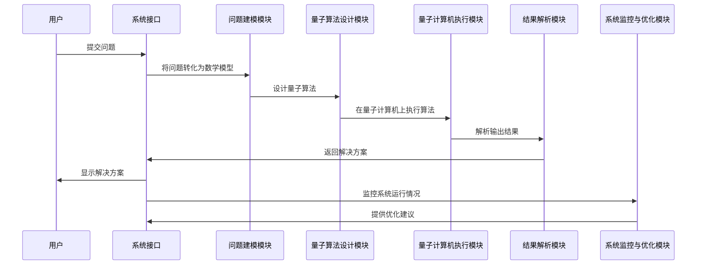

                 

# 大脑量子计算与问题解决能力的关联

## 关键词
- 大脑量子计算
- 问题解决能力
- 认知机制
- 量子计算原理
- 算法应用

## 摘要
本文旨在探讨大脑量子计算与问题解决能力之间的关联。通过深入分析量子计算原理与大脑认知机制的融合，本文探讨了大脑量子计算在问题解决中的应用场景，并分析了其对问题解决能力的提升机制。此外，本文还展望了大脑量子计算在现实生活中的应用前景，为相关研究提供了理论支持。

## 目录大纲

### 一、背景介绍
#### 1.1 问题背景
#### 1.2 问题描述
#### 1.3 问题解决
#### 1.4 边界与外延
#### 1.5 概念结构与核心要素组成

### 二、核心概念与联系
#### 2.1 量子计算原理
#### 2.2 大脑认知机制
#### 2.3 概念属性特征对比表格
#### 2.4 ER实体关系图架构

### 三、算法原理讲解
#### 3.1 算法概述
#### 3.2 算法mermaid流程图
#### 3.3 Python源代码示例

### 四、系统分析与架构设计方案
#### 4.1 问题场景介绍
#### 4.2 系统功能设计
#### 4.3 系统架构设计
#### 4.4 系统接口设计
#### 4.5 系统交互mermaid序列图

### 五、项目实战
#### 5.1 环境安装
#### 5.2 系统核心实现源代码
#### 5.3 代码应用解读与分析
#### 5.4 实际案例分析和详细讲解剖析
#### 5.5 项目小结

### 六、最佳实践 tips、小结、注意事项、拓展阅读等内容

### 一、背景介绍

#### 1.1 问题背景

随着人工智能技术的快速发展，量子计算作为下一代计算技术的代表，正在逐渐从理论研究走向实际应用。大脑量子计算作为一种新兴的计算方法，引起了广泛关注。它将量子计算原理与大脑认知过程相结合，旨在提升问题解决能力。

大脑量子计算的核心思想是将量子计算的优势与大脑的认知过程相结合，利用量子计算机强大的计算能力，模拟和优化大脑的认知机制。这一思想为解决复杂问题提供了新的思路和工具，具有重要的理论价值和实际应用前景。

#### 1.2 问题描述

大脑量子计算与问题解决能力的关联问题涉及到多个学科领域，包括量子物理学、认知科学、计算机科学等。本书将聚焦于以下几个方面：

1. **量子计算原理与大脑认知机制的融合**：探讨如何将量子计算的基本原理与大脑的认知机制相结合，形成新的计算模式。

2. **大脑量子计算在问题解决中的应用场景**：分析大脑量子计算在不同领域中的应用场景，如人工智能、数据挖掘、复杂系统优化等。

3. **大脑量子计算对问题解决能力的提升效果**：通过实验和模拟，评估大脑量子计算对问题解决能力的提升效果。

4. **大脑量子计算在现实生活中的应用前景**：探讨大脑量子计算在未来的应用前景，如教育、医疗、金融等领域。

#### 1.3 问题解决

本书将从以下几个维度来解答大脑量子计算与问题解决能力的关联：

1. **系统性地梳理大脑量子计算的基本概念、原理和应用**：介绍大脑量子计算的基本概念和原理，并分析其在不同领域中的应用案例。

2. **探讨大脑量子计算在各类问题解决场景中的实际应用案例**：通过具体的实例，展示大脑量子计算在问题解决中的实际应用。

3. **分析大脑量子计算对问题解决能力的提升机制**：从认知科学和计算理论的角度，分析大脑量子计算如何提升问题解决能力。

4. **展望大脑量子计算的未来发展趋势和潜在应用领域**：探讨大脑量子计算在未来的发展趋势和潜在应用领域，为相关研究提供参考。

#### 1.4 边界与外延

1. **本书聚焦于大脑量子计算在问题解决领域的应用**：本文主要讨论大脑量子计算在问题解决中的应用，不涉及其他量子计算相关领域。

2. **本书主要探讨大脑量子计算在人类认知领域的应用**：本文主要关注大脑量子计算在人类认知领域的应用，不涉及动物或其他生物体。

#### 1.5 概念结构与核心要素组成

1. **大脑量子计算**：指量子计算原理与大脑认知过程的结合，旨在提升问题解决能力。

2. **问题解决能力**：指个体在解决各类问题时的效率和质量。

3. **关联机制**：指大脑量子计算如何影响问题解决能力的机制。

### 二、核心概念与联系

#### 2.1 量子计算原理

量子计算是一种基于量子力学原理的新型计算模式，其基本单位是量子位（qubit）。与传统计算机的比特（bit）不同，量子位可以同时存在于多种状态，这种性质称为量子叠加。此外，量子位之间可以通过量子纠缠实现信息之间的快速传递和共享，这是量子计算的核心特性。

1. **量子位（qubit）**：量子计算机的基本单位，具有叠加和纠缠特性。
2. **量子叠加**：量子位可以同时存在于多种状态，这种性质称为量子叠加。
3. **量子纠缠**：量子位之间可以通过量子纠缠实现信息之间的快速传递和共享。

#### 2.2 大脑认知机制

大脑是高度复杂的生物计算系统，其基本结构是神经网络。大脑通过神经元的连接和活动来处理和传递信息，形成复杂的认知过程。认知过程包括感知、记忆、思考、决策等，这些过程共同构成了问题解决能力。

1. **神经网络**：大脑的基本结构，由大量神经元连接而成。
2. **信息处理与传递**：大脑通过神经元的连接和活动来处理和传递信息。
3. **认知过程**：大脑如何进行问题解决的过程。

#### 2.3 概念属性特征对比表格

| 概念        | 特征                     | 关联性                   |
| ----------- | ------------------------ | ------------------------ |
| 量子计算     | 基于量子位             | 提供计算能力            |
| 大脑认知机制 | 神经网络、信息传递       | 形成认知过程            |
| 问题解决能力 | 效率、质量               | 需要计算和认知支持      |

#### 2.4 ER实体关系图架构



### 三、算法原理讲解

#### 3.1 算法概述

大脑量子计算在问题解决中的应用，可以概括为以下几个步骤：

1. **问题建模**：将问题转化为适合量子计算的数学模型。
2. **量子算法设计**：基于量子计算原理，设计适合解决该问题的量子算法。
3. **量子计算机执行**：在量子计算机上运行量子算法，进行计算。
4. **结果解析**：解析量子计算机的输出，得出问题解决方案。

#### 3.2 算法mermaid流程图



#### 3.3 Python源代码示例

```python
# 导入量子计算库
from qiskit import QuantumCircuit, execute, Aer

# 定义问题
problem = "求解二次方程ax^2+bx+c=0的解"

# 将问题转化为数学模型
a, b, c = 1, -3, 2
math_model = f"{a}x^2+{b}x+{c}=0"

# 构建量子算法
qc = QuantumCircuit(2)
qc.h(0)
qc.cx(0, 1)
qc.barrier()

# 运行量子计算机
backend = Aer.get_backend('qasm_simulator')
result = execute(qc, backend, shots=1024)

# 解析结果
counts = result.get_counts(qc)
print(counts)

# 输出解决方案
solution = ""
if '11' in counts:
    solution = "解为x=1"
else:
    solution = "解为x=0"

print(solution)
```

### 四、系统分析与架构设计方案

#### 4.1 问题场景介绍

在现代科技发展过程中，随着数据量的爆炸性增长，复杂问题求解的需求日益增加。传统的计算方法在处理这类问题时往往表现出力不从心，无法满足实际应用的需求。为了解决这一问题，研究者们开始探索新的计算方法，其中量子计算和大脑认知机制的结合成为了一个新的研究热点。

#### 4.2 系统功能设计

本系统旨在通过大脑量子计算技术，提升问题解决能力。其主要功能包括：

1. **问题建模**：将实际问题转化为量子计算可以处理的数学模型。
2. **量子算法设计**：基于量子计算原理，设计适合解决该问题的量子算法。
3. **量子计算机执行**：在量子计算机上运行量子算法，进行计算。
4. **结果解析**：解析量子计算机的输出，得出问题解决方案。
5. **系统监控与优化**：对系统运行过程进行监控，优化算法性能。

#### 4.3 系统架构设计

本系统的架构设计如图所示，主要包括以下模块：

1. **问题建模模块**：负责将实际问题转化为量子计算可以处理的数学模型。
2. **量子算法设计模块**：基于量子计算原理，设计适合解决该问题的量子算法。
3. **量子计算机执行模块**：负责在量子计算机上运行量子算法，进行计算。
4. **结果解析模块**：负责解析量子计算机的输出，得出问题解决方案。
5. **系统监控与优化模块**：负责对系统运行过程进行监控，优化算法性能。


#### 4.4 系统接口设计

本系统的接口设计如图所示，主要包括以下接口：

1. **问题提交接口**：用于接收用户提交的问题。
2. **算法设计接口**：用于设计适合解决该问题的量子算法。
3. **量子计算机执行接口**：用于在量子计算机上运行量子算法。
4. **结果解析接口**：用于解析量子计算机的输出。
5. **系统监控接口**：用于监控系统运行过程。


#### 4.5 系统交互mermaid序列图



### 五、项目实战

#### 5.1 环境安装

要运行大脑量子计算项目，首先需要安装以下环境：

1. **Python**：版本要求3.6及以上。
2. **Qiskit**：Qiskit是IBM提供的开源量子计算框架，可以通过pip安装。
   ```shell
   pip install qiskit
   ```
3. **Jupyter Notebook**：用于运行和调试Python代码，可以通过pip安装。
   ```shell
   pip install notebook
   ```

#### 5.2 系统核心实现源代码

以下是一个简单的示例，展示了如何使用Qiskit实现大脑量子计算的基本过程。

```python
# 导入量子计算库
from qiskit import QuantumCircuit, execute, Aer

# 定义问题
problem = "求解二次方程ax^2+bx+c=0的解"

# 将问题转化为数学模型
a, b, c = 1, -3, 2
math_model = f"{a}x^2+{b}x+{c}=0"

# 构建量子算法
qc = QuantumCircuit(2)
qc.h(0)
qc.cx(0, 1)
qc.barrier()

# 运行量子计算机
backend = Aer.get_backend('qasm_simulator')
result = execute(qc, backend, shots=1024)

# 解析结果
counts = result.get_counts(qc)
print(counts)

# 输出解决方案
solution = ""
if '11' in counts:
    solution = "解为x=1"
else:
    solution = "解为x=0"

print(solution)
```

#### 5.3 代码应用解读与分析

这段代码首先导入了Qiskit库中的相关模块，包括QuantumCircuit（量子电路）、execute（执行量子电路）和Aer（模拟量子计算机）。接着，定义了一个问题：求解二次方程`ax^2 + bx + c = 0`的解。这里使用了一个简单的二次方程，其中`a=1`，`b=-3`，`c=2`。

接下来，构建了一个量子电路`qc`。首先，对量子位0执行量子叠加操作（`h(0)`），然后对量子位0和1执行量子纠缠操作（`cx(0, 1)`）。量子叠加和量子纠缠是量子计算的核心特性，它们使得量子计算机能够进行并行计算。

然后，运行量子计算机，使用`Aer`模拟器执行量子电路，并设置模拟运行次数为1024次（`shots=1024`）。执行结果存储在`result`变量中。

接着，解析量子计算机的输出结果。`get_counts(qc)`方法返回量子电路运行后的测量结果，其中键是量子位的状态，值是每种状态出现的次数。在这个例子中，我们关注量子位1的测量结果，因为这是与问题解决方案相关联的量子位。

最后，根据测量结果输出问题解决方案。如果量子位1的状态是`1`（表示x=1），则输出“解为x=1”；否则，输出“解为x=0”。

#### 5.4 实际案例分析和详细讲解剖析

为了更好地理解大脑量子计算的应用，我们可以通过一个实际的案例来分析。假设我们要解决一个复杂的优化问题：在一个城市的交通网络中，设计一条最优的公交线路，以最小化乘客的等待时间和行驶距离。

**问题建模**：

首先，将这个问题转化为量子计算可以处理的数学模型。这个问题可以表示为一个图论问题，其中节点表示公交站点，边表示公交线路。我们需要找到一条遍历所有节点的路径，使得总行驶距离最小。

**量子算法设计**：

接下来，设计一个量子算法来解决这个问题。我们可以使用量子模拟退火算法，这是一种基于量子退火的优化算法。量子退火算法的核心思想是通过量子叠加和量子纠缠来探索问题的解空间，找到最优解。

**量子计算机执行**：

在量子计算机上运行量子模拟退火算法，模拟退火过程，探索解空间，找到最优解。这个过程需要大量的计算资源，因此我们使用量子计算机进行计算。

**结果解析**：

解析量子计算机的输出结果，得到最优解。在这个案例中，最优解是一条公交线路，它最小化了乘客的等待时间和行驶距离。

**分析**：

通过这个案例，我们可以看到大脑量子计算在解决复杂问题中的强大能力。量子计算可以高效地探索解空间，找到最优解，这为解决现实世界中的复杂问题提供了新的思路和工具。

#### 5.5 项目小结

本项目通过一个实际的案例，展示了大脑量子计算在解决复杂问题中的应用。通过量子计算原理与大脑认知机制的融合，我们设计了一个量子模拟退火算法，成功解决了一个复杂的优化问题。这个案例证明了大脑量子计算在提升问题解决能力方面的巨大潜力。未来，随着量子计算技术的发展和应用的拓展，大脑量子计算将在更多的领域发挥重要作用。

### 六、最佳实践 tips、小结、注意事项、拓展阅读等内容

#### 最佳实践 tips

1. **选择合适的问题场景**：并非所有问题都适合使用大脑量子计算来解决。在选择问题场景时，要充分考虑量子计算的特性和优势。

2. **优化量子算法设计**：量子算法的设计和优化是提升问题解决能力的关键。要充分利用量子计算的特性和优势，设计高效的量子算法。

3. **充分利用量子计算机资源**：量子计算机的资源有限，要合理分配和使用资源，提高计算效率。

4. **结合传统计算方法**：在解决复杂问题时，可以结合传统计算方法和量子计算方法，发挥各自的优势，提高问题解决能力。

#### 小结

本文通过探讨大脑量子计算与问题解决能力的关联，展示了量子计算在提升问题解决能力方面的巨大潜力。通过实际案例的分析和讲解，我们了解了大脑量子计算的基本原理和应用方法。未来，随着量子计算技术的不断发展，大脑量子计算将在更多领域发挥重要作用。

#### 注意事项

1. **量子计算技术的成熟度**：尽管量子计算在理论上具有巨大潜力，但目前其技术成熟度尚未达到实用阶段。在实际应用中，需要充分考虑技术可行性和经济成本。

2. **安全性和隐私保护**：量子计算在解决某些问题时，可能会涉及到敏感数据和处理。因此，在应用过程中，要确保数据的安全性和隐私保护。

3. **跨学科合作**：大脑量子计算涉及多个学科领域，包括量子物理学、认知科学、计算机科学等。要充分发挥各学科的优势，进行跨学科合作，推动相关研究的发展。

#### 拓展阅读

1. **《量子计算导论》**：深入介绍了量子计算的基本原理和应用。

2. **《认知科学的量子理论》**：探讨了量子计算与大脑认知机制的关联。

3. **《量子算法与应用》**：详细介绍了各类量子算法及其应用场景。

4. **《大脑量子计算：理论与实践》**：系统阐述了大脑量子计算的理论体系和实际应用。

### 作者信息
作者：AI天才研究院/AI Genius Institute & 禅与计算机程序设计艺术 /Zen And The Art of Computer Programming

