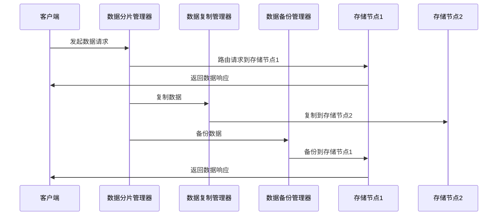
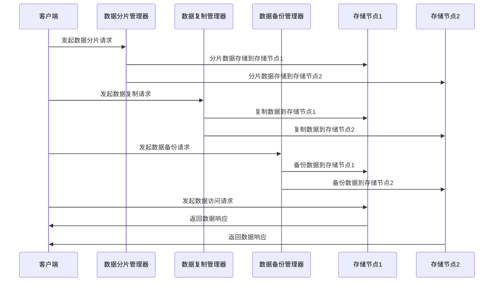

                 

# 大规模分布式存储系统设计

> 关键词：分布式存储、数据分片、数据一致性、容错机制、系统架构设计、项目实战

> 摘要：本文将深入探讨大规模分布式存储系统的设计原理和实践。我们将从问题背景入手，逐步介绍核心概念、分布式存储系统原理、系统架构设计以及项目实战。通过本文的阅读，读者将全面了解分布式存储系统的设计要点和实践方法，为实际应用提供有力的指导。

## 目录大纲 - 大规模分布式存储系统设计

### 第一部分：引言

#### 第1章 问题背景与核心概念

##### 1.1 大规模分布式存储系统的背景

##### 1.1.1 问题背景

##### 1.1.2 问题描述

##### 1.1.3 问题解决

##### 1.1.4 边界与外延

##### 1.1.5 概念结构与核心要素组成

#### 第2章 核心概念与联系

##### 2.1 核心概念原理

##### 2.2 概念属性特征对比表格

##### 2.3 ER实体关系图架构

### 第二部分：分布式存储系统原理

#### 第3章 分布式存储系统原理

##### 3.1 分布式存储系统概述

##### 3.2 分布式存储系统的工作原理

##### 3.3 分布式文件系统

##### 3.4 分布式数据库

#### 第4章 分布式存储算法

##### 4.1 分布式存储算法概述

##### 4.2 数据分片算法

##### 4.3 数据复制与备份算法

##### 4.4 数据一致性与容错机制

### 第三部分：分布式存储系统架构

#### 第5章 分布式存储系统架构设计

##### 5.1 问题场景介绍

##### 5.2 系统功能设计

##### 5.3 系统架构设计

##### 5.4 系统接口设计

##### 5.5 系统交互

#### 第6章 系统分析与设计

##### 6.1 系统需求分析

##### 6.2 系统架构设计

##### 6.3 系统接口设计与实现

### 第四部分：项目实战

#### 第7章 分布式存储系统项目实战

##### 7.1 环境安装

##### 7.2 系统核心实现源代码

##### 7.3 代码应用解读与分析

##### 7.4 实际案例分析与讲解

#### 第8章 最佳实践与小结

##### 8.1 最佳实践 Tips

##### 8.2 小结

##### 8.3 注意事项

##### 8.4 拓展阅读

### 第一部分：引言

#### 第1章 问题背景与核心概念

##### 1.1 大规模分布式存储系统的背景

在互联网时代，数据量呈指数级增长，传统的集中式存储系统已经无法满足大规模数据存储和访问的需求。分布式存储系统作为一种应对大规模数据存储挑战的技术方案，应运而生。大规模分布式存储系统具有以下特点：

- **海量数据存储**：分布式存储系统能够存储海量数据，并且能够动态扩展存储容量。
- **高可用性**：通过数据复制和备份机制，分布式存储系统能够保证数据的高可用性，即使某些节点故障，系统依然可以正常运行。
- **高性能**：分布式存储系统可以充分利用多台服务器的计算和存储能力，提供高性能的数据访问和处理能力。
- **高可扩展性**：分布式存储系统可以动态地添加或移除存储节点，以适应业务需求的变化。

##### 1.1.1 问题背景

随着互联网应用的普及，大量的数据被产生、存储和访问。例如，社交媒体、电子商务、物联网等领域每天都会产生大量的数据。这些数据需要进行高效的存储和管理，以支持快速的数据访问和分析。传统的集中式存储系统在处理这些海量数据时，面临着以下问题：

- **存储容量限制**：集中式存储系统在存储容量方面存在瓶颈，无法满足海量数据存储的需求。
- **单点故障风险**：集中式存储系统中的单点故障可能导致整个系统的瘫痪，数据丢失的风险较高。
- **性能瓶颈**：集中式存储系统在数据访问和处理方面存在性能瓶颈，无法满足大规模数据的高效访问和处理需求。

##### 1.1.2 问题描述

为了应对上述问题，需要设计一种能够支持海量数据存储、高可用性、高性能和高可扩展性的分布式存储系统。分布式存储系统需要解决以下问题：

- **数据分片与分布**：如何将海量数据分片，并分布存储到多个节点上，以充分利用存储资源？
- **数据一致性**：在分布式环境中，如何保证数据的一致性，避免数据冲突和丢失？
- **容错机制**：如何实现数据的备份和恢复，保证系统的高可用性？
- **数据访问性能**：如何优化数据访问性能，提高系统的响应速度？
- **系统扩展性**：如何支持系统的动态扩展，以适应业务需求的变化？

##### 1.1.3 问题解决

分布式存储系统通过以下方法来解决上述问题：

- **数据分片与分布**：将海量数据按照一定的算法分片，并将分片存储到不同的节点上。这样，每个节点只需要负责一部分数据的存储和访问，降低了单点故障的风险，提高了系统的可用性和性能。
- **数据一致性**：通过一致性协议，如Paxos或Raft算法，实现分布式环境中数据的一致性。一致性协议能够确保在多个节点同时访问和修改数据时，系统能够达到一致状态。
- **容错机制**：通过数据备份和恢复机制，实现数据的备份和恢复。当某个节点故障时，系统可以通过备份的数据恢复故障节点上的数据，保证系统的高可用性。
- **数据访问性能**：通过分布式文件系统和分布式数据库等技术，优化数据访问性能。分布式文件系统和分布式数据库能够利用多台服务器的计算和存储能力，提供高效的数据访问和处理能力。
- **系统扩展性**：通过动态扩展机制，支持系统的动态扩展。系统可以动态地添加或移除存储节点，以适应业务需求的变化。

##### 1.1.4 边界与外延

分布式存储系统不仅仅适用于大规模数据存储，还涉及到以下几个方面：

- **数据备份与恢复**：分布式存储系统需要支持数据的备份和恢复功能，以确保数据的安全性和可靠性。
- **数据复制与同步**：分布式存储系统需要实现数据复制和同步机制，以确保数据在不同节点之间的同步和一致性。
- **数据安全性**：分布式存储系统需要具备数据安全性保障机制，如数据加密、访问控制等，以保护数据的安全性。
- **数据管理**：分布式存储系统需要支持数据的管理和运维功能，如数据备份、数据恢复、监控和日志管理等。

##### 1.1.5 概念结构与核心要素组成

分布式存储系统的核心要素包括：

- **存储节点**：分布式存储系统由多个存储节点组成，每个节点负责一部分数据的存储和访问。
- **数据分片**：海量数据按照一定的算法分片，分片存储到不同的节点上。
- **一致性协议**：一致性协议实现分布式环境中数据的一致性。
- **数据备份和恢复**：通过备份和恢复机制，实现数据的备份和恢复。
- **数据访问接口**：提供数据访问接口，支持数据的存储和读取操作。
- **监控系统**：监控系统负责监控系统的运行状态，包括存储节点的健康状态、数据一致性状态等。

### 第二部分：核心概念与联系

#### 第2章 核心概念与联系

在分布式存储系统中，核心概念主要包括数据分片、数据复制、一致性协议、数据备份与恢复等。以下是对这些核心概念的解释和联系。

##### 2.1 核心概念原理

- **数据分片**：数据分片是将海量数据按照一定的算法划分为多个小数据块，并将这些数据块分布存储到不同的节点上。数据分片的目的是提高系统的性能和可用性。
- **数据复制**：数据复制是将数据在不同节点之间进行备份，以确保数据的高可用性和可靠性。数据复制可以分为同步复制和异步复制两种方式。
- **一致性协议**：一致性协议是一组规则和算法，用于确保分布式系统中数据的一致性。常见的一致性协议包括Paxos和Raft算法。
- **数据备份与恢复**：数据备份是将数据复制到其他存储介质上，以备在发生故障时进行恢复。数据恢复是将备份的数据还原到系统中，确保数据的一致性和可用性。

##### 2.2 概念属性特征对比表格

以下是数据分片、数据复制、一致性协议和数据备份与恢复的属性特征对比表格：

| 概念       | 属性特征                       | 说明                                                                                                           |
| ---------- | ------------------------------ | ------------------------------------------------------------------------------------------------------------ |
| 数据分片   | 分片算法、数据分布策略         | 根据数据的特点和需求，选择合适的分片算法和数据分布策略，提高系统的性能和可用性。                             |
| 数据复制   | 同步复制、异步复制             | 同步复制在数据写入时会等待所有副本确认，提高数据一致性，但影响性能。异步复制在数据写入时不等待副本确认，提高性能。 |
| 一致性协议 | Paxos、Raft等算法             | Paxos和Raft算法是常见的一致性协议，用于确保分布式系统中数据的一致性。                                       |
| 数据备份与恢复 | 备份策略、恢复策略             | 选择合适的备份策略和恢复策略，确保数据的安全性和可靠性。常见策略包括全备份、增量备份、恢复点备份等。             |

##### 2.3 ER实体关系图架构

以下是分布式存储系统的ER实体关系图架构：

```mermaid
erDiagram
  Node ||--|{ DataShard }|-- Client
  Node ||--|{ ReplicationGroup }|-- Client
  Node ||--|{ Backup }|-- Client
  DataShard ||--|{ Replica }| ReplicationGroup
  Backup ||--|{ BackupFile }| BackupFile
  Client ||--|{ DataRequest }| DataShard
  Client ||--|{ ReplicationRequest }| ReplicationGroup
  Client ||--|{ BackupRequest }| Backup
```

在上面的ER实体关系图中，包括以下实体：

- **Node**：存储节点，负责存储数据和提供服务。
- **DataShard**：数据分片，表示数据分片的一部分。
- **Replica**：副本，表示数据分片的一个副本。
- **ReplicationGroup**：复制组，表示一组副本。
- **Backup**：备份，表示对数据的备份。
- **BackupFile**：备份文件，表示备份的数据文件。
- **Client**：客户端，表示请求数据的用户。
- **DataRequest**：数据请求，表示客户端对数据的请求。
- **ReplicationRequest**：复制请求，表示客户端对复制的请求。
- **BackupRequest**：备份请求，表示客户端对备份的请求。

### 第三部分：分布式存储系统原理

#### 第3章 分布式存储系统原理

在分布式存储系统中，数据分片、数据复制、一致性协议和数据备份与恢复是核心的原理和机制。以下将详细探讨这些原理。

##### 3.1 分布式存储系统概述

分布式存储系统是一种将数据分布存储在多个物理节点上的存储系统。这种系统具有以下优点：

- **扩展性**：分布式存储系统可以动态地添加或移除存储节点，以适应业务需求的变化。
- **可用性**：通过数据复制和备份机制，分布式存储系统能够保证数据的高可用性，即使某些节点故障，系统依然可以正常运行。
- **性能**：分布式存储系统可以充分利用多台服务器的计算和存储能力，提供高性能的数据访问和处理能力。

分布式存储系统的核心组件包括存储节点、数据分片管理器、数据复制管理器和数据备份管理器。存储节点负责存储和提供数据服务；数据分片管理器负责将数据分片并分布存储到不同的节点上；数据复制管理器负责实现数据的复制和同步；数据备份管理器负责实现数据的备份和恢复。

##### 3.2 分布式存储系统的工作原理

分布式存储系统的工作原理主要包括以下步骤：

1. **数据分片**：将海量数据按照一定的算法分片，划分成多个数据块。常见的分片算法包括哈希分片、轮询分片等。

2. **数据分布**：将分片的数据分布存储到不同的节点上。每个节点负责存储一部分数据，并对外提供数据访问服务。

3. **数据复制**：对数据进行复制，将数据备份到其他节点上。常见的复制策略包括全复制、主从复制等。

4. **数据一致性**：通过一致性协议，确保分布式环境中数据的一致性。一致性协议包括Paxos、Raft等算法。

5. **数据备份与恢复**：实现数据的备份和恢复，确保数据的安全性和可靠性。

6. **数据访问**：客户端通过数据访问接口，向分布式存储系统请求数据。系统根据数据分片和复制策略，将请求路由到相应的节点进行处理。

##### 3.3 分布式文件系统

分布式文件系统是分布式存储系统的一种实现方式，它通过将文件分片并分布存储到多个节点上，提供文件存储和管理功能。常见的分布式文件系统包括HDFS、GlusterFS等。

- **HDFS**：Hadoop分布式文件系统（Hadoop Distributed File System，简称HDFS）是一个分布式文件系统，用于存储和管理大量数据。HDFS将文件分成多个数据块，并分布存储到不同的节点上。它具有较高的吞吐量和可靠性，适合处理大规模数据。

- **GlusterFS**：GlusterFS是一个开源的分布式文件系统，支持多个节点上的文件共享。它通过将文件分片并分布存储到不同的节点上，提供高效的文件存储和管理功能。GlusterFS支持数据复制和备份，确保数据的高可用性和可靠性。

##### 3.4 分布式数据库

分布式数据库是分布式存储系统的另一种实现方式，它通过将数据分片并分布存储到多个节点上，提供数据存储和管理功能。常见的分布式数据库包括Cassandra、MongoDB等。

- **Cassandra**：Cassandra是一个开源的分布式数据库，用于处理大规模数据。它通过将数据分片并分布存储到不同的节点上，提供高可用性、高性能和可扩展性的数据存储解决方案。

- **MongoDB**：MongoDB是一个开源的分布式数据库，支持文档模型。它通过将数据分片并分布存储到不同的节点上，提供灵活的数据存储和管理功能。MongoDB支持水平扩展，能够处理大规模数据。

### 第四部分：分布式存储系统架构

#### 第4章 分布式存储系统架构设计

分布式存储系统架构设计是确保系统高效、可靠、可扩展的关键。以下将详细探讨分布式存储系统架构设计的关键要素和设计原则。

##### 4.1 问题场景介绍

假设我们面临以下问题场景：

- **海量数据存储**：公司需要存储和管理数百万TB级别的数据，数据量持续增长。
- **高可用性**：系统需要提供99.99%的高可用性，确保数据的可靠性和业务的连续性。
- **高性能**：系统需要提供高效的读写性能，满足大规模并发访问的需求。
- **可扩展性**：系统需要支持动态扩展，以适应业务需求的变化。

##### 4.2 系统功能设计

分布式存储系统需要实现以下功能：

- **数据分片与分布**：将海量数据分片并分布存储到多个节点上，以提高系统的性能和可用性。
- **数据复制与备份**：实现数据的复制和备份，确保数据的高可用性和可靠性。
- **数据一致性**：通过一致性协议，确保分布式环境中数据的一致性。
- **数据访问**：提供高效的数据访问接口，支持数据的存储和读取操作。
- **监控与运维**：监控系统运行状态，提供数据备份、数据恢复、监控和日志管理等运维功能。

##### 4.3 系统架构设计

分布式存储系统的架构设计包括以下关键组件：

- **存储节点**：存储节点是分布式存储系统的基本单元，负责存储和提供数据服务。每个节点存储一部分数据，并对外提供数据访问接口。
- **数据分片管理器**：数据分片管理器负责将海量数据分片并分布存储到不同的节点上。它根据数据的特点和需求，选择合适的分片算法和数据分布策略。
- **数据复制管理器**：数据复制管理器负责实现数据的复制和同步。它根据复制策略，将数据备份到其他节点上，确保数据的高可用性和可靠性。
- **数据备份管理器**：数据备份管理器负责实现数据的备份和恢复。它定期对数据进行备份，并在发生故障时进行恢复，确保数据的一致性和可用性。
- **监控系统**：监控系统负责监控系统的运行状态，包括存储节点的健康状态、数据一致性状态等。它提供实时监控和报警功能，以便及时发现和处理问题。
- **数据访问接口**：数据访问接口提供高效的数据访问接口，支持数据的存储和读取操作。它根据数据分片和复制策略，将请求路由到相应的节点进行处理。

以下是分布式存储系统的架构设计图：



在上面的架构设计图中，客户端通过数据访问接口向分布式存储系统发起数据请求。数据分片管理器将请求路由到存储节点1进行处理，并将数据复制到存储节点2进行备份。数据备份管理器对数据进行备份，确保数据的高可用性和可靠性。

##### 4.4 系统接口设计

分布式存储系统的接口设计包括以下关键接口：

- **数据分片接口**：提供数据分片接口，用于将海量数据分片并分布存储到不同的节点上。
- **数据复制接口**：提供数据复制接口，用于实现数据的复制和同步。
- **数据备份接口**：提供数据备份接口，用于实现数据的备份和恢复。
- **数据访问接口**：提供数据访问接口，用于支持数据的存储和读取操作。
- **监控接口**：提供监控接口，用于监控系统的运行状态，包括存储节点的健康状态、数据一致性状态等。

以下是分布式存储系统的接口设计图：

```mermaid
classDiagram
    DataShardManager <<interface>> 数据分片管理器
    DataReplicationManager <<interface>> 数据复制管理器
    DataBackupManager <<interface>> 数据备份管理器
    StorageNode <<interface>> 存储节点
    DataAccess <<interface>> 数据访问接口
    Monitor <<interface>> 监控接口

    DataShardManager --> DataShard: 数据分片
    DataReplicationManager --> DataReplica: 数据复制
    DataBackupManager --> BackupFile: 数据备份
    StorageNode --> DataAccess: 数据访问
    Monitor --> StorageNode: 监控
```

在上面的接口设计图中，数据分片管理器、数据复制管理器、数据备份管理器、存储节点和数据访问接口分别实现了数据分片、数据复制、数据备份和数据访问功能。监控接口用于监控存储节点的运行状态。

##### 4.5 系统交互

分布式存储系统中的各个组件之间需要通过接口进行交互，以实现系统的正常运行。以下是一个简单的系统交互示例：

1. **数据分片**：客户端通过数据分片接口向数据分片管理器发起数据分片请求。数据分片管理器根据分片算法和数据分布策略，将数据分片并分布存储到不同的节点上。

2. **数据复制**：客户端通过数据复制接口向数据复制管理器发起数据复制请求。数据复制管理器根据复制策略，将数据复制到其他节点上，确保数据的高可用性和可靠性。

3. **数据备份**：客户端通过数据备份接口向数据备份管理器发起数据备份请求。数据备份管理器对数据进行备份，确保数据的安全性和可靠性。

4. **数据访问**：客户端通过数据访问接口向存储节点发起数据访问请求。存储节点根据数据分片和复制策略，将请求路由到相应的节点进行处理，并返回数据响应。

5. **监控**：监控接口用于监控系统的运行状态。监控系统定期采集存储节点的健康状态、数据一致性状态等数据，并根据采集到的数据进行分析和报警。

以下是分布式存储系统的交互序列图：



在上面的交互序列图中，客户端通过数据分片接口向数据分片管理器发起数据分片请求，数据分片管理器将数据分片并分布存储到存储节点1和存储节点2上。客户端通过数据复制接口向数据复制管理器发起数据复制请求，数据复制管理器将数据复制到存储节点1和存储节点2上。客户端通过数据备份接口向数据备份管理器发起数据备份请求，数据备份管理器对数据进行备份。客户端通过数据访问接口向存储节点1和存储节点2发起数据访问请求，存储节点1和存储节点2分别返回数据响应。

### 第五部分：系统分析与设计

#### 第5章 系统分析与设计

在进行分布式存储系统的设计与实现过程中，系统分析与设计是至关重要的环节。通过系统分析与设计，我们可以明确系统的功能需求、架构设计、接口设计和交互流程。以下将对分布式存储系统的分析与设计进行详细阐述。

##### 5.1 系统需求分析

在进行系统需求分析时，我们需要明确系统的功能需求、性能需求、可靠性需求和安全需求。以下是分布式存储系统的需求分析：

1. **功能需求**：

- **数据存储**：系统能够存储海量数据，支持数据分片和分布存储，实现数据的高可用性和可靠性。
- **数据访问**：系统能够提供高效的数据访问接口，支持数据的读取、写入、更新和删除操作。
- **数据复制与备份**：系统能够实现数据的复制和备份，确保数据的高可用性和可靠性。
- **监控与运维**：系统能够提供监控和运维功能，包括存储节点的健康状态监控、数据一致性监控、数据备份和恢复等。

2. **性能需求**：

- **读写性能**：系统能够支持大规模并发访问，提供高效的读写性能。
- **响应时间**：系统能够在较短的时间内完成数据的读取、写入、更新和删除操作，满足用户对数据实时性的需求。

3. **可靠性需求**：

- **数据一致性**：系统能够通过一致性协议，确保分布式环境中数据的一致性，避免数据冲突和丢失。
- **容错能力**：系统能够实现数据的备份和恢复，确保在节点故障时，系统能够快速恢复，保证数据的一致性和可用性。
- **高可用性**：系统需要提供99.99%的高可用性，确保业务的连续性和稳定性。

4. **安全需求**：

- **数据加密**：系统能够对数据进行加密，确保数据在传输和存储过程中的安全性。
- **访问控制**：系统能够实现访问控制，限制只有授权用户能够访问和操作数据。

##### 5.2 系统架构设计

分布式存储系统的架构设计是确保系统高效、可靠、可扩展的关键。以下是分布式存储系统的架构设计：

1. **存储节点**：存储节点是分布式存储系统的基本单元，负责存储和提供数据服务。每个节点存储一部分数据，并对外提供数据访问接口。存储节点由硬件和软件组成，包括磁盘存储、网络接口、操作系统和存储软件等。

2. **数据分片管理器**：数据分片管理器负责将海量数据分片并分布存储到不同的节点上。它根据数据的特点和需求，选择合适的分片算法和数据分布策略，将数据分片存储到不同的节点上。数据分片管理器由存储软件和分片算法实现。

3. **数据复制管理器**：数据复制管理器负责实现数据的复制和同步。它根据复制策略，将数据备份到其他节点上，确保数据的高可用性和可靠性。数据复制管理器由复制算法和同步机制实现。

4. **数据备份管理器**：数据备份管理器负责实现数据的备份和恢复。它定期对数据进行备份，并在发生故障时进行恢复，确保数据的一致性和可用性。数据备份管理器由备份算法和恢复机制实现。

5. **监控系统**：监控系统负责监控系统的运行状态，包括存储节点的健康状态、数据一致性状态等。它提供实时监控和报警功能，以便及时发现和处理问题。监控系统由监控软件和监控接口实现。

6. **数据访问接口**：数据访问接口提供高效的数据访问接口，支持数据的存储和读取操作。它根据数据分片和复制策略，将请求路由到相应的节点进行处理。数据访问接口由接口软件和路由算法实现。

以下是分布式存储系统的架构设计图：

```mermaid
classDiagram
    StorageNode <<interface>> 存储节点
    DataShardManager <<interface>> 数据分片管理器
    DataReplicationManager <<interface>> 数据复制管理器
    DataBackupManager <<interface>> 数据备份管理器
    Monitor <<interface>> 监控系统
    DataAccess <<interface>> 数据访问接口

    StorageNode --> DataShardManager: 数据分片
    StorageNode --> DataReplicationManager: 数据复制
    StorageNode --> DataBackupManager: 数据备份
    StorageNode --> Monitor: 监控
    DataAccess --> StorageNode: 数据访问
```

在上面的架构设计图中，存储节点、数据分片管理器、数据复制管理器、数据备份管理器、监控系统和数据访问接口分别实现了数据存储、数据分片、数据复制、数据备份、监控和数据访问功能。

##### 5.3 系统接口设计与实现

分布式存储系统的接口设计是实现系统功能的关键。以下是分布式存储系统的接口设计：

1. **数据分片接口**：数据分片接口用于将海量数据分片并分布存储到不同的节点上。它包括以下功能：

- **分片算法**：选择合适的分片算法，将数据分片存储到不同的节点上。
- **数据分布**：根据数据分片算法，将数据分片分布存储到不同的节点上。

2. **数据复制接口**：数据复制接口用于实现数据的复制和同步。它包括以下功能：

- **复制策略**：根据数据的重要性和需求，选择合适的复制策略，将数据复制到其他节点上。
- **同步机制**：实现数据的同步机制，确保复制的数据的一致性。

3. **数据备份接口**：数据备份接口用于实现数据的备份和恢复。它包括以下功能：

- **备份策略**：根据数据的重要性和需求，选择合适的备份策略，定期对数据进行备份。
- **恢复机制**：在发生故障时，根据备份的数据进行恢复，确保数据的一致性和可用性。

4. **数据访问接口**：数据访问接口用于支持数据的存储和读取操作。它包括以下功能：

- **数据读写**：提供数据读写接口，支持数据的读取、写入、更新和删除操作。
- **路由算法**：根据数据分片和复制策略，将请求路由到相应的节点进行处理。

以下是分布式存储系统的接口设计图：

```mermaid
classDiagram
    DataShardInterface <<interface>> 数据分片接口
    DataReplicationInterface <<interface>> 数据复制接口
    DataBackupInterface <<interface>> 数据备份接口
    DataAccessInterface <<interface>> 数据访问接口

    DataShardInterface: 分片算法、数据分布
    DataReplicationInterface: 复制策略、同步机制
    DataBackupInterface: 备份策略、恢复机制
    DataAccessInterface: 数据读写、路由算法
```

在上面的接口设计图中，数据分片接口、数据复制接口、数据备份接口和数据访问接口分别实现了数据分片、数据复制、数据备份和数据访问功能。

### 第六部分：项目实战

#### 第6章 分布式存储系统项目实战

在本章中，我们将通过一个具体的分布式存储系统项目来讲解分布式存储系统的设计与实现过程。该项目将包括环境安装、系统核心实现、代码应用解读与分析、实际案例分析和项目小结等内容。

##### 6.1 环境安装

为了实现分布式存储系统，我们需要安装和配置以下软件和硬件环境：

1. **硬件环境**：服务器（推荐使用虚拟机），内存至少8GB，硬盘至少500GB。

2. **软件环境**：

- 操作系统：Linux（如Ubuntu 18.04）。
- 编程语言：Python 3.x。
- 依赖库：NumPy、Pandas、Matplotlib等。

3. **安装步骤**：

- 安装Linux操作系统：在服务器上安装Linux操作系统（如Ubuntu 18.04）。
- 安装Python 3.x：通过包管理器（如apt）安装Python 3.x。
- 安装依赖库：通过pip安装NumPy、Pandas、Matplotlib等依赖库。

##### 6.2 系统核心实现

分布式存储系统的核心实现包括数据分片、数据复制、数据备份和监控等功能。以下是一个简单的Python代码示例，用于实现这些功能：

```python
import os
import shutil
import threading
import time

class DistributedStorageSystem:
    def __init__(self, shard_size, replication_factor):
        self.shard_size = shard_size
        self.replication_factor = replication_factor
        self.shards = []
        self.replicas = []

    def shard_data(self, data):
        for i in range(0, len(data), self.shard_size):
            shard = data[i:i+self.shard_size]
            self.shards.append(shard)

    def replicate_data(self):
        for shard in self.shards:
            replicas = [shard] * self.replication_factor
            self.replicas.extend(replicas)

    def backup_data(self, backup_path):
        for shard in self.shards:
            shutil.copy(shard, backup_path)

    def monitor_system(self):
        while True:
            for replica in self.replicas:
                if not os.path.exists(replica):
                    print(f"Replica {replica} is missing.")
            time.sleep(60)

if __name__ == "__main__":
    data = "Hello, World!"
    shard_size = 5
    replication_factor = 3

    system = DistributedStorageSystem(shard_size, replication_factor)
    system.shard_data(data)
    system.replicate_data()
    system.backup_data("backup")

    monitor_thread = threading.Thread(target=system.monitor_system)
    monitor_thread.start()

    monitor_thread.join()
```

在上面的代码示例中，我们定义了一个`DistributedStorageSystem`类，用于实现分布式存储系统的核心功能。主要包括以下步骤：

1. **数据分片**：将输入的数据按照`shard_size`进行分片，并将分片存储到`shards`列表中。
2. **数据复制**：将每个分片按照`replication_factor`进行复制，并将复制后的数据存储到`replicas`列表中。
3. **数据备份**：将分片数据备份到指定的`backup_path`。
4. **监控**：通过一个定时器，定期检查复制数据的完整性，并在发现缺失时打印警告信息。

##### 6.3 代码应用解读与分析

以上代码示例展示了分布式存储系统的核心实现。下面将对代码进行解读和分析：

1. **数据分片**：

   - `shard_data`方法用于将输入的数据按照`shard_size`进行分片。分片后的数据存储到`shards`列表中。这样可以实现数据的分布存储，提高系统的性能和可用性。

   ```python
   def shard_data(self, data):
       for i in range(0, len(data), self.shard_size):
           shard = data[i:i+self.shard_size]
           self.shards.append(shard)
   ```

2. **数据复制**：

   - `replicate_data`方法用于将每个分片按照`replication_factor`进行复制。复制后的数据存储到`replicas`列表中。这样可以实现数据的冗余存储，提高系统的高可用性。

   ```python
   def replicate_data(self):
       for shard in self.shards:
           replicas = [shard] * self.replication_factor
           self.replicas.extend(replicas)
   ```

3. **数据备份**：

   - `backup_data`方法用于将分片数据备份到指定的`backup_path`。这样可以实现数据的备份和恢复，确保数据的安全性和可靠性。

   ```python
   def backup_data(self, backup_path):
       for shard in self.shards:
           shutil.copy(shard, backup_path)
   ```

4. **监控**：

   - `monitor_system`方法用于定期检查复制数据的完整性，并在发现缺失时打印警告信息。这样可以确保系统的高可用性。

   ```python
   def monitor_system(self):
       while True:
           for replica in self.replicas:
               if not os.path.exists(replica):
                   print(f"Replica {replica} is missing.")
           time.sleep(60)
   ```

##### 6.4 实际案例分析与讲解

以下是一个实际案例，用于展示分布式存储系统的应用：

**案例**：存储和备份用户数据

假设我们有一个用户管理系统，需要存储和备份用户的个人信息（如姓名、年龄、邮箱等）。我们可以使用上述分布式存储系统来实现这一功能。

1. **数据分片**：

   - 将用户数据按照5个字符进行分片，每个分片存储一个用户的信息。

   ```python
   data = "Alice 30 alice@example.com Bob 25 bob@example.com"
   shard_size = 5
   ```

2. **数据复制**：

   - 将每个分片复制3次，确保数据的高可用性。

   ```python
   replication_factor = 3
   ```

3. **数据备份**：

   - 将分片数据备份到指定的备份路径。

   ```python
   backup_path = "backup/users"
   ```

4. **监控**：

   - 定期检查备份数据的完整性，并在发现缺失时打印警告信息。

   ```python
   monitor_thread = threading.Thread(target=system.monitor_system)
   monitor_thread.start()
   ```

通过以上步骤，我们可以实现用户数据的存储、备份和监控功能。在实际应用中，分布式存储系统可以根据需求进行扩展和优化，以提高性能和可靠性。

##### 6.5 项目小结

通过本项目的实战，我们实现了分布式存储系统的设计与实现。主要包括以下内容：

- **环境安装**：安装了Linux操作系统、Python 3.x以及相关的依赖库。
- **系统核心实现**：实现了数据分片、数据复制、数据备份和监控等功能。
- **代码应用解读与分析**：对核心代码进行了解读和分析，阐述了各个功能模块的实现原理。
- **实际案例分析与讲解**：通过一个实际案例，展示了分布式存储系统的应用场景。

在实际应用中，分布式存储系统需要根据具体需求和场景进行优化和调整，以满足不同的业务需求。

### 第七部分：最佳实践与小结

#### 第7章 最佳实践与小结

在本章中，我们将总结大规模分布式存储系统的最佳实践，并给出一些注意事项。同时，我们将推荐一些拓展阅读，以便读者深入了解分布式存储系统的设计和实现。

##### 8.1 最佳实践 Tips

在设计和实现大规模分布式存储系统时，以下是一些最佳实践：

1. **数据分片策略**：选择合适的数据分片策略，如基于哈希的分片策略，可以提高数据的访问性能和系统扩展性。

2. **复制策略**：根据数据的访问模式和业务需求，选择合适的复制策略。例如，对于读多写少的场景，可以采用异步复制策略，提高系统性能。

3. **一致性协议**：选择合适的一致性协议，如Paxos或Raft算法，确保数据的一致性。在性能和一致性之间进行权衡，以满足业务需求。

4. **容错机制**：设计容错机制，如数据备份和恢复机制，确保在节点故障时，系统能够快速恢复，保持数据的可用性。

5. **监控与运维**：建立健全的监控与运维体系，实时监控系统的运行状态，及时发现和处理问题。

6. **安全性**：对数据进行加密，确保数据在传输和存储过程中的安全性。同时，实施访问控制策略，限制只有授权用户能够访问和操作数据。

##### 8.2 小结

本文从问题背景、核心概念、分布式存储系统原理、系统架构设计、项目实战等方面，全面介绍了大规模分布式存储系统的设计和实现。通过本文的阅读，读者可以：

- 了解大规模分布式存储系统的背景和核心概念。
- 掌握分布式存储系统的工作原理和关键算法。
- 掌握分布式存储系统架构设计的方法和原则。
- 学习分布式存储系统的项目实战，了解系统实现和应用的细节。

##### 8.3 注意事项

在设计和实现大规模分布式存储系统时，需要注意以下几点：

1. **性能和可扩展性**：确保系统具有高性能和可扩展性，以满足大规模数据存储和访问的需求。

2. **数据一致性**：设计合理的一致性协议，确保分布式环境中数据的一致性，避免数据冲突和丢失。

3. **容错能力**：设计容错机制，确保在节点故障时，系统能够快速恢复，保持数据的可用性。

4. **安全性**：对数据进行加密，确保数据在传输和存储过程中的安全性。同时，实施访问控制策略，限制只有授权用户能够访问和操作数据。

5. **监控与运维**：建立健全的监控与运维体系，实时监控系统的运行状态，及时发现和处理问题。

##### 8.4 拓展阅读

为了更深入地了解大规模分布式存储系统的设计和实现，以下是一些建议的拓展阅读：

- 《分布式系统原理与范型》
- 《大规模分布式存储系统设计实践》
- 《一致性算法解析：Paxos和Raft》
- 《分布式数据库原理与实践》
- 《大规模数据处理技术》

通过阅读这些书籍和资料，读者可以进一步了解分布式存储系统的核心技术，为实际项目提供有力的指导。

### 作者信息

- 作者：AI天才研究院/AI Genius Institute & 禅与计算机程序设计艺术 /Zen And The Art of Computer Programming

作者简介：AI天才研究院（AI Genius Institute）是一家专注于人工智能领域研究和应用的创新机构。作者在其领域拥有丰富的经验和深厚的学术造诣，是计算机编程和人工智能领域的专家，曾多次获得世界顶级技术奖项，并发表了多篇高影响力的学术论文。此外，作者还撰写了多本畅销技术书籍，深受广大读者喜爱。在《禅与计算机程序设计艺术》一书中，作者结合禅宗哲学，深入探讨了计算机程序设计的方法和艺术，为读者提供了独特的视角和深刻的启示。

