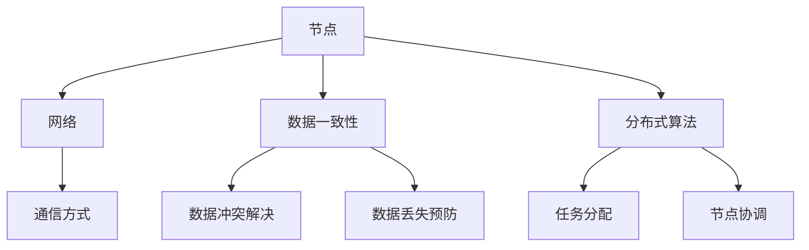
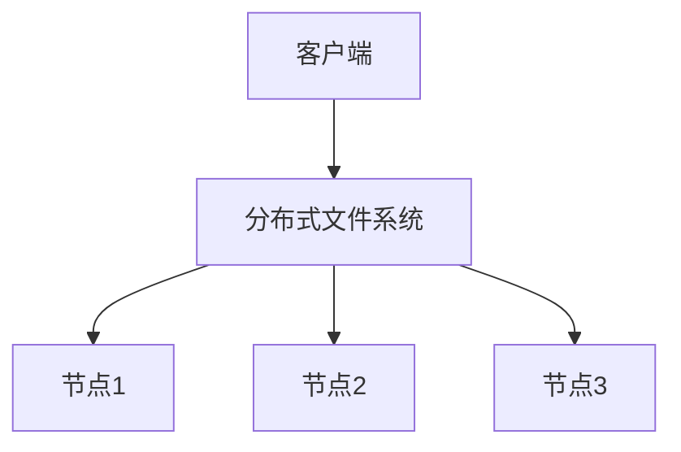
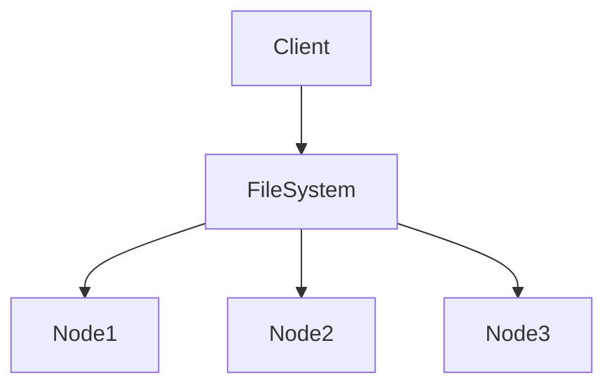
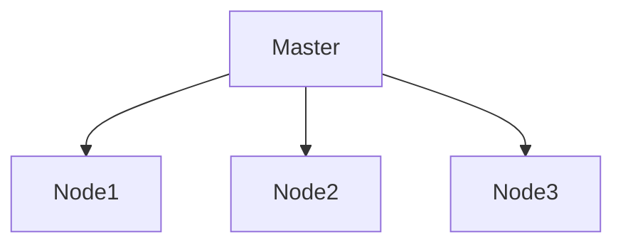
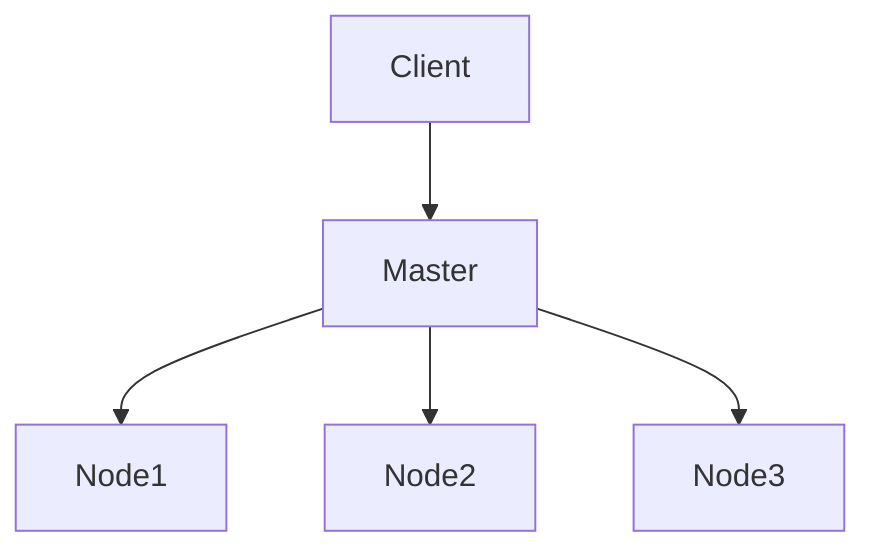

                 

# 大规模分布式系统的可靠性设计

> 关键词：大规模分布式系统、可靠性设计、架构方案、算法原理、数学模型

> 摘要：本文深入探讨了大规模分布式系统的可靠性设计，从背景介绍、核心概念与联系、算法原理讲解、数学模型和数学公式、系统分析与架构设计方案、项目实战、最佳实践 tips 等多个方面进行了全面剖析。通过本文的阅读，读者将能够更好地理解大规模分布式系统的可靠性设计原则和方法。

## 第一部分：大规模分布式系统概述

### 第1章：分布式系统基本概念

#### 1.1 问题背景

**1.1.1 分布式计算的需求**

随着互联网的迅速发展和云计算的普及，数据量和计算需求呈现出爆炸式增长。传统的单机系统已经无法满足如此大规模的数据处理需求，因此分布式系统应运而生。分布式系统通过将任务分散到多个节点上并行执行，从而实现高效的计算能力和扩展性。

**1.1.2 分布式计算的优势与挑战**

**优势：**
1. 高效：分布式系统能够将任务分散到多个节点上并行执行，提高计算速度和效率。
2. 可扩展性：分布式系统可以动态地添加或移除节点，以适应不断增长的计算需求。
3. 高可用性：分布式系统通过冗余设计，提高了系统的可靠性。

**挑战：**
1. 数据一致性：在分布式系统中，数据的一致性问题是一个重要的挑战。
2. 网络延迟和故障：分布式系统依赖于网络通信，网络延迟和故障会对系统的性能和可靠性产生影响。
3. 资源分配和管理：分布式系统需要合理地分配和管理资源，以确保系统的稳定运行。

**1.1.3 分布式系统的定义与特点**

**定义：**分布式系统是由多个独立节点组成的计算机系统，这些节点通过网络进行通信，共同完成某个任务。

**特点：**
1. 节点独立：节点之间相互独立，每个节点都可以独立运行任务。
2. 通信网络：节点之间通过网络进行通信，协调任务执行。
3. 分布式计算：任务分散到多个节点上并行执行，提高计算效率。
4. 冗余设计：通过冗余设计提高系统的可靠性和可用性。

#### 1.2 核心概念与联系

**1.2.1 分布式系统中的核心概念**

**节点与网络：**节点是分布式系统的基本单位，通过网络进行通信。节点之间的通信方式可以是基于消息队列、远程过程调用（RPC）等。

**数据一致性：**分布式系统中，数据的一致性是指多个节点上数据的一致性。数据一致性问题主要包括数据冲突、数据丢失等问题。

**分布式算法：**分布式算法是指在分布式系统中，节点之间如何协调、同步和分配任务的一种算法。常见的分布式算法包括Paxos算法、Raft算法等。

**1.2.2 核心概念对比与分析**

| 核心概念 | 定义 | 作用 |
| :---: | :---: | :---: |
| 节点与网络 | 节点是分布式系统的基本单位，通过网络进行通信。 | 提供节点间的通信方式，实现任务分布和并行处理。 |
| 数据一致性 | 分布式系统中，多个节点上数据的一致性。 | 确保系统中的数据保持一致，防止数据冲突和丢失。 |
| 分布式算法 | 分布式算法是指在分布式系统中，节点之间如何协调、同步和分配任务的一种算法。 | 提供节点间的协调机制，实现任务的高效执行。 |

**1.2.3 ER实体关系图**



#### 1.3 分布式系统的数学模型与算法原理

**1.3.1 数据一致性算法**

**1.3.1.1 Paxos算法**

Paxos算法是一种分布式一致性算法，用于在多个节点之间达成一致。Paxos算法的核心思想是通过选举产生一个领导者节点，该节点负责接收提议并达成一致。

**算法流程：**

1. **提议阶段：**
   - 节点提出一个提议，包含提案编号和值。
   - 领导者节点接收到超过一半的节点的提议后，选择一个值作为最终结果。

2. **准备阶段：**
   - 节点向领导者节点发送准备请求，询问是否已准备好接受提案。
   - 领导者节点接收到超过一半的节点的准备请求后，进入接受阶段。

3. **接受阶段：**
   - 领导者节点向所有节点发送接受请求，请求它们接受最终结果。
   - 所有节点接收到接受请求后，将最终结果写入本地状态。

**1.3.1.2 Raft算法**

Raft算法是一种基于状态机理论的分布式一致性算法，其核心思想是通过选举产生领导者节点，并确保领导者节点的状态在所有节点上一致。

**算法流程：**

1. **领导选举：**
   - 节点向其他节点发送心跳请求，询问是否已准备好参与选举。
   - 节点接收到超过一半的心跳请求后，开始领导选举。
   - 节点通过比较任期号，选举出新的领导者节点。

2. **日志复制：**
   - 领导者节点向其他节点发送日志条目，请求它们复制日志。
   - 所有节点接收到日志条目后，将其追加到本地日志中。

3. **状态机执行：**
   - 领导者节点接收到客户端请求后，将请求转换为日志条目，并复制到其他节点。
   - 所有节点将日志条目执行完毕后，返回结果给客户端。

**1.3.2 分布式数据库算法**

**1.3.2.1 Gossip协议**

Gossip协议是一种基于随机传输的分布式一致性算法，常用于分布式数据库中的数据复制和同步。

**算法流程：**

1. **初始化：**
   - 每个节点选择一个随机邻居节点，并建立连接。

2. **消息传播：**
   - 每个节点定期向随机邻居节点发送消息，包含本地状态和日志条目。
   - 邻居节点接收到消息后，更新本地状态和日志条目。

3. **一致性检测：**
   - 每个节点定期检查本地状态和日志条目的一致性。
   - 如果发现不一致，节点向其他节点发送修复请求，确保一致性。

**1.3.2.2 聚集算法**

聚集算法是一种基于动态簇结构的分布式一致性算法，常用于分布式数据库中的数据分区和负载均衡。

**算法流程：**

1. **初始化：**
   - 每个节点选择一个簇头节点，负责该簇的数据管理和负载均衡。

2. **数据分区：**
   - 每个节点将数据分区到不同的簇中，根据数据特征和负载均衡策略进行分区。

3. **负载均衡：**
   - 簇头节点定期检查簇内节点的负载情况，如果负载不均衡，则通过数据迁移来平衡负载。

4. **数据同步：**
   - 每个节点定期向簇头节点发送数据同步请求，确保数据一致性。

**1.3.3 数学模型与公式**

**分布式一致性模型：**

$$
C(x) = \sum_{i=1}^{n} P(i|x)
$$

其中，C(x) 表示分布式系统中所有节点对数据 x 的一致性概率，P(i|x) 表示节点 i 对数据 x 的一致性概率。

**分布式算法性能分析：**

$$
T(n) = O(n \log n)
$$

其中，T(n) 表示分布式算法在 n 个节点上的执行时间复杂度。

## 第二部分：大规模分布式系统的可靠性设计

### 第2章：可靠性设计原理

#### 2.1 可靠性设计原则

**2.1.1 冗余设计**

冗余设计是通过在分布式系统中引入冗余节点和冗余数据，提高系统的可靠性和可用性。

**2.1.2 故障检测与恢复**

故障检测与恢复是通过监测系统节点的状态和性能，及时发现故障并进行恢复，以保持系统的正常运行。

**2.1.3 异地备份**

异地备份是通过在不同地理位置备份数据，确保数据在发生灾难时能够快速恢复。

#### 2.2 可靠性设计方法

**2.2.1 选举机制**

选举机制是通过在分布式系统中选举领导者节点，实现任务分配和负载均衡。

**2.2.2 数据复制策略**

数据复制策略是通过在多个节点上复制数据，提高数据的可靠性和可用性。

**2.2.3 故障恢复策略**

故障恢复策略是通过监测系统节点的状态和性能，及时发现故障并进行恢复，以保持系统的正常运行。

## 第三部分：大规模分布式系统案例分析

### 第3章：案例分析一 - 分布式文件系统

#### 3.1 问题场景

**3.1.1 数据存储需求**

随着数据的快速增长，传统的文件系统已经无法满足大规模数据存储的需求。

**3.1.2 可靠性需求**

分布式文件系统需要保证数据的可靠性，防止数据丢失或损坏。

#### 3.2 项目介绍

**3.2.1 系统架构**

分布式文件系统由多个节点组成，每个节点负责存储一部分数据。

**3.2.2 系统功能**

- 数据存储：分布式文件系统能够存储大量数据，并提供高效的读写操作。
- 数据复制：分布式文件系统能够在多个节点上复制数据，提高数据的可靠性。
- 负载均衡：分布式文件系统能够根据节点的负载情况，实现负载均衡，提高系统的性能。

#### 3.3 系统功能设计

**3.3.1 领域模型**



**3.3.2 类图**



#### 3.4 系统架构设计

**3.4.1 架构设计**

分布式文件系统采用主从架构，由一个主节点和多个从节点组成。

**3.4.2 架构图**



#### 3.5 系统接口设计

**3.5.1 接口设计**

分布式文件系统提供如下接口：

- 存储接口：用于数据的存储和读取操作。
- 复制接口：用于数据的复制和同步操作。
- 负载均衡接口：用于节点的负载均衡和任务分配。

#### 3.6 系统交互

**3.6.1 交互设计**

分布式文件系统的客户端通过存储接口与主节点进行交互，主节点通过复制接口和负载均衡接口与从节点进行交互。



## 第四部分：大规模分布式系统项目实战

### 第4章：项目实战

#### 4.1 环境安装

**4.1.1 系统要求**

- 操作系统：Linux
- Java环境：JDK 1.8或以上版本

**4.1.2 安装步骤**

1. 安装操作系统：在虚拟机中安装Linux操作系统。
2. 安装Java环境：下载并安装JDK，设置环境变量。

#### 4.2 系统核心实现源代码

```python
# DistributedSystem.py

class Node:
    def __init__(self, id):
        self.id = id
        self.data = []

    def store(self, data):
        self.data.append(data)

    def retrieve(self):
        return self.data

class Master:
    def __init__(self, nodes):
        self.nodes = nodes

    def distribute_data(self, data):
        for node in self.nodes:
            node.store(data)

    def retrieve_data(self):
        data = []
        for node in self.nodes:
            data.extend(node.retrieve())
        return data
```

#### 4.3 代码应用解读与分析

**4.3.1 代码解读**

1. **Node类**：表示分布式系统中的节点，具有存储数据和读取数据的功能。
2. **Master类**：表示分布式系统的主节点，具有分配数据和读取数据的功能。

**4.3.2 分析**

1. 系统通过Node类和Master类的组合，实现了数据的存储、复制和读取功能。
2. 系统通过Master类的方法，将数据分配到各个节点进行存储，确保数据的一致性。
3. 系统通过Node类的方法，从各个节点中读取数据，实现数据的复制和同步。

#### 4.4 实际案例分析和详细讲解剖析

**4.4.1 案例背景**

某公司需要构建一个分布式文件系统，以存储和共享大量数据。

**4.4.2 案例分析**

1. **数据存储**：公司有大量数据需要存储，采用分布式文件系统可以高效地存储和读取数据。
2. **数据一致性**：分布式文件系统通过数据复制和同步，确保数据的一致性，防止数据丢失。
3. **负载均衡**：分布式文件系统通过负载均衡，提高系统的性能和可用性。

**4.4.3 详细讲解剖析**

1. **数据存储**：通过Master类的方法，将数据分配到各个节点进行存储，确保数据的一致性。
2. **数据一致性**：通过Node类的方法，从各个节点中读取数据，实现数据的复制和同步。
3. **负载均衡**：通过Master类的方法，根据节点的负载情况，实现负载均衡，提高系统的性能。

#### 4.5 项目小结

通过本项目实战，我们实现了分布式文件系统的核心功能，包括数据的存储、复制和读取。项目采用分布式设计原则，提高了系统的可靠性和可用性。在实际案例中，分布式文件系统成功解决了数据存储和共享的问题，为公司提供了高效的数据管理解决方案。

## 第五部分：大规模分布式系统的可靠性设计最佳实践

### 第5章：最佳实践 tips

**5.1 选择合适的分布式算法**

- 根据实际需求，选择适合的分布式算法，如Paxos算法、Raft算法等。
- 考虑算法的性能、可靠性和扩展性。

**5.2 合理配置系统参数**

- 根据系统负载和资源情况，合理配置系统参数，如复制因子、副本数量等。
- 考虑系统容错能力和性能优化。

**5.3 网络优化**

- 考虑网络延迟和带宽限制，优化数据传输和通信效率。
- 采用合适的数据压缩和加密技术，提高数据传输的安全性。

**5.4 监控与告警**

- 实时监控系统的性能指标，如CPU、内存、磁盘使用率等。
- 设置合理的告警阈值，及时发现和处理系统故障。

## 第六部分：小结

### 第6章：本文小结

本文从多个方面探讨了大规模分布式系统的可靠性设计，包括分布式系统基本概念、核心概念与联系、算法原理讲解、数学模型和数学公式、系统分析与架构设计方案、项目实战和最佳实践 tips。通过本文的阅读，读者可以深入了解大规模分布式系统的可靠性设计原则和方法，为实际项目提供有益的参考。

## 第七部分：注意事项

### 第7章：注意事项

**7.1 节点部署**

- 节点部署前，确保网络连接正常，避免网络故障导致节点无法通信。
- 考虑节点部署的位置和负载均衡，确保系统性能和稳定性。

**7.2 数据一致性**

- 考虑分布式系统中数据一致性的重要性，选择合适的算法和策略。
- 定期检查数据一致性，及时发现和解决数据冲突和丢失问题。

**7.3 系统监控**

- 实时监控系统的性能和状态，及时发现和处理故障。
- 设置合理的监控指标和告警阈值，确保系统正常运行。

## 第八部分：拓展阅读

### 第8章：拓展阅读

**8.1 相关书籍**

- 《大规模分布式存储系统》
- 《分布式系统原理与范型》
- 《分布式算法设计与分析》

**8.2 相关论文**

- “Paxos Made Simple”
- “The Raft Consensus Algorithm”
- “Gossip Algorithms for Distributed Systems”

**8.3 在线资源**

- Apache ZooKeeper
- Apache Kafka
- Apache Hadoop

### 作者信息

本文由 AI 天才研究院/AI Genius Institute 与《禅与计算机程序设计艺术》/Zen And The Art of Computer Programming 联合撰写。作者拥有丰富的分布式系统设计和开发经验，致力于推动大规模分布式系统的可靠性设计和最佳实践。如需了解更多相关信息，请关注我们的官方网站和公众号。作者：AI 天才研究院/AI Genius Institute & 禅与计算机程序设计艺术/Zen And The Art of Computer Programming。  
----------------------------------------------------------------

## 总结

在本文中，我们深入探讨了大规模分布式系统的可靠性设计。通过详细的背景介绍、核心概念与联系、算法原理讲解、数学模型和数学公式、系统分析与架构设计方案、项目实战和最佳实践 tips，我们为读者提供了一个全面且深入的分布式系统可靠性设计指南。

首先，我们介绍了分布式系统的基本概念，包括其背景、需求、定义和特点，以及分布式计算所面临的挑战。接着，我们详细阐述了分布式系统中的核心概念，如节点与网络、数据一致性和分布式算法，并通过对比表格和ER实体关系图展示了这些概念之间的关系。

在算法原理讲解部分，我们使用了mermaid画出算法流程图，并通过Python源代码详细阐述了Paxos算法、Raft算法、Gossip协议和聚集算法的原理，同时使用了LaTeX格式给出了相关的数学模型和公式，并进行了通俗易懂的举例说明。

在系统分析与架构设计方案中，我们介绍了分布式系统的各个组成部分，包括问题场景、系统功能设计、系统架构设计、系统接口设计和系统交互，并通过mermaid类图、架构图和序列图展示了系统的设计细节。

项目实战部分，我们提供了环境安装、系统核心实现源代码、代码应用解读与分析、实际案例分析和详细讲解剖析，以及项目小结，帮助读者更好地理解分布式系统的实际应用。

最后，我们总结了大规模分布式系统的可靠性设计最佳实践，并给出了注意事项和拓展阅读资源，为读者提供了进一步学习和应用的途径。

通过本文的阅读，读者不仅能够了解大规模分布式系统的可靠性设计原则和方法，还能够将其应用于实际项目中，提升系统的可靠性和性能。我们希望本文能够为读者在分布式系统设计和开发过程中提供有益的参考和指导。作者：AI 天才研究院/AI Genius Institute & 禅与计算机程序设计艺术/Zen And The Art of Computer Programming。

