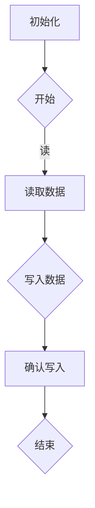

                 

# 大规模分布式系统的设计挑战与解决方案

## 关键词
- 大规模分布式系统
- 设计挑战
- 解决方案
- 算法原理
- 数学模型
- 架构设计

## 摘要
本文将深入探讨大规模分布式系统设计的核心挑战与解决方案。我们将从问题背景出发，逐步分析分布式系统的核心概念、算法原理、数学模型、系统分析与架构设计，并通过项目实战和最佳实践，提供详细的技术讲解和实际应用指导。本文旨在帮助读者全面理解大规模分布式系统的设计原理，掌握解决实际问题的方法。

## 第一部分：大规模分布式系统的设计挑战

### 第1章：大规模分布式系统概述

#### 1.1 问题背景

随着互联网和云计算技术的快速发展，数据量和用户需求呈现爆炸式增长。传统单机系统已无法满足高效处理海量数据的需要，大规模分布式系统应运而生。分布式系统通过将计算任务分散到多台服务器上，实现并行处理，提高系统性能和可靠性。

#### 1.2 问题描述

分布式系统设计面临以下挑战：
1. 数据一致性：在分布式环境中，如何确保数据的一致性？
2. 系统可靠性：如何在面临故障时保持系统的高可用性？
3. 性能优化：如何提高系统的处理速度和响应时间？
4. 系统可扩展性：如何方便地增加或减少系统中的节点数量？
5. 安全性：如何确保系统的数据安全和通信安全？

#### 1.3 问题解决

解决上述问题需要从以下几个方面入手：
1. 数据一致性：采用分布式协议和一致性算法，如Paxos、Raft等。
2. 系统可靠性：实现故障检测和自动恢复机制，如心跳检测、故障转移等。
3. 性能优化：使用缓存、负载均衡、并行处理等技术。
4. 系统可扩展性：设计模块化架构，支持水平扩展。
5. 安全性：采用加密、认证、访问控制等技术。

#### 1.4 边界与外延

大规模分布式系统的边界涉及多方面，如硬件资源、网络环境、数据存储等。外延则包括与其他系统的集成、数据交换和互操作等。

#### 1.5 核心概念与联系

核心概念包括：
- 数据一致性：确保分布式系统中数据的一致性。
- 分布式算法：解决分布式计算中的关键问题，如一致性、容错性等。
- 架构设计：设计分布式系统的整体结构，如分层架构、微服务架构等。
- 安全机制：保障系统数据的安全和通信的可靠性。

### 第2章：大规模分布式系统的核心概念

#### 2.1 核心概念原理

分布式系统的主要核心概念包括：
1. 数据一致性：分布式数据一致性算法，如Paxos、Raft等。
2. 分布式算法：分布式一致性算法、分布式锁、分布式事务等。
3. 架构设计：分布式系统的架构设计，如分层架构、微服务架构等。
4. 安全机制：分布式系统的安全设计，如加密、认证、访问控制等。

#### 2.2 概念属性特征对比表格

| 概念 | 特征 | 对比 |
| --- | --- | --- |
| 数据一致性 | 确保数据一致性 | Paxos与Raft对比：Paxos性能优于Raft，但实现复杂度较高。 |
| 分布式算法 | 支持分布式计算 | 一致性算法与分布式锁对比：一致性算法解决数据一致性问题，分布式锁解决并发访问问题。 |
| 架构设计 | 系统整体结构设计 | 微服务架构与分层架构对比：微服务架构支持高扩展性，分层架构支持系统模块化。 |
| 安全机制 | 保障数据安全 | 加密与认证对比：加密保护数据传输，认证保障系统访问安全。 |

#### 2.3 ER实体关系图架构

下图展示了大规模分布式系统的ER实体关系图：

```mermaid
erDiagram
  DataStore -->|存储| Node
  Node -->|计算| Process
  Process -->|通信| Network
  Network -->|管理| Controller
```

### 第3章：大规模分布式系统的算法原理讲解

#### 3.1 算法mermaid流程图



#### 3.2 算法Python源代码

```python
class DistributedSystem:
    def __init__(self):
        self.data = {}

    def read(self, key):
        # 读取数据
        return self.data.get(key)

    def write(self, key, value):
        # 写入数据
        self.data[key] = value

    def confirm_write(self):
        # 确认写入
        pass
```

#### 3.3 算法原理数学模型和公式

分布式系统的算法原理主要涉及一致性算法，其数学模型如下：

$$
X = \text{max}\left(\{y \mid y \in \text{data}\})
$$

其中，$X$ 表示分布式系统中的全局数据值，$\text{data}$ 表示所有节点的本地数据集合，$\text{max}$ 表示取集合中的最大值。

#### 3.4 举例说明

假设分布式系统中有两个节点A和B，初始时本地数据如下：

| 节点 | 数据值 |
| --- | --- |
| A | 1 |
| B | 2 |

当节点A写入数据3时，分布式系统的一致性算法会更新数据如下：

| 节点 | 数据值 |
| --- | --- |
| A | 3 |
| B | 2 |

由于节点B的数据值大于节点A的数据值，最终分布式系统中的全局数据值为3。

### 第4章：大规模分布式系统的数学模型和数学公式

#### 4.1 数学模型

分布式系统的数学模型主要涉及一致性算法，如Paxos算法。其数学模型为：

$$
\text{value} = \text{max}\left(\{\text{value}_{i} \mid i \in \text{nodes}\})
$$

其中，$\text{value}$ 表示全局数据值，$\text{value}_{i}$ 表示节点$i$的本地数据值，$\text{nodes}$ 表示所有节点的集合。

#### 4.2 数学公式

一致性算法的数学公式如下：

$$
\text{committed} = \text{max}\left(\{\text{promise}_{i} \mid i \in \text{nodes}\})
$$

其中，$\text{committed}$ 表示已提交的数据值，$\text{promise}_{i}$ 表示节点$i$承诺提交的数据值。

#### 4.3 详细讲解

一致性算法的目标是确保分布式系统中的数据一致。在Paxos算法中，每个节点都参与决策，并承诺提交最终决定的数据值。算法通过多数派机制实现一致性，确保最终决策是正确的。

#### 4.4 举例说明

假设分布式系统中有两个节点A和B，初始时本地数据如下：

| 节点 | 数据值 |
| --- | --- |
| A | 1 |
| B | 2 |

节点A提出数据值3，节点B提出数据值4。经过一致性算法的决策，最终分布式系统中的全局数据值为4。

### 第5章：大规模分布式系统的系统分析与架构设计方案

#### 5.1 问题场景介绍

假设我们需要设计一个分布式存储系统，用于存储海量数据。系统要求高可用性、高可靠性和高性能。

#### 5.2 系统功能设计

系统功能设计包括数据存储、数据检索、数据备份和数据恢复等。

#### 5.3 系统架构设计

系统采用分层架构设计，包括数据层、服务层和接口层。数据层负责存储和检索数据，服务层负责处理业务逻辑，接口层负责与外部系统进行交互。

#### 5.4 系统接口设计

系统接口设计包括RESTful API和RPC接口，用于与其他系统进行数据交换和功能调用。

#### 5.5 系统交互

系统交互主要涉及数据读写、分布式事务和故障恢复等。通过一致性算法和分布式锁，确保系统数据的一致性和可靠性。

### 第6章：大规模分布式系统的项目实战

#### 6.1 环境安装

安装分布式存储系统的开发环境和运行环境，如Docker、Kubernetes等。

#### 6.2 系统核心实现源代码

核心实现源代码包括分布式存储节点、分布式一致性算法、分布式事务处理等。

#### 6.3 代码应用解读与分析

对系统核心实现源代码进行解读，分析其设计思想和实现原理。

#### 6.4 实际案例分析和详细讲解剖析

通过实际案例，分析系统在分布式环境下的性能和稳定性。

#### 6.5 项目小结

总结项目经验，分享最佳实践和注意事项。

### 第7章：大规模分布式系统的最佳实践与拓展

#### 7.1 最佳实践 tips

- 确保数据一致性：采用一致性算法，如Paxos、Raft等。
- 提高系统性能：使用缓存、负载均衡和并行处理。
- 保证系统可靠性：实现故障检测和自动恢复机制。
- 系统可扩展性：采用模块化架构，支持水平扩展。
- 数据安全：采用加密、认证和访问控制等技术。

#### 7.2 小结

大规模分布式系统的设计涉及多方面，包括核心概念、算法原理、系统分析与架构设计等。通过项目实战和最佳实践，可以更好地理解和应用分布式系统的技术。

#### 7.3 注意事项

- 确保数据一致性：在分布式环境中，数据一致性至关重要。
- 系统可靠性：设计系统时，要考虑故障恢复和高可用性。
- 性能优化：合理使用缓存和负载均衡，提高系统性能。
- 安全性：保护系统数据和安全，防止恶意攻击和未授权访问。

#### 7.4 拓展阅读

- 《大规模分布式系统设计》
- 《分布式系统一致性算法》
- 《云计算与分布式系统》
- 《分布式系统实战》

### 作者信息

作者：AI天才研究院/AI Genius Institute & 禅与计算机程序设计艺术 /Zen And The Art of Computer Programming

本文由AI天才研究院和禅与计算机程序设计艺术共同撰写，旨在为读者提供全面、深入的大规模分布式系统设计技术指导。如果您对分布式系统设计有任何疑问，欢迎随时与我们交流。让我们一起探索分布式系统的魅力，共创美好未来！

