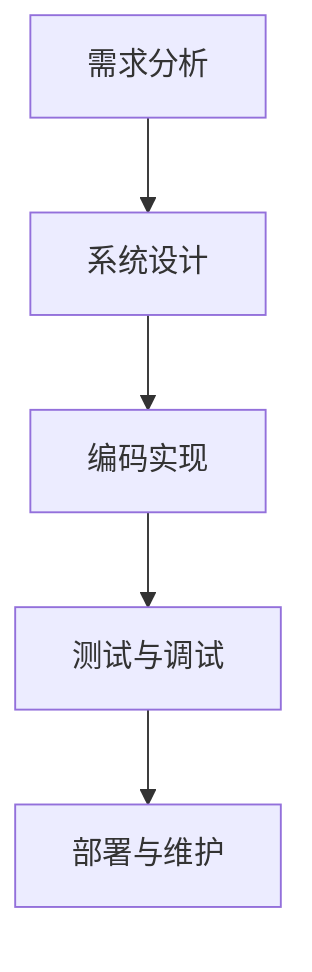
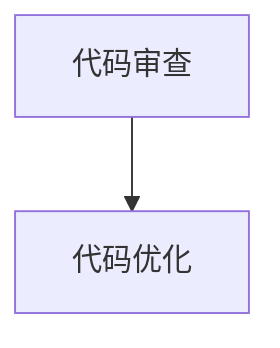
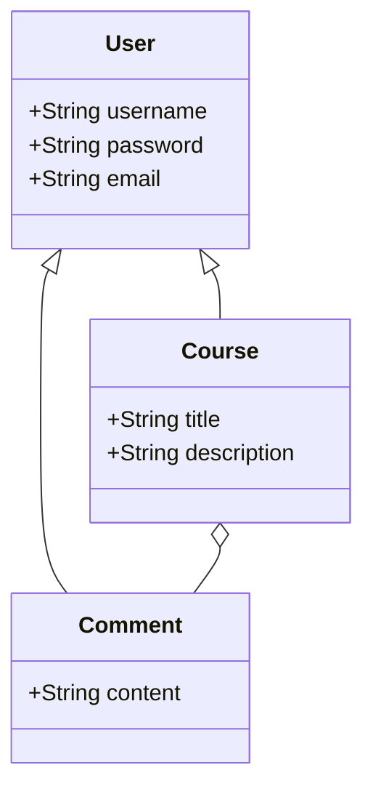
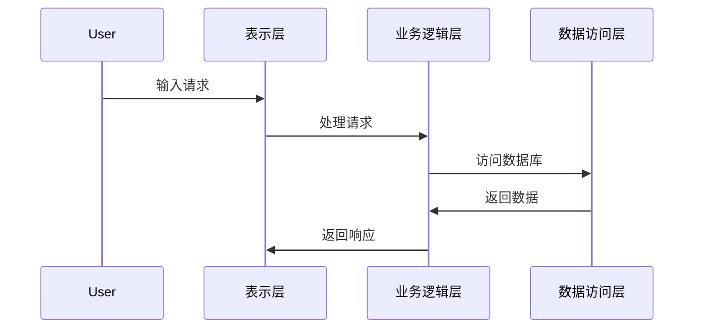
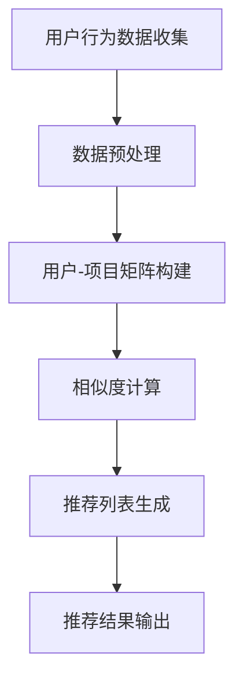
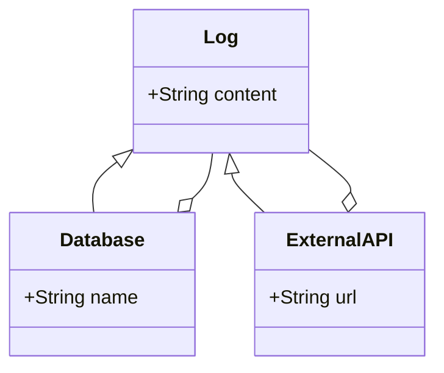
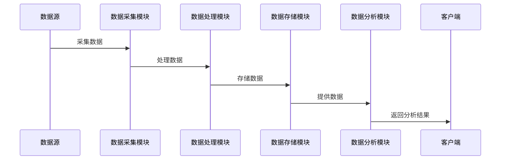
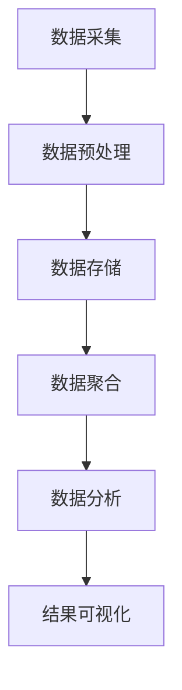

                 


### 引言与背景

在信息技术飞速发展的今天，编程作为计算机科学的核心技能，已经深入到各行各业。然而，如何编写出高质量、易于维护和扩展的代码，成为每个程序员面临的重要课题。好代码不仅仅是为了满足功能需求，更是为了在复杂多变的技术环境中保持代码的稳定性和可维护性。

**1.1 问题的提出**

首先，我们来看看什么是“好代码”。好代码应具备以下特点：

- **可读性**：代码易读易懂，逻辑清晰，便于他人理解和维护。
- **可维护性**：代码结构合理，便于后续修改和优化。
- **可扩展性**：代码易于扩展，能够适应新的功能和需求。
- **性能**：代码运行效率高，资源消耗少。

然而，在实际编程过程中，程序员往往面临如下问题：

- **代码冗长混乱**：没有合理的结构，可读性差，难以维护。
- **代码复用性差**：代码模块化程度低，无法有效复用。
- **性能瓶颈**：代码存在效率低下的问题，无法满足性能需求。

**1.2 问题的背景**

随着软件系统规模的不断扩大和复杂度的增加，这些问题带来的影响愈发显著。一方面，编写和维护好代码需要耗费大量时间和精力；另一方面，低质量代码会导致系统稳定性下降，增加开发成本，甚至可能带来安全隐患。因此，如何修炼出一手好代码，成为每个程序员必修的课程。

**1.3 问题的解决**

为了解决上述问题，我们需要对代码进行系统的修炼，逐步提升代码质量。这个过程可以划分为三个阶段：

- **基础构建**：掌握编程基础，建立合理的代码结构，培养良好的编程习惯。
- **进阶优化**：在基础构建的基础上，对代码进行性能优化，提升可读性和可维护性。
- **代码艺术**：运用高级编程技巧和编程哲学，实现代码的艺术性，打造高效、优美的代码。

接下来的章节将详细探讨这三个阶段，帮助读者逐步修炼出好代码。

## 1.4 修炼的重要性

修炼好代码并非一朝一夕之事，而是一个逐步积累和提升的过程。其重要性体现在以下几个方面：

首先，好代码能够显著提高开发效率。通过合理的设计和优化的代码，程序员可以更快地理解和修改现有代码，减少调试和排查问题的耗时。这意味着在相同的开发时间内，可以完成更多的功能，提高团队的整体工作效率。

其次，好代码能够降低维护成本。高质量的代码结构清晰、模块化高，便于后续的维护和扩展。随着软件系统规模的不断扩大，维护成本会逐步增加。通过修炼好代码，可以有效降低这种维护成本，提高系统的稳定性和可靠性。

此外，好代码还能够在团队协作中发挥重要作用。良好的代码习惯和规范的代码风格有助于团队成员之间的沟通和理解，减少因代码不一致导致的冲突。同时，易于维护和扩展的代码能够提高项目的可复用性，为后续的项目开发提供强有力的支持。

最后，修炼好代码是程序员职业生涯发展的重要基石。在竞争激烈的职场环境中，能够编写高质量代码的程序员更容易获得同事和领导的认可，提升个人的职业竞争力。此外，好代码修炼的过程也是对程序员编程思维和技术的深化理解，有助于培养全面的技术能力和解决问题的能力。

综上所述，修炼好代码不仅能够提高开发效率和降低维护成本，还能为程序员在职业生涯中带来诸多益处。因此，每一位程序员都应当重视好代码的修炼，将其作为职业生涯中的必修课。

### 1.5 研究现状

目前，关于好代码修炼的研究已经取得了一定的成果，形成了一系列的方法和理论。首先，关于好代码的标准，研究者们普遍认为，好代码应具备以下几个关键特征：

- **简洁性**：代码应尽可能简洁明了，避免冗长和复杂的结构。
- **可读性**：代码应易于阅读和理解，逻辑清晰，便于他人维护。
- **可维护性**：代码应具有良好的结构，易于修改和扩展。
- **可扩展性**：代码应能够适应新的功能和需求，易于进行功能扩展。
- **性能**：代码应具有较高的运行效率，减少资源消耗。

在标准的基础上，研究者们还提出了一系列修炼好代码的方法与技巧。以下是一些常见的方法：

- **设计模式**：设计模式是解决软件设计问题的通用解决方案。通过合理使用设计模式，可以提高代码的可维护性和可扩展性。例如，单例模式、工厂模式、观察者模式等。
- **代码规范**：遵循统一的代码规范，如PEP8（Python代码规范）、Google Java Style Guide等，有助于提高代码的可读性和一致性。
- **代码审查**：通过代码审查，可以及时发现和纠正代码中的问题，提高代码质量。常见的代码审查方法包括手动审查和自动化工具审查。
- **测试驱动开发（TDD）**：TDD是一种开发流程，先编写测试用例，然后再编写满足测试用例的代码。这种方法有助于提高代码的可维护性和可靠性。
- **持续集成（CI）**：通过持续集成，可以自动化构建和测试代码，确保代码质量。

尽管已有多种方法和理论，但修炼好代码仍然面临一些挑战。首先，如何在实际开发中有效应用这些方法和技巧是一个难题。其次，不同项目和应用场景对好代码的要求可能不同，需要根据具体情况进行调整。此外，修炼好代码需要程序员具备较高的技术水平和对编程哲学的深刻理解。

未来的研究可以进一步探索如何将好代码修炼与人工智能相结合，利用机器学习等技术自动化地分析和优化代码。同时，还可以研究如何培养程序员的好代码修养，提高其编程水平和编码能力。

### 1.6 本书结构安排

为了系统地介绍好代码修炼的过程，本书将分为三个主要阶段，每个阶段都有其独特的目标和重点。以下是本书的结构安排及各阶段的详细划分：

**第一阶段：基础构建**

本阶段的目标是帮助程序员建立扎实的编程基础，培养良好的编程习惯。重点内容包括：

- **编程基础**：包括数据类型、变量、控制结构、函数和模块等基本概念和用法。
- **设计模式**：介绍常见的设计模式，如单例模式、工厂模式、观察者模式等，帮助程序员理解如何通过设计模式提高代码的结构和可维护性。
- **编码实践**：通过实际编码练习，巩固所学知识，提升编程技能。

**第二阶段：进阶优化**

在基础构建的基础上，本阶段将深入探讨如何优化代码性能，提升代码的可读性和可维护性。重点内容包括：

- **性能优化**：介绍算法性能分析、内存管理、并发处理等性能优化技术，帮助程序员编写出高效、低耗资源的代码。
- **代码可读性与可维护性**：讨论代码规范、注释、代码复用和设计模式应用，提高代码的可读性和可维护性。

**第三阶段：代码艺术**

本阶段的目标是引导程序员进入代码艺术的境界，运用高级编程技巧和编程哲学，实现代码的高效与优美。重点内容包括：

- **编程哲学**：探讨编程思维和软件工程理念，帮助程序员形成系统性的编程观念。
- **高级编程技巧**：介绍面向对象编程、函数式编程、领域驱动设计等高级编程技巧，提升代码的艺术性。
- **创新与实践**：通过实际案例，展示如何运用编程技巧和创新思维解决复杂问题，实现代码的艺术与高效。

通过这三个阶段的修炼，读者将逐步提升自己的编程能力，最终编写出高质量、易于维护和扩展的代码。

### 第2章 好代码修炼的第一阶段——基础构建

好代码修炼的第一阶段是基础构建，这是每个程序员迈向卓越编程之路的基石。在这个阶段，我们需要关注编程基础、设计模式和编码实践，通过系统的学习和实践，为后续的进阶优化和代码艺术打下坚实的基础。

#### 2.1 编程基础

编程基础是构建好代码的根基，包括数据类型、变量、控制结构、函数和模块等基本概念和用法。以下是这几个核心概念的解释：

- **数据类型**：数据类型是用于表示不同类型数据的方式。常见的有整型（int）、浮点型（float）、布尔型（bool）等。了解数据类型是进行有效编程的基础。
  
  ```python
  # 整型
  num = 10
  # 浮点型
  float_num = 10.5
  # 布尔型
  is_true = True
  ```

- **变量**：变量是用于存储数据的容器。通过变量，我们可以给数据起一个有意义的名称，方便后续的使用和操作。

  ```python
  name = "Alice"
  age = 30
  ```

- **控制结构**：控制结构是用于控制代码执行流程的语句。常见的有条件语句（if-else）、循环语句（for、while）等。

  ```python
  # 条件语句
  if age > 18:
      print("成年了")
  # 循环语句
  for i in range(5):
      print(i)
  ```

- **函数**：函数是用于封装一段代码的逻辑单元，便于重用和维护。通过函数，我们可以将复杂的任务分解为小部分，提高代码的可读性和可维护性。

  ```python
  def greet(name):
      return "Hello, " + name
  
  print(greet("Alice"))
  ```

- **模块**：模块是用于封装多个函数和类的文件，便于代码的管理和组织。通过模块，我们可以将相关功能集中在一起，减少代码的冗余和重复。

  ```python
  # greet.py
  def greet(name):
      return "Hello, " + name
  
  # main.py
  from greet import greet
  print(greet("Alice"))
  ```

掌握编程基础是编写好代码的第一步。通过系统的学习和实践，我们可以打下坚实的编程基础，为后续的学习和提升奠定良好的基础。

#### 2.2 设计模式

设计模式是软件设计中的通用解决方案，用于解决常见的设计问题。合理运用设计模式可以提高代码的结构和可维护性，使代码更加清晰和易于理解。以下是几个常见的设计模式及其简单介绍：

- **单例模式**：确保一个类只有一个实例，并提供一个访问它的全局访问点。单例模式常用于需要全局访问的场景，如数据库连接、日志记录等。

  ```python
  class Singleton:
      instance = None
      
      def __new__(cls):
          if not cls.instance:
              cls.instance = super(Singleton, cls).__new__(cls)
          return cls.instance

  singleton = Singleton()
  ```

- **工厂模式**：用于创建对象，但将创建逻辑抽象出来，使客户端代码与具体创建的对象解耦。工厂模式适用于需要动态选择或创建对象的情况。

  ```python
  class Dog:
      def bark(self):
          print("Woof!")

  class Cat:
      def meow(self):
          print("Meow!")

  class AnimalFactory:
      def create_animal(self, type):
          if type == "dog":
              return Dog()
          elif type == "cat":
              return Cat()
          else:
              raise ValueError("Unknown animal type")

  factory = AnimalFactory()
  dog = factory.create_animal("dog")
  dog.bark()
  ```

- **观察者模式**：定义了一种一对多的依赖关系，使得当一个对象的状态发生变化时，所有依赖于它的对象都会得到通知。观察者模式适用于需要实现事件驱动或发布-订阅机制的场景。

  ```python
  class Observer:
      def update(self, subject):
          print("Observer received notification from", subject)

  class Subject:
      def __init__(self):
          self.observers = []
      
      def attach(self, observer):
          self.observers.append(observer)
      
      def detach(self, observer):
          self.observers.remove(observer)
      
      def notify(self):
          for observer in self.observers:
              observer.update(self)

  obj = Subject()
  obs = Observer()
  obj.attach(obs)
  obj.notify()
  ```

设计模式是提高代码结构性和可维护性的重要手段。通过理解和运用设计模式，我们可以编写出更加清晰、易于维护的代码。

#### 2.3 编码实践

编码实践是巩固编程基础和设计模式的关键环节。通过实际编码练习，我们可以将理论知识应用到具体项目中，提高编程技能和解决问题的能力。

**2.3.1 软件开发流程**

软件开发流程是指从项目启动到产品交付的全过程，通常包括以下几个阶段：

1. **需求分析**：了解客户需求，明确项目目标和功能需求。
2. **系统设计**：设计系统的架构和模块，制定详细的设计文档。
3. **编码实现**：根据设计文档进行编码，实现系统的各个模块。
4. **测试与调试**：对代码进行单元测试、集成测试和系统测试，确保代码的正确性和稳定性。
5. **部署与维护**：将系统部署到生产环境，进行日常维护和优化。

以下是一个简单的软件开发流程示例：



**2.3.2 代码审查与优化**

代码审查是确保代码质量的重要手段。通过代码审查，可以发现和纠正代码中的潜在问题，提高代码的可读性和可维护性。以下是几个常见的代码审查方法：

- **手动审查**：开发团队成员手动阅读和审查代码，识别潜在的问题和缺陷。
- **自动化工具审查**：使用代码分析工具（如SonarQube、PMD等）自动检测代码中的问题，提高审查效率。

代码优化是在代码审查的基础上，进一步对代码进行改进，提升其性能和可维护性。以下是一些常见的代码优化方法：

- **代码重构**：对已有代码进行重构，改进其结构，使其更加清晰和易于理解。
- **算法优化**：分析和改进算法，提高代码的运行效率。
- **内存管理**：优化内存使用，减少内存泄漏和性能瓶颈。

以下是一个简单的代码审查和优化示例：



通过编码实践和不断的代码审查与优化，我们可以不断提升自己的编程能力，编写出高质量的好代码。

### 第3章 好代码修炼的第二阶段——进阶优化

好代码修炼的第二阶段是进阶优化，这一阶段的目标是进一步提升代码的性能、可读性和可维护性。通过深入探讨性能优化、代码可读性与可维护性以及设计模式的应用，我们可以将基础构建阶段所学知识付诸实践，打造出高效、优美的代码。

#### 3.1 性能优化

性能优化是提升代码质量的重要方面，其核心在于提高代码的运行效率和减少资源消耗。以下是一些常见的性能优化技术：

**3.1.1 算法性能分析**

算法性能分析是性能优化的第一步，通过分析算法的时间和空间复杂度，我们可以评估其性能，找到潜在的优化点。以下是一个简单的算法性能分析示例：

```mermaid
graph TD
    A[算法性能分析]
    B[时间复杂度: O(n^2)]
    C[空间复杂度: O(1)]
    A --> B
    A --> C
```

在上述示例中，我们分析了算法的时间复杂度和空间复杂度，确定了优化方向。

**3.1.2 内存管理**

内存管理是性能优化的重要组成部分，通过合理管理内存，可以减少内存泄漏和性能瓶颈。以下是一些内存管理的技巧：

- **避免内存泄漏**：及时释放不再使用的内存，避免内存泄漏。
- **优化数据结构**：选择合适的数据结构，减少内存占用。
- **批量操作**：批量处理数据，减少内存拷贝和交换。

以下是一个简单的内存管理示例：

```python
def memory_management():
    # 动态分配内存
    large_array = [0] * 1000000
    # 释放内存
    large_array = None
```

**3.1.3 并发处理**

并发处理是提升代码性能的有效手段，通过并发执行任务，可以充分利用多核处理器的性能优势。以下是一些并发处理的技巧：

- **线程池**：使用线程池管理线程，避免线程创建和销毁的开销。
- **异步编程**：使用异步编程模型，实现非阻塞操作，提高程序的整体性能。

以下是一个简单的并发处理示例：

```python
import asyncio

async def task(name):
    print(f"Task {name} started")
    await asyncio.sleep(1)
    print(f"Task {name} finished")

async def main():
    tasks = [task(i) for i in range(5)]
    await asyncio.gather(*tasks)

asyncio.run(main())
```

通过上述示例，我们可以看到如何通过算法性能分析、内存管理和并发处理等技术，提升代码的性能。

#### 3.2 代码可读性与可维护性

代码的可读性和可维护性是衡量代码质量的重要指标。以下是一些提高代码可读性和可维护性的方法：

**3.2.1 代码规范**

遵循统一的代码规范是提高代码可读性的基础。不同的编程语言有不同的代码规范，如PEP8（Python代码规范）、Google Java Style Guide等。以下是一个简单的Python代码规范示例：

```python
def add(a, b):
    """Add two numbers and return the result."""
    return a + b
```

**3.2.2 代码注释**

良好的代码注释有助于提高代码的可读性，使他人更容易理解和维护代码。以下是一个简单的代码注释示例：

```python
def calculate_area(radius):
    """
    Calculate the area of a circle given its radius.
    
    :param radius: The radius of the circle.
    :return: The area of the circle.
    """
    return 3.14159 * radius * radius
```

**3.2.3 代码复用**

代码复用是提高代码可维护性的有效手段，通过编写可复用的函数和模块，可以减少代码冗余，提高代码的可维护性。以下是一个简单的代码复用示例：

```python
def greet(name):
    return f"Hello, {name}"

def introduce(name, age):
    return f"My name is {name}, and I am {age} years old."

print(greet("Alice"))
print(introduce("Alice", 30))
```

**3.2.4 设计模式应用**

合理运用设计模式可以提高代码的结构和可维护性，使代码更加清晰和易于理解。以下是一个简单的设计模式应用示例：

```python
class Singleton:
    instance = None

    def __new__(cls):
        if not cls.instance:
            cls.instance = super(Singleton, cls).__new__(cls)
        return cls.instance

singleton = Singleton()
```

通过遵循代码规范、编写代码注释、实现代码复用和运用设计模式，我们可以提高代码的可读性和可维护性，为编写好代码奠定坚实基础。

### 第4章 好代码修炼的第三阶段——代码艺术

好代码修炼的第三阶段是代码艺术，这一阶段的目标是运用高级编程技巧和编程哲学，将代码提升至艺术的境界。在这一阶段，我们将深入探讨编程哲学、高级编程技巧以及创新与实践，帮助读者实现代码的高效与优美。

#### 4.1 编程哲学

编程哲学是指导程序员编写代码的根本原则，它关乎如何思考编程问题、如何组织代码以及如何设计软件系统。以下是几个关键的编程哲学：

**4.1.1 编程思维**

编程思维是解决编程问题的方法论，它包括以下几个关键方面：

- **抽象思维**：将复杂问题抽象为简单的模型和概念，使问题更易于理解和解决。
- **分解思维**：将大问题分解为小问题，逐步解决，提高问题解决的效率。
- **系统思维**：从整体角度考虑问题，确保各个部分协调一致，实现系统的高效运行。

**4.1.2 软件工程理念**

软件工程理念是指导软件开发的原则和方法，它包括以下几个关键方面：

- **需求驱动**：以用户需求为导向，确保开发出的软件能够满足用户需求。
- **迭代开发**：通过迭代的方式进行软件开发，逐步完善软件功能，提高开发效率。
- **可维护性**：确保代码易于维护和扩展，降低维护成本。

**4.1.3 软件质量**

软件质量是衡量软件优劣的重要指标，它包括以下几个关键方面：

- **功能性**：软件能够实现预期的功能。
- **可靠性**：软件能够在各种环境下稳定运行，不会出现故障。
- **易用性**：软件易于使用，用户可以轻松上手。
- **性能**：软件运行效率高，资源消耗少。

通过遵循编程哲学，程序员可以更好地理解和解决问题，编写出高质量、易维护和扩展的代码。

#### 4.2 高级编程技巧

高级编程技巧是提升代码质量和效率的重要手段，包括面向对象编程、函数式编程和领域驱动设计等。以下是这几个高级编程技巧的简要介绍：

**4.2.1 面向对象编程**

面向对象编程（OOP）是一种编程范式，它将数据和操作数据的方法封装在一起，形成对象。OOP的核心概念包括：

- **封装**：将数据和操作数据的方法封装在一起，保护数据的安全性和完整性。
- **继承**：通过继承，子类可以继承父类的属性和方法，实现代码的复用。
- **多态**：通过多态，可以编写通用代码，处理不同类型的数据。

**4.2.2 函数式编程**

函数式编程（FP）是一种编程范式，它将计算视为函数的执行，避免了状态和变量的使用。FP的核心概念包括：

- **高阶函数**：将函数作为参数传递或返回，实现函数的复用和组合。
- **不可变性**：使用不可变的变量，避免状态的变化和副作用。
- **递归**：通过递归实现复杂逻辑，提高代码的可读性和可维护性。

**4.2.3 领域驱动设计**

领域驱动设计（DDD）是一种软件开发方法，它强调对业务领域进行深入理解，并将领域模型应用于软件设计。DDD的核心概念包括：

- **实体**：表示业务领域中的核心对象，具有唯一标识。
- **值对象**：表示业务领域中的基本数据类型，不具有唯一标识。
- **聚合**：表示一组相关的实体和值对象，具有独立的边界。
- **领域服务**：表示业务领域中的复杂操作，通常涉及多个实体和聚合。

通过运用高级编程技巧，程序员可以编写出更加高效、易维护和扩展的代码。

#### 4.3 创新与实践

创新与实践是代码艺术的重要组成部分，它要求程序员在编写代码时，不仅要解决眼前的问题，还要思考如何通过创新的方式实现更高效的解决方案。以下是几个创新性编程案例：

**4.3.1 案例一：并发优化**

在处理大量数据时，通过并发优化可以提高程序的运行效率。以下是一个简单的并发优化案例：

```python
import concurrent.futures

def process_data(data):
    # 处理数据
    return data * 2

data_list = [1, 2, 3, 4, 5]
results = []

with concurrent.futures.ThreadPoolExecutor() as executor:
    futures = [executor.submit(process_data, data) for data in data_list]
    for future in concurrent.futures.as_completed(futures):
        results.append(future.result())

print(results)
```

在这个案例中，我们使用多线程并发处理数据，提高了程序的运行效率。

**4.3.2 案例二：内存优化**

在处理大数据时，通过内存优化可以减少内存消耗，提高程序的稳定性。以下是一个简单的内存优化案例：

```python
def process_data_in_chunks(data, chunk_size=1000):
    results = []
    for i in range(0, len(data), chunk_size):
        chunk = data[i:i + chunk_size]
        processed_chunk = [x * 2 for x in chunk]
        results.extend(processed_chunk)
    return results

data_list = [1, 2, 3, 4, 5] * 1000
optimized_results = process_data_in_chunks(data_list)

print(optimized_results)
```

在这个案例中，我们通过分块处理数据，减少了内存消耗，提高了程序的稳定性。

**4.3.3 案例三：设计模式应用**

通过合理运用设计模式，可以提高代码的结构和可维护性。以下是一个简单的设计模式应用案例：

```python
from abc import ABC, abstractmethod

class Strategy(ABC):
    @abstractmethod
    def execute(self):
        pass

class ConcreteStrategyA(Strategy):
    def execute(self):
        print("Executing strategy A")

class ConcreteStrategyB(Strategy):
    def execute(self):
        print("Executing strategy B")

class Context:
    def __init__(self, strategy: Strategy):
        self.strategy = strategy

    def set_strategy(self, strategy: Strategy):
        self.strategy = strategy

    def execute_strategy(self):
        self.strategy.execute()

context = Context(ConcreteStrategyA())
context.execute_strategy()
context.set_strategy(ConcreteStrategyB())
context.execute_strategy()
```

在这个案例中，我们使用策略模式实现了算法的灵活切换，提高了代码的可维护性和可扩展性。

通过上述创新与实践案例，我们可以看到如何通过创新的方式实现更高效的代码，提升代码的艺术性。

### 第5章 项目实战一

#### 5.1 项目介绍

**5.1.1 项目背景**

随着互联网的快速发展，在线教育行业呈现出爆发式增长。为了满足用户对教育资源的需求，我们开发了一款在线教育平台。该平台旨在提供优质的课程资源、学习社区以及个性化学习推荐服务。

**5.1.2 项目目标**

本项目的主要目标包括：

- **课程管理**：实现课程内容的上传、分类、检索和推荐。
- **用户管理**：实现用户注册、登录、权限管理和个性化推荐。
- **学习社区**：构建一个互动性强的学习社区，支持评论、问答和直播互动。
- **推荐系统**：基于用户行为数据，实现个性化学习推荐。

#### 5.2 系统设计

**5.2.1 领域模型**

为了更好地管理和组织数据，我们采用了领域驱动设计（DDD）的方法，定义了以下实体和值对象：

- **实体**：Course（课程）、User（用户）、Comment（评论）等。
- **值对象**：CourseID（课程ID）、UserID（用户ID）、CommentID（评论ID）等。

以下是一个简单的领域模型类图：



**5.2.2 系统架构**

本项目采用了分层架构，包括表示层、业务逻辑层和数据访问层。以下是系统架构图：



**5.2.3 接口设计**

为了提高系统的可扩展性和易维护性，我们采用了RESTful API设计。以下是主要的接口设计：

- **课程管理**：GET /courses、POST /courses、DELETE /courses/{course_id}
- **用户管理**：GET /users、POST /users、DELETE /users/{user_id}
- **评论管理**：POST /courses/{course_id}/comments、GET /courses/{course_id}/comments、DELETE /courses/{course_id}/comments/{comment_id}
- **推荐系统**：GET /recommendations

#### 5.3 核心代码实现

**5.3.1 算法流程图**

为了实现个性化推荐，我们采用了基于协同过滤的推荐算法。以下是一个简单的算法流程图：



**5.3.2 Python源代码**

以下是一个简单的Python代码示例，用于实现用户-项目矩阵构建和相似度计算：

```python
import numpy as np

# 用户-项目矩阵
user_item_matrix = np.array([[1, 0, 1, 1],
                             [1, 1, 0, 0],
                             [0, 1, 1, 1],
                             [1, 0, 1, 0]])

# 相似度计算
def calculate_similarity(user_item_matrix, user_index, item_index):
    user_vector = user_item_matrix[user_index]
    item_vector = user_item_matrix[item_index]
    dot_product = np.dot(user_vector, item_vector)
    norm_product = np.linalg.norm(user_vector) * np.linalg.norm(item_vector)
    similarity = dot_product / norm_product
    return similarity

# 计算相似度
user_index = 0
item_index = 2
similarity = calculate_similarity(user_item_matrix, user_index, item_index)
print(f"Similarity between user {user_index} and item {item_index}: {similarity}")
```

**5.3.3 代码解读**

在上面的代码中，我们首先定义了一个用户-项目矩阵，用于表示用户对项目的评分。然后，我们实现了一个相似度计算函数，用于计算两个用户或项目之间的相似度。这个函数使用了余弦相似度公式，通过计算用户向量或项目向量之间的点积和范数，得出相似度得分。

通过这个项目实战，我们展示了如何设计并实现一个在线教育平台，从领域模型、系统架构到接口设计和核心代码实现，全面展示了好代码修炼的第三阶段——代码艺术的应用。

### 第6章 项目实战二

#### 6.1 项目介绍

**6.1.1 项目背景**

随着大数据和人工智能技术的不断进步，企业对于实时数据处理和智能分析的需求日益增加。为了满足这一需求，我们开发了一个实时数据分析平台。该平台旨在提供高效的数据采集、处理和分析功能，帮助企业实现数据驱动的决策。

**6.1.2 项目目标**

本项目的主要目标包括：

- **数据采集**：实现多源数据采集，包括日志数据、数据库数据和外部API数据。
- **数据处理**：对采集到的数据进行清洗、转换和聚合，确保数据的一致性和准确性。
- **数据分析**：基于采集到的数据，实现实时数据分析，提供可视化报表和智能预警功能。
- **数据存储**：实现数据的高效存储和查询，确保数据的持久化和可扩展性。

#### 6.2 系统设计

**6.2.1 领域模型**

为了更好地管理和组织数据，我们采用了领域驱动设计（DDD）的方法，定义了以下实体和值对象：

- **实体**：Log（日志）、Database（数据库）、ExternalAPI（外部API）等。
- **值对象**：LogID（日志ID）、DatabaseID（数据库ID）、APIKey（API密钥）等。

以下是一个简单的领域模型类图：



**6.2.2 系统架构**

本项目采用了微服务架构，包括数据采集模块、数据处理模块、数据分析模块和数据存储模块。以下是系统架构图：



**6.2.3 接口设计**

为了提高系统的可扩展性和易维护性，我们采用了RESTful API设计。以下是主要的接口设计：

- **数据采集**：POST /logs、POST /databases、POST /external_apis
- **数据处理**：GET /logs/{log_id}/process、POST /databases/{database_id}/process、POST /external_apis/{api_id}/process
- **数据分析**：GET /logs/{log_id}/analyze、GET /databases/{database_id}/analyze、GET /external_apis/{api_id}/analyze
- **数据存储**：GET /logs、POST /logs、DELETE /logs/{log_id}、GET /databases、POST /databases、DELETE /databases/{database_id}、GET /external_apis、POST /external_apis、DELETE /external_apis/{api_id}

#### 6.3 核心代码实现

**6.3.1 算法流程图**

为了实现实时数据分析，我们采用了基于流处理的技术，以下是一个简单的算法流程图：



**6.3.2 Python源代码**

以下是一个简单的Python代码示例，用于实现数据采集和预处理：

```python
import requests
import json

# 数据采集
def collect_data(api_url):
    response = requests.get(api_url)
    data = response.json()
    return data

# 数据预处理
def preprocess_data(data):
    processed_data = {}
    for item in data:
        processed_data[item['id']] = item['value']
    return processed_data

# 采集并预处理数据
api_url = "http://example.com/data"
raw_data = collect_data(api_url)
processed_data = preprocess_data(raw_data)

print(processed_data)
```

**6.3.3 代码解读**

在上面的代码中，我们首先定义了一个数据采集函数`collect_data`，用于从指定API获取数据。然后，我们定义了一个数据预处理函数`preprocess_data`，用于处理和转换采集到的数据。这个函数通过遍历原始数据，提取出需要的字段，构建一个新的数据字典。最后，我们调用这两个函数，实现数据采集和预处理。

通过这个项目实战，我们展示了如何设计并实现一个实时数据分析平台，从领域模型、系统架构到接口设计和核心代码实现，全面展示了如何通过高级编程技巧和编程哲学，实现代码的高效与优美。

### 第7章 总结与展望

#### 7.1 修炼小结

在《好代码修炼的三个阶段》中，我们系统地介绍了如何从基础构建、进阶优化到代码艺术，逐步提升代码质量。以下是各阶段修炼的要点和常见问题：

**基础构建阶段：**

- **编程基础**：掌握基本的数据类型、变量、控制结构、函数和模块等。
- **设计模式**：了解常见的单例模式、工厂模式、观察者模式等。
- **编码实践**：通过实际编码练习，巩固所学知识。

**常见问题：**

- **代码冗长混乱**：缺乏合理的结构，逻辑不清晰。
- **代码复用性差**：模块化程度低，无法有效复用。

**进阶优化阶段：**

- **性能优化**：掌握算法性能分析、内存管理和并发处理等技术。
- **代码可读性与可维护性**：遵循代码规范，编写清晰的注释，提高代码的可读性和可维护性。
- **设计模式应用**：合理运用设计模式，提高代码的结构和可维护性。

**常见问题：**

- **代码性能瓶颈**：算法效率低下，资源消耗大。
- **代码难以维护**：结构不合理，修改和扩展困难。

**代码艺术阶段：**

- **编程哲学**：培养编程思维和软件工程理念，形成系统性的编程观念。
- **高级编程技巧**：掌握面向对象编程、函数式编程、领域驱动设计等。
- **创新与实践**：通过实际案例，实现代码的艺术与高效。

**常见问题：**

- **代码质量不高**：缺乏对编程哲学和高级编程技巧的深刻理解。
- **创新不足**：缺乏对实际问题的深入分析和解决。

通过以上修炼，程序员可以逐步提升代码质量，编写出高效、易维护和扩展的代码。

#### 7.2 未来发展趋势

未来，编程领域将继续朝着智能化、自动化和高效化的方向发展。以下是一些值得关注的发展趋势：

**1. 编程语言的发展**

随着技术需求的不断变化，新的编程语言将不断涌现。例如，Python和JavaScript等语言将在人工智能、大数据等领域继续发挥重要作用。同时，一些新兴语言如Go、Kotlin等也将逐渐得到广泛应用。

**2. 人工智能与编程的结合**

人工智能技术的发展将深刻影响编程领域。编程语言将更加强调人工智能的支持，如Python的TensorFlow和PyTorch等库，将使程序员更轻松地实现人工智能算法。

**3. 编码艺术的未来**

随着编程思想的不断演进，编码艺术将更加注重代码的简洁性和可读性。程序员将更加关注编程哲学和软件工程理念，实现代码的艺术与高效。

**4. 自动化编程**

自动化编程技术将使代码的编写、审查和优化更加高效。例如，代码生成工具、自动化测试工具等将大大减轻程序员的工作负担。

总之，未来编程领域将更加注重技术的综合运用和智能化，程序员需要不断学习和适应新技术，提升自己的编程能力和创新思维。

### 结束语

总之，《好代码修炼的三个阶段》旨在帮助程序员系统地提升代码质量，从基础构建到进阶优化，再到代码艺术，逐步实现代码的高效、易维护和扩展。希望通过本书，读者能够掌握编程基础、优化技巧和编程哲学，提升自己的编程能力和职业竞争力。

作者信息：

- **作者：AI天才研究院/AI Genius Institute & 禅与计算机程序设计艺术 /Zen And The Art of Computer Programming**

在未来的编程之旅中，让我们不断探索、不断创新，共同迈向卓越的编程境界。

