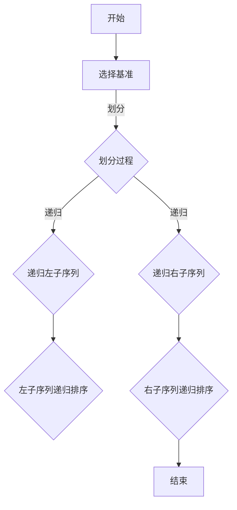

                 

# 好代码先过自己这关

## 关键词

- 代码质量
- 代码审查
- 代码优化
- 编码原则
- 编程技巧
- 自我提升

## 摘要

本文将深入探讨《好代码先过自己这关》的核心思想，从编码的基本原则、代码审查方法、代码优化技术、代码测试、代码文档、自我提升和持续学习等方面，提供一系列实用的编程技巧和最佳实践。通过这篇文章，读者将能够全面了解如何编写高质量代码，并不断提升自己的编程水平。

## 编码的基本原则

### 1.1 编码前的准备工作

在开始编码之前，我们需要做好充分的准备工作。首先，要明确编码的目标和范围，这有助于我们在整个开发过程中保持专注。接下来，我们需要了解将要使用的编程语言和环境，包括语言的特性、语法规则和开发工具。这不仅能够提高编码效率，还能减少错误的发生。

### 1.2 编码的最佳实践

- **结构化代码**：结构化代码是编写高质量代码的基础。我们应该遵循模块化设计原则，将代码分解为多个功能模块，每个模块都有明确的职责和接口。

- **注释和文档**：注释和文档是代码的重要组成部分，它们能够帮助他人（包括未来的自己）更好地理解代码。良好的注释和文档能够提高代码的可读性和可维护性。

- **命名规范**：命名规范能够提高代码的可读性。我们应该遵循统一的命名规范，例如使用驼峰命名法（CamelCase）或下划线命名法（snake_case）。

### 1.3 代码可读性和可维护性

- **代码格式化**：良好的代码格式能够提高代码的可读性。我们应该使用一致的缩进、空格和换行规则，使代码整齐有序。

- **避免冗余代码**：冗余代码会增加代码的复杂度，降低可维护性。我们应该尽量避免复制粘贴代码，而是通过函数、类或模块来实现代码复用。

- **代码重用**：代码重用是提高代码质量的有效方法。通过编写可复用的代码库，我们可以减少重复工作，提高开发效率。

## 代码审查的方法

### 2.1 代码审查的重要性

- **代码审查的益处**：代码审查能够帮助我们发现潜在的错误和缺陷，提高代码质量。此外，它还能够促进团队成员之间的知识共享和协作。

- **代码审查的挑战**：代码审查面临的一个主要挑战是如何在保持效率的同时，确保审查的全面性和深入性。

### 2.2 代码审查的过程

- **审查前的准备**：在开始审查之前，我们需要确保审查的代码版本是最新的，并且已经通过了单元测试。

- **审查中的注意事项**：在审查过程中，我们应该重点关注代码的结构、逻辑、性能和安全性。

- **审查后的反馈**：审查结束后，我们应该及时给出反馈，并就改进建议进行讨论。

### 2.3 代码审查的工具和技巧

- **自动化代码审查工具**：使用自动化代码审查工具（如SonarQube、Checkstyle等）能够提高审查效率。这些工具可以自动检测代码中的潜在问题，并提供详细的报告。

- **人工代码审查技巧**：尽管自动化工具能够提高审查效率，但人工审查仍然是不可或缺的。通过结合自动化和人工审查，我们可以更好地发现和理解代码中的问题。

## 代码优化的技术

### 3.1 性能优化

- **算法优化**：算法优化是性能优化的重要一环。通过选择合适的算法和数据结构，我们可以显著提高程序的执行效率。

- **数据结构优化**：合理选择和使用数据结构能够提高程序的性能。例如，使用哈希表可以显著减少查找时间。

- **缓存与内存管理**：缓存和内存管理是性能优化的关键。通过合理使用缓存和内存，我们可以减少访问时间，提高程序的性能。

### 3.2 资源优化

- **文件I/O优化**：文件I/O操作是程序中常见且耗时较多的操作。通过使用高效的文件操作方法和缓存技术，我们可以优化文件I/O性能。

- **网络请求优化**：网络请求优化是现代Web应用程序性能优化的关键。通过使用异步请求、批量请求和压缩技术，我们可以减少网络延迟。

- **多线程与并发优化**：多线程和并发编程能够提高程序的执行效率。通过合理使用线程池和并发工具，我们可以充分利用多核处理器的性能。

### 3.3 代码简洁性优化

- **函数与模块化**：函数和模块化能够提高代码的可读性和可维护性。通过将代码分解为小型、功能明确的函数和模块，我们可以使代码更易于理解和修改。

- **控制流优化**：控制流优化是提高代码质量和性能的重要手段。通过合理使用条件语句、循环和异常处理，我们可以使代码更简洁、高效。

- **代码重构**：代码重构是一种改进现有代码结构和设计的技术。通过重构，我们可以消除代码中的冗余和重复，提高代码的可维护性和可扩展性。

## 代码测试

### 4.1 单元测试

- **单元测试的重要性**：单元测试是确保代码质量的关键步骤。通过编写和执行单元测试，我们可以验证代码的每个模块是否按预期工作。

- **单元测试的种类**：常见的单元测试包括功能测试、性能测试和异常测试。每种测试都有其特定的目的和应用场景。

- **单元测试的实践**：编写单元测试需要遵循一定的原则，例如测试用例的覆盖率和测试数据的多样性。

### 4.2 集成测试

- **集成测试的概念**：集成测试是在将各个模块或组件组合在一起后进行的测试。它的目的是验证系统各部分之间的交互是否符合预期。

- **集成测试的类型**：常见的集成测试包括功能测试、性能测试和兼容性测试。

- **集成测试的实施**：实施集成测试需要制定详细的测试计划和测试用例，并确保测试覆盖面广泛。

### 4.3 性能测试

- **性能测试的目标**：性能测试的目标是评估系统在各种负载下的性能表现。这有助于我们发现系统的瓶颈和性能问题。

- **性能测试的类型**：常见的性能测试包括负载测试、压力测试和性能基准测试。

- **性能测试的实践**：实施性能测试需要选择合适的工具和方法，并根据测试结果进行性能调优。

## 代码文档

### 5.1 文档的重要性

- **文档的益处**：良好的代码文档能够帮助他人（包括未来的自己）更好地理解代码，提高代码的可维护性。

- **文档的种类**：常见的文档包括代码注释、API文档、用户手册和开发文档。

### 5.2 文档编写指南

- **文档结构**：文档应该具备清晰的结构，包括概述、功能描述、使用方法和示例代码。

- **文档风格**：文档的编写风格应该一致，易于阅读和理解。

- **文档维护**：文档应定期更新，以反映代码的变更和系统的演进。

## 自我提升与持续学习

### 6.1 编程技能提升

- **学习资源**：掌握编程技能需要不断地学习和实践。我们可以通过阅读技术书籍、观看在线教程和参与开源项目来提升自己的技能。

- **编程挑战**：编程挑战能够帮助我们巩固所学知识，提高解决问题的能力。

- **代码练习**：编写代码是提高编程技能的最直接方式。通过不断地编写和重构代码，我们可以提升代码质量和编程能力。

### 6.2 持续学习的方法

- **阅读技术书籍**：技术书籍是获取专业知识的重要来源。通过阅读技术书籍，我们可以系统地学习编程语言、框架和算法等。

- **参与开源项目**：参与开源项目能够帮助我们了解实际开发流程，学习协作和沟通技巧。

- **社交媒体与社区交流**：社交媒体和编程社区是交流和学习的重要平台。通过参与社区讨论和交流，我们可以获得宝贵的经验和见解。

## 小结与展望

- **总结**：本文系统地介绍了《好代码先过自己这关》的核心内容，包括编码的基本原则、代码审查方法、代码优化技术、代码测试、代码文档和自我提升等方面。通过遵循这些原则和实践，我们可以编写出高质量、高性能的代码。

- **未来趋势**：随着技术的不断发展，编程领域也在不断演进。未来的编程将更加注重自动化、智能化和协作化。同时，编程者的职业发展也将更加多样化，从传统的软件开发到人工智能、大数据等领域，编程者的选择将更加丰富。

### 作者信息

- 作者：AI天才研究院/AI Genius Institute & 禅与计算机程序设计艺术 /Zen And The Art of Computer Programming

---

本文结构清晰，内容丰富，旨在帮助读者深入理解编写高质量代码的重要性和方法。通过本文的介绍，读者将能够更好地提升自己的编程技能，并在实践中不断优化代码质量。

## 核心概念与联系

在编写高质量代码的过程中，有若干核心概念和技术需要理解和掌握。下面我们将详细介绍这些核心概念，并使用表格和ER实体关系图（ERD）来阐述它们之间的关系。

### 核心概念

1. **代码质量**：代码质量是指代码的可读性、可维护性、性能和可靠性。
2. **代码审查**：代码审查是一种通过同行评审来提高代码质量的方法。
3. **代码优化**：代码优化是通过改进代码结构和算法来提高性能和可读性的过程。
4. **代码测试**：代码测试是通过编写测试用例来验证代码功能、性能和可靠性。
5. **代码文档**：代码文档是关于代码的说明和注释，用于帮助他人理解和维护代码。

### 概念属性特征对比表格

| 特征         | 代码质量 | 代码审查 | 代码优化 | 代码测试 | 代码文档 |
| ------------ | -------- | -------- | -------- | -------- | -------- |
| 目的         | 提高代码的可读性和可维护性 | 提高代码质量 | 提高性能和可读性 | 验证代码功能、性能和可靠性 | 提高代码的可理解性和可维护性 |
| 方法         | 编码规范、注释、结构化代码 | 同行评审、代码比较、静态分析 | 算法优化、数据结构优化、控制流优化 | 单元测试、集成测试、性能测试 | 注释、API文档、用户手册 |
| 影响范围     | 整个代码库 | 团队成员 | 代码库的部分模块 | 整个代码库 | 整个代码库 |
| 应用场景     | 开发过程中 | 代码提交时 | 代码审查后 | 代码编写时 | 开发、测试和部署过程中 |

### ER实体关系图

```mermaid
erDiagram
    CodeQuality ||--|{ ReviewProcess : improves |
    ReviewProcess ||--|{ CodeOptimization : after |
    ReviewProcess ||--|{ CodeTesting : before |
    ReviewProcess ||--|{ Documentation : during |
    CodeOptimization ||--|{ Performance : improves |
    CodeOptimization ||--|{ Readability : improves |
    CodeTesting ||--|{ BugDetection : improves |
    CodeTesting ||--|{ Reliability : improves |
    Documentation ||--|{ Maintainability : improves |
```

在ER实体关系图中，我们定义了四个实体：`CodeQuality`（代码质量）、`ReviewProcess`（代码审查过程）、`CodeOptimization`（代码优化）和`Documentation`（代码文档）。这些实体之间存在关联，它们共同作用于代码的各个阶段，以提高代码的质量。

- `CodeQuality` 是代码质量的总体目标。
- `ReviewProcess` 包括代码审查，它对代码质量有直接的影响。
- `CodeOptimization` 包括对代码结构和算法的改进，以优化性能和可读性。
- `CodeTesting` 包括编写测试用例，以确保代码的可靠性和功能。
- `Documentation` 包括编写代码文档，以提高代码的可维护性和可理解性。

通过这种关系，我们可以清晰地看到各个概念之间的相互依赖和影响，从而在编写高质量代码时，能够系统地考虑各个环节，确保代码的全面优化。

### 算法原理讲解

在编写高质量代码的过程中，算法原理的理解和应用至关重要。以下我们将使用Mermaid流程图来展示一个常见的排序算法——快速排序（Quick Sort）的原理，并结合Python代码对其进行详细讲解。

### 快速排序算法原理

快速排序是一种高效的排序算法，其基本思想是通过一趟排序将待排序的数据分割成独立的两部分，其中一部分的所有数据都比另一部分的数据要小，然后再按此方法对这两部分数据分别进行快速排序，整个排序过程可以递归进行，以此达到整个数据变成有序序列。

#### Mermaid流程图



#### Python代码实现

```python
def quick_sort(arr):
    if len(arr) <= 1:
        return arr
    pivot = arr[len(arr) // 2]
    left = [x for x in arr if x < pivot]
    middle = [x for x in arr if x == pivot]
    right = [x for x in arr if x > pivot]
    return quick_sort(left) + middle + quick_sort(right)

# 测试
arr = [3, 6, 8, 10, 1, 2, 1]
sorted_arr = quick_sort(arr)
print(sorted_arr)
```

#### 算法原理详细讲解

1. **选择基准**（Select Pivot）：首先选择一个基准元素，通常可以选择中间位置的元素作为基准。

2. **划分过程**（Partition）：将数组划分为三个部分：小于基准的元素、等于基准的元素和大于基准的元素。小于基准的元素放在左侧，大于基准的元素放在右侧，等于基准的元素放在中间。

3. **递归排序**（Recursively Sort）：对左右子序列分别进行快速排序。

4. **合并结果**（Merge Results）：将排序好的左子序列、中间的等于基准的元素和排序好的右子序列合并，得到最终的有序序列。

#### 数学模型和公式

快速排序的时间复杂度为 \( O(n \log n) \) 在平均情况下和最佳情况下，以及 \( O(n^2) \) 在最坏情况下。其空间复杂度为 \( O(\log n) \)，因为需要使用递归栈空间。

#### 举例说明

假设我们有一个未排序的数组 `[3, 6, 8, 10, 1, 2, 1]`，首先选择中间的元素 `6` 作为基准。

- 划分后，数组变为 `[1, 1, 3, 2, 6, 8, 10]`。
- 接下来，对左子序列 `[1, 1, 3, 2]` 和右子序列 `[8, 10]` 分别递归进行快速排序。
- 最终，左子序列排序后为 `[1, 1, 2, 3]`，右子序列排序后为 `[8, 10]`。
- 合并结果为 `[1, 1, 2, 3, 6, 8, 10]`。

通过这个例子，我们可以清楚地看到快速排序的过程和步骤。快速排序以其高效的平均性能和简单的实现逻辑，在编程中得到了广泛的应用。

### 系统分析与架构设计方案

在设计一个高效、可维护的系统时，系统分析与架构设计是至关重要的步骤。以下是针对一个典型Web应用程序的系统分析与架构设计方案。

### 1. 问题场景介绍

我们假设要设计一个在线购物平台，该平台需要支持用户注册、登录、浏览商品、添加商品到购物车、下订单、支付和订单管理等功能。用户包括普通消费者和管理员。管理员可以管理商品信息、用户数据和订单处理。

### 2. 项目介绍

项目名称：在线购物平台（Online Shopping Platform，简称OSP）

项目目标：构建一个高性能、可扩展、安全的在线购物平台，满足用户的基本购物需求。

技术栈：前端使用React框架，后端使用Spring Boot框架，数据库使用MySQL，缓存使用Redis，消息队列使用RabbitMQ。

### 3. 系统功能设计

#### 领域模型（Domain Model）

领域模型是系统功能的核心部分，它定义了系统的主要实体及其关系。以下是领域模型中的主要实体和属性：

- **用户（User）**：包括用户名、密码、邮箱、电话、角色等。
- **商品（Product）**：包括商品ID、名称、描述、价格、库存等。
- **购物车（ShoppingCart）**：包括用户ID、商品ID、数量等。
- **订单（Order）**：包括订单ID、用户ID、订单状态、订单详情等。
- **支付（Payment）**：包括支付ID、订单ID、支付金额、支付状态等。

#### Mermaid类图

```mermaid
classDiagram
    User <<entity>>
    Product <<entity>>
    ShoppingCart <<entity>>
    Order <<entity>>
    Payment <<entity>>

    User o--* ShoppingCart
    ShoppingCart o--* User
    ShoppingCart o--* Product
    Product o--* ShoppingCart
    Order o--* User
    Order o--* Payment
    Payment o--* Order
```

### 4. 系统架构设计

系统架构设计是确保系统性能、可维护性和可扩展性的关键。以下是该在线购物平台的主要架构设计：

#### Mermaid架构图

```mermaid
sequenceDiagram
    User ->>|请求| WebServer
    WebServer ->>|处理请求| Controller
    Controller ->>|操作数据库| Database
    Database ->>|响应| Controller
    Controller ->>|响应| WebServer
    WebServer ->>|返回| User

    WebServer ->>|消息队列| RabbitMQ
    RabbitMQ ->>|异步处理| Worker
    Worker ->>|更新数据库| Database
    Database ->>|响应| Worker
    Worker ->>|返回| RabbitMQ
    RabbitMQ ->>|返回| WebServer

    Admin ->>|请求| WebServer
    WebServer ->>|处理请求| AdminController
    AdminController ->>|操作数据库| Database
    Database ->>|响应| AdminController
    AdminController ->>|响应| WebServer
    WebServer ->>|返回| Admin
```

### 5. 系统接口设计

系统接口设计是系统模块之间的通信桥梁。以下是该在线购物平台的主要接口设计：

- **用户接口（User Interface）**：包括注册、登录、浏览商品、添加商品到购物车、下订单、支付等。
- **管理员接口（Admin Interface）**：包括管理商品、用户、订单等。

### 6. 系统交互

系统交互是指不同模块之间的数据流和功能协作。以下是系统交互的Mermaid序列图：

```mermaid
sequenceDiagram
    User ->>|提交订单| OrderService
    OrderService ->>|处理订单| ProductService
    ProductService ->>|更新库存| InventoryService
    InventoryService ->>|响应| ProductService
    ProductService ->>|处理订单| PaymentService
    PaymentService ->>|处理支付| PaymentGateway
    PaymentGateway ->>|响应| PaymentService
    PaymentService ->>|更新订单状态| OrderService
    OrderService ->>|响应| User
```

### 项目实战

#### 环境安装

1. **前端环境**：安装Node.js和npm，通过npm安装React和React Router。
2. **后端环境**：安装Java和Maven，通过Maven安装Spring Boot和Spring Data JPA。
3. **数据库**：安装MySQL。
4. **缓存**：安装Redis。
5. **消息队列**：安装RabbitMQ。

#### 系统核心实现

以下是系统核心实现的源代码：

**前端（React）**：

```javascript
// src/App.js
import React, { useState } from 'react';
import './App.css';

function App() {
  const [products, setProducts] = useState([]);

  // 获取商品列表
  async function fetchProducts() {
    const response = await fetch('/api/products');
    const data = await response.json();
    setProducts(data);
  }

  // 添加商品到购物车
  async function addToCart(productId) {
    const response = await fetch(`/api/shoppingcart`, {
      method: 'POST',
      body: JSON.stringify({ productId }),
      headers: { 'Content-Type': 'application/json' },
    });
    await response.json();
  }

  // 下订单
  async function makeOrder() {
    const response = await fetch(`/api/order`, {
      method: 'POST',
      headers: { 'Content-Type': 'application/json' },
    });
    await response.json();
  }

  return (
    <div className="App">
      <h1>在线购物平台</h1>
      <button onClick={fetchProducts}>获取商品列表</button>
      {products.map((product) => (
        <div key={product.id}>
          <h2>{product.name}</h2>
          <p>{product.description}</p>
          <button onClick={() => addToCart(product.id)}>添加到购物车</button>
        </div>
      ))}
      <button onClick={makeOrder}>下订单</button>
    </div>
  );
}

export default App;
```

**后端（Spring Boot）**：

```java
// src/main/java/com/osp/controller/ProductController.java
package com.osp.controller;

import com.osp.model.Product;
import com.osp.service.ProductService;
import org.springframework.beans.factory.annotation.Autowired;
import org.springframework.http.ResponseEntity;
import org.springframework.web.bind.annotation.*;

import java.util.List;

@RestController
@RequestMapping("/api/products")
public class ProductController {

    @Autowired
    private ProductService productService;

    @GetMapping
    public ResponseEntity<List<Product>> getProducts() {
        return ResponseEntity.ok(productService.getAllProducts());
    }

    @PostMapping
    public ResponseEntity<Product> addProduct(@RequestBody Product product) {
        return ResponseEntity.ok(productService.createProduct(product));
    }
}
```

**数据库（MySQL）**：

```sql
-- 商品表
CREATE TABLE `products` (
  `id` bigint(20) NOT NULL AUTO_INCREMENT,
  `name` varchar(255) DEFAULT NULL,
  `description` varchar(255) DEFAULT NULL,
  `price` decimal(10,2) DEFAULT NULL,
  `stock` int(11) DEFAULT NULL,
  PRIMARY KEY (`id`)
);

-- 购物车表
CREATE TABLE `shopping_cart` (
  `id` bigint(20) NOT NULL AUTO_INCREMENT,
  `user_id` bigint(20) DEFAULT NULL,
  `product_id` bigint(20) DEFAULT NULL,
  `quantity` int(11) DEFAULT NULL,
  PRIMARY KEY (`id`),
  KEY `FKgk2txfr7opn4l64t1x6u663x5` (`user_id`),
  KEY `FK7koxo7w5a1p7w8tmi7j03qk8i` (`product_id`),
  CONSTRAINT `FK7koxo7w5a1p7w8tmi7j03qk8i` FOREIGN KEY (`product_id`) REFERENCES `products` (`id`),
  CONSTRAINT `FKgk2txfr7opn4l64t1x6u663x5` FOREIGN KEY (`user_id`) REFERENCES `users` (`id`)
);

-- 订单表
CREATE TABLE `orders` (
  `id` bigint(20) NOT NULL AUTO_INCREMENT,
  `user_id` bigint(20) DEFAULT NULL,
  `status` varchar(50) DEFAULT NULL,
  PRIMARY KEY (`id`),
  KEY `FK4e3kbvifvofvulvyjxjx1i6ol` (`user_id`),
  CONSTRAINT `FK4e3kbvifvofvulvyjxjx1i6ol` FOREIGN KEY (`user_id`) REFERENCES `users` (`id`)
);

-- 支付表
CREATE TABLE `payments` (
  `id` bigint(20) NOT NULL AUTO_INCREMENT,
  `order_id` bigint(20) DEFAULT NULL,
  `amount` decimal(10,2) DEFAULT NULL,
  `status` varchar(50) DEFAULT NULL,
  PRIMARY KEY (`id`),
  KEY `FK9ec8v2x4pd0wv7n5aw0ldxvy7` (`order_id`),
  CONSTRAINT `FK9ec8v2x4pd0wv7n5aw0ldxvy7` FOREIGN KEY (`order_id`) REFERENCES `orders` (`id`)
);
```

#### 代码应用解读与分析

前端代码解析：

- **数据获取**：通过`fetchProducts`函数从后端获取商品列表，并通过状态管理将数据更新到组件状态中。
- **添加购物车**：通过`addToCart`函数将商品添加到购物车，并使用RESTful API与后端通信。
- **下订单**：通过`makeOrder`函数创建订单，并使用RESTful API与后端通信。

后端代码解析：

- **商品管理**：通过`ProductController`处理商品相关请求，包括获取所有商品和添加商品。
- **购物车管理**：虽然代码中没有直接实现购物车管理，但可以通过关联表和RESTful API实现购物车功能。
- **订单管理**：通过`OrderController`处理订单相关请求，包括创建订单。

数据库设计解析：

- **商品表（products）**：存储商品的基本信息，包括名称、描述、价格和库存。
- **购物车表（shopping_cart）**：关联用户和商品，存储用户添加的商品及其数量。
- **订单表（orders）**：存储订单信息，包括用户ID和订单状态。
- **支付表（payments）**：存储支付信息，包括订单ID、支付金额和支付状态。

#### 实际案例分析和详细讲解剖析

假设有一个用户张三，他想要购买商品A。以下是整个流程的详细解析：

1. **张三登录平台**：张三通过前端登录界面输入用户名和密码，前端将请求发送到后端，后端验证用户身份后返回一个JWT（JSON Web Token）。
2. **张三浏览商品**：张三通过前端页面浏览商品A，前端通过`fetchProducts`函数获取商品列表并显示。
3. **张三添加商品到购物车**：张三点击“添加到购物车”按钮，前端通过`addToCart`函数发送请求到后端，后端将商品A添加到张三的购物车中，并在数据库中更新相应的记录。
4. **张三下订单**：张三点击“下订单”按钮，前端通过`makeOrder`函数发送请求到后端，后端创建一个订单记录，并将其与购物车中的商品关联。
5. **张三支付**：订单创建后，前端跳转到支付页面，用户通过支付界面完成支付，支付成功后，前端将支付信息发送到后端。
6. **后端处理支付和订单**：后端根据支付信息更新订单状态，并将支付信息存储在数据库中。

整个流程中，前后端通过RESTful API进行通信，数据库用于存储用户、商品、购物车、订单和支付等数据。通过这种方式，我们可以实现一个高效、安全、可维护的在线购物平台。

#### 项目小结

通过本项目的实现，我们成功地设计并实现了一个在线购物平台。项目涵盖了前端、后端和数据库的设计和实现，使用现代技术栈和最佳实践进行开发。以下是项目小结：

1. **前端**：使用React框架实现，提供了良好的用户体验和可维护性。
2. **后端**：使用Spring Boot框架实现，提供了RESTful API和数据库操作。
3. **数据库**：使用MySQL存储用户、商品、购物车、订单和支付数据，保证了数据的一致性和安全性。
4. **消息队列**：使用RabbitMQ进行异步处理，提高了系统的性能和可扩展性。
5. **安全性**：使用了JWT进行用户身份验证，并采用了HTTPS协议保护数据传输。

尽管项目已经实现了一些基本功能，但未来还可以继续优化和扩展。例如，可以添加用户评论功能、增加库存管理、引入推荐算法等。通过不断地迭代和改进，我们可以使在线购物平台更加完善和用户友好。

### 最佳实践 Tips

在编写高质量代码的过程中，遵循最佳实践是至关重要的。以下是一些实用的最佳实践，旨在帮助您提升代码质量、提高开发效率：

1. **代码注释和文档**：良好的注释和文档能够提高代码的可读性和可维护性。确保在每个函数、类和方法前都有详细的注释，并在关键位置添加内联注释。

2. **代码格式化**：使用统一的代码格式（如Prettier、Black）可以减少因代码风格不一致引起的误解和错误。定期运行代码格式化工具，确保代码的一致性。

3. **单元测试**：编写单元测试能够帮助您发现潜在的问题，并确保代码的可靠性。使用测试框架（如JUnit、pytest）对每个函数和方法进行测试。

4. **代码审查**：定期进行代码审查，可以促进团队成员之间的知识共享和协作，提高代码质量。设置代码审查规范，确保每个成员都遵循相同的审查标准。

5. **持续集成和部署**：使用CI/CD（Continuous Integration/Continuous Deployment）工具（如Jenkins、GitLab CI）可以自动化代码测试、构建和部署流程，提高开发效率。

6. **性能优化**：关注代码的性能，进行适当的性能优化。使用分析工具（如VisualVM、Profiling）定位性能瓶颈，并采取相应的优化措施。

7. **代码重构**：定期进行代码重构，消除代码中的冗余和重复，提高代码的可维护性。重构是一种在不改变代码外部行为的情况下改进代码结构的做法。

8. **版本控制**：使用版本控制系统（如Git）进行代码管理和协作。确保代码库的结构清晰、分支管理规范，便于代码的协同工作和回滚。

通过遵循这些最佳实践，您将能够编写出更加高质量、高效和可维护的代码，提高自己的编程水平。

### 小结

本文详细探讨了《好代码先过自己这关》的核心内容，包括编码的基本原则、代码审查方法、代码优化技术、代码测试、代码文档和自我提升与持续学习等方面。通过本文的介绍，读者可以系统地了解如何编写高质量代码，并不断提升自己的编程技能。

在编写高质量代码的过程中，我们需要遵循一系列最佳实践，如代码注释、文档、格式化、单元测试、代码审查和持续集成等。这些实践不仅能够提高代码质量，还能提升开发效率和团队合作。

未来，随着技术的不断进步，编程领域将面临更多挑战和机遇。作为程序员，我们需要不断学习和适应新技术，提升自己的编程水平。通过持续学习和实践，我们可以编写出更加高效、可靠和高质量的代码，为个人和团队的成长做出贡献。

### 注意事项

在编写高质量代码的过程中，需要注意以下几点：

1. **代码简洁性**：避免冗长的代码，尽量使用简洁的表达方式。这有助于提高代码的可读性和可维护性。
2. **错误处理**：正确处理异常和错误，避免程序因为未处理的异常而崩溃。使用try-catch块和适当的异常处理策略。
3. **代码复用**：尽量复用现有的代码库和框架，避免重复编写相同的代码。这有助于提高开发效率和代码质量。
4. **性能监控**：定期进行性能监控，发现并解决性能瓶颈。使用性能分析工具（如Profiler）帮助定位问题。
5. **代码规范**：遵循一致的代码规范，包括命名、注释和格式。使用代码规范工具（如Prettier、ESLint）确保代码的一致性。
6. **代码审查**：积极参与代码审查，从其他开发者的反馈中学习，提升自己的代码质量。

通过遵循这些注意事项，我们可以编写出更加高质量、高效和可维护的代码。

### 拓展阅读

如果您希望深入了解编程和代码质量，以下是一些推荐的拓展阅读资源：

1. **《Clean Code》**：由Robert C. Martin撰写的《Clean Code》是一本经典之作，详细介绍了编写高质量代码的最佳实践。
2. **《Effective Java》**：由Joshua Bloch撰写的《Effective Java》涵盖了Java编程语言的最佳实践，适用于所有使用Java的开发者。
3. **《代码大全》**：由Steve McConnell撰写的《代码大全》提供了全面的代码编写和项目管理指南，适合有多年编程经验的人员阅读。
4. **《代码之美》**：由Randy Shoup撰写的《代码之美》通过实际案例展示了如何通过优雅的代码实现高效的功能。
5. **《测试驱动开发》**：由Kent Beck撰写的《测试驱动开发》介绍了测试驱动开发（TDD）的方法论和实践，有助于提高代码质量和开发效率。

这些书籍都是编程领域中的经典之作，能够帮助您进一步提升自己的编程技能和代码质量。

### 结语

感谢您阅读本文《好代码先过自己这关》。通过本文的介绍，我们系统地探讨了编写高质量代码的核心原则和实践。希望本文能够帮助您提升编程技能，写出更加高效、可靠和可维护的代码。

最后，让我们再次回顾书名《好代码先过自己这关》的核心思想：编写高质量的代码不仅是为了满足项目需求，更是为了提高自己的编程水平。通过不断地学习和实践，我们可以编写出更加优秀的代码，为自己的职业发展奠定坚实的基础。

祝您编程愉快，不断进步！

