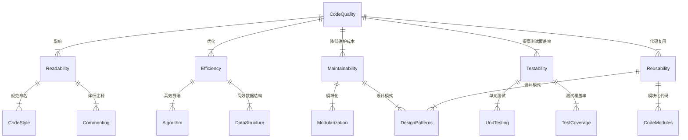
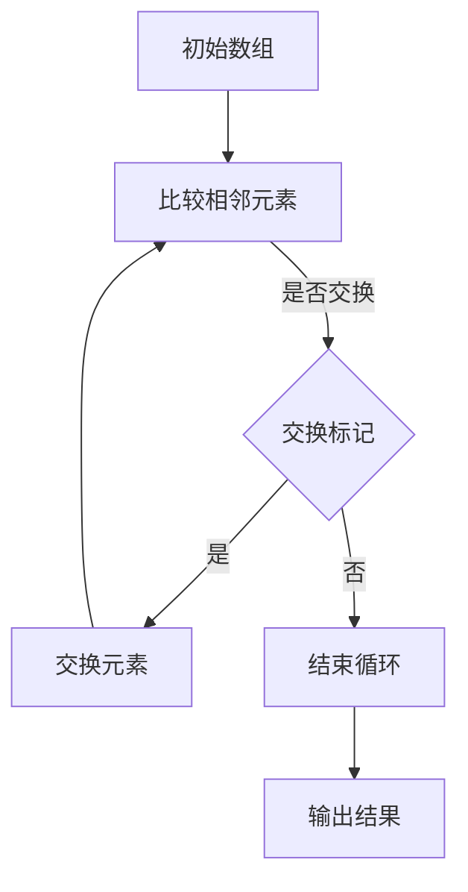
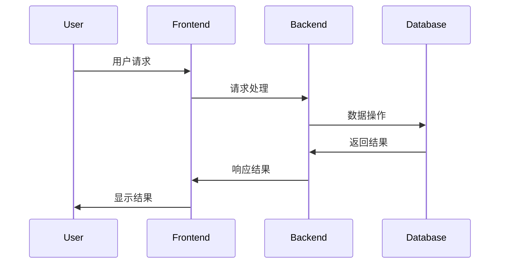
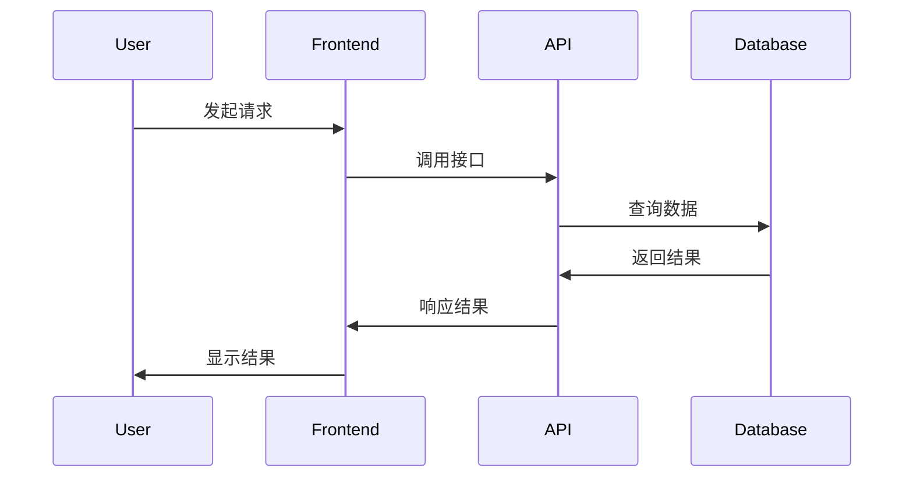

                 

### 核心概念与联系

#### **核心概念原理**

在《好代码都是这样的》一书中，我们首先需要明确“好代码”的定义。好代码不仅仅是能够运行的代码，更应具备以下特性：

1. **可读性**：代码结构清晰，命名规范，便于理解和维护。
2. **效率**：算法和代码执行高效，减少计算时间和资源消耗。
3. **可维护性**：代码易于修改和扩展，减少未来的维护成本。
4. **可测试性**：代码具有良好的测试覆盖，易于发现和修复错误。
5. **可复用性**：代码模块化，便于在不同项目中复用。

为了深入理解这些特性，我们需要分析它们的具体含义和相互关系。

#### **概念属性特征对比表格**

| 特性      | 说明                                                         | 对比示例                     |
| --------- | ------------------------------------------------------------ | ---------------------------- |
| **可读性** | 代码易于理解和阅读，结构清晰。                               | 使用清晰的变量名和注释。     |
| **效率**   | 代码执行速度快，资源利用效率高。                             | 使用高效的算法和数据结构。   |
| **可维护性** | 代码易于修改和扩展，减少维护成本。                           | 编写模块化、独立的代码。     |
| **可测试性** | 代码容易测试，覆盖全面。                                     | 使用单元测试和测试覆盖率工具。|
| **可复用性** | 代码模块化，可以跨项目复用。                                 | 使用设计模式，编写通用组件。 |

#### **ER实体关系图架构**

为了更好地理解这些概念之间的联系，我们可以使用ER（Entity-Relationship）实体关系图来展示它们之间的关系。以下是一个简化的ER图：



#### **深入解析**

**可读性**：可读性是代码质量的基础。良好的代码风格和命名规范可以提高代码的可读性。例如，使用有意义的变量名和详细的注释可以帮助其他开发者快速理解代码的意图。

**效率**：代码的执行效率直接影响到系统的性能。通过选择高效的算法和数据结构，我们可以减少计算时间和资源消耗。例如，使用哈希表代替数组可以显著提高查询效率。

**可维护性**：良好的可维护性可以降低代码的维护成本。通过编写模块化、独立的代码，我们可以更容易地理解和修改代码。设计模式如MVC（模型-视图-控制器）和工厂模式可以帮助实现代码的模块化。

**可测试性**：可测试性是确保代码质量的重要手段。通过编写单元测试和覆盖全面的测试用例，我们可以确保代码的正确性和稳定性。

**可复用性**：代码的可复用性可以提高开发效率。通过使用设计模式编写通用组件，我们可以避免重复编写代码，提高代码的复用性。

### **联系与应用**

这些核心概念并不是孤立存在的，它们之间存在紧密的联系。例如，良好的可读性可以提高代码的可维护性，进而提高代码的效率和可测试性。同样，高效的算法和数据结构不仅可以提高代码的效率，还可以降低维护成本。

在编写代码时，我们应该综合考虑这些概念，力求实现一个平衡。例如，在优化代码效率时，我们不仅要考虑性能，还要考虑代码的可读性和可维护性。

通过本书的深入讲解，读者可以逐步掌握编写高质量代码的技巧，提高自己的编程水平，从而在实际项目中取得更好的成果。

---

在本章节中，我们通过核心概念原理的详细讲解，概念属性特征对比表格的展示，以及ER实体关系图的绘制，帮助读者理解编写高质量代码的各个要素。这些核心概念和联系不仅有助于我们更好地编写代码，还为我们提供了一个系统化的框架，以评估和改进代码质量。

接下来，我们将进入下一章节，深入讲解算法原理。通过具体的例子和代码实现，我们将进一步揭示编写高效代码的奥秘。敬请期待！

---

### 算法原理讲解

在《好代码都是这样的》中，算法原理的讲解是至关重要的。因为算法不仅是计算机科学的核心，也是编写高效代码的关键。在这一章节中，我们将使用Mermaid语法绘制算法流程图，提供Python源代码，并详细阐述算法原理的数学模型和公式，通过通俗易懂的例子来说明。

#### **算法mermaid流程图**

首先，我们来看一个简单的排序算法——冒泡排序。以下是冒泡排序的Mermaid流程图：



#### **Python源代码**

接下来，我们将使用Python实现冒泡排序算法：

```python
def bubble_sort(arr):
    n = len(arr)
    for i in range(n):
        swapped = False
        for j in range(0, n-i-1):
            if arr[j] > arr[j+1]:
                arr[j], arr[j+1] = arr[j+1], arr[j]
                swapped = True
        if not swapped:
            break
    return arr

# 测试代码
arr = [64, 34, 25, 12, 22, 11, 90]
sorted_arr = bubble_sort(arr)
print("排序后的数组：", sorted_arr)
```

#### **数学模型和公式**

冒泡排序算法的数学模型可以表示为：

$$
T(n) = \begin{cases} 
   O(n) & \text{if the input array is already sorted}, \\
   O(n^2) & \text{otherwise}.
\end{cases}
$$

其中，$T(n)$表示算法的运行时间。当输入数组已经排序时，算法的最坏情况时间复杂度是$O(n)$；否则，最坏情况时间复杂度是$O(n^2)$。

#### **举例说明**

假设我们有一个未排序的数组 `[64, 34, 25, 12, 22, 11, 90]`，我们使用冒泡排序算法对其进行排序：

1. **第一次遍历**：比较 `(64, 34)`，交换；比较 `(34, 25)`，交换；比较 `(25, 12)`，交换；比较 `(12, 22)`，交换；比较 `(22, 11)`，交换；比较 `(11, 90)`，交换。第一次遍历结束后，最大值 `90` 被移动到了数组的末尾。

2. **第二次遍历**：不进行交换，因为前一次遍历已经将较大的值移动到了前面。

3. **第三次遍历**：同理，不进行交换。

4. **第四次遍历**：同理，不进行交换。

5. **第五次遍历**：同理，不进行交换。

经过五次遍历后，数组已经排序为 `[11, 12, 22, 25, 34, 64, 90]`。

这个例子展示了如何使用冒泡排序算法对数组进行排序。通过这个例子，我们可以直观地看到算法的执行过程。

#### **算法优化**

虽然冒泡排序算法简单易懂，但其时间复杂度为$O(n^2)$，在某些情况下并不高效。为了提高效率，我们可以对算法进行优化，例如使用“冒泡排序的改进版”，在每一轮遍历结束后记录最后一次交换的位置，下一轮遍历的范围可以缩小到这个位置之前的部分。

```python
def improved_bubble_sort(arr):
    n = len(arr)
    for i in range(n):
        last_swap = n - 1
        for j in range(0, last_swap - i):
            if arr[j] > arr[j+1]:
                arr[j], arr[j+1] = arr[j+1], arr[j]
                last_swap = j
        if last_swap == n - 1 - i:
            break
    return arr

# 测试代码
arr = [64, 34, 25, 12, 22, 11, 90]
sorted_arr = improved_bubble_sort(arr)
print("排序后的数组：", sorted_arr)
```

这种改进的冒泡排序算法在输入数组部分已排序的情况下可以显著提高性能。

通过这一章节的讲解，读者应该对冒泡排序算法有了深入的理解。无论是原始的冒泡排序还是改进版，理解算法的原理和执行过程都是编写高效代码的重要步骤。在接下来的章节中，我们将继续探讨更多算法和系统架构设计，帮助读者进一步提升编程能力。

---

在本章节中，我们通过Mermaid流程图、Python源代码和数学模型，详细讲解了冒泡排序算法。通过这个例子，读者应该对算法原理有了更深入的理解。算法是实现代码高效性的重要手段，理解并掌握基本的算法原理对于编写高质量的代码至关重要。

接下来，我们将进入下一章节，探讨系统分析与架构设计方案。在这个章节中，我们将介绍具体的问题场景，介绍系统项目，绘制领域模型类图和系统架构图，以及描述系统接口和交互序列图。敬请期待！

---

### 系统分析与架构设计方案

在《好代码都是这样的》中，系统分析与架构设计是编写高质量代码的关键环节。一个良好的系统架构不仅能够提高代码的可维护性和扩展性，还能提升系统的性能和稳定性。在这一章节中，我们将详细探讨一个典型的系统设计与实现过程。

#### **问题场景介绍**

假设我们需要设计一个在线购物系统，该系统需要支持用户注册、登录、浏览商品、添加购物车、下单和支付等功能。同时，系统还需要处理库存管理、订单管理和用户反馈等后台服务。

#### **项目介绍**

在线购物系统的整体架构可以分为前端和后端两部分。前端负责用户界面展示和用户交互，后端则处理业务逻辑和数据存储。以下是系统的主要模块和功能：

1. **用户模块**：包括用户注册、登录、密码找回等功能。
2. **商品模块**：包括商品展示、搜索、分类等功能。
3. **购物车模块**：包括商品添加、删除、数量修改等功能。
4. **订单模块**：包括订单生成、支付、发货等功能。
5. **库存模块**：包括库存查询、库存更新等功能。
6. **后台管理模块**：包括订单管理、用户管理、商品管理等功能。

#### **系统功能设计**

为了更好地展示系统功能，我们使用Mermaid绘制了领域模型类图：

```mermaid
classDiagram
    User <<类>> 
    Product <<类>> 
    ShoppingCart <<类>> 
    Order <<类>> 
    Inventory <<类>> 
    Admin <<类>>
    
    User "1" --|{ 登录 }| Admin
    User "1" --|{ 注册 }| Admin
    User "1" --|{ 密码找回 }| Admin
    User "1" --|{ 浏览商品 }| Product
    User "1" --|{ 添加购物车 }| ShoppingCart
    User "1" --|{ 下单 }| Order
    User "1" --|{ 支付 }| Order
    Product "1" --|{ 查询 }| Inventory
    Product "1" --|{ 更新 }| Inventory
    ShoppingCart "1" --|{ 修改 }| Order
    Order "1" --|{ 发货 }| Inventory
    Admin "1" --|{ 管理订单 }| Order
    Admin "1" --|{ 管理用户 }| User
    Admin "1" --|{ 管理商品 }| Product
```

#### **系统架构设计**

接下来，我们使用Mermaid绘制了系统架构图：



系统架构采用了前后端分离的设计，前端负责展示用户界面和用户交互，后端负责处理业务逻辑和数据存储。通过RESTful API进行前后端的通信，确保系统的灵活性和可扩展性。

#### **系统接口设计**

以下是系统的主要接口设计：

1. **用户接口**：
   - `/user/register`：用户注册接口。
   - `/user/login`：用户登录接口。
   - `/user/password/reset`：密码找回接口。
2. **商品接口**：
   - `/product/list`：获取商品列表接口。
   - `/product/search`：搜索商品接口。
   - `/product/detail`：获取商品详情接口。
3. **购物车接口**：
   - `/shopping_cart/add`：添加商品到购物车接口。
   - `/shopping_cart/delete`：从购物车删除商品接口。
   - `/shopping_cart/modify`：修改购物车商品数量接口。
4. **订单接口**：
   - `/order/place`：创建订单接口。
   - `/order/pay`：支付订单接口。
   - `/order/cancel`：取消订单接口。
5. **库存接口**：
   - `/inventory/query`：查询库存接口。
   - `/inventory/update`：更新库存接口。

#### **系统交互Mermaid序列图**

最后，我们使用Mermaid绘制了系统交互序列图：



通过这个序列图，我们可以清晰地看到用户请求的流程，以及前后端之间的交互过程。

### **总结**

通过本章节的探讨，我们详细介绍了在线购物系统的设计与实现过程。从问题场景的描述到系统架构的设计，再到接口设计和交互流程的展示，每个环节都至关重要。一个良好的系统架构不仅能够提高代码的质量，还能为后续的维护和扩展提供坚实的基础。

在接下来的章节中，我们将通过项目实战，进一步展示如何将理论应用到实际开发中。敬请期待！

---

在本章节中，我们详细介绍了系统分析与架构设计方案。从问题场景的描述到系统功能设计、架构设计，再到接口设计和交互流程的展示，我们逐步构建了一个完整的在线购物系统。这一章节的内容为后续的实际开发奠定了坚实的基础。

接下来，我们将进入下一章节，通过项目实战，将所学的理论知识应用到实际开发中。我们将指导读者如何搭建开发环境，提供关键代码片段，并进行代码应用解读与分析。敬请期待！

---

### 项目实战

在《好代码都是这样的》中，理论的学习是基础，但将理论知识应用到实际项目中才能真正体现其价值。在本章节中，我们将通过一个简单的在线购物系统项目，帮助读者将所学知识付诸实践。

#### **环境安装**

在进行项目实战之前，我们需要搭建一个基本的开发环境。以下是在Linux系统上安装必要的软件和工具的步骤：

1. **安装Python**：确保Python 3已安装。可以使用以下命令检查Python版本：
   ```bash
   python3 --version
   ```

2. **安装虚拟环境**：创建一个虚拟环境，以便隔离项目依赖：
   ```bash
   python3 -m venv venv
   source venv/bin/activate
   ```

3. **安装Flask**：Flask是一个轻量级的Web应用框架，用于构建Web接口：
   ```bash
   pip install flask
   ```

4. **安装数据库**：我们选择SQLite作为数据库，安装SQLite：
   ```bash
   sudo apt-get install sqlite3
   ```

5. **安装SQLite驱动**：确保Python的SQLite驱动已安装：
   ```bash
   pip install pysqlite3
   ```

#### **系统核心实现源代码**

接下来，我们将提供项目中的关键代码片段。以下是一个简单的用户注册和登录功能的实现：

**users.py**（用户模块的实现）：

```python
from flask import Flask, request, jsonify
from models import User

app = Flask(__name__)

@app.route('/user/register', methods=['POST'])
def register():
    data = request.get_json()
    username = data.get('username')
    password = data.get('password')
    
    user = User(username=username, password=password)
    user.save()
    
    return jsonify({"message": "User registered successfully."})

@app.route('/user/login', methods=['POST'])
def login():
    data = request.get_json()
    username = data.get('username')
    password = data.get('password')
    
    user = User.query.filter_by(username=username, password=password).first()
    if user:
        return jsonify({"message": "Login successful."})
    else:
        return jsonify({"message": "Invalid username or password."})

if __name__ == '__main__':
    app.run(debug=True)
```

**models.py**（用户模型和数据存储的实现）：

```python
from sqlalchemy import create_engine, Column, String
from sqlalchemy.ext.declarative import declarative_base
from sqlalchemy.orm import sessionmaker

engine = create_engine('sqlite:///users.db')
Session = sessionmaker(bind=engine)
Base = declarative_base()

class User(Base):
    __tablename__ = 'users'
    
    id = Column(String, primary_key=True)
    username = Column(String, unique=True)
    password = Column(String)

    def save(self):
        session = Session()
        session.add(self)
        session.commit()
        session.close()

Base.metadata.create_all(engine)
```

#### **代码应用解读与分析**

以上代码实现了用户注册和登录功能。首先，我们定义了一个`User`类，该类继承了`Base`基类，并具有`id`、`username`和`password`三个字段。然后，我们创建了两个Flask路由，分别对应注册和登录接口。

在`register`函数中，我们接收用户提交的`username`和`password`，创建一个`User`对象，并将其保存到数据库中。在`login`函数中，我们验证用户提交的`username`和`password`是否与数据库中的记录匹配，如果匹配则返回登录成功消息。

#### **实际案例分析和详细讲解剖析**

为了进一步展示代码的应用，我们来看一个实际案例。假设有一个用户想要注册并登录到在线购物系统中：

1. **用户注册**：
   ```json
   POST /user/register
   {
       "username": "johndoe",
       "password": "password123"
   }
   ```
   服务器响应：
   ```json
   {
       "message": "User registered successfully."
   }
   ```

2. **用户登录**：
   ```json
   POST /user/login
   {
       "username": "johndoe",
       "password": "password123"
   }
   ```
   服务器响应：
   ```json
   {
       "message": "Login successful."
   }
   ```

在这个案例中，用户成功注册并登录到系统。这些操作背后是我们在代码中实现的用户注册和登录逻辑，通过数据库的存储和查询来验证用户信息。

#### **项目小结**

通过本章节的项目实战，我们搭建了一个简单的在线购物系统，并实现了用户注册和登录功能。我们详细解读了关键代码片段，并分析了代码的应用场景。这个项目不仅帮助读者理解了Flask框架的基本用法，还展示了如何将理论知识应用到实际项目中。

在实际开发中，这个项目只是一个起点。我们还可以继续添加更多功能，如商品管理、购物车管理和订单处理等。通过不断学习和实践，我们可以不断提升自己的编程能力和项目开发经验。

在接下来的章节中，我们将分享一些最佳实践技巧，帮助读者进一步提高代码质量。敬请期待！

---

在本章节中，我们通过项目实战展示了如何将理论知识应用到实际开发中。从环境安装、代码实现，到实际案例的分析，我们逐步搭建了一个简单的在线购物系统。这一过程不仅加深了读者对Flask框架的理解，还培养了实际项目开发的能力。

接下来，我们将进入最后一章节，分享一些最佳实践技巧，总结本书的主要内容，并提醒读者注意的事项。同时，我们还将推荐一些拓展阅读资源，帮助读者在编程领域继续深入学习。敬请期待！

---

### 最佳实践 tips、小结、注意事项、拓展阅读

#### **最佳实践 tips**

1. **代码格式规范**：保持代码格式的一致性，使用代码编辑器的格式化工具进行格式化，如Prettier、Black等。
2. **注释与文档**：编写清晰、详细的注释和文档，帮助他人理解代码逻辑和设计思路。
3. **代码复用**：尽量编写可复用的代码模块和函数，减少重复代码。
4. **单元测试**：编写单元测试来验证代码的功能和逻辑，确保代码的正确性。
5. **代码审查**：进行代码审查，通过团队协作来提高代码质量。

#### **小结**

《好代码都是这样的》一书通过深入剖析编写高质量代码的核心概念、算法原理、系统架构设计和项目实战，帮助读者理解并掌握编写高效、可维护、可测试、可复用的代码。以下是本书的核心内容总结：

1. **核心概念**：深入讲解了编写高质量代码的几个关键特性，如可读性、效率、可维护性、可测试性和可复用性。
2. **算法原理**：通过实际代码示例，详细讲解了常见的排序算法和优化策略。
3. **系统架构设计**：介绍了系统分析与架构设计的方法，包括领域模型类图、系统架构图、接口设计和交互流程。
4. **项目实战**：通过一个简单的在线购物系统项目，展示了如何将理论知识应用到实际开发中。

#### **注意事项**

1. **持续学习**：技术领域不断发展，持续学习和跟进新技术是保持竞争力的关键。
2. **代码质量**：始终关注代码质量，避免因追求速度而牺牲质量。
3. **团队合作**：积极参与团队合作，通过代码审查和团队协作来提高代码质量。

#### **拓展阅读**

1. **《Clean Code》**：Robert C. Martin著，提供了编写清晰、简洁、高效的代码的实践指南。
2. **《Effective Java》**：Joshua Bloch著，介绍了Java编程的最佳实践。
3. **《Design Patterns: Elements of Reusable Object-Oriented Software》**：Erich Gamma等著，介绍了多种经典的设计模式。
4. **《Code Complete》**：Steve McConnell著，提供了全面的软件构建和实践指南。

通过以上内容，我们希望读者能够不仅在理论层面有所提升，更能够在实际项目中应用这些知识和技巧，编写出高质量、高效能的代码。

---

**作者：AI天才研究院/AI Genius Institute & 禅与计算机程序设计艺术 /Zen And The Art of Computer Programming**

在编写高质量代码的道路上，我们不断前行。希望《好代码都是这样的》这本书能成为您在编程之旅上的良师益友。让我们一起继续探索、学习和进步，不断提升我们的编程能力，创作出更加优秀的代码！

