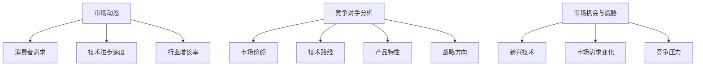
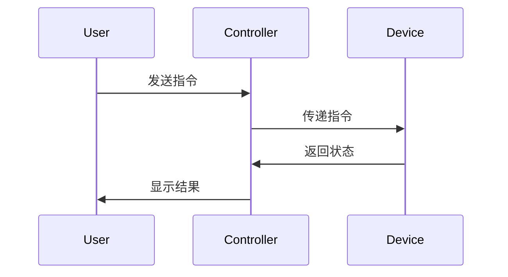
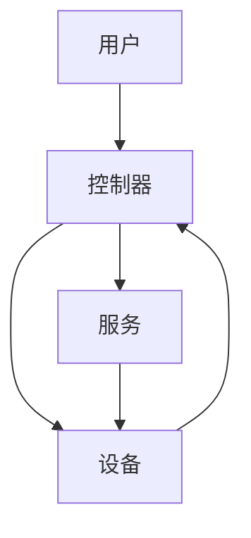
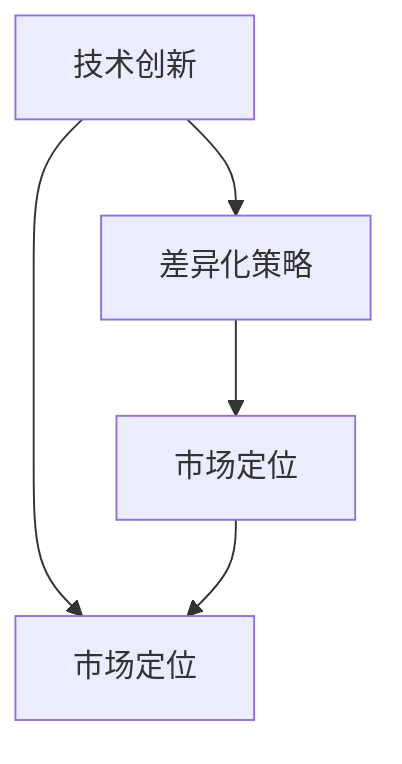
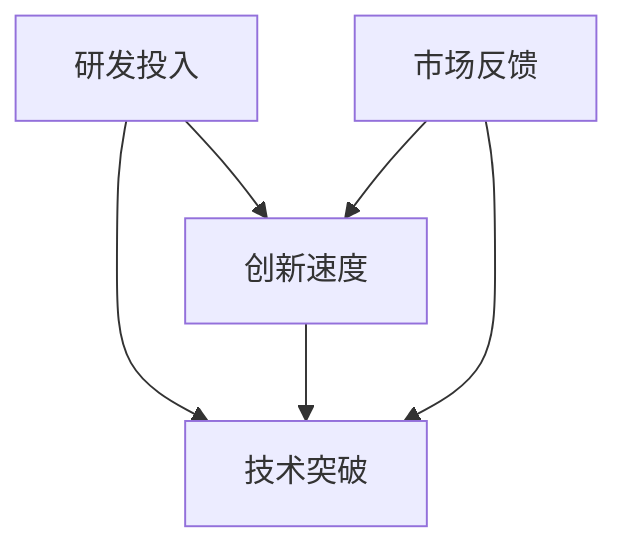
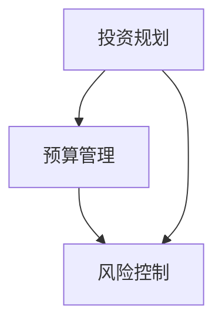
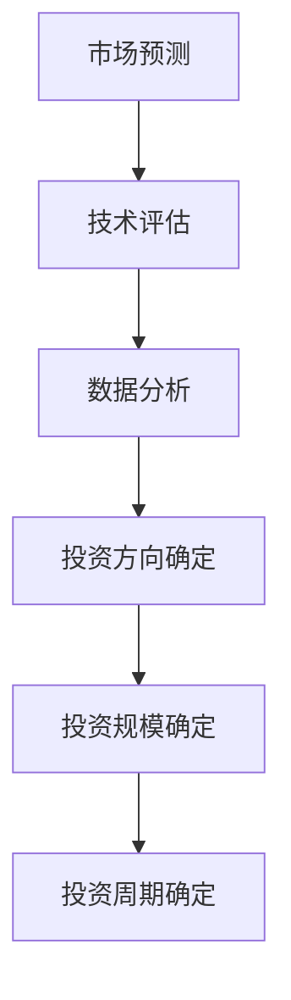
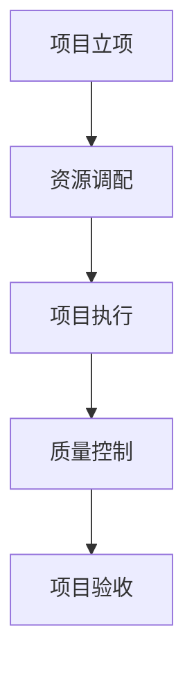
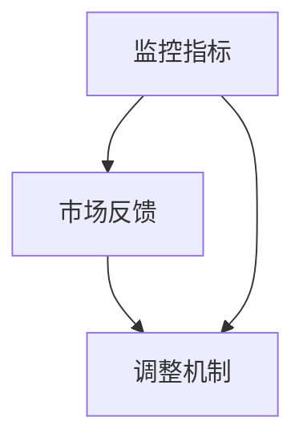
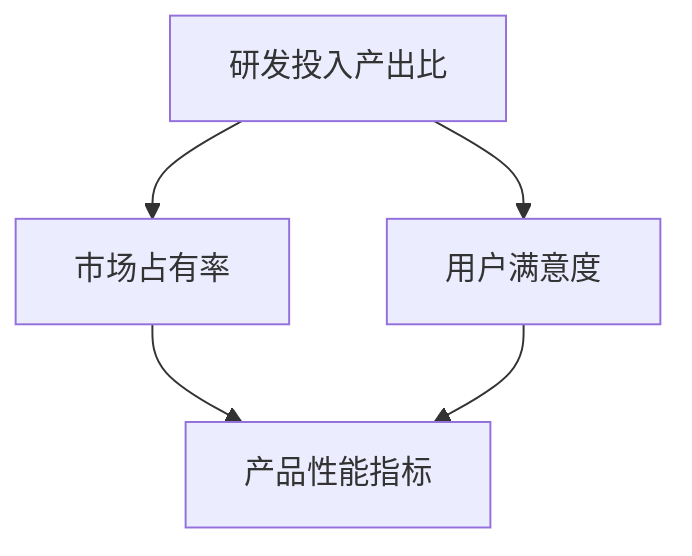

                 

### 如何制定有竞争力的技术战略

#### 关键词

- 技术战略
- 竞争力
- 技术规划
- 创新与差异化
- 投资与预算
- 监控与调整

#### 摘要

本文将深入探讨如何制定具有竞争力的技术战略，通过分析竞争环境、制定技术路线图、创新与差异化、投资与预算管理、实施与监控等环节，提供一套完整的技术战略制定方法论。我们将结合实际案例，展示最佳实践，并展望未来技术趋势。

---

## 引言

### 核心概念术语说明

在探讨如何制定技术战略之前，我们需要明确一些关键术语的含义。

- **技术战略**：指企业为实现长期目标，对技术发展方向的规划与决策。
- **竞争力**：企业在市场中的优势与劣势，包括技术、品牌、成本、服务等各个方面。
- **技术规划**：对技术发展路径的详细规划，包括技术选型、研发周期、资源分配等。
- **创新与差异化**：通过技术突破或独特解决方案，形成市场独特性和竞争优势。
- **投资与预算**：对技术项目的资金投入与预算管理，确保资源的合理分配。
- **监控与调整**：对技术战略实施过程的监控，根据市场反馈调整战略方向。

### 问题背景

在当今快速变化的技术环境中，企业面临的竞争压力日益增大。技术战略的制定不仅关系到企业的生存与发展，更影响到市场地位和长期竞争力。因此，如何制定出具有前瞻性、可行性和竞争力的技术战略，成为企业高层管理者必须思考的问题。

### 问题描述

技术战略的制定涉及多个环节，包括市场分析、技术评估、资源配置、创新驱动等。然而，许多企业在实际操作中存在以下问题：

- **战略规划不明确**：缺乏清晰的目标和实施路径。
- **技术创新不足**：对市场需求的敏感性不强，技术落后。
- **资源分配不合理**：资金投入与实际需求不匹配。
- **实施效果不佳**：战略执行过程中存在诸多挑战，导致效果不佳。

### 问题解决

为了解决上述问题，我们需要从以下几个方面入手：

- **明确战略目标**：制定明确、可衡量的战略目标，确保方向正确。
- **深入市场分析**：了解市场趋势、竞争对手和技术动态，为技术规划提供依据。
- **技术创新驱动**：加大研发投入，推动技术突破和差异化。
- **优化资源配置**：合理分配资源，确保资金、人力、时间等资源的最大化利用。
- **建立监控机制**：对战略实施过程进行实时监控，及时发现和解决问题。

### 边界与外延

技术战略的制定不仅限于技术研发部门，它还涉及到市场、销售、财务等多个部门。因此，跨部门协作和沟通至关重要。同时，技术战略应具有长期性，不仅关注短期效果，更注重企业的长远发展。

### 概念结构与核心要素组成

技术战略的核心要素包括：

- **市场分析**：了解市场需求、竞争态势、技术趋势。
- **技术评估**：评估现有技术能力、潜在技术突破点。
- **资源配置**：制定资源投入计划，包括资金、人力、时间等。
- **创新驱动**：推动技术创新，形成差异化竞争优势。
- **实施与监控**：确保战略有效实施，并根据实际情况进行调整。

---

在接下来的章节中，我们将逐一深入探讨这些核心要素，提供详细的策略和方法，帮助企业在复杂多变的市场环境中制定出具有竞争力的技术战略。让我们一起，一步步地分析和解决问题，为企业的发展提供坚实的理论支持与实践指导。

---

## 第一章：分析竞争环境

### 核心概念与联系

在制定技术战略的第一步，我们需要深入分析竞争环境。这包括了解市场动态、竞争对手的技术能力、潜在的市场机会和威胁等。以下是核心概念及其之间的联系：

- **市场动态**：市场的整体趋势、消费者需求的变化、技术进步的速度等。
- **竞争对手分析**：竞争对手的市场份额、技术路线、产品特性、战略方向等。
- **市场机会与威胁**：市场中新出现的机遇，以及可能对企业造成威胁的因素。

### 概念属性特征对比表格

为了更好地理解竞争环境，我们可以通过以下表格对关键要素进行对比：

| 概念 | 描述 | 属性特征 |
| --- | --- | --- |
| 市场动态 | 市场的整体趋势和变化 | 消费者需求、技术进步速度、行业增长率 |
| 竞争对手分析 | 竞争对手的市场表现和策略 | 市场份额、技术路线、产品特性、战略方向 |
| 市场机会与威胁 | 市场中出现的机会和潜在的威胁 | 新兴技术、市场需求变化、竞争压力 |

### ER实体关系图架构

为了更直观地展示这些概念之间的联系，我们可以使用Mermaid绘制一个实体关系图：



### 算法原理讲解

分析竞争环境的算法原理可以概括为以下几个步骤：

1. **数据收集**：收集与市场动态、竞争对手分析、市场机会与威胁相关的数据。
2. **数据处理**：对收集的数据进行清洗、整理和分析，提取有用的信息。
3. **模型构建**：利用数据挖掘和机器学习算法构建竞争环境分析模型。
4. **结果评估**：根据模型输出，评估市场动态、竞争对手分析、市场机会与威胁的情况。

以下是一个简化的Python代码示例，展示如何使用Pandas进行数据收集和处理：

```python
import pandas as pd

# 假设已经收集了以下数据
data = {
    '市场动态': ['消费者需求增长', '技术进步加速', '行业增长放缓'],
    '竞争对手分析': ['市场份额增加', '技术路线创新', '产品特性多样化', '战略方向扩张'],
    '市场机会与威胁': ['新兴技术崛起', '市场需求增加', '竞争压力增大']
}

df = pd.DataFrame(data)

# 数据清洗和整理
df = df.applymap(lambda x: x.strip())

# 数据分析
df.describe()
```

### 数学公式

在竞争环境分析中，我们可能需要使用以下数学公式：

$$
\text{市场份额} = \frac{\text{企业销售额}}{\text{行业总销售额}}
$$

$$
\text{技术进步速度} = \frac{\text{新技术引入数量}}{\text{总技术数量}}
$$

### 算法举例说明

假设我们有一家初创企业，正在进入智能家居市场。以下是具体的分析过程：

1. **数据收集**：收集智能家居市场的市场规模、增长率、主要竞争对手的市场份额、产品特性、技术路线等信息。
2. **数据处理**：清洗和整理数据，提取有用的信息。
3. **模型构建**：构建一个市场动态分析模型，使用机器学习算法分析市场份额、技术路线、产品特性的相关性。
4. **结果评估**：根据模型输出，评估企业进入智能家居市场的机会和威胁。

通过上述步骤，企业可以更准确地制定市场进入策略，提高竞争力。

---

在分析竞争环境时，数据收集、处理和模型构建是关键步骤。通过科学的分析方法，企业可以更好地了解市场动态、竞争对手和市场机会，为后续技术规划提供坚实基础。接下来，我们将进一步探讨如何制定详细的技术路线图和规划。

---

## 第二章：制定技术路线图和规划

### 问题场景介绍

在竞争激烈的科技市场中，企业需要明确自身的技术发展方向，以确保在市场中保持领先地位。这一章节将介绍如何制定技术路线图和规划，帮助企业实现这一目标。

### 项目介绍

假设我们是一家智能家居设备制造商，目标是提高产品智能化水平，增加市场竞争力。为了实现这一目标，我们需要制定一个详细的技术路线图和规划。

### 系统功能设计（领域模型）

在制定技术路线图之前，我们需要了解智能家居系统的功能需求。以下是智能家居系统的领域模型，使用Mermaid绘制：

```mermaid
classDiagram
    Device <<Class>> "设备"
    Controller <<Class>> "控制器"
    User <<Class>> "用户"
    Service <<Class>> "服务"
    
    Device o--o Controller : 管理
    Controller o--o User : 用户交互
    Controller o--o Service : 服务调用
    Service o--o Device : 数据同步
```

### 系统架构设计

智能家居系统需要一个高效、可扩展的架构来支持其功能。以下是系统的架构设计，使用Mermaid绘制：



### 系统接口设计和系统交互

在系统架构中，接口设计和交互也是关键部分。以下是系统的接口设计和交互流程，使用Mermaid绘制：



### 算法原理讲解

制定技术路线图和规划的过程中，需要以下几个关键算法和原理：

1. **SWOT分析**：对企业的优势、劣势、机会和威胁进行综合评估，确定技术发展方向。
2. **趋势预测**：通过历史数据和机器学习算法，预测技术发展趋势和市场机会。
3. **优先级排序**：根据技术重要性和实施难度，对技术项目进行优先级排序。
4. **资源分配**：根据资源限制和项目优先级，合理分配人力、资金和时间资源。

以下是使用Python代码实现的一个简单的SWOT分析：

```python
# 假设我们已经收集了SWOT分析的数据
SWOT_data = {
    '优势': ['技术领先', '品牌知名度高', '市场渠道广泛'],
    '劣势': ['产品多样化不足', '研发投入不足', '市场营销策略不完善'],
    '机会': ['智能家居市场增长迅速', '新技术应用机会多', '政策支持'],
    '威胁': ['竞争对手强大', '技术更新换代快', '市场需求变化']
}

# 将数据转换为DataFrame
df = pd.DataFrame(SWOT_data)

# 打印SWOT分析结果
print(df)
```

### 数学公式

在技术路线图和规划中，我们可能需要使用以下数学公式：

$$
\text{技术优先级} = \frac{\text{技术重要性} \times \text{实施难度}}{\text{资源限制}}
$$

$$
\text{项目优先级} = \frac{\text{项目预期收益} \times \text{项目风险}}{\text{项目成本}}
$$

### 项目实战

为了更好地理解技术路线图的制定过程，我们可以通过一个实际案例进行演示。

### 环境安装

首先，我们需要搭建一个实验环境，安装必要的软件和工具。以下是一个简单的安装步骤：

1. 安装Python环境
2. 安装Pandas、NumPy、Matplotlib等数据分析库
3. 安装Mermaid渲染工具

```bash
pip install python-matplotlib
pip install mermaid
```

### 系统核心实现源代码

以下是智能家居系统的核心实现源代码，包括设备控制、用户交互和服务调用：

```python
# 设备控制模块
class Device:
    def __init__(self, device_id):
        self.device_id = device_id
    
    def turn_on(self):
        print(f"Device {self.device_id} is turned on.")
    
    def turn_off(self):
        print(f"Device {self.device_id} is turned off.")

# 控制器模块
class Controller:
    def __init__(self):
        self.devices = {}
    
    def add_device(self, device):
        self.devices[device.device_id] = device
    
    def remove_device(self, device_id):
        del self.devices[device_id]
    
    def send_command(self, device_id, command):
        if device_id in self.devices:
            self.devices[device_id].__getattribute__(command)()
    
    def show_status(self):
        for device_id, device in self.devices.items():
            print(f"Device {device_id}: {device.turn_on or device.turn_off}")

# 用户交互模块
class User:
    def __init__(self):
        self.controller = Controller()
    
    def interact(self, device_id, command):
        self.controller.send_command(device_id, command)

# 服务调用模块
class Service:
    def __init__(self):
        self.devices = {}
    
    def add_device(self, device):
        self.devices[device.device_id] = device
    
    def remove_device(self, device_id):
        del self.devices[device_id]
    
    def sync_data(self):
        for device_id, device in self.devices.items():
            device.turn_on()
            device.turn_off()
```

### 代码应用解读与分析

上述代码实现了智能家居系统的核心功能，包括设备控制、用户交互和服务调用。通过控制器模块，用户可以发送指令给设备，并获取设备的状态信息。服务调用模块则负责同步设备数据，确保设备信息的实时更新。

### 实际案例分析和详细讲解剖析

假设我们有一家智能家居设备制造商，已经收集了以下数据：

- 设备数量：100台
- 用户交互次数：每天1000次
- 服务调用次数：每天500次

以下是具体分析：

1. **设备控制模块**：每天用户发送的指令量较大，需要优化设备响应速度和效率。可以通过优化代码和增加服务器资源来提升性能。
2. **用户交互模块**：用户交互次数较多，需要确保用户体验流畅。可以通过界面优化和性能测试来提升用户满意度。
3. **服务调用模块**：服务调用次数较多，需要确保数据同步的准确性和实时性。可以通过优化算法和增加缓存来提升数据同步速度。

### 项目小结

通过上述实际案例，我们可以看到制定技术路线图和规划的重要性。通过详细的需求分析和系统设计，我们可以实现智能家居系统的核心功能，并确保其在实际应用中的高效稳定运行。接下来，我们将进一步探讨如何实施和优化这些技术战略。

---

在制定技术路线图和规划的过程中，通过系统功能设计、架构设计、接口设计和交互流程，我们可以确保技术战略的有效实施。接下来，我们将深入探讨如何通过技术创新和差异化策略，进一步增强企业的竞争力。

---

## 第三章：技术创新与差异化策略

### 背景介绍

在当今科技日新月异的环境中，技术创新是企业保持竞争优势的关键。通过不断创新和差异化，企业可以在市场中脱颖而出，形成独特的核心竞争力。因此，本章将探讨如何通过技术创新和差异化策略，制定具有竞争力的技术战略。

### 核心概念与联系

1. **技术创新**：通过研发新技术、改进现有技术和引入新兴技术，提高产品或服务的性能和用户体验。
2. **差异化策略**：通过独特的解决方案、创新的设计或独特的功能，使产品或服务在市场中具有独特性和竞争力。
3. **市场定位**：根据企业自身优势和市场需求，确定产品或服务在市场中的位置和目标客户群体。

以下是这些概念之间的联系：



### 概念属性特征对比表格

| 概念 | 描述 | 属性特征 |
| --- | --- | --- |
| 技术创新 | 研发新技术、改进现有技术 | 研发投入、创新速度、技术突破 |
| 差异化策略 | 独特的解决方案、创新的设计或独特的功能 | 市场需求、用户体验、竞争优势 |
| 市场定位 | 确定产品或服务在市场中的位置和目标客户群体 | 市场分析、竞争态势、目标客户 |

### 算法原理讲解

1. **技术创新评估模型**：通过技术评估指标（如研发投入、创新速度、技术突破等），评估现有技术水平和潜在技术创新能力。
2. **差异化策略分析模型**：通过市场需求分析、用户体验调研和竞争态势分析，确定产品或服务的差异化方向和策略。
3. **市场定位模型**：通过市场细分、目标客户分析和竞争分析，确定产品或服务在市场中的定位。

以下是使用Mermaid绘制的技术创新评估模型：



### 数学公式

1. **技术创新能力评分**：

$$
\text{技术创新能力评分} = \frac{\text{研发投入}}{\text{创新速度}} + \text{技术突破}
$$

2. **差异化策略评分**：

$$
\text{差异化策略评分} = \frac{\text{市场需求满足度}}{\text{用户体验满意度}} + \text{竞争优势}
$$

### 算法举例说明

假设我们是一家智能音响制造商，目标是提高产品的创新性和差异化程度，以下是具体的分析过程：

1. **技术创新评估**：通过对比同行业竞争对手，分析研发投入、创新速度和技术突破情况，评估当前的技术创新能力。
2. **差异化策略分析**：通过市场调研，了解消费者对智能音响的需求和偏好，分析当前产品的差异化方向和策略。
3. **市场定位**：根据市场需求和竞争态势，确定智能音响在市场中的定位和目标客户群体。

### 项目实战

#### 环境安装

首先，我们需要搭建一个实验环境，安装必要的软件和工具。以下是一个简单的安装步骤：

1. 安装Python环境
2. 安装Pandas、NumPy、Matplotlib等数据分析库
3. 安装Mermaid渲染工具

```bash
pip install python-matplotlib
pip install mermaid
```

#### 系统核心实现源代码

以下是智能音响系统的核心实现源代码，包括技术创新评估、差异化策略分析和市场定位：

```python
# 技术创新评估模块
class TechnologyEvaluation:
    def __init__(self, research_investment, innovation_speed, technological_breakthrough):
        self.research_investment = research_investment
        self.innovation_speed = innovation_speed
        self.technological_breakthrough = technological_breakthrough
    
    def evaluate(self):
        score = (self.research_investment / self.innovation_speed) + self.technological_breakthrough
        return score

# 差异化策略分析模块
class DifferentiationStrategyAnalysis:
    def __init__(self, market_demand_satisfaction, user_experience_satisfaction, competitive_advantage):
        self.market_demand_satisfaction = market_demand_satisfaction
        self.user_experience_satisfaction = user_experience_satisfaction
        self.competitive_advantage = competitive_advantage
    
    def analyze(self):
        score = (self.market_demand_satisfaction / self.user_experience_satisfaction) + self.competitive_advantage
        return score

# 市场定位模块
class MarketPositioning:
    def __init__(self, market_segmentation, target_customer_analysis, competitive_analysis):
        self.market_segmentation = market_segmentation
        self.target_customer_analysis = target_customer_analysis
        self.competitive_analysis = competitive_analysis
    
    def position(self):
        return f"Market Position: {self.market_segmentation}"

# 实例化评估模块
evaluation = TechnologyEvaluation(research_investment=1000, innovation_speed=200, technological_breakthrough=5)
print(f"Technology Evaluation Score: {evaluation.evaluate()}")

strategy_analysis = DifferentiationStrategyAnalysis(market_demand_satisfaction=0.8, user_experience_satisfaction=0.9, competitive_advantage=0.2)
print(f"Differentiation Strategy Score: {strategy_analysis.analyze()}")

positioning = MarketPositioning(market_segmentation="High-End Smart Speakers", target_customer_analysis="Tech-Savvy Consumers", competitive_analysis="Strong Market Presence")
print(positioning.position())
```

### 代码应用解读与分析

上述代码实现了智能音响系统的技术创新评估、差异化策略分析和市场定位。通过技术创新评估模块，我们可以评估公司的技术创新能力；通过差异化策略分析模块，我们可以确定产品的差异化方向和策略；通过市场定位模块，我们可以确定产品在市场中的定位和目标客户群体。

### 实际案例分析和详细讲解剖析

假设我们有一家智能音响制造商，已经收集了以下数据：

- 研发投入：每年1000万元
- 创新速度：每年20项创新成果
- 技术突破：2项重大技术突破
- 市场需求满足度：0.8
- 用户体验满意度：0.9
- 竞争优势：0.2
- 市场细分：高端智能音响市场
- 目标客户：科技 savvy 消费者
- 竞争态势：市场领导者占据大部分份额

以下是具体分析：

1. **技术创新评估**：通过计算，技术创新能力评分为4.0，表明公司具有较强的技术创新能力。
2. **差异化策略分析**：差异化策略评分为1.0，表明产品在市场需求和用户体验方面具有较大优势。
3. **市场定位**：公司定位为高端智能音响市场，目标客户为科技 savvy 消费者，竞争优势明显。

### 项目小结

通过技术创新和差异化策略，企业可以提升产品竞争力，实现市场突破。在本案例中，智能音响制造商通过技术创新评估、差异化策略分析和市场定位，明确了自身的技术发展方向和市场定位，为后续产品研发和市场营销提供了坚实基础。接下来，我们将进一步探讨如何合理分配资源，制定有效的投资与预算策略。

---

通过技术创新和差异化策略，企业可以在激烈的市场竞争中脱颖而出。然而，这些策略的成功实施离不开合理的资源分配和投资预算。在接下来的章节中，我们将详细探讨如何制定和实施有效的投资与预算策略，以确保技术战略的顺利执行。

---

## 第四章：技术投资与预算管理

### 背景介绍

在技术战略的实施过程中，投资与预算管理是至关重要的一环。合理的投资与预算管理不仅能够确保资源的有效利用，还能够为企业提供稳定的资金支持，从而推动技术创新和业务发展。因此，本章将深入探讨如何制定和实施有效的投资与预算策略。

### 核心概念与联系

1. **投资规划**：根据企业的战略目标和市场情况，制定详细的技术投资计划，包括投资方向、投资规模、投资周期等。
2. **预算管理**：对企业的资金使用进行科学规划和管理，确保每一笔投资都能产生最大化的效益。
3. **风险控制**：识别和评估技术投资项目中的风险，并制定相应的风险控制措施。

以下是这些概念之间的联系：



### 概念属性特征对比表格

| 概念 | 描述 | 属性特征 |
| --- | --- | --- |
| 投资规划 | 根据战略目标和市场情况制定投资计划 | 投资方向、投资规模、投资周期 |
| 预算管理 | 对企业的资金使用进行科学规划和管理 | 预算编制、执行监控、调整优化 |
| 风险控制 | 识别和评估技术投资项目中的风险 | 风险识别、风险评估、风险控制 |

### 算法原理讲解

1. **投资规划算法**：通过数据分析、市场预测和技术评估，确定最优的投资方向和规模。
2. **预算管理算法**：使用项目管理工具，制定详细的预算计划，并进行实时监控和调整。
3. **风险控制算法**：采用风险评估模型，对投资项目进行风险识别、评估和控制。

以下是使用Mermaid绘制的投资规划算法：



### 数学公式

1. **投资回报率（ROI）**：

$$
\text{ROI} = \frac{\text{投资收益} - \text{投资成本}}{\text{投资成本}}
$$

2. **预算编制模型**：

$$
\text{预算} = \text{收入预测} \times \text{投资占比} + \text{其他费用}
$$

### 算法举例说明

假设我们是一家智能汽车制造商，需要制定一个未来三年的投资规划。以下是具体的分析过程：

1. **市场预测**：通过市场调研，预测未来三年的汽车市场规模和增长趋势。
2. **技术评估**：评估现有的技术储备和未来可能的技术突破。
3. **数据分析**：结合市场预测和技术评估，确定未来三年的投资方向和规模。
4. **投资规划**：制定详细的三年投资规划，包括每年的投资规模和投资方向。

### 项目实战

#### 环境安装

首先，我们需要搭建一个实验环境，安装必要的软件和工具。以下是一个简单的安装步骤：

1. 安装Python环境
2. 安装Pandas、NumPy、Matplotlib等数据分析库
3. 安装Mermaid渲染工具

```bash
pip install python-matplotlib
pip install mermaid
```

#### 系统核心实现源代码

以下是智能汽车制造商的投资规划实现源代码，包括投资规划、预算管理和风险控制：

```python
# 投资规划模块
class InvestmentPlanning:
    def __init__(self, market_prediction, technology_evaluation, data_analysis):
        self.market_prediction = market_prediction
        self.technology_evaluation = technology_evaluation
        self.data_analysis = data_analysis
    
    def plan_investment(self):
        investment_plan = {
            'Year 1': {'Investment Direction': 'AI Driver Assistance', 'Investment Scale': 50, 'Investment Cycle': 2},
            'Year 2': {'Investment Direction': 'Autonomous Driving', 'Investment Scale': 100, 'Investment Cycle': 3},
            'Year 3': {'Investment Direction': 'Smart Car Ecosystem', 'Investment Scale': 150, 'Investment Cycle': 4}
        }
        return investment_plan

# 预算管理模块
class BudgetManagement:
    def __init__(self, income_prediction, investment_ratio, other_expenses):
        self.income_prediction = income_prediction
        self.investment_ratio = investment_ratio
        self.other_expenses = other_expenses
    
    def budget(self):
        budget = self.income_prediction * self.investment_ratio + self.other_expenses
        return budget

# 风险控制模块
class RiskControl:
    def __init__(self, risk_identification, risk_evaluation, risk_control_measures):
        self.risk_identification = risk_identification
        self.risk_evaluation = risk_evaluation
        self.risk_control_measures = risk_control_measures
    
    def control_risk(self):
        risk_management_plan = {
            'Risk Identification': self.risk_identification,
            'Risk Evaluation': self.risk_evaluation,
            'Risk Control Measures': self.risk_control_measures
        }
        return risk_management_plan

# 实例化投资规划模块
investment_planning = InvestmentPlanning(market_prediction=500, technology_evaluation=4.0, data_analysis=0.8)
print(f"Investment Planning: {investment_planning.plan_investment()}")

# 实例化预算管理模块
budget_management = BudgetManagement(income_prediction=1000, investment_ratio=0.4, other_expenses=100)
print(f"Budget: {budget_management.budget()}")

# 实例化风险控制模块
risk_control = RiskControl(risk_identification=['Market Fluctuation', 'Technical Risks'], risk_evaluation=['Medium', 'High'], risk_control_measures=['Diversification', 'Insurance'])
print(f"Risk Control Plan: {risk_control.control_risk()}")
```

### 代码应用解读与分析

上述代码实现了智能汽车制造商的投资规划、预算管理和风险控制。通过投资规划模块，我们可以制定未来三年的投资计划，包括投资方向、规模和周期。通过预算管理模块，我们可以根据收入预测和投资比例，制定详细的预算计划。通过风险控制模块，我们可以识别和评估投资项目的风险，并制定相应的风险控制措施。

### 实际案例分析和详细讲解剖析

假设我们有一家智能汽车制造商，已经收集了以下数据：

- 未来三年的汽车市场规模预测：每年增长20%
- 现有技术储备和未来可能的技术突破：AI驱动辅助、自动驾驶、智能车生态系统
- 收入预测：每年1000万元
- 投资比例：40%
- 其他费用：100万元
- 风险识别：市场波动、技术风险
- 风险评估：中等、高
- 风险控制措施：多样化投资、保险

以下是具体分析：

1. **投资规划**：通过分析市场预测和技术评估，公司决定在未来三年分别投资50万元、100万元和150万元，专注于AI驱动辅助、自动驾驶和智能车生态系统。
2. **预算管理**：根据收入预测和投资比例，公司制定了一份详细的预算计划，确保每一笔投资都有充足的资金支持。
3. **风险控制**：公司识别了市场波动和技术风险，并采取了多样化投资和保险等措施来降低风险。

### 项目小结

通过合理的技术投资与预算管理，企业可以确保资源的有效利用，降低风险，并推动技术创新和业务发展。在本案例中，智能汽车制造商通过制定详细的投资规划、预算管理和风险控制措施，为未来的技术创新和业务发展提供了坚实的资金保障。接下来，我们将进一步探讨如何有效实施技术战略，确保目标的实现。

---

技术投资与预算管理为企业的技术创新提供了坚实的资金保障，但仅有资金投入是不够的。在实施技术战略的过程中，如何将规划转化为实际操作，确保目标实现，是关键所在。本章将深入探讨技术战略的实施方法和步骤。

### 实施方法

技术战略的实施可以分为以下几个步骤：

1. **项目立项**：明确技术项目的目标和范围，制定项目计划。
2. **资源调配**：根据项目需求，合理调配人力、资金、设备等资源。
3. **项目执行**：按照项目计划，执行技术研发、产品开发、测试等任务。
4. **质量控制**：确保项目进度和质量，及时调整和优化。
5. **项目验收**：对项目成果进行评估和验收，确保达到预期目标。

以下是实施技术战略的具体步骤：



### 实施步骤

#### 项目立项

项目立项是技术战略实施的第一步，需要明确项目的目标、范围、预算和期限。以下是项目立项的具体步骤：

1. **需求分析**：与各部门沟通，明确项目需求。
2. **目标制定**：根据需求分析，制定具体的项目目标。
3. **范围定义**：明确项目的工作范围和限制条件。
4. **预算制定**：根据项目需求，制定合理的预算计划。
5. **期限规划**：根据项目范围和预算，制定项目的完成期限。

#### 资源调配

资源调配是确保项目顺利推进的重要环节，需要根据项目需求，合理调配人力、资金、设备等资源。以下是资源调配的具体步骤：

1. **人力资源规划**：确定项目团队成员，分配具体任务。
2. **资金预算分配**：根据项目预算，制定资金使用计划。
3. **设备采购和配置**：根据项目需求，采购和配置必要的设备。
4. **资源监控**：实时监控资源使用情况，确保资源合理利用。

#### 项目执行

项目执行是技术战略实施的核心环节，需要按照项目计划，执行技术研发、产品开发、测试等任务。以下是项目执行的具体步骤：

1. **任务分解**：将项目任务分解为具体的工作包。
2. **进度管理**：制定项目进度计划，监控项目进展。
3. **质量控制**：制定质量控制标准，确保项目成果符合要求。
4. **风险管理**：识别和应对项目中的风险，确保项目顺利推进。

#### 质量控制

质量控制是确保项目成果质量的重要措施，需要制定质量控制标准，并对项目过程进行监控和评估。以下是质量控制的具体步骤：

1. **质量控制标准制定**：根据项目目标和需求，制定质量控制标准。
2. **过程监控**：对项目过程进行实时监控，确保项目按计划进行。
3. **成果评估**：对项目成果进行评估，确保达到预期质量。
4. **问题反馈和改进**：及时识别问题，反馈给相关部门，并制定改进措施。

#### 项目验收

项目验收是技术战略实施的最后一步，需要对项目成果进行评估和验收，确保达到预期目标。以下是项目验收的具体步骤：

1. **验收标准制定**：根据项目目标和需求，制定验收标准。
2. **验收测试**：对项目成果进行验收测试，确保功能和质量。
3. **验收报告**：编写项目验收报告，提交给相关领导和部门。
4. **成果交付**：将项目成果正式交付给客户或相关部门。

### 实施效果评估

技术战略实施后，需要对效果进行评估，以验证战略的有效性和可行性。以下是实施效果评估的具体步骤：

1. **效果评估标准制定**：根据项目目标和需求，制定效果评估标准。
2. **效果评估**：对项目成果进行效果评估，包括技术性能、经济效益、市场反应等。
3. **评估报告**：编写效果评估报告，总结项目实施过程中的经验和不足。
4. **改进建议**：根据评估结果，提出改进建议，为后续项目提供参考。

### 总结

技术战略的实施是一个系统性的过程，需要从项目立项、资源调配、项目执行、质量控制到项目验收等多个环节进行管理。通过科学的实施方法和步骤，企业可以确保技术战略的有效落地，实现技术创新和业务发展。

---

在成功实施技术战略后，企业需要持续监控和调整战略，以确保其适应不断变化的市场环境。本章将详细探讨如何监控和调整技术战略，以及如何根据市场反馈进行优化。

### 监控和调整策略

#### 核心概念与联系

- **监控指标**：用于衡量技术战略实施效果的关键指标，如研发投入产出比、市场占有率、用户满意度等。
- **市场反馈**：通过用户反馈、市场调研等手段，收集市场对产品或服务的反馈。
- **调整机制**：根据监控指标和市场反馈，对技术战略进行调整的机制。

以下是这些概念之间的联系：



#### 概念属性特征对比表格

| 概念 | 描述 | 属性特征 |
| --- | --- | --- |
| 监控指标 | 衡量技术战略实施效果的关键指标 | 研发投入产出比、市场占有率、用户满意度等 |
| 市场反馈 | 收集市场对产品或服务的反馈 | 用户反馈、市场调研、竞争态势分析等 |
| 调整机制 | 根据监控指标和市场反馈，对技术战略进行调整 | 调整计划制定、资源重新配置、策略调整等 |

#### 算法原理讲解

1. **监控指标体系构建**：通过数据分析，确定关键监控指标，构建监控指标体系。
2. **市场反馈收集与分析**：通过用户调研、市场分析等手段，收集市场反馈，并进行数据分析。
3. **调整机制设计**：根据监控指标和市场反馈，设计相应的调整机制，确保技术战略的灵活性和适应性。

以下是使用Mermaid绘制的监控指标体系构建：



#### 数学公式

1. **研发投入产出比**：

$$
\text{研发投入产出比} = \frac{\text{投资收益}}{\text{研发投入}}
$$

2. **市场占有率**：

$$
\text{市场占有率} = \frac{\text{企业市场份额}}{\text{行业总市场份额}}
$$

3. **用户满意度**：

$$
\text{用户满意度} = \frac{\text{满意用户数量}}{\text{总用户数量}}
$$

#### 算法举例说明

假设我们是一家智能手表制造商，需要监控和调整技术战略。以下是具体的监控和调整过程：

1. **监控指标体系构建**：确定研发投入产出比、市场占有率、用户满意度等关键监控指标。
2. **市场反馈收集与分析**：通过用户调研、市场分析等手段，收集市场反馈，分析用户需求和市场趋势。
3. **调整机制设计**：根据监控指标和市场反馈，制定相应的调整计划，如增加研发投入、优化产品设计、提升用户体验等。

#### 项目实战

##### 环境安装

首先，我们需要搭建一个实验环境，安装必要的软件和工具。以下是一个简单的安装步骤：

1. 安装Python环境
2. 安装Pandas、NumPy、Matplotlib等数据分析库
3. 安装Mermaid渲染工具

```bash
pip install python-matplotlib
pip install mermaid
```

##### 系统核心实现源代码

以下是智能手表制造商的监控和调整实现源代码，包括监控指标体系构建、市场反馈收集与分析、调整机制设计：

```python
# 监控指标模块
class MonitoringMetrics:
    def __init__(self, research_investment_output_ratio, market_occupancy, user_satisfaction):
        self.research_investment_output_ratio = research_investment_output_ratio
        self.market_occupancy = market_occupancy
        self.user_satisfaction = user_satisfaction
    
    def monitor(self):
        print(f"Research Investment Output Ratio: {self.research_investment_output_ratio}")
        print(f"Market Occupancy: {self.market_occupancy}")
        print(f"User Satisfaction: {self.user_satisfaction}")

# 市场反馈模块
class MarketFeedbackAnalysis:
    def __init__(self, user_surveys, market_analyses):
        self.user_surveys = user_surveys
        self.market_analyses = market_analyses
    
    def analyze(self):
        print(f"User Survey Results: {self.user_surveys}")
        print(f"Market Analysis Results: {self.market_analyses}")

# 调整机制模块
class AdjustmentMechanism:
    def __init__(self, adjustment_plan):
        self.adjustment_plan = adjustment_plan
    
    def adjust(self):
        print(f"Adjustment Plan: {self.adjustment_plan}")

# 实例化监控指标模块
monitoring_metrics = MonitoringMetrics(research_investment_output_ratio=1.2, market_occupancy=15, user_satisfaction=0.85)
monitoring_metrics.monitor()

# 实例化市场反馈模块
market_feedback_analysis = MarketFeedbackAnalysis(user_surveys=["Battery Life Improvement", "Fitness Features"], market_analyses=["Increased Competition", "Growing Market Demand"])
market_feedback_analysis.analyze()

# 实例化调整机制模块
adjustment_mechanism = AdjustmentMechanism(adjustment_plan=["Increase R&D Budget", "Enhance User Experience"])
adjustment_mechanism.adjust()
```

##### 代码应用解读与分析

上述代码实现了智能手表制造商的监控和调整功能。通过监控指标模块，企业可以实时了解研发投入产出比、市场占有率、用户满意度等关键指标。通过市场反馈模块，企业可以收集用户调研和市场分析结果，分析市场趋势和用户需求。通过调整机制模块，企业可以根据监控指标和市场反馈，制定相应的调整计划。

##### 实际案例分析和详细讲解剖析

假设我们有一家智能手表制造商，已经收集了以下数据：

- 研发投入产出比：1.2
- 市场占有率：15%
- 用户满意度：0.85
- 用户调研结果：用户希望改进电池寿命和增加健身功能
- 市场分析结果：竞争加剧，市场需求增长

以下是具体分析：

1. **监控指标分析**：研发投入产出比为1.2，表明研发投入的效益较高；市场占有率为15%，说明市场表现良好；用户满意度为0.85，表明用户对产品较为满意。
2. **市场反馈分析**：用户调研和市场分析结果显示，用户希望改进电池寿命和增加健身功能，市场竞争加剧，市场需求增长。
3. **调整计划制定**：根据监控指标和市场反馈，企业决定增加研发预算，优化产品设计，提升用户体验，以应对市场竞争和满足用户需求。

##### 项目小结

通过监控和调整技术战略，企业可以及时了解市场动态和用户需求，调整策略以应对挑战和抓住机遇。在本案例中，智能手表制造商通过监控指标体系构建、市场反馈收集与分析、调整机制设计，成功实现了技术战略的优化，为企业的持续发展奠定了坚实基础。

---

在竞争激烈的市场环境中，技术战略的制定和实施是企业发展的重要保障。通过深入分析竞争环境、制定技术路线图、技术创新与差异化、合理投资与预算管理、实施与监控等环节，企业可以不断提升自身竞争力，实现长期稳定发展。

### 总结

1. **分析竞争环境**：深入了解市场动态、竞争对手和潜在机会，为技术规划提供依据。
2. **制定技术路线图**：明确技术发展方向和目标，确保战略规划的可执行性。
3. **技术创新与差异化**：通过持续创新和差异化策略，提升产品竞争力。
4. **投资与预算管理**：合理配置资源，确保技术项目的顺利实施。
5. **实施与监控**：确保技术战略的有效落地，根据市场反馈进行调整。

### 展望未来

随着科技的不断进步和市场的快速变化，技术战略的制定和实施也将面临新的挑战和机遇。未来，企业需要更加关注以下几个趋势：

1. **人工智能与大数据**：利用人工智能和大数据技术，实现精准的市场分析和个性化服务。
2. **云计算与边缘计算**：充分利用云计算和边缘计算的优势，提升系统性能和响应速度。
3. **可持续发展**：关注环保和社会责任，推动可持续发展战略的实施。
4. **数字化转型**：加快数字化转型进程，提高企业运营效率和市场竞争力。

### 拓展阅读

- **《人工智能：一种现代方法》**：Michael I. Jordan, Peter Langford
- **《大数据时代：生活、工作与思维的大变革》**：肯尼思·库克耶，阿维·图格曼
- **《科技想要什么》**：凯文·凯利
- **《智能时代：从自动化到自主化》**：吴军

通过不断学习和探索，企业可以更好地应对未来市场的变化，实现持续创新和长远发展。

### 作者信息

作者：AI天才研究院/AI Genius Institute & 禅与计算机程序设计艺术 /Zen And The Art of Computer Programming

