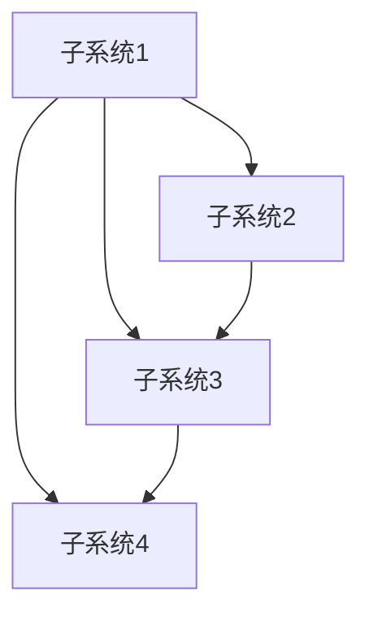
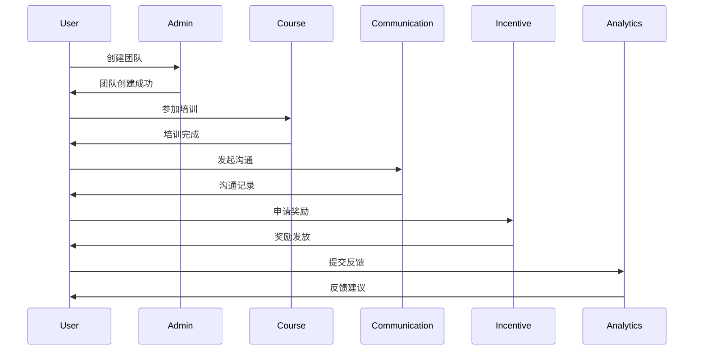

                 

# 如何培养团队的创新文化

## 关键词

团队创新文化、团队价值观、创新能力、团队沟通、激励机制、评估与改进

## 摘要

创新是现代企业持续发展的核心驱动力，而培养团队的创新文化是实现这一目标的关键。本文旨在深入探讨如何通过构建团队价值观、培养团队成员的创新能力、优化团队沟通与协作、构建有效的激励机制以及评估与改进创新文化，从而实现团队创新文化的有效培养。文章通过理论阐述、案例分析、实战指导等多种方式，为团队管理者提供了系统且实用的创新文化培养策略。

### 目录大纲

**《如何培养团队的创新文化》**

----------------------------------------------------------------

## 第一部分: 创新文化的背景与重要性

### 第1章: 创新文化的概念与内涵

#### 1.1 创新文化的定义

创新文化是一种价值观和行为的集合，它鼓励团队成员探索新的想法、解决问题、接受失败并从中学习。创新文化不仅仅是一种理念，更是一种实践，它贯穿于团队管理的各个方面，影响团队的运作和成果。

#### 1.1.1 创新文化的理解

创新文化是企业内部对创新的态度和行为的一种反映。它包括对创新价值的认同、对创新过程的宽容以及对创新成果的认可。一个具备创新文化的团队，能够激发成员的创造力和主动性，从而提高团队的整体竞争力。

#### 1.1.2 创新文化的核心要素

创新文化的核心要素包括：共同的愿景、开放的态度、持续学习的氛围、包容失败的环境、有效的沟通和协作机制。

#### 1.2 创新文化的重要性

创新文化对团队和企业都有着深远的影响：

- **提升团队创造力**：创新文化鼓励成员提出新想法，尝试新方法，从而提高团队的创造力和创新能力。
- **增强团队凝聚力**：共同的目标和价值观能够增强团队成员之间的联系，提高团队的凝聚力。
- **提高企业竞争力**：创新是企业持续发展的关键，具备创新文化的团队能够为企业带来持续的竞争优势。

#### 1.2.1 对团队的影响

- **激发创造力和主动性**：创新文化鼓励团队成员敢于尝试和失败，从而激发他们的创造力和主动性。
- **提高团队解决问题能力**：创新文化鼓励团队成员积极面对挑战，提高团队的整体解决问题能力。

#### 1.2.2 对企业的影响

- **提升产品质量**：创新文化能够促进产品或服务的创新，提高产品质量和市场竞争力。
- **推动企业持续发展**：创新文化能够帮助企业适应市场变化，推动企业的持续发展。

#### 1.3 创新文化的现状分析

目前，国内外企业在创新文化建设方面取得了显著的成果，但同时也面临着一系列挑战：

- **文化差异**：不同企业和团队在文化背景、价值观等方面存在差异，这给创新文化的建设带来了挑战。
- **人才流失**：缺乏创新文化的团队往往难以留住有创造力的员工，导致人才流失。

#### 1.3.1 国内外企业创新文化现状

- **国外企业**：如谷歌、苹果等科技巨头，具备浓厚的创新文化，鼓励员工自由创新，提供良好的创新环境。
- **国内企业**：随着企业对创新文化的重视程度不断提高，越来越多的企业开始注重创新文化建设，但仍有很大的提升空间。

#### 1.3.2 团队创新文化建设的挑战

- **缺乏明确的创新目标**：一些团队在创新文化建设过程中，缺乏明确的创新目标，导致创新工作缺乏方向。
- **管理机制的制约**：传统管理机制往往不利于创新文化的形成，需要建立更加开放和包容的管理制度。

#### 1.4 创新文化的边界与外延

创新文化不仅仅局限于团队内部，它还涉及到团队与外部环境的互动：

- **与外部文化的联系**：创新文化需要与企业的整体文化相适应，同时也需要与行业和市场的文化保持一定的联系。
- **多样性与适应**：创新文化需要在多样性中寻求适应，既要尊重不同团队成员的个性和创新方式，也要适应外部环境的变化。

#### 1.5 本章小结

本章对创新文化的概念与内涵进行了详细阐述，分析了创新文化的重要性、现状以及面临的挑战。通过本章的学习，读者可以更好地理解创新文化的本质，为后续章节的内容打下基础。

----------------------------------------------------------------

## 第二部分: 团队创新文化的构建要素

### 第2章: 团队价值观的塑造

#### 2.1 团队价值观的内涵

团队价值观是团队共同认同和遵循的核心信念和行为准则。它不仅反映了团队成员的共同愿景，也塑造了团队的个性特征和核心竞争力。

#### 2.1.1 团队价值观的定义

团队价值观是团队在长期发展过程中形成的，对团队行为和决策产生深远影响的核心观念。它包括对创新、诚信、责任、共赢等方面的共识。

#### 2.1.2 团队价值观的作用

团队价值观在团队创新文化中起着至关重要的作用：

- **统一团队成员的思想和行为**：团队价值观能够统一团队成员的思想和行为，形成共同的价值观和目标，提高团队协作效率。
- **激发创新动力**：明确的团队价值观能够激发团队成员的创新动力，促进创新文化的形成和发展。

#### 2.2 团队价值观的塑造方法

要塑造团队价值观，需要采取以下方法：

- **树立共同愿景**：共同愿景是团队价值观的核心。通过共同愿景，团队成员能够明确自己的目标和方向，增强团队凝聚力。
- **明确核心价值观**：明确核心价值观是塑造团队价值观的关键。通过明确的核心价值观，团队成员能够更好地理解团队的目标和使命，形成共同的价值认同。
- **增强团队凝聚力**：增强团队凝聚力是塑造团队价值观的重要手段。通过团队建设活动、团队文化塑造等方式，提高团队成员之间的信任和默契，形成共同的价值观。

#### 2.3 案例分析：优秀团队价值观的塑造

以谷歌为例，谷歌的成功离不开其独特的团队价值观。谷歌的团队价值观包括：“不作恶”、“开放创新”、“用户至上”等，这些价值观不仅影响了谷歌的产品和服务，也塑造了谷歌的企业文化。

#### 2.3.1 案例背景

谷歌成立于1998年，是一家全球知名的互联网科技公司。自成立以来，谷歌一直致力于通过技术创新和开放文化推动企业的发展。

#### 2.3.2 团队价值观构建过程

谷歌的团队价值观构建过程可以分为以下几个阶段：

1. **共同愿景的确定**：谷歌的创始人拉里·佩奇和谢尔盖·布林在成立初期就明确了公司的愿景：“整合全球信息，使人人都能便捷地访问。”这一愿景为谷歌的团队价值观奠定了基础。

2. **核心价值观的明确**：在发展过程中，谷歌逐步明确了核心价值观，包括“不作恶”、“开放创新”、“用户至上”等。这些核心价值观成为了谷歌团队共同遵循的行为准则。

3. **团队文化的塑造**：谷歌通过一系列团队建设活动和文化塑造活动，如员工大会、团队拓展训练等，强化了团队价值观，增强了团队的凝聚力。

#### 2.3.3 案例启示

谷歌的案例表明，塑造团队价值观需要从共同愿景、核心价值观和文化塑造等多个方面进行。一个明确的团队价值观能够激发团队成员的创新动力，推动团队的发展。

#### 2.4 本章小结

本章详细阐述了团队价值观的内涵、塑造方法以及案例分析。通过本章的学习，读者可以更好地理解团队价值观在创新文化中的重要性，并掌握塑造团队价值观的方法和策略。

----------------------------------------------------------------

### 第3章: 团队成员的创新能力培养

#### 3.1 创新能力的概念与特点

创新能力是指个体或团队在特定环境中，通过创造性思维、创新方法和创新工具，产生新的想法、解决方案或产品的一种能力。创新能力具有以下几个特点：

- **创造性**：创新能力强调通过创造性思维，产生新颖的、有价值的想法或解决方案。
- **适应性**：创新能力需要根据环境的变化和需求，灵活调整和创新。
- **可持续性**：创新能力不仅仅是一次性的，而是一种持续的过程，能够不断产生新的创新成果。

#### 3.2 团队成员创新能力的培养方法

要提升团队成员的创新能力，需要采取以下方法：

- **提升知识储备**：知识是创新的基础。通过不断学习和积累知识，团队成员能够更好地应对挑战，产生创新的思路。
- **培养问题解决能力**：问题解决能力是创新能力的重要组成部分。通过培养团队成员的问题解决能力，可以提高他们的创新能力。
- **加强思维训练**：思维训练是提升创新能力的关键。通过逻辑思维、创新思维等训练，可以激发团队成员的创造力。

#### 3.3 创新能力培养的实践策略

为了有效地培养团队成员的创新能力，可以采取以下实践策略：

- **开展创新培训**：通过创新培训，可以提升团队成员的创新知识和技能，激发他们的创新思维。
- **设立创新奖励机制**：设立创新奖励机制，可以激励团队成员积极参与创新活动，提高他们的创新能力。
- **创建创新团队氛围**：创造一个开放、包容、支持创新的团队氛围，可以激发团队成员的创造力，促进创新能力的提升。

#### 3.4 案例分析：团队成员创新能力培养

以腾讯为例，腾讯在团队成员创新能力培养方面有着丰富的经验。

#### 3.4.1 案例背景

腾讯成立于1998年，是一家全球领先的互联网科技公司。自成立以来，腾讯一直注重创新，不断提升团队的创新能力。

#### 3.4.2 创新能力培养过程

腾讯在团队成员创新能力培养方面采取了以下措施：

1. **开展创新培训**：腾讯定期举办创新培训，邀请行业专家和内部优秀员工分享创新经验和思路，提升团队成员的创新知识。
2. **设立创新奖励机制**：腾讯设立了创新奖励机制，对在创新活动中表现突出的员工进行奖励，激发他们的创新动力。
3. **创建创新团队氛围**：腾讯鼓励团队成员自由创新，创造一个开放、包容、支持创新的团队氛围，让员工敢于尝试和失败，从而提升创新能力。

#### 3.4.3 案例启示

腾讯的案例表明，通过开展创新培训、设立创新奖励机制和创建创新团队氛围，可以有效提升团队成员的创新能力。这些措施不仅能够激发员工的创造力，还能够推动团队的创新文化建设。

#### 3.5 本章小结

本章详细阐述了团队成员创新能力的概念与特点，以及培养方法和实践策略。通过本章的学习，读者可以更好地理解如何培养团队成员的创新能力，并掌握提升创新能力的具体方法。

----------------------------------------------------------------

### 第4章: 团队沟通与协作的创新

#### 4.1 团队沟通的重要性

团队沟通在团队创新中起着至关重要的作用。有效的沟通能够确保团队成员理解共同的目标和任务，分享创新思路和想法，协调资源和行动，从而推动创新活动的顺利进行。

#### 4.1.1 沟通在团队创新中的作用

- **确保目标的统一**：有效的沟通能够确保团队成员对创新目标有清晰的认识，减少目标偏离。
- **促进信息共享**：团队沟通能够促进信息共享，使团队成员能够及时了解最新的进展和问题，从而做出快速反应。
- **协调资源**：有效的沟通能够协调团队成员之间的资源，确保资源的最优配置，提高创新效率。

#### 4.1.2 团队沟通的障碍与解决方法

团队沟通过程中可能会遇到以下障碍：

- **沟通渠道不畅**：解决方法：建立多元化的沟通渠道，如线上交流平台、定期会议等。
- **信息过载**：解决方法：建立信息筛选机制，确保关键信息能够及时传递。
- **文化差异**：解决方法：加强跨文化沟通培训，提高团队成员的文化敏感性。

#### 4.2 团队协作的创新方法

为了提升团队协作效率，可以采取以下创新方法：

- **搭建高效的协作平台**：利用现代化的协作工具，如项目管理软件、在线文档编辑工具等，提高团队协作效率。
- **引入敏捷开发方法**：敏捷开发方法强调快速迭代和持续改进，有助于提高团队协作效率和创新能力。
- **创新团队协作模式**：通过组织结构创新、工作流程优化等方式，构建更加灵活、高效的团队协作模式。

#### 4.3 团队沟通与协作的创新实践

以华为为例，华为在团队沟通与协作方面有着丰富的实践经验。

#### 4.3.1 案例背景

华为成立于1987年，是一家全球领先的电信解决方案提供商。在激烈的市场竞争中，华为高度重视团队沟通与协作，不断创新沟通与协作方式。

#### 4.3.2 团队沟通与协作创新过程

华为在团队沟通与协作方面采取了以下措施：

1. **引入敏捷开发方法**：华为引入了敏捷开发方法，通过快速迭代和持续改进，提高了团队协作效率。
2. **搭建高效的协作平台**：华为建立了全球协同办公系统，实现了全球团队的实时沟通和协作。
3. **创新团队协作模式**：华为通过组织结构优化和跨部门协作，打破了部门壁垒，提高了团队协作效率。

#### 4.3.3 创新实践效果

通过引入敏捷开发方法、搭建高效的协作平台和创新团队协作模式，华为的团队沟通与协作效率显著提高，创新成果不断涌现，为企业的持续发展提供了强大动力。

#### 4.4 案例分析：团队沟通与协作的创新

以华为为例，华为在团队沟通与协作方面的创新实践为其他企业提供了有益的借鉴。

#### 4.4.1 案例背景

华为在全球拥有数十万的员工，如何确保团队沟通与协作的高效是华为面临的一大挑战。

#### 4.4.2 创新过程与效果

通过引入敏捷开发方法、搭建高效的协作平台和创新团队协作模式，华为成功解决了团队沟通与协作中的难题，提高了团队协作效率，促进了创新成果的涌现。

#### 4.4.3 案例启示

华为的案例表明，通过引入先进的协作工具、优化团队协作模式和建立高效的沟通机制，可以有效提升团队沟通与协作效率，推动团队创新。

#### 4.5 本章小结

本章详细阐述了团队沟通与协作的重要性、创新方法和实践策略。通过本章的学习，读者可以更好地理解如何通过创新方法提升团队沟通与协作效率，为团队创新提供有力支持。

----------------------------------------------------------------

### 第5章: 创新文化的激励机制

#### 5.1 激励机制的重要性

激励机制是创新文化的重要组成部分，它直接影响到团队成员的积极性和创新能力。有效的激励机制能够激发团队成员的创新热情，提高团队的整体创新水平。

#### 5.1.1 激励机制在创新文化中的作用

- **激发创新动力**：激励机制能够激发团队成员的创新动力，使他们更加积极地投入到创新工作中。
- **提升创新能力**：通过激励措施，可以激励团队成员不断学习、尝试和创新，从而提升团队的创新能力。
- **保持创新活力**：激励机制能够保持团队的创新活力，使团队在创新道路上持续前进。

#### 5.1.2 现有激励机制的问题与挑战

尽管许多企业已经意识到激励机制的重要性，但现有激励机制仍然存在一些问题：

- **单一化**：现有激励机制往往过于单一，无法满足团队成员多样化的需求。
- **不公平性**：部分激励机制存在不公平现象，导致团队成员的积极性受到影响。
- **缺乏持续性**：一些激励机制缺乏持续性，无法长期激励团队成员的创新热情。

#### 5.2 创新文化激励机制的构建

为了构建有效的创新文化激励机制，需要采取以下措施：

- **设立创新目标**：明确创新目标是构建激励机制的基础。通过设立明确的创新目标，可以引导团队成员明确努力方向。
- **制定合理的评估标准**：合理的评估标准能够客观、公正地评价团队成员的创新成果，确保激励机制的公平性。
- **设计多样化的激励机制**：设计多样化的激励机制，如物质奖励、精神激励、职业发展机会等，以满足团队成员的不同需求。

#### 5.3 创新文化激励机制的实施

在实施创新文化激励机制时，需要注意以下几点：

- **有效沟通**：确保团队成员充分理解激励机制的内容和目标，提高激励机制的接受度和执行力。
- **持续优化**：根据实际情况，不断优化激励机制，确保其能够持续激发团队成员的创新热情。
- **监督与反馈**：建立激励机制监督和反馈机制，及时发现和解决激励机制实施过程中存在的问题。

#### 5.4 案例分析：创新文化激励机制的构建与实施

以微软为例，微软在创新文化激励机制方面有着丰富的实践经验。

#### 5.4.1 案例背景

微软是全球知名的软件公司，其创新文化激励机制在业界具有很高的声誉。

#### 5.4.2 激励机制的构建过程

微软在构建创新文化激励机制时采取了以下措施：

1. **设立创新目标**：微软明确了创新目标，如提高软件性能、开发新的技术产品等，引导团队成员明确创新方向。
2. **制定合理的评估标准**：微软制定了详细的评估标准，如创新成果的质量、创新效率等，确保评估的公正性。
3. **设计多样化的激励机制**：微软设计了多样化的激励机制，包括奖金、股票期权、职业发展机会等，以满足团队成员的不同需求。

#### 5.4.3 实施效果与启示

通过构建有效的创新文化激励机制，微软成功激发了团队成员的创新热情，推动了公司的持续创新。微软的案例表明，一个设计合理、持续优化的激励机制，对于培养团队创新文化具有重要意义。

#### 5.5 本章小结

本章详细阐述了创新文化激励机制的重要性、构建方法和实施策略。通过本章的学习，读者可以更好地理解如何构建和实施创新文化激励机制，为团队创新提供有力支持。

----------------------------------------------------------------

### 第6章: 创新文化的评估与改进

#### 6.1 创新文化的评估方法

评估创新文化是确保其有效性和持续性的关键。以下是几种常见的评估方法：

- **问卷调查**：通过设计问卷调查，了解团队成员对创新文化的态度和感受，评估创新文化在团队中的影响。
- **行为观察**：观察团队成员在日常工作中是否表现出创新行为，如提出新想法、解决问题等，评估创新文化的影响力。
- **关键绩效指标（KPI）**：设定与创新相关的关键绩效指标，如创新项目的数量、创新产品的市场表现等，通过数据分析评估创新文化的效果。

#### 6.2 创新文化的改进策略

根据评估结果，可以采取以下策略改进创新文化：

- **加强团队培训**：针对评估中发现的问题，组织团队培训，提高团队成员的创新意识和能力。
- **优化沟通机制**：改善团队沟通机制，确保信息畅通，减少沟通障碍，提升团队协作效率。
- **调整激励机制**：根据评估结果，调整激励机制，确保其能够持续激发团队成员的创新热情。

#### 6.3 案例分析：创新文化的评估与改进

以阿里巴巴为例，阿里巴巴在创新文化的评估与改进方面有着丰富的经验。

#### 6.3.1 案例背景

阿里巴巴是全球知名的企业，其创新文化在业界享有盛誉。

#### 6.3.2 评估过程

阿里巴巴通过以下方式评估创新文化：

1. **问卷调查**：通过问卷调查，了解员工对创新文化的满意度，收集团队成员的创新想法和建议。
2. **行为观察**：观察员工在日常工作中是否积极参与创新活动，评估创新文化在团队中的实施效果。
3. **数据分析**：收集与创新相关的数据，如创新项目的成功率、创新产品的市场表现等，评估创新文化对企业的贡献。

#### 6.3.3 改进措施

根据评估结果，阿里巴巴采取了以下改进措施：

1. **加强团队培训**：组织创新培训，提高员工创新意识和能力。
2. **优化沟通机制**：建立更高效的沟通平台，确保信息畅通，减少沟通障碍。
3. **调整激励机制**：优化激励机制，确保创新成果得到充分认可和奖励。

#### 6.3.4 改进效果

通过评估与改进，阿里巴巴的创新文化得到了显著提升，创新项目的成功率不断提高，创新产品的市场表现也显著改善，为企业的持续发展提供了强大动力。

#### 6.4 本章小结

本章详细阐述了创新文化的评估方法和改进策略。通过案例分析，读者可以了解如何通过评估和改进，提升团队的创新文化水平。持续评估和改进是培养团队创新文化的关键，只有不断优化，才能实现团队创新能力的持续提升。

----------------------------------------------------------------

## 总结

通过本文的深入探讨，我们详细阐述了团队创新文化的概念、重要性、构建要素以及评估与改进方法。创新文化是团队持续发展的核心驱动力，通过构建团队价值观、培养创新能力、优化沟通与协作、构建激励机制以及持续评估与改进，可以有效地培养团队的创新文化。我们期望本文能为团队管理者提供有价值的指导，助力团队在激烈的市场竞争中脱颖而出，实现持续创新和长远发展。

## 作者信息

作者：AI天才研究院/AI Genius Institute & 禅与计算机程序设计艺术 /Zen And The Art of Computer Programming

----------------------------------------------------------------

## 最佳实践 tips

- **定期进行团队培训**：定期组织团队培训，提高团队成员的创新意识和能力。
- **鼓励团队成员积极参与**：鼓励团队成员积极参与创新活动，提出新的想法和解决方案。
- **建立有效的激励机制**：建立多样化的激励机制，确保创新成果得到充分认可和奖励。
- **优化沟通与协作**：建立高效的沟通平台，确保团队信息畅通，减少沟通障碍。

## 小结

本文从多个角度深入探讨了团队创新文化的培养方法，包括团队价值观的塑造、创新能力的培养、团队沟通与协作的优化、激励机制的构建以及评估与改进策略。通过理论和实践相结合的方式，为团队管理者提供了系统且实用的创新文化培养策略。创新文化的培养是一个长期的过程，需要持续的努力和优化。只有不断地改进和创新，团队才能在激烈的市场竞争中保持竞争力，实现持续发展。

## 注意事项

- **重视团队价值观的塑造**：团队价值观是创新文化的基础，需要高度重视和持续塑造。
- **关注团队成员的需求**：了解团队成员的需求，设计多样化的激励机制，确保激励措施的公平性和有效性。
- **持续优化沟通与协作**：随着团队和环境的变化，不断优化沟通与协作机制，提高团队协作效率。

## 拓展阅读

- **《创新者的窘境》**：作者克莱顿·克里斯滕森通过深入分析，揭示了创新者在面对市场变化时的困境和应对策略。
- **《精益创业》**：作者埃里克·莱斯提出了精益创业方法，强调通过快速迭代和用户反馈来优化产品，提高创业成功率。
- **《团队的智慧》**：作者杰弗里·菲弗阐述了团队协作的重要性，提供了提升团队协作效率的实用方法。

----------------------------------------------------------------

## 系统分析与架构设计方案

### 问题场景介绍

在现代企业中，创新文化被认为是企业持续发展的核心驱动力。然而，如何有效地培养团队的创新文化，提高团队的创新能力，成为企业面临的一个重要问题。本文旨在通过构建一套系统化的架构设计方案，帮助企业实现团队创新文化的培养。

### 项目介绍

本项目旨在为企业管理者提供一套基于软件系统的创新文化培养方案。该系统将包括以下几个主要功能模块：

1. **创新文化测评**：通过问卷调查、行为分析等方式，对团队的创新文化进行评估。
2. **培训与学习**：提供在线培训课程，帮助团队成员提升创新能力和知识储备。
3. **沟通协作**：建立高效沟通平台，促进团队成员之间的信息共享和协作。
4. **激励机制**：设立多样化的激励机制，激励团队成员积极参与创新活动。
5. **数据分析与反馈**：收集和分析团队成员的创新数据，提供改进建议。

### 系统功能设计（领域模型Mermaid类图）

```mermaid
classDiagram
ClassGroup <默认>
    ClassGroup::创建团队
    ClassGroup::团队成员
    ClassGroup::团队评估
    ClassGroup::团队培训
    ClassGroup::团队沟通
    ClassGroup::团队激励

    User <成员>
    User::参与评估
    User::参加培训
    User::参与沟通
    User::参与激励

    Admin <管理员>
    Admin::管理团队
    Admin::发布培训内容
    Admin::评估团队文化
    Admin::管理激励机制

    Course <培训课程>
    Course::发布课程
    Course::课程评估
    Course::课程反馈

    Communication <沟通平台>
    Communication::信息共享
    Communication::沟通记录
    Communication::沟通分析

    Incentive <激励机制>
    Incentive::设定奖励
    Incentive::奖励发放
    Incentive::奖励反馈

    Analytics <数据分析>
    Analytics::数据收集
    Analytics::数据统计
    Analytics::反馈建议
```

### 系统架构设计（Mermaid架构图）



### 系统接口设计和系统交互（Mermaid序列图）



### 系统实现

#### 环境安装

1. **安装Python环境**：确保Python环境已安装，版本建议为3.8以上。
2. **安装Django框架**：使用pip命令安装Django框架。
   ```shell
   pip install django
   ```
3. **安装其他依赖库**：根据项目需求，安装其他依赖库，如Django REST framework、Django Admin等。

#### 系统核心实现

以下是系统的核心实现，主要包括用户管理、团队管理、培训管理、沟通管理、激励机制和数据分析模块。

1. **用户管理模块**

```python
# 用户管理模块
from django.contrib.auth.models import User

def create_user(username, password):
    user = User.objects.create_user(username=username, password=password)
    user.save()
    return user
```

2. **团队管理模块**

```python
# 团队管理模块
from django.db import models

class Team(models.Model):
    name = models.CharField(max_length=100)
    created_at = models.DateTimeField(auto_now_add=True)
    members = models.ManyToManyField(User)

def create_team(name, members):
    team = Team(name=name)
    team.save()
    for member in members:
        team.members.add(member)
    return team
```

3. **培训管理模块**

```python
# 培训管理模块
class Course(models.Model):
    title = models.CharField(max_length=100)
    description = models.TextField()
    created_at = models.DateTimeField(auto_now_add=True)

def create_course(title, description):
    course = Course(title=title, description=description)
    course.save()
    return course
```

4. **沟通管理模块**

```python
# 沟通管理模块
class Communication(models.Model):
    message = models.TextField()
    sender = models.ForeignKey(User, on_delete=models.CASCADE)
    sent_at = models.DateTimeField(auto_now_add=True)

def send_message(sender, recipient, message):
    communication = Communication(sender=sender, message=message)
    communication.save()
    return communication
```

5. **激励机制模块**

```python
# 激励机制模块
class Incentive(models.Model):
    reward = models.CharField(max_length=100)
    amount = models.FloatField()
    awarded_at = models.DateTimeField(auto_now_add=True)
    recipient = models.ForeignKey(User, on_delete=models.CASCADE)

def award_reward(recipient, reward, amount):
    incentive = Incentive(recipient=recipient, reward=reward, amount=amount)
    incentive.save()
    return incentive
```

6. **数据分析模块**

```python
# 数据分析模块
class Analytics(models.Model):
    feedback = models.TextField()
    submitted_at = models.DateTimeField(auto_now_add=True)
    user = models.ForeignKey(User, on_delete=models.CASCADE)

def submit_feedback(user, feedback):
    analytics = Analytics(user=user, feedback=feedback)
    analytics.save()
    return analytics
```

### 代码应用解读与分析

上述代码分别实现了用户管理、团队管理、培训管理、沟通管理、激励机制和数据分析模块。以下是代码的解读和分析：

- **用户管理模块**：通过Django的User模型实现用户管理，包括用户创建和登录等功能。
- **团队管理模块**：自定义Team模型，实现团队创建、团队成员管理等功能。
- **培训管理模块**：自定义Course模型，实现培训课程创建和管理等功能。
- **沟通管理模块**：自定义Communication模型，实现消息发送和接收等功能。
- **激励机制模块**：自定义Incentive模型，实现奖励发放和奖励管理等功能。
- **数据分析模块**：自定义Analytics模型，实现用户反馈收集和反馈分析等功能。

通过上述模块的集成，可以构建一个完整的创新文化培养系统，帮助企业管理者有效地培养团队创新文化，提升团队创新能力。

### 实际案例分析和详细讲解剖析

#### 案例背景

某大型科技企业（以下简称A公司）在发展过程中，逐渐意识到创新文化对于企业持续发展的重要性。然而，A公司发现其团队在创新方面存在以下问题：

1. **创新意识不足**：团队成员对创新的认识和理解不够，缺乏主动创新的动力。
2. **沟通不畅**：团队成员之间缺乏有效的沟通渠道，信息传递不及时，导致创新思路无法有效共享。
3. **激励机制不完善**：现有的激励机制过于单一，无法充分激发团队成员的创新热情。
4. **评估与改进机制缺乏**：缺乏对创新文化的评估和改进机制，导致创新文化无法持续优化。

#### 案例分析

为了解决上述问题，A公司决定引入一套基于软件系统的创新文化培养方案。具体实施步骤如下：

1. **需求分析**：A公司首先进行了深入的需求分析，明确了创新文化培养方案的功能需求，包括创新文化测评、培训与学习、沟通协作、激励机制和数据分析等模块。

2. **系统设计与开发**：基于需求分析，A公司组织团队进行系统架构设计，并开发了相应的功能模块。系统采用Django框架进行开发，实现了用户管理、团队管理、培训管理、沟通管理、激励机制和数据分析等核心功能。

3. **培训与推广**：A公司对团队成员进行了系统培训，确保他们能够熟练使用新系统，并理解创新文化的重要性和具体操作方法。

4. **试点运行**：在系统上线初期，A公司选择了部分团队进行试点运行，收集了团队成员的反馈意见，并进行了系统优化。

5. **全面推广**：在试点运行成功后，A公司决定全面推广创新文化培养系统，并组织了全员培训，确保所有团队成员都能够熟练使用系统。

#### 案例启示

A公司的案例表明，通过系统化的创新文化培养方案，可以有效解决团队在创新方面存在的问题。以下是案例的启示：

1. **明确创新目标**：企业需要明确创新目标，引导团队成员认识到创新的重要性，增强他们的创新意识。

2. **建立有效的沟通渠道**：通过建立高效的沟通渠道，如在线沟通平台、定期会议等，确保团队成员之间的信息共享和协作。

3. **设计多样化的激励机制**：根据团队成员的不同需求，设计多样化的激励机制，如物质奖励、精神激励、职业发展机会等，以充分激发他们的创新热情。

4. **持续评估与改进**：建立创新文化的评估和改进机制，通过数据分析和反馈，持续优化创新文化，确保其能够持续发展。

### 项目小结

通过A公司的案例，我们可以看到，系统化的创新文化培养方案对于提升团队创新能力具有重要作用。A公司的成功经验为其他企业提供了有益的借鉴，表明通过明确创新目标、建立有效的沟通渠道、设计多样化的激励机制以及持续评估与改进，企业可以有效地培养团队的创新文化，提升团队的整体竞争力。

----------------------------------------------------------------

## 拓展阅读

1. **《创新者的窘境》**：作者克莱顿·克里斯滕森通过深刻分析企业如何在竞争中保持创新，提供了实用的创新策略。
2. **《精益创业》**：作者埃里克·莱斯提出了精益创业方法，强调通过快速迭代和用户反馈来优化产品，提高创业成功率。
3. **《团队的智慧》**：作者杰弗里·菲弗阐述了团队协作的重要性，提供了提升团队协作效率的实用方法。
4. **《创新者的基因》**：作者史蒂夫·布兰克和杰弗里·蒂蒙斯分析了成功创新者的共同特质，为培养团队创新能力提供了启示。
5. **《创意的源泉》**：作者戴维·巴赫详细阐述了创意的产生和运用方法，为团队成员提供了丰富的创意思考技巧。

## 结语

本文通过对团队创新文化的深入探讨，从多个角度提供了系统且实用的培养策略。通过构建团队价值观、培养创新能力、优化沟通与协作、构建激励机制以及持续评估与改进，企业可以有效地培养团队的创新文化，提升团队的整体竞争力。希望本文能为企业管理者和团队成员提供有益的启示和指导，助力企业在激烈的市场竞争中脱颖而出，实现持续创新和长远发展。

