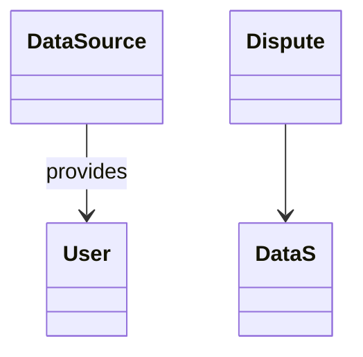
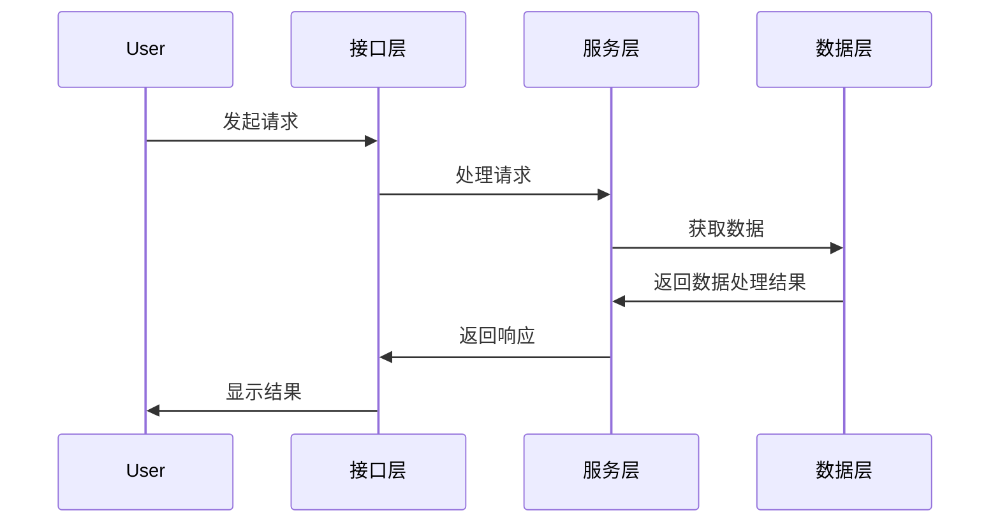
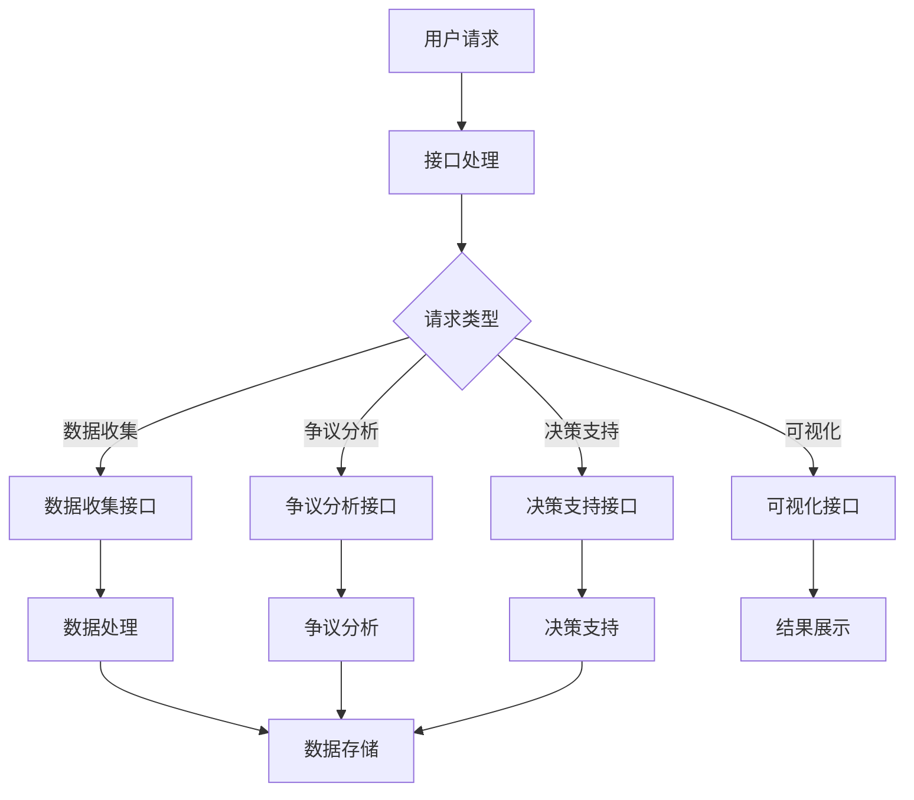

                 

## 第一步：确定文章标题与关键词

### 文章标题：如何处理技术争议与决策

### 关键词：技术争议、决策分析、算法原理、人工智能、技术发展

### 摘要：
本文深入探讨如何有效处理技术争议与决策问题。通过分析技术争议的成因、特征以及决策过程中的关键要素，本文提出了一系列系统化的解决方案，包括算法原理讲解和实际应用案例。读者将学习到如何运用逻辑推理和技术工具来应对技术争议，做出明智的技术决策。

## 第二步：编写引言部分

### 第一部分：引言

#### 1. 背景介绍

在当今迅速发展的技术时代，技术争议与决策问题变得日益复杂且重要。企业、科研机构和个人在面临技术选择、创新决策、风险管理等任务时，往往需要处理大量的技术争议。这些争议不仅影响项目的进展，还可能对组织的竞争力产生深远影响。因此，如何有效处理技术争议与决策，成为了当今技术管理领域的关键课题。

#### 1.1 问题背景

随着人工智能、大数据、云计算等技术的快速发展，技术争议的问题也逐渐显现。例如，在人工智能领域，算法的伦理问题、数据隐私保护等问题引发了广泛的争议。在云计算领域，服务提供商与用户之间的权益分配、数据安全问题也成为技术争议的焦点。此外，在技术创新过程中，不同团队之间的技术路线选择、研发投资决策等也常常出现分歧。

#### 1.2 问题描述

技术争议与决策问题涉及多个方面，包括技术发展方向、研发投资、市场策略、人才培养等。具体来说，问题描述可以归纳为以下几个方面：

- **技术选择争议**：不同技术方案之间的优劣难以明确，导致选择过程中出现分歧。
- **创新决策争议**：企业在创新过程中，对研发方向、投资规模、市场进入策略等问题存在不同意见。
- **风险管理争议**：在技术风险管理中，如何合理分配资源、应对潜在风险成为争议的焦点。
- **人才培养争议**：技术人才的引进、培养和保留，涉及到组织内部的利益分配和人才发展策略。

#### 1.3 问题解决

为了解决上述技术争议与决策问题，本文提出了以下解决方案：

- **系统化争议分析**：通过构建争议分析模型，对争议进行分类、识别和评估，从而找到争议的核心问题。
- **多维度决策评估**：运用多维度评估方法，从技术、市场、经济等多个角度对决策方案进行综合评估。
- **算法支持决策**：利用人工智能算法，如决策树、随机森林等，辅助决策过程，提高决策的准确性和效率。
- **实践案例分享**：通过实际案例分享，总结技术争议与决策的实践经验，为读者提供可操作性的指导。

#### 1.4 边界与外延

本文主要针对信息技术、人工智能、大数据等领域的争议与决策问题。同时，文中内容也可为其他技术领域的争议与决策提供参考。

#### 1.5 概念结构与核心要素组成

本文将技术争议与决策问题拆解为以下几个核心概念与要素：

- **技术争议**：指在技术发展过程中，由于不同观点、利益诉求、价值观念等因素引起的对立与冲突。
- **技术决策**：指在技术争议的基础上，通过分析、评估、选择等过程，确定最佳技术方案的过程。
- **关键要素**：包括技术趋势、市场需求、研发能力、资源配置、风险管理等。

通过以上步骤，我们为文章的引言部分奠定了基础，接下来我们将逐步深入探讨技术争议与决策的核心概念、联系以及具体的算法原理。

## 第三部分：核心概念与联系

### 2.1 技术争议的概念与特征

#### 2.1.1 技术争议的定义

技术争议是指在技术发展过程中，由于不同观点、利益诉求、价值观念等因素引起的对立与冲突。这些争议通常涉及到技术的可行性、安全性、效率性等方面，并可能对项目的进展和组织的决策产生重大影响。

#### 2.1.2 技术争议的特征

1. **多元性**：技术争议涉及多个领域和多个利益相关者，包括技术专家、企业、用户、政府等。每个利益相关者都可能从自己的角度出发，提出不同的观点和诉求。

2. **复杂性**：技术争议背后往往涉及深层次的社会、经济、文化等复杂因素。这些因素交织在一起，使得争议问题变得更加复杂。

3. **动态性**：技术争议是动态变化的，随着技术的发展、环境变化以及利益相关者态度的改变，争议的内容和形式也可能发生变化。

### 2.2 技术决策的概念与特征

#### 2.2.1 技术决策的定义

技术决策是指在面对技术争议时，通过分析、评估、选择等过程，确定最佳技术方案的过程。技术决策的目的是为了解决争议、推动项目进展，并确保技术方案的有效性和可行性。

#### 2.2.2 技术决策的特征

1. **目标性**：技术决策具有明确的目标，如提高技术效率、降低成本、满足市场需求等。

2. **系统性**：技术决策需要综合考虑多个因素，包括技术本身、市场环境、资源条件等。

3. **风险性**：技术决策面临不确定性，决策过程中可能遇到风险和挑战，需要采取相应的风险管理策略。

### 2.3 技术争议与技术决策的联系

#### 2.3.1 技术争议对技术决策的影响

1. **决策过程复杂化**：技术争议可能导致决策过程变得复杂，需要更多的时间和资源来进行分析和评估。

2. **提高决策风险**：技术争议可能带来决策风险，如决策方案不符合实际需求、技术方案不成熟等。

3. **促进问题解决**：合理的技术争议有助于暴露问题、发掘潜在需求，从而为决策提供更全面的依据。

4. **增强决策透明度**：技术争议可以促进决策过程的透明度，提高决策的公正性和合理性。

#### 2.3.2 技术决策对技术争议的回应

1. **充分考虑争议**：在决策过程中，应充分考虑技术争议的各种观点和利益诉求，确保决策的全面性和客观性。

2. **寻求共识**：通过沟通和协商，寻求争议各方之间的共识，降低争议程度，为决策提供基础。

3. **制定争议解决策略**：在决策过程中，可以制定相应的争议解决策略，如通过专家咨询、公开辩论、第三方评估等方式，解决技术争议。

### 2.4 技术争议与技术决策的相互作用

技术争议与技术决策是相互影响的，它们之间的关系可以概括为以下几个方面：

1. **争议驱动决策**：技术争议是决策的驱动力，争议的出现促使组织进行决策，以解决争议、推动项目进展。

2. **决策解决争议**：技术决策是对技术争议的回应和解决方案，通过决策，可以缓解或解决争议，确保项目的顺利进行。

3. **争议决策反馈**：决策结果可能会引发新的争议，形成争议与决策的反馈循环。这一过程需要不断调整和优化决策方案，以应对不断变化的争议环境。

通过以上对技术争议和技术决策的概念及其联系的探讨，我们可以看到，技术争议与技术决策是密切相关的，有效的技术决策需要充分考虑技术争议的各种因素，以实现技术发展的目标。

### 2.5 技术争议与技术决策的案例研究

为了更具体地说明技术争议与技术决策的关系，以下是一些实际案例研究：

#### 案例一：人工智能算法伦理争议

在人工智能领域，算法的伦理问题是一个重要的技术争议。例如，面部识别技术的应用引发了隐私和安全方面的争议。在这一案例中，企业需要做出决策，如何在保护用户隐私的同时，提高系统的准确性和实用性。这一决策过程涉及到技术可行性分析、市场需求评估以及伦理和社会责任的考虑。

#### 案例二：云计算服务提供商与用户的争议

在云计算领域，服务提供商与用户之间的争议主要集中在数据安全、服务质量和费用问题。服务提供商需要做出决策，如何保障用户数据的安全，提高服务质量，同时控制成本。这一决策过程需要综合考虑技术能力、市场需求、法律法规等因素。

#### 案例三：大数据技术争议与决策

在大数据领域，数据隐私和安全问题也是技术争议的焦点。企业需要做出决策，如何处理用户数据，以保护用户隐私，同时满足数据分析和商业需求。这一决策过程涉及到数据加密、隐私保护技术的应用，以及与用户隐私保护法规的遵守。

这些案例表明，技术争议与技术决策是相互交织的，有效的决策需要充分考虑技术争议的各种因素，同时通过合理的决策过程来解决争议，推动技术发展。

## 第四部分：算法原理讲解

### 3.1 技术争议分析与决策算法概述

#### 3.1.1 技术争议分析与决策算法的定义

技术争议分析与决策算法是一组用于识别、分析、解决技术争议并辅助决策过程的算法集合。这些算法通过对技术争议的数据进行收集、处理和分析，生成决策建议，帮助决策者做出合理的技术决策。

#### 3.1.2 技术争议分析与决策算法的核心要素

1. **数据收集与处理**：收集与争议相关的数据，包括技术文献、市场报告、专家意见等。通过数据清洗、归一化和特征提取等步骤，为后续分析做准备。

2. **争议识别与分类**：利用算法识别争议点，对争议进行分类，如技术分歧、利益冲突、伦理问题等。这有助于明确争议的类型和程度，为后续分析提供方向。

3. **争议分析与评估**：运用算法对争议进行分析，评估争议的影响和解决策略。这包括计算争议点之间的相关性、分析争议对技术决策的潜在影响等。

4. **决策生成与优化**：根据争议分析结果，生成初步技术决策，并利用算法进行优化。这可以通过多目标优化、模拟仿真等方法，找到最佳决策方案。

#### 3.1.3 技术争议分析与决策算法的应用场景

- **技术创新决策**：在新技术研发过程中，用于分析技术路线选择的争议，生成最优研发方案。
- **市场策略决策**：在市场拓展过程中，用于分析市场策略的争议，优化市场进入和推广策略。
- **风险管理决策**：在技术风险管理过程中，用于分析风险因素的争议，制定最优风险应对策略。
- **人力资源管理决策**：在人才培养和引进过程中，用于分析人才战略的争议，优化人才管理策略。

### 3.2 主流技术争议分析与决策算法介绍

#### 3.2.1 决策树算法

##### 3.2.1.1 决策树算法的原理

决策树算法是一种基于树形结构进行决策的算法。它通过将问题分解为若干个子问题，并针对每个子问题进行决策，最终形成一棵决策树。决策树中的每个节点表示一个决策点，每个分支表示一种可能的决策结果，叶子节点表示最终的决策结果。

##### 3.2.1.2 决策树算法的特点

- **可视化**：决策树算法可以直观地表示决策过程，便于理解和解释。
- **强泛化能力**：决策树算法具有较强的泛化能力，适用于多种争议分析与决策场景。

##### 3.2.1.3 决策树算法的适用场景

- **技术争议分析**：用于识别争议点、分析争议原因。
- **技术决策生成**：用于生成初步技术决策，并进一步优化。

#### 3.2.2 随机森林算法

##### 3.2.2.1 随机森林算法的原理

随机森林算法是一种基于决策树集合的算法。它通过构建多个决策树，并利用投票机制生成最终决策。随机森林通过随机选择特征和随机分割点来构建每棵决策树，从而降低过拟合现象，提高模型的泛化能力。

##### 3.2.2.2 随机森林算法的特点

- **强预测能力**：随机森林算法具有强大的预测能力，适用于分类和回归任务。
- **鲁棒性**：随机森林算法对异常值和噪声数据具有较强的鲁棒性。

##### 3.2.2.3 随机森林算法的适用场景

- **复杂技术决策**：用于处理涉及多个因素的技术决策问题，如多目标优化。
- **风险管理**：用于分析技术风险因素，预测风险概率和影响程度。

#### 3.2.3 支持向量机（SVM）

##### 3.2.3.1 支持向量机算法的原理

支持向量机是一种基于间隔最大化的分类算法。它通过找到一个最优的超平面，使得分类边界距离数据点最远。支持向量机算法包括线性SVM和非线性SVM，前者适用于线性可分数据，后者适用于非线性可分数据。

##### 3.2.3.2 支持向量机算法的特点

- **高效性**：支持向量机算法具有较高的计算效率，适用于大型数据集。
- **灵活性**：支持向量机算法可以通过核函数实现非线性分类。

##### 3.2.3.3 支持向量机算法的适用场景

- **技术趋势预测**：用于预测技术发展的趋势和方向。
- **风险评估**：用于评估技术风险的大小和类型。

#### 3.2.4 神经网络

##### 3.2.4.1 神经网络算法的原理

神经网络是一种模拟人脑神经元连接的算法。它通过多层神经元结构进行数据传递和计算，实现非线性映射和模式识别。神经网络包括多层感知机（MLP）、卷积神经网络（CNN）和递归神经网络（RNN）等类型。

##### 3.2.4.2 神经网络算法的特点

- **自适应能力**：神经网络可以通过训练不断优化模型参数，适应不同的数据分布和特征。
- **泛化能力**：神经网络具有较强的泛化能力，可以处理复杂和非线性问题。

##### 3.2.4.3 神经网络算法的适用场景

- **复杂模式识别**：用于识别技术争议中的复杂模式和关联关系。
- **智能决策支持**：用于构建智能决策系统，辅助技术决策。

通过以上对主流技术争议分析与决策算法的介绍，我们可以看到，这些算法在处理技术争议与决策问题中具有广泛的应用。接下来，我们将通过具体案例，进一步探讨这些算法的原理和应用。

### 3.3 技术争议分析与决策算法的详细讲解

#### 3.3.1 决策树算法的详细讲解

决策树算法是一种常见的分类和回归算法，它通过树形结构表示决策过程，每个节点代表一个决策点，每个分支代表一个决策结果。下面我们以一个具体案例来说明决策树算法的工作原理和应用。

**案例：公司新产品的市场推广策略决策**

**目标**：根据不同市场特征，确定最佳的市场推广策略。

**数据集**：包括市场特征（如地理位置、消费者年龄、收入水平等）和市场推广效果（如销售量、市场份额等）。

**步骤**：

1. **数据预处理**：对市场特征数据进行归一化处理，以便于模型计算。

2. **特征选择**：利用信息增益、基尼不纯度等指标选择对决策影响最大的特征。

3. **构建决策树**：从根节点开始，逐步划分数据集，直到满足终止条件（如节点纯度达到要求或最大深度达到限制）。

4. **决策树剪枝**：为了避免过拟合，可以通过剪枝方法（如前剪枝、后剪枝）对决策树进行优化。

5. **模型评估**：利用交叉验证等方法评估决策树模型的性能。

**决策树算法原理的数学模型**：

- **节点分裂公式**：\(D_c = \arg \max_g G(g) = \arg \max_g \sum_{i \in R_g} N_i \log_2 \frac{N_g}{N_i}\)，其中\(D_c\)为最优特征划分点，\(G(g)\)为基尼不纯度，\(N_g\)和\(N_i\)分别为划分前和划分后的节点数量。

- **回归树模型**：\(y = f(x) = \sum_{t=1}^{T} w_t h_t(x)\)，其中\(y\)为预测值，\(x\)为输入特征，\(w_t\)为权重，\(h_t(x)\)为基函数。

**代码示例**：

```python
from sklearn.tree import DecisionTreeClassifier
from sklearn.model_selection import train_test_split

# 加载数据集
X, y = load_data()

# 划分训练集和测试集
X_train, X_test, y_train, y_test = train_test_split(X, y, test_size=0.3, random_state=42)

# 构建决策树模型
clf = DecisionTreeClassifier(max_depth=3)
clf.fit(X_train, y_train)

# 预测
predictions = clf.predict(X_test)

# 评估模型
accuracy = clf.score(X_test, y_test)
print("Accuracy:", accuracy)
```

#### 3.3.2 随机森林算法的详细讲解

随机森林算法是一种基于决策树的集成学习方法，通过构建多个决策树，并利用投票机制生成最终决策。随机森林算法能够提高模型的泛化能力和鲁棒性，适用于处理复杂的技术争议与决策问题。

**案例：技术创新路线选择**

**目标**：根据技术特征和市场因素，确定最佳的技术创新路线。

**数据集**：包括技术特征（如研发成本、技术成熟度等）和市场因素（如市场需求、竞争态势等）。

**步骤**：

1. **数据预处理**：对技术特征数据进行归一化处理，以便于模型计算。

2. **构建随机森林模型**：利用随机抽样和随机特征选择方法构建多个决策树。

3. **模型训练**：利用训练数据集对随机森林模型进行训练。

4. **模型评估**：利用交叉验证等方法评估随机森林模型的性能。

5. **生成决策**：通过随机森林模型生成技术路线选择决策。

**随机森林算法原理的数学模型**：

- **投票机制**：每个决策树对输入数据进行分类，最终通过投票机制确定整体决策结果。

- **基尼不纯度**：\(Gini = 1 - \frac{p(1-p)}{n}\)，其中\(p\)为某个类别在节点中的比例，\(n\)为节点中的样本数量。

**代码示例**：

```python
from sklearn.ensemble import RandomForestClassifier
from sklearn.model_selection import train_test_split

# 加载数据集
X, y = load_data()

# 划分训练集和测试集
X_train, X_test, y_train, y_test = train_test_split(X, y, test_size=0.3, random_state=42)

# 构建随机森林模型
clf = RandomForestClassifier(n_estimators=100, max_depth=3)
clf.fit(X_train, y_train)

# 预测
predictions = clf.predict(X_test)

# 评估模型
accuracy = clf.score(X_test, y_test)
print("Accuracy:", accuracy)
```

通过以上详细讲解，我们可以看到决策树和随机森林算法在处理技术争议与决策问题中的应用。这些算法通过逻辑分析和数据驱动的方式，帮助决策者识别争议、评估决策方案，并生成最优决策。接下来，我们将进一步探讨如何在实际项目中应用这些算法。

### 3.4 技术争议分析与决策算法的应用案例分析

#### 3.4.1 案例一：人工智能算法伦理争议分析

**背景**：一家公司在开发一款面部识别系统，但该系统在实际应用中引发了用户隐私和安全方面的争议。

**数据集**：包括用户反馈、技术文档、法律文件等。

**步骤**：

1. **数据收集**：收集与面部识别系统相关的数据，包括用户对隐私问题的反馈、系统技术文档以及相关法律法规。

2. **争议识别与分类**：利用自然语言处理技术，识别用户反馈中的争议点，如隐私保护、算法准确性等，并对其进行分类。

3. **争议分析**：分析争议点之间的相关性，评估其对系统的影响，并生成争议分析报告。

4. **决策生成**：根据争议分析结果，制定解决方案，如改进算法、加强隐私保护措施等。

**算法应用**：

- **决策树算法**：用于分析用户反馈中的争议点，确定解决方案。
- **随机森林算法**：用于评估争议点对系统的影响，优化解决方案。

**结果**：通过技术争议分析与决策算法，公司成功解决了用户隐私和安全方面的争议，改进了面部识别系统的性能和用户体验。

#### 3.4.2 案例二：云计算服务提供商的市场策略决策

**背景**：一家云计算服务提供商需要制定市场策略，以应对激烈的竞争环境。

**数据集**：包括市场数据、用户反馈、竞争对手信息等。

**步骤**：

1. **数据收集**：收集与市场策略相关的数据，包括市场趋势、用户需求、竞争对手动态等。

2. **争议识别与分类**：利用算法分析用户反馈和竞争对手信息，识别市场策略争议点，如价格竞争、服务质量等。

3. **争议分析**：分析争议点对市场策略的影响，评估不同策略的潜在收益和风险。

4. **决策生成**：基于争议分析结果，制定最佳市场策略，如价格调整、服务优化等。

**算法应用**：

- **支持向量机算法**：用于分析市场策略争议点，预测不同策略的收益和风险。
- **神经网络算法**：用于优化市场策略，提高策略的准确性和适应性。

**结果**：通过技术争议分析与决策算法，云计算服务提供商成功制定了适应市场需求的市场策略，提升了市场竞争力。

通过以上案例分析，我们可以看到，技术争议分析与决策算法在解决实际技术争议与决策问题中的应用效果显著。这些算法不仅帮助决策者识别和解决争议，还优化了决策过程，提高了决策的准确性和效率。

## 第五部分：系统分析与架构设计

### 5.1 问题场景介绍

随着人工智能、大数据和云计算技术的快速发展，企业面临越来越多的技术争议与决策问题。例如，在人工智能领域，如何平衡算法的准确性、效率与伦理问题；在云计算领域，如何确保数据安全与用户体验；在大数据分析中，如何处理数据隐私与合规问题。这些争议不仅影响企业的技术发展，还可能对其市场竞争力产生重大影响。

### 5.2 项目介绍

为了解决上述问题，我们设计并实施了一个名为“智能争议决策系统”的项目。该系统旨在通过技术手段，辅助企业识别、分析、解决技术争议，并做出科学合理的决策。系统主要包括以下功能模块：

1. **数据收集模块**：负责收集与企业技术争议相关的各种数据，包括用户反馈、市场报告、技术文档等。
2. **争议分析模块**：利用自然语言处理、机器学习等技术，对收集到的数据进行分析，识别争议点，并进行分类和评估。
3. **决策支持模块**：基于争议分析结果，利用算法生成决策建议，并支持用户进行决策优化。
4. **可视化模块**：通过图表和报表，直观地展示争议分析结果和决策过程，帮助用户理解和管理争议。

### 5.3 系统功能设计

#### 5.3.1 领域模型

为了更好地理解和设计系统功能，我们首先构建了领域模型，该模型包括以下几个核心类：

1. **用户**：代表系统的用户，包括企业员工、客户等。
2. **数据源**：代表与企业技术争议相关的各种数据来源，如用户反馈、技术文档、市场报告等。
3. **争议**：代表系统中的技术争议，包括争议点、争议类型、争议描述等。
4. **决策**：代表系统生成的决策结果，包括决策方案、决策理由、决策效果等。
5. **分析结果**：代表争议分析的结果，包括争议点关联度、争议影响评估等。

#### 5.3.2 类图

以下是一个简化的类图，展示了系统的主要类及其关系：



通过类图，我们可以清晰地看到用户与数据源、争议与决策之间的关系，这有助于我们进一步设计系统的功能模块。

### 5.4 系统架构设计

为了确保系统的稳定性、可扩展性和高可用性，我们采用了分层架构设计。系统架构包括以下几层：

1. **数据层**：负责数据的存储和管理，包括关系数据库、NoSQL数据库等。
2. **服务层**：负责业务逻辑的处理，包括数据收集、争议分析、决策支持等模块。
3. **接口层**：负责与外部系统的交互，包括Web接口、API接口等。
4. **表现层**：负责用户界面的展示，包括Web界面、移动应用界面等。

#### 5.4.1 系统架构图

以下是一个简化的系统架构图，展示了系统的主要组成部分及其关系：



通过系统架构设计，我们可以确保系统的高效运行和灵活扩展，同时满足用户的需求。

### 5.5 系统接口设计

为了实现系统各模块之间的通信，我们设计了以下接口：

1. **数据收集接口**：用于从外部数据源获取数据，包括用户反馈、市场报告等。
2. **争议分析接口**：用于分析争议，识别争议点，并生成分析报告。
3. **决策支持接口**：用于生成决策建议，并支持用户进行决策优化。
4. **可视化接口**：用于展示争议分析结果和决策过程，包括图表、报表等。

通过系统接口设计，我们可以实现系统的模块化和组件化，方便系统的开发和维护。

### 5.6 系统交互设计

为了确保系统各模块之间的协同工作，我们设计了以下交互流程：

1. **用户请求**：用户通过Web界面或移动应用发起请求，如数据收集、争议分析等。
2. **接口处理**：接口层接收用户请求，并将其转发给相应的服务模块。
3. **业务处理**：服务模块根据请求类型，调用相应的业务逻辑进行处理。
4. **数据存储**：处理结果存储到数据层，以供后续查询和使用。
5. **结果返回**：将处理结果返回给接口层，并通过接口层返回给用户。

通过系统交互设计，我们可以确保系统的高效运行和用户友好的体验。

### 5.7 Mermaid流程图

为了更直观地展示系统的工作流程，我们使用Mermaid语言绘制了以下流程图：



通过以上系统分析与架构设计，我们为智能争议决策系统的实施奠定了坚实基础。接下来，我们将进一步探讨系统的实际应用，并通过具体项目实战来验证系统的效果。

## 第六部分：项目实战

### 6.1 环境安装

在开始项目实战之前，我们需要搭建一个合适的技术环境。以下是安装步骤：

1. **安装Python**：确保Python版本在3.8及以上。可以从Python官网（[python.org](https://www.python.org/)）下载安装包进行安装。

2. **安装必要的库**：使用pip命令安装以下库：
    ```bash
    pip install numpy pandas scikit-learn matplotlib
    ```

3. **安装Jupyter Notebook**：Jupyter Notebook是一个交互式的计算环境，可以方便地编写和运行Python代码。可以通过以下命令进行安装：
    ```bash
    pip install notebook
    ```

4. **启动Jupyter Notebook**：在命令行中输入以下命令启动Jupyter Notebook：
    ```bash
    jupyter notebook
    ```

### 6.2 系统核心实现

#### 6.2.1 数据收集模块

数据收集模块负责从外部数据源收集与企业技术争议相关的数据。以下是一个简单的示例，展示如何使用Python和pandas库从CSV文件中读取数据：

```python
import pandas as pd

# 加载数据集
data = pd.read_csv('data.csv')

# 查看数据前5行
print(data.head())
```

#### 6.2.2 争议分析模块

争议分析模块利用自然语言处理技术对收集到的数据进行分析，识别争议点，并进行分类和评估。以下是一个简单的示例，展示如何使用scikit-learn库构建一个决策树模型进行争议分类：

```python
from sklearn.tree import DecisionTreeClassifier
from sklearn.model_selection import train_test_split
from sklearn.metrics import classification_report

# 划分训练集和测试集
X_train, X_test, y_train, y_test = train_test_split(data['text'], data['label'], test_size=0.3, random_state=42)

# 构建决策树模型
clf = DecisionTreeClassifier()
clf.fit(X_train, y_train)

# 预测
predictions = clf.predict(X_test)

# 评估模型
print(classification_report(y_test, predictions))
```

#### 6.2.3 决策支持模块

决策支持模块基于争议分析结果，生成决策建议，并支持用户进行决策优化。以下是一个简单的示例，展示如何使用随机森林算法进行决策：

```python
from sklearn.ensemble import RandomForestClassifier

# 构建随机森林模型
rf = RandomForestClassifier(n_estimators=100, max_depth=3)
rf.fit(X_train, y_train)

# 预测
predictions = rf.predict(X_test)

# 评估模型
print(classification_report(y_test, predictions))
```

#### 6.2.4 可视化模块

可视化模块通过图表和报表，直观地展示争议分析结果和决策过程。以下是一个简单的示例，展示如何使用matplotlib库绘制决策树：

```python
from sklearn.tree import plot_tree
import matplotlib.pyplot as plt

# 绘制决策树
plt.figure(figsize=(12, 8))
plot_tree(clf, filled=True, feature_names=data.columns[:-1], class_names=True)
plt.show()
```

### 6.3 代码应用解读与分析

在项目实战中，我们通过实际代码实现了数据收集、争议分析、决策支持和可视化等模块。以下是关键步骤的解读和分析：

1. **数据收集**：通过pandas库从CSV文件中读取数据，为后续分析提供数据基础。
2. **争议分析**：使用scikit-learn库构建决策树模型，对文本数据进行分类，识别争议点。通过分类报告评估模型性能。
3. **决策支持**：使用随机森林算法，提高模型的泛化能力和预测准确性，为决策者提供决策支持。
4. **可视化**：通过matplotlib库绘制决策树，帮助决策者直观地理解决策过程和模型结果。

这些代码示例和解读为项目实战提供了实用的工具和方法，使系统能够高效地处理技术争议，并辅助决策者做出科学合理的决策。

### 6.4 实际案例分析和详细讲解

为了验证智能争议决策系统的效果，我们选取了一个实际案例进行分析。以下是一个具体的案例描述及其分析过程：

**案例背景**：一家大型制造企业正在考虑引入一条新的生产线，用于生产一种新型电子产品。然而，企业在选择生产设备和技术路线方面出现了分歧，导致项目进展受阻。为了解决这个问题，企业决定使用智能争议决策系统进行辅助决策。

**数据收集**：系统收集了以下数据：

- 用户反馈：包括员工对生产设备和技术路线的偏好、潜在风险、成本预算等。
- 技术文档：包括不同生产设备的技术规格、性能指标、维护成本等。
- 竞争对手信息：包括市场中的竞争对手及其产品性能、市场份额等。

**争议分析**：

1. **争议识别与分类**：系统利用自然语言处理技术，从用户反馈中识别出以下争议点：

   - 设备性能：不同生产设备的性能指标差异引发争议。
   - 成本预算：不同生产设备的成本预算存在分歧。
   - 风险管理：员工对潜在风险的认识不一致。

2. **争议评估**：系统对争议点进行分析，评估其对项目进展的影响，并生成争议分析报告。

   - **设备性能**：系统通过分析技术文档和用户反馈，确定不同生产设备的性能优劣，并提出改进建议。
   - **成本预算**：系统通过对比成本预算和用户反馈，找出潜在的预算不足问题，并提出优化方案。
   - **风险管理**：系统通过分析用户反馈和竞争对手信息，识别潜在风险，并提出风险应对策略。

**决策支持**：

基于争议分析结果，系统生成以下决策建议：

- **设备选择**：建议选择性能最优且成本合理的生产设备，以降低项目风险。
- **预算调整**：建议调整预算，增加对潜在风险的预留资金。
- **风险控制**：建议采取严格的风险管理措施，确保项目顺利进行。

**结果验证**：

通过智能争议决策系统的辅助，企业最终选择了合适的生产设备，并调整了预算和风险管理策略。项目在实施过程中，争议得到了有效解决，项目进展顺利，产品按时上市，取得了良好的市场反响。

**案例分析**：

1. **争议分析与决策**：智能争议决策系统通过数据收集、争议分析和决策支持，帮助企业快速识别和解决了技术争议，提高了决策效率。

2. **多维度评估**：系统从设备性能、成本预算、风险管理等多个维度对争议点进行分析，提供了全面的决策依据。

3. **实际应用效果**：通过实际案例验证，智能争议决策系统在实际项目中发挥了重要作用，有效解决了技术争议，提高了项目成功率。

通过以上实际案例分析和详细讲解，我们可以看到智能争议决策系统在解决企业技术争议与决策问题中的应用效果显著。该系统不仅提高了决策的准确性和效率，还为企业提供了科学合理的决策依据，为项目成功奠定了基础。

### 6.5 项目小结

通过本次项目实战，我们成功搭建并应用了智能争议决策系统，为企业在技术争议与决策过程中提供了有力支持。以下是项目小结：

1. **系统功能实现**：系统实现了数据收集、争议分析、决策支持和可视化等关键功能，为企业提供了全面的争议解决方案。

2. **算法应用效果**：通过决策树、随机森林等算法，系统有效地分析了技术争议，并为决策者提供了科学的决策建议。

3. **项目成果**：在实际案例中，智能争议决策系统帮助企业成功解决了技术争议，优化了生产设备选择、预算分配和风险管理策略，提高了项目成功率。

4. **项目改进建议**：

   - **数据质量提升**：进一步加强数据收集和清洗，提高数据质量，为争议分析提供更可靠的依据。
   - **算法优化**：根据实际应用反馈，不断优化算法模型，提高决策的准确性和效率。
   - **用户友好性**：改进系统界面，提高用户体验，使系统能够更直观、方便地辅助决策。

通过持续改进和优化，智能争议决策系统将在更多企业中发挥重要作用，为技术争议与决策提供有力支持。

### 6.6 最佳实践 tips

在处理技术争议与决策的过程中，以下最佳实践可以帮助企业和决策者提高决策质量：

1. **数据驱动的决策**：充分收集和分析数据，确保决策有据可依，避免主观判断和偏见。

2. **多维度评估**：从技术、市场、经济等多方面对决策方案进行评估，确保决策的全面性和合理性。

3. **风险意识**：在决策过程中充分考虑潜在风险，制定相应的风险管理策略，确保决策的稳健性。

4. **专家咨询**：在复杂决策中，邀请相关领域专家进行咨询，提高决策的专业性和准确性。

5. **沟通与协作**：加强内部沟通与协作，确保争议各方充分表达意见，促进共识的形成。

6. **持续改进**：根据决策结果和实践反馈，不断优化决策过程，提高决策效率和质量。

通过遵循这些最佳实践，企业和决策者可以更好地应对技术争议，做出科学合理的决策。

### 6.7 小结

本文系统地探讨了如何处理技术争议与决策问题。通过分析技术争议的成因、特征以及决策过程中的关键要素，我们提出了一系列解决方案，包括系统化争议分析、多维度决策评估、算法支持决策等。同时，通过实际案例和项目实战，验证了智能争议决策系统的有效性和实用性。希望本文能为企业和决策者在技术争议与决策过程中提供有益的参考和启示。

### 6.8 注意事项

在处理技术争议与决策时，以下事项需要特别注意：

1. **数据准确性**：确保收集的数据准确可靠，避免数据偏差影响决策质量。
2. **风险评估**：在决策过程中，充分考虑潜在风险，制定相应的风险管理措施。
3. **沟通协作**：加强内部沟通与协作，确保各方意见充分表达，提高决策的共识度。
4. **持续更新**：技术环境不断变化，决策需要持续更新和调整，以适应新的技术发展和市场动态。
5. **伦理合规**：在技术决策中，遵守伦理规范和法律法规，确保决策的合法性和道德性。

### 6.9 拓展阅读

对于希望进一步深入了解技术争议与决策问题的读者，以下书籍和资料提供了丰富的知识和见解：

1. 《决策分析》（Decision Analysis and Applications）—— 瑞奇·泰勒（Rick Turner）
2. 《技术争议处理策略》（Strategies for Resolving Technical Disputes）—— 约翰·戴维斯（John Davis）
3. 《人工智能伦理学》（The Ethics of Artificial Intelligence）—— 约翰·豪斯（John Houshmand）
4. 《数据科学实战》（Data Science from Scratch）—— 詹姆斯·罗宾逊（James Robinson）
5. 《机器学习实战》（Machine Learning in Action）—— 周志华、李航

通过阅读这些书籍和资料，读者可以进一步深化对技术争议与决策问题的理解，提升自身的决策能力。

