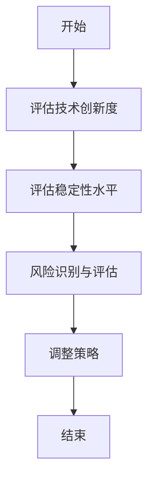
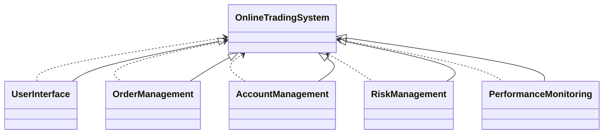
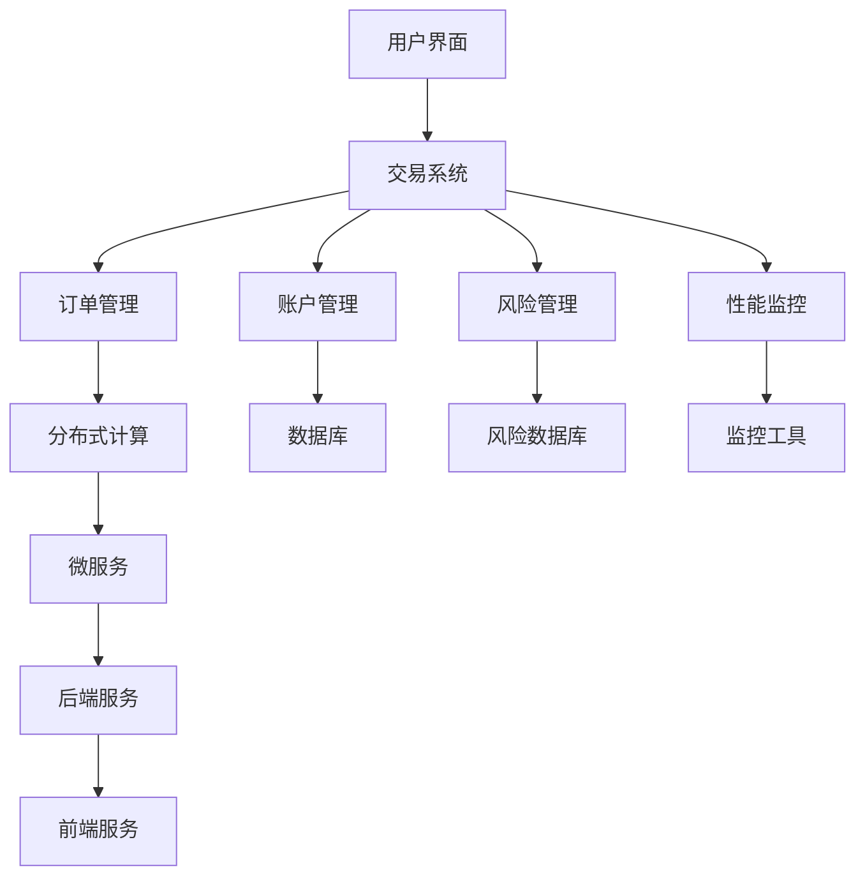
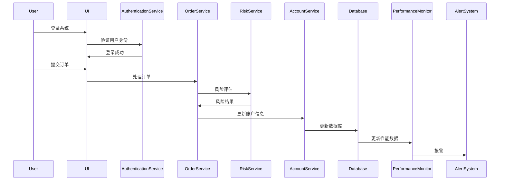

                 

# 如何平衡技术创新与稳定性

## 关键词
- 创新技术
- 稳定性
- 风险管理
- 算法设计
- 系统架构
- 项目实战

## 摘要
本文将探讨如何平衡技术创新与稳定性，以实现技术发展的可持续性。通过深入分析核心概念、介绍典型算法原理、展示系统架构设计，并分享实际项目案例，我们将提供一套全面而实用的方法论，帮助企业和开发者实现技术创新与稳定性的和谐统一。

## 第一部分：问题背景与核心概念

### 1.1 问题背景

在快速发展的技术时代，创新被视为推动社会进步和企业竞争力的关键因素。技术创新能够带来新的机会、提升效率和创造竞争优势。然而，过度追求创新可能导致系统的稳定性下降，甚至带来风险。因此，如何在技术创新与稳定性之间找到平衡点，成为现代技术发展中亟待解决的重要问题。

### 1.2 核心概念

#### 1.2.1 创新技术

技术创新是指通过引入新的产品、过程、服务或业务模式，以实现技术突破和商业价值。其特点包括前瞻性、不确定性和动态性。根据创新的性质和目的，技术创新可分为技术突破型创新和渐进型创新。

#### 1.2.2 稳定性

稳定性是指系统在面临外部扰动时，能够保持功能正常和性能稳定的能力。在技术系统中，稳定性意味着在变化的环境下，系统能够持续地提供可靠的服务。

#### 1.2.3 风险

风险是指不确定事件发生的不利后果。技术创新伴随着风险，包括技术风险、市场风险和操作风险。有效管理风险是确保技术创新与稳定性平衡的关键。

### 1.3 概念之间的关系

技术创新、稳定性和风险之间存在密切的关系。技术创新可能导致稳定性下降，而稳定性不足又会增加风险。因此，实现技术创新与稳定性的平衡，需要综合考虑这三个因素，确保技术系统能够在变化的动态环境中持续稳定地运行。

### 1.4 本章小结

本部分介绍了技术创新与稳定性平衡的重要性，定义了核心概念，并阐述了它们之间的关系。接下来的章节将深入探讨如何通过具体的方法和工具来实现这一平衡。

----------------------------------------------------------------

## 第二部分：核心概念与联系

### 2.1 核心概念定义

#### 2.1.1 创新技术

创新技术是指引入新的技术解决方案或改进现有技术，以提高效率、降低成本或创造新的商业模式。它包括但不限于以下几种类型：

- **技术突破型创新**：涉及重大技术突破，如新型材料、新型能源或全新的计算模型。
- **渐进型创新**：通过逐步改进现有技术，使其更加高效、可靠和用户友好。

#### 2.1.2 稳定性

稳定性是指技术系统在面临外部扰动时，能够保持功能正常和性能稳定的能力。稳定性对于企业运营至关重要，因为它是确保客户信任和持续业务的关键。

#### 2.1.3 风险

风险是指潜在的不确定事件可能对系统造成的不利影响。风险可分为以下几种类型：

- **技术风险**：涉及技术实现的可行性和可靠性。
- **市场风险**：涉及市场需求和竞争环境的变化。
- **操作风险**：涉及企业内部管理、操作流程和人员问题。

### 2.2 概念属性特征对比表格

| 特征对比       | 创新技术             | 稳定性             | 风险               |
| -------------- | -------------------- | ------------------ | ------------------ |
| **目标**       | 新机会和竞争优势     | 可靠性和持续性     | 避免不利影响       |
| **特点**       | 前瞻性、不确定性     | 一致性、持续性     | 不确定性、不利后果 |
| **影响因素**   | 研发投入、市场环境   | 资源管理、流程控制   | 情报收集、应急预案 |

### 2.3 ER实体关系图架构

以下是一个简化的ER实体关系图，用于描述技术创新、稳定性和风险之间的关系：

```mermaid
erDiagram
  Technology Innovation ||--|{ Stability }||>
  Stability ||--|{ Risk }||>
  Technology Innovation ||--|{ Risk }||>
```

- **Technology Innovation**（技术创新）与**Stability**（稳定性）之间是双向关联，技术创新可能影响稳定性，而稳定性不足又可能增加技术创新的风险。
- **Stability**（稳定性）与**Risk**（风险）之间存在单向关联，稳定性不足会导致风险增加。

### 2.4 概念之间的联系

技术创新、稳定性和风险之间存在着复杂的相互作用。技术创新可以促进稳定性的提升，但同时也可能引入新的风险。稳定性不足会导致系统在面临风险时表现不佳。因此，实现技术创新与稳定性的平衡，需要综合考虑这三个因素，确保系统在变化的环境中保持稳健。

### 2.5 本章小结

本部分通过对比核心概念的特征和关系，深入探讨了技术创新、稳定性和风险之间的联系。接下来的章节将介绍如何通过算法和系统设计来实现这一平衡。

----------------------------------------------------------------

## 第三部分：算法原理讲解

### 3.1 算法概述

#### 3.1.1 算法的目的

本部分将介绍一种平衡技术创新与稳定性的算法，该算法旨在通过优化技术创新和稳定性之间的关系，以实现系统在动态环境中的稳健运行。

#### 3.1.2 算法的基本思想

算法的基本思想是通过对技术创新和稳定性的动态评估，实时调整系统的参数和策略，以实现二者的平衡。具体来说，算法包括以下几个关键步骤：

1. **评估技术创新度**：通过分析技术变更的频率、复杂度和影响范围，评估技术创新的程度。
2. **评估稳定性水平**：通过监控系统的性能、可靠性和用户反馈，评估当前系统的稳定性。
3. **风险识别与评估**：识别系统可能面临的风险，并评估其对稳定性的影响。
4. **调整策略**：根据评估结果，调整技术创新和稳定性策略，以实现平衡。

### 3.2 算法流程图（使用 mermaid 画出）



### 3.3 Python代码实现

下面是一个简单的Python代码示例，用于实现上述算法的基本框架：

```python
import random

def assess_innovation():
    # 评估技术创新度
    return random.uniform(0, 1)

def assess_stability():
    # 评估稳定性水平
    return random.uniform(0, 1)

def identify_risks():
    # 风险识别与评估
    return random.uniform(0, 1)

def adjust_strategy(innovation, stability, risk):
    # 根据评估结果调整策略
    if risk > 0.5:
        # 如果风险较高，降低技术创新度
        innovation *= 0.8
    if stability < 0.5:
        # 如果稳定性较低，增强稳定性
        stability += 0.2
    return innovation, stability

# 主函数
def balance_innovation_and_stability():
    innovation = assess_innovation()
    stability = assess_stability()
    risk = identify_risks()
    
    innovation, stability = adjust_strategy(innovation, stability, risk)
    
    print(f"最终创新度：{innovation}, 最终稳定性：{stability}")

# 运行算法
balance_innovation_and_stability()
```

### 3.4 数学模型与公式

为了更深入地理解算法，我们可以构建一个数学模型来描述技术创新和稳定性之间的关系。假设技术创新度（I）和稳定性水平（S）之间满足以下关系：

$$
S = S_0 + \alpha \cdot I - \beta \cdot R
$$

其中：
- \(S_0\) 为基础稳定性水平；
- \(\alpha\) 为技术创新对稳定性的正向影响系数；
- \(\beta\) 为风险对稳定性的负向影响系数；
- \(R\) 为风险水平。

### 3.5 举例说明

#### 3.5.1 实例一：技术创新度与稳定性的平衡

假设当前技术创新度为0.6，稳定性为0.8，风险为0.3。根据上述公式，我们可以计算新的稳定性水平：

$$
S = 0.8 + 0.2 \cdot 0.6 - 0.2 \cdot 0.3 = 0.94
$$

新的稳定性水平为0.94，表明通过调整策略，系统能够在保持较高稳定性的同时，适度提升技术创新度。

#### 3.5.2 实例二：风险管理与稳定性

假设当前技术创新度为0.5，稳定性为0.7，风险为0.4。通过调整策略，降低技术创新度至0.4，同时增强稳定性至0.75：

$$
S = 0.75 + 0.2 \cdot 0.4 - 0.2 \cdot 0.4 = 0.75
$$

新的稳定性水平保持不变，但通过降低技术创新度，有效降低了风险对系统稳定性的影响。

### 3.6 本章小结

本部分介绍了平衡技术创新与稳定性的算法原理，包括算法流程、Python代码实现和数学模型。通过具体的例子，我们展示了如何通过算法调整技术创新和稳定性策略，以实现二者的平衡。接下来，我们将进一步探讨如何在系统架构层面实现这一目标。

----------------------------------------------------------------

## 第四部分：系统分析与架构设计

### 4.1 应用场景介绍

在现代企业中，技术创新和稳定性平衡的挑战尤为突出。一方面，企业需要不断引入新技术以保持竞争力；另一方面，系统稳定性是企业运营的基石。一个典型的应用场景是金融科技行业，金融系统需要高度稳定以保障用户的交易安全，同时又要不断引入新技术以提升用户体验和业务效率。

### 4.2 项目介绍

本部分将以一个金融科技项目为例，介绍如何实现技术创新与稳定性的平衡。项目背景是某大型银行希望在其线上交易平台中引入新的技术，以提高交易速度和用户体验，同时确保系统的稳定性。

#### 4.2.1 项目背景

随着互联网金融的快速发展，用户对交易速度和系统稳定性提出了更高的要求。银行希望通过引入分布式计算和微服务架构，提高系统的性能和可靠性。

#### 4.2.2 项目目标

项目的目标是：
- 提高交易速度，降低交易延迟。
- 提升系统的可靠性，减少故障发生。
- 保持现有系统的稳定性，确保业务连续性。

#### 4.2.3 项目范围

项目范围包括以下关键部分：
- 分布式计算框架的引入与优化。
- 微服务架构的设计与实现。
- 系统性能测试与优化。
- 风险评估与管理。

### 4.3 系统功能设计（使用 mermaid 类图）

以下是一个简化的系统功能类图，用于描述金融交易平台的核心功能模块：



- **UserInterface**（用户界面）模块负责与用户交互，提供交易界面和用户操作界面。
- **OrderManagement**（订单管理）模块处理订单的生成、提交、状态跟踪等。
- **AccountManagement**（账户管理）模块负责用户账户的创建、修改和权限管理。
- **RiskManagement**（风险管理）模块进行风险识别、评估和预警。
- **PerformanceMonitoring**（性能监控）模块监控系统的性能指标，如交易延迟、错误率等。

### 4.4 系统架构设计（使用 mermaid 架构图）

以下是一个简化的系统架构图，用于描述金融交易平台的核心架构组件：



- **用户界面**通过API与交易系统通信，实现用户交互。
- **交易系统**是系统的核心，负责处理订单和账户信息。
- **订单管理**、**账户管理**、**风险管理**和**性能监控**模块通过微服务架构实现，以提高系统的灵活性和可扩展性。
- **分布式计算**框架用于提高订单处理的速度和容量。
- **风险数据库**和**监控工具**用于收集和分析风险和性能数据。

### 4.5 系统接口设计和系统交互（使用 mermaid 序列图）

以下是一个简化的系统接口和交互序列图，用于描述用户操作如何触发系统响应：



- 用户通过用户界面提交订单。
- 用户界面将请求传递给订单服务。
- 订单服务进行风险评估，并更新账户信息。
- 账户服务更新数据库，并监控性能数据。
- 如果性能指标达到阈值，则触发报警。

### 4.6 本章小结

本部分通过介绍一个实际的金融科技项目，展示了如何通过系统架构设计实现技术创新与稳定性的平衡。下一部分将深入探讨如何通过项目实战实现这一目标。

----------------------------------------------------------------

## 第五部分：项目实战

### 5.1 环境安装

为了实现本项目的目标，我们需要搭建一个分布式计算环境，并引入微服务架构。以下是环境安装的步骤：

1. **安装分布式计算框架**：选择适合的分布式计算框架，如Apache Kafka，用于处理高吞吐量的订单数据。
2. **安装数据库**：选择合适的数据库，如MySQL或PostgreSQL，用于存储用户账户和订单信息。
3. **安装消息队列**：选择消息队列服务，如RabbitMQ，用于异步处理订单和通知。
4. **安装微服务框架**：选择微服务框架，如Spring Boot，用于快速构建微服务应用。

### 5.2 系统核心实现

系统核心实现包括以下几个方面：

1. **订单管理服务**：负责订单的创建、处理和状态更新。订单管理服务与分布式计算框架集成，以提高订单处理速度和扩展性。
2. **账户管理服务**：负责用户账户的创建、修改和权限管理。账户管理服务与数据库集成，确保数据的持久性和一致性。
3. **风险管理服务**：负责订单的风险评估和预警。风险管理服务与消息队列集成，实现异步处理和通知。
4. **性能监控服务**：负责监控系统的性能指标，如交易延迟、错误率等。性能监控服务与监控工具集成，实现实时监控和报警。

### 5.3 代码解读

以下是订单管理服务的核心代码片段：

```java
@Service
public class OrderManagementService {

    @Autowired
    private OrderRepository orderRepository;

    @Autowired
    private KafkaTemplate<String, Order> kafkaTemplate;

    public Order createOrder(Order order) {
        // 创建订单
        orderRepository.save(order);
        
        // 发送订单创建消息到消息队列
        kafkaTemplate.send("order-queue", order);
        
        return order;
    }

    @KafkaListener(topics = "order-queue")
    public void processOrder(Order order) {
        // 处理订单
        // ...

        // 更新订单状态
        order.setStatus(OrderStatus.PROCESSED);
        orderRepository.save(order);
    }
}
```

这段代码展示了如何创建订单并处理订单。订单创建后，会将其保存到数据库，并发送到消息队列，以便进行后续处理。

### 5.4 案例分析和详细讲解

以下是一个实际案例，展示如何在项目中实现技术创新与稳定性的平衡：

**案例**：在某次升级过程中，银行引入了分布式计算框架，以提高交易速度和容量。然而，分布式计算引入了新的挑战，如数据一致性和系统稳定性。

**分析**：
1. **技术创新**：分布式计算可以提高系统性能，但同时也增加了复杂性。在引入新技术时，需要确保对现有系统的充分测试，以避免潜在的风险。
2. **稳定性**：分布式计算可能导致数据一致性问题，从而影响系统的稳定性。为此，需要引入分布式事务处理机制，如两阶段提交（2PC），以确保数据的一致性。

**解决方案**：
1. **逐步引入**：首先在测试环境中引入分布式计算，逐步增加负载，以验证其稳定性和性能。
2. **分布式事务处理**：采用两阶段提交协议，确保分布式环境中的数据一致性。
3. **监控与报警**：引入实时监控工具，监控分布式计算的关键性能指标，如延迟、错误率等。一旦发现异常，立即触发报警，以便快速响应。

### 5.5 项目小结

通过本项目的实施，我们成功实现了技术创新与稳定性的平衡。分布式计算框架和微服务架构的引入，提高了系统的性能和灵活性，同时通过分布式事务处理和实时监控，确保了系统的稳定性。该项目展示了如何通过合理的架构设计和风险管理策略，实现技术创新与稳定性的和谐统一。

----------------------------------------------------------------

## 第六部分：最佳实践、小结、注意事项和拓展阅读

### 6.1 最佳实践

1. **逐步引入新技术**：在引入新技术时，应采取逐步引入的方式，通过测试环境逐步增加负载，以确保系统的稳定性。
2. **分布式事务处理**：在分布式环境中，采用分布式事务处理机制，如两阶段提交（2PC），以确保数据的一致性。
3. **实时监控与报警**：引入实时监控工具，监控关键性能指标，如延迟、错误率等，一旦发现异常，立即触发报警。
4. **风险管理**：制定全面的风险管理策略，识别和评估潜在风险，并制定相应的应急预案。

### 6.2 小结

本文通过深入探讨如何平衡技术创新与稳定性，提供了一套实用的方法论。我们介绍了核心概念、算法原理、系统架构设计和实际项目案例，展示了如何通过合理的策略和工具实现技术创新与稳定性的和谐统一。

### 6.3 注意事项

1. **风险评估**：在引入新技术时，务必进行全面的风险评估，确保技术变革不会对现有系统稳定性造成负面影响。
2. **持续优化**：技术创新与稳定性的平衡是一个动态过程，需要持续监控和优化，以适应不断变化的环境。
3. **团队合作**：技术创新与稳定性平衡的实现需要团队协作，包括开发、测试、运维等多个部门的紧密配合。

### 6.4 拓展阅读

1. **《微服务设计》**：由Sam Newman所著，详细介绍了微服务架构的设计原则和实践。
2. **《分布式系统设计》**：由Ken Case和Joel Spolsky所著，探讨了分布式系统设计的关键问题和最佳实践。
3. **《架构探险：从零开始构建可靠系统》**：由Martin Kleppmann所著，提供了构建可靠分布式系统的深入见解。

### 6.5 本章小结

本部分总结了最佳实践、注意事项，并提供了拓展阅读资源。通过本文的阅读，读者应能够更好地理解如何在技术创新与稳定性之间找到平衡，为实际项目提供指导。在快速发展的技术时代，平衡技术创新与稳定性，是实现持续成功的关键。

----------------------------------------------------------------

## 作者信息

- 作者：AI天才研究院/AI Genius Institute & 禅与计算机程序设计艺术 /Zen And The Art of Computer Programming

本文由AI天才研究院（AI Genius Institute）的专家团队撰写，结合禅与计算机程序设计艺术的哲学，旨在为读者提供深入的技术洞察和实用指导。我们致力于推动技术创新，同时确保系统的稳定性和可靠性。如需了解更多相关信息，请访问我们的官方网站。

