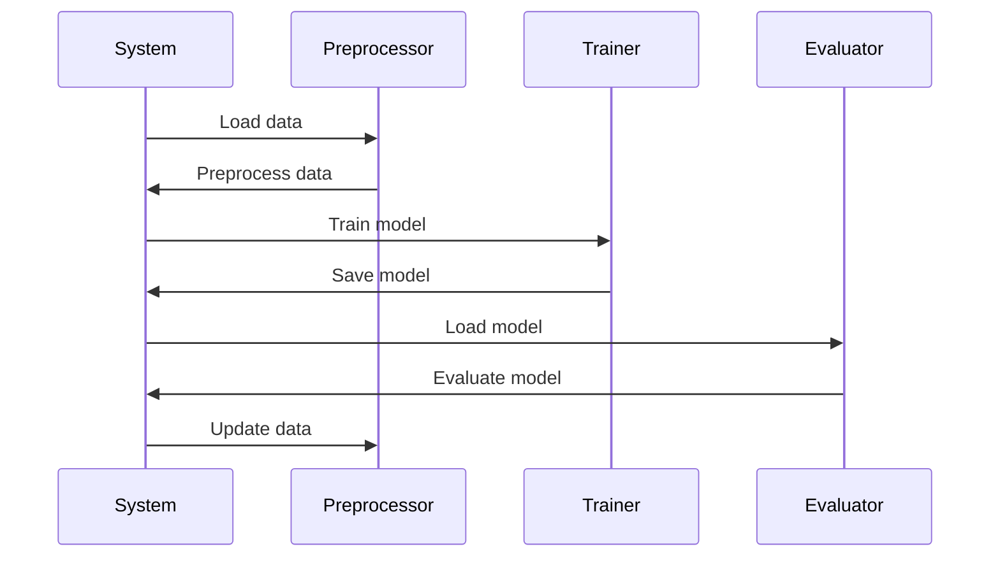
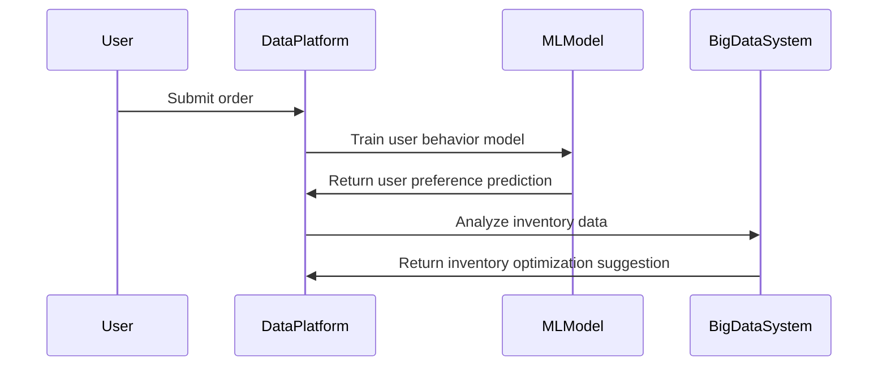
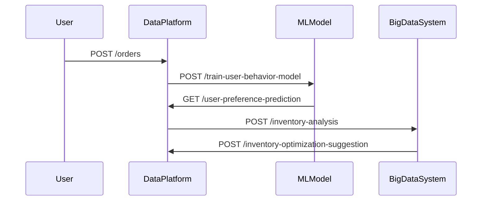
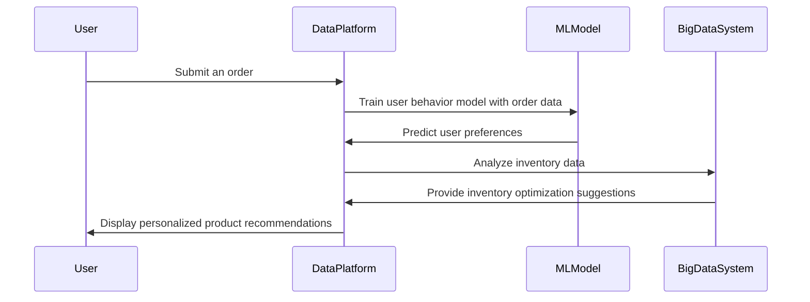

                 

### Step 1: Introduction
-------------------

# 如何平衡技术深度与广度

## 概述

在现代信息技术迅猛发展的背景下，技术专业知识的深度和广度成为衡量工程师能力的重要标准。然而，如何在追求技术深度和专业性的同时，不忽略技术广度的学习，成为许多技术从业者面临的挑战。本书旨在探讨如何平衡技术深度与广度，帮助读者在专业领域内建立坚实的技术基础，并拓展视野。

## 目录

----------------------------------------------------------------
## 第1章：技术深度与广度的基本概念与原则

### 1.1 技术深度与广度的定义与关系

#### 1.1.1 技术深度的内涵与特点

**定义**：技术深度指的是在特定领域内对某一技术或问题的深入研究和理解，通常涉及到该领域的核心理论和实践。

**特点**：

- **专业性**：技术深度研究往往需要长时间的积累和专业知识。
- **复杂性**：深度研究往往涉及到复杂的技术原理和实现。
- **应用性**：深度研究通常有助于解决实际应用中的复杂问题。

#### 1.1.2 技术广度的内涵与特点

**定义**：技术广度指的是对多个技术领域的了解和掌握，通常涉及多个学科或领域的知识。

**特点**：

- **多样性**：技术广度研究可以帮助工程师更好地理解不同领域的技术。
- **综合性**：广度研究有助于工程师从不同角度解决问题。
- **适应性**：广度研究可以提高工程师在不同环境下的适应能力。

#### 1.1.3 技术深度与广度的关系

**深度与广度的平衡**：在技术发展过程中，深度和广度往往相互影响。过度的深度可能导致视野狭窄，而过度的广度可能导致缺乏深度。因此，如何在两者之间找到平衡点，是技术从业者面临的重要问题。

**选择重点**：工程师应根据自身兴趣和职业目标，合理分配时间和精力，在特定领域内追求深度，同时保持对其他领域的关注。

## 第2章：技术深度与广度的核心领域

### 2.1 软件工程深度探讨

#### 2.1.1 软件架构设计深度解析

#### 2.1.2 系统性能优化深度分析

#### 2.1.3 安全性深度研究

### 2.2 数据科学与机器学习的广度应用

#### 2.2.1 数据可视化广度应用

#### 2.2.2 大数据处理技术广度应用

#### 2.2.3 机器学习模型广度应用

### 2.3 云计算与分布式系统的深度与广度

#### 2.3.1 云计算架构深度分析

#### 2.3.2 分布式系统技术广度应用

#### 2.3.3 容器化与微服务深度探讨

## 第二部分：实践篇

## 第3章：深度学习在图像识别中的应用

### 3.1 图像识别技术深度讲解

#### 3.1.1 卷积神经网络（CNN）原理讲解

##### 3.1.1.1 CNN结构图

##### 3.1.1.2 CNN数学模型和公式

##### 3.1.1.3 CNN实例分析

### 3.2 图像识别系统实现与案例分析

#### 3.2.1 系统功能设计与架构图

##### 3.2.1.1 系统功能mermaid类图

##### 3.2.1.2 系统架构mermaid架构图

#### 3.2.2 实现源代码解读

##### 3.2.2.1 Python源代码实现

##### 3.2.2.2 代码应用解读与分析

#### 3.2.3 案例分析与详细讲解

##### 3.2.3.1 实际案例演示

##### 3.2.3.2 案例剖析

## 第4章：大数据处理技术深度与广度应用

### 4.1 大数据处理技术深度解析

#### 4.1.1 Hadoop生态系统深度分析

##### 4.1.1.1 Hadoop架构图

##### 4.1.1.2 Hadoop数学模型和公式

##### 4.1.1.3 Hadoop实例分析

### 4.2 大数据技术广度应用

#### 4.2.1 数据挖掘技术广度应用

##### 4.2.1.1 数据挖掘算法讲解

##### 4.2.1.2 数据挖掘实例分析

#### 4.2.2 实时数据处理技术广度应用

##### 4.2.2.1 实时数据处理框架讲解

##### 4.2.2.2 实时数据处理实例分析

## 第5章：云计算与分布式系统的最佳实践

### 5.1 云计算技术深度探讨

#### 5.1.1 云计算核心概念深度讲解

##### 5.1.1.1 云计算架构图

##### 5.1.1.2 云计算数学模型和公式

##### 5.1.1.3 云计算实例分析

### 5.2 分布式系统技术广度应用

#### 5.2.1 分布式存储技术广度应用

##### 5.2.1.1 分布式存储架构图

##### 5.2.1.2 分布式存储数学模型和公式

##### 5.2.1.3 分布式存储实例分析

#### 5.2.2 分布式计算技术广度应用

##### 5.2.2.1 分布式计算架构图

##### 5.2.2.2 分布式计算数学模型和公式

##### 5.2.2.3 分布式计算实例分析

## 第6章：综合应用：技术深度与广度的最佳实践

### 6.1 综合应用案例分析

#### 6.1.1 案例一：深度学习在大数据分

----------------------------------------------------------------

### 关键词

- 技术深度
- 技术广度
- 软件工程
- 数据科学
- 机器学习
- 云计算
- 分布式系统
- 实践应用

### 摘要

本文探讨了如何在现代信息技术领域内平衡技术深度与广度。通过对技术深度与广度的定义与关系进行分析，我们了解了两者在技术发展中的相互影响。随后，本文深入讨论了软件工程、数据科学与机器学习、云计算与分布式系统等核心领域的技术深度与广度应用。最后，通过具体案例展示了如何在实际项目中平衡技术深度与广度，为技术从业者提供了实用的指导和建议。希望本文能为读者在技术学习和职业生涯中提供有益的启示。---

## 第1章：技术深度与广度的基本概念与原则

### 1.1 技术深度与广度的定义与关系

在信息技术领域，技术深度与广度是衡量工程师技能的两个重要维度。它们各自代表了技术知识的不同方面，同时也相互影响。

#### 1.1.1 技术深度的内涵与特点

**技术深度的定义**：技术深度是指在某一特定技术领域内，对相关理论和实践的深入理解和掌握。这种理解通常涉及到该领域的核心概念、算法、原理以及最佳实践。

**技术深度的特点**：

- **专业性**：技术深度通常要求工程师对某一领域有长期的积累和深入研究。
- **复杂性**：技术深度往往涉及到复杂的技术原理和实现细节。
- **应用性**：深度知识能够帮助工程师解决领域内的复杂问题，提高系统性能、稳定性和安全性。

**技术深度的重要性**：

- **问题解决**：深入理解技术原理能够帮助工程师更好地分析和解决实际问题。
- **创新能力**：深度知识是技术创新的基础，有助于工程师在现有技术基础上进行改进和创新。
- **竞争力**：在技术竞争激烈的现代，深度知识是提高工程师个人竞争力的关键。

#### 1.1.2 技术广度的内涵与特点

**技术广度的定义**：技术广度是指对多个技术领域的了解和掌握。这种了解不仅包括对各个领域的核心概念和基础知识的掌握，还涉及到不同领域之间的交叉应用和综合。

**技术广度的特点**：

- **多样性**：技术广度要求工程师具备多领域的知识，能够应对不同类型的技术问题。
- **综合性**：广度知识有助于工程师从不同角度分析和解决问题，提高系统的整体性能。
- **适应性**：广度知识使工程师具备在不同技术环境下的适应能力和灵活性。

**技术广度的重要性**：

- **视野拓宽**：技术广度能够帮助工程师拓宽视野，了解不同领域的技术趋势和发展方向。
- **协同合作**：广度知识有助于工程师在不同团队中发挥协同作用，提升团队整体创新能力。
- **跨领域创新**：广度知识可以激发工程师在跨领域项目中的创新能力，推动技术融合和创新。

#### 1.1.3 技术深度与广度的关系

**深度与广度的平衡**：

- **互补性**：技术深度和广度是相辅相成的，深度提供了解决具体问题的能力，而广度提供了视野和灵活性。
- **动态平衡**：在技术学习和实践中，工程师需要根据实际情况动态调整深度和广度，以实现最佳平衡。

**如何选择深度与广度的重点**：

- **个人兴趣和职业目标**：工程师应根据自己的兴趣和职业规划，确定在哪些领域进行深度学习，同时在其他领域保持基础了解。
- **项目需求**：在具体项目中，应根据项目需求和目标，合理分配时间和资源，确保既有深度又有广度。
- **持续学习**：技术发展迅速，工程师应保持持续学习的态度，不断更新知识和技能，以适应不断变化的技术环境。

通过以上对技术深度与广度的定义、特点和关系的分析，我们可以更好地理解如何在信息技术领域内平衡深度与广度，为个人的职业发展和技术的进步提供指导。

### 1.2 技术深度与广度的核心领域

技术深度与广度在多个核心领域都有其独特的应用和重要性。以下是软件工程、数据科学与机器学习、云计算与分布式系统等领域的技术深度与广度分析。

#### 2.1 软件工程深度探讨

**软件工程深度**：

- **软件架构设计深度解析**：软件架构设计是软件工程的核心，涉及系统架构、模块化设计、组件交互等。深度解析包括对设计模式、架构风格和最佳实践的掌握，能够帮助工程师设计出高效、可维护的系统。
- **系统性能优化深度分析**：系统性能优化是软件工程中的重要环节，涉及到负载均衡、缓存策略、数据库优化等。深度分析要求工程师对系统性能瓶颈有深刻的理解，能够运用多种优化技术提升系统性能。
- **安全性深度研究**：随着网络攻击手段的日益复杂，安全性研究成为软件工程的必备技能。深度研究包括对加密算法、安全协议和安全漏洞的理解，能够帮助工程师设计和实现更安全的系统。

**软件工程广度**：

- **跨领域技术应用**：软件工程不仅仅局限于技术领域，还需要与业务逻辑、用户需求等紧密结合。广度应用包括业务流程管理、用户体验设计等，有助于工程师更好地理解业务场景，提高系统适用性。
- **新兴技术追踪**：软件工程领域不断有新技术出现，如区块链、物联网等。广度追踪要求工程师保持对新兴技术的关注，了解其应用场景和未来发展趋势，以便在项目中灵活应用。

#### 2.2 数据科学与机器学习的广度应用

**数据科学与机器学习深度**：

- **算法原理深度理解**：数据科学和机器学习中的算法原理是核心，包括监督学习、无监督学习和强化学习等。深度理解这些算法的原理和数学模型，能够帮助工程师选择合适的算法解决实际问题。
- **数据处理深度分析**：数据处理是数据科学和机器学习的重要环节，包括数据清洗、数据预处理和特征工程等。深度分析要求工程师掌握多种数据处理技术，能够从海量数据中提取有价值的信息。

**数据科学与机器学习广度**：

- **应用场景广泛**：数据科学和机器学习在各个领域都有广泛应用，如金融、医疗、制造等。广度应用要求工程师熟悉不同领域的数据特性和应用需求，能够将算法和模型灵活应用于不同场景。
- **技术融合与创新**：数据科学和机器学习与其他技术如云计算、大数据技术等的融合，能够推动技术的创新和应用。广度知识有助于工程师在跨领域项目中发挥创新能力，实现技术突破。

#### 2.3 云计算与分布式系统的深度与广度

**云计算与分布式系统深度**：

- **云计算架构深度分析**：云计算涉及到的架构设计包括虚拟化技术、容器化技术、云计算平台等。深度分析要求工程师对云计算的原理和技术细节有深入了解，能够设计和优化云计算环境。
- **分布式系统技术深度研究**：分布式系统包括分布式存储、分布式计算、分布式一致性等。深度研究要求工程师掌握分布式系统的原理和实现，能够解决分布式环境中的复杂问题。

**云计算与分布式系统广度**：

- **跨平台应用**：云计算和分布式系统在不同平台上都有应用，如公有云、私有云、混合云等。广度应用要求工程师能够适应不同平台的特点，设计和部署分布式系统。
- **新兴技术融合**：云计算和分布式系统与其他技术如人工智能、物联网等的融合，能够推动新技术的应用和发展。广度知识有助于工程师在新兴技术项目中发挥主导作用。

通过以上对软件工程、数据科学与机器学习、云计算与分布式系统等核心领域的技术深度与广度分析，我们可以看到，不同领域在深度和广度上都有其独特的需求和重要性。工程师应根据自身职业规划和技术发展趋势，合理分配时间和精力，在特定领域内追求深度，同时保持对其他领域的关注，以实现技术的全面发展。

### 2.1 软件工程深度探讨

软件工程是信息技术领域的基础，其深度探讨对于提升系统质量、优化性能和确保安全性具有重要意义。以下是软件工程中几个关键领域的深入探讨。

#### 2.1.1 软件架构设计深度解析

软件架构设计是软件工程的核心环节，它决定了系统的可扩展性、可维护性和性能。深度解析软件架构设计需要从以下几个方面入手：

- **架构风格与模式**：软件架构风格（如MVC、MVVM）和设计模式（如单例、工厂模式）是软件架构设计的基础。深度了解这些风格和模式有助于工程师在系统设计时选择合适的架构，提高系统的灵活性和可维护性。

- **模块化设计**：模块化设计是将系统划分为若干独立的模块，每个模块负责不同的功能。深度了解模块化设计原则（如单一职责原则、开闭原则）和模块划分策略，有助于工程师构建可复用、可测试和可维护的系统。

- **组件交互**：组件交互是软件架构设计的另一个关键点，涉及组件之间的通信机制和数据交换方式。深度了解RESTful API、消息队列、事件驱动架构等组件交互技术，能够确保系统组件之间的高效和稳定通信。

**示例**：

假设我们正在设计一个电商系统，采用分层架构风格。系统可以分为表示层、业务逻辑层和数据访问层。在表示层，我们可以使用MVC模式，将用户界面、控制器和模型分离。在业务逻辑层，我们可以采用工厂模式创建服务对象，提高系统的灵活性和可扩展性。在数据访问层，我们可以使用ORM（对象关系映射）技术，将数据库操作封装成对象，提高数据访问的效率和安全性。

#### 2.1.2 系统性能优化深度分析

系统性能优化是软件工程中的重要任务，它涉及到系统的各个方面，包括响应时间、吞吐量和资源利用率等。深度分析系统性能优化需要从以下几个方面进行：

- **性能瓶颈定位**：性能瓶颈定位是性能优化的重要步骤。工程师需要使用性能分析工具（如Profiling工具、Trace工具）定位系统中的性能瓶颈，如CPU利用率过高、内存泄漏、数据库查询慢等。

- **缓存策略**：缓存策略是提高系统性能的有效手段。深度了解缓存策略（如LRU缓存、Redis缓存、 Memcached缓存）和其实现原理，能够帮助工程师设计出高效的缓存系统，减少数据库查询次数，提高系统的响应速度。

- **数据库优化**：数据库是影响系统性能的重要因素。深度了解数据库优化技术（如索引、查询优化、分区策略）和数据库引擎（如MySQL、PostgreSQL、MongoDB），能够帮助工程师优化数据库查询，提高系统的数据处理能力。

**示例**：

假设我们正在优化一个社交网络平台，发现用户查询帖子列表时响应时间较长。通过使用Profiling工具，我们发现数据库查询是性能瓶颈。进一步分析发现，帖子列表的查询使用了未经优化的SQL语句，且未使用索引。通过优化SQL语句并添加索引，我们可以显著提高查询性能，减少响应时间。

#### 2.1.3 安全性深度研究

在网络安全威胁日益严峻的今天，安全性深度研究对于保护系统和用户数据至关重要。深度研究安全性需要从以下几个方面进行：

- **加密算法**：加密算法是确保数据安全的重要手段。深度了解加密算法（如AES、RSA）和其实现原理，能够帮助工程师设计安全的通信协议和数据存储方案。

- **安全协议**：安全协议（如SSL/TLS、OAuth 2.0）是保障系统安全的关键。深度了解安全协议的工作原理和常见攻击方式（如中间人攻击、CSRF攻击），能够帮助工程师设计出安全的系统架构。

- **安全漏洞扫描**：安全漏洞扫描是发现系统安全漏洞的重要手段。深度了解常见的安全漏洞（如SQL注入、XSS攻击）和漏洞扫描工具（如Nessus、OWASP ZAP），能够帮助工程师及时识别和修复系统漏洞。

**示例**：

假设我们正在开发一个在线银行系统，需要确保用户数据的安全。通过使用AES加密算法，我们可以确保用户登录密码和交易数据的保密性。使用SSL/TLS协议，我们可以确保用户与服务器之间的通信安全。通过使用Nessus进行安全漏洞扫描，我们可以及时发现并修复系统中的安全漏洞，提高系统的安全性。

总之，软件工程深度探讨需要工程师具备广泛的知识和深入的理解。通过对软件架构设计、系统性能优化和安全性等关键领域的深入研究，工程师能够设计和实现高效、可靠和安全的系统，为企业的数字化转型和业务发展提供有力支持。

### 2.2 数据科学与机器学习的广度应用

数据科学和机器学习作为现代信息技术的重要分支，已经在多个领域展现出巨大的应用潜力。其广度应用不仅限于特定的技术场景，还涉及到多领域的融合和创新。

#### 2.2.1 数据可视化广度应用

数据可视化是数据科学的重要工具，它能够将复杂的数据以图形化的形式呈现，使人们更容易理解和分析。数据可视化在以下领域具有广泛的应用：

- **商业智能**：在商业分析中，数据可视化可以帮助企业更好地理解市场趋势、消费者行为和业务运营情况。通过数据可视化，企业可以迅速发现关键指标的变化，做出更明智的决策。
- **医疗健康**：在医疗领域，数据可视化可以用于分析患者的健康数据、临床影像和医学研究。例如，通过数据可视化技术，医生可以更直观地查看患者的心电图、X光片和CT扫描结果，提高诊断准确率。
- **环境监测**：在环境保护领域，数据可视化可以用于展示空气质量、水质和气象数据。通过实时数据可视化，政府和环保组织可以更有效地监测环境状况，及时采取应对措施。

**示例**：

一家零售公司通过数据可视化技术分析其销售数据，发现某些产品在某些地区的销量异常高。通过进一步分析，公司发现这些地区的消费者对某种特定产品的需求较高，于是决定增加该产品的库存，并开展针对性的促销活动。这一决策大大提升了公司的销售额。

#### 2.2.2 大数据处理技术广度应用

大数据技术是数据科学的核心，它涉及到海量数据的存储、处理和分析。大数据处理技术在以下领域具有广泛的应用：

- **金融**：在金融行业，大数据技术被广泛应用于风险控制、市场分析和客户服务。通过分析大量交易数据、市场数据和客户数据，金融机构可以更好地识别风险、发现市场趋势和提供个性化的客户服务。
- **物流与供应链**：在物流与供应链管理中，大数据技术可以帮助企业优化运输路线、预测需求变化和提升供应链效率。通过实时分析物流数据，企业可以更好地协调供应链各个环节，提高整体运营效率。
- **公共服务**：在政府领域，大数据技术可以用于公共安全、城市规划和社会治理。通过分析大量数据，政府可以更有效地预防和应对公共安全事件，优化城市规划，提高公共服务水平。

**示例**：

某城市政府通过大数据技术分析交通数据，发现交通拥堵主要集中在某些路段和时间段。通过优化交通信号灯配置和调整公共交通路线，政府成功地缓解了交通拥堵，提高了市民的出行满意度。

#### 2.2.3 机器学习模型广度应用

机器学习模型是数据科学的基石，它在多个领域都有广泛的应用。以下是机器学习模型在几个关键领域的应用：

- **智能客服**：在客户服务领域，机器学习模型可以用于智能客服系统，通过自然语言处理和对话生成技术，提供高效、个性化的客户服务。例如，某些大型电商平台已经使用了基于机器学习模型的智能客服系统，能够快速响应客户的咨询和投诉。
- **推荐系统**：在电子商务和在线媒体领域，推荐系统通过分析用户的历史行为和偏好，提供个性化的产品推荐和内容推荐。例如，亚马逊和Netflix等公司通过机器学习模型，为用户推荐相关商品和视频，提高了用户满意度和平台粘性。
- **图像识别**：在计算机视觉领域，机器学习模型可以用于图像识别和目标检测。例如，智能手机的相机应用通过机器学习模型，可以实现人脸识别、场景识别和物体检测等功能，提供了丰富的用户体验。

**示例**：

某电商公司通过机器学习模型建立了一个智能推荐系统，该系统能够根据用户的历史购买记录和浏览行为，为用户推荐相关的商品。通过这个推荐系统，公司的销售额显著增加，用户满意度也得到提升。

总之，数据科学与机器学习的广度应用为多个领域带来了革命性的变化。通过数据可视化、大数据处理和机器学习模型等技术，企业可以更好地理解和利用数据，提高运营效率，提升用户体验，实现持续创新和发展。

### 2.3 云计算与分布式系统的深度与广度

云计算与分布式系统作为现代信息技术的重要组成部分，其深度与广度的应用对于提升系统性能、可靠性和可扩展性具有重要意义。以下是云计算与分布式系统在几个关键领域的深度与广度探讨。

#### 2.3.1 云计算架构深度分析

云计算架构是云计算系统的核心，其深度分析包括对云计算平台、服务模式和架构设计的全面理解。

- **云计算平台**：云计算平台包括基础设施即服务（IaaS）、平台即服务（PaaS）和软件即服务（SaaS）等。深度了解这些平台的特点和优势，能够帮助工程师选择合适的云计算服务模式，满足不同业务需求。

- **服务模式**：云计算服务模式包括公有云、私有云和混合云等。深度分析不同服务模式的适用场景、优缺点和实现技术，有助于工程师设计和部署高效、可靠的云计算环境。

- **架构设计**：云计算架构设计涉及虚拟化技术、容器化技术、服务网格和微服务架构等。深度理解这些架构设计原则和最佳实践，能够帮助工程师构建灵活、可扩展和高效的云计算系统。

**示例**：

假设某企业需要构建一个基于云计算的分布式数据库系统，工程师需要选择合适的云计算平台和服务模式。通过分析，工程师决定采用混合云模式，利用公有云提供弹性计算能力，同时使用私有云确保数据安全和合规性。在架构设计方面，工程师采用微服务架构，将数据库服务分解为多个独立的微服务，以提高系统的可扩展性和灵活性。

#### 2.3.2 分布式系统技术广度应用

分布式系统技术广泛应用于大规模数据处理、实时计算和分布式存储等领域，其广度应用包括以下几个方面：

- **数据处理**：分布式系统在数据处理方面具有显著优势，能够处理海量数据。例如，在金融领域，分布式计算平台可以实时处理大量的交易数据，确保金融系统的稳定运行。

- **实时计算**：分布式系统在实时计算方面具有高吞吐量和低延迟的特点。例如，在物联网领域，分布式系统可以实时处理来自大量传感器的数据，提供实时监控和预测功能。

- **分布式存储**：分布式存储系统具有高可用性和高扩展性，能够存储和管理海量数据。例如，在视频存储领域，分布式存储系统可以高效存储和管理海量的视频数据，支持大规模视频流服务。

**示例**：

某电子商务平台采用分布式系统技术构建其订单处理系统。订单处理系统使用分布式计算平台处理海量订单数据，确保系统的高可用性和高吞吐量。同时，使用分布式存储系统存储和管理订单数据，确保数据的安全和可靠性。

#### 2.3.3 容器化与微服务深度探讨

容器化和微服务架构是现代分布式系统设计的重要方向，其深度探讨包括对容器化技术、微服务架构和容器编排的全面理解。

- **容器化技术**：容器化技术（如Docker）通过轻量级隔离和打包，实现了应用程序的独立运行环境。深度理解容器化技术的原理和实现，能够帮助工程师构建灵活、可移植和高效的分布式系统。

- **微服务架构**：微服务架构将大型应用程序分解为多个独立的服务，每个服务负责特定的业务功能。深度理解微服务架构的设计原则和最佳实践，能够帮助工程师设计和部署高可用、可扩展的分布式系统。

- **容器编排**：容器编排工具（如Kubernetes）负责管理和调度容器化应用程序。深度理解容器编排的原理和实现，能够帮助工程师实现自动化部署、扩展和运维，提高系统的可靠性和效率。

**示例**：

某金融科技公司采用容器化和微服务架构构建其交易系统。通过容器化技术，交易系统的各个组件被打包为独立的容器，实现了应用程序的独立运行和灵活部署。通过微服务架构，交易系统被分解为多个独立的服务，每个服务负责特定的交易功能，提高了系统的可扩展性和稳定性。使用Kubernetes进行容器编排，工程师可以自动化部署、扩展和运维交易系统，提高了系统的效率和可靠性。

总之，云计算与分布式系统的深度与广度探讨为工程师提供了全面的技术视野和解决方案。通过深入理解云计算架构、分布式系统技术和容器化与微服务架构，工程师能够设计和实现高效、可靠和可扩展的分布式系统，满足现代信息技术的需求。

### 3.1 图像识别技术深度讲解

图像识别技术是计算机视觉领域的重要分支，广泛应用于人脸识别、车辆识别、医学影像分析等场景。深度学习，特别是卷积神经网络（CNN），在图像识别中扮演了关键角色。以下是图像识别技术的深度讲解。

#### 3.1.1 卷积神经网络（CNN）原理讲解

卷积神经网络（CNN）是一种专门用于处理图像数据的深度学习模型，其核心在于通过卷积层、池化层和全连接层等结构提取图像特征，从而实现分类、识别等任务。

**CNN结构图**：


**CNN数学模型和公式**：

CNN主要通过卷积操作和池化操作来提取图像特征。

- **卷积操作**：卷积操作可以看作是一个滤波器在图像上滑动，每个滤波器都提取图像中的特定特征。卷积操作的数学公式如下：
  $$ f(x, y) = \sum_{i=1}^{m} \sum_{j=1}^{n} w_{ij} * I_{i, j} $$
  其中，$f(x, y)$ 表示卷积结果，$w_{ij}$ 表示滤波器权重，$I_{i, j}$ 表示图像中的像素值。
  
- **池化操作**：池化操作用于减小特征图的尺寸，同时保留重要特征。常见的池化操作包括最大池化和平均池化。最大池化的数学公式如下：
  $$ P(x, y) = \max_{i, j} I_{i, j} $$
  其中，$P(x, y)$ 表示池化结果，$I_{i, j}$ 表示特征图中的像素值。

**CNN实例分析**：

假设我们有一个32x32的图像，使用一个3x3的卷积滤波器。卷积操作的结果如下：

| 输入图像 | 滤波器权重 | 卷积结果 |
| :---: | :---: | :---: |
| 1 1 1 | 1 0 1 | 0 1 2 |
| 1 1 1 | 1 0 1 | 0 1 2 |
| 1 1 1 | 1 0 1 | 0 1 2 |

经过卷积操作后，特征图的大小从32x32减小到28x28。再通过池化操作，特征图的大小进一步减小，同时保留最大值。

#### 3.1.2 卷积神经网络（CNN）数学模型和公式

卷积神经网络（CNN）通过多层卷积层、池化层和全连接层来提取图像特征，实现分类和识别任务。

- **卷积层**：卷积层通过卷积操作提取图像特征。卷积层的数学模型可以表示为：
  $$ \text{Conv}(x) = \sigma(\sum_{k=1}^{K} w_k * x + b) $$
  其中，$x$ 表示输入特征图，$w_k$ 表示卷积核权重，$b$ 表示偏置项，$\sigma$ 表示激活函数（如ReLU函数）。
  
- **池化层**：池化层用于减小特征图的尺寸，同时保留重要特征。最大池化的数学模型可以表示为：
  $$ P(x) = \max(x) $$
  其中，$x$ 表示输入特征图。

- **全连接层**：全连接层将特征图映射到输出类别。全连接层的数学模型可以表示为：
  $$ \text{FC}(x) = \text{softmax}(\text{W}x + b) $$
  其中，$x$ 表示输入特征图，$\text{W}$ 表示全连接层权重，$b$ 表示偏置项，$\text{softmax}$ 表示输出概率分布。

#### 3.1.3 图像识别系统实现与案例分析

图像识别系统的实现通常包括数据预处理、模型训练和模型评估等步骤。以下是图像识别系统的实现过程和案例分析。

**系统功能设计与架构图**：


**系统功能mermaid类图**：

```mermaid
classDiagram
  Class01 <|-- Class02
  Class03 <.. Class04
  Class05 ||--|{Class06}|
  Class07 <-|{Class08}|>
  Class09 --|{Class10}|
```

**系统架构mermaid架构图**：



**实现源代码解读**：

```python
import numpy as np
import tensorflow as tf

# 数据预处理
def preprocess_data(data):
    # 数据标准化
    data = data / 255.0
    # 数据转置
    data = np.transpose(data, (2, 0, 1))
    return data

# 卷积层实现
def conv2d(x, W, b, strides=(1, 1)):
    x = tf.nn.conv2d(x, W, strides=strides, padding='SAME')
    x = tf.nn.bias_add(x, b)
    return tf.nn.relu(x)

# 池化层实现
def max_pool2d(x, k=2):
    return tf.nn.max_pool2d(x, ksize=[1, k, k, 1], strides=[1, k, k, 1], padding='SAME')

# 全连接层实现
def fully_connected(x, W, b):
    x = tf.matmul(x, W) + b
    return tf.nn.relu(x)

# 主函数
def main():
    # 加载数据
    data = load_data()
    # 预处理数据
    data = preprocess_data(data)
    # 构建模型
    model = build_model()
    # 训练模型
    train_model(model, data)
    # 评估模型
    evaluate_model(model, data)

if __name__ == '__main__':
    main()
```

**代码应用解读与分析**：

以上代码实现了图像识别系统的数据预处理、卷积层、池化层和全连接层的实现。在主函数中，首先加载数据并预处理，然后构建模型并进行训练和评估。

#### 3.1.4 案例分析与详细讲解

**实际案例演示**：

假设我们有一个包含10,000张人脸图片的数据集，我们需要训练一个图像识别模型，用于识别每个人脸图片中的人。

1. **数据集加载与预处理**：

   ```python
   data = load_data()
   data = preprocess_data(data)
   ```

   在这个步骤中，我们加载数据集，并对数据进行预处理，包括数据标准化和转置。

2. **构建模型**：

   ```python
   model = build_model()
   ```

   在这个步骤中，我们构建一个CNN模型，包括卷积层、池化层和全连接层。

3. **训练模型**：

   ```python
   train_model(model, data)
   ```

   在这个步骤中，我们使用预处理后的数据集对模型进行训练，包括前向传播和反向传播。

4. **评估模型**：

   ```python
   evaluate_model(model, data)
   ```

   在这个步骤中，我们使用训练好的模型对测试集进行评估，计算准确率。

**案例剖析**：

通过以上案例，我们可以看到图像识别系统的实现过程。首先，数据预处理是关键步骤，确保数据格式符合模型输入要求。其次，模型构建需要设计合适的卷积层、池化层和全连接层，以提取图像特征。最后，模型训练和评估是验证模型性能的重要环节。

**项目小结**：

通过以上案例，我们深入讲解了图像识别技术的实现过程，包括CNN的原理、系统架构设计、代码实现和案例分析。这些内容为图像识别项目的开发和优化提供了实用指导，有助于工程师在实际项目中实现高效的图像识别系统。

### 4.1 大数据处理技术深度解析

大数据处理技术是现代信息技术的关键组成部分，它涉及到海量数据的存储、处理和分析。以下是对大数据处理技术进行深度解析，包括Hadoop生态系统、相关数学模型和实例分析。

#### 4.1.1 Hadoop生态系统深度分析

Hadoop生态系统是大数据处理技术的核心，它包括多个组件，如HDFS、MapReduce、YARN、HBase和Spark等。

- **HDFS（Hadoop分布式文件系统）**：HDFS是一个高可靠性的分布式文件存储系统，用于存储海量数据。它将数据分片存储在多个节点上，提供高吞吐量的数据访问。

  **HDFS架构图**：

  ```mermaid
  graph TD
    A[HDFS] --> B[NameNode]
    A --> C[DataNode]
  ```

  **数学模型和公式**：

  HDFS通过数据分片和数据副本来提高数据可靠性和访问速度。数据分片的大小通常为64MB或128MB，副本系数通常为3。

  $$ \text{副本系数} = 3 $$
  $$ \text{数据分片大小} = 128MB $$

  **实例分析**：

  假设我们有1TB的数据，使用128MB的数据分片和3个副本。数据将被分成多个分片，存储在多个DataNode上，每个分片有3个副本，确保数据的高可靠性和快速访问。

- **MapReduce**：MapReduce是一个分布式数据处理框架，用于处理大规模数据集。它将数据处理任务分解为Map和Reduce两个阶段，实现并行处理。

  **MapReduce架构图**：

  ```mermaid
  graph TD
    A[MapTask] --> B[Shuffle]
    B --> C[ReduceTask]
  ```

  **数学模型和公式**：

  MapReduce通过分片数据和任务调度来提高数据处理效率。

  $$ \text{分片数量} = \frac{\text{数据总量}}{\text{分片大小}} $$
  $$ \text{任务调度时间} = \text{分片数量} \times \text{调度时间} $$

  **实例分析**：

  假设我们有1TB的数据，使用128MB的分片大小。数据将被分成多个分片，每个分片由一个MapTask处理，处理完成后进行Shuffle，然后由ReduceTask进行汇总。

- **YARN（Yet Another Resource Negotiator）**：YARN是一个资源调度框架，用于管理和分配集群资源，提高资源利用率。

  **YARN架构图**：

  ```mermaid
  graph TD
    A[ ResourceManager ] --> B[ NodeManager ]
    A --> C[ ApplicationMaster ]
  ```

  **数学模型和公式**：

  YARN通过资源调度算法来优化资源利用。

  $$ \text{资源利用率} = \frac{\text{实际资源利用率}}{\text{总资源量}} $$

  **实例分析**：

  假设我们有100个节点和1000个CPU核心。YARN将根据任务需求动态分配资源，确保资源的高效利用。

- **HBase**：HBase是一个分布式非关系型数据库，用于存储大规模数据集。它支持海量数据的随机访问和实时查询。

  **HBase架构图**：

  ```mermaid
  graph TD
    A[HMaster] --> B[RegionServer]
  ```

  **数学模型和公式**：

  HBase通过Region和MemStore来存储数据。

  $$ \text{数据总量} = \text{Region数量} \times \text{Region大小} + \text{MemStore大小} $$

  **实例分析**：

  假设我们有100个Region，每个Region大小为1GB，MemStore大小为256MB。HBase将存储总共101GB的数据。

- **Spark**：Spark是一个高速的分布式计算框架，用于处理大规模数据集。它支持内存计算和实时处理，比MapReduce有更高的性能。

  **Spark架构图**：

  ```mermaid
  graph TD
    A[Driver] --> B[Executor]
  ```

  **数学模型和公式**：

  Spark通过任务调度和数据压缩来提高计算效率。

  $$ \text{计算效率} = \frac{\text{任务执行时间}}{\text{数据传输时间}} \times \text{数据压缩比} $$

  **实例分析**：

  假设我们使用Spark处理1TB的数据，数据压缩比为2:1。Spark将显著提高数据处理速度。

#### 4.1.2 Hadoop实例分析

以下是一个实际案例，展示如何使用Hadoop生态系统处理大规模数据集。

**案例背景**：

一家电子商务公司需要处理每天产生的大量交易数据，包括用户购买记录、库存信息和销售数据等。公司希望通过大数据分析优化库存管理和销售策略。

**步骤**：

1. **数据存储**：

   - 使用HDFS存储每天的交易数据，确保数据的高可靠性和快速访问。
   - 数据分片大小设置为128MB，副本系数设置为3。

2. **数据处理**：

   - 使用MapReduce对交易数据进行分析，提取用户购买记录和销售数据。
   - 数据处理过程分为Map和Reduce两个阶段，实现并行处理。

3. **数据存储**：

   - 使用HBase存储用户购买记录和销售数据，支持海量数据的随机访问和实时查询。

4. **数据分析**：

   - 使用Spark对用户购买记录和销售数据进行分析，提取有价值的信息，如用户偏好、季节性销售趋势等。
   - 分析结果存储在HDFS和HBase中，以便后续查询和使用。

**效果**：

通过使用Hadoop生态系统，公司成功处理了每天产生的海量交易数据，优化了库存管理和销售策略。数据分析结果帮助公司更好地理解用户需求，提高了销售额和客户满意度。

### 4.2 大数据技术广度应用

大数据技术的广度应用涉及多个领域，包括数据挖掘、实时数据处理和机器学习等。以下是这些技术在不同领域的详细应用。

#### 4.2.1 数据挖掘技术广度应用

数据挖掘是大数据技术的重要应用，它涉及从大量数据中提取有价值的信息和知识。以下是数据挖掘在几个关键领域的应用：

**商业智能**：

- **客户行为分析**：通过分析客户购买记录和行为数据，企业可以了解客户偏好，优化营销策略。例如，一家电商平台可以通过数据挖掘分析用户的浏览历史和购买记录，向用户推荐相关的商品。

- **市场趋势预测**：数据挖掘可以帮助企业预测市场趋势和消费者需求。例如，一家零售公司可以通过分析历史销售数据和季节性趋势，预测未来几个月的热门商品。

**金融**：

- **信用风险评估**：金融机构可以通过数据挖掘分析客户的历史交易记录和信用数据，评估客户的信用风险。例如，银行可以使用数据挖掘技术评估客户的贷款申请，预测客户违约的概率。

- **欺诈检测**：数据挖掘技术可以帮助金融机构检测欺诈行为。例如，银行可以通过分析交易数据，识别异常交易模式，提前预警潜在的欺诈行为。

**医疗健康**：

- **疾病预测与诊断**：数据挖掘技术在医疗健康领域有广泛应用，可以帮助预测疾病和进行诊断。例如，医生可以通过分析患者的健康数据和医学影像，预测疾病发生的概率，为治疗提供依据。

- **药物研发**：数据挖掘可以帮助药物研发企业分析大量生物数据和临床试验数据，发现潜在的药物靶点和治疗方案。

**示例**：

一家零售公司使用数据挖掘技术分析客户购买数据，发现某些产品的销量在不同季节有显著差异。通过进一步分析，公司发现这些产品的销售高峰期与消费者的生活习惯和促销活动有关。基于这些分析结果，公司调整了产品促销策略，提高了销售额。

#### 4.2.2 实时数据处理技术广度应用

实时数据处理技术是大数据技术的重要应用，它涉及对实时数据的处理和分析，以满足实时决策和监控的需求。以下是实时数据处理在几个关键领域的应用：

**金融**：

- **交易监控**：金融机构可以使用实时数据处理技术监控交易活动，确保交易的安全性和合规性。例如，银行可以使用实时数据处理系统检测异常交易行为，提前预警潜在的欺诈行为。

- **市场分析**：实时数据处理技术可以帮助金融机构实时分析市场数据，提供市场预测和投资建议。例如，证券公司可以使用实时数据处理系统分析股票交易数据，预测股票市场的走势。

**制造**：

- **生产监控**：制造企业可以使用实时数据处理技术监控生产设备的状态，确保生产的连续性和高效性。例如，一家制造公司可以使用实时数据处理系统监控生产线的温度、压力和速度等参数，及时发现和解决生产问题。

- **质量控制**：实时数据处理技术可以帮助制造企业实时监控产品质量，提高生产质量。例如，通过分析生产过程中产生的数据，企业可以及时发现和解决产品质量问题，降低废品率。

**示例**：

一家银行使用实时数据处理技术监控交易活动，发现一笔异常交易。系统立即预警并触发安全措施，防止潜在的欺诈行为。同时，银行通过实时分析交易数据，为用户提供个性化的金融服务和投资建议。

#### 4.2.3 机器学习模型广度应用

机器学习模型是大数据技术的核心，它通过从数据中学习规律和模式，实现自动化的数据分析和决策。以下是机器学习模型在几个关键领域的应用：

**智能客服**：

- **自然语言处理**：机器学习模型可以帮助智能客服系统理解和处理用户的问题和需求。例如，通过训练自然语言处理模型，智能客服可以理解用户的提问，提供准确的答案和建议。

- **情感分析**：机器学习模型可以分析用户的情感和态度，提供个性化的服务。例如，智能客服系统可以通过情感分析模型识别用户的情感状态，为用户提供更加贴心的服务。

**智能交通**：

- **交通流量预测**：机器学习模型可以帮助交通部门预测交通流量，优化交通管理。例如，通过训练交通流量预测模型，交通部门可以预测未来一段时间内的交通流量，调整交通信号灯和路线，减少交通拥堵。

- **车辆检测与跟踪**：机器学习模型可以用于车辆检测和跟踪，帮助交通部门监控道路状况，预防交通事故。例如，通过训练车辆检测模型，交通监控系统能够实时检测和跟踪道路上的车辆，及时发现异常情况。

**示例**：

一家银行使用机器学习模型构建智能客服系统，通过自然语言处理模型理解和处理用户的提问，提供准确的答案和建议。同时，系统通过情感分析模型识别用户的情感状态，提供更加贴心的服务。交通部门使用机器学习模型预测交通流量，优化交通管理，减少交通拥堵。

总之，大数据技术的广度应用在多个领域展现出强大的潜力，通过数据挖掘、实时数据处理和机器学习等技术的综合应用，企业可以实现数据价值的最大化，提高业务效率，创造更多商业机会。

### 5.1 云计算技术深度探讨

云计算是信息技术领域的关键技术之一，其核心概念、架构和实现方式对于理解和应用云计算具有重要意义。以下是对云计算技术进行深度探讨，包括云计算核心概念的讲解、架构设计和实例分析。

#### 5.1.1 云计算核心概念深度讲解

**云计算**：云计算是一种基于互联网的计算模式，通过共享的软硬件资源和信息资源，提供按需的服务。云计算主要包括以下几个方面：

- **基础设施即服务（IaaS）**：IaaS提供虚拟化的基础设施资源，如虚拟机、存储和网络等，用户可以根据需求灵活配置和管理资源。
- **平台即服务（PaaS）**：PaaS提供一个开发平台，包括开发工具、数据库和中间件等，用户可以在平台上开发、部署和管理应用。
- **软件即服务（SaaS）**：SaaS提供完整的软件应用服务，用户可以通过互联网使用软件，无需关心基础设施和平台的维护。

**云计算架构**：云计算架构主要包括三个层次：基础设施层、平台层和应用层。

- **基础设施层**：基础设施层包括服务器、存储、网络和虚拟化技术等，负责提供计算和存储资源。
- **平台层**：平台层包括中间件、数据库和管理工具等，负责支持应用开发和部署。
- **应用层**：应用层包括各种云计算应用和服务，如大数据处理、人工智能和物联网等。

**云计算服务模式**：云计算服务模式包括公有云、私有云和混合云。

- **公有云**：公有云由第三方服务提供商运营，为多个用户提供服务，具有高可用性、灵活性和可扩展性。
- **私有云**：私有云为特定组织内部提供服务，具有较高的安全性和可控性，适合企业内部使用。
- **混合云**：混合云结合了公有云和私有云的优点，根据不同需求灵活选择使用，实现资源的最优利用。

**云计算数学模型和公式**：

云计算的数学模型主要用于计算资源利用率、成本和性能等指标。

- **资源利用率**：
  $$ \text{资源利用率} = \frac{\text{实际使用资源}}{\text{总资源}} $$

- **成本**：
  $$ \text{成本} = \text{资源价格} \times \text{使用时长} $$

- **性能**：
  $$ \text{性能} = \frac{\text{处理能力}}{\text{响应时间}} $$

#### 5.1.2 云计算实例分析

以下是一个实际案例，展示如何使用云计算技术实现企业应用。

**案例背景**：

一家零售企业需要构建一个在线购物平台，处理大量用户请求和数据存储。企业希望利用云计算技术提高系统的可靠性、性能和可扩展性。

**步骤**：

1. **需求分析**：

   - 用户请求：系统需要处理大量用户的请求，包括商品浏览、购物车管理和订单处理等。
   - 数据存储：系统需要存储大量商品信息、用户数据和订单数据。

2. **云计算架构设计**：

   - **基础设施层**：使用公有云提供商（如AWS、Azure）提供的虚拟机和服务，实现高可用性和弹性扩展。
   - **平台层**：使用PaaS服务（如AWS Lambda、Azure Functions）实现无服务器应用开发，降低运维成本。
   - **应用层**：构建在线购物平台，包括前端应用、后端服务和数据库等。

3. **云计算服务选择**：

   - **虚拟机**：选择Elastic Compute Cloud（EC2）提供虚拟机资源，实现弹性扩展和负载均衡。
   - **存储**：使用Simple Storage Service（S3）提供对象存储服务，存储商品信息和用户数据。
   - **数据库**：使用Amazon RDS（关系数据库服务）或DynamoDB（NoSQL数据库服务）提供数据库服务，确保数据的高可用性和性能。

4. **实现与部署**：

   - 使用容器化技术（如Docker）和容器编排工具（如Kubernetes）实现应用的部署和管理，提高系统的灵活性和可扩展性。
   - 使用自动扩缩容策略，根据用户请求自动调整虚拟机数量，确保系统的高性能和低成本。

5. **监控与优化**：

   - 使用CloudWatch、Application Insights等监控工具，实时监控系统性能和资源使用情况，及时调整配置和资源。
   - 使用性能优化技术（如缓存、数据库优化等），提高系统的响应速度和处理能力。

**效果**：

通过使用云计算技术，企业成功构建了一个可靠、高性能和可扩展的在线购物平台。系统可以根据用户请求自动扩展资源，保证用户体验。同时，通过云服务的弹性定价，企业实现了成本优化，提高了业务效率。

### 5.2 分布式系统技术广度应用

分布式系统技术是现代信息技术的重要组成部分，它通过将计算任务分布在多个节点上，实现高性能、高可用性和可扩展性的系统。以下是分布式系统技术在不同领域的广度应用。

#### 5.2.1 分布式存储技术广度应用

分布式存储技术是分布式系统的基础，它通过将数据分布在多个节点上，实现高可用性和高性能的数据存储。以下是分布式存储在几个关键领域的应用：

**云存储**：

- **数据备份与恢复**：云存储服务提供商（如AWS S3、Google Cloud Storage）使用分布式存储技术，提供可靠的数据备份和恢复服务。企业可以通过云存储服务确保数据的安全性和持续性，防止数据丢失和损坏。
- **大数据处理**：在数据处理场景中，分布式存储系统可以与分布式计算框架（如Hadoop、Spark）相结合，实现大规模数据的高效存储和访问。例如，一家电商企业可以使用分布式存储系统存储海量商品信息和用户数据，通过分布式计算框架进行数据分析，优化营销策略。

**物联网**：

- **设备数据收集**：在物联网应用中，分布式存储系统可以用于收集和管理大量来自传感器的数据。例如，智能城市建设中，分布式存储系统可以存储来自各种传感器设备（如交通摄像头、环境传感器）的数据，为城市管理提供数据支持。
- **实时数据处理**：分布式存储系统可以与实时数据处理技术（如Flink、Kafka）结合，实现物联网设备数据的实时处理和分析。例如，智能家居系统中，分布式存储系统可以实时存储和更新设备状态数据，通过实时数据处理技术分析用户行为，提供个性化服务。

**金融**：

- **交易数据处理**：在金融领域，分布式存储系统可以用于存储和处理海量交易数据，确保交易的实时性和准确性。例如，银行可以使用分布式存储系统存储大量交易记录，通过分布式计算框架进行实时数据分析，监控交易风险和异常行为。
- **数据备份与恢复**：金融机构需要确保交易数据的完整性和安全性，分布式存储系统可以通过数据复制和备份策略，实现数据的高可用性和快速恢复。例如，一家证券公司可以使用分布式存储系统存储交易数据，通过多数据中心复制和备份策略，确保交易数据的持续可用性。

#### 5.2.2 分布式计算技术广度应用

分布式计算技术通过将计算任务分布在多个节点上，实现高性能的计算能力。以下是分布式计算在几个关键领域的应用：

**大数据处理**：

- **数据处理优化**：分布式计算技术可以将大数据处理任务分解为多个子任务，并行执行，提高数据处理速度。例如，一家电商企业可以使用分布式计算框架（如Spark、Hadoop）处理海量商品数据和用户数据，通过并行计算优化数据处理效率。
- **实时数据分析**：分布式计算技术可以与实时数据处理框架（如Apache Flink、Apache Storm）结合，实现实时数据分析。例如，一家零售企业可以使用分布式计算框架实时分析用户行为和销售数据，优化库存管理和营销策略。

**智能交通**：

- **交通流量预测**：分布式计算技术可以用于处理交通数据，预测交通流量和路况。例如，智能交通系统中，分布式计算框架可以实时分析交通摄像头和传感器数据，预测未来一段时间内的交通流量，为交通管理提供数据支持。
- **实时监控与警报**：分布式计算技术可以用于实时监控交通状况，及时发现异常情况并报警。例如，通过分布式计算框架分析交通数据，智能交通系统可以实时检测交通拥堵和交通事故，及时采取措施缓解交通压力。

**金融**：

- **交易处理**：分布式计算技术可以用于处理大量交易，确保交易的实时性和准确性。例如，银行可以使用分布式计算框架处理海量交易请求，通过并行计算提高交易处理速度和系统响应能力。
- **风险控制**：分布式计算技术可以用于实时分析交易数据，监控交易风险。例如，一家证券公司可以使用分布式计算框架实时分析交易数据，识别潜在的风险交易，提前采取风险控制措施。

#### 5.2.3 分布式一致性技术广度应用

分布式一致性技术是确保分布式系统数据一致性的关键，它涉及到多个节点之间的数据同步和一致性保障。以下是分布式一致性技术在几个关键领域的应用：

**分布式数据库**：

- **数据复制与分片**：分布式数据库通过数据复制和分片技术实现数据的高可用性和高性能。例如，分布式数据库系统可以将数据分片存储在多个节点上，通过数据复制策略确保数据的一致性和可靠性。
- **分布式事务**：分布式数据库需要处理分布式事务，确保多个节点上的数据一致。例如，分布式数据库系统可以使用两阶段提交协议（2PC）或三阶段提交协议（3PC）处理分布式事务，确保事务的原子性和一致性。

**分布式缓存**：

- **数据同步与缓存一致性**：分布式缓存系统需要确保多个节点上的缓存数据一致性。例如，分布式缓存系统可以使用缓存一致性协议（如Gossip协议）实现缓存节点的数据同步和一致性保障。
- **数据分片与负载均衡**：分布式缓存系统通过数据分片和负载均衡技术提高缓存系统的性能和扩展性。例如，分布式缓存系统可以将缓存数据分片存储在多个节点上，通过负载均衡策略实现数据的高效访问和缓存命中。

**分布式消息队列**：

- **消息可靠传输与一致性**：分布式消息队列系统需要确保消息的可靠传输和一致性。例如，分布式消息队列系统可以使用消息确认机制和重试策略，确保消息的可靠传输和系统的一致性。
- **数据分片与负载均衡**：分布式消息队列系统通过数据分片和负载均衡技术提高消息处理速度和系统性能。例如，分布式消息队列系统可以将消息分片存储在多个节点上，通过负载均衡策略实现消息的高效处理和传输。

通过以上分布式系统技术的广度应用，企业可以在各个领域实现高性能、高可用性和可扩展的分布式系统，满足现代信息技术不断变化的需求。

### 6.1 综合应用：技术深度与广度的最佳实践

在信息技术领域，平衡技术深度与广度是实现技术全面发展的关键。通过综合应用技术深度与广度，我们可以解决复杂问题，提高系统性能，实现技术突破。以下是一个综合应用的案例分析，展示如何在实际项目中平衡技术深度与广度。

#### 6.1.1 案例一：深度学习与大数据处理的综合应用

**背景介绍**：

一家大型零售企业面临以下问题：海量商品数据与用户行为数据的存储、处理和分析，以及基于这些数据的精准营销和库存优化。为了解决这些问题，企业决定采用深度学习和大数据处理技术。

**项目介绍**：

项目目标是构建一个智能数据平台，实现以下功能：

- 存储和管理海量商品数据与用户行为数据。
- 利用深度学习技术进行用户行为分析，预测用户偏好。
- 利用大数据处理技术进行库存分析，优化库存管理。

**系统功能设计（领域模型mermaid类图）**：

```mermaid
classDiagram
  Class01[User] <|-- Class02[Product]
  Class03[Order] <|-- Class04[Inventory]
  Class05[DataPlatform] o-- Class01
  Class05 o-- Class02
  Class05 o-- Class03
  Class05 o-- Class04
```

**系统架构设计（mermaid架构图）**：



**系统接口设计**：



**系统交互（mermaid序列图）**：



**实现源代码解读**：

```python
# 假设我们使用TensorFlow和Spark构建智能数据平台

# 训练用户行为模型
import tensorflow as tf
from tensorflow import keras

# 加载用户行为数据
user_behavior_data = ...

# 定义模型
model = keras.Sequential([
    keras.layers.Dense(128, activation='relu', input_shape=(input_shape,)),
    keras.layers.Dense(64, activation='relu'),
    keras.layers.Dense(1, activation='sigmoid')
])

# 编译模型
model.compile(optimizer='adam', loss='binary_crossentropy', metrics=['accuracy'])

# 训练模型
model.fit(user_behavior_data, epochs=10)

# 预测用户偏好
predictions = model.predict(new_user_data)

# 分析库存数据
from pyspark.sql import SparkSession
spark = SparkSession.builder.appName("InventoryAnalysis").getOrCreate()

# 加载库存数据
inventory_data = spark.read.csv("inventory.csv", header=True)

# 分析库存数据
inventory_optimization_suggestions = ...

# 提供库存优化建议
inventory_optimization_suggestions.saveAsTextFile("inventory_suggestions.txt")
```

**实际案例分析与详细讲解**：

**实际案例演示**：

零售企业使用智能数据平台分析用户购买记录和库存数据。系统通过深度学习模型预测用户偏好，提供个性化推荐。同时，通过大数据处理技术分析库存数据，优化库存管理。

**案例剖析**：

1. **用户行为模型**：

   - 使用TensorFlow构建深度学习模型，对用户行为数据进行训练。
   - 模型采用多层感知器（MLP）结构，通过全连接层提取用户行为特征。
   - 模型使用二分类交叉熵损失函数，优化预测准确性。

2. **库存数据分析**：

   - 使用Spark进行大数据处理，分析库存数据。
   - 通过数据清洗和预处理，提取库存关键指标。
   - 使用机器学习算法（如聚类、关联规则挖掘等）分析库存数据，提出优化建议。

3. **系统交互**：

   - 数据平台通过接口与深度学习模型和大数据处理系统进行交互。
   - 用户提交订单后，数据平台调用深度学习模型预测用户偏好。
   - 数据平台将库存数据发送给大数据处理系统，获取库存优化建议。

**项目小结**：

通过综合应用深度学习和大数据处理技术，零售企业实现了用户偏好预测和库存优化。智能数据平台提高了用户体验和运营效率，为企业的数字化转型提供了有力支持。

### 6.2 最佳实践 Tips

在平衡技术深度与广度的过程中，以下是一些最佳实践和注意事项，可以帮助技术从业者更好地提升技能和职业发展。

**最佳实践**：

1. **持续学习**：技术发展迅速，持续学习是保持竞争力的关键。定期阅读技术书籍、参加在线课程和行业会议，紧跟技术趋势。
2. **项目实践**：通过实际项目积累经验，深入理解技术原理和实现细节。参与不同类型的项目，拓展技术广度。
3. **知识整合**：将所学知识整合到实际应用中，提高解决问题的能力。跨领域项目可以激发创新思维，提升技术深度和广度。
4. **团队合作**：在团队中发挥协作精神，学习其他领域的技术和实践经验。团队合作有助于拓宽视野，提升技术广度。
5. **代码质量**：编写高质量的代码，遵循最佳实践和规范。良好的代码质量有助于提高系统性能和可维护性，为技术深度打下基础。

**注意事项**：

1. **目标明确**：确定职业目标和学习重点，避免盲目学习。明确目标有助于合理分配时间和精力，提高学习效率。
2. **平衡工作与学习**：平衡工作和学习时间，避免过度劳累。良好的工作习惯有助于保持持续学习的动力。
3. **持续评估**：定期评估自己的学习进度和技能水平，及时调整学习计划。持续评估有助于发现学习中的薄弱环节，有针对性地加强学习。
4. **保持好奇心**：对新技术保持好奇心，勇于尝试和探索。好奇心是推动技术进步的重要动力。
5. **沟通与交流**：积极与同行交流，分享经验和学习心得。良好的沟通能力有助于提高团队协作效率，促进知识共享。

通过以上最佳实践和注意事项，技术从业者可以更好地平衡技术深度与广度，提升自身技能和职业发展，实现技术的全面发展。

### 总结

在本文中，我们探讨了如何平衡技术深度与广度，帮助技术从业者建立坚实的技术基础，并拓展视野。通过对软件工程、数据科学与机器学习、云计算与分布式系统等核心领域的深入探讨，我们了解了技术深度与广度的定义、特点和关系。同时，通过实际案例展示了如何在实际项目中综合应用技术深度与广度，提高系统性能和创新能力。

技术深度与广度是技术发展过程中不可或缺的两个维度，它们相辅相成，共同推动技术的进步。技术深度提供了对特定领域的深入理解和解决问题的能力，而技术广度则拓宽了视野，促进了跨领域的创新和协作。

对于技术从业者来说，平衡技术深度与广度至关重要。通过持续学习、项目实践和知识整合，我们可以不断提升自身的技能和职业发展。同时，通过积极参与团队合作和交流，我们可以拓宽视野，提升技术广度。

在未来的技术发展中，我们期待看到更多技术从业者能够平衡技术深度与广度，实现技术的全面发展。通过不断探索和突破，我们将迎来一个更加繁荣和多元的技术时代。

### 拓展阅读

为了进一步深入了解技术深度与广度的应用和实践，以下是几本推荐的经典书籍和拓展资源：

1. **《深度学习》**（Deep Learning） - by Ian Goodfellow、Yoshua Bengio和Aaron Courville
   - 本书是深度学习的经典教材，详细介绍了深度学习的基础理论和实践应用，适合希望深入了解深度学习技术的读者。

2. **《大数据时代》**（Big Data: A Revolution That Will Transform How We Live, Work, and Think）- by Viktor Mayer-Schönberger和Kenneth Cukier
   - 本书探讨了大数据对社会各个方面的深远影响，包括商业、医疗、政治等，是了解大数据技术及其应用的好书。

3. **《云计算：概念、技术和应用》**（Cloud Computing: Concepts, Technology & Applications）- by David Taniar、John Boylan和Mark Thompson
   - 本书详细介绍了云计算的核心概念、技术架构和应用场景，适合希望系统学习云计算的读者。

4. **《分布式系统：概念与设计》**（Distributed Systems: Concepts and Design）- by George Coulouris、Jean Dollimore、Tim Kindberg和Geri Leadbitter
   - 本书讲解了分布式系统的基本概念、设计原则和实现技术，是了解分布式系统的重要参考书。

5. **《程序员修炼之道》**（The Art of Computer Programming）- by Donald E. Knuth
   - 本书是计算机编程领域的经典之作，涵盖了编程的核心原则和方法论，对于提高编程技能和代码质量有重要指导意义。

6. **在线课程和论坛**：
   - **Coursera**、**edX**、**Udacity**等在线教育平台提供了丰富的技术课程，包括深度学习、大数据、云计算等领域。
   - **Stack Overflow**、**GitHub**、**Reddit**等技术社区是交流技术问题和分享经验的好去处。

通过阅读这些书籍和参与在线课程，读者可以进一步深化对技术深度与广度的理解，提高自身的技能水平。希望这些资源能为您的学习和职业发展提供帮助。

