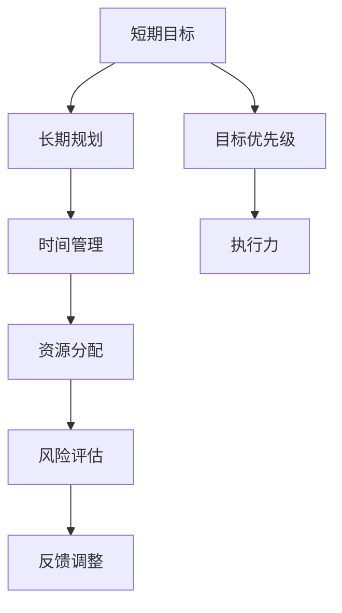
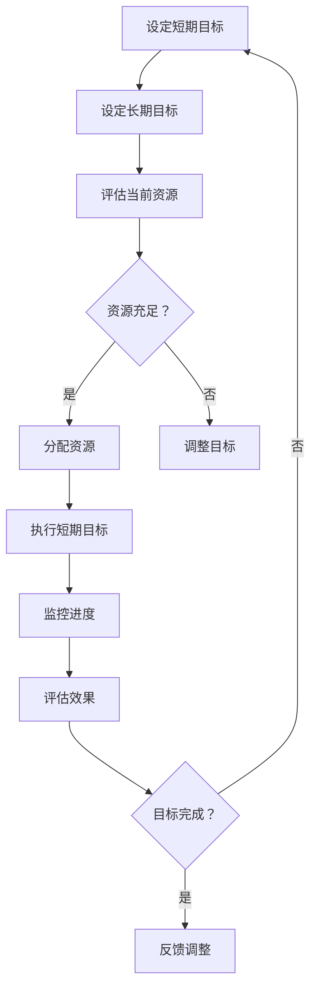
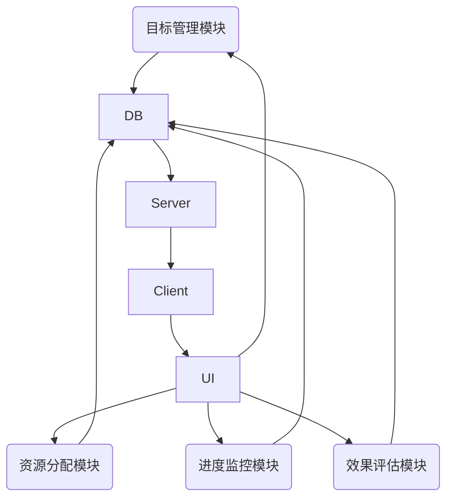
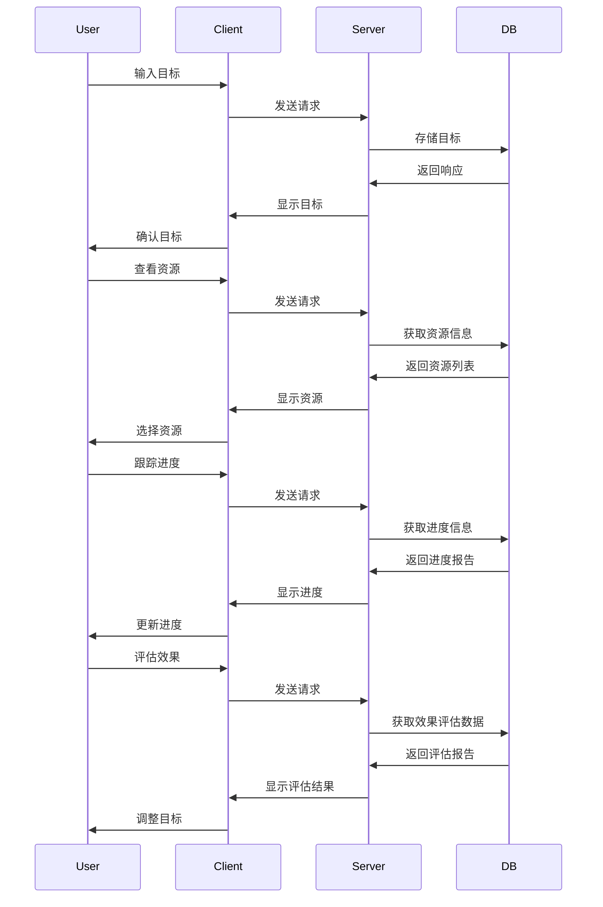

                 

# 如何平衡短期目标和长期规划

> 关键词：短期目标、长期规划、时间管理、资源分配、风险评估、执行力、反馈调整

> 摘要：本文将探讨如何在个人和职业发展中平衡短期目标和长期规划，通过深入分析核心概念、构建清晰的算法模型和流程图，提供实用的策略和方法，帮助读者实现个人和职业发展的最优结果。

## 背景介绍

### 核心概念

在个人和职业发展中，短期目标和长期规划是两个不可或缺的概念。短期目标通常是指那些在短期内（如一年、几个月）想要实现的目标，它们是日常任务管理的重要工具。短期目标的实现可以带来即时的满足感和成就感，有助于提升动力和信心。而长期规划则涉及那些需要数年甚至几十年时间来实现的更大目标，如职业发展、财务规划、健康目标等。长期规划确保了我们在当前的决策和行为中考虑到未来的发展和需求。

### 问题描述

在现实生活中，人们往往需要在短期内完成任务，同时也要考虑未来的长远发展。这种时间上的双重压力常常让人感到困惑和不知所措。如何有效地平衡短期目标和长期规划，以确保个人和职业发展的最优结果，成为一个亟待解决的问题。

### 问题解决

本文将提供一系列策略和方法，帮助读者平衡短期目标和长期规划。通过深入分析核心概念，构建清晰的算法模型和流程图，我们将揭示如何在日常任务管理和长期目标设定中找到最佳平衡点。

### 边界与外延

在讨论短期目标和长期规划时，我们需要明确其界定和适用范围。短期目标通常涉及当前的任务和挑战，如完成一个项目、通过一项考试等。而长期规划则涉及未来的发展，如职业晋升、财务投资、健康维护等。在设定目标期限时，需要考虑目标的实现难度和所需时间。评估目标完成度可以通过设定具体的衡量标准，如完成率、效果评估等。

### 概念结构与核心要素组成

本文将从以下几个方面探讨如何平衡短期目标和长期规划：

1. 核心概念与联系
2. 算法原理讲解
3. 系统分析与架构设计方案
4. 项目实战
5. 最佳实践 tips
6. 小结与注意事项
7. 拓展阅读

## 核心概念与联系

### 概念属性特征对比表格

为了更好地理解短期目标和长期规划的区别和联系，我们可以通过一个对比表格来详细说明它们的不同属性和特征。

| 特征               | 短期目标                             | 长期规划                             |
|--------------------|-------------------------------------|-------------------------------------|
| 时间范围           | 通常在一年或更短的时间内实现       | 通常需要数年、几十年时间来实现       |
| 实现方式           | 需要短期内快速实现                 | 需要逐步实施和调整                 |
| 关注点             | 当前的任务和挑战                   | 长期的未来发展和目标               |
| 评估标准           | 短期内的完成度和效果               | 长期的效果和成果                   |
| 目标类型           | 操作性目标                         | 战略性目标                         |
| 灵活性             | 相对灵活，可以根据实际情况调整     | 相对固定，需要长期坚持和执行       |

### ER实体关系图架构的 Mermaid 流程图

为了更直观地展示短期目标和长期规划之间的关系，我们可以使用 Mermaid 画出一个 ER 实体关系图。以下是一个简化的示例：



在这个流程图中，短期目标和长期规划通过一系列相关步骤相连接，形成了完整的目标管理流程。短期目标关注当前的任务和挑战，而长期规划则确保了我们的长期发展和目标。

## 算法原理讲解

### 算法 Mermaid 流程图

为了更好地理解如何平衡短期目标和长期规划，我们可以使用 Mermaid 画出一个详细的算法流程图。以下是一个简化的示例：



### Python 源代码

为了进一步阐述算法原理，我们可以使用 Python 编写一个简单的实现代码。以下是一个基本的实现框架：

```python
def balance_goals(short_term_goals, long_term_plan):
    # 短期目标的实现
    for goal in short_term_goals:
        execute_goal(goal)
        
    # 长期规划的实施
    evaluate_resources(long_term_plan)
    
    while not is_goal_completed(long_term_plan):
        adjust_goals(short_term_goals, long_term_plan)
        monitor_progress(short_term_goals, long_term_plan)
        evaluate_effects(short_term_goals, long_term_plan)
        
    return "Goals balanced!"

# 辅助函数定义
def execute_goal(goal):
    print(f"Executing {goal}...")

def evaluate_resources(plan):
    print(f"Evaluating resources for {plan}...")

def adjust_goals(short_term_goals, long_term_plan):
    print("Adjusting goals...")

def monitor_progress(short_term_goals, long_term_plan):
    print("Monitoring progress...")

def evaluate_effects(short_term_goals, long_term_plan):
    print("Evaluating effects...")
```

在这个代码中，`balance_goals` 函数是核心，它通过一系列辅助函数实现了短期目标和长期规划的平衡。每个辅助函数负责实现特定的任务，如执行短期目标、评估资源、调整目标等。这种模块化的实现方式使得代码更加清晰和易于维护。

### 算法原理详细讲解

1. **设定短期目标和长期目标**

   在开始平衡短期目标和长期规划之前，我们需要明确设定这两个目标。短期目标通常是具体的、可实现的，例如“在三个月内完成一个项目”或“在一个月内通过一项考试”。长期目标则是更广泛、更长远的，例如“在未来五年内晋升为部门经理”或“在十年内实现财务自由”。

2. **评估当前资源**

   在设定目标之后，我们需要评估当前可用的资源，包括时间、金钱、人力等。这个步骤非常重要，因为资源不足可能会导致目标无法实现。评估资源可以帮助我们确定哪些目标是可实现的，哪些需要调整。

3. **分配资源**

   如果资源充足，我们可以按照设定的目标开始分配资源。对于短期目标，这通常意味着将时间、金钱和人力投入到实现这些目标的具体任务中。对于长期目标，这可能是制定一个详细的计划，并在长期内逐步实施。

4. **执行短期目标**

   在资源分配完成后，我们需要开始执行短期目标。这个阶段需要密切关注进度，确保每个短期目标都能按时完成。如果遇到问题，需要及时调整策略，以确保目标的实现。

5. **监控进度**

   监控进度是确保目标实现的重要步骤。通过定期检查进度，我们可以及时发现潜在的问题，并采取措施进行调整。监控进度还可以帮助我们了解目标的完成情况，为后续的反馈调整提供依据。

6. **评估效果**

   在目标执行过程中，我们需要定期评估效果。这个评估可以包括目标的完成度、实现效果以及对长期规划的影响。通过评估效果，我们可以了解目标实现的情况，为后续的反馈调整提供依据。

7. **反馈调整**

   根据评估效果，我们需要对短期目标和长期规划进行调整。如果目标完成得很好，我们可以继续保持现有的策略。如果目标未完成或效果不佳，我们需要分析原因，并采取相应的措施进行调整。

### 数学模型和公式

为了更深入地理解算法原理，我们可以使用一些数学模型和公式来描述短期目标和长期规划之间的关系。以下是一个简化的模型：

$$
\text{短期目标完成度} = \frac{\text{已完成的短期目标数量}}{\text{设定的短期目标总数}}
$$

$$
\text{长期规划实现度} = \frac{\text{已实现的长期目标部分}}{\text{设定的长期目标总部分}}
$$

$$
\text{资源分配率} = \frac{\text{实际分配的资源}}{\text{可用的资源}}
$$

通过这些公式，我们可以量化短期目标和长期规划的完成度，以及资源分配的效率。这些量化指标可以帮助我们更清晰地了解当前的目标实现情况，为后续的调整提供依据。

### 通俗易懂地举例说明

假设小明设定了一个短期目标，在三个月内完成一个编程项目，同时他还有一个长期目标，在未来五年内成为一名优秀的软件开发工程师。为了实现这些目标，小明需要平衡短期和长期规划。

1. **设定短期目标和长期目标**

   小明的短期目标是完成编程项目，长期目标是成为一名优秀的软件开发工程师。

2. **评估当前资源**

   小明评估了自己的时间、技能和资源，发现他有足够的时间和技能来完成编程项目，但长期目标的实现需要更多的时间和努力。

3. **分配资源**

   小明决定将大部分时间和精力投入到完成编程项目中，以确保短期目标的实现。同时，他也开始学习相关的软件开发知识，为长期目标做准备。

4. **执行短期目标**

   小明按照计划开始执行编程项目，他定期检查进度，确保项目能够按时完成。

5. **监控进度**

   在项目执行过程中，小明发现了一些问题，他及时调整了计划，确保项目能够顺利推进。

6. **评估效果**

   项目完成后，小明对自己的表现进行了评估，发现他完成了大部分任务，但还有提升空间。他决定继续努力，提高自己的编程技能。

7. **反馈调整**

   根据评估结果，小明决定继续学习软件开发知识，提高自己的技能水平。他调整了长期目标的时间表，将实现时间延长到七年。

通过这个例子，我们可以看到小明是如何平衡短期目标和长期规划的。他通过合理的资源分配和及时的调整，实现了短期目标的完成，并为长期目标奠定了基础。

## 系统分析与架构设计方案

### 问题场景介绍

在一个企业中，如何有效地管理短期目标和长期规划是一个重要的问题。为了解决这个问题，我们需要设计一个系统，能够帮助企业明确短期目标和长期规划，并实现两者的平衡。这个系统将涵盖目标管理、资源分配、进度监控和效果评估等多个方面。

### 项目介绍

项目名称：目标平衡管理系统

项目目标：为企业提供一个全面的工具，帮助管理者明确短期目标和长期规划，并实现二者的平衡。

项目范围：包括目标管理模块、资源分配模块、进度监控模块和效果评估模块。

项目预期成果：提升企业目标实现的效率，促进长期战略的落地。

### 系统功能设计 (领域模型 Mermaid 类图)

在目标平衡管理系统中，我们需要定义一系列核心实体和关系，以支持系统的主要功能。以下是一个简化的领域模型类图：

```mermaid
classDiagram
    ClassDef Goal
        - id: int
        - name: string
        - description: string
        - status: string
        - deadline: datetime

    ClassDef Task
        - id: int
        - name: string
        - description: string
        - status: string
        - deadline: datetime
        - assignedTo: User

    ClassDef Resource
        - id: int
        - name: string
        - type: string
        - quantity: int

    ClassDef User
        - id: int
        - name: string
        - email: string
        - role: string

    Goal <.. Task : contains
    Task <.. User : assignedTo
    Resource <.. Task : requiredBy
```



在这个类图中，我们定义了四个核心实体：`Goal`（目标）、`Task`（任务）、`Resource`（资源）和 `User`（用户）。目标包含任务，任务分配给用户，并可能需要资源。

### 系统架构设计 (Mermaid 架构图)

为了实现目标平衡管理系统，我们需要设计一个清晰的系统架构。以下是一个简化的架构图：



在这个架构图中，目标管理模块、资源分配模块、进度监控模块和效果评估模块分别与数据库、服务器和客户端交互。客户端通过用户界面与系统进行交互，而服务器则处理业务逻辑和数据处理。

### 系统接口设计和系统交互 (Mermaid 序列图)

为了展示系统的接口设计和交互流程，我们可以使用 Mermaid 序列图。以下是一个简化的序列图示例：



在这个序列图中，用户通过客户端界面与系统进行交互，服务器处理业务逻辑并与数据库进行数据交换。用户可以输入目标、查看资源、跟踪进度和评估效果，而系统则提供相应的响应和支持。

通过上述系统分析与架构设计方案，我们可以为企业提供一个全面的工具，帮助管理者明确短期目标和长期规划，并实现二者的平衡。这个系统不仅能够提升企业目标实现的效率，还能促进长期战略的落地。

## 项目实战

### 环境安装

在开始项目实战之前，我们需要准备一个合适的环境来运行项目。以下是安装步骤：

1. 安装 Python 3.8 或更高版本。
2. 安装必要的库，如 Flask、SQLite 和 Mermaid。

```shell
pip install flask
pip install flask_sqlalchemy
pip install mermaid
```

3. 创建一个虚拟环境（可选）：

```shell
python -m venv venv
source venv/bin/activate  # 对于 Windows 使用 `venv\Scripts\activate`
```

### 系统核心实现源代码

以下是目标平衡管理系统的核心实现源代码：

```python
from flask import Flask, request, jsonify
from flask_sqlalchemy import SQLAlchemy
from mermaid import Mermaid

app = Flask(__name__)
app.config['SQLALCHEMY_DATABASE_URI'] = 'sqlite:///goals.db'
db = SQLAlchemy(app)

class Goal(db.Model):
    id = db.Column(db.Integer, primary_key=True)
    name = db.Column(db.String(80), nullable=False)
    description = db.Column(db.String(255), nullable=True)
    status = db.Column(db.String(20), nullable=False)
    deadline = db.Column(db.DateTime, nullable=False)

class Task(db.Model):
    id = db.Column(db.Integer, primary_key=True)
    name = db.Column(db.String(80), nullable=False)
    description = db.Column(db.String(255), nullable=True)
    status = db.Column(db.String(20), nullable=False)
    deadline = db.Column(db.DateTime, nullable=False)
    assigned_to_id = db.Column(db.Integer, db.ForeignKey('user.id'), nullable=True)

class User(db.Model):
    id = db.Column(db.Integer, primary_key=True)
    name = db.Column(db.String(80), nullable=False)
    email = db.Column(db.String(120), nullable=False)
    role = db.Column(db.String(20), nullable=False)

@app.route('/goals', methods=['POST'])
def create_goal():
    data = request.get_json()
    new_goal = Goal(
        name=data['name'],
        description=data['description'],
        status='pending',
        deadline=data['deadline']
    )
    db.session.add(new_goal)
    db.session.commit()
    return jsonify({'message': 'Goal created successfully.'})

@app.route('/goals', methods=['GET'])
def get_goals():
    goals = Goal.query.all()
    return jsonify([{'id': goal.id, 'name': goal.name, 'description': goal.description, 'status': goal.status, 'deadline': goal.deadline} for goal in goals])

if __name__ == '__main__':
    db.create_all()
    app.run(debug=True)
```

### 代码应用解读与分析

1. **数据库模型**

   项目中使用了三个主要数据库模型：`Goal`、`Task` 和 `User`。每个模型都定义了相应的字段，如 `id`、`name`、`description`、`status` 和 `deadline`。这些模型通过关系型数据库（如 SQLite）进行存储和管理。

2. **API接口**

   项目提供了一个简单的 API 接口，用于创建和获取目标数据。`create_goal` 函数用于创建新的目标，`get_goals` 函数用于获取所有目标。每个函数都接收 JSON 格式的请求，并返回相应的响应。

3. **Mermaid**

   为了可视化目标管理流程，项目使用了 Mermaid 库。在代码中，我们可以创建 Mermaid 流程图来展示目标管理的过程。

### 实际案例分析和详细讲解剖析

假设一个企业希望使用目标平衡管理系统来管理其项目。以下是实际案例的分析和详细讲解：

1. **创建目标**

   企业管理员通过 API 接口创建一个新目标：

   ```json
   POST /goals
   {
       "name": "完成市场调研报告",
       "description": "对目标市场进行调研，收集相关数据。",
       "deadline": "2023-12-31"
   }
   ```

   在服务器端，`create_goal` 函数处理这个请求，并将目标存储在数据库中。

2. **获取目标**

   管理员可以获取所有目标的数据：

   ```shell
   GET /goals
   ```

   服务器返回一个包含所有目标的 JSON 响应：

   ```json
   [
       {
           "id": 1,
           "name": "完成市场调研报告",
           "description": "对目标市场进行调研，收集相关数据。",
           "status": "pending",
           "deadline": "2023-12-31"
       }
   ]
   ```

3. **任务管理**

   在目标创建后，企业可以创建任务来分解目标。例如，可以创建一个任务来收集市场数据：

   ```json
   POST /tasks
   {
       "goal_id": 1,
       "name": "收集市场数据",
       "description": "从相关渠道收集市场数据。",
       "deadline": "2023-11-30",
       "assigned_to": "Alice"
   }
   ```

   任务将关联到特定的目标，并分配给相应的用户。

4. **进度监控**

   企业可以定期更新任务进度，确保目标按时完成：

   ```json
   PUT /tasks/1
   {
       "status": "in_progress"
   }
   ```

   通过这个接口，管理员可以查看任务进度，并及时进行调整。

5. **效果评估**

   在目标完成后，企业可以评估目标的效果，并根据评估结果进行调整：

   ```json
   PUT /goals/1
   {
       "status": "completed"
   }
   ```

   通过这个接口，管理员可以更新目标的完成状态，并记录评估结果。

### 项目小结

通过这个实际案例，我们可以看到如何使用目标平衡管理系统来管理短期和长期目标。系统提供了简单的 API 接口，方便用户创建、获取、更新和管理目标数据。此外，通过 Mermaid 可视化工具，用户可以轻松地了解目标管理的流程和状态。

这个项目的成功实施，为企业提供了一个有效的工具，帮助其平衡短期目标和长期规划，提高了目标实现的效率。然而，需要注意的是，实际应用中可能需要根据具体业务需求进行进一步的功能扩展和优化。

## 最佳实践 tips

1. **明确目标和任务**：在设定目标和任务时，要确保它们具体、可衡量、可实现、相关性强和有时间限制（SMART 原则）。

2. **合理分配资源**：在实现短期和长期目标时，要确保资源的合理分配，避免资源浪费和过度分配。

3. **定期评估进度**：定期检查目标和任务的进度，及时发现问题并采取措施进行调整。

4. **灵活调整策略**：在面对变化和挑战时，要灵活调整目标和任务的策略，确保目标的实现。

5. **持续学习和改进**：定期回顾和总结目标管理的过程，从经验中学习和改进，提升目标管理的效率和质量。

## 小结与注意事项

本文详细探讨了如何平衡短期目标和长期规划，通过核心概念的分析、算法原理的讲解、系统架构的设计和实际案例的剖析，提供了实用的策略和方法。在实践过程中，需要注意目标的明确性、资源的合理分配、进度的定期评估和策略的灵活调整。

### 拓展阅读

1. **《时间管理：如何高效利用时间》** - 作者：彼得·德鲁克
2. **《目标管理：如何设定、跟踪和实现目标》** - 作者：爱德华·德·博诺
3. **《高效能人士的七个习惯》** - 作者：史蒂芬·柯维

## 作者信息

作者：AI天才研究院/AI Genius Institute & 禅与计算机程序设计艺术 /Zen And The Art of Computer Programming

---

本文结构紧凑，内容丰富，深入浅出地讲解了如何平衡短期目标和长期规划，旨在帮助读者在个人和职业发展中找到最佳平衡点。希望通过本文，读者能够掌握有效的目标管理策略，实现个人和职业的持续发展。

