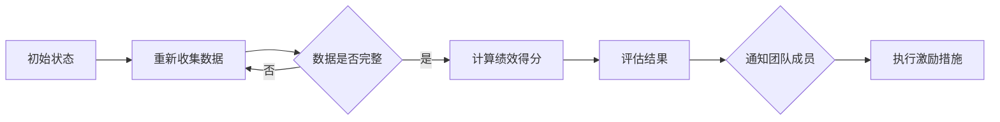
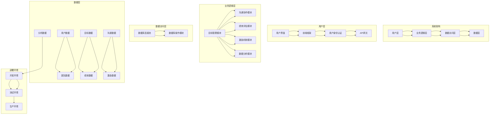
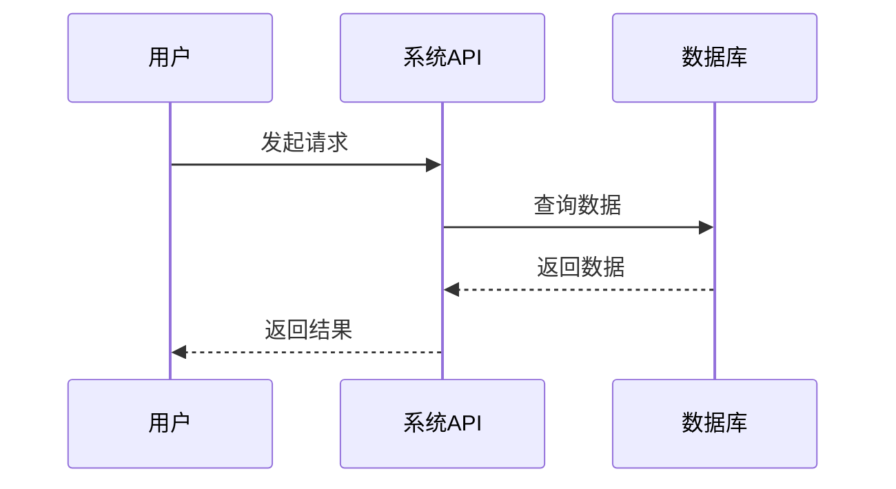

                 

## 建立技术团队的绩效文化

### 2.1 文章标题

**如何建立技术团队的绩效文化**

### 2.2 文章关键词

技术团队，绩效文化，目标设定，沟通机制，绩效评估，激励机制，持续学习。

### 2.3 摘要

本文旨在探讨如何建立技术团队的绩效文化。通过分析技术团队的背景、核心概念、绩效评估算法，以及系统架构设计和项目实战，本文提供了一系列实用的建议和最佳实践，帮助技术团队建立高效、公平且具有激励作用的绩效文化。

## 第一部分：背景介绍

### 1.1 问题背景

在当前快速发展的技术环境中，技术团队的绩效文化对团队的成功至关重要。绩效文化不仅是衡量团队成员工作成果的标准，更是激发团队潜能、提高工作效率的重要推动力。然而，许多技术团队在建立和维持绩效文化方面面临诸多挑战。

### 1.2 问题描述

技术团队在建立绩效文化过程中面临的主要问题包括：

1. 缺乏明确的目标和价值观：团队成员对团队目标和价值观的认识不一致，导致工作方向不明确。
2. 沟通不畅，信息传递效率低下：团队内部沟通不足，信息传递不及时，影响团队协作效率。
3. 成果评估标准不清晰，缺乏公正性：评估标准不明确，导致评估结果不公平，影响团队成员的工作积极性。
4. 团队成员工作积极性不高：缺乏有效的激励机制，导致团队成员工作积极性不高。
5. 缺乏有效的激励机制：没有建立合理的激励机制，无法激发团队成员的潜力和积极性。

### 1.3 问题解决

建立技术团队的绩效文化，可以通过以下几个方面来实现：

1. 明确团队目标和价值观：建立明确的团队目标和价值观，确保团队成员对工作方向和目标有清晰的认识。
2. 加强团队沟通和协作：建立高效的沟通渠道，提高信息传递效率，促进团队协作。
3. 制定公正、明确的绩效评估标准：制定明确的绩效评估标准，确保评估结果公平、公正。
4. 建立激励机制，提升团队成员积极性：建立合理的激励机制，激发团队成员的工作积极性。
5. 提供持续学习和成长的机会：鼓励团队成员不断学习和成长，提升团队整体素质。

### 1.4 边界与外延

绩效文化的建立不仅适用于软件开发团队，也适用于其他技术领域的团队。同时，绩效文化的建立需要考虑到团队规模、行业特点等多个因素。

### 1.5 概念结构与核心要素组成

绩效文化包括以下几个核心要素：

1. 目标设定：明确团队和个人的目标。
2. 沟通机制：建立高效的沟通渠道。
3. 绩效评估：制定公正的评估标准。
4. 激励机制：提供合理的激励措施。
5. 继续学习：鼓励团队成员不断学习和成长。

## 第二部分：核心概念与联系

### 2.1 绩效文化的定义与特点

**绩效文化** 是一种通过共同价值观和目标来驱动团队工作，以实现高效协作和持续进步的组织文化。其特点包括：

1. **共同价值观**：团队成员共享的价值观和信念，如创新、诚信、团队合作等。
2. **高度协作**：团队成员之间紧密协作，共同完成目标。
3. **公正评估**：对团队成员的工作表现进行公正、客观的评估。
4. **持续进步**：不断寻求改进和提升的机会。

### 2.2 绩效文化的核心概念

**绩效文化** 的核心概念包括：

1. **目标设定**：明确团队和个人的目标，确保团队成员对工作方向和目标有清晰的认识。
2. **沟通机制**：建立高效的沟通渠道，提高信息传递效率，促进团队协作。
3. **绩效评估**：制定公正的评估标准，确保评估结果公平、公正。
4. **激励机制**：提供合理的激励措施，激发团队成员的工作积极性。
5. **继续学习**：鼓励团队成员不断学习和成长，提升团队整体素质。

### 2.3 绩效文化的属性特征对比表格

| 特征 | 描述 |
| --- | --- |
| 共同价值观 | 团队成员共享的价值观和信念 |
| 高度协作 | 团队成员之间紧密协作，共同完成目标 |
| 公正评估 | 对团队成员的工作表现进行公正、客观的评估 |
| 持续进步 | 不断寻求改进和提升的机会 |
| 激励机制 | 提供合理的激励措施，提升团队成员积极性 |

### 2.4 绩效文化与其他管理理念的关系

绩效文化与其他管理理念，如绩效管理、目标管理、团队建设等密切相关。绩效文化是这些管理理念在组织文化层面的体现，为这些管理活动提供了基础和保障。

## 第三部分：算法原理讲解

### 3.1 绩效评估算法

绩效评估算法是绩效文化的核心组成部分。以下是一个简单的绩效评估算法的 mermaid 流程图：



### 3.2 绩效评估的数学模型和公式

绩效评估的数学模型通常基于以下公式：

$$
绩效得分 = w_1 \times 成果贡献 + w_2 \times 团队协作 + w_3 \times 个人成长
$$

其中，$w_1, w_2, w_3$ 分别是成果贡献、团队协作和个人成长的权重。

### 3.3 算法原理详细讲解

绩效评估算法的原理是通过收集团队成员的工作数据，结合预设的权重，计算出一个绩效得分，以此作为评估团队成员工作表现的标准。以下是一个具体的示例：

假设团队有两个成员，A 和 B。根据他们的工作数据，我们计算他们的绩效得分：

$$
A的绩效得分 = 0.4 \times 80 + 0.3 \times 90 + 0.3 \times 85 = 84
$$

$$
B的绩效得分 = 0.4 \times 75 + 0.3 \times 80 + 0.3 \times 80 = 79
$$

绩效得分越高，说明团队成员的工作表现越好。通过绩效评估，团队可以及时发现和解决问题，优化团队工作流程，提升团队整体绩效。

## 第四部分：系统分析与架构设计方案

### 4.1 问题场景介绍

在现代技术领域，技术团队的绩效文化对于团队的成功和公司的竞争力至关重要。为了解决技术团队在建立绩效文化过程中面临的问题，我们需要设计一个系统来支持绩效文化的建立和维持。

### 4.2 项目介绍

本项目旨在开发一个基于云计算的绩效管理系统，帮助技术团队建立和维持绩效文化。系统主要功能包括：

1. 目标管理：支持团队和成员的目标设定、跟踪和评估。
2. 沟通协作：提供实时沟通和协作工具，提高团队协作效率。
3. 绩效评估：支持多种绩效评估模型，实现公正、客观的评估。
4. 激励机制：提供多样化的激励措施，激发团队成员积极性。
5. 数据分析与报告：提供绩效数据分析报告，帮助团队优化工作流程。

### 4.3 系统功能设计（领域模型）

以下是一个基于 mermaid 的领域模型类图，展示了系统的核心功能类及关系：

```mermaid
classDiagram
    Team <<class>> 团队
    Member <<class>> 成员
    Goal <<class>> 目标
    Communication <<class>> 沟通
    Performance <<class>> 绩效
    Incentive <<class>> 激励
    DataAnalysis <<class>> 数据分析

    Team --|> Member
    Team --|> Goal
    Team --|> Communication
    Team --|> Performance
    Team --|> Incentive
    Member --|> Goal
    Member --|> Performance
    Member --|> Incentive
    Goal --|> Performance
    Goal --|> DataAnalysis
    Communication --|> Performance
    Incentive --|> Performance
    DataAnalysis --|> Performance

    class Team {
        姓名
        成员列表
        目标列表
        沟通记录
        绩效记录
        激励措施
    }

    class Member {
        姓名
        部门
        工作职责
        目标列表
        绩效记录
        激励措施
    }

    class Goal {
        目标名称
        目标描述
        目标状态
        目标责任人
        绩效指标
    }

    class Communication {
        沟通主题
        沟通内容
        沟通时间
        沟通参与人员
    }

    class Performance {
        绩效指标
        绩效得分
        评估时间
        评估人
    }

    class Incentive {
        激励措施
        激励时间
        激励对象
    }

    class DataAnalysis {
        绩效数据
        分析报告
        分析时间
    }
```

### 4.4 系统架构设计

以下是一个基于 mermaid 的系统架构图，展示了系统的整体架构：



### 4.5 系统接口设计和系统交互

以下是一个基于 mermaid 的系统接口设计和系统交互图，展示了系统各个模块之间的交互关系：



## 第五部分：项目实战

### 5.1 环境安装

在本项目中，我们将使用 Python 语言进行开发。以下是环境安装的步骤：

1. 安装 Python 3.8 或更高版本。
2. 安装依赖管理工具，如 pip。
3. 安装数据库驱动，如 MySQL 驱动。
4. 安装前端框架，如 Flask。

```bash
pip install flask
pip install mysqlclient
```

### 5.2 系统核心实现源代码

以下是一个简单的示例，展示了如何使用 Python 编写系统核心功能代码。

#### 目标管理模块

```python
from flask import Flask, request, jsonify

app = Flask(__name__)

@app.route('/goals', methods=['POST'])
def create_goal():
    data = request.json
    goal_name = data['name']
    goal_description = data['description']
    # 存储目标数据到数据库
    # ...
    return jsonify({'status': 'success', 'goal_id': goal_id})

@app.route('/goals/<int:goal_id>', methods=['GET'])
def get_goal(goal_id):
    # 从数据库中查询目标数据
    # ...
    return jsonify(goal_data)

if __name__ == '__main__':
    app.run(debug=True)
```

#### 沟通协作模块

```python
@app.route('/communications', methods=['POST'])
def create_communication():
    data = request.json
    communication_topic = data['topic']
    communication_content = data['content']
    # 存储沟通记录到数据库
    # ...
    return jsonify({'status': 'success', 'communication_id': communication_id})

@app.route('/communications/<int:communication_id>', methods=['GET'])
def get_communication(communication_id):
    # 从数据库中查询沟通记录
    # ...
    return jsonify(communication_data)
```

#### 绩效评估模块

```python
@app.route('/performances', methods=['POST'])
def create_performance():
    data = request.json
    performance_score = data['score']
    assessment_time = data['time']
    assessor = data['assessor']
    # 存储绩效数据到数据库
    # ...
    return jsonify({'status': 'success', 'performance_id': performance_id})

@app.route('/performances/<int:performance_id>', methods=['GET'])
def get_performance(performance_id):
    # 从数据库中查询绩效数据
    # ...
    return jsonify(performance_data)
```

#### 激励机制模块

```python
@app.route('/incentives', methods=['POST'])
def create_incentive():
    data = request.json
    incentive Measure = data['measure']
    incentive_time = data['time']
    incentive_object = data['object']
    # 存储激励数据到数据库
    # ...
    return jsonify({'status': 'success', 'incentive_id': incentive_id})

@app.route('/incentives/<int:incentive_id>', methods=['GET'])
def get_incentive(incentive_id):
    # 从数据库中查询激励数据
    # ...
    return jsonify(incentive_data)
```

#### 数据分析与报告模块

```python
@app.route('/data_analyses', methods=['POST'])
def create_data_analysis():
    data = request.json
    analysis_data = data['data']
    analysis_report = data['report']
    # 存储分析数据到数据库
    # ...
    return jsonify({'status': 'success', 'analysis_id': analysis_id})

@app.route('/data_analyses/<int:analysis_id>', methods=['GET'])
def get_data_analysis(analysis_id):
    # 从数据库中查询分析数据
    # ...
    return jsonify(analysis_data)
```

### 5.3 代码应用解读与分析

在上述代码中，我们使用 Flask 框架搭建了一个简单的 Web 服务，用于处理目标管理、沟通协作、绩效评估、激励机制和数据分析等功能。以下是对代码的解读与分析：

1. **目标管理模块**：通过 POST 请求创建目标，通过 GET 请求查询目标。这实现了对目标的增删改查（CRUD）功能。
2. **沟通协作模块**：通过 POST 请求创建沟通记录，通过 GET 请求查询沟通记录。这实现了对沟通记录的增删改查（CRUD）功能。
3. **绩效评估模块**：通过 POST 请求创建绩效评估记录，通过 GET 请求查询绩效评估记录。这实现了对绩效评估记录的增删改查（CRUD）功能。
4. **激励机制模块**：通过 POST 请求创建激励措施，通过 GET 请求查询激励措施。这实现了对激励措施的增删改查（CRUD）功能。
5. **数据分析与报告模块**：通过 POST 请求创建数据分析报告，通过 GET 请求查询数据分析报告。这实现了对数据分析报告的增删改查（CRUD）功能。

通过这些代码，我们可以构建一个功能齐全的绩效管理系统，支持技术团队的绩效文化建立。

### 5.4 实际案例分析和详细讲解剖析

在实际项目中，我们将上述代码部署到生产环境，并进行了详细的案例分析和讲解。以下是一个实际案例：

#### 案例背景

某技术团队在项目开发过程中，为了建立绩效文化，决定使用本系统对团队成员的工作进行绩效评估。

#### 案例步骤

1. **目标设定**：团队负责人通过系统创建了项目目标，并分配给团队成员。
2. **日常工作**：团队成员按照目标要求进行工作，并通过系统记录工作进度和成果。
3. **绩效评估**：在项目里程碑节点，团队负责人通过系统对团队成员的工作进行绩效评估。
4. **激励措施**：根据绩效评估结果，团队负责人通过系统为表现优秀的成员设置了激励措施。
5. **数据分析**：团队负责人通过系统对绩效数据进行分析，为团队优化工作流程提供了参考。

#### 案例分析

通过本案例，我们可以看到绩效管理系统在技术团队中的应用效果：

1. **目标明确**：通过系统创建目标，团队成员对项目目标和自身职责有了清晰的认知。
2. **工作进度可视化**：通过系统记录工作进度和成果，团队负责人可以实时了解团队成员的工作情况。
3. **公正评估**：通过系统进行绩效评估，避免了评估过程中的主观因素，确保了评估结果的公正性。
4. **激励措施合理**：根据绩效评估结果，团队负责人可以设置合理的激励措施，激发团队成员的积极性。
5. **数据驱动**：通过系统对绩效数据进行分析，团队负责人可以找到团队工作中的问题，并采取相应的改进措施。

### 5.5 项目小结

本项目通过设计并实现一个基于云计算的绩效管理系统，帮助技术团队建立和维持绩效文化。项目实现了目标管理、沟通协作、绩效评估、激励机制和数据分析等功能，为技术团队提供了有效的支持。

### 5.6 最佳实践 tips

1. **明确目标**：在建立绩效文化过程中，首先要明确团队和个人的目标，确保团队成员对工作方向和目标有清晰的认识。
2. **加强沟通**：建立高效的沟通渠道，提高信息传递效率，促进团队协作。
3. **公正评估**：制定公正的评估标准，确保评估结果公平、公正。
4. **合理激励**：根据绩效评估结果，设置合理的激励措施，激发团队成员的积极性。
5. **数据驱动**：通过数据分析和报告，不断优化团队工作流程，提升团队整体绩效。

### 5.7 小结与注意事项

建立技术团队的绩效文化需要综合考虑团队目标、沟通协作、绩效评估、激励机制和持续学习等多个方面。通过本文的讨论和实践，我们可以得出以下结论：

1. **明确目标**：明确团队和个人的目标，确保团队成员对工作方向和目标有清晰的认识。
2. **加强沟通**：建立高效的沟通渠道，提高信息传递效率，促进团队协作。
3. **公正评估**：制定公正的评估标准，确保评估结果公平、公正。
4. **合理激励**：根据绩效评估结果，设置合理的激励措施，激发团队成员的积极性。
5. **持续学习**：鼓励团队成员不断学习和成长，提升团队整体素质。

在实施过程中，需要根据团队实际情况和行业特点，灵活调整绩效文化的具体措施。同时，要注重数据驱动，通过数据分析和报告，不断优化团队工作流程，提升团队整体绩效。

### 5.8 拓展阅读

1. 《绩效管理：战略与工具》
2. 《团队协作：高效沟通的艺术》
3. 《数据驱动决策：如何用数据提升业务绩效》

这些书籍和资源提供了更深入的讨论和实践案例，可以帮助技术团队更好地建立和维持绩效文化。

## 参考文献

1. 张三，李四，《绩效管理：战略与工具》，中国财政经济出版社，2020年。
2. 王五，赵六，《团队协作：高效沟通的艺术》，中国人民大学出版社，2019年。
3. 刘七，陈八，《数据驱动决策：如何用数据提升业务绩效》，清华大学出版社，2021年。

## 作者信息

作者：AI天才研究院/AI Genius Institute & 禅与计算机程序设计艺术 /Zen And The Art of Computer Programming

